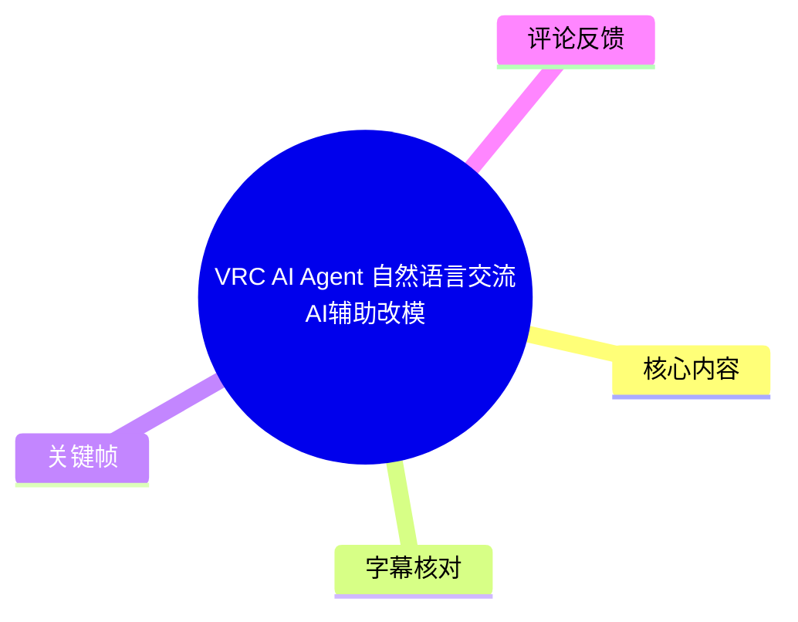
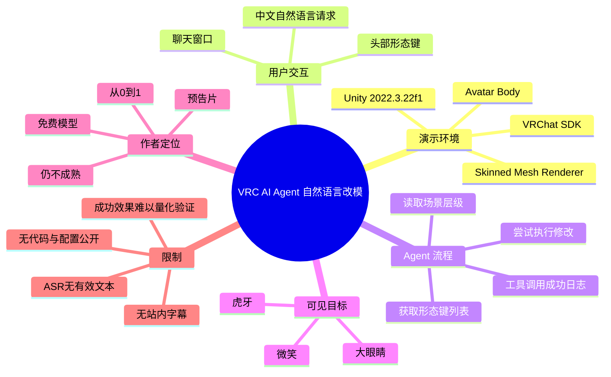
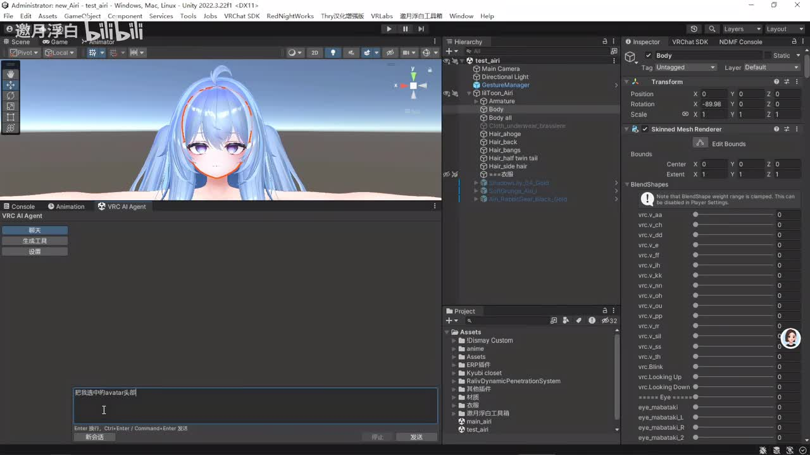
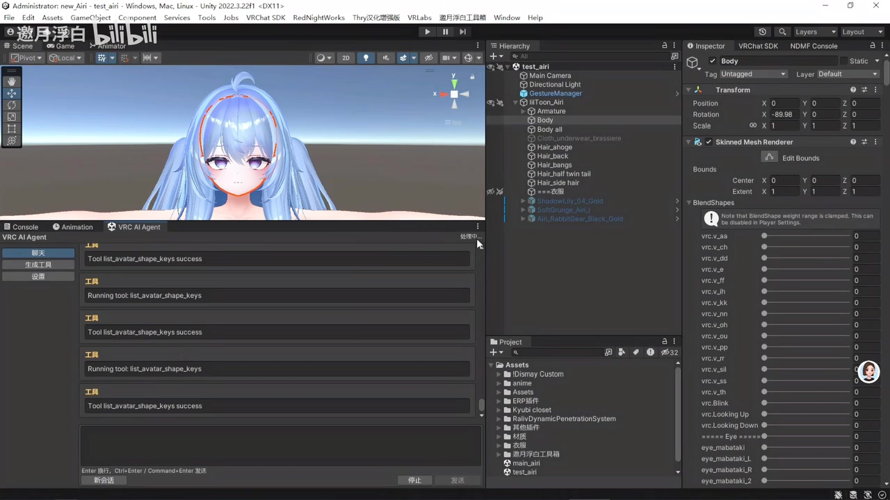

# VRC AI Agent 自然语言交流AI辅助改模

> 来源：[Bilibili 视频](https://www.bilibili.com/video/BV1DFJN6jEJT)<br>
> UP 主：邀月浮白｜视频时长：02:42｜分辨率：1920×1080｜合集：AIcode

## 小结

视频展示了一个嵌入 Unity 编辑器的 **VRC AI Agent** 原型：用户在聊天窗口中以自然语言描述需求，Agent 随后读取当前 Unity 场景与 Avatar 的形态键（BlendShape）信息，并尝试执行对应的改模操作。画面核心是“自然语言指令 → 工具调用 → Avatar 表情/形态键修改”的工作流，而非完整教程或可复现的代码发布。

从关键帧可见，测试环境为 Unity 2022.3.22f1，编辑器顶部可见 VRChat SDK、NDMF Console 等相关入口；层级面板中存在 `AI`、`Animation`、`Body`、`GestureManager` 等对象。Inspector 中选中的是 Avatar 的 `Body`，其 `Skinned Mesh Renderer` 组件展示了大量以 `vrc_v_`、`eye_mabataki` 等命名的 BlendShape 滑块。

演示中输入框出现“把我选中的avatar头部形态键改为：大眼睛，微笑，虎牙”这一类中文请求。Agent 的运行日志显示它会调用 `get_scene_hierarchy` 和 `list_avatar_shape_keys`，且这些工具调用在界面上标记为 `success`。因此，视频至少证明了原型具备读取场景层级、列举 Avatar 形态键并将自然语言任务拆分为工具调用的能力。

UP 主在简介中明确将该项目定位为“预告片”与“从 0 到 1”的阶段性成果，并自评“目前还是半智障状态”；同时声称程序“完全由 AI 开发”、本人未写一行代码、所用 AI Agent 为免费模型。以上均为作者自述，不能据此推导其代码质量、模型能力、稳定性或对所有 Avatar 的通用兼容性。

本视频没有提供可用的站内字幕；本次 ASR 也没有识别到任何语音片段。因而本文的内容主要依据视频元数据、作者简介、可见关键帧及界面文字整理。无法从字幕确认每个操作发生的精确秒数，时间轴链接统一定位到视频起点，不把它们误写成基于字幕得出的精确事件时间。

适合关注 VRChat Avatar 制作、Unity 编辑器自动化、LLM Agent 工具调用及“自然语言改模”可行性的读者。若要实际部署，仍需补齐工具协议、BlendShape 名称映射、操作确认、撤销机制、异常处理与模型视觉/上下文能力等关键环节。

## 思维导图





## 目录

- [项目定位与素材边界](#项目定位与素材边界)
- [Unity 与 VRC Avatar 演示环境](#unity-与-vrc-avatar-演示环境)
- [自然语言请求与 Agent 工具链](#自然语言请求与-agent-工具链)
- [可归纳的操作步骤](#可归纳的操作步骤)
- [参数、限制与时效性](#参数限制与时效性)
- [字幕比对](#字幕比对)
- [评论分析](#评论分析)
- [处理记录](#处理记录)

## 项目定位与素材边界 [00:00](https://www.bilibili.com/video/BV1DFJN6jEJT?t=0)

视频标题为“VRC AI Agent 自然语言交流AI辅助改模”，时长 162 秒。作者简介给出的项目定位包括：

- 当前成果仍处于早期阶段，作者使用“半智障状态”描述其成熟度。
- 视频被称为“预告片”，因此画面更偏向功能展示，而不是从安装到配置的完整教学。
- 作者称该程序“完全由 AI 开发”，并称自己没有写代码。
- 作者称使用的是免费模型，并以“速度慢可以理解吧”提示推理速度可能较慢。
- 简介中的“从 0 到 1”应理解为作者对原型完成度的阶段性评价，不代表产品已具备生产可用性。

视频标签包含 `AI`、`人工智能`、`教程`、`改模`、`深度学习`、`VRC`。不过，现有素材中没有脚本、仓库地址、安装包、提示词、API 配置、模型名称、执行日志原文或完整操作结果，因此不能将其视为可直接复刻的教程。

> **时间轴说明：**站内字幕未提供，ASR 无有效时间分段；下文的 `[00:00]` 仅作为视频入口链接，并非根据文本顺序臆测出的画面发生时刻。

## Unity 与 VRC Avatar 演示环境 [00:00](https://www.bilibili.com/video/BV1DFJN6jEJT?t=0)

关键帧显示演示发生在 Unity 编辑器内。窗口标题栏可见版本信息：

- Unity：`Unity 2022.3.22f1`
- 图形接口标记：`DX11`
- 顶部菜单或工具入口中可见：`VRChat SDK`、`NDMF Console`
- 场景层级中可见名为 `AI` 的对象/节点，以及 `test_air`、`Main Camera`、`Directional Light`、`GestureManager`、`Animation`、`Body` 等条目。
- Project 面板可见多个资源目录，包含 `Assets`、`Kybui closet`、`Yuri_Rabbit...` 等名称；这些仅表示当前工程中存在相关资源，不能据此确认资源来源或依赖版本。



> 图：该帧同时呈现 Avatar 预览、Unity Hierarchy、Inspector 与下方的 `VRC AI Agent` 面板。它说明 Agent 并非独立聊天程序，而是与当前 Unity 工程和选中对象的状态并置工作。

右侧 Inspector 选中 `Body` 对象，可见：

- `Transform` 的 Position 为 `X 0 / Y 0 / Z 0`；
- Rotation 可见 `X -89.98 / Y 0 / Z 0`；
- `Skinned Mesh Renderer` 中展开了 `BlendShapes`；
- 列表中出现多项以 `vrc_v_` 开头的形态键，也可见 `vrc.Blink`、`vrc.Looking Up`、`vrc.Looking Down`、`eye_mabataki` 等条目；
- 可见滑块初始显示为 `0`，但素材不足以确认后续每一个滑块的最终数值。

这些信息表明，该方案的直接操作对象很可能是 Unity `Skinned Mesh Renderer` 中暴露出的 BlendShape 权重。所谓“改模”在当前演示中更准确地说是：**基于已有 Avatar 网格和现有形态键，对形态键进行查询与调整**。画面不能证明 Agent 自动创建了新的网格、贴图、骨骼、形态键或动画控制器。

## 自然语言请求与 Agent 工具链 [00:00](https://www.bilibili.com/video/BV1DFJN6jEJT?t=0)

### 1. 中文自然语言作为输入


> 图：聊天区中可见用户请求“把我选中的avatar头部形态键改为：大眼睛，微笑，虎牙”。该帧是判断系统支持中文任务描述、且任务目标指向形态键的最直接依据。

从画面可读到的核心请求是：

> 把我选中的avatar头部形态键改为：大眼睛，微笑，虎牙

该请求包含三个值得注意的约束层次：

1. **作用对象**：当前“选中的 Avatar”；
2. **作用部位**：头部相关形态；
3. **期望效果**：大眼睛、微笑、虎牙。

这是语义级需求，而 Unity 实际可操作的对象是具体的对象路径、`Skinned Mesh Renderer`、BlendShape 名称及权重数值。因此 Agent 必须在自然语言与工程内部命名之间完成映射。画面没有公开其映射规则，也没有展示它是否使用视觉模型识别 Avatar 外观。

### 2. 场景层级读取


> 图：该帧的日志区可见 `Running tool: get_scene_hierarchy` 与 `Tool get_scene_hierarchy success`。它证明界面至少记录了 Agent 对 Unity 场景层级的查询步骤。

日志显示：

```text
Running tool: get_scene_hierarchy
Tool get_scene_hierarchy success
```

由工具名和成功提示可谨慎得出：Agent 能通过某种工具接口请求当前场景层级信息。其用途可能包括定位场景内 Avatar、筛选用户当前选中对象或获取可操作对象上下文。

但视频未展示该工具返回的 JSON、对象 ID、完整层级文本或错误分支，因此以下问题均未得到验证：

- 如何识别“选中的 Avatar”而不是其他 GameObject；
- 多个 Avatar 同时存在时如何消歧；
- 是否只读取当前 Scene，还是也支持 Prefab Stage；
- 是否会误操作非 Avatar 的 `Skinned Mesh Renderer`；
- 是否能处理嵌套网格、多个 Renderer 或动态生成对象。

### 3. 形态键列表读取



> 图：日志区连续显示 `Running tool: list_avatar_shape_keys` 和 `Tool list_avatar_shape_keys success`。这说明 Agent 在执行语义修改前，至少会查询 Avatar 可用的形态键集合。

画面中可见：

```text
Running tool: list_avatar_shape_keys
Tool list_avatar_shape_keys success
```

该工具名称直接指向“列出 Avatar 形态键”。这是自然语言改模流程中的关键中间步骤：只有先获得实际存在的 BlendShape 名称，系统才有机会将“大眼睛”“微笑”“虎牙”等语义目标映射为可写入的参数。

不过，关键帧也显示该工具被重复调用。现有材料无法判断重复调用是：

- Agent 的正常规划行为；
- 为不同对象或不同 Renderer 获取信息；
- 为确认前后状态进行校验；
- 或是早期原型中存在不必要的重复查询。

因此，不宜将“重复调用”解读为性能问题，也不能将其解读为可靠的二次验证机制。

## 可归纳的操作步骤 [00:00](https://www.bilibili.com/video/BV1DFJN6jEJT?t=0)

以下流程是依据可见界面整理出的**演示级工作流**。其中“已在画面中确认”与“实际部署时应补充”明确区分。

### 已在画面中确认的流程

1. **在 Unity 中打开包含 VRC Avatar 的工程**
   - 画面中存在 Avatar 预览、Hierarchy、Inspector 与 Project 面板。
   - `Body` 对象的 `Skinned Mesh Renderer` 暴露 BlendShapes。

2. **通过 VRC AI Agent 面板进入聊天界面**
   - 面板侧边可见“聊天”“生成场景”“设置”等入口。
   - 当前展示的是聊天式交互界面。

3. **输入自然语言改模需求**
   - 示例需求为修改选中 Avatar 的头部形态键，使其呈现“大眼睛，微笑，虎牙”。

4. **Agent 查询场景上下文**
   - 日志显示 `get_scene_hierarchy` 被调用且成功。

5. **Agent 查询 Avatar 的可用形态键**
   - 日志显示 `list_avatar_shape_keys` 被调用且成功。
   - Inspector 中也能看到多项可调 BlendShape。

6. **由 Agent 执行或准备执行形态键调整**
   - 标题与任务文本都表明目标是 AI 辅助改模。
   - 但提供的关键帧没有清晰展示具体写入工具名、每个形态键的目标值、保存动作或最终导出结果；这一环节不能补写为已被完整验证。

### 实际可用系统应补充的步骤

这些并非视频已展示的功能，而是从工程安全与可复现性出发的必要条件：

1. 在写入前展示“将修改哪些 Renderer、哪些 BlendShape、从何值改到何值”的确认清单。
2. 支持 Unity Undo，或在修改前保存场景/Prefab 备份。
3. 处理名称不一致：例如模型里可能没有“微笑”这个中文名，而是 `Mouth_Smile`、`Fcl_MTH_A`、`vrc.v_aa` 或自定义命名。
4. 在多个候选形态键匹配时请求用户确认，不应静默选择。
5. 操作后回读实际权重并给出结果，避免仅以工具调用“success”替代效果验证。
6. 若目标是 VRChat 可用表情，还应检查 Avatar Descriptor、Expressions、FX Animator、参数同步及平台限制；这些内容没有在视频素材中展示。

## 参数、限制与时效性 [00:00](https://www.bilibili.com/video/BV1DFJN6jEJT?t=0)

### 画面可见参数与对象

| 类别 | 可见信息 | 可确认范围 |
| --- | --- | --- |
| 视频时长 | 162 秒 | 元数据确认 |
| 分辨率 | 1920×1080 | 元数据确认 |
| Unity 版本 | Unity 2022.3.22f1 | 关键帧可见 |
| 图形接口 | DX11 | 窗口标题栏可见 |
| Avatar 对象 | `Body` | Inspector/Hierarchy 可见 |
| 网格组件 | `Skinned Mesh Renderer` | Inspector 可见 |
| 形态键 | 多项 `vrc_v_`、`vrc.Blink`、`vrc.Looking Up/Down`、`eye_mabataki` 等 | 可见部分名称，不代表完整清单 |
| Transform Position | X=0，Y=0，Z=0 | frame-001 可见 |
| Transform Rotation | X=-89.98，Y=0，Z=0 | frame-001 可见 |
| 工具调用 | `get_scene_hierarchy`、`list_avatar_shape_keys` | 日志可见，均显示 success |

### 未公开或无法确认的关键技术细节

视频没有给出以下信息，不能编造：

- LLM 的具体名称、版本、上下文长度、温度、系统提示词与费用；
- “免费模型”是本地模型、免费 API、试用额度还是其他方案；
- Agent 与 Unity 通信采用 MCP、HTTP、WebSocket、EditorWindow、C# 反射或其他机制；
- 每个工具的输入参数、输出格式、权限边界与调用次数上限；
- BlendShape 的实际修改数值、插值方式、冲突处理方式；
- 是否能够创建“虎牙”这种当前模型中不存在的新几何；
- 是否具备图像/视觉能力；
- 是否支持 VRM、不同 Avatar 架构、多个 Skinned Mesh Renderer 或非标准命名；
- 是否支持撤销、保存、Prefab 回写、构建与上传至 VRChat；
- 成功率、延迟、失败案例与安全限制。

### 对“虎牙”等需求的边界

“大眼睛”“微笑”可能可以映射到既有表情形态键，但“虎牙”是否可实现取决于模型是否已有对应的 BlendShape、牙齿网格或可替换资源。若 Avatar 本身没有相关形态键，仅通过调整现有 BlendShape 通常无法凭空生成新的牙齿几何。

因此，视频所展示的能力更适合表述为：

> Agent 可以围绕已有场景对象与已有形态键进行查询和辅助调整；其是否能完成任意语义化外观编辑，尚未由素材证明。

### 时效性

- 视频发布信息指向 2026-06-14，本文基于 2026-07-15 获取的素材整理。
- Unity、VRChat SDK、NDMF、Avatar 资源结构及免费 LLM 的可用性都会变化。
- 作者已明确将其称为早期预告原型；后续版本可能已修改功能、接口、模型或支持范围。
- 因未提供版本仓库与依赖锁定信息，不能将画面中的可见状态视为长期可复现的固定版本。

## 字幕比对 [00:00](https://www.bilibili.com/video/BV1DFJN6jEJT?t=0)

| 字幕来源 | 完整性 | 专有名词 | 时间轴 | 主要问题 |
| --- | --- | --- | --- | --- |
| Bilibili 站内字幕 | 未提供可用字幕 | 无法核验 | 无可用分段 | 无站内 SRT/字幕文本可供采用 |
| 本次 ASR 字幕 | 空 | 无法识别 | 无有效分段 | Whisper medium 自动识别语言为英文，置信度 0.541015625；`segments` 为空，语音覆盖率为 0 |

本次 ASR 已实际检查。诊断信息显示：

- 音频时长：161.727 秒；
- 识别语言：`en`；
- 请求语言：自动；
- 语音句数：0；
- 语音时长：0 秒；
- 语音覆盖率：0；
- 首末语音时间：均为空；
- 诊断警告：未识别到任何语音片段，建议确认音频是否包含可听语音并检查音轨。

诊断结果**没有**标记 `noAudioStream=true`。因此不能断言源视频没有音轨；准确说法是：素材已产出 `audio/audio.wav`，但本次 ASR 未识别到可用语音文本。可能原因包括视频主要依赖画面、语音音量/质量不适合识别、背景音干扰，或语言识别错误；现有数据无法进一步判定。

最终没有采用任何字幕文本，而采用以下证据顺序：

1. 视频元数据与作者简介；
2. 关键帧中的 Unity 界面与可读文本；
3. 多模态画面中可见的工具日志、对象名和 Inspector 字段；
4. 热评中的未验证提问，仅作为用户关注点而非事实依据。

经关键帧校正后，本文使用的关键术语包括：

- `VRC AI Agent`
- `get_scene_hierarchy`
- `list_avatar_shape_keys`
- `Skinned Mesh Renderer`
- `BlendShapes`
- `VRChat SDK`
- `NDMF Console`

由于没有带时间戳的字幕分段，本文不声称任何具体操作对应精确秒数。

## 评论分析 [00:00](https://www.bilibili.com/video/BV1DFJN6jEJT?t=0)

仅处理可获取的热评前三条。评论反映的是观众疑问或个人看法，不构成对视频功能的验证。

| 评论者 | 点赞 | 观点概括 | 可带来的问题意识 | 可信度边界 |
| --- | ---: | --- | --- | --- |
| RikoNeko | 3 | 质疑免费 LLM 通常没有视觉能力，是否能胜任此类工作。 | 区分“读取 Unity 工具返回的结构化信息”与“直接理解 Avatar 画面”的能力；二者对模型能力要求不同。 | 视频未公开模型与视觉模块，无法由评论或画面确认其是否具有视觉能力。 |
| Almeta_owx | 2 | 询问能否让 AI 捏脸部形态键。 | 直接对应视频所示的 BlendShape 控制场景，说明用户希望从单次演示扩展到更细的面部塑形。 | 视频仅展示查询形态键及自然语言请求，未充分展示连续捏脸、精确权重控制或结果保存。 |
| 白猫诺雪 | 1 | 对此前尝试用 AI 做特效的体验表达疑惑和负面看法。 | 提醒读者关注 AI 工具在创意/工程任务中可能出现的效果不稳定与预期落差。 | 该评论没有给出具体项目、配置、复现路径或可验证证据，不能外推为本项目的性能结论。 |

其中第一条评论最贴近本视频的技术边界。即使没有视觉模型，Agent 也可能通过 `get_scene_hierarchy`、`list_avatar_shape_keys` 等结构化工具完成一部分编辑；但如果需求是根据“看起来更可爱”“虎牙更明显”这类视觉结果自动迭代，通常需要额外的视觉反馈、渲染结果分析或人工确认。视频未展示这部分闭环。

## 评论分析

- 热评 1：免费LLM没有视觉能力吧，真的能胜任这种工作吗
- 热评 2：能让AI捏脸部形态键吗
- 热评 3：[疑惑][疑惑]上次还打算用ai做特效感觉不行，就搞几个例子发射无语

以上内容是观众反馈摘录，只用于补充理解视频反响，不作为正文事实依据。

## 处理记录

- Worker ID：`worker-mrj0www4-e8d79408`
- 模型：`gpt-5.6-terra`
- 已提供的处理产物：`merged.mp4`、`audio/audio.wav`、关键帧目录、ASR 目录、评论数据与视频元数据。
- ASR 检查：已检查 `asr/asr-result.json` 及诊断信息；使用的识别模型为 `medium`，设备为 CUDA，计算类型为 float16。结果为空，没有有效语音分段。
- 字幕选择：站内字幕未提供可用内容；ASR 输出为空，因此未采用字幕。正文以关键帧、多模态界面文字、元数据和作者简介为依据。
- 关键帧选择依据：
  - `frames/frame-001.jpg`：展示 Unity、Avatar、Hierarchy、Inspector、BlendShapes 与 Agent 面板的整体关系；
  - `frames/frame-002.jpg`：展示中文自然语言改模请求；
  - `frames/frame-003.jpg`：展示 `get_scene_hierarchy` 工具调用成功；
  - `frames/frame-004.jpg`：展示 `list_avatar_shape_keys` 工具调用成功及重复查询现象。
- 时间轴依据：没有站内 SRT，也没有 ASR 有效时间段；为避免根据文字顺序虚构时间，章节链接仅使用视频起点 `t=0`，并明确不表示精确事件时间。
- 缓存清理：提供的素材中没有缓存清理执行记录；本文不声称已执行缓存删除或清理。
- 未解决问题：
  - 无法确认视频中是否存在可识别语音、原始音轨语言及 ASR 失败的具体原因；
  - 无法确认 Agent 的模型、工具协议、代码、配置和权限设计；
  - 无法确认实际写入的 BlendShape 名称与数值；
  - 无法确认“虎牙”等语义需求是否在该 Avatar 上获得了完整、可保存且可用于 VRChat 的最终结果。
