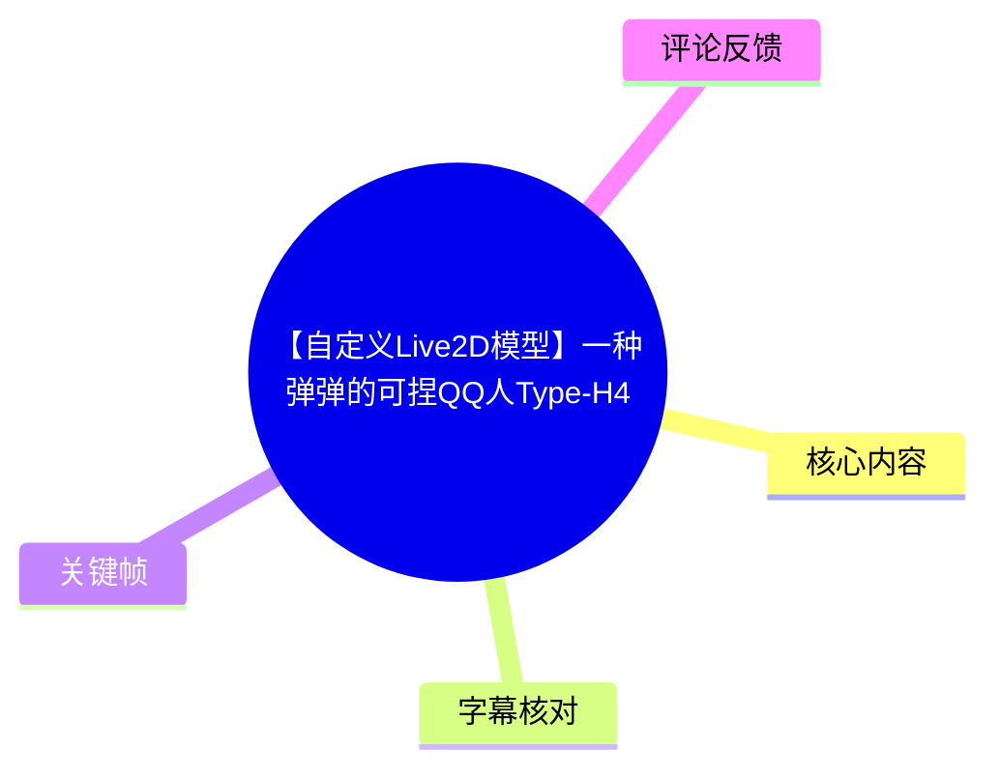
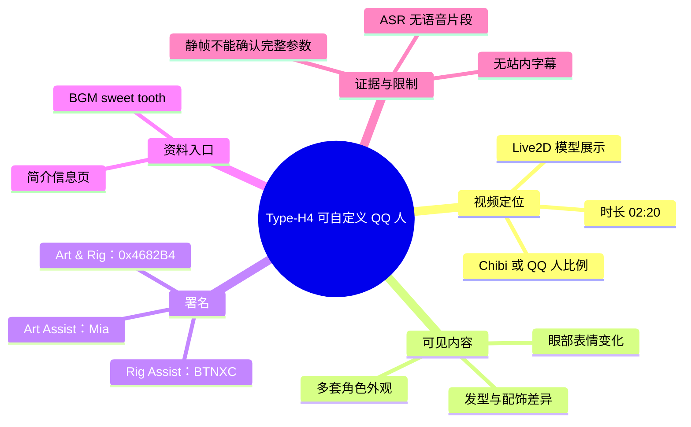
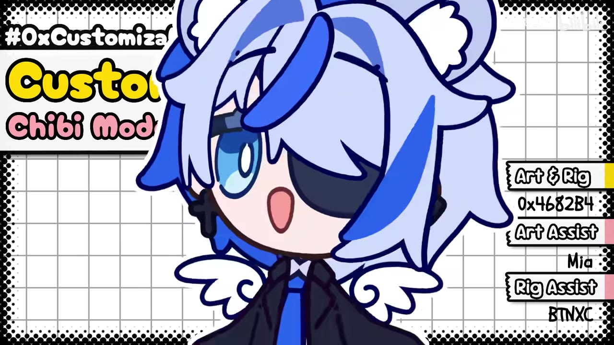
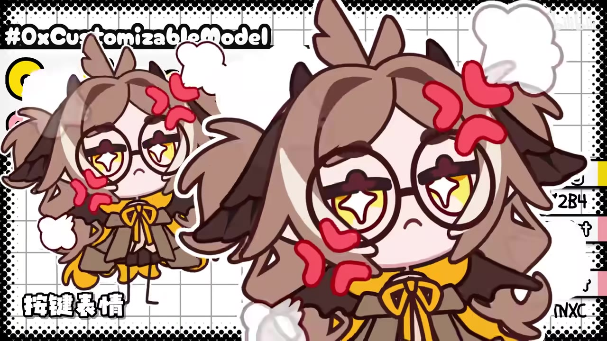
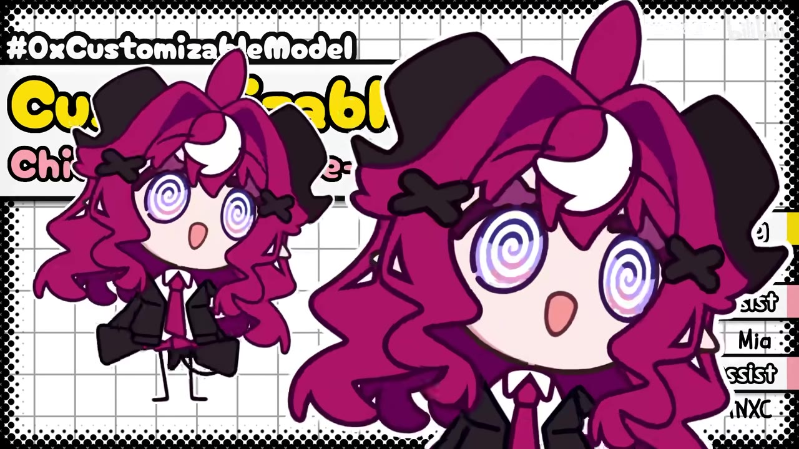
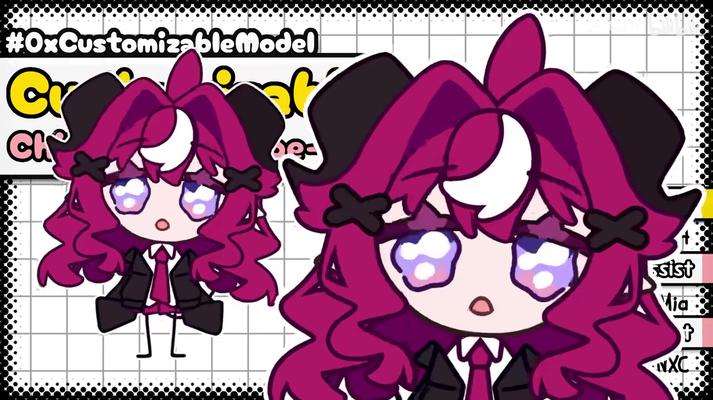

# 【自定义Live2D模型】一种弹弹的可捏QQ人Type-H4

> 来源：[Bilibili 视频](https://www.bilibili.com/video/BV1VB3y6LEMe) 
> UP 主：0x4682B4｜发布时间：2026-07-29｜视频时长：02:20｜画面：1920×1080 
> 视频简介信息页：[0xlive2dmodels.glycoproduction.com](https://0xlive2dmodels.glycoproduction.com/)

## 小结

视频展示了一个名为 **Type-H4** 的可自定义 Live2D QQ 人（Chibi）模型。画面主标题使用英文“Customizable Model / Chibi Model”，与视频标题中的“可捏 QQ 人”相互印证；已提供关键帧展示了至少三种不同的角色外观或表情呈现。

该作品的可见特征是：角色以大头、短身的 QQ 人比例呈现，在同一套版式背景下切换不同发型、发色、配饰、服装细节与眼部表情。紫红色角色的两张画面尤其展示了从螺旋眼到高光泪眼/湿润眼的表情变化，说明模型至少包含可切换的面部状态；但仅凭静态关键帧，无法确认其全部可自定义项目、参数范围、切换方式或所用面捕软件。

画面署名显示 **Art & Rig：0x4682B4**、**Art Assist：Mia**、**Rig Assist：BTNXC**。这意味着 UP 主同时参与了美术与绑定；其余两位署名者分别协助美术和绑定。该归属来自画面文字，不应扩展解读为具体分工比例或技术方案。

视频简介给出了信息页链接，并标注 BGM 为茶葉のぎか的《sweet tooth》。本次 ASR 没有识别到任何语音片段，且没有提供站内字幕，因此本文以视频元数据、简介、可见关键帧文字和画面内容为依据，不将未出现的技术流程、Live2D 参数、下载方式或授权条款补写为事实。

由于视频发布于 2026-07-29，信息页的可访问性、模型版本、获取渠道、兼容性和后续更新均可能发生变化；使用前应以简介所列官方网站及 UP 主后续公告为准。

## 思维导图

## 目录

- [视频定位与时效性](#视频定位与时效性-0000)
- [模型画面与可见变化](#模型画面与可见变化-0000)
- [署名、信息入口与已知参数](#署名信息入口与已知参数-0000)
- [观看与核验步骤](#观看与核验步骤-0000)
- [结论与限制](#结论与限制-0000)
- [字幕比对](#字幕比对-0000)
- [评论分析](#评论分析-0000)
- [处理记录](#处理记录-0000)

## 视频定位与时效性 [00:00](https://www.bilibili.com/video/BV1VB3y6LEMe?t=0)

视频标题为“【自定义Live2D模型】一种弹弹的可捏QQ人Type-H4”，标签包括“模型”“QQ人”“Live2D”“虚拟主播”。结合标题、标签及画面中的“Customizable Model / Chibi Model”文字，可以确定该视频的主题是一个面向 QQ 人风格角色的 Live2D 模型展示。

这里“自定义”是作品标题和画面直接传达的定位，而不是可由现有素材进一步量化的技术承诺。素材中**未提供**以下信息：

- 可替换部件的完整清单；
- 可调节颜色、发型、服装或表情的具体数量；
- 模型文件格式、Cubism 编辑器版本或导出版本；
- VTube Studio、nizima LIVE、Animaze 等软件的兼容性；
- 面捕参数、物理参数、快捷键配置；
- 获得模型、使用模型或二次创作的规则；
- 价格、下载地址或授权状态。

视频总时长为 **140 秒**。由于站内字幕缺失、ASR 也没有可用的带时间语句分段，除视频起点外，不能依据文字顺序臆造“某项功能出现于某秒”的精确时间轴。正文中统一使用 00:00 链接作为进入视频的可靠入口。

## 模型画面与可见变化 [00:00](https://www.bilibili.com/video/BV1VB3y6LEMe?t=0)

关键帧所见画面采用固定的网格、黑色漫画网点边框和英文标题版式；角色以前景大头像与左侧较小全身/半身形象并置的方式出现。该编排有助于同时呈现角色总体比例与面部细节。

> 图：该帧展示“Customizable Model / Chibi Model”主视觉、蓝白配色的 QQ 人角色，以及右侧制作署名。它是确认作品定位、角色风格和作者归属的核心画面证据。

### 多种外观案例

已给出的画面至少可区分为以下可见案例：

1. **蓝白角色**：浅蓝色头发、深蓝色装饰与黑蓝服装，具有单侧明显的蓝色眼部细节和张嘴表情。
2. **棕黄角色**：棕色发型、眼镜、鹿角或角状头部装饰、黄褐色服装，画面叠加红色符号状表情元素。左下角出现“海狸表情”字样；它描述的具体功能归属未在字幕或说明中展开，故仅记录为画面文字。
3. **紫红角色**：深色大蝴蝶结、紫红长发、黑色服装与领带；至少有两种不同眼部状态。

这些案例足以证明视频在展示不同角色视觉结果，但不能仅由成品画面反推出它们必定来自同一套可随意组合的部件系统，也不能确认每个外观是否都是用户可操作的预设。

> 图：该帧以小比例角色与前景放大面部同时呈现棕黄配色案例。画面可用于观察眼镜、头部装饰、发型与服装色彩的组合差异；左下角“海狸表情”是可见文字，但未获得其定义或操作说明。

### 可见的表情差异

紫红角色的两张关键帧中，服装、发型和主要配饰基本一致，眼睛表现不同：

- 一张为螺旋瞳样式；
- 另一张为带高光、近似湿润/泪眼效果的眼睛。

这说明展示内容包含面部视觉状态的变化。标题中“弹弹”可能指向模型运动感或物理效果，但现有静帧不足以直接验证摆动、弹性、物理分组、参数数值或触发条件；对此应保留为标题描述，不能写成已测得的技术指标。

> 图：该帧展示紫红角色的螺旋瞳表情。与下一帧在主体外观近似的前提下对照，可识别出眼部状态切换这一画面层面的变化。

> 图：该帧展示同一紫红角色的另一种眼部表现。其价值在于为“存在至少两种可见面部状态”提供对照，而非证明完整的表情参数表或触发逻辑。

## 署名、信息入口与已知参数 [00:00](https://www.bilibili.com/video/BV1VB3y6LEMe?t=0)

### 画面署名

关键帧右侧可读到以下制作信息：

| 项目 | 署名 | 证据来源 |
| --- | --- | --- |
| Art & Rig | 0x4682B4 | 画面右侧文字 |
| Art Assist | Mia | 画面右侧文字 |
| Rig Assist | BTNXC | 画面右侧文字 |

UP 主账号名为 **0x4682B4**，与画面“Art & Rig”署名一致。可以谨慎表述为：该账号在画面署名中承担了美术与绑定工作。不能据此确定模型所用的软件、绑定复杂度、协作者具体贡献或权利分配。

### 元数据与简介信息

| 项目 | 已知内容 |
| --- | --- |
| BV 号 | BV1VB3y6LEMe |
| 时长 | 140 秒（02:20） |
| 分辨率 | 1920×1080 |
| 分区/标签线索 | 模型、QQ人、Live2D、虚拟主播 |
| 简介信息页 | `https://0xlive2dmodels.glycoproduction.com/` |
| BGM | 茶葉のぎか《sweet tooth》 |
| 视频下载权限 | 元数据标记 `download: 1` |
| 转载限制 | 元数据标记 `no_reprint: 1` |

`no_reprint: 1` 是视频元数据中的转载限制标记，不能替代对模型本体授权条款的阅读。即使视频可下载，也不等于模型文件必然公开、可下载或可商用。

## 观看与核验步骤 [00:00](https://www.bilibili.com/video/BV1VB3y6LEMe?t=0)

本视频没有提供可转录的口述教程，因此不存在可据实整理的建模、切片、绑定或导入操作步骤。若希望进一步判断 Type-H4 是否适合自己的工作流，可按以下**核验步骤**进行；这些是基于当前信息缺口提出的验证清单，不是视频中已经演示的操作流程。

1. **从视频简介进入信息页**  
   使用简介中的链接 `https://0xlive2dmodels.glycoproduction.com/`，确认页面仍可访问，且页面主体确实对应 Type-H4。

2. **确认模型版本与获取方式**  
   查看是否提供模型版本、文件格式、下载或购买入口。不要以视频画面中出现的外观案例代替实际交付内容。

3. **逐项核对自定义范围**  
   重点确认发型、配饰、服装、配色、眼睛和表情中哪些是可切换项，哪些仅是宣传展示图；若有参数表，应记录参数名称、取值范围和预设数量。

4. **确认运行环境**  
   若计划用于虚拟直播或视频制作，应在信息页、说明书或作者公告中确认目标软件、支持的平台、所需面捕输入及导入要求。现有视频素材未说明兼容软件，不能假定通用兼容。

5. **核对授权与转载要求**  
   视频元数据显示禁止转载。模型使用者仍需单独阅读模型的个人使用、直播使用、商用、修改、分发与署名规则；视频级别的转载标记不能覆盖模型级别的许可条款。

6. **以动态实测验证“弹弹”效果**  
   静帧无法判断头发、饰品、身体或面部的物理运动。应在原视频播放中观察动态，或在获得模型后用目标软件测试，再记录实际的物理表现与性能开销。

## 结论与限制 [00:00](https://www.bilibili.com/video/BV1VB3y6LEMe?t=0)

该视频最可靠地传达了三件事：其一，Type-H4 被定位为可自定义的 Live2D QQ 人模型；其二，画面展示了多种角色外观与至少两类可见眼部表情状态；其三，0x4682B4 署名承担美术与绑定，Mia 与 BTNXC 分别提供美术、绑定协助。

对希望制作或使用 QQ 人虚拟形象的观众而言，视频可作为风格与成品视觉效果的参考。角色采用夸张大头比例、简化躯干和显著面部特征，适合关注 Chibi 风格呈现的人群；但它不是包含完整操作教学、参数表或兼容性说明的技术教程。

需要特别避免的过度推断包括：

- 不应把多个展示角色直接等同于已确认的全部可组合部件；
- 不应由标题中的“弹弹”直接推断物理参数、摇摆幅度或运行性能；
- 不应由视频下载权限推断模型文件开放下载；
- 不应由视频简介链接推断该网站当前仍提供相同内容；
- 不应把评论中的期待或建议当成作者已宣布的开发计划。

截至素材抓取时间 **2026-08-04**，视频统计数据为：播放 25,458、点赞 4,141、收藏 3,283、投币 424、分享 506、评论 117。该数据仅反映抓取时点，后续会持续变化。

## 字幕比对 [00:00](https://www.bilibili.com/video/BV1VB3y6LEMe?t=0)

| 字幕来源 | 完整性 | 专有名词 | 时间轴 | 主要问题 |
| --- | --- | --- | --- | --- |
| Bilibili 站内字幕 | 未提供可用字幕 | 无法核验 | 无可用 SRT 分段 | 素材中没有站内字幕文件或文本 |
| 本次 ASR 字幕 | 空 | 无可用识别结果 | ASR 具备时间戳能力，但无分段可用 | `large-v3-turbo` 共识别到 0 个语音片段，语音覆盖率为 0 |

本次 ASR 已实际检查：识别语言自动判断为英语（置信度约 0.601），音频时长为 139.008 秒，但输出为空，诊断提示“未识别到语音片段”。素材没有提供 `noAudioStream=true` 标记；同时产物清单中存在 `audio/audio.wav`，因此不能将此情况表述为“源视频没有音轨”，也不能将其简单归因于工具失败。基于视频简介已标注 BGM，较稳妥的结论是：本次 ASR 未获得可用的口语转写，具体音轨内容仍应以原视频播放为准。

最终未采用任何字幕作为正文事实来源，改以以下证据整理：

- 元数据中的标题、时长、标签、简介和版权相关标记；
- 关键帧中可见的“Customizable Model / Chibi Model”文字；
- 关键帧中的制作署名；
- 关键帧可直接比较出的角色外观与眼部表现差异。

“Type-H4”“0x4682B4”“Mia”“BTNXC”及“sweet tooth”等名称均来自标题、画面署名或视频简介，而非 ASR 转写。

## 评论分析 [00:00](https://www.bilibili.com/video/BV1VB3y6LEMe?t=0)

本次仅获取到 2 条热评，未达到“前三条”的数量；以下仅分析可获取内容，不补足不存在的第三条。

1. **星蓝不会生闷气（108 赞）**  
   评论认为作品“好可爱”，并称作者把此前所学“融会贯通”；同时询问作者之后是否会制作 QQ 人应用。前半部分是对美术风格和作者能力的主观肯定，能反映部分观众对成品的正向审美反馈；后半部分是提问和期待，不代表作者已经公布 QQ 人应用计划。

2. **智能BGM（24 赞）**  
   评论希望该模型能够与“emotelab 的模型”共用。该内容反映了观众对模型互操作性或资产兼容性的需求，但没有提供协议、格式、软件环境或官方回应，因此不能据此认定 Type-H4 当前兼容或未来将兼容 emotelab 模型。

评论区未出现可验证的价格、文件格式、使用教程、授权条件或技术参数补充。对兼容性和后续应用形态的判断，仍应等待作者或信息页的正式说明。

## 处理记录 [00:00](https://www.bilibili.com/video/BV1VB3y6LEMe?t=0)

- Worker ID：`worker-mrj0www4-e8d79408`
- 模型：`gpt-5.6-terra`
- 已提供/检查的工具产物：视频元数据、素材清单、音频产物路径、ASR 诊断与结果、关键帧列表、热评 JSON、站内字幕状态。
- ASR 模型：`large-v3-turbo`；运行设备为 CUDA，计算类型为 `int8_float16`；识别语言自动判定为英语，未识别到语音分段。
- 字幕选择：站内字幕未提供可用内容；本次 ASR 结果为空，故不采用字幕文本。正文基于元数据、简介、画面文字与关键帧进行保守整理。
- 时间轴依据：没有站内 SRT，也没有 ASR 有效分段；仅使用视频起点 `00:00`（`t=0`）作为可靠链接入口，未根据文字或关键帧排列猜测细分时间。
- 关键帧选择依据：选用 `frame-001.jpg` 确认主视觉与制作署名；选用 `frame-002.jpg` 展示另一套角色外观及画面文字；选用 `frame-003.jpg`、`frame-004.jpg` 对照同一紫红角色的两种眼部状态。未将未展示内容的其余帧强行纳入论证。
- 评论范围：请求上限为 3 条，实际仅获取 2 条，已全部处理。
- 缓存清理：提供的素材未包含缓存清理执行记录，无法确认是否已清理；本文不虚构清理结果。
- 未解决问题：模型的实际获取方式、完整自定义参数、动态物理表现、支持软件、性能需求与授权规则均未在可用字幕或关键帧中得到确认。

## 评论分析

- 热评 1：好可爱—— 这是把之前学到的融会贯通了呀 糖妈之后也要做一个QQ人应用么[星星眼]
- 热评 2：如果能和emotelab的模型共用就好了[Neuro sama收藏集_害羞]

以上内容是观众反馈摘录，只用于补充理解视频反响，不作为正文事实依据。
