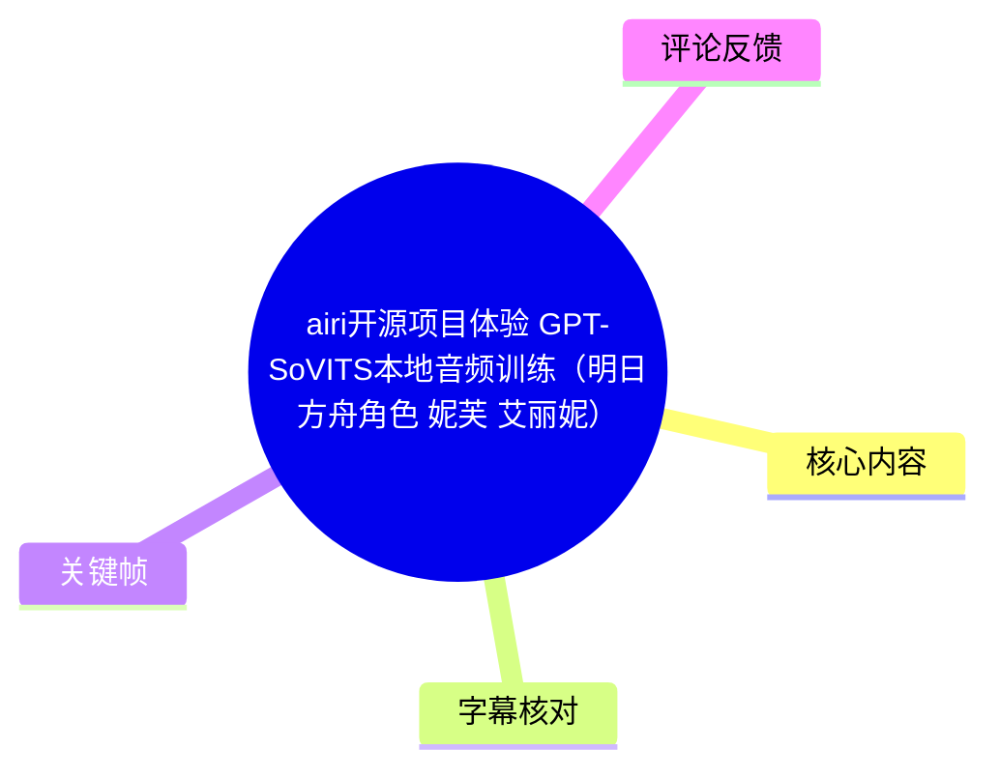
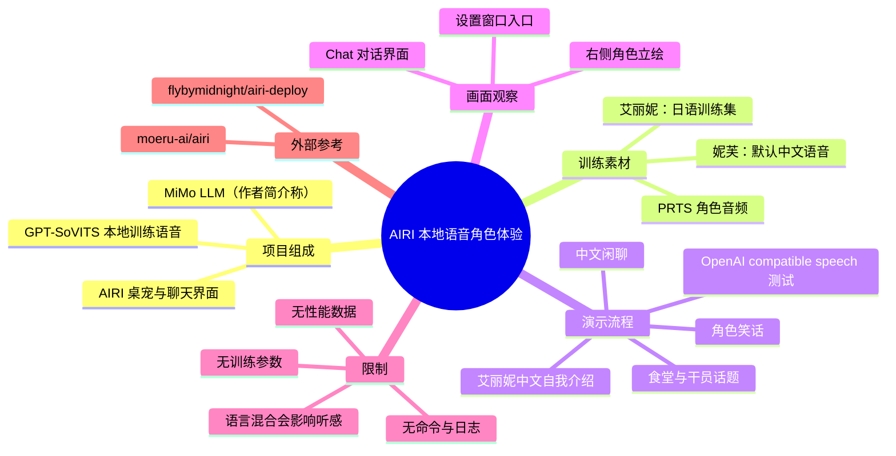
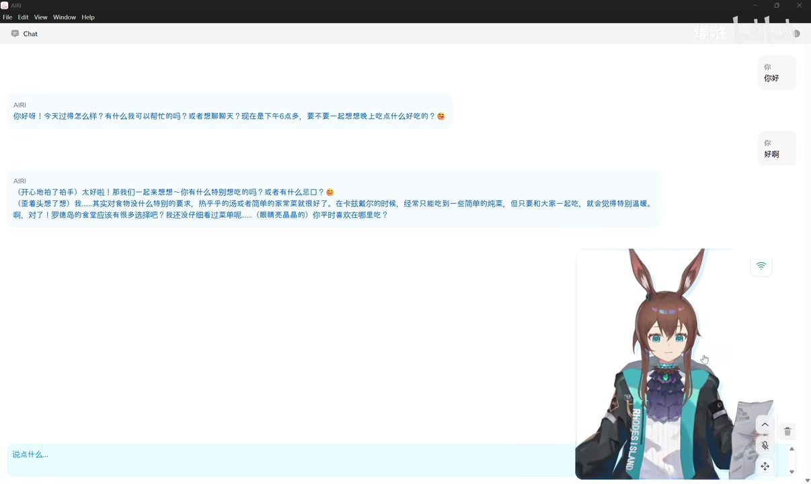
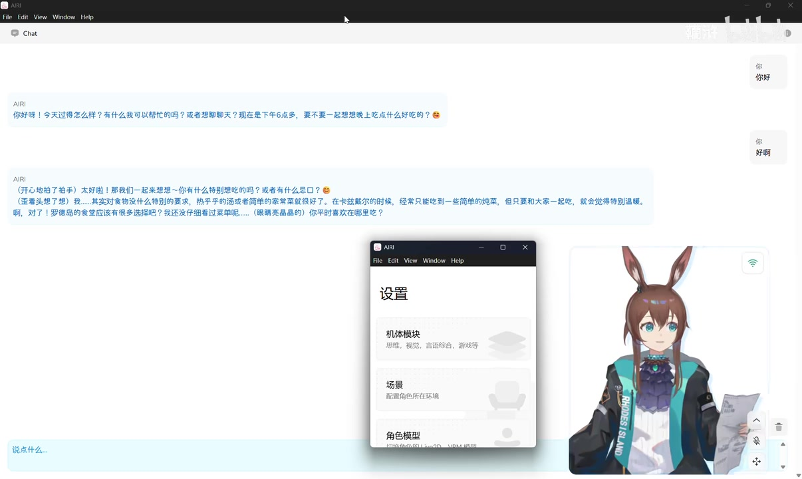
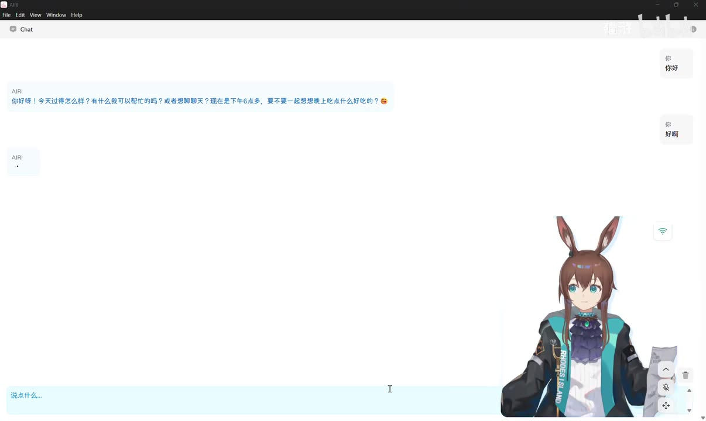

# airi开源项目体验 GPT-SoVITS本地音频训练（明日方舟角色 妮芙 艾丽妮）

> 来源：[Bilibili 视频](https://www.bilibili.com/video/BV1g8516nEYa)  
> UP 主：韊浒｜时长：7 分 09 秒｜分辨率：2560×1528  
> 视频定位：以 AIRI 的本地桌宠/聊天界面为载体，展示接入 GPT-SoVITS 本地训练语音后的角色对话效果。

## 小结

本视频不是 GPT-SoVITS 的完整训练教程，而是一次**已完成本地训练与接入后的效果演示**。画面核心是 AIRI 桌面应用的 Chat 页面：右侧为角色立绘，左侧为文字聊天记录；视频通过连续输入提示词，观察角色的长文本回复、语音播放与角色动作/表情反馈。

根据 UP 主简介，语音训练数据来自 PRTS 上的《明日方舟》角色音频：**妮芙的默认语音为中文，艾丽妮的训练数据为日语**。因此，演示中若出现听感或语言风格不协调，UP 主已明确说明可能源自训练集语言差异，而不是视频中证明的模型故障。

演示的前半段主要为中文角色闲聊：从“今天过得怎么样”延伸到饮食、罗德岛食堂、干员身份和笑话；后半段出现两次英文“OpenAI compatible speech”测试，以及最后的“你好，这是艾丽妮”。这表明作者至少尝试展示不同语言/语音的输出片段，但视频没有公开模型权重、训练轮数、数据时长、采样率、显卡型号、推理延迟、SoVITS 配置或部署命令。

对想评估 AIRI + 本地语音模型实际交互观感的读者，本视频有参考价值；对想复现训练流程的人，仍需另行查阅作者提到的 `flybymidnight/airi-deploy` 本地部署参考和 AIRI 原项目。简介还称 LLM 使用了小米 MiMo 模型，并提及其 token 额度较多；这是作者的项目配置陈述，不等于该组合的通用性能结论。

时效性方面，视频元数据发布时间为 2026 年 5 月；AIRI、GPT-SoVITS、MiMo 模型及部署仓库都可能快速迭代。本文仅整理该视频与随附素材中可验证的展示，不将其视为当前版本的安装指南或性能基准。

## 思维导图

## 目录

- [项目背景与素材边界](#项目背景与素材边界)
- [AIRi 聊天界面与中文角色演示](#airi-聊天界面与中文角色演示)
- [对话内容与角色表现](#对话内容与角色表现)
- [英文兼容语音测试与艾丽妮片段](#英文兼容语音测试与艾丽妮片段)
- [可复用经验、步骤与已知限制](#可复用经验步骤与已知限制)
- [关键帧索引](#关键帧索引)
- [字幕比对](#字幕比对)
- [评论分析](#评论分析)
- [处理记录](#处理记录)

## 项目背景与素材边界 [00:00:00](https://www.bilibili.com/video/BV1g8516nEYa?t=0)

视频标题将内容定位为“airi 开源项目体验”与“GPT-SoVITS 本地音频训练”。但从可获得的字幕、ASR 和关键帧看，视频主体记录的是**训练后在 AIRI 中进行的交互与语音效果展示**，不是从数据预处理到训练完成的屏幕录制。

作者简介提供了以下背景信息：

- 使用 **GPT-SoVITS 本地 ckpt 训练**。
- 数据集来自 PRTS 的角色音频。
- **妮芙**：默认语音为中文。
- **艾丽妮**：训练集为日语；作者特别提醒，中间可能出现的违和听感与这一语言差异有关，并标注“钉宫音”。
- LLM 使用小米 **MiMo** 模型；作者称其 token 给得很多。
- 本地部署参考为 `flybymidnight/airi-deploy`。
- 作者呼吁支持 AIRI 原作者及仓库：`https://github.com/moeru-ai/airi`。

需要严格区分：上述内容中，“使用何种数据、LLM 与参考部署项目”来自视频简介；而本视频画面可直接验证的是 AIRI 的聊天窗口、角色立绘和若干语音文本输出。素材没有给出 GPT-SoVITS 的版本号、训练命令、ckpt 文件名或任何训练超参数。

## AIRI 聊天界面与中文角色演示 [00:00:28](https://www.bilibili.com/video/BV1g8516nEYa?t=28)

站内字幕与本次 ASR 都显示，首段可听语音从约 28.8 秒开始。角色以“今天过得怎么样，有什么我可以帮忙的吗”开启对话，并主动提出一起想晚餐吃什么。这段内容对应 AIRI Chat 页面的初始互动。

> 图：关键帧展示 AIRI 的 Chat 界面结构——左侧为以 “AIRI” 标注的对话内容，右侧为用户气泡，右下为角色立绘与控制图标。它证明视频展示的是带可视角色的聊天应用，而非单独的音频播放器。

画面中可辨认的信息包括：

- 窗口标题为 **AIRI**，顶部菜单含 `File`、`Edit`、`View`、`Window`、`Help`。
- 左侧聊天区域显示 AIRI 的长回复，右侧为用户发送的简短文字。
- 底部有“说点什么...”输入区域。
- 右下角是角色立绘，服装上可见 “RHODES ISLAND” 字样，呼应视频的《明日方舟》角色主题。
- 角色区域旁有网络状态样式图标及一列控制按钮，但关键帧不足以可靠辨认每个按钮的具体功能，不能据此断言其分别对应音量、动作或模型设置。

## 对话内容与角色表现 [00:01:09](https://www.bilibili.com/video/BV1g8516nEYa?t=69)

约 1 分 09 秒起，角色对“好啊”作出积极反馈，随后展开饮食偏好话题。站内字幕的文本分段比 ASR 更完整、专名更稳定，可整理为以下对话链：

1. 角色表示可以一起想吃什么，并询问“有什么特别想吃的吗”或“有什么忌口”。
2. 她说自己对食物没有特别要求，热乎乎的汤或简单家常菜都可以。
3. 她提到“在卡兹戴尔的时候，经常只能吃到一些简单的炖菜”。
4. 她说只要和大家一起吃，就会觉得温暖；接着询问罗德岛食堂和菜单。
5. 后续她提到记得当天可能有烤肉排、奶油蘑菇汤，并悄悄表示想试试罗德岛特产的能量饮料，称“听说喝完会精神一整天”。
6. 她再询问用户在罗德岛从事战斗干员还是文职工作，并表示自己仍在学习如何当好一名干员，“姐姐说我有很多东西要学”。

> 图：关键帧中，聊天区已累积成多段中文回复，右侧角色立绘持续保留。这有助于理解视频的展示重点：LLM 生成文本、角色设定语气、语音输出与可视桌宠处于同一交互流程。

这段演示体现的并非简单的单句 TTS：角色会围绕前文的“晚餐”主题延续叙述，并加入卡兹戴尔、罗德岛、干员等设定化表达。至于这些连贯性究竟由 MiMo、提示词模板、角色卡、上下文窗口还是 AIRI 自身编排机制提供，视频没有展示配置，无法细分归因。

## 对话内容与角色表现：设置入口 [00:02:55](https://www.bilibili.com/video/BV1g8516nEYa?t=175)

在约 2 分 55 秒和 3 分 15 秒处，字幕分别出现“听到你的回答”“开心地笑了”，对应用户输入后角色继续反应的间隔。画面随后打开了 AIRI 的设置窗口。

> 图：关键帧显示一个标题为“设置”的 AIRI 窗口，卡片中可见“机体模块”“场景”“角色模型”等类别。这一画面可确认 AIRI 至少提供模块、场景和角色模型层面的设置入口；但具体选项、参数值和音频模型绑定方式没有在素材中清晰展示。

从该窗口能读出的类别说明包括：

| 设置类别 | 画面可见说明 | 可以确认的范围 |
| --- | --- | --- |
| 机体模块 | “思维、视觉、言语综合、游戏等” | AIRI 将多个能力归入机体模块概念。 |
| 场景 | “配置角色所在环境” | 存在场景配置入口。 |
| 角色模型 | 可见“切换...”但后续文字不清晰 | 可确认有角色模型相关入口，不能确认其支持的具体模型格式或切换流程。 |

视频未展示在设置窗口中选择 GPT-SoVITS 模型、填写接口地址或保存配置的操作。因此，不能将此画面写成可复现的音频接入教程。

## 对话内容与角色表现：笑话段落 [00:04:03](https://www.bilibili.com/video/BV1g8516nEYa?t=243)

约 4 分 03 秒，用户提示“来讲一个笑话吧”。约 4 分 29 秒后，角色回应要讲一个关于“吃心魔”的笑话；该词在站内字幕中也如此转写，但其是否为准确角色/设定名称，素材不足以独立核验。

笑话主体在约 5 分 07 秒开始：

- 问题是：为什么“吃心魔”在派对上总是特别受欢迎？
- 回答的逻辑是：因为他们能读懂每个人的心思，知道谁想跳舞、谁想吃蛋糕、谁其实早已想回家。
- 收束时，角色表示这种能力有时会听到令人难过的事，但至少能让大家在开心时更开心。

这段内容可用于观察长段语音的连续播放与角色语气，但并不构成语音模型客观测评：视频没有给出原始文本与音频的对齐指标、音色相似度、字错率、实时率或对照样本。

## 英文兼容语音测试与艾丽妮片段 [00:06:11](https://www.bilibili.com/video/BV1g8516nEYa?t=371)

后段存在三组短测试语音，站内字幕与 ASR 的差异较明显：

| 时间 | 站内字幕 | 本次 ASR | 整理结论 |
| --- | --- | --- | --- |
| 06:11–06:17 | `Ah this is a test of the open now a compatible speech` | “这是开放式的开放语言” | 音频实际为英文测试句；“OpenAI compatible speech”是较合理的听写，但站内英文拼写也存在 `open now` 误转。 |
| 06:41–06:45 | `Hello / This is a test of the / Opening a compatible speech` | “这是开发式的开放语音” | 同样是英文测试句，站内字幕将 `OpenAI` 误为 `Opening`。 |
| 07:03–07:06 | “你好 / 这是艾丽尼” | “正在加你” | 应优先采用站内字幕，可整理为“你好，这是艾丽妮”；末字采用视频标题与简介中的角色名“艾丽妮”统一。 |

> 图：关键帧中，用户消息“好啊”已经发出，AIRI 一侧显示省略号式等待状态，右下角色仍在界面内。它展示了文本输入、生成等待和角色呈现处于同一工作流，但不能从单帧判断具体推理时延。

视频题目与简介把妮芙、艾丽妮都列为体验对象；字幕中前段是中文设定化对话，结尾直接说“这是艾丽妮”。结合作者关于艾丽妮使用日语训练集的说明，可以确认作者有意展示至少两个角色/语音相关片段。**但素材未提供每段音频与具体 ckpt 的一一对应关系**，因此不能严谨地断言前面所有中文对话一定由妮芙模型生成，或两条英文测试各自使用了哪一个模型。

## 可复用经验、步骤与已知限制 [00:06:41](https://www.bilibili.com/video/BV1g8516nEYa?t=401)

### 视频实际呈现的体验流程

在不补写视频未出现配置的前提下，可将演示流程归纳为：

1. **准备角色语音训练素材**：作者称素材来自 PRTS；妮芙为中文默认语音，艾丽妮训练集为日语。
2. **以 GPT-SoVITS 进行本地 ckpt 训练**：这是作者简介的明确陈述，但视频未展示训练界面、命令或参数。
3. **在 AIRI 中使用角色聊天界面**：输入中文提示，如闲聊、饮食选择、要求讲笑话。
4. **观察生成结果**：AIRI 左侧展示长文本回复，右下保留角色立绘，并播放相应语音。
5. **进行短句语音测试**：后段出现两次英文兼容语音测试和“你好，这是艾丽妮”的中文自我介绍。
6. **查看设置入口**：视频短暂打开设置页，显示机体模块、场景、角色模型等模块，但没有继续配置。

### 已公开的技术信息与缺失参数

| 项目 | 视频/简介可确认信息 | 缺失或不可确认信息 |
| --- | --- | --- |
| 前端交互 | AIRI 桌面聊天界面、角色立绘、设置入口 | AIRI 版本、操作系统、安装方式 |
| LLM | 作者称使用小米 MiMo 模型 | 具体型号、上下文配置、API/本地调用方式、提示词 |
| 语音训练 | GPT-SoVITS 本地 ckpt 训练 | GPT-SoVITS 版本、底模、训练轮数、batch size、学习率、采样率、数据时长 |
| 数据集 | 来自 PRTS 的妮芙、艾丽妮角色音频 | 数据清洗、切分、授权状态、文本标注方法、训练/验证划分 |
| 角色语言 | 妮芙默认中文；艾丽妮训练集日语 | 每一段成品音频对应哪个角色 ckpt |
| 部署参考 | `flybymidnight/airi-deploy` | 具体分支、依赖版本、部署命令、接口协议 |
| 性能 | 有实际交互演示 | 首包时间、实时率、GPU/CPU 占用、并发能力、稳定性 |

### 实践上的风险与边界

- **语言一致性是首要变量**：作者已经指出艾丽妮训练集为日语。如果希望中文长句的咬字、语调和角色一致性更稳定，应优先使用语言与目标输出一致、文本标注可靠的训练数据；这是由作者提醒可直接推出的实践注意点，但视频没有给出改进方案或量化结果。
- **不可据展示判断训练质量**：视频没有原音对照、盲测或指标，只能说明作者环境中产生了这些输出，不能证明其在所有文本、语言或硬件环境下表现一致。
- **设置入口不等于可复现配置**：虽然画面中出现“角色模型”等模块，但没有可读的字段和保存结果。复现前必须回到作者所指的部署参考与 AIRI 原仓库核对当前文档。
- **角色语音与数据来源需注意授权**：视频仅说数据来自 PRTS，未说明数据的授权、二次训练和再分发条件。实际使用应自行核验原始音频、角色素材及模型发布的许可协议。
- **工具与接口会变化**：作者提到的 MiMo token 额度、部署项目状态和 AIRI 功能均具有时间敏感性，不能将视频中的可用状态视为长期承诺。

## 关键帧索引

| 关键帧 | 对应内容 | 选择价值 |
| --- | --- | --- |
| `frames/frame-001.jpg` | 初始问候与 AIRI Chat 布局 | 清楚呈现聊天区、用户输入、角色立绘及应用名。 |
| `frames/frame-002.jpg` | 用户输入“好啊”后的等待状态 | 体现输入到生成回复之间的交互状态。 |
| `frames/frame-003.jpg` | 多段中文回复累计显示 | 说明演示包含连续上下文中的长文本角色回复。 |
| `frames/frame-004.jpg` | AIRI 设置窗口 | 是素材中唯一清晰展示模块/场景/角色模型入口的画面。 |

未在正文中使用其余关键帧：当前提供的可视素材中，前四张已覆盖聊天初始状态、输入等待、长回复和设置入口；其余帧未提供可可靠辨认的新配置参数或训练信息，故不为凑图而添加。

## 字幕比对

| 字幕来源 | 完整性 | 专有名词 | 时间轴 | 主要问题 |
| --- | --- | --- | --- | --- |
| Bilibili 站内字幕 | 覆盖 00:28–07:06 的主要发声段，细分较充分 | “卡兹戴尔”“罗德岛”等中文设定词总体较稳定；“吃心魔”待核 | 时间粒度较细，可直接使用 | 英文测试句识别不稳定，如 `open now`、`Opening`；个别语气词与动作描述混入正文。 |
| 本次 ASR 字幕 | 共 22 段，语音覆盖约 137.94 秒，占全片约 32.18% | 将“卡兹戴尔”误作“卡兹贝尔”、“罗德岛”误作“罗德导”；“艾丽妮”误作“正在加你” | 带真实时间戳，整体与站内字幕起点接近 | 多段合并过长，存在繁简混用、同音误识别和英文被译写成中文的问题。 |

### 最终字幕采用策略

最终以**站内字幕为主、本次 ASR 为交叉核验**：

- 两份字幕在中文对话开始时间上高度接近，例如首句分别从 28.920 秒和 28.750 秒开始，可确认时间轴大体可靠。
- 正文中的章节时间优先取站内 SRT 的真实分段起点，并换算成 Bilibili `t=<秒数>` 链接。
- “卡兹戴尔”“罗德岛”“艾丽妮”等词以站内字幕、视频标题和简介的交叉信息校正。
- 英文测试段保留站内字幕所表明的英文事实，但将明显错误的 `open now` / `Opening` 标注为转写不确定；结合上下文，写作“OpenAI compatible speech 测试”时明确这是整理性表述，而非将其当作无误原文。
- ASR 诊断中**没有** `noAudioStream=true` 标记；相反，音频时长约为 428.672 秒，识别语言为中文，置信度约 0.980。因此本视频确有音轨，较低的语音覆盖率主要反映大量无可识别语音的交互停顿，而非源视频无音频。

## 评论分析

以下仅分析当前可获取的热评前三条，不将提问、愿望或致谢当作已验证的技术事实。

1. **倾听西塞罗**（8 赞）  
   评论询问：“听觉怎么设置，我这个听觉模型设置里测试都好用的，一到机体就没反应。”  
   这反映观众在 AIRI 的“听觉模型”与“机体”集成环节可能遇到从测试可用到实际角色无响应的差异。评论没有提供版本、日志、配置或解决结果，因此只能视为待排查的问题线索，不能据此认定项目存在普遍缺陷。

2. **Type_rbody**（5 赞）  
   评论询问桌宠是独立软件还是已集成在项目内，希望接到自己的框架上。  
   该问题说明观众关注 AIRI 的架构边界与外部框架集成能力。视频画面可以确认 AIRI 以独立桌面窗口形式运行，但不足以证明它的桌宠组件是独立应用、内置模块还是可拆分 SDK；需要查阅 AIRI 项目文档确认。

3. **ProjectAIRI**（2 赞）  
   评论为“谢谢up的教程”。  
   这是一条正向反馈，说明视频对部分观众具有参考作用；但它不包含可验证的配置补充或技术结论，也不能反推视频已覆盖完整部署教程。

## 处理记录

- **Worker ID**：`worker-mrj0wjed-b0c290ad`
- **整理模型**：`gpt-5.6-terra`
- **使用素材与工具产物**：视频元数据、合并视频 `merged.mp4`、音频 `audio/audio.wav`、关键帧目录 `frames/`、站内字幕 `p01-ai-zh.srt`、本次 ASR 结果 `asr/asr-result.json` 与 `asr/transcript.srt`、热评 `comments/comments.json`。
- **ASR 模型与运行信息**：`medium`；CUDA；`float16`；自动语言识别为中文，概率约 `0.97998`；音频时长 `428.672` 秒。
- **字幕选择**：站内 SRT 为主，本次 ASR 为必检交叉来源。采用站内字幕的细粒度时间点；对中文专名与结尾“艾丽妮”结合标题、简介和站内字幕校正；英文段保留不确定性说明。
- **关键帧选择依据**：选用 `frame-001` 至 `frame-004`，因为它们分别呈现聊天布局、生成等待、长文本互动和设置入口；没有使用无法提供新增可验证信息的帧。
- **缓存清理**：提供的任务素材未包含缓存清理执行日志；无法验证是否完成清理，故不作“已清理”声明。
- **未解决问题**：未提供 GPT-SoVITS 训练参数、模型版本、权重来源、数据处理方法、AIRI 音频接入配置、MiMo 具体型号、性能数据及英文测试原句的原始文本；这些均不应由本整理补造。
