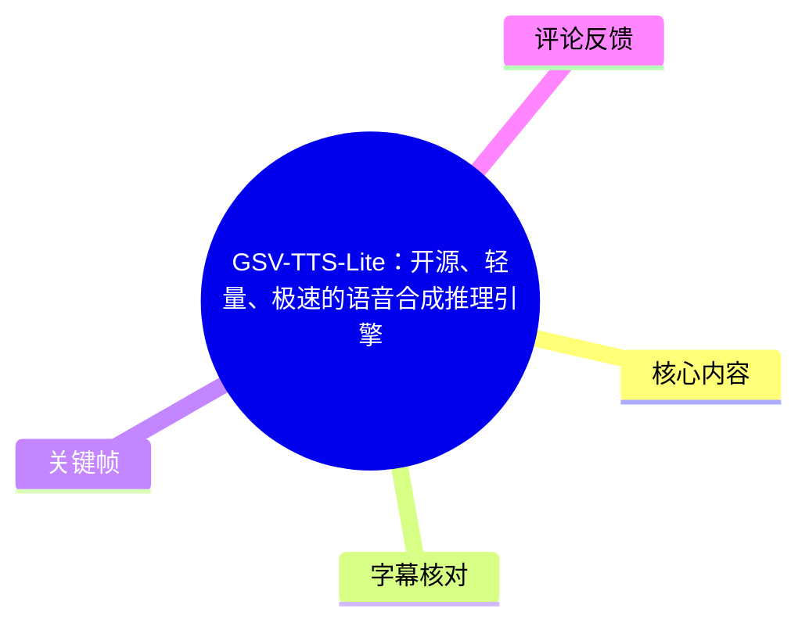
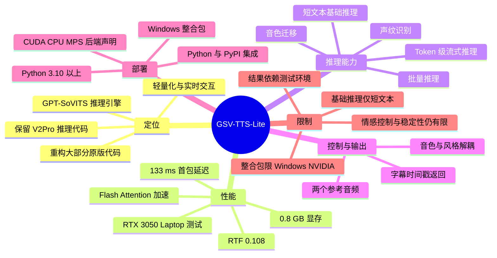
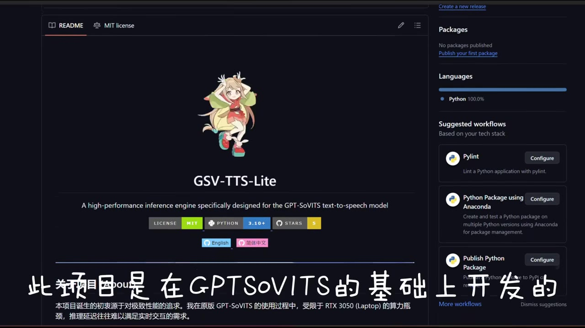
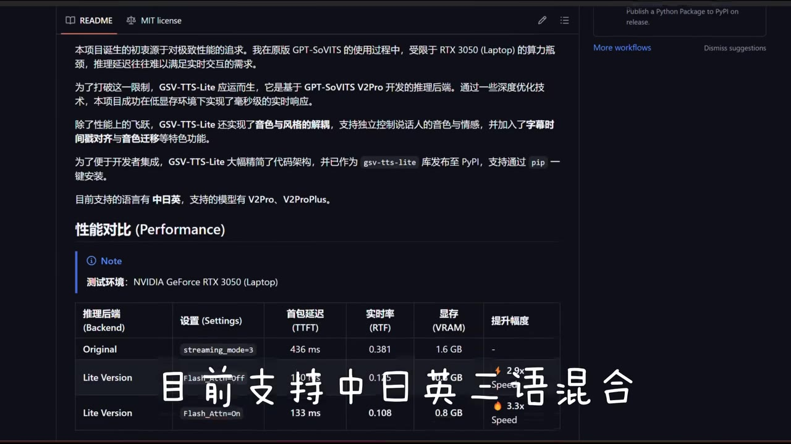
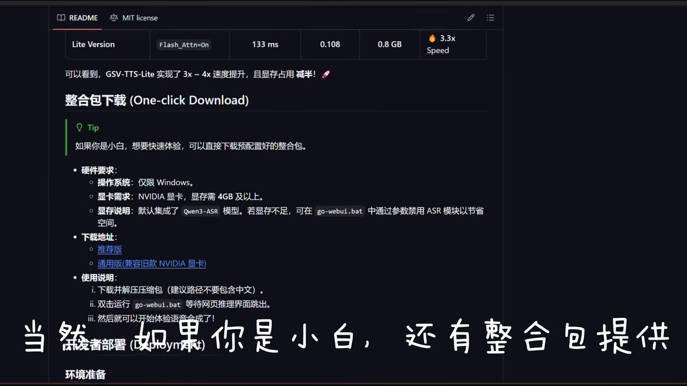
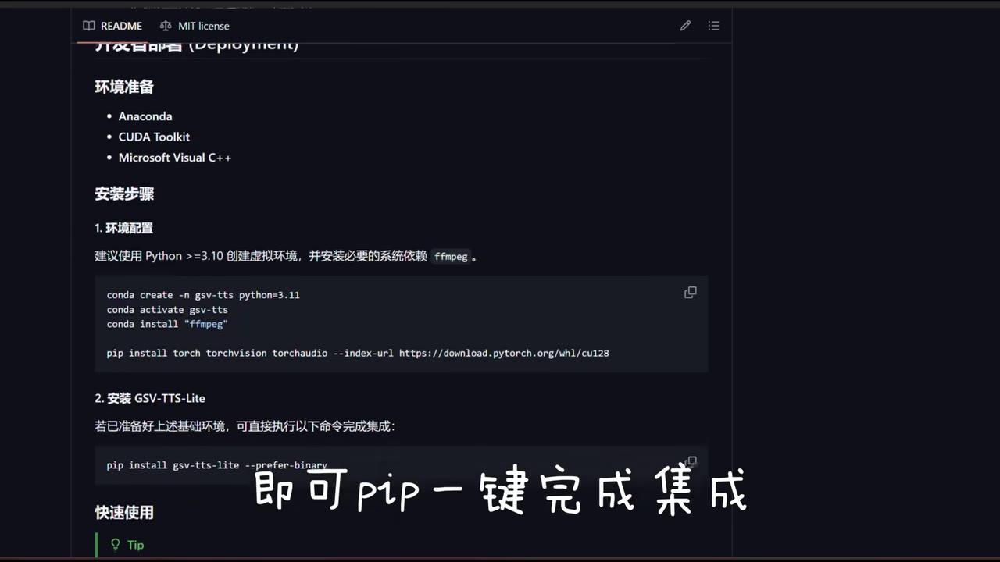

# GSV-TTS-Lite：开源、轻量、极速的语音合成推理引擎

> 来源：[Bilibili 视频](https://www.bilibili.com/video/BV1w6f2BUEo8)  
> UP 主：中二病晚期の陌陌君｜发布时间：2026-02-24｜视频时长：02:02  
> 项目地址：`chinokikiss/GSV-TTS-Lite`（见视频简介）

## 小结

GSV-TTS-Lite 是一个面向 GPT-SoVITS 的轻量化语音合成推理引擎。视频作者称其在 GPT-SoVITS 基础上开发，重构了原项目大部分代码，仅保留 V2Pro 的推理代码路径，目标是改善原版在有限显卡性能下难以满足实时交互需求的问题。

视频与画面材料给出的核心卖点是：在 NVIDIA GeForce RTX 3050 Laptop 的测试环境中，开启 Flash Attention 的 Lite 版本首包延迟为 **133 ms**、实时率（RTF）为 **0.108**、显存占用为 **0.8 GB**，相对原版表格中的 436 ms、0.381、1.6 GB，标注为约 **3.3 倍速度提升**。作者口播概括为“3～4 倍”提速、约 0.8 GB 显存占用；这些是作者展示环境下的结果，不应直接视为所有硬件与模型组合的通用基准。

功能上，项目涉及短文本基础推理、Token 级流式推理、批量推理、音色迁移、声纹识别，以及为全部推理模式返回字幕时间戳。其较有辨识度的设计是将**音色与风格解耦**：参考音频不一定只承担“说话人是谁”的角色，也可分别控制最终音频的音色和风格。

部署路径分为两类：面向小白的 Windows 整合包，以及面向开发者的 Python/PyPI 集成。画面明确显示开发环境需要 Anaconda、CUDA Toolkit、Microsoft Visual C++、Python 3.10 以上、`ffmpeg` 和 PyTorch；环境就绪后可通过 `pip install gsv-tts-lite --prefer-binary` 安装。整合包则限定 Windows 与 NVIDIA 显卡，画面写明显存需求为 4 GB 及以上。

项目时效性较强。视频简介称其“现已全面支持 CUDA、CPU、MPS 推理后端，且免编译安装”；但视频画面中的部署和性能表格明显以 Windows、CUDA、RTX 3050 Laptop 为例。实际可用模型、后端兼容性、PyPI 包版本、依赖版本与性能数据均可能在发布后变化，应以项目仓库及其 Issue 为准。

## 思维导图





## 目录

- [项目背景与性能定位](#项目背景与性能定位)
- [部署方式：整合包与 Python 集成](#部署方式整合包与-python-集成)
- [基础推理、参考音频与风格控制](#基础推理参考音频与风格控制)
- [流式推理与字幕时间戳](#流式推理与字幕时间戳)
- [批量推理、音色迁移与加速](#批量推理音色迁移与加速)
- [实践步骤与参数汇总](#实践步骤与参数汇总)
- [限制、适用范围与时效性](#限制适用范围与时效性)
- [字幕比对](#字幕比对)
- [评论分析](#评论分析)
- [处理记录](#处理记录)

## [项目背景与性能定位](https://www.bilibili.com/video/BV1w6f2BUEo8?t=33)

### 项目来源与目标

从 [00:33](https://www.bilibili.com/video/BV1w6f2BUEo8?t=33) 起，作者说明该项目建立在 GPT-SoVITS 基础上，并称自己重构了原版的大部分代码，只保留 V2Pro 的推理代码。其背景是作者在使用原版 GPT-SoVITS 时，受 RTX 3050 Laptop 算力限制，推理延迟难以满足实时交互需求。

关键帧画面进一步补充了项目 README 中的定位：

- GSV-TTS-Lite 是专为 GPT-SoVITS 文本转语音模型设计的高性能推理引擎；
- 目标是在低显存环境下获得毫秒级实时响应；
- 功能包括音色与风格解耦、字幕时间戳对齐、音色迁移等；
- 项目作为 `gsv-tts-lite` 包发布到 PyPI，支持通过 `pip` 安装；
- README 画面写明当前支持中、日、英三语及其混合，并列出 V2Pro、V2ProPlus 模型。



> 图：该帧展示 GitHub README 首页及“基于 GPTSoVITS 开发”的说明，是确认项目定位、代码托管形态与 GPT-SoVITS 关联的直接视觉依据。关键帧未提供精确截图时刻，因此不以它反推时间轴。

### 性能表格：应如何理解“3～4 倍提升”

画面中的性能表格测试环境为 **NVIDIA GeForce RTX 3050（Laptop）**。可清晰读取的数据包括：

| 推理后端/设置 | 首包延迟（TTFT） | 实时率（RTF） | 显存（VRAM） | 画面标注 |
| --- | ---: | ---: | ---: | --- |
| Original / `streaming_mode=3` | 436 ms | 0.381 | 1.6 GB | 基准 |
| Lite Version / `Flash_Attn=On` | 133 ms | 0.108 | 0.8 GB | 3.3× Speed |

作者在口播中将总体结果概括为：速度提高约 **3～4 倍**，显存占用约 **0.8 GB**。表格中 Flash Attention 开启时的 3.3 倍标记，与该概括一致。

这里的指标含义可按视频语境理解：

- **TTFT（首包延迟）**：开始请求到取得首段输出的延迟；较低值对实时对话更重要。
- **RTF（Real-Time Factor，实时率）**：画面以 0.108 展示，数值低于 1 通常意味着生成快于音频播放时长；但视频未定义精确计算口径。
- **VRAM**：推理时显存占用；表格中 Lite + Flash Attention 为 0.8 GB。



> 图：该帧给出 RTX 3050 Laptop 上的性能表、原版与 Lite 的延迟/RTF/显存对比，以及“支持中日英三语混合”的画面文字。它是本文保留具体数值与测试条件的依据。

## [部署方式：整合包与 Python 集成](https://www.bilibili.com/video/BV1w6f2BUEo8?t=36)

### 面向小白：Windows 整合包

从 [00:36](https://www.bilibili.com/video/BV1w6f2BUEo8?t=36) 起，作者说明小白用户可使用整合包。画面中“整合包下载（One-click Download）”部分给出的要求为：

- **操作系统**：仅限 Windows；
- **显卡需求**：NVIDIA 显卡，显存需 **4 GB 及以上**；
- 默认集成 **Qwen3-ASR** 模型；
- 若显存不足，可在 `go-webui.bat` 中通过参数禁用 ASR 模块以节省空间；
- 使用方式为下载并解压压缩包、双击运行 `go-webui.bat` 并等待网页接口弹出。

视频没有展示用于禁用 ASR 的具体参数名，因此不应自行补写命令。



> 图：该帧直接展示整合包的 Windows 限制、NVIDIA/4 GB 显存要求、默认 Qwen3-ASR 集成以及 `go-webui.bat` 的启动方式，是区分“整合包方案”与“Python 安装方案”的关键依据。

### 面向开发者：环境准备与 PyPI 安装

视频口播称：在准备好背景中所列环境后，可通过 `pip` 一键完成集成；作者也提到会尽可能处理部分编译相关问题。画面列出的环境前提是：

- Anaconda；
- CUDA Toolkit；
- Microsoft Visual C++；
- Python **3.10 及以上**；
- 系统依赖 `ffmpeg`；
- PyTorch、TorchVision、TorchAudio。

画面提供的命令如下，保留原始版本与索引设置：

```bash
conda create -n gsv-tts python=3.11
conda activate gsv-tts
conda install "ffmpeg"

pip install torch torchvision torchaudio --index-url https://download.pytorch.org/whl/cu128
```

安装 GSV-TTS-Lite 的命令为：

```bash
pip install gsv-tts-lite --prefer-binary
```

其中 `cu128` 表明画面示例针对 CUDA 12.8 对应的 PyTorch 轮子；这不是“所有 CUDA 环境都必须使用 cu128”的证据。应根据自身 GPU、驱动、CUDA 与 PyTorch 兼容关系调整。



> 图：该帧展示 Anaconda、CUDA Toolkit、Microsoft Visual C++ 等前置条件，以及 Python 3.11 虚拟环境、`ffmpeg`、PyTorch CUDA 轮子和 `pip install gsv-tts-lite --prefer-binary` 命令，是本文命令逐字记录的依据。

## [基础推理、参考音频与风格控制](https://www.bilibili.com/video/BV1w6f2BUEo8?t=36)

从 [00:36](https://www.bilibili.com/video/BV1w6f2BUEo8?t=36) 至 [01:00](https://www.bilibili.com/video/BV1w6f2BUEo8?t=60) 的 ASR 段落中，作者进入基础推理示例，并明确给出两个使用限制/设计点：

1. **基础推理仅用于短文本合成。**  
   对较长内容，视频后续建议使用批量推理，而不是把基础推理当作长文合成入口。

2. **两个参考音频来自音色与风格解耦设计。**  
   作者解释，项目将风格与音色解耦，因而可以单独控制最终生成音频的风格与音色。  
   换言之，参考音频可分别承担不同控制维度，而不是仅有单一“模仿某人音色”的输入作用。

视频简介还给出作者对 GPT-SoVITS 体系的整体判断：它的优势是 few-shot（少样本）条件下的还原度，可能显著优于部分 zero-shot 模型，例如简介举例的 Qwen3 TTS；但作者同时认为其情感细化控制仍不足，生成稳定性也不够好。这是作者在简介中的观点，不等同于本视频提供了系统性横向评测。

## [流式推理与字幕时间戳](https://www.bilibili.com/video/BV1w6f2BUEo8?t=60)

### Token 级流式输出

从 [01:00](https://www.bilibili.com/video/BV1w6f2BUEo8?t=60) 起，作者讲解流式推理，并说明项目实现的是 **Token 级别的流式推理**。作者以“可以当作一个字一个字实际输出”作通俗解释。

这一定义需要谨慎理解：

- 视频的准确技术表述是“Token 级别”；
- “一个字一个字”是作者帮助理解的类比；
- Token 不必严格等于单个汉字，因此不能将该说法延伸为逐字合成机制的严格保证。

对于实时对话系统，这类流式输出的价值在于：无需等待整段文本全部生成后才开始播放，从而配合较低首包延迟缩短交互等待时间。

### 字幕同步/时间戳返回

同一段中作者强调，项目还能返回字幕时间戳，且**所有推理模式均支持返回字幕时间戳**。这意味着推理结果除音频外，可提供用于字幕同步的时间信息；视频将其作为“字幕同步功能”展示。

可迁移的实践意义是：

- 对实时对话、数字人、语音播放器或视频生成流程，可将音频输出与字幕时间信息一并处理；
- 若产品需要前端逐步显示文本，时间戳比仅返回完整音频更便于做同步；
- 视频未展示返回字段格式、时间精度、分词粒度或 API 调用示例，因此不能据此假定具体 JSON/SRT 数据结构。

## [批量推理、音色迁移与加速](https://www.bilibili.com/video/BV1w6f2BUEo8?t=84)

### 批量推理与长文本

从 [01:24](https://www.bilibili.com/video/BV1w6f2BUEo8?t=84) 起，作者介绍批量推理，称其适合长文本、多角色合成；并表示可在同一批次中，为不同文本指定不同参考音频。

据此可整理为以下选择原则：

| 场景 | 视频建议的模式 | 原因 |
| --- | --- | --- |
| 短文本单次合成 | 基础推理 | 作者明确称基础推理只能用于短文本 |
| 需要尽早开始播放 | 流式推理 | Token 级输出，适合实时交互 |
| 长文本或多角色内容 | 批量推理 | 可按文本指定不同参考音频 |
| 需要声音转换效果 | 音色迁移 | 视频将其作为独立功能介绍 |

### 音色迁移、声纹识别与实时对话

作者随后提到“音色迁移”，并将其简要概括为 **RVC**；视频没有进一步展示算法流程、输入输出格式或质量评测，因此这里只能确认该功能存在及作者的类比，不能把它等同于完整 RVC 工程的所有能力。

作者还提到一个“没啥软用”的声纹识别功能，并认为从事实时对话的开发者可能会用到它。这里应保留原作者的主观保留态度：视频没有说明识别准确率、模型来源、隐私处理方式或如何与 TTS 管线接入。

### Flash Attention 的加速范围

作者说明，开启 Flash Attention 后，在**自回归解码阶段**可获得约 **1.5～2 倍**加速，并称有能力的用户可自行编译。

这与前文约 3～4 倍的端到端/表格式整体提升并非同一口径：

- **1.5～2 倍**：作者明确限定为 Flash Attention 对自回归解码阶段的加速；
- **约 3～4 倍**：作者对 Lite 版本相较原版的总体概括；
- 性能表中 3.3× 对应特定 RTX 3050 Laptop、特定设置与表格指标。

因此，不能简单将“Flash Attention 必然带来 3～4 倍提升”作为结论。

## [实践步骤与参数汇总](https://www.bilibili.com/video/BV1w6f2BUEo8?t=36)

以下流程仅依据视频画面、ASR 与简介整理；没有出现的 WebUI 参数、Python API、模型下载链接和配置文件字段均不补造。

### 路线 A：Windows 整合包快速体验

1. 确认系统为 Windows。
2. 确认使用 NVIDIA 显卡，显存至少 4 GB。
3. 下载并解压作者提供的整合包；画面建议路径不要包含中文。
4. 双击运行 `go-webui.bat`。
5. 等待网页界面弹出后开始体验。
6. 若显存不足，依据整合包说明在 `go-webui.bat` 通过参数禁用默认集成的 Qwen3-ASR 模块；具体参数需要查阅当前整合包说明。

### 路线 B：Python/PyPI 集成

1. 准备 Anaconda、CUDA Toolkit、Microsoft Visual C++ 与 `ffmpeg`。
2. 创建并启用 Python 3.11 环境；视频 README 建议最低版本为 Python 3.10。
3. 安装与本机 CUDA/驱动兼容的 PyTorch。视频画面示例使用 CUDA 12.8 索引：
   ```bash
   pip install torch torchvision torchaudio --index-url https://download.pytorch.org/whl/cu128
   ```
4. 安装项目：
   ```bash
   pip install gsv-tts-lite --prefer-binary
   ```
5. 根据任务选择推理模式：
   - 短句：基础推理；
   - 低等待交互：Token 级流式推理；
   - 长文本/多角色：批量推理；
   - 字幕同步：读取推理模式返回的字幕时间戳。
6. 若需进一步降低自回归解码阶段耗时，可评估 Flash Attention；视频指出自行编译需要相应能力。

### 参数与条件清单

| 项目 | 视频给出的信息 |
| --- | --- |
| Python | 建议 `>= 3.10`；画面示例使用 3.11 |
| PyTorch CUDA 索引示例 | `https://download.pytorch.org/whl/cu128` |
| GSV-TTS-Lite 安装 | `pip install gsv-tts-lite --prefer-binary` |
| 整合包操作系统 | 仅 Windows |
| 整合包显卡 | NVIDIA |
| 整合包显存 | 至少 4 GB |
| 表格性能测试卡 | NVIDIA GeForce RTX 3050 Laptop |
| Lite + Flash Attention 指标 | TTFT 133 ms、RTF 0.108、VRAM 0.8 GB |
| 基础推理适用范围 | 短文本 |
| 流式推理粒度 | Token 级 |
| 字幕时间戳 | 作者称全部推理模式支持返回 |
| 视频简介所称后端 | CUDA、CPU、MPS |

## [限制、适用范围与时效性](https://www.bilibili.com/video/BV1w6f2BUEo8?t=108)

从 [01:48](https://www.bilibili.com/video/BV1w6f2BUEo8?t=108) 起，作者结束功能介绍并感谢相关开发者、邀请观众 Star 项目。结合视频、画面及简介，可归纳以下边界。

### 已明确的限制

- 基础推理只能用于短文本合成。
- 整合包仅限 Windows，且要求 NVIDIA 显卡与至少 4 GB 显存。
- 画面中的性能数据只在 RTX 3050 Laptop 测试条件下展示。
- Flash Attention 的 1.5～2 倍加速仅被作者限定为自回归解码阶段。
- 自行编译 Flash Attention 或相关组件需要额外技术能力。
- 视频简介中作者认为 GPT-SoVITS 的情感细化控制仍不够好，生成稳定性仍有限。

### 尚未由视频验证的事项

视频未提供以下材料，因而不能做确定性结论：

- 多显卡、多系统、CPU 与 MPS 后端的实际速度、显存和稳定性对比；
- 中日英混合文本的具体质量样例与失败案例；
- 音色迁移、声纹识别的算法细节、性能与安全边界；
- 字幕时间戳的返回格式、精度、标点对齐规则；
- 批量推理的最大并发、最大文本长度或显存增长曲线；
- 当前 PyPI 最新版本、依赖锁定版本及 Issue 状态。

### 时效性提示

视频发布于 2026-02-24，素材抓取于 2026-08-04。项目简介中关于 CUDA、CPU、MPS 全面支持、免编译安装的表述，以及项目模型支持范围，可能已随仓库提交、PyPI 发布或依赖生态变化而更新。部署前应优先查看：

1. 项目 GitHub README；
2. 最新 Release 或 PyPI 页面；
3. Issue 中与 Windows、CUDA、MPS、CPU 相关的已知问题；
4. 适配本机驱动与 PyTorch 的官方安装说明。

## 字幕比对

| 字幕来源 | 完整性 | 专有名词 | 时间轴 | 主要问题 |
| --- | --- | --- | --- | --- |
| Bilibili 站内字幕 `p01-ai-zh.srt` | 不适用于本视频主体 | 严重错误 | 覆盖 00:00:00.520～01:04.900，但内容与项目无关 | 内容为聚会、输入法、歌曲等片段，与 GSV-TTS-Lite 演示不对应 |
| 本次 ASR（`large-v3-turbo`） | 覆盖主体口播，语音覆盖率 69.2% | 存在误识别，需结合画面校正 | 原始分段覆盖 00:33.500～02:00.560 | 分段过长；“GPT搜围推”“VR Pro”“结偶”“低量推力”等存在明显识别错误 |
| 关键帧与视频简介 | 仅补充画面可见信息，不是逐句字幕 | 对项目名、模型、命令和性能值有校正价值 | 无单帧精确时间戳 | 不能替代连续字幕，也不能据截图反推时点 |

### 本次 ASR 检查结论

本次 ASR 使用模型为 `large-v3-turbo`，识别语言为中文，语言概率为 **0.998046875**；源音频存在，诊断中**没有** `noAudioStream=true` 标记。ASR 原始诊断显示：

- 视频总时长：121.1385 秒；
- 检测到语音：83.83 秒；
- 语音覆盖率：69.2%；
- 首段识别语音：00:33.500；
- 末段识别语音：02:00.560；
- 未报告大型音频空档警告。

站内字幕与视频主体内容明显错配，因此正文以**本次 ASR 的原始时间分段**作为时间轴依据，并用关键帧、视频标题、简介和画面文字校正专有名词。主要校正包括：

| ASR 原文倾向 | 校正结果 | 校正依据 |
| --- | --- | --- |
| “GPT搜围推” | GPT-SoVITS | 视频标题、README 画面、简介 |
| “VR Pro” | V2Pro | README 画面与作者语境 |
| “结偶” | 解耦 | 作者说明“风格与音色”控制关系 |
| “低量推力” | 批量推理 | 后续“长文本、多角色、不同参考音频”语境 |
| “声闻识别” | 声纹识别 | 作者功能说明语境 |
| “Flash Attention” | Flash Attention | ASR 英文词与画面性能表相互印证 |

需要注意：ASR 的单条字幕块持续时间较长，不能可靠定位块内每一项功能的精确秒数。因此本文只在能够由原始 ASR 分段确认的位置设置章节时间轴，不把功能出现的先后顺序伪装成精确到秒的定位。

## 评论分析

本次素材按“热评前三条”请求获取，但实际仅返回 **2 条**可获取热评；以下仅分析这两条，不补充或推测缺失的第三条。

1. **悠与苍穹（4 赞）**  
   评论希望作者制作轻小说日语 TTS，设想旁白与对话使用两种声音；其最低需求是获得类似声优的音色，不强求语气，并举出 Edge TTS 的 `nanami / ななみ` 作为参照。  
   - 价值：反映潜在用户对日语、多角色、角色音色模仿方向的实际需求，与视频展示的日语支持、多角色批量推理存在关联。  
   - 边界：这是用户需求，不是项目已经支持“声优音色”或可合法复刻特定声优声音的证据。涉及声音权利、授权和平台政策的问题也未在评论中讨论。

2. **Need_to_Pratice（3 赞）**  
   评论“什么逆天片尾”，是对视频结尾内容的调侃。  
   - 价值：表明片尾具有较强的娱乐或突兀感，与核心技术评价无直接关系。  
   - 边界：不能据此推导项目功能质量、性能或用户对技术方案的整体态度。

## 处理记录

- Worker ID：`worker-mrj0wbly-5dc4e50c`
- 模型：`gpt-5.6-terra`
- ASR 模型：`large-v3-turbo`，设备 `cuda`，计算类型 `int8_float16`
- 使用素材与工具产物：视频元数据、站内字幕 `p01-ai-zh.srt`、本次 ASR 原始分段/时间轴字幕、关键帧 `frames/`、热评 JSON、视频简介与封面信息。
- 字幕选择：站内字幕虽存在，但内容与视频主题显著不符；已检查本次 ASR，确认源视频有音轨且 ASR 覆盖主体口播。正文以本次 ASR 的原始时间分段为主，结合关键帧和视频简介校正术语。
- 关键帧选择依据：
  - `frames/frame-001.jpg`：项目定位、GPT-SoVITS 关系、PyPI 发布形态；
  - `frames/frame-002.jpg`：RTX 3050 Laptop 性能表、TTFT/RTF/显存与语言支持；
  - `frames/frame-003.jpg`：Windows 整合包、NVIDIA、4 GB 显存、Qwen3-ASR 与启动入口；
  - `frames/frame-004.jpg`：开发环境、Python/PyTorch 与 `pip` 安装命令。
- 时间轴依据：采用 ASR 原始分段起点 33.5、36.46、60.5、84.74、108.84、116.19 秒换算；未依据文字顺序猜测截图对应时刻。
- 评论处理：请求上限为 3 条，实际可获取 2 条，均已分析；未编造第三条。
- 缓存清理：提供的素材中未包含缓存清理执行日志；因此不宣称已清理缓存。
- 未解决问题：ASR 段落较长且个别专有名词误识别；关键帧没有附带单帧时间戳；视频未给出 API 样例、字幕返回格式、长文本上限及跨平台性能实测。
