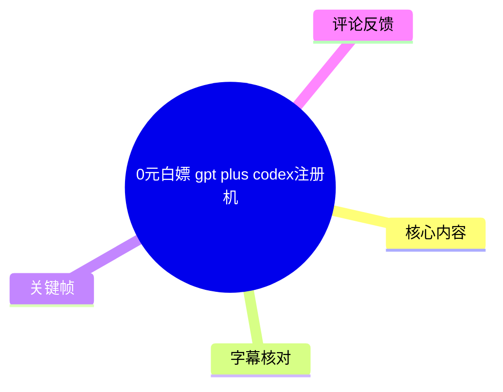
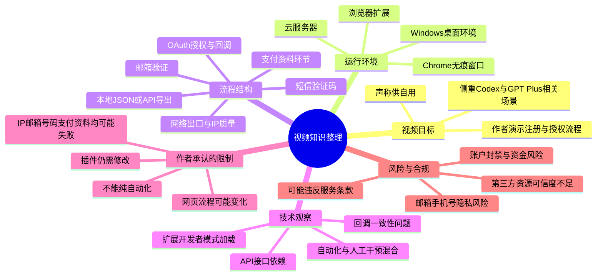
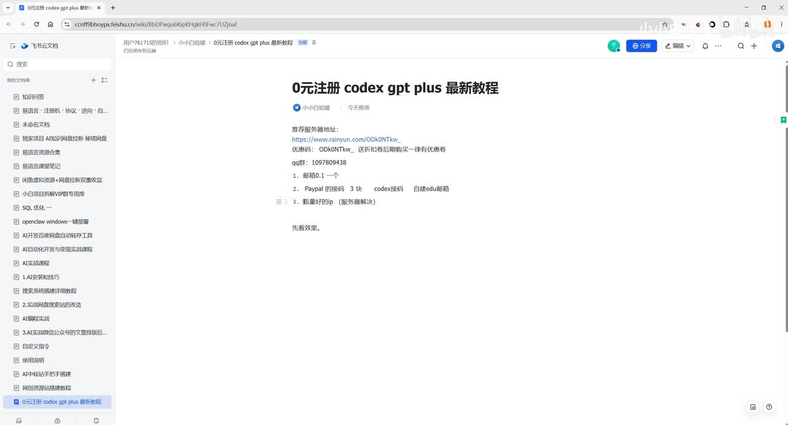
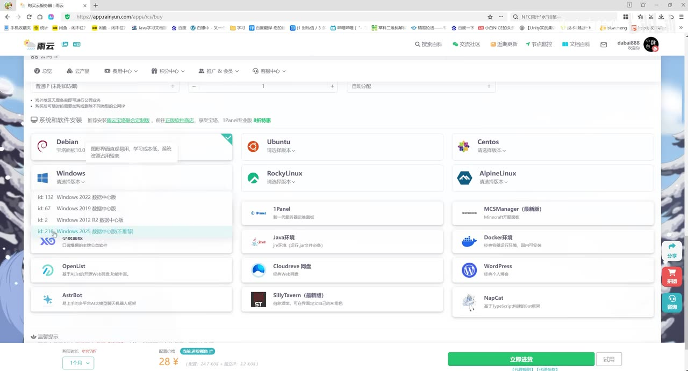
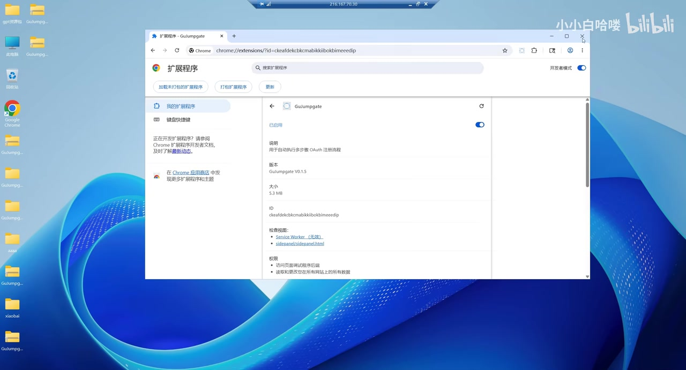
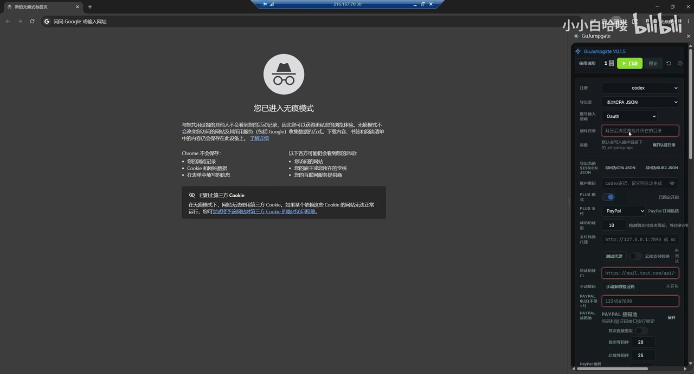

# 0元白嫖 gpt plus codex注册机

> 来源：[Bilibili 视频](https://www.bilibili.com/video/BV1LHVT6EE47)<br>
> UP 主：小小白哈喽｜发布时间：2026-05-27｜视频时长：22 分 37 秒｜合集：AIcode
>
> **合规提示**：视频主题涉及通过脚本、批量邮箱、接码资源、虚拟支付资料及第三方中转服务获取或导入 AI 服务账号/授权。此类做法可能违反 OpenAI、支付服务商、邮箱服务商及平台的服务条款，并可能引发账号封禁、资金损失、隐私泄露与法律风险。本文只整理其技术结构、作者声明、问题诊断与风险信息；**不提供可执行的注册绕过、支付规避、接码配置、批量创建账户或中转站导入操作细节**。

## 小结

视频是一段桌面演示，UP 主称其展示了一个用于处理 “Codex / GPT Plus” 相关注册与授权流程的浏览器插件/脚本方案。作者把问题拆成网络出口、邮箱、短信验证码、支付资料和 OAuth 授权回调等环节，并以 Windows 云服务器和 Chrome 无痕窗口作为运行环境。

视频最重要的技术信息并非“0 元”本身，而是作者承认流程**并不稳定、也无法完全自动化**：插件版本仍在修改，支付资料、号码、网络 IP、邮箱状态、服务端接口和网页流程变化都可能造成失败。作者多次在演示中遇到超时、资料校验失败和页面步骤变化。

从工程视角，视频涉及的概念包括：浏览器扩展加载、开发者模式、云端 Windows 环境、插件配置面板、本地 JSON 导出、API 对接、邮箱验证、短信验证码、OAuth 2.0 授权链接，以及回调成功与超时取消同时发生时的一致性问题。有关 OAuth、回调与幂等处理的讨论具有一般软件工程参考价值；但将其用于批量化获取账户或规避服务规则并不合适。

作者声称需要质量较好的 IP，并建议使用服务器而非来源不明的共享网络出口；其理由是支付或验证环节可能拦截低质量 IP。该说法是视频作者的经验判断，并未在视频中给出可独立验证的测试数据或官方依据。

时效性极强：作者在视频内已经明确指出页面、支付资料界面、接码环节和脚本步骤会变，且其使用的插件为自行修改版本。因此，视频中的界面、参数、资源价格、可用性及“成功”结论均不应视为当前仍有效，更不能据此推断服务可被合法、稳定或免费取得。

## 思维导图





## 目录

- [视频定位、背景与合规边界](#视频定位背景与合规边界)
- [作者提出的流程与前置依赖](#作者提出的流程与前置依赖)
- [运行环境：云服务器、Windows 与浏览器扩展](#运行环境云服务器windows-与浏览器扩展)
- [配置面板与数据流：邮箱、接口、JSON 和验证码](#配置面板与数据流邮箱接口json-和验证码)
- [演示过程中的失败、诊断与人工干预](#演示过程中的失败诊断与人工干预)
- [OAuth 授权与回调：可迁移的软件工程知识](#oauth-授权与回调可迁移的软件工程知识)
- [视频中的参数、成本说法与限制](#视频中的参数成本说法与限制)
- [关键帧索引](#关键帧索引)
- [结论与风险提示](#结论与风险提示)
- [字幕比对](#字幕比对)
- [评论分析](#评论分析)
- [处理记录](#处理记录)

## 视频定位、背景与合规边界

### 作者所称问题与目标 [00:00:00](https://www.bilibili.com/video/BV1LHVT6EE47?t=0)

作者开场表示要处理“注册时的问题”，并给出“最新思路和方案”。根据 ASR 和画面，视频聚焦一个名为 **GuJumpgate** 的浏览器扩展及其配套配置过程；标题中出现 “gpt plus”“codex注册机”，但视频并没有提供可验证的 OpenAI 官方授权说明、账号权益证明或免费资格依据。

作者把相关流程描述为由多个外部依赖组成：

1. 邮箱资源；
2. 短信接码或手机号验证；
3. 支付资料/虚拟支付资料；
4. 网络 IP 与服务器；
5. 浏览器插件及其版本；
6. 第三方站点或“中转站”的 OAuth 授权导入。

这些组件均可能来自非官方渠道。视频没有展示其合法来源、数据授权范围、账户归属确认机制或隐私处理方式，因此不宜将其作为实际操作方案。



> 图：关键帧展示一份标题为“0元注册 codex gpt plus 最新教程”的在线文档。文档将资源概括为邮箱、PayPal 相关项目、Codex 接码和自建 EDU 邮箱等。这张图的价值在于明确视频的核心不是通用 AI 使用教学，而是围绕账户注册、验证与支付链路组织的流程。

### 作者的用途声明与商业关联 [00:01:23](https://www.bilibili.com/video/BV1LHVT6EE47?t=83)

作者称该方案“主要是为了自用”，同时提到 QQ 群门槛、服务器购买链接、优惠券及群内提供资源等内容。后续还提及接码、支付资料的市场价格和供应商问题。

这意味着视频并非完全独立、中立的工具评测：作者与服务器推荐、社群资源或相关供应链之间可能存在推广或交易关系。观看者应将其中“推荐”“成本”“可用性”“成功率”等表述视为作者口述，而不是经过第三方验证的事实。

## 作者提出的流程与前置依赖

### 网络出口与 IP 质量判断 [00:00:46](https://www.bilibili.com/video/BV1LHVT6EE47?t=46)

作者解释购买服务器的理由是：部分共享网络或低质量出口 IP 可能在支付、验证码或账户注册阶段被拦截。作者提到住宅 IP、付费网络服务及“IP 干净”等概念，并以此解释他人教程与实际操作效果不同的原因。

可提炼的通用结论是：

- 风控系统通常会综合网络信誉、设备指纹、账号行为、支付资料、邮箱历史等多个信号判断风险；
- 单纯更换 IP 并不能保证通过任何服务的验证；
- 使用服务器、代理或异常地区网络访问服务，反而可能触发额外的账户安全检查；
- 不应把“IP 质量”理解为绕过平台安全或验证机制的手段。

### 云服务器与 Windows 环境 [00:02:05](https://www.bilibili.com/video/BV1LHVT6EE47?t=125)

作者在云服务商购买页面中选择云产品，并说可选美国或东京区域，且库存可能变化。画面显示系统镜像选项，作者强调需选可提供 Windows 的环境，随后进入 Windows 桌面。



> 图：关键帧展示云服务商的系统与软件镜像选择页面，包含 Debian、Ubuntu、CentOS、Windows、Docker 等类别。它说明作者依赖的是远程 Windows 图形桌面，而非单纯本地浏览器环境；同时也能看出视频没有展示正式的安全配置、账号权限管理或数据隔离措施。

作者的环境侧重点为：

| 项目 | 视频中的说法 | 整理说明 |
| --- | --- | --- |
| 地区 | 美国或东京均可，库存可能变化 | 仅为作者当时的选择，不构成可行性承诺。 |
| 操作系统 | 希望使用 Windows，画面中为 Windows 桌面 | 这是为了运行图形化浏览器与扩展，不代表必须使用 Windows。 |
| 服务器用途 | 作为类似“挂机板”的远程环境 | 远程桌面存放浏览器资料、邮箱凭据或授权信息存在泄露风险。 |
| 网络质量 | 作者认为会影响验证与支付页面 | 无独立测试数据，且不应将此用于规避风控。 |

### 浏览器扩展的加载方式 [00:05:00](https://www.bilibili.com/video/BV1LHVT6EE47?t=300)

作者在 Chrome 扩展管理页中展示了开发者模式加载方式，并称使用了自改的插件版本。ASR 中插件名识别不稳定；关键帧可辨识扩展页面显示为 **GuJumpgate**，版本显示为 **v0.1.5**，说明文字写有“用于激活执行多步骤 OAuth 注册流程”。



> 图：关键帧展示 Chrome 扩展的详情页面、扩展名称 GuJumpgate、版本号 v0.1.5、Service Worker 状态及权限信息。这张图的价值在于确认视频确实使用了本地/开发者模式扩展，并非 OpenAI 或 Chrome 商店中已核验的官方工具。

作者的相关陈述包括：

- 他使用的版本为自行调整后的版本；
- 他认为“纯自动”不太现实；
- 需要在扩展中开启部分选项，并从无痕窗口启动流程；
- 若扩展打开后闪退，作者猜测可能与配置有关；
- 插件包将通过其群组或链接分发。

**风险提示**：以开发者模式加载未验证扩展，会使扩展获得其声明范围内的浏览器权限。关键帧中的权限区域显示其可能访问网页内容。若扩展涉及邮箱、授权回调、验证码或会话数据，用户应特别警惕 Cookie、OAuth Token、账号密码与浏览器数据被读取或上传。

## 运行环境：云服务器、Windows 与浏览器扩展

### Python 3.10 与插件依赖 [00:03:58](https://www.bilibili.com/video/BV1LHVT6EE47?t=238)

作者称需安装“Python 3.10”，原因是其他版本可能无法正常打开其插件或对应组件。ASR 将 Python 误识别为 “Patreon”，但结合技术上下文应校正为 **Python 3.10**。

视频没有展示：

- Python 的官方下载来源；
- 安装包完整性校验；
- `requirements.txt`、依赖清单或虚拟环境；
- 代码仓库、许可证与审计信息；
- 插件后台服务的监听地址、安全认证和日志脱敏策略。

因此，作者所说“Python 3.10 可用、其他版本打不开”仅能理解为其个人环境兼容性结论，不能视为通用技术要求。

### 无痕窗口与持久运行窗口 [00:05:35](https://www.bilibili.com/video/BV1LHVT6EE47?t=335)

作者在 Chrome 无痕窗口中运行扩展，并展示类似 “KEEP THIS WINDOW OPEN” 的提示，解释为需要保持窗口一直运行。一般而言，这可能表明扩展或其后台页面需要维持会话、轮询邮件、监听回调或执行自动化操作。

需要注意：

- 无痕模式只是在本地浏览器会话结束后减少部分本地记录，并不意味着对网站、扩展、服务器、网络服务商或第三方 API 匿名；
- 若无痕窗口登录邮箱或账户，扩展仍可能在运行期间访问其可见内容；
- “保持窗口打开”会增加无人值守运行和会话被他人接管的风险；
- 使用浏览器自动化处理第三方账户，需要获得服务条款和账户所有者的明确许可。

## 配置面板与数据流：邮箱、接口、JSON 和验证码

### 配置界面显示的功能模块 [00:06:39](https://www.bilibili.com/video/BV1LHVT6EE47?t=399)

视频展示的扩展侧栏包含注册目标、导出方式、账号导入、目录、密码、支付方式、支付代理、验证码接口、手机号/接码等字段。画面中可见作者将目标指向 “codex”，并选择“本地 CPA JSON”一类导出形式；由于画面和 ASR 对术语均存在误识别，无法确认其 JSON 的确切字段规范。



> 图：关键帧同时展示 Chrome 无痕窗口和 GuJumpgate 配置侧栏。侧栏包含注册目标、导出方式、文件目录、密码、支付方式、支付代理、验证码接口等敏感配置项。其价值在于说明该工具汇集了多类身份与验证信息，也因此具有较高的安全和合规风险。

从软件架构角度，可将作者描述的数据流抽象为：

```text
浏览器扩展
  ├─ 读取本地配置
  ├─ 调用邮箱或验证码相关接口
  ├─ 驱动网页交互
  ├─ 保存/导出会话或授权结果
  └─ 可选：向第三方 API 或中转服务提交授权信息
```

这种架构中的敏感数据包括邮箱账号、邮箱 API、手机号、验证码、支付信息、浏览器会话、OAuth 授权码、访问令牌和回调 URL。任何实际系统都应至少具备最小权限、传输加密、密钥隔离、访问日志、撤销机制与数据删除机制；视频没有展示这些安全控制。

### 邮箱导入与 API 对接问题 [00:07:51](https://www.bilibili.com/video/BV1LHVT6EE47?t=471)

作者演示导入多个邮箱账号，称已购买十个邮箱、当前导入八个，因为部分已使用。随后一次尝试出现启动失败和 `timeout`，作者判断应选择 API 对接并确保对应服务已启动，之后显示“校验通过”。

这里能整理出的通用排错信息是：

| 现象 | 作者的判断 | 更稳妥的工程解释 |
| --- | --- | --- |
| 启动失败 / timeout | 接口对接方式不正确或服务未启动 | 还可能是网络不可达、鉴权失败、DNS、限流、接口变更或服务端故障。 |
| 校验未通过 | 邮箱/接口不可用 | 应检查授权范围、令牌有效期、邮箱提供商限制、接口响应码和审计日志。 |
| 本地 JSON 导出异常 | 作者称插件可能少步骤或仍有问题 | 应使用明确的 schema、版本号、字段验证和错误提示，而非依赖猜测。 |

视频中出现的“导入批量邮箱”和“获取验证码”属于高风险环节。合法的自动化仅应处理自己拥有且已授权的邮箱账户，不应购买、共享或批量使用来源不明的邮箱资源。

### 手机验证与接码资源 [00:09:26](https://www.bilibili.com/video/BV1LHVT6EE47?t=566)

作者在“接码设置”中选择手机号相关配置，并称自己调整了自定义接码选项。随后提到一个号码可能可接收多次验证码，以及其观察到的单个号码成本与单次账户成本。

这部分属于规避或规模化处理第三方服务身份验证的直接操作链路，本文不复述设置方法、资源来源、字段内容或步骤。需要明确的是：

- 短信验证码用于验证账户控制权、降低滥用与欺诈风险；
- 使用共享、租赁、虚拟或非本人控制的号码，可能使账号无法找回，也可能违反服务条款；
- 将验证码能力与账户批量操作结合，会显著提高平台安全与合规风险；
- 作者称“一个号可多次使用”“成本不足若干金额”均为个人口述，不能作为真实、合法或当前可用的依据。

## 演示过程中的失败、诊断与人工干预

### 自动化不是稳定方案 [00:11:09](https://www.bilibili.com/video/BV1LHVT6EE47?t=669)

作者建议观众以 1.2 倍或 1.5 倍速度观看，并承认自动化界面操作较慢，可以人工干预；他还称协议方式运行也可能出问题。这一段与前文“纯自动不太现实”的表述一致。

作者的实际经验是：将问题拆开处理，而不是持续在单一资源上反复尝试。虽然这一方法被作者用在注册流程中，但其可迁移的、合规的工程思想是：

1. 先缩小故障范围；
2. 一次只改变一个变量；
3. 区分网络、账号、接口、数据格式和页面流程问题；
4. 记录可复现条件、错误码和时间；
5. 避免无休止重试触发更严格的风控或限流。

### 支付资料校验失败 [00:14:03](https://www.bilibili.com/video/BV1LHVT6EE47?t=843)

作者解释其所谓 “PP” 与支付资料有关，并在现场遇到资料校验失败。ASR 中出现 “4256”“New Worker”“N-A”等零散字段，反映作者尝试排查地址、地区缩写或编码匹配问题；由于语音识别错误较多、画面中敏感字段不应整理，无法可靠确认具体数据。

作者最终判断该问题可能来自“供货”或支付资料本身，并选择停止、手动处理或更换资源。这可归纳为一个重要限制：

> 作者自己也无法保证支付资料可用；视频展示的成功不是端到端可重复证明，而是一个包含替换资源、人工调整和临时修改脚本的过程。

任何涉及伪造、购买、共享或不属于本人的支付资料的行为都不应进行。对于合法订阅，应使用本人真实、受支持地区和渠道的支付方式，并以官方产品页、账单页和服务条款为准。

### 页面与脚本版本变化 [00:19:18](https://www.bilibili.com/video/BV1LHVT6EE47?t=1158)

作者在第八步附近发现流程“跳过后去先……”不正确，表示还要完善和修改；后续又称号码可能有问题，页面可能已变化，自己因“获取不到”某字段而让 AI 修改插件。

这说明视频的演示材料存在以下不确定性：

- 插件并非稳定发布版；
- 页面流程可能已变动；
- 关键步骤依赖作者临时修改；
- 作者未完整展示源码、测试用例与变更记录；
- 结果会受外部服务、账号状态和风控规则影响；
- 视频录制时可用，不代表发布后仍可用。

## OAuth 授权与回调：可迁移的软件工程知识

### 作者对回调问题的讨论 [00:18:38](https://www.bilibili.com/video/BV1LHVT6EE47?t=1118)

视频后段从账户导入过渡到“回调”问题。作者提到当网络波动时，如何确保客户侧/服务端在授权成功后仍正确接收回调；并提出一个典型竞态条件：一边的自动取消时间到期，另一边却在同一时刻完成授权成功，如何保证最终状态一致。

这是视频中最具一般工程价值的主题。对于任何**获得用户明确授权的 OAuth 系统**，都应考虑：

| 工程问题 | 推荐原则 |
| --- | --- |
| 回调重复到达 | 使用幂等键或授权状态记录，重复回调不产生重复副作用。 |
| 回调延迟 | 不要仅以短时前端状态判断失败；采用后端状态查询、重试队列或最终一致性设计。 |
| 自动取消与成功并发 | 通过状态机、版本号、事务/条件更新来约束合法状态迁移。 |
| 授权链接安全 | `state` 参数应防 CSRF，使用 PKCE，限制重定向 URI。 |
| Token 保护 | 不将授权码、Refresh Token、访问令牌写入日志、前端页面或不受保护的本地文件。 |
| 异常审计 | 记录时间、请求 ID、状态迁移与错误码，同时避免记录密码、验证码及完整 Token。 |

### OAuth 2.0 与“授权链接” [00:20:01](https://www.bilibili.com/video/BV1LHVT6EE47?t=1201)

作者将 “Auth” 解释为 OAuth 2.0 登录/授权，并演示在其所谓“中转站”中添加账号、生成授权链接、复制并完成回调导入。视频称进入授权链接后可不需要再次手机验证码并直接回调。

需区分两类情况：

- **合法 OAuth 授权**：用户在官方授权页自主登录、明确同意授权范围，第三方应用仅获得被授权的范围和期限内的访问能力；
- **不当授权导入**：使用他人账户、自动化账户、来源不明会话、第三方中转站或未经授权的 Token，风险极高。

视频没有展示该“中转站”的运营主体、隐私政策、数据存储位置、OAuth 客户端注册信息、回调 URI 白名单、Token 加密措施或账户删除机制。因此，不能确认其安全性，也不建议向此类服务提交任何账户授权。

## 视频中的参数、成本说法与限制

### 作者口述的参数与状态

以下内容仅记录视频中作者的表述，不代表推荐值、事实验证或当前可用状态：

| 时间 | 作者说法 | 可靠性与限制 |
| --- | --- | --- |
| [02:07](https://www.bilibili.com/video/BV1LHVT6EE47?t=127) | 服务器地区可选美国或东京，可能缺货。 | 基于录制时页面库存；随时变化。 |
| [03:58](https://www.bilibili.com/video/BV1LHVT6EE47?t=238) | 建议 Python 3.10，其他版本可能打不开组件。 | 是作者自身兼容性经验，缺少依赖说明。 |
| [03:29](https://www.bilibili.com/video/BV1LHVT6EE47?t=209) | 自改版本为 1.3。 | 未提供版本控制、源码、校验和。 |
| [05:14](https://www.bilibili.com/video/BV1LHVT6EE47?t=314) | 需在 Chrome 扩展页打开开发者模式。 | 画面可验证为本地扩展加载，但不代表安全。 |
| [07:08](https://www.bilibili.com/video/BV1LHVT6EE47?t=428) | 某支付资料资源市场价值约 3～5 元，可多次用。 | 涉及敏感资源交易，且只是作者口述。 |
| [10:30](https://www.bilibili.com/video/BV1LHVT6EE47?t=630) | 号码资源约 3～3.5 元，称可多次接码，单账户成本不足 1.5 元。 | 不可验证；可能违反服务条款；价格和可用性会变化。 |
| [11:11](https://www.bilibili.com/video/BV1LHVT6EE47?t=671) | 建议 1.2 或 1.5 倍观看。 | 仅是观看建议。 |
| [21:29](https://www.bilibili.com/video/BV1LHVT6EE47?t=1289) | 熟悉后一个账号约两三分钟。 | 仅为作者主观估计，不代表合法、稳定或可复现。 |

### 作者明确承认的限制 [00:03:35](https://www.bilibili.com/video/BV1LHVT6EE47?t=215)

视频中至少出现以下限制和不确定性：

- 纯自动化“不太现实”；
- 扩展存在问题，作者自行改过；
- 一些步骤被省略，需要依赖其前一期视频；
- 某些服务器不支持 Windows；
- 扩展和邮件接口可能超时或启动失败；
- 号码、邮箱、IP、支付资料都可能引起失败；
- 支付资料可能本身不合格；
- 页面和支付界面可能已经变化；
- 流程第八步仍不正确，需要继续修改；
- 作者没有展示完整的安全设计、源码审查、官方许可或成功结果的可验证证据。

## 关键帧索引

| 关键帧 | 对应主题 | 正文使用价值 |
| --- | --- | --- |
|  | 视频开头的教程说明文档 | 证明视频围绕邮箱、支付、接码与服务器等资源组合展开。 |
|  | 云服务商的 Windows 镜像选择 | 用于理解作者为什么采用远程 Windows 图形环境。 |
|  | Chrome 扩展 GuJumpgate v0.1.5 | 确认作者使用的是开发者模式扩展，并提示权限与供应链风险。 |
|  | 无痕窗口与扩展配置面板 | 直观展示工具汇聚邮箱、支付、验证码和导出配置，说明敏感数据风险。 |

> 未使用其余关键帧：提供的素材清单列有 `frame-005.jpg` 至 `frame-012.jpg`，但当前可见多模态素材仅明确展示了前四张画面内容。为避免对未见画面作出推断，未将其纳入正文论据。

## 结论与风险提示

### 可迁移的正向知识

视频中可以抽取、但应在合法授权项目中使用的经验包括：

1. **复杂集成应拆分排错**：网络、接口、账号状态、数据格式与页面流程应分别验证。
2. **自动化必须预期失败**：网页 UI、验证码、网络延迟和外部 API 都会导致流程不稳定。
3. **OAuth 回调需要状态机与幂等设计**：授权成功、超时取消、网络重试可能并发发生。
4. **扩展供应链必须审查**：开发者模式加载的扩展需要检查源码、权限、更新渠道与数据流。
5. **敏感数据必须最小化处理**：邮箱、密码、验证码、支付资料与 Token 不应交给不透明的第三方工具或中转服务。

### 不应采纳的部分

不建议依据视频实施以下行为：

- 使用非本人或来源不明的邮箱、手机号、支付资料或授权信息；
- 通过接码平台、虚拟支付资料或自动化流程规避服务验证；
- 向未经审计的浏览器扩展输入账号、密码、验证码或 Token；
- 将 OAuth 授权链接、会话 JSON 或访问令牌导入不透明的“中转站”；
- 根据视频中的价格、可用性或“几分钟一个号”等说法作出消费或技术决策。

### 时效性判断

视频发布于 2026-05-27，素材抓取时间为 2026-07-16。作者录制时已经提到插件、支付页面、接码和流程会改变，且其自改版本仍有未修复问题。故本文所述内容应被视为**一次特定时点的风险性演示记录**，而不是当前可执行教程，更不是服务权益或账户可用性的保证。

## 字幕比对

| 字幕来源 | 完整性 | 专有名词 | 时间轴 | 主要问题 |
| --- | --- | --- | --- | --- |
| Bilibili 站内字幕 `p01-ai-zh.srt` | 严重不匹配 | 与视频主题完全不符 | 有 00:00:00～00:05:09 的精确时间轴，但对应内容为 iPhone 16 钢化膜测试 | 字幕谈论手机跌落、钢化膜、透光率等，与本视频桌面演示、Codex、扩展及 OAuth 无关，疑似串片或错误字幕。 |
| 本次 ASR 字幕 | 覆盖较完整 | 多个英文术语误识别，但可结合上下文校正 | 具备 576 个真实时间段；语音覆盖约 994.17 秒，占视频约 73.31% | 存在口语重复、乱码和术语误识别，如 “Patreon” 应为 Python、“Auth”/“OAuth”混用、“PP”具体含义不清、部分 API/产品名无法可靠辨认。 |

### 最终字幕选择与校正

最终以**本次 ASR 的真实时间轴**为主，结合关键帧和上下文进行有限校正；不采用站内字幕，因为其内容与视频完全不对应。

本次 ASR 检测结果为：

- 识别语言：中文；
- 语言置信度：0.99365234375；
- 音频时长：1356.096 秒；
- 有时间戳：是；
- `noAudioStream`：**未标记为 true**，说明素材存在可识别音轨，并非无音轨视频；
- ASR 存在 6 个较大静音/无有效语音区段，最大约 23.31 秒，出现在 00:16:55～00:17:19 附近。

依据关键帧和语境作出的重要校正：

| ASR 原文 | 本文采用的表达 | 校正依据 |
| --- | --- | --- |
| “Patreon 3.10” | Python 3.10 | 语境为本地运行环境与版本兼容性。 |
| “GuJumpgate” | GuJumpgate | 扩展详情关键帧可见该名称。 |
| “Auth”“OA” | OAuth / OAuth 2.0 授权 | 作者明确解释为 OAuth 登录、授权链接与回调。 |
| “SUBAR API”“Subware” | 不确定的第三方 API / 中转服务 | ASR 不稳定，未对真实产品名作无依据扩写。 |
| “PP” | 支付资料/虚拟支付相关资源 | 作者将其与支付、资料校验和创建虚拟账户关联；不对具体服务作确定指认。 |
| “本地 CPA JSON” | 本地 JSON 导出项（名称不完全确认） | 画面与 ASR 均无法可靠确认缩写全称。 |

## 评论分析

以下仅分析当前可获取的热评前三条，不将评论视为已核实事实。

### 1. 只买保健品｜8 赞

> “接码几毛钱，卖3块。codex接码还要卖一次。还给你推垃圾服务器！拿着linuxdo的免费东西来这里赚钱。一点脸都不要”

评论认为视频涉及高价转售接码、推广质量不佳的服务器，并质疑作者将其他社区的免费资源商业化。该评论与视频中作者提到服务器链接、群组资源、支付资料和接码价格的内容形成呼应。

但评论没有附上商品链接、成本证据、资源来源或 LinuxDo 相关对照材料，因此其中关于价格、资源归属及商业行为的指控**不能作为既定事实**。它的价值主要在于提示观众审查推广关系、资源来源、价格透明度和工具许可。

### 2. bili_3691007401003129｜2 赞

> “我在此处[打call]”

该评论仅表达支持，没有提供任何技术补充、使用反馈、风险信息或可验证证据，对判断视频方案的可靠性帮助有限。

### 3. Heisenberg178｜2 赞

> “两三天一封的话，一个月成本不低[笑哭]”

评论关注邮箱资源的长期成本，隐含质疑视频“低成本”或“0 元”叙事的可持续性。视频中作者确实提到需要购买或导入多个邮箱资源，因此该评论提出了合理的成本核算方向。

不过，“两三天一封”的频率并未在视频和评论中得到来源说明，不能据此计算真实月成本。合理的评估应包括服务器、邮箱、手机号、支付方式、时间投入、失败损耗、账号封禁风险和隐私成本，而不能只看单个资源的标价。

## 处理记录

- Worker ID：`worker-mrj0wjed-b0c290ad`
- 模型：`gpt-5.6-terra`
- 调用工具与素材：视频元数据、关键帧素材、Bilibili 站内 SRT、ASR 时间轴字幕、ASR 诊断结果、热评 JSON。
- 使用的应用工具：基于已提供素材进行字幕对照、时间轴换算、关键帧多模态阅读与评论整理；未执行外部账号注册、接码、支付、OAuth 导入或中转站操作。
- 字幕选择：检查了站内字幕与本次 ASR。站内字幕内容为无关的 iPhone 钢化膜视频，判定不可用；正文以本次 ASR 的真实分段时间为准，并以关键帧校正少量技术术语。
- 音轨判断：ASR 结果具有中文识别、576 个时间段及 73.31% 语音覆盖；未出现 `noAudioStream=true`，因此按有音轨素材处理。
- 关键帧选择依据：`frame-001` 用于确认视频开头文档的资源链路；`frame-002` 用于确认云服务器/Windows 环境；`frame-003` 用于确认开发者模式扩展与版本；`frame-004` 用于确认扩展配置面板含敏感数据项。未对不可见的其他帧编造画面内容。
- 缓存清理：提供的素材中未包含缓存清理执行日志；本次整理未生成或保留新的外部下载缓存，无法据素材证明工作目录级别的清理结果。
- 未解决问题：
  - “PP”“SUBAR API”“Subware”“CPA JSON”等 ASR 词汇存在识别歧义，未据猜测确定其真实名称；
  - 无法验证作者自改插件、第三方资源、群组服务和中转站的安全性、合法性、价格及实际可用性；
  - 无法验证视频所谓“免费”“成功”是否对应官方认可的服务权益或长期有效账户。
