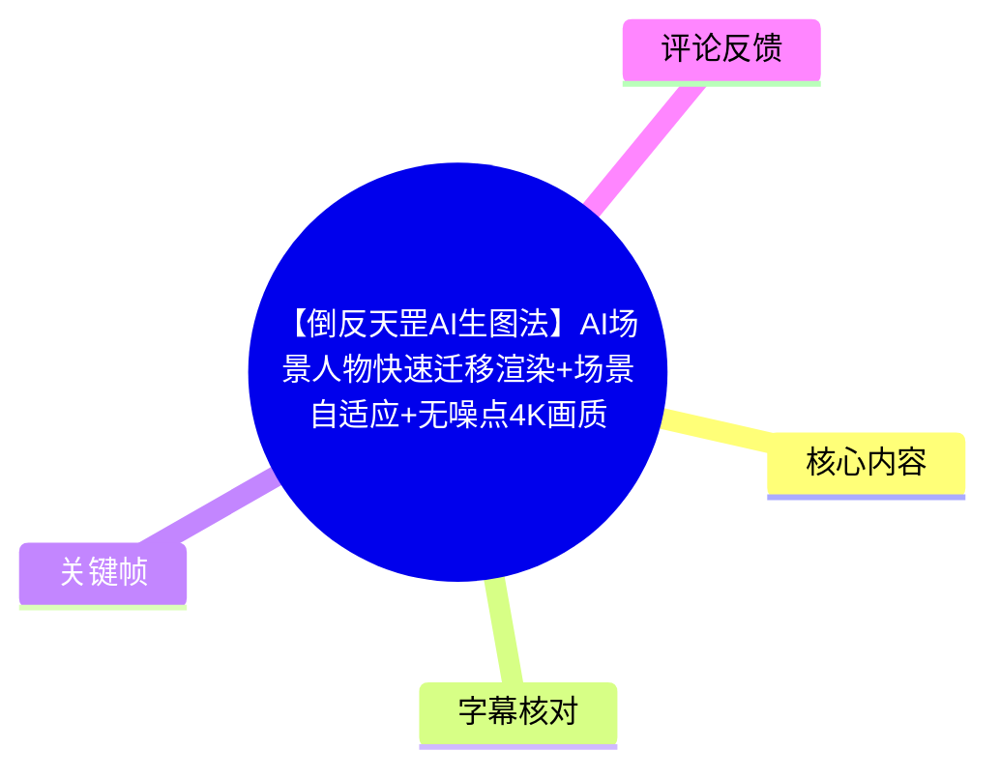
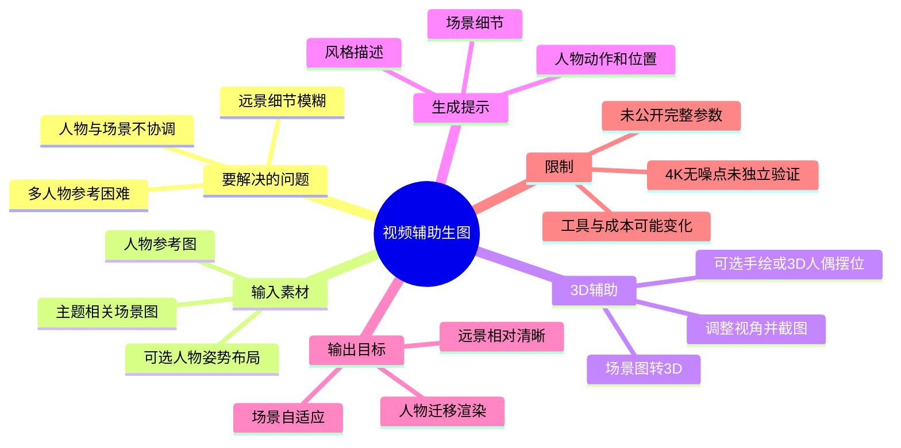
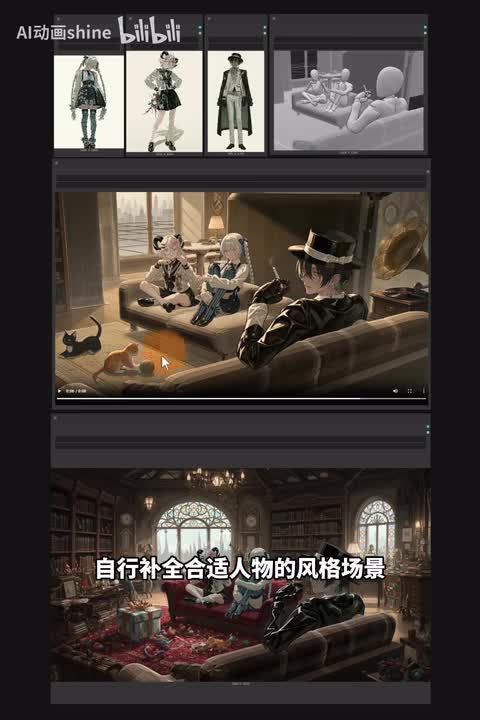
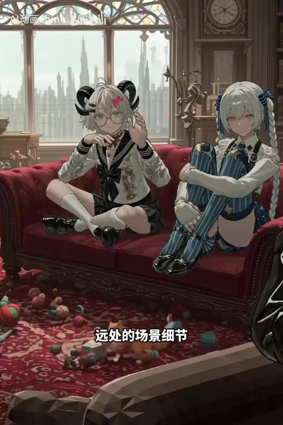
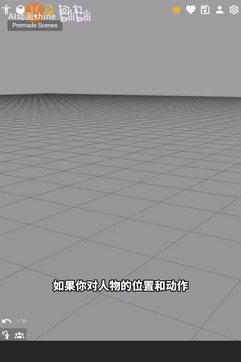
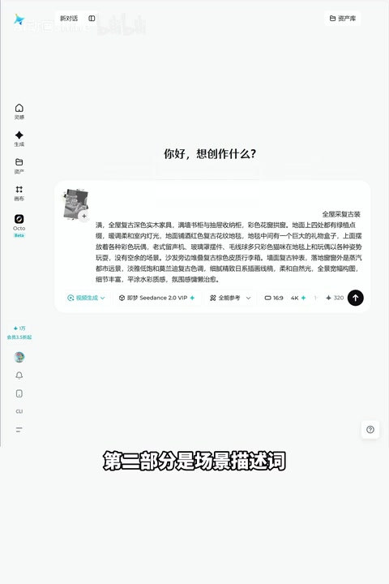

# 【倒反天罡AI生图法】AI场景人物快速迁移渲染+场景自适应+无噪点4K画质

> 来源：[Bilibili 视频](https://www.bilibili.com/video/BV1UV7h61Edy)  
> UP 主：AI动画shine｜分区/合集：AIcode｜时长：02:08｜画面规格：1440×2160（竖屏）  
> 标签：辅助、教程、ComfyUI、Seedance2、4K画质、WebUI、3D辅助

## 小结

视频提出一种“用视频来生图”的场景人物迁移思路：先准备人物参考图，再将与主题相符的场景图转为可调整视角的 3D 场景；如需精确构图，则额外在 3D 场景中摆放人物动作和位置；最后把人物图与场景/3D 图共同输入视频生成工具，通过提示词完成渲染。

该方法的核心不是直接依赖单次文生图或多人物生图，而是借助视频生成过程的画面补全能力，让模型根据已有场景和人物参考补出相对协调的人物、环境与构图。UP 主将其称为“倒反天罡”的 AI 生图方式。

视频展示的目标效果是：人物被放置在室内场景中，远景建筑、家具、地毯和人物面部仍保持相对清晰；UP 主据此认为可缓解远处细节模糊、噪点多、人物细节崩坏等问题。标题中的“无噪点 4K”属于视频宣称的效果，素材中未给出客观清晰度测试、放大倍率、原始输出文件或不同模型的横向对比，因此不能将其视为已独立验证的普遍结论。

实操上，提示词被拆为两部分：第一部分描述人物的姿势、动作与画面位置；第二部分描述场景细节和目标风格。视频强调，若人物位置和动作没有明确要求，可以省略手绘或 3D 人偶摆位这一步，以缩短准备流程。

该教程适合已经有角色设定图、需要把角色迁移进特定空间，或希望通过 3D 预设构图提高人物位置可控性的创作者。前置条件包括：能准备人物图片、场景图片，以及能使用图片转 3D 和视频生成类工具。视频未提供完整工作流文件、具体模型版本、显卡/云端成本、生成时长及提示词全文。

方法具有明显时效性：视频发布于 2026 年 6 月，涉及的 Seedance、图片转 3D、视频生成界面及其可用参数均可能随着平台更新而变化。热评也指出，该流程可能存在成本偏高的问题；这是用户观点，视频本身没有公布成本数据。

## 思维导图

## 目录

- [背景：以视频生成补足生图短板](#背景以视频生成补足生图短板)
- [效果演示：人物参考与场景自适应](#效果演示人物参考与场景自适应)
- [流程一：准备人物与主题场景](#流程一准备人物与主题场景)
- [流程二：将场景转为 3D 并确定镜头](#流程二将场景转为-3d-并确定镜头)
- [流程三：需要精确位置时进行人物摆位](#流程三需要精确位置时进行人物摆位)
- [流程四：输入素材与编写提示词](#流程四输入素材与编写提示词)
- [步骤清单与可复用经验](#步骤清单与可复用经验)
- [参数、限制与时效性](#参数限制与时效性)
- [字幕比对](#字幕比对)
- [评论分析](#评论分析)
- [处理记录](#处理记录)

## 背景：以视频生成补足生图短板 [00:00](https://www.bilibili.com/video/BV1UV7h61Edy?t=0)

UP 主开场将该方案概括为“用视频来生图”。其动机是把视频生成的参考一致性和画面补全能力，反向用于静态场景渲染。

根据 ASR，可辨识到视频提及此前的“Seedance 2 全能参考”已能依据草图生成画面，并自行补全适合人物的效果。由于 ASR 对专有名词存在误识，画面中可见生成界面含有“Seedance 2.0 VP”字样；因此只能确认视频画面展示了带有 Seedance 2.0 标识的生成选项，不能仅凭该帧确认其确切产品版本、平台归属或全部模型能力。

UP 主提出的痛点包括：

1. 在较低分辨率或远景画面里，人物与场景容易出现细节模糊。
2. 扩散模型及原生多模态模型在远处人物细节上可能发生崩坏——这是视频中的经验性判断，未附带测试样本和量化指标。
3. 多人物参考图直接生图时，角色一致性与场景协调较难兼顾。
4. 即使有人物参考，人物姿势、站位、镜头角度仍需要额外控制手段。

视频的解决路线是：以 3D 场景承接空间关系，以人物图承接角色身份，再让视频生成过程完成渲染与风格融合。

## 效果演示：人物参考与场景自适应 [00:08](https://www.bilibili.com/video/BV1UV7h61Edy?t=8)

视频先展示人物参考、灰模/3D 场景与最终室内画面之间的关系。画面中的最终结果为两名风格化角色坐在红色沙发上，窗外有城市建筑，前景包含地毯与散落物件。UP 主用这一示例说明模型可围绕已有角色和场景，补全出与人物风格相匹配的空间。

> 图：该帧同时呈现人物参考图、灰色 3D 辅助场景、生成过程画面及最终室内效果，是理解“人物图 + 场景图/3D 图 + 视频渲染”输入关系的关键证据。它也显示本教程并非仅输入文字提示，而是依赖多个视觉参考。

视频中的文字强调“自行补全合适人物的风格场景”。应注意，这里的“自行补全”是对示例结果的描述，并不等同于模型必然能在任意人物、任意场景下稳定实现相同效果。人物身份保持程度、衣饰细节、透视准确性以及多角色之间的互相遮挡，均未在视频中进行系统展示。

## 流程一：准备人物与主题场景 [00:35](https://www.bilibili.com/video/BV1UV7h61Edy?t=35)

UP 主给出的首要准备项是人物图。人物可以通过两种来源获得：

- 自己手绘；
- 使用 AI 生成。

随后需选择一张与图像主题相关的场景图。本例目标是室内画面，因此选用室内设计类图片作为场景基础。视频没有限定必须使用真实照片、概念设计图或特定分辨率，也未提供人物图和场景图的尺寸、格式、数量上限等技术参数。

人物图在整个流程中承担的是角色外观参考：例如发型、服装、整体画风和人物身份特征。场景图承担空间主题与环境参考：例如室内结构、沙发布局、窗户、城市背景、家具和光照氛围。

> 图：该帧聚焦于红色沙发上的两名角色、窗外城市和室内陈设，对应 UP 主所说的“远处的场景细节”。它能帮助读者直观看到视频用于说明清晰度与场景融合的样例，但不能替代原始分辨率文件或客观画质测评。

视频称在放大图片后，人物面部和远处场景细节“没有发生噪点过多或者细节崩坏”。这一说法应理解为 UP 主对展示样张的观察。素材中未说明：

- “放大”的具体倍率；
- 输出的实际像素尺寸；
- 是否经过后期放大或降噪；
- 是否使用固定随机种子；
- 是否从多个生成结果中筛选；
- 是否与传统生图流程采用同一输入条件比较。

因此，若要复现或评价“无噪点 4K”，需要自行保存原始输入、原始输出与生成日志。

## 流程二：将场景转为 3D 并确定镜头 [00:52](https://www.bilibili.com/video/BV1UV7h61Edy?t=52)

第二步是将选定的场景图转为 3D。视频称使用“图片转 3D 的工作流”完成转换，但未展示完整节点图、模型名称、下载地址、运行环境或具体配置。元数据标签包含 ComfyUI、WebUI、3D辅助，但视频 ASR 没有提供可核验的工作流细节，不能据此断言使用了某一特定 ComfyUI 节点。

完成场景图转 3D 后，执行以下动作：

1. 在可浏览的 3D 场景中移动视角。
2. 找到所需的镜头构图。
3. 对当前视角截图。
4. 将该截图作为后续生成阶段的场景/空间参考之一。

这一步的实际价值在于：把抽象的“希望角色出现在某个室内”转化为已经确定透视、地平线、镜头高度和主要物体布局的图像条件。相比仅靠文字描述镜头，3D 截图更容易提供明确的空间锚点。

视频所述“转成 3D”不代表一定获得拓扑正确、可用于影视动画的完整三维资产。根据展示目的，它至少用于调整视角和取得构图截图；其几何精度、可编辑性、遮挡关系是否可靠，视频未作说明。

## 流程三：需要精确位置时进行人物摆位 [01:12](https://www.bilibili.com/video/BV1UV7h61Edy?t=72)

若创作者对人物位置、动作有准确需求，UP 主建议额外使用手绘或 3D 人偶等方式，在场景中标示人物应处的位置和动作。若没有明确要求，可以跳过这一步。

> 图：该帧是带网格地面的 3D 编辑界面，画面字幕明确对应“如果你对人物的位置和动作”。它说明 3D 辅助不仅用于取景，也可作为人物站位、尺度和动作关系的预可视化工具。

这一步可被理解为“控制强度”的分支：

| 需求情况 | 视频建议 | 可获得的控制 |
| --- | --- | --- |
| 只需人物进入某类场景，动作可由模型自由补全 | 跳过摆位 | 减少制作步骤，但人物位置和姿势自主性更高 |
| 要求指定站位、坐姿、朝向或画面构图 | 使用手绘或 3D 人偶摆位 | 为模型提供更具体的空间和动作参考 |
| 多人物需要明确相对位置 | 可推断为更适合进行摆位，但视频未展示完整多人物摆位操作 | 有助于表达构图意图，不能保证完全遵从 |

最后一行是基于视频流程作出的应用性推断，而不是视频已经验证的结论。视频没有展示人偶骨骼编辑、姿势控制器、景深、镜头焦距或人物遮挡修正等细节。

## 流程四：输入素材与编写提示词 [01:32](https://www.bilibili.com/video/BV1UV7h61Edy?t=92)

在生成阶段，UP 主表示要把人物图和 3D 图输入生成工具。ASR 将工具名称识别为“小萌萌”，但该词无法由现有画面可靠校正；关键帧中仅能看到一个带有 Seedance 2.0 标识、比例选择和“4K”选项的网页式生成界面。因此本文不将“小萌萌”作为已确认的产品名称。

> 图：该帧显示生成工具的输入区域，画面字幕为“第二部分是场景描述词”。它直接支持视频提出的“两部分提示词”结构；界面中还能看到比例、4K 等字样，但因文字较小且未展示最终提交配置，不能把它们完整还原为可复用参数。

提示词被分成两个部分。

### 1. 人物描述部分

该部分按“正常的视频分镜”方式描述人物，重点包括：

- 姿势；
- 动作；
- 在画面中的位置；
- 视线方向或人物朝向。

ASR 中可辨识到的示例大意为：人物位于画面某一位置，并保持转头看向镜头的姿势。由于 ASR 在人物名称和具体位置词上失真，视频没有提供可以准确逐字复用的完整示例提示词。

### 2. 场景描述与风格部分

第二部分写入：

- 场景细节描述；
- 希望生成的画风；
- 风格提示词。

UP 主建议可直接参考自己想要的画风作品来组织提示词。这里“参考作品”在视频语境中是提示词/风格描述的灵感来源；视频未说明是否将该作品直接作为图像输入，也未讨论版权、授权或风格模仿的边界。

### 3. 生成与筛选

视频最后表示，将场景细节描述和风格提示词输入后进行生成，并选择最符合画面要求的结果。可确认的操作是“生成后选择结果”；但以下关键信息未披露：

- 生成轮数；
- 单次生成时长；
- 候选数量；
- 是否固定种子；
- 是否使用负面提示词；
- 人物参考权重、场景参考权重；
- 分辨率与帧数；
- 是否从视频中抽帧作为最终静态图；
- 费用或本地硬件需求。

## 步骤清单与可复用经验 [01:50](https://www.bilibili.com/video/BV1UV7h61Edy?t=110)

依据视频的实际叙述，可将流程整理为以下最小闭环：

1. **准备人物图**：可为手绘角色图或 AI 生成角色图。
2. **准备主题场景图**：场景主题应与最终画面目标一致；本例为室内设计图片。
3. **把场景转为 3D**：使用视频提及的图片转 3D 工作流，得到可调整视角的场景。
4. **移动镜头并截图**：在 3D 场景中确定构图、镜头方向和空间布局。
5. **按需增加人物位置控制**：若位置与动作必须准确，使用手绘或 3D 人偶等方式在场景中预先摆放；要求不高则跳过。
6. **导入人物图与 3D 场景截图**：将两类视觉参考放入视频生成/渲染工具。
7. **写人物分镜描述**：明确姿势、动作、位置与朝向。
8. **写场景与风格描述**：补充环境细节及目标视觉风格。
9. **生成并选择结果**：从生成结果中选取最符合目标画面的版本。

可迁移的经验主要有三点：

- **先解决空间，再让模型渲染。** 3D 场景截图负责透视与镜头，减少纯文本描述空间时的不确定性。
- **把角色控制和场景控制分开。** 人物图提供角色外观参考，场景图/3D 图提供环境与构图参考，提示词则补足动作、位置和风格。
- **根据控制需求决定流程复杂度。** 不追求精确姿势时可以简化；需严格构图时则增加摆位步骤。

## 参数、限制与时效性 [01:58](https://www.bilibili.com/video/BV1UV7h61Edy?t=118)

### 视频中可见或可辨识的信息

| 项目 | 视频/素材信息 | 说明 |
| --- | --- | --- |
| 成片时长 | 02:08 | 来自元数据 |
| 视频画面尺寸 | 1440×2160 | 来自元数据，属于视频载体规格，不等于模型实际输出尺寸 |
| 主题 | 人物迁移、3D 场景辅助、视频生成反向用于生图 | 来自标题、画面与 ASR |
| 工具能力 | 图片转 3D、可调视角、视频生成 | 是视频流程所述的能力层级 |
| 生成界面可见字样 | Seedance 2.0 VP、16:9、4K 等 | 仅为关键帧局部可见信息，无法确认全部设置或最终生效参数 |
| 目标效果 | 场景自适应、远景细节相对清晰、减少噪点/崩坏 | 为 UP 主展示和主张，缺少独立测评 |

### 未提供或无法确认的参数

视频没有给出以下复现关键项：

- 图片转 3D 工作流的模型、节点、版本和下载来源；
- 视频生成模型的确切名称、版本、调用入口及账户权限；
- 人物图与场景图的输入数量、比例、文件规格；
- 参考图权重、提示词权重、随机种子和负面提示词；
- 输出视频长度、帧率、采样参数、超分辨率流程；
- 4K 的具体像素尺寸、是否原生输出，以及“无噪点”的判定标准；
- 本地部署或 API 的费用、显卡要求、排队时间与生成耗时；
- 多人物参考在复杂遮挡、不同镜头、连续镜头中的稳定性。

### 使用限制

1. **画质结论不可泛化。** 单个展示案例不足以证明任何输入均可实现“无噪点 4K”。
2. **3D 转换可能存在空间误差。** 视频没有验证几何、材质和遮挡的准确性；复杂建筑、人物互动或物体接触仍可能需要人工修正。
3. **人物一致性仍受模型限制。** 输入人物图不必然保证面部、服饰纹样和多人关系完全稳定。
4. **提示词不完整。** 视频只说明了写作结构，没有提供可复制的完整文本和权重配置。
5. **工具界面会变化。** 发布后模型名称、额度、分辨率选项、参考图规则和价格可能更新，复现时应以当前工具文档为准。
6. **版权与授权需自行处理。** 使用人物参考、室内设计图片或风格参考作品时，应确认素材权利与平台规则；视频未对此展开。

### 相关延伸素材

视频简介列出了与本方法相关的延伸内容，适合在需要补齐具体能力时参考：

- [图片转 3D 场景辅助渲染](https://www.bilibili.com/video/BV1H26gBAEAc/)
- [风格迁移](https://www.bilibili.com/video/BV1MQwezYEkG/)
- [多人本地部署场景渲染](https://www.bilibili.com/video/BV1D7B5BDESs/)
- [多人 API 姿势迁移](https://www.bilibili.com/video/BV1JgSsB4ECu/)
- [单人姿势迁移](https://www.bilibili.com/video/BV1pCosBJE9Z/)
- [白模使用方法](https://www.bilibili.com/video/BV1rNoqYWEh4/)

这些链接由视频简介提供，但本素材未包含其内容，不能将它们视为本视频已讲解或已验证的步骤。

## 字幕比对 [02:03](https://www.bilibili.com/video/BV1UV7h61Edy?t=123)

本次任务已执行 ASR。站内字幕未提供可用文件，因此无法进行逐句对照或借助站内字幕校正专有名词。

| 字幕来源 | 完整性 | 专有名词 | 时间轴 | 主要问题 |
| --- | --- | --- | --- | --- |
| Bilibili 站内字幕 | 无可用字幕 | 无法评估 | 无法评估 | 素材明确标注“未提供可用站内字幕” |
| 本次 ASR 字幕 | 覆盖了开场、效果说明、场景转 3D、摆位、提示词与生成结尾等主要段落，但没有逐句时间戳 | 较多误识 | 仅能按内容顺序推定大致位置，无法精确逐句定位 | 存在“AI渗透方式”“Selas2”“小萌萌”“提示死反对”等明显识别错误或不完整片段 |

### 最终字幕使用策略

正文以 **本次 ASR 的内容顺序** 为基础，并结合标题、元数据、关键帧画面文字进行保守校正；对于无法由现有证据确认的词，不强行补全。

重要校正与保留项如下：

| ASR 原始识别 | 正文处理 | 依据与原因 |
| --- | --- | --- |
| “AI渗透方式” | 写为“AI 生图方式” | 标题明确为“AI生图法”，语义一致 |
| “Selas2” | 写为“Seedance 2 / Seedance 2.0 标识” | 关键帧界面可见 Seedance 2.0 VP 字样，但无法确认完整产品版本 |
| “台灣轉成三世圖” | 写为“将场景图转为 3D” | 前后文明确讨论图片转 3D 工作流，原识别文本明显失真 |
| “小萌萌” | 不作为已确认工具名 | 无站内字幕或清晰画面证据验证该名称 |
| “提示死反对” | 写为“提示词/风格提示” | 结合上下文“场景细节、描述和风格提示词”作语义整理 |
| “生成时间达到最小” | 不记录为确定结论 | 语义不完整，无法确认其指生成时长、时序参数还是其他设置 |

时间轴链接依据视频总时长、ASR 内容顺序及关键帧主题作近似定位，适合快速跳转对应段落，不应视为官方逐字字幕时间码。

## 评论分析 [02:05](https://www.bilibili.com/video/BV1UV7h61Edy?t=125)

仅处理当前可获取的热评前三条，不将评论内容当作已经验证的事实。

### 1. qwert104：认可思路，但质疑成本

> “只能说思路不错，但是成本太高，还是等图片生成模型支持这种吧[笑哭]”

- **观点概括**：认为流程构思有价值，但实际生成成本可能过高。
- **补充价值**：提示读者需要把调用次数、视频生成计费、筛选成本纳入评估，而非只看单张效果。
- **可信度与争议**：该评论没有给出价格、调用平台或实际账单，属于个人使用感受。视频本身也未公布成本，因此不能据此得出成本一定过高的结论。

### 2. VP铁托_翻唱小作坊：将视频一致性视为多人物生图的替代路径

> “我也这么想过，就是视频的一致性已经这么厉害了……怎么多人物参考的生图还是那么头痛……用视频原理就降维打击了”

- **观点概括**：评论者认为视频生成的一致性能力进步较快，而多人物参考生图仍困难；因此用视频原理处理静态图可能形成“降维打击”。
- **补充价值**：与视频主旨高度一致，进一步指出该路线对“多人物参考”问题的潜在吸引力。
- **可信度与争议**：这是对技术趋势的主观判断。“一致性已经这么厉害”“降维打击”均缺少统一测试基准。不同模型、角色数量、镜头复杂度和生成成本下，效果可能差异很大。

### 3. 别找补：关注建模带来的效率与世界观落地

> “之前就觉得搞建模的人比搞手绘的人快，马上转建模了，就怕死前完成不了我的世界观”

- **观点概括**：评论者从个人创作效率出发，认为建模或 3D 辅助可能比纯手绘更适合快速构建世界观。
- **补充价值**：对应本视频使用 3D 场景确定镜头和人物位置的思路，反映出观众将其视为世界观预可视化工具。
- **可信度与争议**：这是一种创作偏好，不代表建模在所有项目中必然更快。建模学习成本、资产制作时间、风格适配和后续渲染成本均会影响实际效率。

## 处理记录 [02:08](https://www.bilibili.com/video/BV1UV7h61Edy?t=128)

- **Worker ID**：worker-mrj0wjed-b0c290ad
- **模型**：gpt-5.6-terra
- **调用工具与素材**：基于任务提供的 Bilibili 元数据、视频素材清单、4 张关键帧、热评 JSON 与本次 ASR 字幕进行整理；未调用外部网页检索补充未提供的信息。
- **使用的应用工具**：素材读取、关键帧视觉核对、ASR 字幕解析、元数据与评论结构化整理。
- **字幕选择**：站内字幕无可用文件；本次 ASR 已执行并作为唯一字幕来源。正文以 ASR 为主，使用标题、关键帧和上下文对明显误识进行保守修正；无法确认的工具名和参数保持不确定。
- **关键帧选择依据**：
  - `frames/frame-001.jpg`：同时呈现人物参考、3D 辅助与最终生成效果，适合解释整体方法；
  - `frames/frame-002.jpg`：展示人物、室内陈设和远景，适合对应画质与场景细节主张；
  - `frames/frame-003.jpg`：展示 3D 网格编辑场景，适合说明人物位置/动作摆位分支；
  - `frames/frame-004.jpg`：展示生成界面及“场景描述词”字幕，适合解释提示词分区。
- **缓存清理**：任务素材清单未提供缓存目录、清理命令或执行回执；无法确认是否已清理缓存，未对原始素材作未经授权的删除操作。
- **未解决问题**：
  - 未提供完整、带时间戳的字幕；
  - 未提供图片转 3D 工作流文件、节点配置或模型版本；
  - 未提供视频生成的完整提示词、参考图权重、随机种子和费用数据；
  - 标题中的“无噪点 4K”缺少原始输出与客观测试，无法独立验证；
  - ASR 中部分产品/工具名称存在误识，无法仅凭现有素材完全还原。

## 评论分析

本次流程未获取到可用热评，因此不推断观众态度或额外结论。
