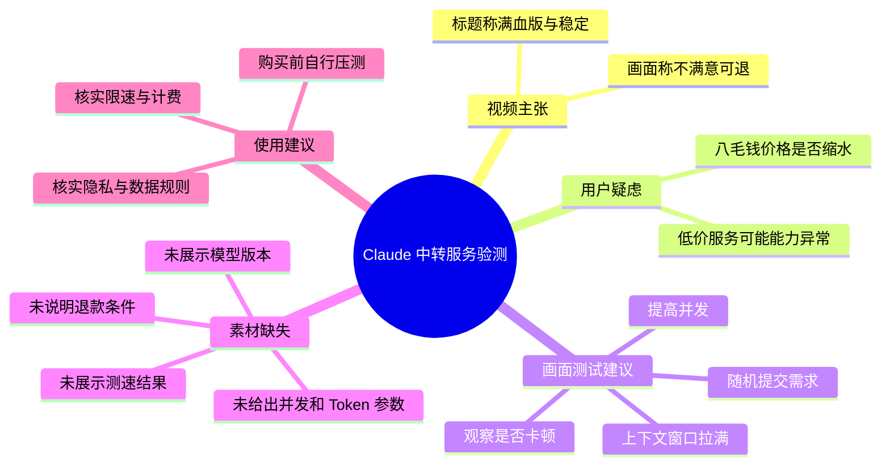

# 中转站不掺水！满血版！就是稳定！

> 来源：[Bilibili 视频](https://www.bilibili.com/video/BV1usE16bEiQ)  
> UP 主：快快云美伢｜发布时间：2026-06-12｜视频时长：13 秒  
> 合集：AIcode｜标签：AI 创业、AI 大模型、API、算力、中转站、token、满血版

## 小结

这是一条时长约 13 秒的竖屏推广/问答式视频，围绕“Claude 中转”服务是否存在“缩水版”、是否稳定展开。视频主体是聊天截图，而非口播讲解；画面中的核心回应是：不要仅凭低价判断，应通过高上下文、并发请求等方式自行测试服务是否卡顿。

画面给出的明确价格信息只有“八毛钱 Claude 中转”。提问者担心该价格意味着服务缩水，并表示曾购买过更便宜的服务，结果连 `if else` 都无法正确编写。发布者没有展示模型输出、接口文档、测速数据、并发量、上下文长度、模型版本或可复现实验记录，因此“满血版”“稳定”等标题主张在素材中属于营销性声明，不能据此视为已被独立验证的技术结论。

视频提出了一套很简略的验测思路：任意提交需求、将上下文窗口“拉满”、提高并发，并观察服务是否卡顿；若测试不满意，画面宣称可以退款。该思路可作为采购前的初步压力测试方向，但素材未定义“拉满”的具体 token 数、并发数、接口限速、测试时长、退款条件及适用模型，无法直接转化为完整操作规范。

本视频适合正在比较第三方大模型 API 中转服务、尤其关注 Claude 可用性、上下文能力和并发稳定性的读者。实际购买或接入前，应要求服务方提供模型标识、计费单位、限速规则、失败重试策略、隐私与数据保留政策，并自行进行可重复测试。

信息具有明显时效性：视频发布于 2026-06-12，第三方中转的模型可用性、价格、配额、路由策略、退款规则及合规状态都可能随时变化；视频未提供可验证的产品链接或技术配置，不能将其作为长期有效承诺。

## 思维导图

## 目录

- [视频内容与画面证据](#视频内容与画面证据)
  - [低价 Claude 中转的疑问](#低价-claude-中转的疑问)
  - [画面提出的压力测试方法](#画面提出的压力测试方法)
  - [退款表述与证据边界](#退款表述与证据边界)
- [可执行的验测框架](#可执行的验测框架)
- [参数、限制与时效性](#参数限制与时效性)
- [字幕比对](#字幕比对)
- [评论分析](#评论分析)
- [处理记录](#处理记录)

## 视频内容与画面证据 [00:00](https://www.bilibili.com/video/BV1usE16bEiQ?t=0)

### 低价 Claude 中转的疑问 [00:00](https://www.bilibili.com/video/BV1usE16bEiQ?t=0)

视频画面以聊天记录形式呈现。一方提问：

> “八毛钱 Claude 中转，不会是缩水版吧？”

这里可以确认的信息是：画面出现了“八毛钱”“Claude”“中转”三个要素。素材**未说明**“八毛钱”的计费口径：无法判断它对应单次调用、某个 token 单价、套餐、充值门槛，还是其他销售单位。

随后，绿色气泡回应“你问这句话，说明你被坑过。”提问者确认自己此前购买过更便宜的服务，并称：

> “之前买过便宜的，if else 都写不明白。”

这属于聊天参与者对既往低价服务体验的主观陈述，不构成对任何具体服务、模型能力或供应商的可验证评测。它反映的风险是：第三方中转可能存在模型降级、错误路由、能力不稳定或服务配置不透明等问题；但这些具体原因均未在视频中得到证明。

> 图：该关键帧直接保留了“八毛钱 Claude 中转”“缩水版”以及“if else 都写不明白”的原始画面文字，是界定视频议题、避免把标题宣传扩展为已验证事实的主要证据。

### 画面提出的压力测试方法 [00:00](https://www.bilibili.com/video/BV1usE16bEiQ?t=0)

绿色气泡给出的测试建议为：

> “那你随便扔需求，上下文窗口拉满、并发怼上去，看它卡不卡。”

该建议可拆解为三个方向：

1. **提交实际需求**：不只发送简单问候或短提示词，而是用自己的真实任务检验模型响应。
2. **测试长上下文**：将对话或输入内容扩展到服务支持的上下文上限附近，观察是否能正常处理。
3. **提高并发**：同时发起多个请求，观察是否出现卡顿、超时或失败。

不过，视频没有给出任何可复现参数，以下内容均未出现：

| 测试项 | 视频是否给出 | 缺失信息 |
| --- | --- | --- |
| Claude 的具体模型 | 未给出 | 模型名称、版本、是否官方同等能力 |
| 上下文窗口 | 未给出 | 最大 token 数、输入/输出 token 限额 |
| 并发设置 | 未给出 | 并发请求数、QPS、RPM、TPM |
| 性能阈值 | 未给出 | 目标首 token 延迟、总响应时间、成功率 |
| 测试任务 | 未给出 | 代码、长文、工具调用或多轮对话样本 |
| 测试结果 | 未展示 | 日志、耗时、错误码、模型输出或对照结果 |

因此，视频中“上下文窗口拉满、并发怼上去”是方向性建议，不是已经完成的性能测试报告。标题中的“就是稳定”也没有对应的压测截图、调用日志或第三方数据支撑。

### 退款表述与证据边界 [00:00](https://www.bilibili.com/video/BV1usE16bEiQ?t=0)

画面继续出现“测完不满意呢？”的提问，绿色气泡回应：

> “不满意退，但我堵你会回来复购。”

其中“堵”是画面实际显示的字，语义上可能是口语化表达，但素材未提供更正或解释，因此按画面原文保留，不将其擅自改写为其他字词。

可以确认的是，画面中存在“不满意退”的退款承诺性表述；但**无法确认**该承诺的适用条件，包括但不限于：

- 是否需要在指定时间内申请；
- 是否适用于已消耗额度；
- 是否要求提供测试记录；
- 是否支持部分退款；
- 退款的具体支付渠道、到账时间和例外情形；
- 承诺对应的具体产品、套餐或商家主体。

> 图：该帧集中呈现“上下文窗口拉满、并发怼上去，看它卡不卡”以及“不满意退”的关键表述，能够区分视频实际承诺与素材未披露的退款细则、测试参数。

## 可执行的验测框架 [00:00](https://www.bilibili.com/video/BV1usE16bEiQ?t=0)

以下框架是基于视频“长上下文 + 并发 + 观察卡顿”的思路整理出的审查清单，属于 Agent 的实践化补充，**并非视频展示过的具体操作步骤或测试结果**。

### 1. 在付费前核实服务定义

向服务提供方确认以下基础信息：

- 实际调用的模型名称与版本；
- API 是否兼容目标 SDK 或官方 API 格式；
- 输入、输出分别如何计费，价格对应什么单位；
- 单账号/单密钥的并发、QPS、RPM、TPM 限制；
- 上下文上限和单次最大输出长度；
- 错误码、重试、限流与故障转移策略；
- 数据是否存储、是否用于训练、日志保留多久；
- 退款规则的书面说明。

视频简介仅提供了联系方式“薇：LRLH1127”“q：2275187782”，未提供上述技术和交易细则。

### 2. 设计最小验证集

建议至少覆盖三类任务：

| 场景 | 目的 | 应记录的结果 |
| --- | --- | --- |
| 基础代码任务 | 验证基础代码生成与逻辑能力 | 输出正确性、编译/运行结果、响应耗时 |
| 长文本/多轮对话 | 验证上下文保持能力 | 前文事实是否被正确引用、是否丢失上下文 |
| 并发调用 | 验证稳定性与限流行为 | 成功率、超时率、错误码、延迟分位数 |

“`if else` 都写不明白”是视频中唯一明确提及的能力示例。若将其纳入测试，应提供确定的输入、预期行为和可运行验证，而不要只凭主观观感判断。

### 3. 做分阶段并发测试

不要一开始就将流量拉到未知上限。可采用逐步增加的方式：

1. 先进行单请求测试，确认鉴权、请求格式和基础输出正常。
2. 增加到小批量并发，观察是否出现限流、连接错误或响应明显变慢。
3. 在服务方公开限制范围内继续增加并发。
4. 对每档并发持续一段固定时间，并记录成功请求、失败请求、超时与错误码。
5. 将结果与服务方承诺的限速、配额和 SLA（若有）进行对照。

素材没有给出可使用的并发数或通过阈值，因此不能从视频推导出“多少并发即代表稳定”。

### 4. 测试退款承诺前保留证据

如需以“不满意退”为依据，应在购买前保存商品页、聊天承诺、订单信息、测试时间、调用日志和失败截图。是否退款、如何退款仍应以商家正式规则及实际沟通结果为准，不能只依据视频中一句简短表述。

## 参数、限制与时效性 [00:00](https://www.bilibili.com/video/BV1usE16bEiQ?t=0)

### 已出现的参数与事实

| 项目 | 素材中的信息 |
| --- | --- |
| 视频时长 | 13 秒 |
| 画面价格表达 | “八毛钱 Claude 中转” |
| 涉及对象 | Claude 中转服务 |
| 建议测试方向 | 实际需求、长上下文、高并发、观察卡顿 |
| 退款表述 | “不满意退” |
| 视频标题主张 | “不掺水”“满血版”“稳定” |
| 视频简介联系方式 | 薇：LRLH1127；q：2275187782 |

### 未披露的关键限制

视频没有提供模型版本、服务架构、官方授权关系、区域可用性、账号政策、上下文上限、速率限制、价格单位、退款条款、数据合规政策及实际压测证据。因此：

- 不能据此确认是官方原生接口、兼容接口还是其他转发方案；
- 不能据此确认“满血版”代表何种模型能力或配置；
- 不能据此确认“稳定”覆盖何种负载、时段或地区；
- 不能据此确认“八毛钱”的真实成本与可持续性；
- 不能据此确认退款是否无条件、全额或长期有效。

### 时效性提示

元数据显示视频发布于 2026-06-12。大模型中转服务容易受上游模型政策、账号风控、网络路径、供应商资源、计费规则及平台治理影响。即使画面陈述在发布时成立，也不等于当前仍然成立。对涉及付费、密钥和业务数据的决策，应在接入当日重新核验。

## 字幕比对 [00:00](https://www.bilibili.com/video/BV1usE16bEiQ?t=0)

| 字幕来源 | 完整性 | 专有名词 | 时间轴 | 主要问题 |
| --- | --- | --- | --- | --- |
| Bilibili 站内字幕 | 不可用 | 无法核验 | 无可用 SRT 分段 | 素材明确说明未提供可用站内字幕 |
| 本次 ASR 字幕 | 空 | 无法识别 | 无有效语音分段 | `medium` 模型未识别出语音片段；`segments` 为空、语音覆盖率为 0 |

本次 ASR 已检查。诊断信息显示：识别语言被自动判断为英语（置信度 `0.541015625`），音频时长为 `12.654875` 秒，但没有识别到任何语音片段；诊断警告为“未识别到语音，请核验是否存在可听语音并使用正确音轨重试”。

`asr-result` 中**没有**提供 `noAudioStream=true` 标记，因此不能断言源视频“没有音轨”。素材输出中也存在 `audio/audio.wav`。更准确的结论是：本次 ASR 结果为空，未能从现有音频中提取可用语音字幕；视频知识整理改以画面聊天文字、关键帧和元数据为依据。

由于没有可用站内字幕，也没有可用 ASR 时间分段，本文只能将视频整体锚定在 `[00:00]`，不虚构聊天文字的逐句起止时间。画面文字中已核对的关键术语包括：

- `Claude`
- `if else`
- “上下文窗口”
- “并发”
- “不满意退”

## 评论分析 [00:00](https://www.bilibili.com/video/BV1usE16bEiQ?t=0)

未获取到可分析的热评。评论素材中的 `items` 为空，视频元数据同时显示回复数为 0。

因此不存在“热评前三条”可供概括，也不能从评论侧补充服务质量、价格真实性、退款兑现情况或使用体验。后续若出现评论，应将其视为用户观点或线索，而非直接视为已验证事实。

## 处理记录 [00:00](https://www.bilibili.com/video/BV1usE16bEiQ?t=0)

- Worker ID：`worker-mrj0wjed-b0c290ad`
- 整理模型：`gpt-5.6-terra`
- ASR 模型与运行参数：`medium`；自动语言识别；CUDA；`float16`
- 可用素材工具产物：合并视频 `merged.mp4`、音频 `audio/audio.wav`、关键帧目录 `frames/`、ASR 结果目录 `asr/`、评论文件 `comments/comments.json`
- 字幕检查与选择：站内字幕未提供可用内容；本次 ASR 已检查但输出为空，未采用任何 ASR 文本；正文以关键帧可见聊天文字、视频元数据和简介为依据。
- 时间轴依据：ASR 没有分段时间戳，站内 SRT 不可用；因此仅使用视频起点 `00:00` 作为整体内容锚点，未按文字顺序虚构逐句时间。
- 关键帧选择依据：选用 `frames/frame-001.jpg` 与 `frames/frame-004.jpg`，因为画面可直接读取本片的价格疑问、低价服务体验、长上下文与并发测试建议、退款表述；所提供的关键帧预览内容高度重复，未重复插入同质图片。
- 评论处理：仅检查可获取热评前三条；本次返回 0 条，未进行观点推断。
- 缓存清理：未提供缓存清理执行日志，无法确认是否已清理；不将其表述为已完成。
- 未解决问题：音频中是否存在未被 ASR 正确识别的语音、具体服务主体、模型版本、计费口径、并发与上下文限制、压测结果及退款细则，均无法从现有素材确认。

## 评论分析

本次流程未获取到可用热评，因此不推断观众态度或额外结论。
