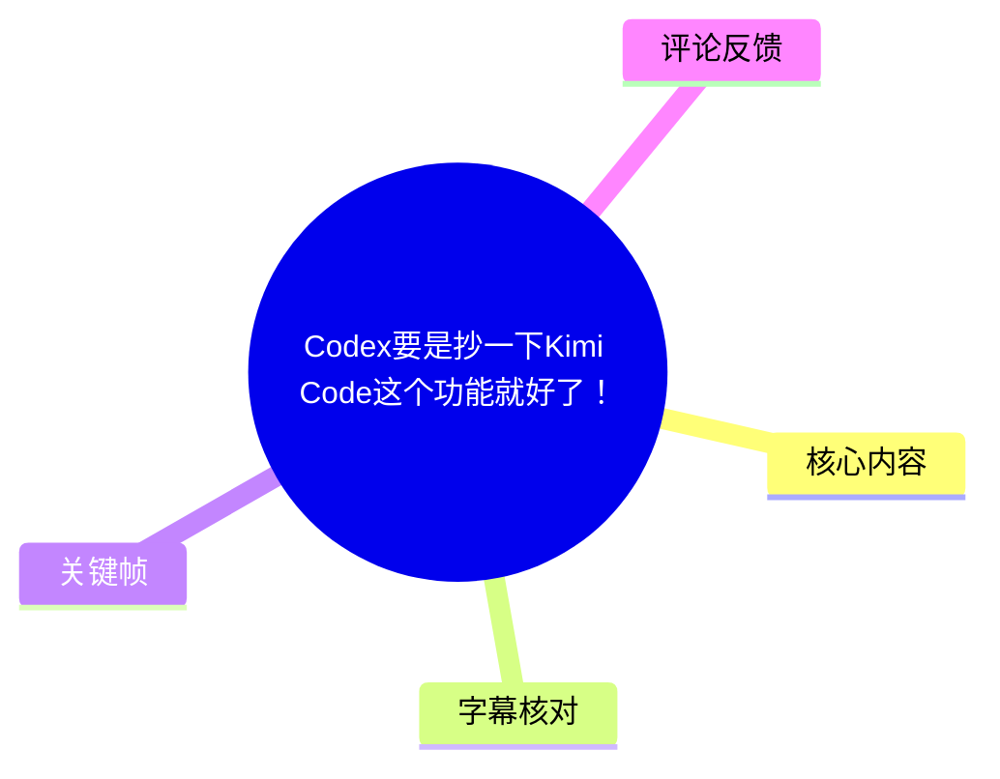
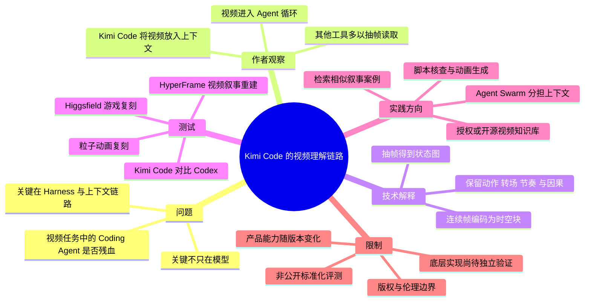
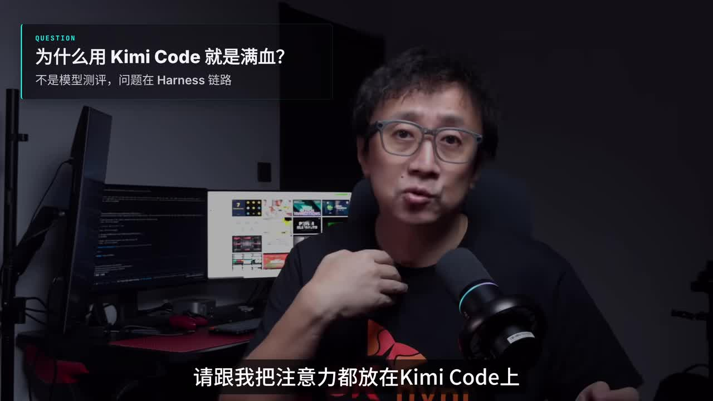
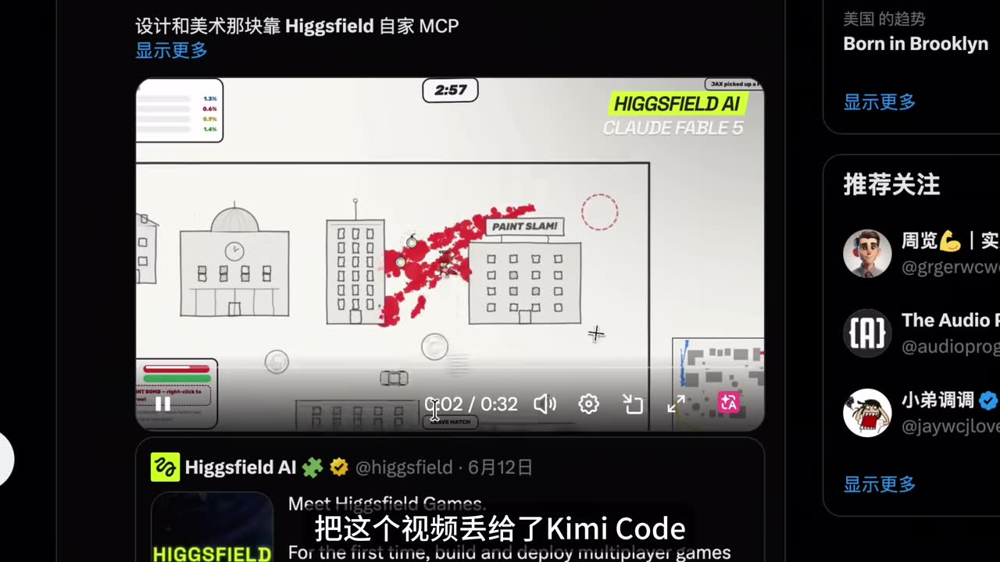
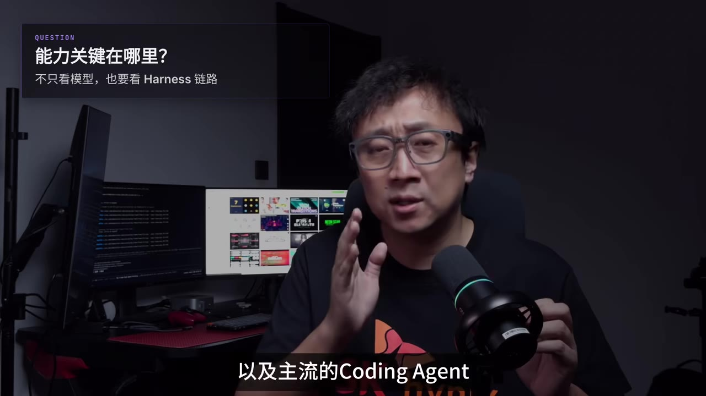
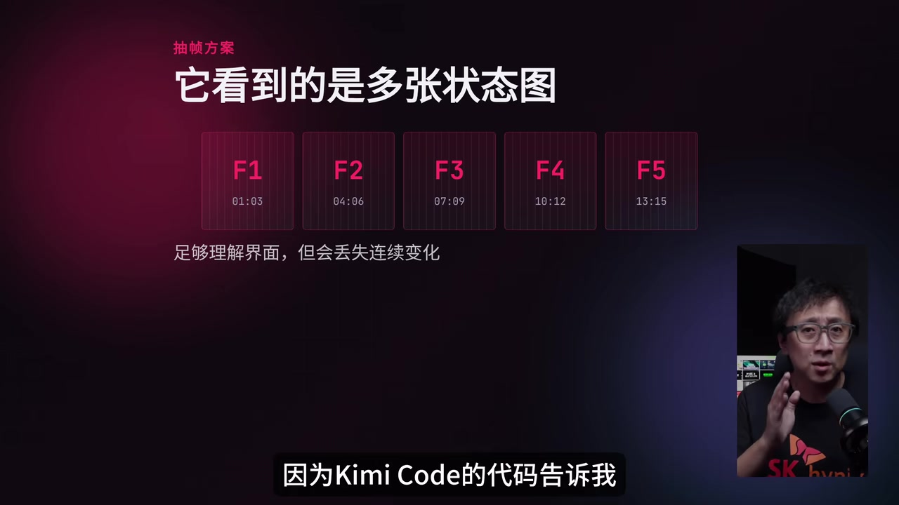

# Codex要是抄一下Kimi Code这个功能就好了！

> 来源：[Bilibili 视频](https://www.bilibili.com/video/BV1qVjc6uEao) 
> UP 主：小天fotos｜时长：09:34｜合集：AIcode  
> 本文区分“视频中的作者测试/判断”与已被独立验证的事实；涉及 Kimi Code、Codex、模型版本和产品能力的内容均具有较强时效性。

## 小结

视频讨论的核心不是单纯比较模型智力，而是提出：在视频理解任务中，**Coding Agent 的 Harness（工具链、上下文注入方式与 Agent 循环）会决定模型是否获得完整的时间维度信息**。作者认为，Kimi Code 的关键优势在于将视频直接纳入上下文及 Agent 循环，而不是仅以抽帧后的若干图片代替视频。

作者通过两类复刻测试说明这一判断：一是将 Higgsfield 的游戏与粒子动画录屏交给 Kimi Code，要求复刻；二是让 Kimi Code 与 Codex 借助 HyperFrame 重建一段财经视频的叙事和动画。按作者展示的结果，Kimi Code 更能保留动画节奏、转场和镜头运动；Codex 即使补充了时间戳字幕，仍较容易输出“PPT 化”的呈现。

其技术解释是：抽帧方案能够得到若干“状态图”，适合识别界面和静态交互；但动作、运镜、节奏、转场速度与前后因果存在于帧间变化中。作者援引其对 Kimi 相关代码及 **MovieViT 3D** 描述的阅读，认为连续帧会以时空块编码，而非作为互不关联的单张截图输入。

视频还给出一个受版权与伦理约束的业务设想：将获得授权或开源的视频沉淀成“剪辑与叙事经验知识库”，由 Agent 检索相似案例、结合脚本提炼动画与叙事方案，再用 HyperFrame 一类工具完成制作。作者已经将 Kimi Code 接入自己的 Agent 体系以验证可行性，但这仍是其个人探索，不能视作已成熟的产品方案。

进一步的代码观察包括：Kimi Code 可介入其他模型；经代码调整后，作者称本地部署的 **Qwen 3.5 27B** 也可实现“视频常驻上下文”；工具中还留有音频输入接口；原本网页端可用的 Agent Swarm 可在 Kimi Code 中直接使用，以减少主 Agent 因上下文压力触发 Compact 的需要。以上均为作者陈述，本文未获得代码仓库、配置或复现实验材料，不能独立确认。

最重要的限制是：视频中的对比不是可重复、控制变量完整的公开基准测试。作者也明确反对未经许可蒸馏或复刻其他创作者的剪辑、叙事手法。评论区亦对“直接视频输入”的底层实现提出质疑：视频模型仍可能按图片/帧块进行分片处理；“视频常驻上下文”具体意味着何种编码、采样率、token 消耗与保真度，不能仅凭本视频定论。

## 思维导图

## 目录

- [开场：问题不只在模型，而在 Harness 链路](#开场问题不只在模型而在-harness-链路)
- [复刻测试：从游戏 Demo 到粒子动画](#复刻测试从游戏-demo-到粒子动画)
- [核心判断：视频常驻上下文与抽帧方案的差别](#核心判断视频常驻上下文与抽帧方案的差别)
- [时间维度为何影响视频生成](#时间维度为何影响视频生成)
- [HyperFrame 对比实验：Kimi Code 与 Codex](#hyperframe-对比实验kimi-code-与-codex)
- [授权视频知识库与 AI 剪辑工作流](#授权视频知识库与-ai-剪辑工作流)
- [代码层面的延伸发现](#代码层面的延伸发现)
- [结论、限制与时效性](#结论限制与时效性)
- [字幕比对](#字幕比对)
- [评论分析](#评论分析)
- [处理记录](#处理记录)

## 开场：问题不只在模型，而在 Harness 链路

### [视频理解场景中的“残血”问题：29 秒](https://www.bilibili.com/video/BV1qVjc6uEao?t=29)

作者开场强调，标题并非意在“碰瓷 Codex”，而是希望把注意力从单一模型能力转向视频理解场景中的 Coding Agent 链路。他将问题概括为：在多模态视频任务中，即便使用能力较强的模型，若 Agent 只提供不完整的视频信息，实际使用效果也可能是“残血”的。

视频提到 Kimi Code 可视为原 Kimi CLI 的重构与升级，官方特别强调其视频理解能力。作者表示本期并非 Kimi K2.7 模型测评，而是试图回答：

1. Kimi Code 在多模态视频任务中补足了什么能力；
2. 这种能力为何可能来自工具链，而不只是模型本身；
3. 它将如何影响视频复刻、前端制作、录屏排障、AI 剪辑等工作流；
4. Codex 等工具未来是否可能对齐这一能力。

> 图：画面直接写出“不是模型测评，问题在 Harness 链路”。这张关键帧准确概括视频论证的切入点：作者要比较的是工具如何把视频信息交给模型，而非只比较模型名称或参数。

### 前置概念：Harness 是什么

视频多次使用 Harness 一词，但未给出严格定义。结合其上下文，作者将它用来指代围绕模型的执行与交互层，包括但不限于：

- 输入内容怎样进入模型上下文；
- 视频是作为原文件、时空编码，还是被转成图片；
- 这些信息是否能在 Agent 多轮任务中持续保留；
- 上下文接近上限后如何压缩、分派或续接任务；
- 多 Agent 协作如何减少主 Agent 的上下文负担。

因此，本文中的“视频常驻上下文”应理解为作者所描述的工作链路特征，而非已独立验证的底层技术规格。

## 复刻测试：从游戏 Demo 到粒子动画

### [将 Higgsfield 游戏录屏交给 Kimi Code：55 秒](https://www.bilibili.com/video/BV1qVjc6uEao?t=55)

作者看到一位推友展示 Higgsfield 中由 Fable 5 制作的游戏 Demo 后，将该 Demo 录屏，并将视频提交给 Kimi Code。其提示词非常简短，意为“读取这个 Demo，完整复刻它”。

按作者的陈述，结果不是像素级一致，但生成物“完全能玩”。随后，他又选取一个由 Fable 5 实现的“中国功夫粒子动画”Demo，要求进行“1 比 1 复刻”。作者称，Kimi Code 不仅实现了动画效果，还将其录屏时意外包含的视频播放器区域一并复刻出来。之后测试的多个 Demo，作者称也都得到了复刻。

> 图：该关键帧展示作者用于测试的 Higgsfield/Fable 5 游戏画面及网页播放环境。它说明测试输入并非纯净的源工程文件，而是包含播放器界面的录屏；这也是后文“连误录播放区域都被复刻”的语境来源。

### 这组测试能说明什么，不能说明什么

从视频提供的材料中，可以较谨慎地得出以下结论：

- 作者观察到 Kimi Code 能根据视频录屏生成可交互或可播放的相似实现；
- 生成结果可能利用了画面中的视觉对象、布局、动作和时间关系；
- 对于前端 Demo、网页游戏和视觉动画，视频能够成为一种较直接的需求输入。

但不能据此推出：

- Kimi Code 在所有视频任务上都优于 Codex 或其他 Agent；
- 所有“完整复刻”都具有相同保真度；
- 结果只由视频输入机制决定，而与提示词、模型版本、上下文预算、工具权限、生成框架和作者人工干预无关；
- 对他人作品进行复刻在版权上天然可行。

作者自身也在后面的 HyperFrame 实验前专门声明：测试能力边界不等于认可对其他视频博主的剪辑和叙事手法进行蒸馏。

## 核心判断：视频常驻上下文与抽帧方案的差别

### [作者对主流 Coding Agent 的代码观察：103 秒](https://www.bilibili.com/video/BV1qVjc6uEao?t=103)

带着“优势是否来自 Kimi Code 工具本身”的疑问，作者称其分析了 Kimi Code 的代码及主流 Coding Agent 的实现。他给出的核心观察是：

> 在其调查的主流 Agent 中，Kimi Code 的链路明确将视频放进上下文，并放入 Agent 循环；Agent 在执行任务过程中持续拥有视频信息。

相对地，作者称 Claude Code、Codex、OpenCode 等当时版本主要支持到图片层。对于视频，这些工具会采用“抽帧”方式，即提取多张图片，再以这些图片实施视频理解。

> 图：画面标题为“能力关键在哪里？不只看模型，也要看 Harness 链路”。它对应作者从复刻结果转入代码链路分析的转折点。

### [抽帧方案：可理解界面，但会缺少连续变化：128 秒](https://www.bilibili.com/video/BV1qVjc6uEao?t=128)

作者并未否定抽帧的实用性。他认为，在很多任务里，静态图片已经足够，例如：

- 复刻网页游戏的大体界面；
- 识别前端页面布局；
- 理解明显的控件与交互逻辑；
- 定位录屏里可见的错误状态。

但作者的观点是，抽帧理解视频存在信息折损：它将视频转化为不连续的若干状态，容易丢失这些内容：

| 信息类型 | 单张或稀疏抽帧的表现 | 连续视频上下文的潜在优势 |
| --- | --- | --- |
| 页面或对象状态 | 通常较容易识别 | 同样可识别 |
| 动作轨迹 | 可能只能推测 | 可观察连续变化 |
| 镜头运动 | 易被当成静态切换 | 可保留运镜过程 |
| 转场时机 | 可能遗漏或错判 | 可观察前后衔接 |
| 节奏与速度 | 难以可靠估计 | 可感知快慢与节拍 |
| 前后因果 | 需由模型猜测 | 可利用过程信息判断 |

这张演示图将作者的论点形象化：抽帧方案看到的是多个状态图，而连续变化本身可能没有被完整提供。

> 图：画面列出 F1 至 F5 等不同时间点的帧，并写明“足够理解界面，但会丢失连续变化”。它是视频对“抽帧局限”最直接的视觉说明。

### [时空块编码：作者对 MovieViT 3D 的解释：152 秒](https://www.bilibili.com/video/BV1qVjc6uEao?t=152)

作者称其阅读了 Kimi 对 MovieViT 3D 的相关描述，并据此得出解释：视频不是被简单地拆成若干孤立图片，而是把连续的几帧作为一个“时空块”进行编码。模型看到的不仅是每帧里的内容，也包括帧与帧之间的变化关系。

这里要注意两层边界：

- **视频中的作者判断**：Kimi Code 的优势在于其视频链路能够保留更多时间维度信息。
- **本文无法独立核验的部分**：Kimi Code 当前具体采用何种模型、帧率、分块大小、压缩策略、token 计费方式，以及“视频原始形态常驻上下文”的严格工程定义，素材中未提供代码片段、官方技术文档链接或可复现配置。

“直接读视频”不必然意味着未经过任何帧级或时空块级表征。评论区也有人指出，视频模型底层仍可能以图片分片或相邻帧块处理。更准确的比较应是：**视频是否以能够保留时间关联的表征进入任务循环，以及这种表征在多轮 Agent 执行中保留到什么程度。**

## 时间维度为何影响视频生成

### [动作、运镜、节奏和因果存在于帧间：176 秒](https://www.bilibili.com/video/BV1qVjc6uEao?t=176)

作者强调，视频中最重要的一部分信息“并不在一张图里，而在图和图之间”。举例而言：

- 一个物体或角色的运动方向、加速度和节奏；
- 镜头推、拉、摇、移等运镜效果；
- 场景切换发生的准确时点；
- 动画元素出现、停留、消失的时间关系；
- 叙事镜头之间的因果推进；
- 视觉效果与原始音频的同步。

在作者的框架中，抽帧得到的是“一个状态”，而视频上下文提供的是“整个过程”。因此，即便同样使用 K2.7 一类模型，若上游工具只给模型静态图片，任务中仍会少掉部分时间维度信息。

### [SpaceX IPO 视频成为叙事重建测试素材：200 秒](https://www.bilibili.com/video/BV1qVjc6uEao?t=200)

为验证时间信息的重要性，作者选取一位财经博主在两年前发布的、关于 SpaceX IPO 的解读视频作为测试素材。他评价该片段的叙事逻辑和动画展示“堪称经典”，并计划让 Kimi Code 与 Codex 理解视频后，通过 HyperFrame 完整讲述同一个故事。

在测试前，作者明确叠加了版权与伦理声明：

- 使用该素材的目的，是测试 Harness 能力边界；
- 不赞同用多模态模型蒸馏其他视频博主的剪辑与叙事手法；
- 希望借此提醒创作者，视频中的叙事和剪辑技巧可能正变得可被 AI 实现。

这段声明是视频中重要的实践限制。即使技术上能够通过视频生成相似表达，也不等于创作者可以在没有授权的情况下复制作品结构、镜头语言或剪辑风格。

## HyperFrame 对比实验：Kimi Code 与 Codex

### [Codex 的两次尝试与作者评价：248 秒](https://www.bilibili.com/video/BV1qVjc6uEao?t=248)

作者为 Codex 提供了两次机会：

1. **第一次**：直接给出视频片段，要求实现，并开启最高档思考；
2. **第二次**：在视频之外补充完整、按时间戳对齐的字幕文件，以辅助理解上下文。

按作者的展示和主观评价，第一次完成效果较差；第二次即使有字幕，仍将原本充分运用镜头运动的效果做成了“PPT”，导致视觉呈现明显弱化。

这一实验揭示了一个实用经验：**字幕能补足语义、台词和大致时序，却无法完整替代视觉运动本身。** 时间戳字幕可以告诉模型“某段话何时说出”，但不能充分表达镜头如何运动、元素如何进入、动画如何加速或与声音精确对齐。

### [Kimi Code 版本：音频对齐与镜头运动模拟：273 秒](https://www.bilibili.com/video/BV1qVjc6uEao?t=273)

作者称 Kimi Code 的版本让他“意外”，具体表现包括：

- 对齐原始音频的效果更好；
- 模拟出了摄像机运镜；
- 整体表达逻辑更完整；
- 但与原视频仍有较大距离。

作者还提出一种迭代式优化方案：将**原始视频**与**当前成品视频**同时交给 Kimi Code，要求它读取两个视频、识别不足方向并精修；重复多轮后，结果可能进一步提高。按作者说法，同时读取两个视频的能力“只有它能支持”。

这是视频中较具操作性的流程建议，可整理为：

1. 选择有授权、开源或自有的视频参考；
2. 将参考视频输入 Agent，明确任务是提取可复用的高层表达要素，而非侵权复制；
3. 用 HyperFrame 等制作框架生成第一版；
4. 将参考与成品并列输入，要求指出节奏、镜头、音画同步、信息层级等差异；
5. 依据差异进行局部精修；
6. 多轮迭代，同时控制上下文消耗、版权风险与生成成本。

但素材没有给出实际命令、提示词全文、HyperFrame 参数、模型温度、上下文长度、token 消耗或生成时长。因此该流程只能作为概念性方法，不能照此保证复现视频效果。

### [作者希望 Codex 对齐视频能力：321 秒](https://www.bilibili.com/video/BV1qVjc6uEao?t=321)

作者认为，脱离传统软件开发场景后，缺少帧间时间关系会使 Codex 难以在视频任务中给出“惊艳成果”。他同时承认 Codex 上下文由服务端管理，外部无法确认其读过的图片是否始终以原始形态留在上下文中；例如，Base64 可以是一种原始形态的表示。

不过，作者主张其“十分确定”视频类内容没有以类似方式进入 Codex 上下文，并由此提出标题问题：Codex 未来是否会在该能力上向 Kimi Code 对齐？他表示希望如此，并提到自己是“200 美元订阅”用户，希望 Codex 也能理解视频。

这一段应视为作者基于产品体验与代码分析作出的推断，不是 Codex 官方能力声明。产品版本、地区、订阅档位、API 与客户端实现均可能使能力边界发生变化。

### [AE 动画测试：节奏与转场时机：345 秒](https://www.bilibili.com/video/BV1qVjc6uEao?t=345)

作者随后将一些 AE 动画用于测试，称结果与前述结论一致：Kimi Code 除了复刻视觉效果，还能复刻动画节奏和转场时机。作者特别强调，这不是普通低频抽帧方案能够稳定做到的事情；在其观点中，只有 Kimi Code 的链路更充分保留了时间维度信息。

这也是该视频最强的结论之一，但其证据主要是作者展示与口述。缺少统一评价指标，例如：

- 每秒抽取多少帧；
- 输入视频的分辨率、时长与码率；
- Kimi Code 与 Codex 实际调用的模型版本；
- 生成任务的提示词和允许修改次数；
- 输出视频相对源视频的时间同步误差；
- 对镜头运动、转场、节奏的人工或自动评分。

因此，应将其作为“值得复测的工程假设”，而不是已经完成严格验证的普遍规律。

## 授权视频知识库与 AI 剪辑工作流

### [从视频理解到剪辑与叙事经验库：369 秒](https://www.bilibili.com/video/BV1qVjc6uEao?t=369)

作者提出的“商机”建立在明确的约束之上：视频应当是**经过授权或开源**的作品。在这个前提下，可以通过视频理解将一批作品沉淀为剪辑与叙事经验知识库。

视频给出的设想流程为：

1. 收集经过授权或开源的视频作品；
2. 用视频理解方式提炼剪辑、叙事与动画经验；
3. 当接到新的剪辑任务时，由 Agent 在知识库中检索相似案例；
4. 再结合当前脚本进行核查；
5. 提取适合本任务的叙事与动画方案；
6. 通过 HyperFrame 一类框架快速实现动画；
7. 让创作者更聚焦内容构思，部分表达工作交给 Agent。

### 一个更可控的落地拆解

虽然视频没有提供工程细节，但基于其描述，可将系统分成四层：

| 层级 | 目标 | 必需的边界条件 |
| --- | --- | --- |
| 素材治理 | 保存授权证明、来源、可用范围与期限 | 不将无权使用的视频混入训练/检索库 |
| 视频解析 | 提取镜头、节奏、字幕、音画关系、视觉元素 | 不把“理解”直接等同于“复制” |
| 案例检索 | 按主题、镜头功能、节奏、动画类型找相似案例 | 输出参考理由与素材来源 |
| 生成执行 | 根据新脚本生成原创表达方案与工程代码 | 保留人工审核、版权审查和可追溯记录 |

作者表示已把 Kimi Code 集成进自己的“牛马 Agent”体系，并开始进行可行性验证。视频未说明该体系的代码、部署方式、数据来源、授权机制或实际产出，因此不能判断其成熟度、合规性或商业可行性。

## 代码层面的延伸发现

### [其他模型、本地模型与视频常驻上下文：418 秒](https://www.bilibili.com/video/BV1qVjc6uEao?t=418)

作者表示，继续研究 Kimi Code 代码库后发现：

- Kimi Code 支持其他模型介入；
- 若对代码做一些修改，本地部署的 **Qwen 3.5 27B** 也可以实现“视频常驻上下文”的玩法；
- 因此，本地多模态模型在这种链路下也可能获得更完整的视频能力。

这里涉及的模型名称、参数量与修改方式均来自 ASR 转写及作者口述；视频没有展示代码 diff、依赖版本、硬件配置、显存需求、视频规格或完整部署步骤。尤其是“Qwen 3.5 27B”名称应以相关项目官方发布信息为准，不能仅据转写文本确认。

### [音频接口与本地带音轨视频分析：442 秒](https://www.bilibili.com/video/BV1qVjc6uEao?t=442)

作者还称在代码中发现了音频输入接口，并沿用其设计思路做了少量代码修改，实现了使用本地模型分析带音轨视频。

这项能力的潜在价值在于：视频生成和剪辑任务常依赖音画同步；如果 Agent 只能看到视觉帧，而不能处理声音、配乐、旁白节奏或音效触发点，最终输出可能无法准确对齐原始表达。

但视频未说明：

- 音频是直接输入模型、先转写，还是转换为声学特征；
- 模型是否真正理解非语音音频；
- 支持的采样率、音轨数量、最大时长；
- 音频与视频是否以统一时间轴同步输入；
- 本地分析的准确率和资源成本。

因此，这是一项值得关注的代码探索，而非可直接部署的完整方案。

### [Agent Swarm：将后续任务从主上下文中分流：466 秒](https://www.bilibili.com/video/BV1qVjc6uEao?t=466)

作者提到，原本网页版才能使用的 Agent Swarm 已在 Kimi Code 中直接支持。他以“双视频分析”为例说明其作用：

- 主 Agent 同时读入两个视频后，可能消耗约 **40% 上下文**；
- 后续任务可启动 Agent Swarm 完成；
- 主 Agent 因而不必触发 Compact。

“40%”是作者针对其示例所作的估计，不应视作固定参数。不同视频长度、分辨率、编码方式、模型上下文窗口和任务提示都会显著改变上下文占用。

作者对这一设计的理解是：更有价值的信息往往藏在代码和 Harness 中，官方宣传未必充分覆盖。对于需要长视频、多参考视频、反复生成与多轮修改的工作流，如何管理上下文、如何将子任务分派出去，可能比一次性模型问答更关键。

## 结论、限制与时效性

### [工具是模型能力的放大器与技术路线风向标：490 秒](https://www.bilibili.com/video/BV1qVjc6uEao?t=490)

作者在结尾反思，视频放入上下文的能力在 1 月的 Kimi CLI 版本中就已支持，而自己半年后才意识到。他借此提出一个更一般的观点：

> 模型厂的 Harness 不只是一个“壳”；它既是模型能力的放大器，也是技术路线的风向标。

作者又提到刚解锁的 Kimi K2.7 Code 高速版本，称其为“6 倍速度、3 倍价格”。视频强调这不只是简单加速，而可能意味着一部分用户已经跑通了生产流程，对更快将 token 转化为成果有刚性需求，模型厂商因此推出相应服务。

这一价格与速度信息只适用于视频录制时作者所见的产品版本和订阅/服务条件，具体价格、倍率、地区可用性与限额都可能随时变化，应以官方最新页面为准。

### [真正的机会：先理解路线并跑通工作流：538 秒](https://www.bilibili.com/video/BV1qVjc6uEao?t=538)

作者认为，第三方工具往往忙于兼容各类 API 与功能需求，而模型厂商自己的 Harness 已开始探索扩大模型能力边界。其最终观点是：

- 不应只等待“模型更强”；
- 工具是让模型能力真正可见、可用的窗口；
- 商机不只是做若干视频剪辑 Agent；
- 更重要的是尽早理解模型厂商的技术路线；
- 在新能力上尽早跑通完整工作流，可能更早获得工具迭代红利。

### 使用建议与关键限制

1. **先验证输入链路，而非只看模型名。** 对视频任务，应问清视频如何被读取、时间信息是否保留、上下文如何管理、音频是否参与处理。
2. **抽帧并非无用。** 界面理解、静态信息提取、简单 Web 复刻等任务，抽帧可能足够且成本更低。
3. **连续视频任务更依赖时间关系。** 涉及运镜、动画、动作、节奏、转场和音画同步时，应优先考察模型/工具是否保留时序表征。
4. **字幕无法替代视频。** 带时间戳字幕能增强语义理解，但无法完整提供视觉运动信息。
5. **必须处理版权与授权。** 视频作者明确反对未经许可蒸馏其他博主的剪辑、叙事手法；建立知识库时尤其需要素材授权、用途范围、期限与审查记录。
6. **需要独立复测。** 本视频为作者测试报告，缺少公开的提示词、评测集、参数和客观指标；不同产品版本可能快速改变结论。
7. **警惕成本与上下文限制。** 直接或高保真视频输入可能带来更高 token、延迟、上传、隐私和上下文消耗；多视频比较还会进一步放大资源需求。
8. **保护敏感录屏内容。** 录屏可能包含账号信息、客户数据、代码、聊天记录或未发布内容。提交到云端 Agent 前应脱敏，并确认数据保留与训练政策。

## 字幕比对

| 字幕来源 | 完整性 | 专有名词 | 时间轴 | 主要问题 |
| --- | --- | --- | --- | --- |
| Bilibili 站内字幕 `p01-ai-zh.srt` | 与本视频主题严重不符；仅覆盖约 00:00–04:30 | 内容是“脑子/连体人”等话题，未出现 Kimi Code、Codex 等关键内容 | 时间格式有效，但对应的是明显错误或串片的字幕 | 不可作为本视频正文依据 |
| 本次 ASR 字幕 | 覆盖约 00:29.740–09:33.280；诊断语音覆盖率 94.78% | 可识别 Kimi Code、Codex、HyperFrame、Agent Swarm、MovieViT 3D 等，但有较多同音/误识别 | 带真实时间段，可用于正文时间轴 | 开场前约 30 秒未有语音段；“Claude Code”“K2.7”“Qwen 3.5 27B”“Harness”等存在转写不稳定现象 |

### 最终字幕选择与校正原则

本文**不采用站内字幕**，原因是其内容与视频标题、ASR 语义和所给关键帧完全不一致，明显属于错误字幕或串入其他视频的文本。本文以本次 ASR 的分段时间戳作为章节时间轴依据，并使用以下材料进行校正：

- 视频标题、简介与标签：确认主题为 Kimi Code、Codex、视频理解、HyperFrame、Kimi CLI；
- 关键帧：确认作者围绕 “Kimi Code”“Harness 链路”“抽帧方案”“多张状态图”等内容展开；
- ASR 上下文：将明显的错别字和近音词统一为较合理的产品/技术名称，例如：
  - “Cloud Code”按语境记作 **Claude Code**，但视频未提供官方拼写截图；
  - “KR.7”“K2 的奇”等按上下文记作 **K2.7 / Kimi K2.7 Code**；
  - “抽真”按语义记作 **抽帧**；
  - “MoveVIT 3D”按常见写法记作 **MovieViT 3D**，但未独立核查论文标题；
  - “千蚊 3.627B”按语境记作 **Qwen 3.5 27B**，该名称存在 ASR 不确定性；
  - “Hardness”按视频语境统一记作 **Harness**。

本次 ASR 诊断中**没有** `noAudioStream=true` 标记；相反，诊断显示音频时长约 573.46 秒、语音覆盖约 543.54 秒。因此，未将字幕问题归因为源视频没有音轨。

## 评论分析

以下仅处理可获取的热评前三条。评论是用户观点，不构成已验证事实。

### 1. 撒哈拉大森林｜33 赞

> “codex：我用了视频抽帧，转为图片给大模型，这样就节约了上下文……kimi code：……之前都是直接把视频直接丢给大模型，怪不得这么费token……”

这条评论用拟人化方式概括了视频主张：Codex 式抽帧更节省上下文，Kimi Code 式视频输入可能更耗 token。它补充了一个实际工程权衡：**保留时间信息与上下文/成本之间可能存在交换关系**。

不过，“Kimi Code 直接把视频丢给大模型”的表述过于简化。视频自身的论点更接近“连续帧以时空相关的方式编码并进入 Agent 链路”，而不是证明视频文件未经处理地原样塞入模型。具体 token 消耗和底层表征没有公开数据支持。

### 2. 紫色的漱口水｜25 赞

> “最近好多人都发 kimi code 的视频，而 kimicode 已经发布 1 个月了吧，最近这应该是商单”

评论者注意到近期 Kimi Code 内容集中出现，并据此怀疑为商业合作。这是对内容传播与利益关联的质疑，提醒观看者关注可能存在的推广关系。

但素材中未提供商单标识、合作披露、合同信息或平台声明，无法据此确认视频是否为商业合作。判断应以 UP 主的明确披露、平台商业推广标记或品牌方公告为准，而不能将时间上的集中传播直接等同于商单。

### 3. 不推自倒｜4 赞

> “这广告毫无广告痕迹 视频输入底层也是图片分片 分的细一些而已 他只是支持了video_url”

该评论直接挑战了视频的技术叙事：即使产品支持视频 URL，底层也可能仍然是图片分片，只是采样更细或分块方式不同。这个质疑具有技术上的合理性，因为许多视频模型确实会把视频转换为帧、帧块或时空 token 进行处理。

该观点与视频作者的“连续帧时空块编码”解释并不必然矛盾。关键不在于底层是否出现帧，而在于：

- 帧是否按时间顺序和局部连续性联合编码；
- 帧间关系是否在表示中保留；
- 表示是否持续存在于 Agent 的上下文/循环；
- 相比稀疏抽帧，是否能稳定提高任务表现；
- 成本、延迟和可用上下文是否可接受。

评论中“只是支持 video_url”的结论同样没有证据链，不能视为对 Kimi Code 实现的最终判定。

## 处理记录

- **Worker ID**：worker-mrj0www4-e8d79408
- **模型**：gpt-5.6-terra
- **使用素材与工具产物**：视频元数据、关键帧目录 `frames/`、站内字幕 `p01-ai-zh.srt`、本次 ASR 时间轴字幕 `asr/transcript.srt`、ASR 诊断 `asr/asr-result.json`、热评文件 `comments/comments.json`。
- **ASR 检查结果**：已检查本次 ASR。识别语言为中文，置信度 `0.9990234375`；音频时长约 `573.46` 秒；语音覆盖率 `0.9478`；未标记 `noAudioStream=true`。
- **字幕选择**：站内字幕与视频主题完全不匹配且仅覆盖前约 270 秒，判定不可用；正文采用本次 ASR 的真实时间戳，并结合标题、简介、标签与关键帧校正明显术语误识别。
- **时间轴依据**：所有章节链接均按 ASR SRT 起始时间换算为秒数生成，未按文字顺序臆测时间。
- **关键帧选择依据**：
  - `frames/frame-001.jpg`：概括“问题在 Harness 链路”的主题；
  - `frames/frame-002.jpg`：展示 Higgsfield/Fable 5 Demo 录屏测试输入；
  - `frames/frame-003.jpg`：强调能力评估应同时看模型与 Harness；
  - `frames/frame-004.jpg`：直观呈现抽帧“多张状态图”与连续变化损失的论点。
- **评论处理范围**：仅分析素材中可获取的热评前三条，未扩展至其他评论。
- **缓存清理**：本次任务提供的是既有素材清单与文件路径，未执行额外下载、转码或缓存写入；无新增缓存可清理。
- **未解决问题**：
  - Kimi Code、Codex、Claude Code、OpenCode 在视频录制时的具体版本、模型、上下文策略和权限未提供；
  - “视频常驻上下文”的实现细节、token 成本、帧率/分块策略未被独立验证；
  - HyperFrame 测试的提示词、生成代码、参数、输出视频和客观评分未提供；
  - ASR 中个别专有名词存在不确定性，尤其是本地模型名称与论文名称；
  - 视频中的产品价格、速度倍率及功能可用性均可能在发布后变化。
