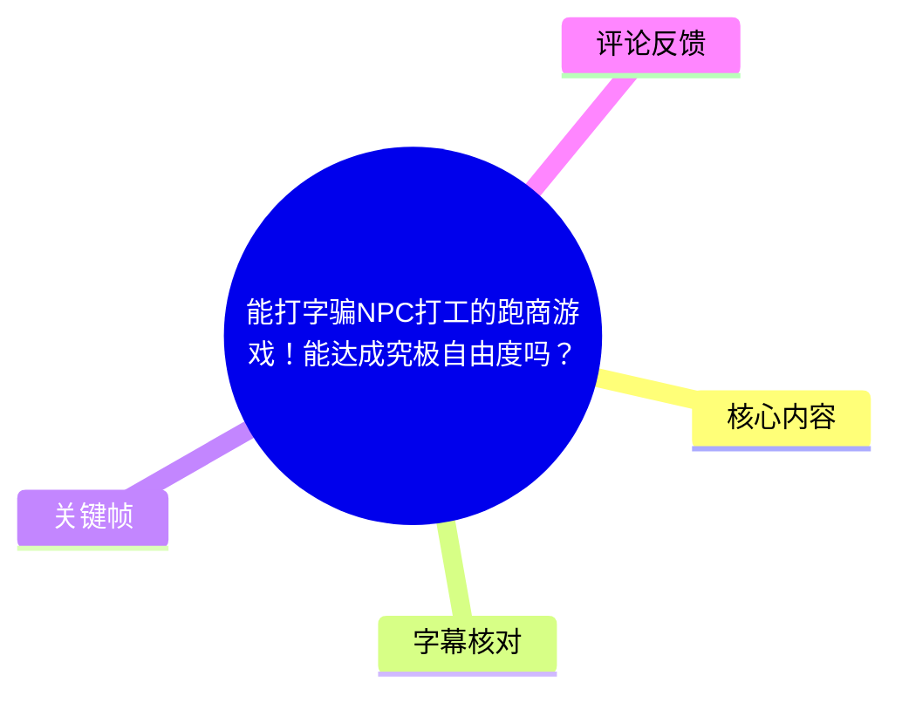
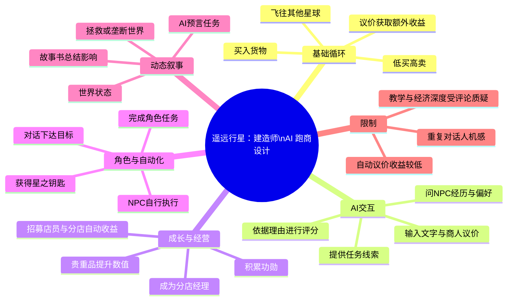
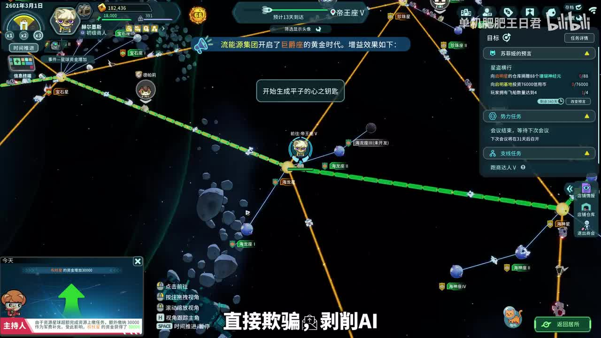
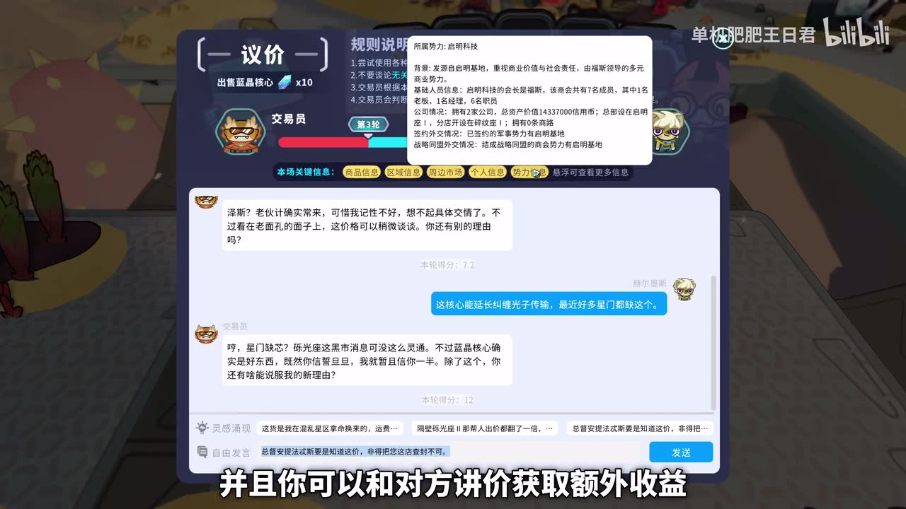
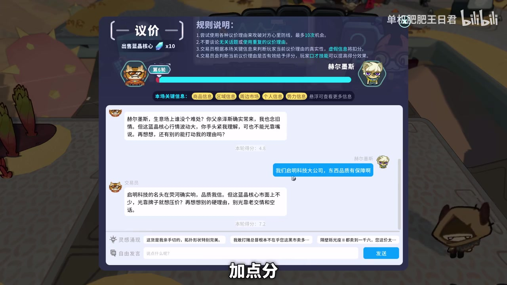
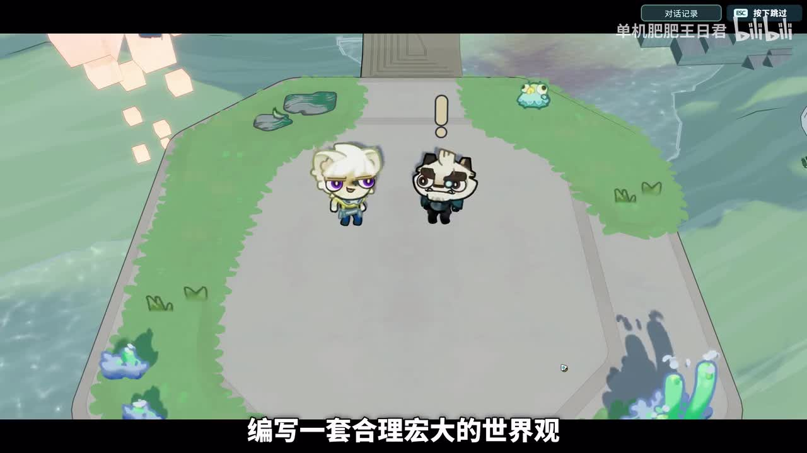

# 能打字骗NPC打工的跑商游戏！能达成究极自由度吗？

> 来源：[Bilibili 视频](https://www.bilibili.com/video/BV17XG96SEaF)  
> UP 主：单机肥肥王日君｜游戏：**《遥远行星：建造师》**｜时长：03:47  
> 视频标题中的“究极自由度”是讨论性提问；视频实际给出的结论是：AI 对话与任务系统在初体验上很有新鲜感，但重复对话与后期效率问题仍限制了其自由度的实际体验。

## 小结

视频介绍了跑商游戏《遥远行星：建造师》如何把 AI 接入传统买低卖高、跨星球贸易的循环中。玩家不仅能在议价界面输入理由说服商人加价，还能与 NPC 聊天、了解经历、解锁角色任务，并在完成任务后让角色接受指令、自动执行赚钱等目标。

其最值得注意的设计不是单纯的聊天文本，而是 AI 被嵌入多个玩法环节：议价评分、NPC 好感与角色任务、任务线索问答、随世界状态动态生成的“预言任务”，以及结局处根据玩家行为汇总影响的“故事书”。视频认为，这些设计让跑商、角色成长、势力关系和叙事有机会互相连接。

基础经营线为：跑商赚钱 → 购买可提升数值的贵重品 → 积累功勋成为分店经理并开分店 → 招募店员、让分店自行产出收益。角色也可向沟通谈判、太空武力、海盗路线、公司夺权或与政府军方合作等方向发展。视频声称游戏有约 **600 名角色、11 个势力**，但这一数字是视频转述的游戏信息，未在本素材中获得独立验证。

视频也明确指出局限：与 AI 重复交流越多，越容易感觉到“人机感”；因此后期提供了自动溢价/自动议价选项，以更低收益换取跳过重复对话。热评中的一条长评则进一步质疑：游戏的 LLM 是否真正影响 NPC 的经济行为与世界经济，而非主要停留在对话层；这属于评论者观点，不应视为已验证事实。

适合希望了解“LLM 在单机游戏中怎样落地”的读者，以及对跑商、经营、NPC 对话、动态任务设计感兴趣的玩家。需要注意，本视频发布于 2026-05-28；热评提到可等待 **6 月 26 日更新**后再观察，表明评价和玩法表现可能随版本更新变化。

## 思维导图

## 目录

- [游戏定位与设计目标](#游戏定位与设计目标-0000)
- [AI 议价：将打字理由转成收益](#ai-议价将打字理由转成收益-0045)
- [跑商、经营与角色成长路线](#跑商经营与角色成长路线-0117)
- [星之钥匙：用对话驱动 NPC 自动执行](#星之钥匙用对话驱动-npc-自动执行-0150)
- [AI 的有效场景：任务问答与沉浸感](#ai-的有效场景任务问答与沉浸感-0227)
- [限制与后期规避：重复对话、预言叙事和自动议价](#限制与后期规避重复对话预言叙事和自动议价-0248)
- [结论、适用范围与时效性](#结论适用范围与时效性-0328)
- [关键帧索引](#关键帧索引)
- [字幕比对](#字幕比对)
- [评论分析](#评论分析)
- [处理记录](#处理记录)

## [游戏定位与设计目标](https://www.bilibili.com/video/BV17XG96SEaF?t=0) [00:00]

视频开头将核心卖点概括为“直接把游戏接入 AI”：玩家能通过**打字对话**与 NPC 讨价还价、和伙伴聊天了解过往、接触角色任务，甚至招揽角色为自己做事。UP 主用“从自己当牛马，变成 AI 当你的牛马”概括其带来的角色关系反转。

作为跑商游戏，视频提到本作包含地图、货品、道具，并“说有”600 个角色和 11 个势力，目标是形成一个会不断兴衰循环的银河世界。这里的难点在于：独立团队若要让众多角色、势力、商品和世界事件保持一致，需要构建规模庞大且逻辑自洽的内容体系；视频提出的问题是，AI 能否为这一难题提供意料之外的解法。

> 图：画面展示星际地图、不同颜色的航线节点、目标与任务面板，并出现“开始生成平子的心之钥匙”的提示。它直观体现本作并非纯文本聊天，而是把角色系统、星际移动和任务管理放在同一个经营/探索界面中。

### 视频所述的系统边界

- **传统部分**：买货、运输、卖货、积累资金和经营分店。
- **AI 介入部分**：文本议价、NPC 对话、角色任务触发、任务信息问答、动态预言任务。
- **自由度的来源**：不是视频证明了任何输入都能产生无限后果，而是玩家可在部分明确机制内用自然语言表达理由、询问信息与下达指令。
- **不能过度推断之处**：视频没有说明所用模型、联网方式、推理成本、离线可用性、NPC 行为规划算法，也没有展示完整的经济仿真规则。

## [AI 议价：将打字理由转成收益](https://www.bilibili.com/video/BV17XG96SEaF?t=45) [00:45]

传统跑商的核心循环是购买物品、飞往其他星球、低买高卖赚取差价；游戏还允许玩家与交易对象讲价以获得额外收益。视频认为本作的不同之处在于：玩家不是只点固定选项，而是可在文本框中与商人 NPC 沟通价格，NPC 会根据给出的理由评判是否加钱，并体现在议价分数与最终结果上。

视频中的示例基于主角是“启明科技”员工这一背景：

1. 先以“启明科技是大品牌、质量有保障”为理由建立商品价值；
2. 再强调核心部件采用高精度加工、成本较高；
3. NPC 根据对话增加分数；
4. 分数达到阈值后触发“涨价大成功”，从而取得更多货款。

> 图：画面是“议价”界面，左侧显示出售物品“蓝晶核心 ×10”、交易员头像与轮次；右上规则说明要求围绕对方心理防线给出合理议价理由，最多 10 次机会。下方输入框和可选提示表明玩家需要组织自然语言，而非只选择预设答案。

> 图：画面显示第 6 轮议价、长条分数进度、NPC 回复以及“商品信息、区域信息、周边市场、个人信息、势力信息”等标签。这说明议价至少在 UI 层提供多类可查信息作为论据来源，并通过轮次和分数约束交互过程。

### 可复用的议价步骤

1. **先读规则与交易目标**：确认出售物品、交易轮次、得分状态和收益目标。
2. **收集上下文**：从商品、区域、市场、人物、势力等信息标签中寻找能支撑论点的材料。
3. **围绕对方需求写理由**：视频规则提示强调要命中对方心理防线，而非重复无关信息。
4. **避免重复表达**：界面规则明确提示不要谈论无关话题或使用重复理由；这也是对话被判低分或体验变重复的潜在风险。
5. **观察分数，决定继续或结束**：达到“涨价大成功”可多获收益；视频未提供具体分数阈值、收益倍率或失败惩罚，因此不能补写为固定参数。
6. **后期若追求效率，改用自动议价**：代价是收益降低，详见后文。

### 对该机制的理解

该系统将“说服”做成了有规则、轮次、信息检索和分数反馈的小游戏。它并不等于开放式经济谈判：从画面可确认，系统仍有交易目标、最多 10 次机会、当轮评分和规则限制。因此，玩家的自然语言发挥是在受控机制内进行的。

## [跑商、经营与角色成长路线](https://www.bilibili.com/video/BV17XG96SEaF?t=77) [01:17]

视频强调本作并不只是“到处运货”，而是有一条由贸易、装备、职位、经营与武力分支构成的长线成长结构。

### 经营推进链

| 阶段 | 视频所述行动 | 结果 |
| --- | --- | --- |
| 初期 | 简单跑商，出售普通商业品 | 获得差价收益 |
| 数值成长 | 使用利润购买贵重品 | 贵重品相当于装备，可提升玩家数值 |
| 声望/功勋积累 | 持续跑商并建立功勋 | 可成为分店经理 |
| 分店经营 | 开分店、批量收购此前稀有的贵重品、招揽店员 | 分店可自行赚钱 |
| 路线扩展 | 强化沟通谈判或太空武力 | 可抵御太空强盗，也可成为强盗 |
| 权力扩展 | 提升职位、夺权成为公司董事长，或与政府军方合作 | 获得更强的权力/武力路线 |

视频没有量化金钱、功勋、数值、分店利润率、角色等级门槛或武力数值，所以这些应理解为玩法方向，而不是可直接照抄的配装与效率攻略。

> 图：画面中的角色在地图场景中对话，字幕为“编写一套合理宏大的世界观”。它对应视频对大规模角色、势力与世界观一致性的担忧，也说明本作的呈现不局限于星图和菜单，包含角色叙事场景。

### 经验要点

- 前期应该将跑商利润视为解锁经营与能力成长的资本，而非只追求单次交易金额。
- 沟通谈判路线与太空武力路线的选择，意味着游戏把经济、社交和战斗并列为可能的发展方向。
- “自由度”来自多条路线可选，但视频未展示每一条路线是否均衡、是否可以随时重置或是否存在强制主线门槛。

## [星之钥匙：用对话驱动 NPC 自动执行](https://www.bilibili.com/video/BV17XG96SEaF?t=110) [01:50]

角色系统中有“**星之钥匙**”设计：完成某个角色的专属任务后，对方可以听从玩家指挥。玩家通过对话方式给 NPC 下达指令，由 NPC 自己执行，视频将其描述为“有点自动化的意思”。

视频给出的指令示例是：

> “你去给我赚个 10 万块钱，随便用什么方法。”

按视频描述，NPC 会自行设法达成赚取 10 万的目标。这是视频中最接近“让 NPC 打工”的功能说明。

### 解锁与使用流程

1. 与目标 NPC 对话、提升好感；
2. 询问其过往故事，触发或进入角色任务；
3. 完成该角色任务，获得对应“星之钥匙”；
4. 通过对话给予可执行的目标；
5. NPC 自行执行任务，形成一定程度的自动化。

### 设计上的张力

视频同时指出，这一流程会形成荒诞感：刚与 NPC 奉承、聊天、成为“挚友”，随后便取得其控制权，让其成为众多执行者之一。此处是 UP 主的体验性评价，反映了系统主题上的幽默与不适感，而不是对游戏伦理机制的客观判定。

需要注意，“随便用什么方法”是视频演示中的自然语言示例，并不意味着 NPC 的行动没有规则限制。素材没有说明 NPC 可采用哪些具体行动、是否会失败、会否消耗资源、是否会造成势力关系后果，不能据此假定其有完全自主的通用代理能力。

## [AI 的有效场景：任务问答与沉浸感](https://www.bilibili.com/video/BV17XG96SEaF?t=147) [02:27]

UP 主认为 AI 最有价值的场景之一是将 NPC 变成可直接询问的信息入口。视频举了一个任务卡关案例：UP 主询问自己的老板，得到“去市政厅找人”的回答；虽然回答由 AI 生成，但与任务实际要求相符。这种场景下，AI 没有只是生成气氛文本，而是提供了正确的任务指引。

另一个日常用法是拉好感：玩家可以直接问 NPC“你喜欢什么”，比点进角色界面查看资料更具代入感。

### 这类用法为何有效

- **降低信息检索的界面感**：把查菜单、读档案转化为角色内对话。
- **让世界信息具备角色归属**：任务线索不是抽象地显示在任务栏，而是由“老板”“伙伴”等身份给出。
- **增强情境感**：同一个问题可被表达为玩家在世界中向 NPC 求助，而非在系统菜单中查询。

### 仍需保留的判断

视频只展示了一次 AI 任务指引“答对”的案例，不能由此推导为 AI 对所有任务都准确，也不能确认其是否会产生错误线索、幻觉回答或前后矛盾。对这类系统的实际可靠性，需要更多任务样本与版本测试。

## [限制与后期规避：重复对话、预言叙事和自动议价](https://www.bilibili.com/video/BV17XG96SEaF?t=168) [02:48]

视频没有把 AI 设计全盘肯定。UP 主明确表示，重复与 AI 对话越多，越会感觉其“人机感”明显。这是当前生成式对话系统嵌入游戏时的核心体验风险：交互初见时新鲜，但高频重复后，语言风格、回应结构或无法持续保持角色一致性的问题会暴露出来。

游戏的应对方法不是只强化微观对话，而是尝试从宏观层面构成叙事。

### 预言系统与故事书

视频称游戏内有“预言系统”，AI 会根据世界状态动态生成独特的预言任务。玩家可能：

- 拯救世界；
- 因疯狂跑商和无序扩张走向商业垄断；
- 以商业垄断摧毁世界，成为掌控一切的幕后暴君。

游戏结尾还会生成一本“故事书”，依据玩家做过的事及其对世界造成的影响进行总结。

这体现的设计方向是：与其让每一句 NPC 对话都承担叙事，不如让 AI 处理更高层的世界状态、任务生成和行为总结。素材未展示具体的预言任务文本、世界状态变量、判定规则或故事书页面，因此无法验证动态性深度与因果准确度。

### 自动议价：效率与收益的交换

面对后期重复对话，游戏提供了自动议价/自动溢价选项：

- **优点**：节省玩家输入、阅读和反复对话的时间；
- **代价**：收益会更低；
- **设计意图（UP 主推测）**：减少游戏后期的重复感。

这可以视为一个明确的取舍：想要更高利润时，手动组织理由参与议价；更看重流程效率时，接受较低收益并自动处理。视频未提供收益差额、触发条件与自动算法，不能将其描述为最优策略。

## [结论、适用范围与时效性](https://www.bilibili.com/video/BV17XG96SEaF?t=208) [03:28]

视频的总体判断是：本作以传统跑商为地基，大量使用 AI 尝试加入新鲜内容；AI 文本交互让 UP 主在单机游戏中输入了最多文字，并在刚开始游玩时带来很高热情。因此，UP 主推荐给两类玩家：

1. 对跑商、贸易、经营循环感兴趣的人；
2. 想体验 AI 对话游戏的人。

### 本视频可迁移的设计经验

- **让 AI 服务于已有玩法闭环**：议价、任务、角色关系、经营目标是已有的可验证结构，AI 在其中负责表达、解释、触发和生成，而非完全取代游戏规则。
- **保留硬规则与反馈**：议价中的轮次、评分、信息标签和结果，能将开放输入约束为可反馈的玩法。
- **将高频对话设为可选**：自动议价让玩家能在“沉浸/收益”与“效率/重复”之间选择。
- **宏观叙事比逐句拟人更适合 AI**：世界状态驱动任务和结局总结，理论上更能容纳生成内容；但其效果仍取决于底层状态与经济系统是否真实联动。

### 时效性与未验证项

- 视频发布时间为 **2026-05-28**，视频中描述的功能、平衡和体验均对应当时版本。
- 热评提到 **2026-06-26 更新**值得继续观察，说明游戏可能仍在迭代，现有评价不应直接外推至更新后的版本。
- 本素材未提供 Steam 商店页、版本号、更新日志、售价、硬件配置、语言支持、联网需求或模型服务政策。
- “600 个角色、11 个势力”为视频转述信息，未被本整理独立核验。
- “究极自由度”并未被视频实证为无限制行动；更准确的描述是：游戏在若干机制化场景中提供了文本交互和多路线发展。

## 关键帧索引

| 关键帧 | 对应内容 | 选用价值 |
| --- | --- | --- |
|  | 星图、航线、任务面板与“心之钥匙”生成提示 | 直观展示星际跑商的空间结构，以及角色任务系统与地图界面的结合。 |
|  | 角色场景与世界观字幕 | 支撑视频关于大世界观、角色与叙事负担的讨论。 |
|  | 议价规则、商品、文本输入和信息标签 | 证明该玩法有文本输入、轮次与规则约束，避免把它误写成无限制聊天。 |
|  | 第 6 轮、分数条与 NPC 反馈 | 展示议价分数反馈和多轮对话流程，便于理解“理由—评分—收益”的关系。 |

## 字幕比对

| 字幕来源 | 完整性 | 专有名词 | 时间轴 | 主要问题 |
| --- | --- | --- | --- | --- |
| Bilibili 站内中文字幕 `p01-ai-zh.srt` | 完整覆盖 00:00–03:45 | “遥远行星建筑师”“启明科技”“星之钥匙”等整体可用 | 分段细，起止时间连续，适合章节定位 | 个别识别/翻译式错误，如“食政厅”应按上下文校为“市政厅”；“自动溢价”与口述的议价功能表述可能存在命名不严谨。 |
| 本次 ASR（medium，中文） | 识别到 29.12–225.08 秒，诊断覆盖率 86.05% | 多处错字较明显，如“达字”“聊点行星”“跑窗游细”“心晰钥石”“预演任劳” | 时间戳存在异常：首段仅 29.12–29.18 秒却承载大量文本；多数段为约 24 秒长句，不适合精确定位 | 开头约 29 秒未识别，断句过粗，专名和关键词误识别较多，不能单独作为正文主字幕。 |

### 最终字幕选择与校正原则

最终以 **Bilibili 站内中文字幕 `p01-ai-zh.srt`** 为主，原因是其从 00:00 起完整覆盖全片、分段时间更精细，且与画面和本次 ASR 的语义主干高度一致；本次 ASR 已按要求检查，并用于确认音轨语言为中文、确认视频确有语音内容，以及交叉核验主题段落。

本次 ASR 诊断**没有**标记 `noAudioStream=true`；相反，识别到中文语音，语言置信度为 `0.99951171875`，音频时长约 `226.07` 秒。因此，不存在“源视频没有音轨”的情况。

重要校正如下：

- 游戏名采用元数据和站内中文字幕中的 **《遥远行星：建造师》**；ASR 的“聊点行星建筑师”等为误识别。
- 公司名采用 **启明科技**；ASR 中“启民科技”视为同音误识别。
- 角色系统采用站内中文字幕的 **星之钥匙**；ASR 出现“心智钥匙”“心晰钥石”等不稳定结果。
- 任务地点采用 **市政厅**；站内字幕中的“食政厅”为单字错误，结合多语种站内字幕的 City Hall / Ayuntamiento / 市役所及 ASR“市政厅”交叉校正。
- 时间轴链接优先使用站内 SRT 的真实起止时间换算秒数，而非按文字顺序猜测。

## 评论分析

> 以下仅处理可获取的热评前三条。评论是用户体验与观点，不等同于已验证的游戏事实。

### 1. `-天空伞-`｜171 赞

评论者表示自己写过 Steam 长评，认为现阶段不推荐，理由包括：

- 教学系统“几乎没有”；
- 复杂度堪比 Paradox Interactive（P 社）游戏；
- 有强烈“手游感”；
- 建议等待 **6 月 26 日更新**后再判断是否入手。

这条评论为视频的积极初体验补充了上手门槛与版本风险。其可信度在于给出了具体问题与观察节点，但“堪比 P 社”“手游感”均属主观体验；本素材没有 Steam 长评原文、教学内容或更新日志，不能据此确认问题的普遍性或更新是否已解决。

### 2. `终止符2333`｜112 赞

评论者表达了对 AI 游戏期待“快要成真”的兴奋，认为这一方向“似乎已经前进一大步”。

这条评论反映的是对“AI 进入 NPC 交互与游戏世界”的技术期待，与视频对初体验新鲜感的判断一致。但它没有提供实际游玩细节、性能数据、系统深度或反例，因此只能作为社区情绪参考，而不能支撑具体质量判断。

### 3. `makpia`｜60 赞

评论者提出较深入的设计批评：跑商贸易游戏的核心在经济系统，而经济系统的关键是 NPC 行为智能。评论者提及现有行为树、效用模型、目标导向规划（GOAP），并推测本作可能使用 GOAP；其期待 LLM 能让 NPC 审视行为历史和结果、进行更具前瞻性的优化。

该评论的核心质疑是：本作可能主要将 LLM 用于 NPC 对话，议价只是可有可无的小游戏，而没有真正指导 NPC 的经济行为；所谓世界观也尚未充分反映到星球间政治、货币、公司和商业形态中。

这是一条有价值的评估框架，提示应区分：

- **NPC 会聊天**；
- **NPC 会依据世界状态进行一致、有经济后果的行为决策**。

但需要明确：GOAP 的使用只是评论者推测；“LLM 没有指导 NPC 行为”“世界观没有反映到跑商内容中”也未被本视频或素材直接证实。它适合作为后续体验游戏时的验证清单，而不是事实结论。

## 处理记录

- **Worker ID**：`worker-mrj0www4-e8d79408`
- **模型**：`gpt-5.6-terra`
- **任务对象**：Bilibili `BV17XG96SEaF`，时长 227 秒，单 P。
- **使用素材与工具结果**：
  - 元数据与视频信息；
  - 站内时间轴字幕：`p01-ai-zh.srt`，并参考英/日/西/阿/葡语字幕交叉核对歧义；
  - 本次 ASR：`medium`，语言 `zh`，CUDA、`float16`，含时间戳；
  - 关键帧目录：`frames/`；
  - 热评数据：可获取前三条。
- **字幕选择**：正文以站内中文字幕为主；ASR 用于语音存在性、语言、整体语义和“市政厅”等词汇交叉校验。未发现 `noAudioStream=true`，故未启用无音轨处理流程。
- **时间轴依据**：所有章节链接均按站内 SRT 的真实分段起始时间换算为秒数，例如 00:45 对应 `t=45`、01:17 对应 `t=77`、03:28 对应 `t=208`。
- **关键帧选择依据**：选取 `frame-001` 至 `frame-004`，因为画面分别清晰呈现星图/任务、叙事角色场景、议价规则与议价评分反馈；未使用其余帧，避免在未提供画面语义的情况下做无依据描述。
- **缓存清理**：未执行缓存清理操作；本次整理仅基于任务提供的已生成素材路径和文本，不删除原始音频、视频、字幕、关键帧或评论缓存。
- **未解决问题**：
  - 未提供游戏版本号、Steam 页面、售价、更新日志和 6 月 26 日更新内容；
  - 未提供完整实机测试，无法验证 AI 对 NPC 行为、经济系统和世界状态的实际影响深度；
  - 未提供“自动议价”收益差额、星之钥匙任务条件与 NPC 自动执行的成功/失败机制。
