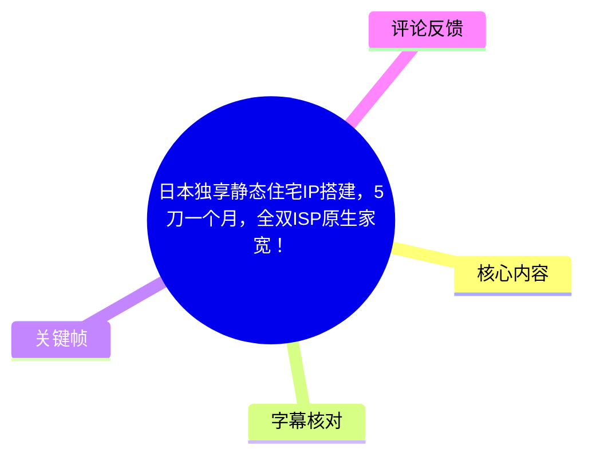
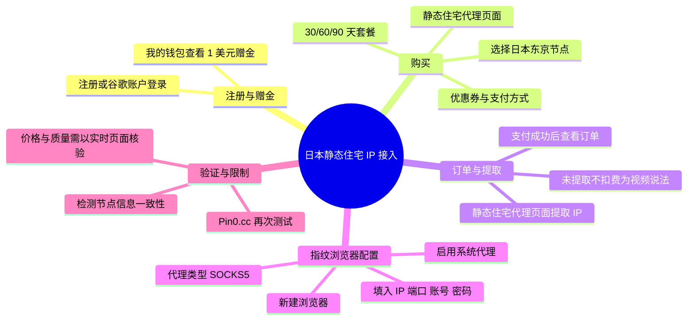
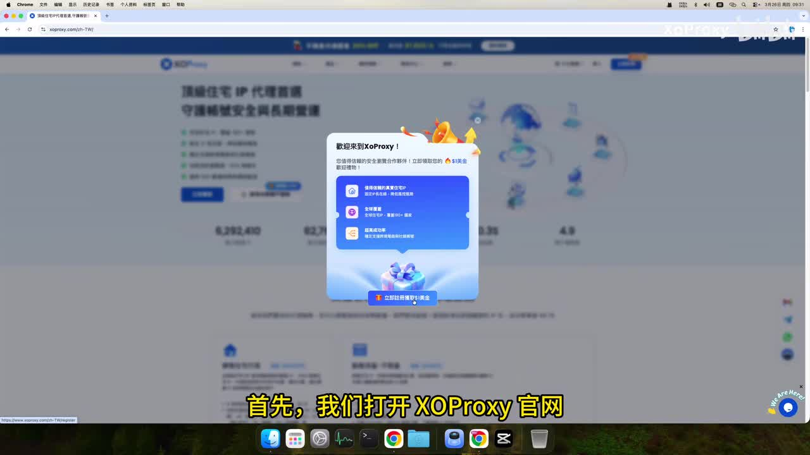
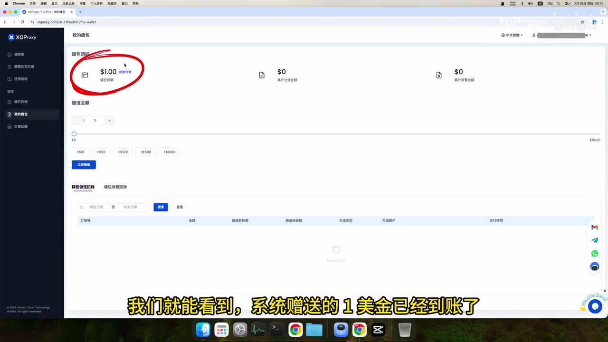
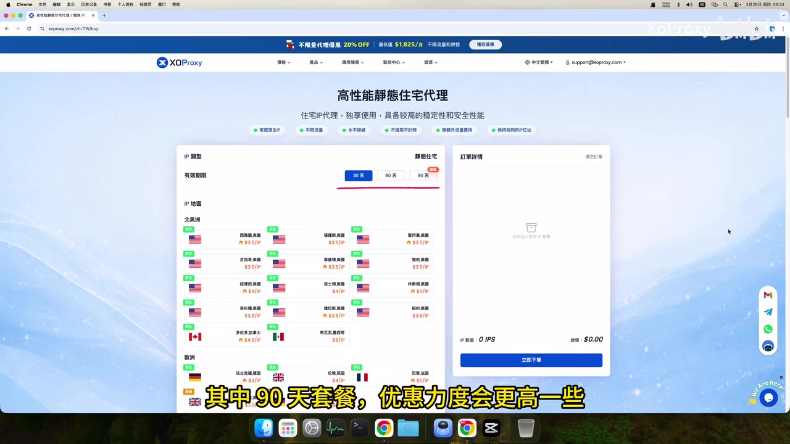
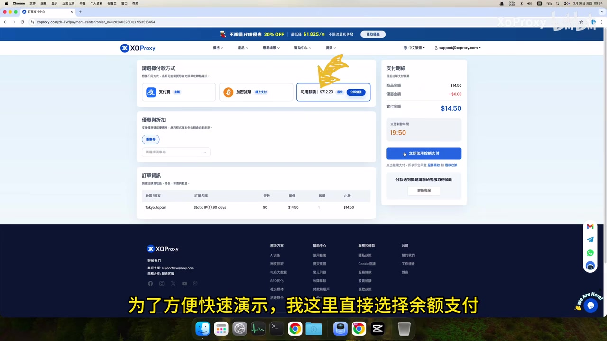

# 日本独享静态住宅IP搭建，5刀一个月，全双ISP原生家宽！

> 来源：[Bilibili 视频](https://www.bilibili.com/video/BV1iJXpBpEvb)<br>
> UP 主：XoProxy｜视频时长：5 分 16 秒｜分辨率：3840×2160<br>
> 视频简介明确标注“仅技术交流，合规使用”。

## 小结

这是一支围绕 **ExoProxy 日本东京静态住宅代理**的购买与接入演示。视频依次展示：注册并领取新用户赠金、在“静态住宅代理”页面选择套餐和东京节点、支付及订单查看、提取已购 IP，以及将代理填入指纹浏览器进行连通性检测。

视频中对产品作出的描述包括“家庭原生 IP”“无限流量”“永不掉线”“不提取、不计时、无额外流量费用”等；套餐期展示为 **30 天、60 天、90 天**，作者称 90 天套餐优惠力度较高。需要注意的是，这些均为视频中平台页面或作者的营销性表述，并非本记录对服务质量、可用性或风控效果的独立验证。

操作上的关键点有两个：其一，购买完成后还需在静态住宅代理页面执行“提取”，作者称未提取时不会扣费；其二，向指纹浏览器填写配置时，代理类型应选择 **SOCKS5**，并核对 IP、端口、账号和密码。检测不通过时，视频建议首先回查这五项配置。

标题称“5 刀一个月”，但所给关键帧中实际可见的是一张 **东京、日本、Static IP、90 days、$14.50** 的支付订单画面；该画面没有直接证明“5 美元/月”对应的具体套餐、折扣条件或结算口径。因此不能仅依据标题推导实际月均价格，购买前应以当期下单页、地区、时长、优惠券与税费为准。

本内容适合需要了解“静态住宅代理从购买到接入指纹浏览器”的流程的新手。它不构成对平台代理质量、所谓“原生”“双 ISP”“极度纯净”、特定站点可用性或账号安全性的保证；代理使用还应符合所在地法律、目标服务条款和账户安全要求。

## 思维导图





## 目录

- [背景、范围与时效性](#背景范围与时效性)
- [注册、赠金与套餐信息](#注册赠金与套餐信息)
- [下单、支付与订单处理](#下单支付与订单处理)
- [提取静态 IP 与凭据](#提取静态-ip-与凭据)
- [指纹浏览器中的 SOCKS5 配置](#指纹浏览器中的-socks5-配置)
- [验证结果、经验与限制](#验证结果经验与限制)
- [字幕比对](#字幕比对)
- [评论分析](#评论分析)
- [处理记录](#处理记录)

## 背景、范围与时效性 [00:00](https://www.bilibili.com/video/BV1iJXpBpEvb?t=0)

视频目标是完成一条日本静态住宅 IP 的实际接入，具体服务商为 ExoProxy，目标使用环境为指纹浏览器。作者在开场明确覆盖三件事：

1. 领取 ExoProxy 新用户福利；
2. 购买日本静态机／静态住宅 IP；
3. 将代理配置到指纹浏览器中使用。

这里的“静态”在视频语境中是指购买后提取并使用固定的代理 IP；视频没有解释其底层网络架构、ASN、IP 归属证明方法，也没有给出带宽、延迟、并发数、可用端口范围或 SLA 数据。

视频发布于元数据所示的 2026 年，且平台套餐、赠金、库存、支付方式、节点价格、检测网站结论都会随时间变化。因此本文只记录该视频呈现的界面和说法，不将其视为当前仍有效的报价或产品承诺。



> 图：画面显示 ExoProxy 首页及“欢迎来到 XoProxy”的新手礼包弹窗。它说明教程从站点注册／新人活动入口开始，但弹窗文字本身不应被解读为长期有效的优惠规则。

## 注册、赠金与套餐信息 [00:18](https://www.bilibili.com/video/BV1iJXpBpEvb?t=18)

### 1. 注册与查看赠金

作者先打开 ExoProxy 官网，称普通邮箱注册和第三方账户登录均可进入注册流程；演示中选择了谷歌账户登录。登录后，操作路径为：

1. 点击左侧菜单的“我的钱包”；
2. 进入钱包明细；
3. 查看系统赠送的 1 美元是否到账。

视频称新用户可获得价值 **1 美元**的礼包。关键帧中的钱包页面也显示“$1.00”，与此处演示相互印证；不过赠金资格、到账时间、使用限制和是否可叠加其他优惠，视频没有完整展开。



> 图：红圈标出了钱包页面的 `$1.00`。该图对理解“新用户赠金”的演示结果最直接，但只能证明录制账户当时的页面状态，不能证明所有用户均可获得相同奖励。

### 2. 套餐、产品卖点与东京节点

随后作者回到首页，经由顶部“价格”菜单进入“静态住宅代理”购买页。视频中提到该页面将产品描述为高性能住宅代理，并列出下列卖点：

- 家庭原生 IP；
- 无限流量；
- 永不掉线；
- 不提取；
- 不计时；
- 无额外流量费用；
- 保持相同的 IP 地址。

页面提供的有效期选项为：

| 套餐有效期 | 视频说明 |
| --- | --- |
| 30 天 | 可选期限之一 |
| 60 天 | 可选期限之一 |
| 90 天 | 作者称优惠力度更高 |

作者选择了 **日本东京节点**后点击“立即下单”。这里应区分两类信息：套餐期限和节点选择属于操作流程；“高性能”“原生”“永不掉线”等则属于页面宣传语，视频未提供第三方测量或长期稳定性测试。



> 图：购买页可见“高性能静态住宅代理”标题及 30 天、60 天、90 天的期限切换按钮，适合用来核对视频所说的套餐结构。页面中还列出了不同地区节点，但本视频实际选择的是日本东京。

## 下单、支付与订单处理 [01:15](https://www.bilibili.com/video/BV1iJXpBpEvb?t=75)

### 1. 下单与支付

选择东京节点后，作者说明如有优惠券可在支付环节选择使用。ASR 记录中提到页面有以下支付方式：

- 支付宝支付；
- 加密货币支付；
- 余额支付。

为加快演示，作者选择“余额支付”并点击“立即支付”，随后页面显示支付成功。视频没有展示充值流程、不同支付方式的地区可用性、退款规则或支付失败后的具体处理策略。

关键帧展示的订单明细中，可以读取到以下画面信息：

| 项目 | 关键帧可见内容 |
| --- | --- |
| 节点 | Tokyo, Japan |
| 订单项目 | Static IP |
| 有效期 | 90 days |
| 商品金额／应付金额 | $14.50 |
| 支付方式区域 | 支付宝、加密货币、可用余额 |

因此，视频画面至少表明演示订单为 90 天东京静态 IP、金额 14.50 美元；它与标题中的“5 刀一个月”并非同一可直接验证口径。可能存在套餐、促销、币种、时点或标题概括差异，但素材没有足够信息解释，不能自行补全。



> 图：支付页同时呈现订单项目、90 天期限与 `$14.50` 金额，是判断本次演示实际订单参数的重要证据，也提示标题价格不能直接当作精确报价。

### 2. 已支付与未完成订单

支付成功后，作者点击“查看订单”，进入订单列表，再点击“订单详情”查看刚购买产品的详情。

对于下单中遇到问题、未能及时完成支付的情况，作者表示不必重新选择购买，可在订单列表中找到对应订单继续处理。视频未给出订单保留时长、超时关闭条件或补款规则，遇到异常应以订单页状态和平台客服答复为准。

## 提取静态 IP 与凭据 [02:05](https://www.bilibili.com/video/BV1iJXpBpEvb?t=125)

支付后还不能直接将代理填入浏览器。作者进入“静态住宅代理”界面，对已购买 IP 执行提取操作：

1. 在静态余额区域找到“日本东京”的静态 IP 卡片；
2. 点击该卡片；
3. 在右侧弹出的可提取 IP 列表中点击“提取”；
4. 等待页面更新；
5. 到“已提取的 IP”中查看结果。

作者特别提醒：**购买后如果一直不提取，不会扣费**。这一点是视频口述的产品规则，但没有展示完整条款或计费逻辑；实际使用前仍应核对平台的计费说明，尤其是“购买生效”“提取生效”“续费”和“到期回收”的时间节点。

若 IP 没有立即到账，作者建议稍等片刻、刷新页面，再到已提取列表查看。提取成功并点击“使用”后，页面会显示以下连接凭据：

| 配置项 | 用途 |
| --- | --- |
| IP | 代理服务器地址 |
| 端口 | 代理服务端口 |
| 账户名称 | 认证用户名 |
| 密码 | 认证密码 |

作者使用“一键复制”复制整组信息，再将其粘贴到指纹浏览器。凭据属于敏感信息：不应发布在截图、工单、日志或公开环境中；若怀疑泄露，应立即在供应商侧更换、停用或重置相应代理资源。

## 指纹浏览器中的 SOCKS5 配置 [03:05](https://www.bilibili.com/video/BV1iJXpBpEvb?t=185)

作者接着打开指纹浏览器，并先进行本地基础设置。视频步骤如下：

1. 点击右上角“个人设置”，进入本地设定；
2. 找到相关设置，开启“使用系统代理”；
3. 若页面提示“立即安装”，则点击安装；
4. 待本地网络环境确认正常后，开始创建浏览器环境；
5. 点击“新建浏览器”；
6. 名称可自行填写，以便区分环境；
7. 将代理类型设为 **SOCKS5**；
8. 粘贴此前复制的 IP、端口、账号、密码；
9. 执行检测并保存。

可整理为以下配置清单：

```text
代理类型：SOCKS5
主机/IP：从 ExoProxy 已提取 IP 页面复制
端口：从 ExoProxy 已提取 IP 页面复制
用户名：从 ExoProxy 已提取 IP 页面复制
密码：从 ExoProxy 已提取 IP 页面复制
```

视频强调代理类型必须选 SOCKS5。若误选 HTTP、HTTPS 或其他协议，即使地址和认证信息正确，仍可能导致连接失败或检测结果异常。

作者称检测结果若与购买节点信息一致，便说明当前账号密码复制成功。更严格地说，节点一致只能反映该次检测的出口信息与预期相符，不能单独证明长期稳定性、全部网站兼容性、隐私安全性或“原生”属性。

## 验证结果、经验与限制 [04:10](https://www.bilibili.com/video/BV1iJXpBpEvb?t=250)

### 视频中的验证方法

完成保存后，作者打开浏览器，并通过 ASR 转写为 **“Pin0.cc”** 的网站再次测试当前 IP。视频口述称，页面显示“**双 ISP 原生住宅 IP**”，风控值显示“**极度纯净**”，作者据此判断该代理整体质量表现不错。

这一段可迁移的经验是：代理配置完成后，不应只看浏览器保存成功，还应执行至少一次出口检测，检查实际出口地区／节点是否与购买项一致。但检测站的标签和风控评级应视为该站在特定时刻的自身判断，而非通用、永久或跨平台有效的结论。

### 排错顺序

如果检测未通过，作者给出的排查顺序为：

1. 检查代理类型；
2. 检查 IP；
3. 检查端口；
4. 检查账号；
5. 检查密码；
6. 调整后重新检测。

除此之外，视频未讨论以下实际常见因素：本地系统代理与浏览器代理冲突、代理商 IP 尚未生效、账户认证白名单、网络防火墙、DNS 泄漏、IPv6 出口、浏览器环境残留，或目标网站本身的访问限制。因此，以上排错流程适合作为首轮检查，不应视为完整故障诊断方案。

### 合规与适用边界

- 视频适合用于理解代理购买、提取、认证和 SOCKS5 接入的基础步骤。
- 视频没有演示跨境电商、社交媒体、AI 服务或其他具体业务平台的成功使用过程。
- “双 ISP”“原生住宅”“极度纯净”“永不掉线”等说法没有展示可复现的验证标准、样本量和测试时长。
- 静态 IP 并不天然意味着不会触发目标服务的安全策略；账号历史、设备特征、行为模式、支付资料与服务条款同样会影响结果。
- 应仅在拥有授权且符合平台条款、当地法律与数据保护规范的场景中使用代理服务。

## 字幕比对 [05:00](https://www.bilibili.com/video/BV1iJXpBpEvb?t=300)

| 字幕来源 | 完整性 | 专有名词 | 时间轴 | 主要问题 |
| --- | --- | --- | --- | --- |
| Bilibili 站内字幕 | 未提供可用站内字幕 | 无法评估 | 无法评估 | 素材明确说明无可用站内字幕，不能进行逐句对照。 |
| 本次 ASR 字幕 | 覆盖了从开场到结束的主要流程 | 存在误识别与不确定拼写 | 未提供逐句时间码，本文依据视频流程作近似时间定位 | 出现“官罒”“登归”“静泰”“Sox5”“安裱”等错字；还混入“请不吝点赞、订阅、转发、打赏支持明镜与点点栏目”的明显无关文本。 |

最终采用 **本次 ASR 字幕为主，并结合关键帧、上下文和常见配置术语进行人工语义校正**。重要处理如下：

- ASR 中的“Exoproxy／XOP roxy”统一按页面品牌写作 **ExoProxy**；关键帧页眉可见“XOProxy”，但视频标题、口述与任务元数据使用 ExoProxy／XoProxy，本文保留服务名为 ExoProxy，并不对其商标拼写作额外推断。
- “Sox5”按网络代理协议语境校正为 **SOCKS5**。
- “静态机”“静泰 IP”等按上下文整理为“静态住宅 IP”，但保留作者原意，不额外定义产品技术属性。
- “Pin0.cc”为 ASR 结果；现有关键帧未显示该网站域名，无法据此确认其精确拼写，故不擅自改为其他检测站。
- ASR 中夹杂的“明镜与点点栏目”与视频主题及前后操作无关，判定为转写串音／误混入内容，未纳入正文事实。

## 评论分析 [05:08](https://www.bilibili.com/video/BV1iJXpBpEvb?t=308)

素材要求获取热评前三条，但实际仅提供 **2 条**可获取热评，以下只分析这两条，不补造第三条。

1. **深野昂Zzc**（获赞 2）：“带宽”  
   - 观点：评论者以极简方式追问带宽这一核心性能参数。  
   - 补充价值：指出视频虽然介绍购买、提取和风控标签，却没有展示带宽测速、上下行速率、延迟、抖动或长时间稳定性数据。  
   - 可信度与结论：这是合理的信息缺口提示，不是对产品性能的正面或负面证据。

2. **荔枝很绿**（获赞 1）：“可以稳定用claude不封号吗？”  
   - 观点：评论者关心该代理能否稳定访问 Claude 且避免账号封禁。  
   - 补充价值：反映用户对具体 AI 服务兼容性和账号风险的实际关注。  
   - 可信度与结论：视频未展示 Claude 的测试过程，也未提供任何账号安全承诺；代理 IP 只是网络环境的一部分，不能据此推导“不封号”。该问题在现有素材中没有得到验证或回答。

## 处理记录 [05:15](https://www.bilibili.com/video/BV1iJXpBpEvb?t=315)

- **Worker ID**：worker-mrj0www4-e8d79408
- **模型**：gpt-5.6-terra
- **调用工具与素材输出**：依据任务提供的元数据、视频素材清单、ASR 字幕、热评 JSON 信息及关键帧路径进行整理；可用产物包括 `merged.mp4`、`audio/audio.wav`、`frames/`、`comments/comments.json`、`subtitles/`、`asr/`。
- **字幕选择**：站内字幕未提供可用版本；本次 ASR 已执行并作为正文主要文本依据。对明显错字、协议名和无关串音做了上下文校正，未将无法核验的域名或宣传表述扩展为事实。
- **关键帧选择依据**：选用 `frame-001` 至 `frame-004`，分别对应新人礼包入口、钱包赠金、套餐选择和支付订单；它们与注册、价格和支付这三个关键步骤直接相关，并可核验 1 美元赠金、30/60/90 天套餐及 90 天 `$14.50` 订单画面。
- **评论处理范围**：按“热评前三条”限制处理；素材仅返回两条可获取评论，未虚构缺失的第三条。
- **缓存清理**：提供的素材清单未包含缓存清理执行记录，无法确认是否已清理；本记录不宣称已完成清理。
- **未解决问题**：
  - 标题“5 刀一个月”与关键帧中 90 天 `$14.50` 的订单金额之间的具体计算关系未在素材中说明；
  - 未提供代理的带宽、延迟、在线率、IP 归属证明及长期测试数据；
  - “Pin0.cc”的精确站点拼写无法从现有关键帧核验；
  - 未验证对 Claude 或其他具体第三方服务的兼容性、稳定性与账号风险。

## 评论分析

本次流程未获取到可用热评，因此不推断观众态度或额外结论。
