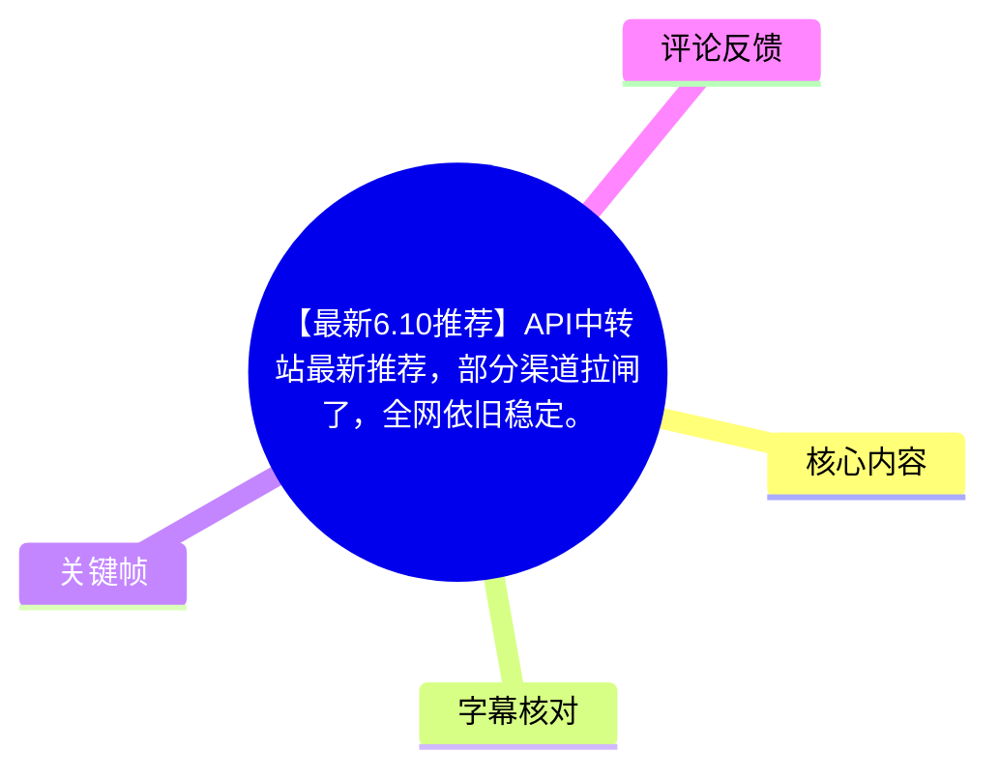
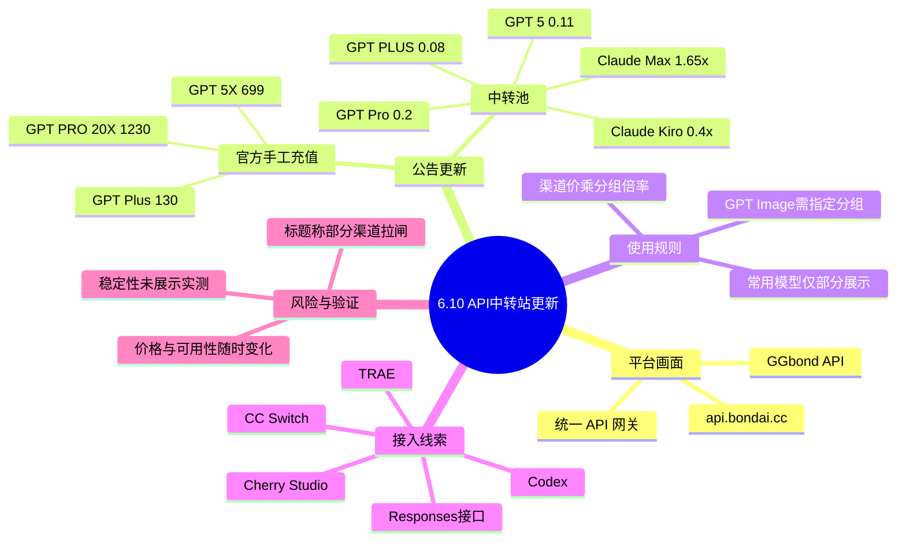
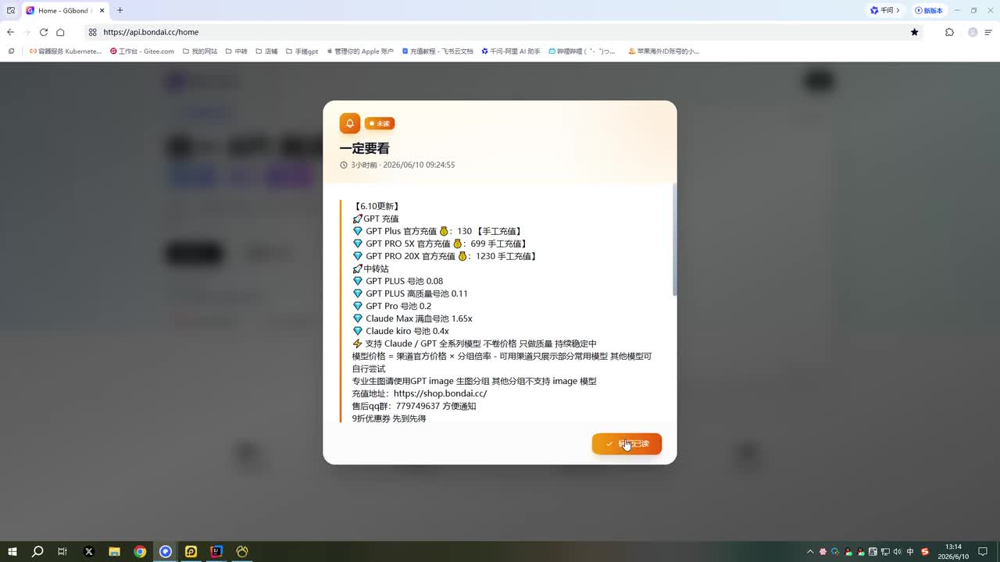
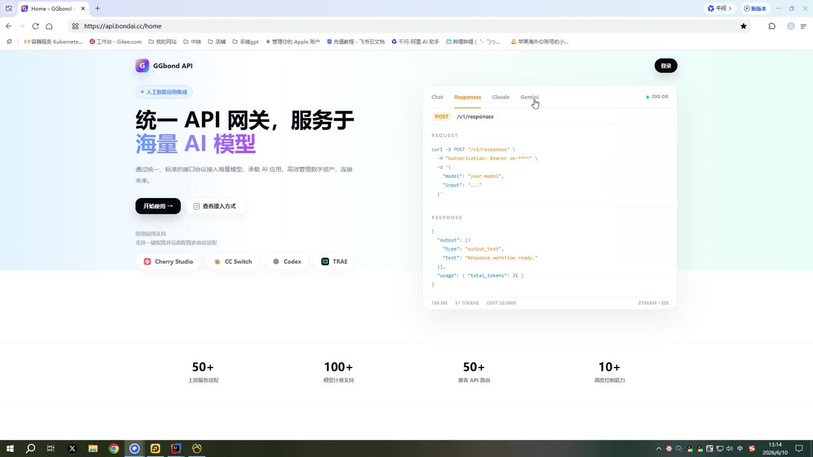

# 【最新6.10推荐】API中转站最新推荐，部分渠道拉闸了，全网依旧稳定。

> 来源：[Bilibili 视频](https://www.bilibili.com/video/BV1f7EQ64EGJ)  
> UP 主：你的网友小chao｜合集：AIcode｜视频时长：45 秒  
> 视频简介提供资源地址：<https://ocnmwa89fxv7.feishu.cn/wiki/Fm7jw0DR0igI3OkCzBhcBv17nqC>

## 小结

这是一条以画面公告形式发布的 API 中转站更新信息。视频标题称“部分渠道拉闸了，全网依旧稳定”；画面中展示的平台为 **GGbond API**，浏览器地址栏显示 `api.bondai.cc/home`，并给出充值入口 `https://shop.bondai.cc/` 及交流群号 `779749637`。

更新公告标注为“【6.10更新】”，内容分为官方充值和“中转站”两类。画面列出的官方充值价格包括：GPT Plus 130、GPT 5X 699、GPT PRO 20X 1230，均标注“手工充值”；中转渠道则列出 GPT PLUS、GPT 5、GPT Pro、Claude Max、Claude Kiro 等池子及相应倍率/价格。该视频没有展示实际调用、余额、接口响应或稳定性测试过程，因此“稳定”是标题与公告中的主张，而不是由视频内实测数据证明的结论。

平台首页宣传其为“统一 API 网关，服务于海量 AI 模型”，画面显示支持 Chat、Responses、Claude、Gemini 等接口/模型入口，并展示 `/v1/responses` 请求示例、`200 OK` 状态，以及 Cherry Studio、CC Switch、Codex、TRAE 等常用应用支持标识。这些均属于网站界面的自述信息，未在视频中逐项验证。

对需要选择 API 中转服务的读者，最有价值的是：先把公告中的具体价格、倍率、模型分组限制记录下来，再自行完成注册、充值、密钥配置和小额调用验证。尤其应注意，公告明确写有“渠道官方价格 × 分组倍率”的定价逻辑，且专业生图需要使用指定 GPT Image 分组；不能将一个分组可用直接推断为全部模型、全部能力均可用。

信息具有强时效性。公告的更新日期为 6 月 10 日，视频标题本身也提示部分渠道可能已经“拉闸”；价格、渠道状态、模型可用性、限速与充值规则均可能在发布后变化。热评还对最低价提出不同说法，进一步说明下单前应以当前实际页面、订单页和调用测试为准。

## 思维导图





## 目录

- [更新背景与证据边界](#更新背景与证据边界)
- [6 月 10 日公告：价格与渠道信息](#6-月-10-日公告价格与渠道信息)
- [GGbond API 首页与接口接入线索](#ggbond-api-首页与接口接入线索)
- [实践步骤：从公告到自主验证](#实践步骤从公告到自主验证)
- [限制、风险与时效性](#限制风险与时效性)
- [关键帧说明](#关键帧说明)
- [字幕比对](#字幕比对)
- [评论分析](#评论分析)
- [处理记录](#处理记录)

## 更新背景与证据边界 [00:00](https://www.bilibili.com/video/BV1f7EQ64EGJ?t=0)

视频全长 45 秒，标题为“API中转站最新推荐，部分渠道拉闸了，全网依旧稳定”。画面主要由两个部分构成：

1. 一张“**一定要看**”的 6 月 10 日更新公告；
2. GGbond API 网站首页及其登录入口。

由于没有可用的站内字幕，本次 ASR 也未识别到任何语音分段，无法依据字幕为后续画面建立精确到秒的内容切分。因此，除视频起点 `00:00` 外，本文不虚构关键帧发生时刻；正文按可见画面主题整理，而非把帧文件顺序误当作可靠时间轴。

视频所能直接支持的事实包括：

- 画面出现 GGbond API 品牌与 `api.bondai.cc/home` 地址；
- 公告确实列出特定模型的充值价、池子价格/倍率与使用限制；
- 首页确实展示统一 API、`/v1/responses`、多个模型标签及多个客户端标识；
- 视频简介确实提供飞书资源链接。

以下内容**不能由该视频直接证明**：

- 标题所称“全网依旧稳定”的具体范围、成功率、延迟、并发能力；
- 各渠道是否在读者观看时仍可购买或调用；
- 公告所列价格是否包含全部费用、是否有最低充值额、是否有地区或账户限制；
- 接口是否完全兼容各官方 API、全部参数或全部模型功能。

## 6 月 10 日公告：价格与渠道信息 [00:00](https://www.bilibili.com/video/BV1f7EQ64EGJ?t=0)

公告顶部显示“【6.10更新】”，并标出“3小时前 · 2026/06/10 09:24:55”。这表明其是一个面向当时渠道情况的短周期更新，不应被当作长期不变的价格表。

### 官方充值项目

画面“GPT 充值”部分列出以下项目：

| 项目 | 画面标注价格 | 附加说明 |
| --- | ---: | --- |
| GPT Plus 官方充值 | 130 | 手工充值 |
| GPT 5X 官方充值 | 699 | 手工充值 |
| GPT PRO 20X 官方充值 | 1230 | 手工充值 |

“手工充值”意味着这几项并非画面中可验证的自动化即时开通流程。视频没有说明人工处理时长、所需账号资料、失败处理、退款政策或适用地区，因此实际购买前需要向服务方确认。

### 中转池与分组信息

公告“中转站”部分可辨识的信息如下：

| 模型/服务项 | 公告标注 | 备注 |
| --- | ---: | --- |
| GPT PLUS 池 | 0.08 | 单位、计费口径未在视频中说明 |
| GPT 5 池 | 0.11 | 单位、计费口径未在视频中说明 |
| GPT Pro 导池 | 0.2 | 画面文字显示为“导池”，具体含义未解释 |
| Claude Max 满血导池 | 1.65x | 以倍率表示 |
| Claude kiro 导池 | 0.4x | 以倍率表示 |

公告进一步给出定价规则：

> 模型价格 = 渠道官方价格 × 分组倍率。

这条规则的实际含义是：中转服务的最终消耗不能只看模型名称或页面上的单一数字，还需要确认自己使用的**渠道**和**分组倍率**。视频没有列出每个渠道的官方基准价，也没有展示账单样例，因此无法从现有素材推导任一模型的最终每百万 Token 成本或请求成本。

### 模型展示与生图分组限制

公告还写明：

- 可用渠道只展示部分常用模型，其他模型可自行尝试；
- 专业生图请使用 **GPT Image 全部分组**；
- 其他分组不支持 image 模型。

这意味着“页面能看到某模型”与“该模型在全部分组都能调用”是两回事。若目标是图像生成，应优先核验所选分组是否为公告所称的 GPT Image 全部分组，并用小额请求验证 image 能力、输出格式、尺寸参数和计费方式。



> 图：该关键帧完整呈现本视频最核心的更新公告，包括 6 月 10 日标记、充值项目、中转池、定价公式、GPT Image 分组限制、充值站点和交流群号。它是整理价格与限制时的直接视觉依据；但画面并未展示这些项目的实际购买或调用结果。

## GGbond API 首页与接口接入线索 [00:00](https://www.bilibili.com/video/BV1f7EQ64EGJ?t=0)

GGbond API 首页的主文案为“**统一 API 网关，服务于海量 AI 模型**”。副文案将其描述为通过统一、标准化接口访问海量模型，承载 AI 应用并连接未来。这是平台的宣传定位，不等同于对兼容性、SLA 或服务范围的独立验证。

### 可见的接口与模型入口

页面右侧模拟面板包含：

- Chat；
- Responses；
- Claude；
- Gemini；
- `POST /v1/responses`；
- `200 OK` 状态标记；
- Bearer Token 形式的鉴权示例；
- JSON 请求体中的 `model`、`input` 字段；
- 响应中的 `output_text` 与 `usage` 字段。

从画面可见，平台至少以 OpenAI 风格的 Responses 接口作为宣传接入形式之一。页面示例的结构可概括为：

```http
POST /v1/responses
Authorization: Bearer sk-******
Content-Type: application/json
```

```json
{
  "model": "your-model",
  "input": "..."
}
```

不过，视频中的代码区为网站示意，未展示可复制的真实 Base URL、完整请求头、可用模型 ID、响应字段说明、流式响应配置或错误码规则。因此不能直接据此构造保证可用的生产请求；应登录后以平台实时文档为准。

### 页面展示的兼容应用与规模宣传

首页下方可见 Cherry Studio、CC Switch、Codex、TRAE 等标识，暗示平台面向这些应用或工作流提供接入支持。页面同时显示四组宣传数字：

- `50+` 上游渠道；
- `100+` 模型支持；
- `50+` 兼容 API 应用；
- `10+` 网络接入。

这些是网页可见的营销/产品自述，视频没有提供渠道名单、模型清单、兼容性测试结果或网络接入定义。实际接入前，应在自身客户端中以最小化配置测试：填写 Base URL、API Key 和模型名后，分别确认普通对话、流式输出、工具调用或图像生成等所需能力。



> 图：该关键帧展示 GGbond API 首页及其接口宣传。左侧给出“统一 API 网关”定位，右侧呈现 `/v1/responses`、Chat、Responses、Claude、Gemini 等入口，底部显示兼容客户端和数量级宣传，适合用于理解该视频所推荐服务的定位与接入方向。

## 实践步骤：从公告到自主验证 [00:00](https://www.bilibili.com/video/BV1f7EQ64EGJ?t=0)

视频未实际演示注册、充值或调用。以下步骤是基于视频给出的入口与限制整理的**审慎验证流程**，其中只有站点地址、交流群号、定价公式和分组限制来自画面；具体功能和结果必须由使用者自行测试。

### 1. 核对最新公告与入口

1. 从视频简介提供的飞书资源地址获取最新说明；
2. 核对公告中的更新日期，避免使用过期价格；
3. 检查视频画面提供的充值地址：`https://shop.bondai.cc/`；
4. 如需咨询，画面给出的交流群号为 `779749637`。

不要仅因视频标题称“稳定”而直接大额充值。特别是在“部分渠道拉闸”的背景下，先确认目标模型、目标分组与目标客户端均处于可用状态。

### 2. 区分官方充值与中转调用

- 若需要画面所列 GPT Plus、GPT 5X 或 GPT PRO 20X 的“官方充值”，需注意其标注为“手工充值”，应先确认人工处理规则；
- 若使用中转 API，则应确认模型所在渠道、分组以及倍率；
- 对公告中的 `0.08`、`0.11`、`0.2` 等数值，视频没有给出单位，不能擅自解释为每 Token、每百万 Token、人民币或美元。

### 3. 按分组确认模型能力

根据公告：

- 常用模型只是部分展示，其他模型需要自行尝试；
- 图像生成应选择 GPT Image 全部分组；
- 其他分组不支持 image 模型。

建议用最小量级请求分别验证：

1. 文本模型是否能返回内容；
2. 所需模型 ID 是否可被客户端识别；
3. 流式输出是否可用；
4. 图像模型是否确实能接受 image 请求；
5. 控制台余额与实际账单是否符合预期。

### 4. 采用小额、可回滚的接入策略

可执行的风险控制方式包括：

- 先使用低额度余额完成单模型试调用；
- 将 Base URL、模型名、分组和调用时间记录下来；
- 遇到错误时保留 HTTP 状态码与错误消息；
- 不把单次成功推导为长期稳定；
- 将业务流量保留官方渠道或备用中转渠道，避免单一服务故障影响生产任务。

## 限制、风险与时效性 [00:00](https://www.bilibili.com/video/BV1f7EQ64EGJ?t=0)

### 视频素材的限制

本视频为 45 秒的画面展示，没有口播内容被识别，也没有实际调用测试。它可作为“某时点的公告与入口线索”，但不足以构成下列结论：

- 服务在所有地区、账户和时间段稳定；
- 任何一个模型均可用；
- 价格一定低于其他服务；
- 支持全部 OpenAI、Anthropic 或 Google 相关功能；
- 手工充值一定能在特定时间内完成。

### 价格与计费风险

公告明确存在渠道、分组和倍率三个变量。即便模型名称相同，不同分组可能对应不同倍率，最终成本也可能不同。对于未标明单位的池子数值，不能根据截图自行换算。付款前应确认：

- 币种与价格单位；
- 最低充值/消费门槛；
- 模型的输入、输出、缓存、图像等计费方式；
- 渠道变更后的余额与退款规则；
- 限速、并发、上下文长度及内容政策。

### 时效性

公告显示为 2026 年 6 月 10 日更新；而素材获取时间为 2026 年 7 月 15 日。两者之间存在时间间隔，且标题已提示渠道会变化。因此本文保留的是视频内的历史展示，不将其视作 2026 年 7 月 15 日或之后仍然有效的实时价格与服务状态。

## 关键帧说明

本次素材提供 12 张关键帧，但未提供各关键帧的原始时间戳；ASR 也没有时间分段可用于帧时刻校准。为避免根据文件编号编造画面时间，正文只选用信息密度高、文字可辨的两张关键帧，并统一链接至视频起点。

| 关键帧 | 正文用途 | 选择依据与价值 |
| --- | --- | --- |
| `frames/frame-001.jpg` | 公告价格、倍率、模型与限制 | 画面集中展示“6.10更新”、官方充值、中转池、定价公式、GPT Image 分组限制、充值站和群号，是核对具体文本的首要证据。 |
| `frames/frame-002.jpg` | 平台定位与接入线索 | 清晰呈现 GGbond API 首页、统一 API 网关定位、`/v1/responses`、模型标签、兼容应用和规模宣传，能支撑对页面宣传内容的描述。 |

## 字幕比对

| 字幕来源 | 完整性 | 专有名词 | 时间轴 | 主要问题 |
| --- | --- | --- | --- | --- |
| Bilibili 站内字幕 | 未提供可用字幕 | 无法核验 | 无 | 素材明确说明未提供可用站内字幕。 |
| 本次 ASR 字幕 | 空 | 无识别结果 | 无可用分段 | ASR 使用 `medium` 模型自动识别，语言判断为英语、置信度 `0.541015625`；共识别到 `0` 个语音段，语音覆盖时长为 `0` 秒。诊断提示未识别到语音。 |

本次 ASR 已按要求检查，但结果为空。诊断信息**未**标记 `noAudioStream=true`，因此不能断言源视频没有音轨；只能如实说明：现有 ASR 未识别到可用语音内容，可能是视频以静态画面/低可识别度音频为主，或音轨中没有可被该模型识别的连续语音。

最终没有可采用或可合并的字幕文本。本文以以下证据组织内容：

1. 视频元数据中的标题、简介、时长与统计信息；
2. `frames/frame-001.jpg` 的公告可见文字；
3. `frames/frame-002.jpg` 的网页界面可见文字；
4. 已获取的两条热评。

由于缺少带时间戳的站内字幕和 ASR 分段，不能对“GPT Pro 导池”“Claude kiro 导池”等截图文字做超出画面本身的语义扩展；相关名称按可见拼写保留，并标注未解释之处。

## 评论分析

本次仅获取到 2 条热评，少于“热评前三条”的上限；以下不补造第三条评论，也不把评论内容当作已验证事实。

| 评论 | 点赞 | 观点与补充 | 可信度与提示 |
| --- | ---: | --- | --- |
| Potato-破忒头喔：“不用看了，最低的0.25没有0.05” | 1 | 该评论质疑视频/相关信息中较低价格的存在，称最低价格是 `0.25` 而非 `0.05`。 | 这与视频公告中可见的 `0.08`、`0.11`、`0.2` 等数字并不直接一一对应，且视频未说明这些数值单位或具体模型。评论未给出截图、链接或时间点，只能作为“价格可能变动或口径不同”的提醒。 |
| 陈禧狗：“这个有交流群吗” | 0 | 询问是否存在交流群。 | 公告画面确实显示“售后qq群：779749637 方便通知”，可视为视频内给出的线索；但是否仍可加入、群用途及服务有效性均需自行确认。 |

## 处理记录

- Worker ID：`worker-mrj0www4-e8d79408`
- 模型：`gpt-5.6-terra`
- 素材处理与可用工具产物：视频元数据、`merged.mp4`、`audio/audio.wav`、关键帧目录 `frames/`、ASR 结果目录 `asr/`、评论文件 `comments/comments.json`；站内字幕目录已检查，但没有可用站内字幕。
- ASR 检查：使用 `medium` 模型、CUDA、`float16`；自动语言判断为英语（概率 `0.541015625`），输出 0 个分段，未产生可用 SRT 文本或时间轴。
- 字幕选择：未采用站内字幕（未提供）；未采用本次 ASR 文本（输出为空）。正文改以关键帧可见文字、元数据和评论为依据。
- 时间轴依据：没有 ASR/SRT 的真实分段时间，故未伪造章节发生时刻；章节统一仅链接视频起点 `t=0`，并明确关键帧无可校准时间戳。
- 关键帧选择依据：`frame-001.jpg` 文字信息最集中，支撑价格、倍率和限制；`frame-002.jpg` 清晰展示平台首页、接口形式和兼容应用。其余帧未在缺少时标的情况下被用于推断新的事实。
- 热评处理：仅分析实际获取到的前 2 条热评，未补充不存在的第三条。
- 缓存清理：素材清单未提供缓存清理执行结果；本文不声称已完成缓存清理。
- 未解决问题：公告数值的单位与具体计费口径、渠道实时状态、模型完整列表、API Base URL/鉴权细节、手工充值规则、实际稳定性与性能均未能从现有视频素材验证。
