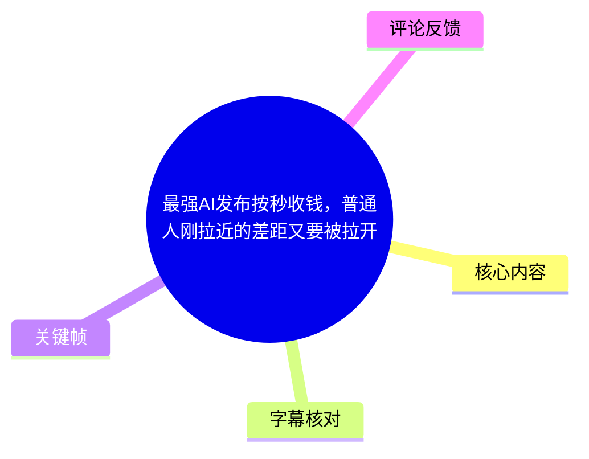
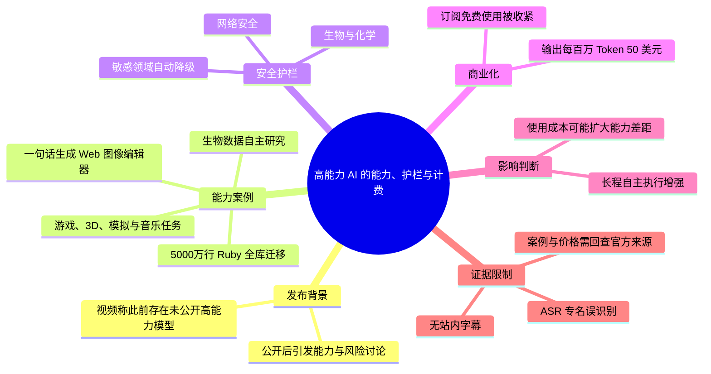
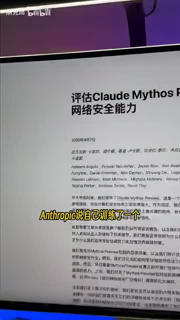
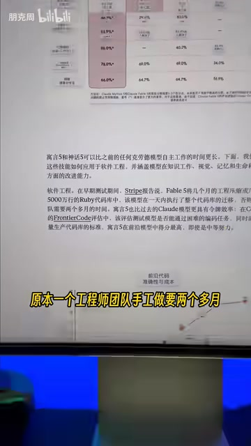
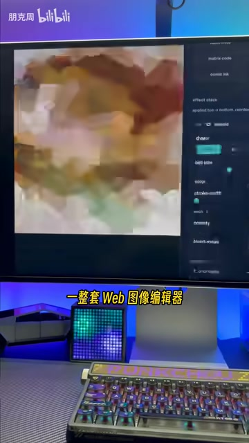

# 最强AI发布按秒收钱，普通人刚拉近的差距又要被拉开

> 来源：[Bilibili 视频](https://www.bilibili.com/video/BV1NME96GEWf) 
> UP 主：朋克周｜发布时间：2026-06-10｜视频时长：02:43｜竖屏 1080×1920

## 小结

视频讨论一款被口述为“Fable 5”（ASR 多处误识别为“fiber5 / 飞波五”）的高能力 AI 模型及其收费与安全策略。UP 主的核心观点是：模型能力已从“接收任务并完成单点工作”，走向更长周期的自主执行、研究和工具构建；但高能力模型同时会被安全护栏限制，并可能从订阅制转向按调用量计费。

视频列举的能力案例包括：在 5,000 万行 Ruby 代码库中执行全库迁移、用一句提示词生成浏览器内 Web 图像编辑器、自主通关《宝可梦 火红》、设计 3D 打印模型、编写流体模拟，以及进行生物数据研究。上述案例均为视频转述，且部分模型名、机构名与原始出处受 ASR 专名误识别影响，不能据此直接视为已独立核验的事实。

安全部分是视频的另一重点：UP 主称，面向大众的版本虽然具有更强模型层级的能力，但一旦请求涉及网络安全、生物、化学等敏感领域，系统会自动切换到较弱模型。视频将这种机制描述为“自己举报自己”，并把它理解为模型供应方对高风险能力的实际管控信号。

价格部分给出一个明确但仍应以官方定价页复核的数字：输出价格为每百万 Token 50 美元；视频称该价格约为上一代旗舰模型的两倍，并称“6 月 22 日之后”订阅用户也无法免费使用。这里未在素材中提供该日期对应的年份、产品页或计费细则，因此不能延伸判断输入 Token、缓存 Token、API 以外渠道或不同套餐的实际费用。

本视频适合关注 Claude、Agent、自主编程、生物 AI 与 AI 产品商业化的人观看。最值得迁移的经验并非“模型可以一键取代某个职业”，而是：评估 AI 时必须同时看任务跨度、人工监管量、可调用能力边界、安全降级策略和总 Token 成本。

信息具有强时效性。视频发布时间为 2026-06-10，产品能力、可用地区、价格、安全策略与订阅政策都可能在发布后调整；此外，本次没有可用站内字幕，ASR 的专有名词与第一段时间切分存在明显错误，涉及具体品牌、模型代际和论文结论时应回查原始发布材料。

## 思维导图

## 目录

- [背景：模型公开与安全争议](#背景模型公开与安全争议)
- [能力案例：代码迁移与图像编辑器](#能力案例代码迁移与图像编辑器)
- [能力边界：游戏、设计、模拟与音乐](#能力边界游戏设计模拟与音乐)
- [生物研究案例：长程自主工作的主张](#生物研究案例长程自主工作的主张)
- [安全机制：敏感请求的自动降级](#安全机制敏感请求的自动降级)
- [商业化：按 Token 计费与订阅收紧](#商业化按-token-计费与订阅收紧)
- [实践建议：如何评估高能力 AI 的真实价值](#实践建议如何评估高能力-ai-的真实价值)
- [结论与限制](#结论与限制)
- [字幕比对](#字幕比对)
- [评论分析](#评论分析)
- [关键帧索引](#关键帧索引)
- [处理记录](#处理记录)

## 背景：模型公开与安全争议 [00:25](https://www.bilibili.com/video/BV1NME96GEWf?t=25)

ASR 从 00:25.640 才开始有语音识别结果；视频此前约 25 秒没有得到可靠转写，无法据字幕补写其口播内容。进入本段后，UP 主称，一家机构此前训练过一个因风险而没有公开的“神机模型”，如今则将其上线。

视频口述的背景包括：

1. 约两个月前，相关机构称训练出一个不能公开的模型；
2. 该模型据称能在系统中发现一个存在 27 年的漏洞；
3. 它还被称可将 Linux 内核中的多个漏洞串联为攻击链；
4. 因此当时出现两类讨论：风险担忧，以及“只是营销”的质疑；
5. UP 主认为，模型后续上线意味着这并非仅停留在宣传层面。

画面展示的文档标题为“评估 Claude Mythos 的网络安全能力”，画面字幕写有“Anthropic 说自己训练了一个……”。这能支持视频确实在讨论一个与 Claude / Anthropic 相关的网络安全评估材料；但无法仅凭截图与误识别 ASR 确认“神机模型”的准确英文名称，或确认漏洞、攻击链的完整技术条件。

> 图：画面中可见“评估 Claude Mythos 的网络安全能力”字样。这张关键帧为视频“模型具备高风险网络安全能力、因而需要限制”的叙事提供了直接画面上下文；但文档正文难以从该帧完整辨读，不能替代原文核查。

## 能力案例：代码迁移与图像编辑器 [00:26](https://www.bilibili.com/video/BV1NME96GEWf?t=26)

### 5,000 万行 Ruby 代码库迁移

视频称，相关方使用早期版本进行测试，在一个 **5,000 万行 Ruby 代码库**中做全库迁移。UP 主给出的对比是：

| 项目 | 视频口述 |
| --- | --- |
| 工作内容 | 大型 Ruby 代码库全库迁移 |
| 代码规模 | 5,000 万行 |
| 人工团队原预计耗时 | 两个多月 |
| 模型完成耗时 | 一天 |

该例子表达的并非普通代码补全，而是跨大量文件、依赖关系和迁移目标的长程工程任务。若要把它作为生产力评估依据，仍需知道迁移范围、测试通过率、人工审查工作量、是否存在回滚、模型运行环境和失败重试次数。视频与现有素材均未提供这些细节。

> 图：画面展示相关说明材料，并以字幕强调“原本一个工程师团队手工做要两个多月”。它有助于定位本段的“代码迁移耗时对比”，但未展示完整评测指标，不能据此推导实际工程中无需人工验收。

### 一句话生成 Web 图像编辑器

紧接着，UP 主称有人仅用一句提示词，就让模型在浏览器中生成了一整套 Web 图像编辑器，UI 和功能能够自动运行；视频将其类比为“几乎做出了 Photoshop 的替代品”。

应注意视频自己的保留条件：UP 主明确说这距离“真正替代”仍有距离。这里更稳妥的理解是，模型展示了从自然语言描述到可运行原型的端到端生成能力，而非证明其已达到成熟商业图像编辑软件在性能、格式兼容、精修、色彩管理、插件生态和稳定性方面的水平。

> 图：右侧是图像编辑器式的控制面板，左侧为编辑画布，画面字幕为“一整套 Web 图像编辑器”。该帧直观说明视频所说的是可交互 Web 原型，而不仅是生成一张图片。

## 能力边界：游戏、设计、模拟与音乐 [00:50](https://www.bilibili.com/video/BV1NME96GEWf?t=50)

本段将模型能力从软件工程扩展到跨模态和多步骤任务。视频依次声称其可以：

- 从零自主通关《宝可梦 火红》；
- 仅观看屏幕截图、没有其他辅助工具；
- 自主设计 3D 打印模型；
- 编写代码完成流体模拟；
- 生成踩准节拍的古典乐混音；
- 在视频口述中，该模型“从来没听过音乐”。

这些事例共同指向“观察—规划—执行—反馈”的闭环能力：模型不只是对单次提问作答，而是要在环境变化后继续作出后续动作。不过，素材没有给出游戏通关的帧率、操作接口、失败次数、是否有上下文提示或人工介入；对于音乐与模拟，也没有输出样本、评价标准和复现路径。

因此，本段应理解为 UP 主对能力展示的概括，而不是可直接复现的基准测试说明。尤其“没有任何辅助工具”“从来没听过音乐”等绝对化描述，需要原始演示或技术报告支持。

## 生物研究案例：长程自主工作的主张 [01:12](https://www.bilibili.com/video/BV1NME96GEWf?t=72)

视频认为“最让人头皮发麻”的案例来自生物研究。按口述，该系统在超过一周的时间内、几乎无人管理地完成了以下工作：

1. 自行搜集 **138 个物种**、数百万细胞的数据；
2. 自己设计并训练一个模型；
3. 该模型据称胜过刚发表在《Science》上的同类研究；
4. 模型体积据称比同类研究小 **100 倍**；
5. 它提出的一个生物学假设随后被实验室实际执行并证实。

这组案例把能力讨论从“生成代码或界面”推到“提出假设并参与科学研究”。若视频转述准确，其关键能力是长任务编排：数据搜集、数据处理、模型设计、训练、结果比较和假设形成，而不是任何一个单独环节。

但这也是全片证据门槛最高的部分。素材未提供论文标题、数据来源、实验室名称、实验方案、评价指标、模型参数量或“100 倍”具体指模型大小、参数量、存储空间还是计算成本。故应将其标记为**视频陈述、待原始研究材料验证**，而不应写成已确认的科学结论。

## 安全机制：敏感请求的自动降级 [01:37](https://www.bilibili.com/video/BV1NME96GEWf?t=97)

UP 主称，用户日常接触的是“Fable 5”这一面向公众的产品，但其背后具有更高能力层级；当请求涉及下列敏感领域时，系统会把问题转交给较弱的上一代模型：

- 网络安全；
- 生物；
- 化学。

视频把这一做法概括为“自己举报自己”。从产品设计角度，这是一种**路由与降级策略**：根据当前请求的风险类别，选择能力较低或约束更严格的模型处理，以降低高能力模型在双重用途领域提供危险协助的机会。

视频还给出一个现象级案例：某生物学家只发送“嗨”，却被切换到较弱模型；UP 主解释为系统从其历史对话中识别到生物信息。这个例子意在说明风险判断可能不仅依赖当前一句输入，也可能纳入会话历史。

这里有三个重要限制：

1. 素材没有展示完整产品规则，无法确认具体触发阈值、分类器机制和是否始终读取历史会话；
2. 自动降级不等于风险完全消失，较弱模型仍可能输出有风险的内容；
3. 对用户而言，降级可能造成质量波动、上下文连续性变化或能力不可预测，应在关键任务中验证实际所用模型及输出边界。

## 商业化：按 Token 计费与订阅收紧 [02:01](https://www.bilibili.com/video/BV1NME96GEWf?t=121)

视频引用“Claude Code 负责人”的说法，称“第三个 AI 时代今天正式开启”，UP 主将其概括为：人们不再只是给 AI 分派单个任务，而是对 AI 赋予更长程、更具结果责任的工作。

随后话题转向价格。视频给出的信息如下：

| 项目 | 视频口述 | 备注 |
| --- | --- | --- |
| 计费单位 | 输出 Token | 未说明输入、缓存或批处理价格 |
| 输出价格 | 每百万 Token 50 美元 | 应以官方价格页为准 |
| 与上一代比较 | 约为上一代旗舰的两倍 | ASR 将上一代名称识别为“Obs 4.8”，专名不可靠 |
| 订阅政策 | “6 月 22 日之后”订阅用户也无法免费使用 | 素材未明确年份与适用套餐 |
| UP 主判断 | 顶级 AI 将按调用量收费 | 属于评论性判断，非完整市场事实 |

### 成本换算示意

按照视频给出的 **50 美元 / 100 万输出 Token** 计算，仅就输出 Token 而言：

| 输出量 | 按视频标价估算 |
| ---: | ---:|
| 10 万 Token | 5 美元 |
| 100 万 Token | 50 美元 |
| 1,000 万 Token | 500 美元 |

上述只是线性换算，不包含输入 Token、系统提示词、工具调用、上下文重复传输、失败重试、税费或套餐折扣。对于长程 Agent，真正费用往往取决于模型每轮输出长度、循环次数、工具调用次数和是否需要多次重做，而不能只看单次提问的价格。

> 图：画面中人物口播，字幕为“有担当，还是纯营销”。该帧对应视频对“高风险模型不公开”叙事的质疑背景，也提醒观看者将发布方主张、UP 主解读与独立验证区分开来。

## 实践建议：如何评估高能力 AI 的真实价值 [02:25](https://www.bilibili.com/video/BV1NME96GEWf?t=145)

视频最终担忧的是：过去相对低价的订阅服务让普通人能使用前沿模型，但若最强能力被安全策略限制、并按 Token 高价收费，普通人与先进生产力之间刚缩小的距离可能重新扩大。

基于视频材料，使用者可以按以下顺序评估一项高能力 AI 服务：

1. **先定义任务边界**  
   区分“生成一个可演示原型”与“可在生产环境维护的系统”。前者关注可运行性，后者还必须考虑测试、审计、可靠性、性能和长期维护。

2. **记录人工监督成本**  
   不要仅比较模型运行时长与人工预估时长。应记录需求澄清、提示设计、运行看守、错误修复、测试、代码审查和上线后的回滚成本。

3. **拆分 Token 成本**  
   对长任务至少记录输入、输出、上下文、重试和工具调用成本。视频只给出了输出单价，不能据此估算完整项目预算。

4. **在敏感领域确认实际模型与能力状态**  
   网络安全、生物和化学任务可能触发自动降级。若结果质量突然变化，应检查产品提示、模型标识、会话历史及合规规则，而不是假定始终获得同一能力等级。

5. **要求可验证产物**  
   对代码迁移要求测试报告与变更记录；对科学研究要求数据集、方法、基线、实验复现与同行验证；对图像编辑器要求实际功能测试。避免以演示视频替代验收。

6. **保留替代方案**  
   对价格敏感的个人与小团队，可通过缩短上下文、把简单任务交给较低成本模型、仅在关键节点调用高能力模型、使用本地工具等方式控制支出。具体可行性取决于服务条款与任务风险，视频未提供统一方案。

## 结论与限制

视频用一系列高强度案例说明，AI 的竞争点正从回答质量扩展到长程自主执行能力；同时，安全护栏和高 Token 价格可能成为能力普及的两道新门槛。

可迁移的结论是：判断 AI 是否“强”，至少要同时考察任务规模、运行时长、人工介入量、结果质量、风险领域的能力限制和单位成果成本。只谈模型演示效果，或只谈单价，都不足以判断其对个人和团队的实际价值。

本视频的主要限制包括：

- 没有提供可用的 Bilibili 站内字幕；
- ASR 专有名词误识别明显，例如模型、机构和上一代型号；
- ASR 第 1 段仅 1.04 秒却包含大量文本，时间切分异常；
- 多项关键主张缺少原始论文、产品公告、评测链接与完整实验条件；
- 价格只明确到“输出每百万 Token 50 美元”，未覆盖完整计费结构；
- “6 月 22 日之后”的政策时间没有在素材中标明年份和适用范围；
- 视频发布后，模型可用性、价格与安全策略都可能变化。

因此，本文将能力案例、产品策略和价格均明确归为视频转述；除截图可直接看到的标题与界面外，不把它们升级为独立核验结论。

## 字幕比对

| 字幕来源 | 完整性 | 专有名词 | 时间轴 | 主要问题 |
| --- | --- | --- | --- | --- |
| Bilibili 站内字幕 | 未提供可用字幕 | 无法评估 | 无法使用 | 素材明确标注“未提供可用站内字幕” |
| 本次 ASR 字幕 | 覆盖 133.88 秒，占视频约 82.36%；首段从 00:25.640 开始 | 较差，存在多处明显误识别 | 有时间戳，但首段切分明显异常 | 模型、机构、产品名称混淆；部分长句缺乏断句；00:25.640—00:26.680 承载大量文本 |

本次 ASR 已实际检查：识别语言为中文，语言置信度为 `0.998046875`，模型为 `medium`，音频时长为 162.56 秒，带时间戳。诊断未标记 `noAudioStream=true`，且素材中存在 `audio/audio.wav`，因此该视频**有音轨**，并非无音轨视频。

最终采用策略为：**以本次 ASR 的时间戳定位章节，以 ASR 可辨识语义撰写内容，并结合关键帧校正可见文字；不凭空补全无法确认的专有名词。**

重点校正与保留如下：

- 关键帧可见“Claude Mythos”“Anthropic”，因此正文采用“与 Claude / Anthropic 相关”的谨慎描述；
- ASR 中“克劳的”“srpk”“messas”“fiber5”“messenger5”“srpeak”“cloud code”“Obs 4.8”等识别不稳定；
- 标签中存在 `claude` 与 `fable5`，视频标题也围绕“最强 AI”；但标签不是完整产品说明，不能单独用于重建全部专名；
- “Fable 5”是基于素材标签与 ASR 读音作出的暂定写法，首次出现处已明确标注其不确定性；
- 未通过关键帧或可靠字幕确认的英文模型名、机构名、论文题名和上一代型号，均不进行确定性修正。

## 评论分析

以下仅分析可获取的热评前三条；评论代表用户观点，不构成事实验证。

1. **__HTT__（1001 赞）**  
   > “openai赶紧发力，没有竞品这帮b真的可能只让fable5通过API调用。”

   观点是担心缺乏竞争会让高能力模型只保留 API 渠道，普通订阅用户难以直接使用。该评论呼应视频对订阅权益收紧和成本上升的担忧，但“只通过 API 调用”是评论者推测，现有素材不足以确认。

2. **剩饭不吃剩饭（939 赞）**  
   > “不可单独发送图片”

   评论指出当前产品交互存在“不能单独发送图片”的限制。它提供的是使用层面的具体反馈，但没有说明所指平台、客户端版本、账号类型或操作路径，无法判断是否为普遍限制、临时故障或特定入口限制。

3. **RegenFabrik（467 赞）**  
   > “我还是期待梁圣能开源，但是ds v4甚至不算是最强的国产模型，感觉路还很长”

   评论将讨论延伸到国产模型与开源路线，表达对开源竞争者的期待，并认为相关国产模型距离最强水平仍有差距。这是主观判断，未提供测评维度、模型名称的完整对应关系或基准数据；其价值主要在于反映观众对“闭源高价模型”之外替代路线的需求。

## 关键帧索引

| 关键帧 | 正文位置 | 画面信息与选用价值 |
| --- | --- | --- |
|  | 背景与安全争议 | 可见“评估 Claude Mythos 的网络安全能力”文档标题，是辨识主题与风险语境的最直接画面依据。 |
|  | 背景与安全争议 | 人物口播与“有担当，还是纯营销”字幕，呈现视频对发布方叙事的质疑维度。 |
|  | 代码迁移案例 | 文档与“原本一个工程师团队手工做要两个多月”字幕，对应 5,000 万行 Ruby 迁移的工期对比。 |
|  | Web 图像编辑器案例 | 可见画布与工具面板，能说明该案例是浏览器内可操作的编辑器原型，而非静态图像。 |

未将其余帧路径用于事实描述：虽然素材列出了 `frame-005.jpg` 至 `frame-012.jpg`，但本任务提供的可见关键帧内容仅覆盖以上四帧。为避免对未展示画面作出臆测，正文未引用其具体内容。

## 处理记录

- Worker ID：`worker-mrj0wjed-b0c290ad`
- 模型：`gpt-5.6-terra`
- 调用工具与模型：素材处理链已提供合并视频、WAV 音频、关键帧、ASR SRT、ASR JSON 与评论 JSON；ASR 模型为 `medium`，设备为 CUDA，计算类型为 `float16`。
- 使用的素材工具输出：`merged.mp4`、`audio/audio.wav`、`frames/`、`asr/transcript.srt`、`asr/asr-result.json`、`comments/comments.json`。
- 字幕选择：站内字幕不可用；已检查本次 ASR，采用其真实分段时间戳进行章节定位，并对可见画面文字进行谨慎校正。未发现 `noAudioStream=true`。
- 关键帧选择依据：优先选取能直接展示网络安全评估文档、争议字幕、代码迁移工期信息和 Web 图像编辑器界面的帧；图片均使用相对路径 `frames/xxx.jpg`。
- 评论范围：仅处理素材提供的热评前三条，未扩展至其他评论。
- 缓存清理：本次仅基于已提供素材生成文档，未产生可确认的临时缓存；无额外缓存清理记录。
- 未解决问题：模型与机构专名存在 ASR 误识别；生物研究、漏洞链、游戏通关、模型降级逻辑和定价政策均缺少原始公告或论文链接；“6 月 22 日”未给出年份及具体套餐范围。
