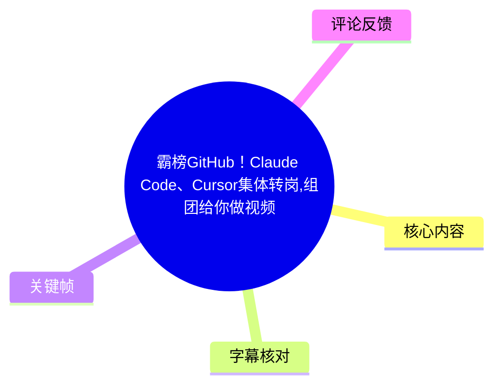
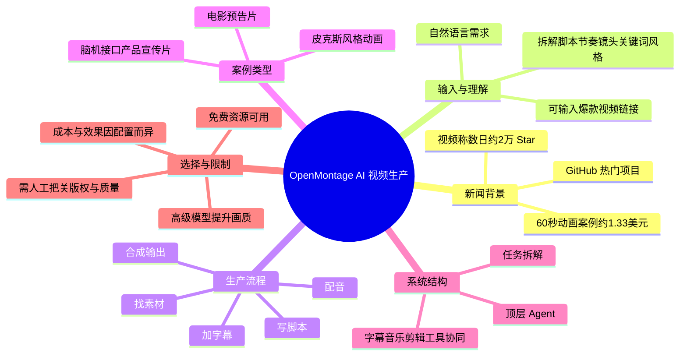

# 霸榜GitHub！Claude Code、Cursor集体转岗,组团给你做视频

> 来源：[Bilibili 视频](https://www.bilibili.com/video/BV1dK756jEfz) 
> UP 主：量子位Daily｜视频时长：01:21｜合集：AIcode  
> 素材抓取时间：2026-07-13。视频所述 GitHub 排名、星标数与价格均应视为发布时附近的快照信息。

## 小结

视频介绍了开源 AI 视频剪辑项目 **OpenMontage**。据视频描述，该项目曾持续位列 GitHub 热门榜首，在数日内获得约 **2 万 Star**；其目标不是只生成一个片段，而是将“理解需求—写脚本—找素材—配音—字幕—合成”串成一条自动化视频生产链路。

视频将 Claude Code、Cursor 等 AI 编程工具定位为可被调用的执行入口：用户以自然语言提出需求后，系统可调度相关工具完成脚本、素材与剪辑工作。这里“Claude Code、Cursor 集体转岗”是标题的拟人化表达，不应理解为这些产品本身已原生变成独立的视频制作平台。

演示案例包括：约 60 秒、带完整剧情与动态字幕的“皮克斯风格”动画；带照片分镜与配乐的电影预告片；以及脑机接口产品宣传片。关键价格样例为：一条 60 秒动画约 **1.33 美元**。这属于视频展示的个案成本，无法据此推导所有题材、模型或素材授权条件下的实际成本。

工作流的关键能力是对参考视频链接进行拆解：分析脚本、节奏、镜头、关键词和整体风格，再围绕用户主题提出 **3 个不同方向**的创作方案。用户还可以在免费配音、免费素材库、免费视频工具与更高级模型之间取舍，以成本换取画面质量。

视频也给出了系统的抽象架构：最上层 Agent 负责理解需求和拆分任务，底层由字幕、音乐、剪辑等工具协同执行。不过，视频未展示安装命令、仓库地址、具体模型名单、调用次数、版权处理流程或可复现的项目配置；高质量商业成片仍需要人工审核与修改。

## 思维导图

## 目录

- [项目热度与定位](#项目热度与定位)
- [从一句需求到成片的工作流](#从一句需求到成片的工作流)
- [案例、成本与可选资源](#案例成本与可选资源)
- [参考爆款视频的分析与改编](#参考爆款视频的分析与改编)
- [Agent 架构与适用任务](#agent-架构与适用任务)
- [实践步骤与参数边界](#实践步骤与参数边界)
- [结论、限制与时效性](#结论限制与时效性)
- [字幕比对](#字幕比对)
- [评论分析](#评论分析)
- [处理记录](#处理记录)

## 项目热度与定位 [00:00](https://www.bilibili.com/video/BV1dK756jEfz?t=0)

视频开篇将 OpenMontage 定义为 AI 视频剪辑项目，并称其“持续霸榜第一”、短短数日获得约 2 万 Star。视频简介也重复了这一说法：“Github持续霸榜第一的，是一个AI视频剪辑项目OpenMontage，短短几天狂揽2万星标”。

需要区分三层信息：

1. **视频陈述**：OpenMontage 在视频制作/发布附近处于 GitHub 热门位置，获得约 2 万 Star。
2. **可随时间变化的信息**：GitHub 排名和 Star 数是动态指标；截至素材抓取时未提供仓库页面快照，因此不能将其视为当前实时数据。
3. **视频的产品主张**：项目通过 Agent 和工具编排，把多个视频制作环节连接起来，降低从创意到初版成片的操作门槛。

标题中的“Claude Code、Cursor 集体转岗”强调的是 AI 编程代理的通用执行能力可被迁移到视频生产工作流，而不是对 Claude Code 或 Cursor 官方功能边界的技术说明。

## 从一句需求到成片的工作流 [00:08](https://www.bilibili.com/video/BV1dK756jEfz?t=8)

按视频口述，用户只需向 Claude Code、Cursor 等 AI 编程工具表达需求，系统随后可调用工具完成以下链路：

1. **理解创作需求**：解析题材、目标、风格或参考内容。
2. **撰写脚本**：将需求转为可叙述的文本与结构。
3. **寻找素材**：匹配可用的图像、视频等内容素材。
4. **生成或配置配音**：为脚本配上语音内容。
5. **添加字幕**：生成并叠加字幕，视频特别提到可制作“抖音风格”的动态字幕。
6. **合成成片**：将画面、声音、字幕和音乐等元素组合输出。

这是一种“多步骤编排”而非单模型直接生成视频的思路：Agent 负责决定下一步要做什么，具体执行则依赖不同工具。视频没有给出每一步所用的具体 API、模型、素材站点或剪辑引擎，因而以上应理解为功能流程，不能直接还原为可执行部署方案。

## 案例、成本与可选资源 [00:19](https://www.bilibili.com/video/BV1dK756jEfz?t=19)

视频通过多种成片形式说明其覆盖范围。

### 60 秒动画与 1.33 美元个案 [00:20](https://www.bilibili.com/video/BV1dK756jEfz?t=20)

视频展示了一段“皮克斯风格”动画案例，并称其全程约 60 秒，拥有完整剧情、拟人化角色和动态字幕。画面中的香蕉角色及左上角文字进一步对应了成本信息：**“标题：最后的香蕉；成本：1.33 美元”**。

> 图：关键帧展示拟人化香蕉动画，并在左上角明确标出“成本：1.33美元”。它是理解视频成本主张最直接的视觉证据；但该数字仅对应画面所示案例，不能泛化为所有 60 秒视频的固定报价。

视频提到“皮克斯风格”时是在描述视觉观感或案例定位。实际制作中应避免直接复制受版权保护作品的具体角色、素材、镜头设计或可识别的商业标识。

### 电影预告片与产品宣传片 [00:34](https://www.bilibili.com/video/BV1dK756jEfz?t=34)

视频还提到两类案例：

- **创办/创作电影预告片**：具备照片分镜、配乐，整体呈现出电影预告的节奏感；
- **脑机接口产品宣传片**：可以把数据自动转成更直观的视觉表达。

这些例子说明视频把应用范围从故事型短片扩展到品牌传播与科普表达。需要注意的是，视频没有给出脑机接口数据的格式、数据可视化规则、事实核验机制或医疗合规说明；涉及科学、医疗或产品指标时，素材本身不能替代原始数据与人工审校。

### 免费资源与高级模型的取舍 [00:54](https://www.bilibili.com/video/BV1dK756jEfz?t=54)

视频称，不花钱也可以使用免费配音、免费素材库和免费视频工具；如接入高级模型，画面质感还可进一步提高。

> 图：关键帧左上角标注“标题：凌晨四点的城市；成本：0”，底部字幕为“不花钱也能用免费配音”。它说明视频明确强调零成本路径，但并未证明免费方案在所有地区、所有素材授权或所有生成次数下均可长期使用。

这里的实际决策不应只看“免费/付费”：

| 选择项 | 视频给出的信息 | 应额外确认的事项 |
| --- | --- | --- |
| 免费配音 | 可作为零成本工作流的一部分 | 商用授权、音色稳定性、字词发音与情绪控制 |
| 免费素材库 | 可降低素材获取成本 | 素材署名要求、地域限制、二次分发和商业授权 |
| 免费视频工具 | 可完成部分制作工作 | 输出水印、分辨率、时长、并发与导出限制 |
| 高级模型 | 可提升画面质感 | 单次成本、生成失败重试成本、人物/镜头一致性 |

## 参考爆款视频的分析与改编 [00:41](https://www.bilibili.com/video/BV1dK756jEfz?t=41)

视频提出一种参考驱动的创作方式：直接向系统提供爆款视频链接，系统会分析其：

- 脚本；
- 节奏；
- 镜头；
- 关键词；
- 整体风格。

随后，系统会围绕用户主题提供 **3 个不同方向**的创作方案。这里的“不同方向”是视频明确给出的数量参数；视频未说明这三个方案分别如何命名、是否可配置数量，或是否会给出逐镜头分镜表。

可将其整理为一套审慎的实践流程：

1. 选择可合法访问、适合分析的参考视频链接。
2. 明确自己的主题、受众、视频时长与发布平台。
3. 让系统抽取叙事结构与节奏特征，而不是要求复制原片。
4. 比较 3 个候选方向，人工选定一个。
5. 在脚本、素材来源、关键论断和品牌表达上人工复核。
6. 输出前检查字幕错字、配音断句、镜头跳变、音乐版权与事实准确性。

“分析风格”不等于可以直接搬运原视频。尤其是爆款视频的原始画面、音乐、台词、品牌元素和独特表达，可能受到著作权或平台规则约束。

## Agent 架构与适用任务 [01:04](https://www.bilibili.com/video/BV1dK756jEfz?t=64)

视频以简化方式介绍项目结构：**最上层的 Agent 负责理解需求与拆解任务；字幕、音乐和剪辑工具等组件在下层协同运行。**

> 图：关键帧以车载屏幕播放地球画面，字幕为“从科普解说 播客视频化”。它补充了视频所述的应用场景：除短剧和预告片外，项目还面向解说与播客的视觉化改编。

结合视频陈述，可归纳其覆盖的任务类型为：

- 车部/局部解说（ASR 原文该处识别不清，无法确认准确用词）；
- 播客视频化；
- 视频切片；
- 电影预告片；
- 科普与产品宣传类视频。

其中“视频切片”通常意味着从长内容中提取短内容，但视频没有提供自动挑选片段的评价指标、切片长度、竖横屏适配规则或平台发布策略。因此，不能将其理解为已验证的全自动爆款生产方案。

## 实践步骤与参数边界 [01:10](https://www.bilibili.com/video/BV1dK756jEfz?t=70)

视频没有演示具体界面、命令行或仓库部署过程，但依据其明确描述，可形成以下不超出素材范围的操作清单。

### 可从视频中确认的输入

| 输入项 | 用途 | 视频是否给出细节 |
| --- | --- | --- |
| 自然语言需求 | 让 Agent 理解创作目标 | 给出概念，未给 Prompt 模板 |
| 爆款视频链接 | 分析脚本、节奏、镜头、关键词与风格 | 给出能力描述，未说明支持的平台与链接格式 |
| 用户主题 | 用于生成 3 个创作方向 | 未说明主题字段、长度限制或语言限制 |
| 资源与模型选择 | 在免费资源和高级模型之间切换 | 未提供可选模型及定价表 |

### 建议的人工质检节点

这些节点是基于视频工作流得出的审校建议，不是视频展示的自动功能：

1. **脚本确认**：核查事实、逻辑、敏感表述和品牌信息。
2. **素材确认**：核查素材来源、肖像权、商用许可与版权。
3. **配音确认**：检查专名、数字、断句、语速和情感是否正确。
4. **字幕确认**：检查识别错误、遮挡、阅读速度和时间对齐。
5. **最终成片确认**：检查音画同步、镜头连续性、配乐音量与平台规格。

### 视频已给出与未给出的关键参数

| 项目 | 状态 | 内容 |
| --- | --- | --- |
| 动画案例时长 | 已给出 | 约 60 秒 |
| 动画案例成本 | 已给出 | 1.33 美元 |
| 免费案例成本 | 画面给出 | “凌晨四点的城市”，成本 0 |
| 创作方案数量 | 已给出 | 3 个不同方向 |
| GitHub Star | 已给出但具时效性 | 数日约 2 万 |
| 排名 | 已给出但具时效性 | 视频称“持续霸榜第一” |
| 生成模型、API 与版本 | 未给出 | 无法据此部署或复现 |
| 视频分辨率、帧率、码率 | 未给出 | 无法比较输出规格 |
| 实际耗时与并发能力 | 未给出 | 无法评估生产吞吐量 |
| 素材/音乐版权方案 | 未给出 | 上线前必须自行确认 |

## 结论、限制与时效性 [01:15](https://www.bilibili.com/video/BV1dK756jEfz?t=75)

OpenMontage 在视频中的核心价值，是将分散的 AI 视频制作环节交给一个由 Agent 驱动的工作流协调：从需求理解、脚本和素材，到配音、字幕与合成，都可被组织在同一条链路中。它尤其适合需要快速制作初版的短视频创作者、播客视觉化制作者、科普内容团队及产品宣传人员。

但本视频是 81 秒新闻式介绍，而不是完整教程。它证明了项目所展示的方向和若干案例，未证明在复杂商业生产中可稳定、低成本、完全自动地替代人工。付费模型调用、素材许可、生成失败重试、风格一致性和事实准确性都可能显著改变最终成本。

以下信息具有明显时效性，使用前应到项目官方仓库、模型服务页和素材平台重新核验：

- GitHub 排名与 Star 数；
- 免费额度、付费价格与模型可用性；
- Claude Code、Cursor 或其他工具的接入方式；
- 项目是否仍可用、版本是否更新；
- 平台对 AI 生成内容、音乐和转载素材的政策。

## 字幕比对

本次已执行 ASR。素材中**未提供可用的 Bilibili 站内字幕**，因此无法进行逐句对齐，只能将 ASR 与视频简介、标题及关键帧文字进行交叉校正。

| 字幕来源 | 完整性 | 专有名词 | 时间轴 | 主要问题 |
| --- | --- | --- | --- | --- |
| Bilibili 站内字幕 | 不可用 | 无法评估 | 无法评估 | 素材明确标注“未提供可用站内字幕” |
| 本次 ASR 字幕 | 覆盖了主要叙述链路 | 存在明显误识别 | 未提供逐句时间戳 | 多处同音替换、断句异常，部分工具名与任务名不可靠 |

最终采用策略为：以 **本次 ASR** 还原叙事顺序，以视频标题、简介和关键帧进行有限校正；无法由素材确认的词语保留不确定性，不将其补写为确定事实。

重要校正与处理如下：

| ASR 表述 | 正文处理 | 依据 |
| --- | --- | --- |
| “Jtub持续霸王第一” | 写作“视频称 GitHub 持续霸榜第一” | 视频简介明确写有 Github 与“持续霸榜第一” |
| “两万信标” | 校正为“约 2 万 Star” | 视频简介写有“2万星标” |
| “超超透的等AI编程工具” | 不采用该错误转写；正文依据标题写“Claude Code、Cursor 等” | 视频标题 |
| “皮特斯风格” | 校正为“皮克斯风格” | 视频画面与上下文；仅作案例风格描述 |
| “韵径，勇敢起課” | 不写入具体剧情细节 | ASR 无法可靠辨认，关键帧不足以确认 |
| “创办电影预照片” | 谨慎写作“电影预告片案例” | 上下文可辨为预告片，但前置修饰词不确定 |
| “车部解说” | 标注为 ASR 识别不清，不扩展解释 | 无站内字幕或其他素材可校正 |

## 评论分析

以下仅处理可获取的热评前三条。评论反映用户感受或诉求，不构成对项目能力、成本或可用性的验证。

1. **youngboyvip（5 赞）：“token粉碎机”**  
   - 观点：担忧此类长链路 Agent 工作流会消耗大量 token，从而导致较高的模型调用成本。  
   - 价值：补充了视频“低成本/免费资源”叙事之外的成本风险。视频仅展示了 1.33 美元和 0 成本个案，未给出复杂任务的 token 用量。  
   - 可信度边界：评论没有提供模型、任务长度、调用日志或账单，不能据此量化实际成本。

2. **Ai_随风（1 赞）：“地址呢”**  
   - 观点：用户希望获得项目地址或使用入口。  
   - 价值：说明视频本身没有在所给素材中呈现可直接访问的仓库链接或部署地址。  
   - 可信度边界：该评论不是项目链接，也没有提供具体资源，不能替代官方渠道。

3. **白星Float（1 赞）：“如果你要求高的话就不能完全啥都指望ai做……但确实能省一部分力”**  
   - 观点：AI 不能完全取代人工；质量要求较高时，仍需人工完成一部分工作，但可节省部分人力。  
   - 价值：与视频展示的自动化链路形成现实补充，尤其适用于脚本事实、素材版权、配音、字幕和最终剪辑质检。  
   - 可信度边界：这是经验性判断，未给出具体项目测试结果；但其风险提示与视频未展示的人工质检环节相一致。

## 处理记录

- Worker ID：worker-mrj0wbly-5dc4e50c
- 模型：gpt-5.6-terra
- 调用工具与素材：基于任务提供的元数据、视频简介、ASR 字幕文本、关键帧文件清单、关键帧画面及热评 JSON 进行整理；未获得可用站内字幕或项目仓库页面。
- 字幕选择：已执行本次 ASR；因 Bilibili 站内字幕不可用，正文以 ASR 为主要叙事来源，并以标题、简介与关键帧文字校正明显专名错误。无法确认处明确保留不确定性。
- 关键帧选择依据：
  - `frames/frame-001.jpg`：展示“最后的香蕉”动画与“成本：1.33美元”，用于支撑 60 秒动画成本个案；
  - `frames/frame-002.jpg`：展示“凌晨四点的城市，成本：0”及“免费配音”字幕，用于说明免费资源主张；
  - `frames/frame-003.jpg`：展示“从科普解说 播客视频化”字幕，用于说明适用场景。
- 缓存清理：提供的素材清单未包含缓存目录、清理命令或清理结果日志；无法验证缓存是否已清理，未将其表述为已完成。
- 未解决问题：未提供 OpenMontage 官方仓库链接、安装方式、模型/API 配置、输出参数、版权机制与完整时间戳字幕；GitHub 排名、Star 数、价格及免费额度均需以使用时的官方页面为准。
