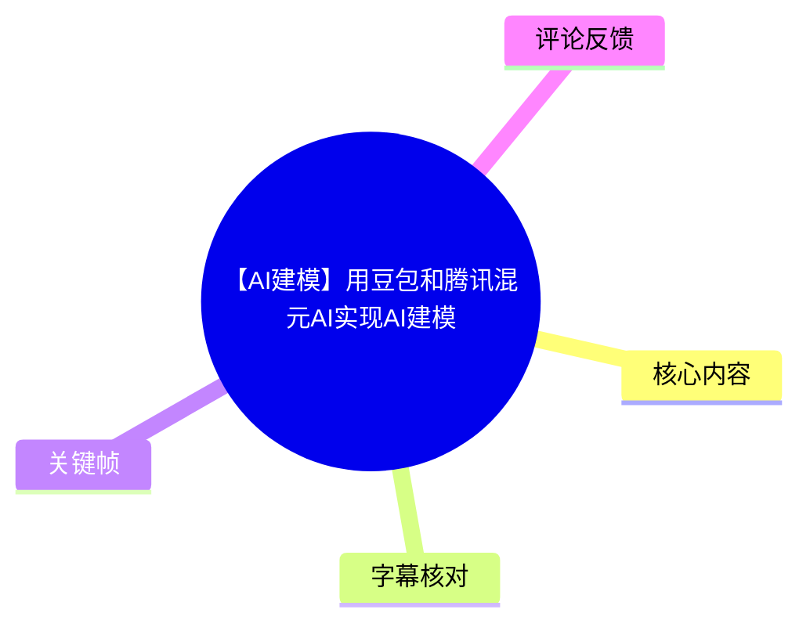
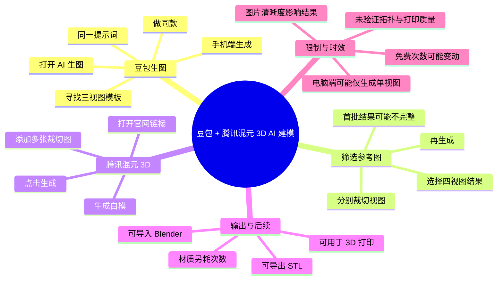
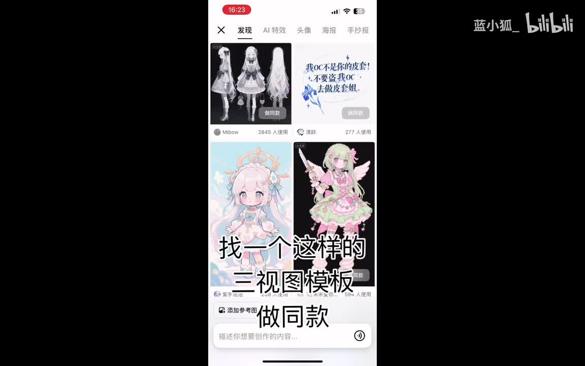
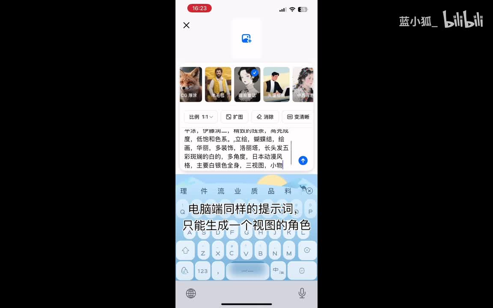
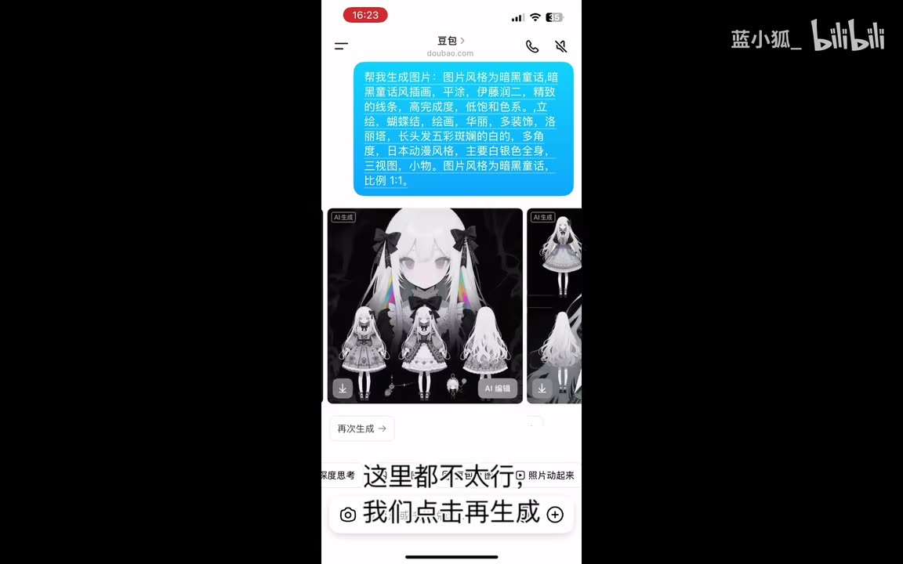
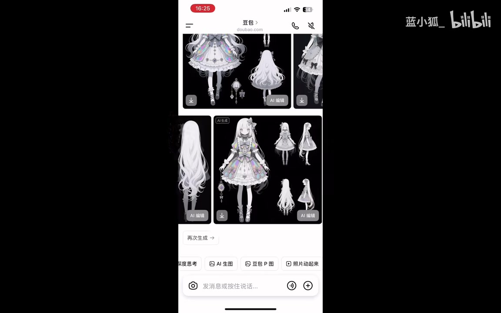

## 小结

- 本视频演示一条面向角色原型的 AI 建模流程：先用**豆包 AI 生图**生成包含多个角色角度的参考图，再把裁切后的多张视图上传至**腾讯混元 3D**生成三维模型，最后可导入 Blender 或导出 STL 用于 3D 打印。
- 流程的关键不在于单次生成角色图，而在于获得可供三维重建使用的**多视图图像**。UP 主建议在豆包中寻找三视图风格模板并“做同款”，在首轮结果不完整时反复“再生成”筛选。
- 视频案例中，UP 主认为电脑端使用相同提示词时只能生成单视图角色，因此改用手机端生成；其最终选择了一张包含**四个视图**的角色图，并将各个视图分别截取。
- 腾讯混元 3D 的本次生成结果为**白模**。UP 主称生成材质需要另外消耗生成次数，并认为本例白模精度“还是可以的”；材质效果不好，可能与输入图片较模糊有关。
- 视频最后提到：腾讯 AI 建模在录制时“每天都有免费的生成次数”、模型可导入 Blender、可导出 **STL** 文件进行 3D 打印。这些均属于视频发布时的经验或平台状态，当前功能、配额和规则应以官网实际页面为准。
- 本方法适合快速制作角色概念原型、Blender 二次编辑的起始网格或打印前的基础模型。视频未展示拓扑、UV、尺寸、网格封闭性、打印切片和商业授权，因此不能据此认定模型可直接用于生产级资产或直接打印。

## 思维导图

## 目录

- [背景、目标与时效性](#背景目标与时效性)
- [在豆包中生成角色多视图参考](#在豆包中生成角色多视图参考)
- [筛选并裁切可用视图](#筛选并裁切可用视图)
- [上传腾讯混元 3D 并生成模型](#上传腾讯混元-3d-并生成模型)
- [结果、材质、Blender 与 STL 输出](#结果材质blender-与-stl-输出)
- [可复现操作清单与限制](#可复现操作清单与限制)
- [字幕比对](#字幕比对)
- [评论分析](#评论分析)
- [处理记录](#处理记录)

## 背景、目标与时效性

### 工作流定位 [00:00](https://www.bilibili.com/video/BV19EuAzgEQY?t=0)

视频标题为“【AI建模】用豆包和腾讯混元AI实现AI建模”，发布于 **2025-07-13**，时长约 **01:58**。这是一段实操型教程，不是独立新闻报道。

UP 主将两个工具串联：

1. **豆包 AI 生图**：获得角色的多视图图像；
2. **腾讯混元 3D**：根据裁切后的多张角色视图生成三维模型。

视频简介提供的腾讯混元 3D 链接为：

<https://3d.hunyuan.tencent.com/>

该流程解决的是“从二维角色设定到三维原型”的快速转化问题。它并未展示完整的专业建模生产管线：素材中没有网格面数、拓扑规范、UV、贴图分辨率、骨骼绑定、模型尺寸、输出精度、授权范围或打印机参数等信息。

### 时效性说明 [00:40](https://www.bilibili.com/video/BV19EuAzgEQY?t=40)

UP 主提到“每天都有免费的生成次数”，且称材质生成会额外消耗次数。这些是录制时的工具状态描述，不应视为当前持续有效的平台政策。腾讯混元 3D 的免费额度、素材上传限制、导出格式、材质功能和计费规则均可能更新，应在实际使用前核对官网界面与服务条款。

## 在豆包中生成角色多视图参考

### 打开 AI 生图，借助三视图模板 [00:00](https://www.bilibili.com/video/BV19EuAzgEQY?t=0)

视频开头给出的操作顺序是：

1. 打开豆包；
2. 点击“AI 生图”；
3. 找一个类似角色三视图的模板；
4. 使用“做同款”。

这里的经验重点是借助已有模板的构图来约束生图结果，而不是完全从空白提示词开始生成。UP 主需要的是可呈现不同角度的角色设定图，为后续三维生成提供更多外观信息。

> 图：画面显示豆包“发现”页中的角色图模板，视频字幕写有“找一个这样的三视图模板”“做同款”。该关键帧说明流程的起点是选择已有多视图构图模板，以提高输出多角度角色图的机会。

### 手机端生成与 1:1 比例 [00:07](https://www.bilibili.com/video/BV19EuAzgEQY?t=7)

UP 主说明使用**手机版**生成图片，并称“主要还是这个做同款电脑端，同样的提示词只能生成一个视图的角色”。

这是一项视频中的具体经验，而不是对豆包所有版本和所有提示词的普遍结论。视频画面能够确认：

- 生图界面显示比例为 **1:1**；
- 输入框中使用了较长的角色描述；
- 提示词中可见与“三视图”“多角度”等目标相关的描述；
- 视频未以清晰、完整、可复制的文本形式给出全部提示词。

因此，不能根据画面模糊文字补写完整提示词。可确认的操作原则是：通过模板与提示词引导角色多角度呈现，并以手机端作为视频案例中的生成入口。

> 图：该帧展示手机端的豆包生图界面，可见“比例 1:1”设置、提示词输入区域和生成相关选项。它为“视频在手机端尝试多视图角色生成”的描述提供画面依据。

### 首轮结果不合格时再次生成 [00:18](https://www.bilibili.com/video/BV19EuAzgEQY?t=18)

生成完成后，UP 主没有直接使用第一批结果，而是评价“这里都不太行”，随后点击“再生成”。

这一步体现出视频中的实际工作方法：

- 多视图角色图并非每次都能稳定生成；
- 即使图中出现多个角色，也可能缺少必要角度，或者不同角度间的角色设计不够一致；
- “生成—人工检查—再生成—筛选”是该工作流的一部分。

> 图：画面中可见首轮生成的角色图结果及“再次生成”入口，字幕对应“这里都不太行，我们点击再生成”。该帧的价值在于说明视频没有将首次输出视为必然可用的三维建模输入。

## 筛选并裁切可用视图

### 以视图覆盖度作为筛选标准 [00:33](https://www.bilibili.com/video/BV19EuAzgEQY?t=33)

再次生成后，UP 主选中一张候选图并表示：“这张图片就很好，四个视图都有。”

这里的“好”主要指角色多角度信息比较完整，而非单纯画面风格更美观。对于后续三维重建，正面、侧面、背面等不同视角可降低模型对不可见部分的猜测程度。

但视频没有验证这些视图是否严格遵守正交设定图标准，也没有检查以下问题：

- 不同视角的服装、配饰和发型是否完全一致；
- 人物姿势是否统一；
- 图像是否具有精确比例关系；
- 各视图是否为标准正面、侧面、背面；
- 局部结构是否被遮挡。

因此，“四个视图都有”是本视频的实用筛选标准，不等于专业角色三视图的完整技术规范。

> 图：该帧展示 UP 主最终认可的候选图，人物在同一画面中呈现多个角度。它直接支撑“选择四个视图都有的图片”这一视频原话，也是后续多图上传的视觉来源。

### 保存图片并分别截取 [00:39](https://www.bilibili.com/video/BV19EuAzgEQY?t=39)

UP 主接下来的操作是：

1. 保存生成图片；
2. 将每个视图分别截下来；
3. 表示自己已经完成视图裁切。

这意味着视频并不建议直接把一张拼合了多个小角色的图片作为唯一输入，而是将不同角度分别处理为独立图片，再交给腾讯混元 3D。

视频未展示或说明以下裁切参数：

| 项目 | 素材是否提供 |
| --- | --- |
| 使用何种裁切软件 | 未提供 |
| 单张图片像素尺寸 | 未提供 |
| 图片格式与文件大小 | 未提供 |
| 是否移除背景 | 未提供 |
| 每张图中角色所占比例 | 未提供 |
| 各图的命名方式 | 未提供 |
| 是否需要统一朝向 | 未明确说明 |

因此，实际操作时只能确认“分别截取各视图”这一原则，不能将未展示的图片规格当作视频结论。

## 上传腾讯混元 3D 并生成模型

### 打开腾讯混元 3D 链接 [00:44](https://www.bilibili.com/video/BV19EuAzgEQY?t=44)

UP 主指引打开“腾讯混元 3D”链接，并说明会放在视频简介中。视频简介确实提供了：

<https://3d.hunyuan.tencent.com/>

站内字幕在此处误写为“腾讯会员3D”，但结合视频标题中的“腾讯混元AI”、ASR 的近音识别“腾讯混源3D”以及官方网址域名 `hunyuan.tencent.com`，本文统一校正为**腾讯混元 3D**。

### 添加裁切后的多张视图图片 [00:49](https://www.bilibili.com/video/BV19EuAzgEQY?t=49)

站内字幕随后写作“剪辑多张图片，然后添加刚刚剪好的视图图片”。结合前文“每个视图都截下来”，可确认 UP 主的意图是：在腾讯混元 3D 中添加多张已经裁切完成的角色视图图片。

不过，素材不足以确认“剪辑多张图片”是否为网站界面上的精确按钮名称，因此本文不将其作为确定的 UI 控件名称，只保留可验证的操作含义：**上传多张已裁切的角色视图图。**

### 发起生成 [01:16](https://www.bilibili.com/video/BV19EuAzgEQY?t=76)

完成图片添加后，UP 主说明“然后点击生成即可”。

视频未给出以下参数或限制：

- 一次可上传的图片数量；
- 图片尺寸、格式与体积限制；
- 上传图片是否需要固定顺序；
- 生成时长；
- 是否提供模型类别、提示词或细节强度等高级参数；
- 失败重试方式；
- 不同生成模式的差异。

因此，视频可复现的最小步骤是：将分别裁切的多张角色视图添加至腾讯混元 3D，然后点击生成。

## 结果、材质、Blender 与 STL 输出

### 生成结果为白模 [01:22](https://www.bilibili.com/video/BV19EuAzgEQY?t=82)

UP 主表示模型“已经生成好了”，并说明生成后的结果是**白模材质**。

“白模”在此处应理解为视频中展示或口述的初步三维模型状态。视频没有提供网格拓扑、面数、法线、UV、贴图通道、封闭性或尺寸信息，不能由“白模”进一步推断其为动画级、游戏级或打印级模型。

### 材质生成需要额外消耗次数 [01:27](https://www.bilibili.com/video/BV19EuAzgEQY?t=87)

UP 主称，如需生成材质，需要“另外消耗次数生成”。

这是视频中关于使用成本的唯一明确信息，但未说明：

- 材质生成具体消耗多少次；
- 白模与材质生成的免费次数分别是多少；
- 是否可使用付费额度；
- 生成材质是否会改变模型结构；
- 是否支持人工编辑材质。

因此，只能确认：在视频录制时，材质生成并非无需额外次数的默认结果。

### 模型精度与输入清晰度的案例评价 [01:29](https://www.bilibili.com/video/BV19EuAzgEQY?t=89)

UP 主认为“模型精度还是可以的”。这属于对本次生成样本的主观评价。

对于材质，UP 主表示效果不好，并推测可能是“我的图片比较糊”。据此可以提炼出一个谨慎的经验：输入图越清晰、角色轮廓越明确、各视角造型越一致，通常越有利于后续模型或材质生成的辨识。

但视频未进行不同清晰度输入图的对照实验，因此不能断言“图片模糊”是材质效果不佳的唯一原因。

### Blender 导入与 STL 导出 [01:44](https://www.bilibili.com/video/BV19EuAzgEQY?t=104)

视频最后说明：

- 腾讯 AI 建模在录制时每天有免费生成次数；
- 导入 **Blender** 没有问题；
- 可导出 **STL** 文件进行 3D 打印。

其中，Blender 与 STL 是 UP 主明确提及的后续路径；但视频没有展示实际的导入过程、导出菜单或打印操作。

若用于 3D 打印，以下检查属于合理的后续操作，但**并非视频展示的步骤**：

- 检查模型是否封闭；
- 检查是否存在非流形几何；
- 检查薄壁、悬空部分和细小配件；
- 在切片软件中核对尺寸与单位；
- 根据打印机和材料设置支撑、层高与填充。

## 可复现操作清单与限制

### 按视频顺序整理的操作清单 [00:00](https://www.bilibili.com/video/BV19EuAzgEQY?t=0)

1. 打开豆包。
2. 进入“AI 生图”。
3. 找一个角色三视图风格的模板。
4. 点击“做同款”。
5. 在手机端生成角色图；视频画面显示比例为 **1:1**。
6. 使用同一提示词尝试获得多视图角色图。
7. 如果首轮结果不完整，点击“再生成”。
8. 选择一个多角度信息较完整的结果；视频案例选择了含**四个视图**的图片。
9. 保存该图片。
10. 将每一个角色视图分别截取为独立图片。
11. 打开腾讯混元 3D：<https://3d.hunyuan.tencent.com/>。
12. 添加已经裁切好的多张视图图片。
13. 点击生成，获得初步三维白模。
14. 如需材质，使用平台提供的材质生成能力；UP 主称这会额外消耗次数。
15. 需要继续编辑时，将模型导入 Blender。
16. 需要打印时，导出 STL 文件，并自行完成打印前检查。

### 视频揭示的限制 [00:07](https://www.bilibili.com/video/BV19EuAzgEQY?t=7)

| 环节 | 视频中的信息 | 实际影响 |
| --- | --- | --- |
| 豆包生成端 | 同样提示词在电脑端只能生成一个视图角色 | 视频改用手机端尝试多视图生成 |
| 生图稳定性 | 首轮结果“不太行” | 需要多次生成与人工筛选 |
| 多视图标准 | 视频以“四个视图都有”作为可用依据 | 未验证严格的比例、姿势与结构一致性 |
| 图像处理 | 每个视图都需要单独截取 | 裁切质量可能影响后续输入，但视频未给规格 |
| 三维生成 | 初始结果是白模 | 不能默认模型已带完整材质或生产级拓扑 |
| 材质 | 需要另消耗次数；本例效果不好 | 成本和输入图质量需纳入评估 |
| 免费额度 | 视频称每天有免费次数 | 强时效信息，当前状态可能不同 |
| Blender / STL | 视频仅口述兼容与导出 | 仍需自行验证文件、比例、网格与打印可行性 |

## 字幕比对

### 检查结论 [00:00](https://www.bilibili.com/video/BV19EuAzgEQY?t=0)

本次素材存在音轨。本次 ASR 的识别语言为中文，语言置信度约为 `0.9990`，音频时长约为 `117.45` 秒；ASR 结果中**未标记** `noAudioStream=true`。

因此，本视频不是无音轨视频。ASR 的空档只能说明该段未被本次 ASR 有效识别或未形成语音分段，不能解释为源视频没有音频。

| 字幕来源 | 完整性 | 专有名词表现 | 时间轴表现 | 主要问题 |
| --- | --- | --- | --- | --- |
| Bilibili 站内字幕 | 较完整，覆盖主要操作与结论 | 存在“腾讯会员3D”“SSTL”等明显错误 | 分段细，适合用于章节定位 | 个别词语有误，00:49 附近的“剪辑多张图片”无法确认是否为准确控件名称 |
| 本次 ASR 字幕 | 识别到约 73.9 秒语音，语音覆盖率约 `62.92%` | “34图”“试图”“腾讯混源”“模型进度”等近音错识别较多 | 有时间戳，但首段合并至 29.76 秒；存在较大空档 | `00:52.56—01:16.43` 约有 23.87 秒未覆盖，且文字错别字较多 |

### 最终字幕采用原则

本文以**站内 SRT**作为主要时间轴依据，原因是其分段更细且覆盖步骤更完整；同时已核查本次 ASR，使用 ASR 作为口播内容交叉验证。

结合视频标题、简介链接、站内字幕、ASR 上下文和关键帧，对重要术语作如下校正：

| 原始文本 | 本文采用表述 | 校正依据 |
| --- | --- | --- |
| “34图”“三四图”“试图” | 三视图、视图 | 属于 ASR 同音或近音错误，站内字幕与视频主题均指向角色多视图 |
| “腾讯会员3D”“腾讯混源3D” | 腾讯混元 3D | 标题含“腾讯混元AI”，简介链接为 `3d.hunyuan.tencent.com` |
| “模型进度” | 模型精度 | 站内字幕表述为“模型精度”，语义与上下文一致 |
| “图片比较活” | 图片比较糊 | 站内字幕为“图片比较糊”，与材质效果评价相符 |
| “SSTL” | STL | ASR 末段明确识别为“stl”，语境为导出文件进行 3D 打印 |

## 评论分析

### 可获取热评范围 [00:00](https://www.bilibili.com/video/BV19EuAzgEQY?t=0)

素材要求仅处理可获取热评前三条；实际提供了 **2 条**热评，没有第 3 条，因此不补造第三条内容。评论仅代表观众个人反馈，不能替代对工具能力、费用、成功率或商业授权的验证。

### 热评 1：三视图生成难度 [00:18](https://www.bilibili.com/video/BV19EuAzgEQY?t=18)

> **海棠爱狸花**｜16 赞  
> “[笑哭]豆包很难生成三视图怎么办”

该评论指出“豆包很难生成三视图”的困难，与视频中首轮结果“不太行”、需要继续“再生成”的过程相呼应。

不过，评论没有提供提示词、设备端、模型版本、生成次数或具体失败样例，不能据此推算豆包生成三视图的实际成功率，也没有给出额外解决方案。

### 热评 2：生成后人工修改的价值 [01:29](https://www.bilibili.com/video/BV19EuAzgEQY?t=89)

> **金锁沙拉蹦**｜15 赞  
> “试了，只能说是强无敌，再自己修改一下直接就能用了，要开始赚钱喽”

该评论给出正向试用体验，并强调“再自己修改一下”，说明评论者并未把 AI 输出视为完全无需处理的最终资产。这与视频呈现的“白模—后续 Blender 使用”路径具有一定一致性。

但“直接就能用了”和“要开始赚钱”均属于个人感受，评论没有说明模型用途、修改工作量、许可状况、商业交付情况或实际收入，因此不能作为商业可行性的证据。

## 处理记录

- **Worker ID**：`worker-mrj0wbly-5dc4e50c`
- **模型**：`gpt-5.6-terra`
- **使用工具与素材**：视频元数据、站内字幕 `p01-ai-zh.srt`、本次 ASR 结果 `asr/asr-result.json`、ASR SRT `asr/transcript.srt`、关键帧目录 `frames/`、热评数据 `comments/comments.json`。
- **ASR 检查**：已检查本次 ASR。识别模型为 `medium`，设备为 CUDA，计算类型为 float16；未标记 `noAudioStream=true`，故确认源视频有音轨。ASR 在 `00:52.56—01:16.43` 存在约 `23.87` 秒的大空档。
- **字幕选择**：以站内 SRT 作为章节时间轴和主要步骤来源；使用本次 ASR 交叉比对口播内容；对“腾讯混元 3D”“三视图”“模型精度”“STL”等错误识别项，结合标题、简介链接、上下文与画面进行校正。
- **关键帧选择依据**：正文选用 `frames/frame-001.jpg`、`frames/frame-002.jpg`、`frames/frame-003.jpg`、`frames/frame-004.jpg`，分别支撑三视图模板入口、手机端生图界面、首轮结果不合格与最终多角度候选图四个关键环节。其余关键帧路径虽在素材清单中列出，但未在所给画面素材中提供可核验内容，故未据此补充未证实信息。
- **评论处理范围**：仅分析了可获取的前两条热评；素材未提供第三条热评。
- **缓存清理**：提供的素材中没有缓存清理执行日志，无法验证是否执行过清理；本文未宣称已完成缓存清理。
- **未解决问题**：当前腾讯混元 3D 的免费额度、材质生成消耗、上传图片数量与格式限制、导出参数、Blender 实际导入细节、网格拓扑与 STL 打印质量，均未在素材中得到完整展示，需要以当前官网和实际测试为准。
