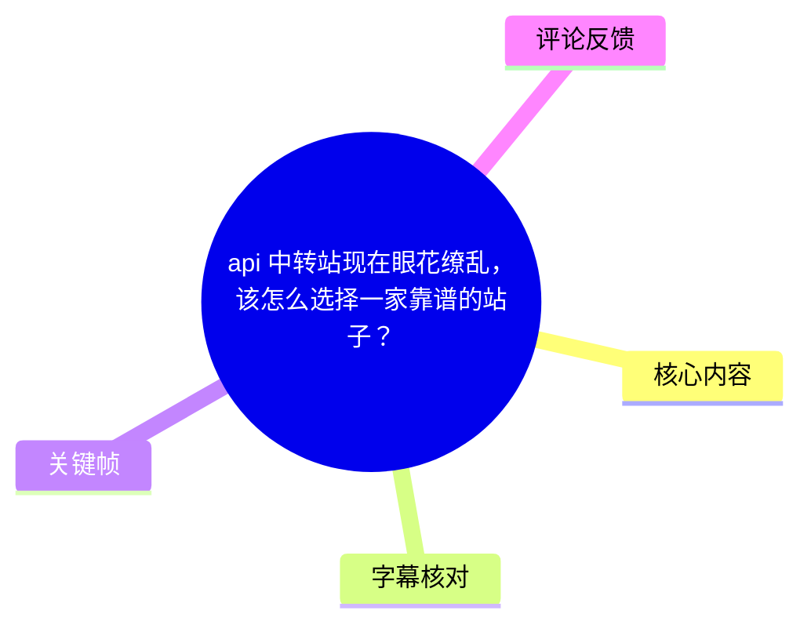
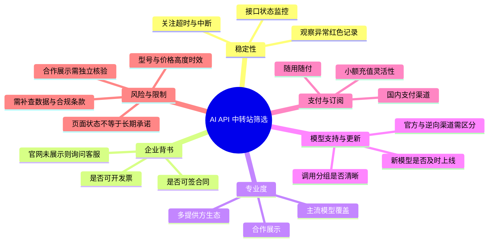
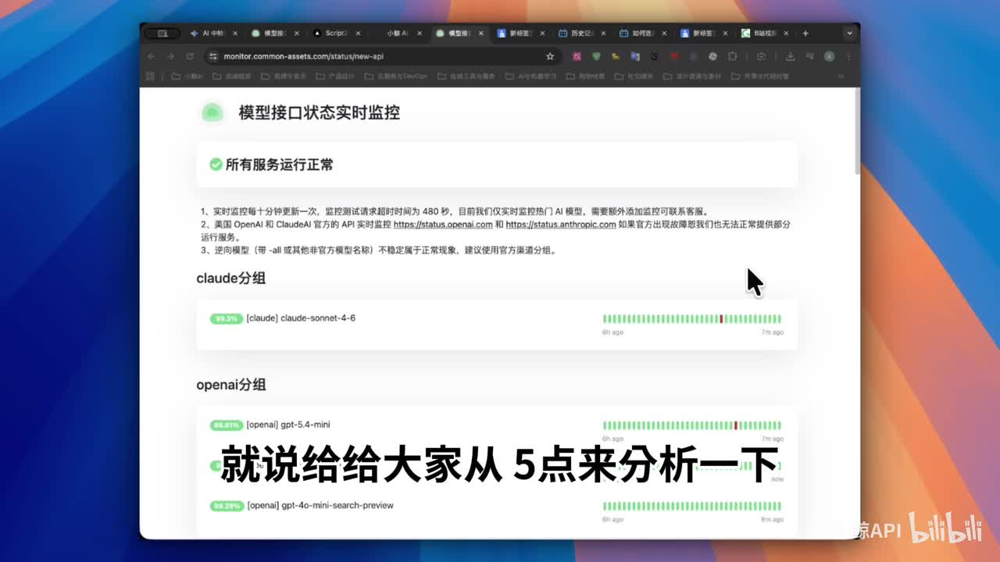
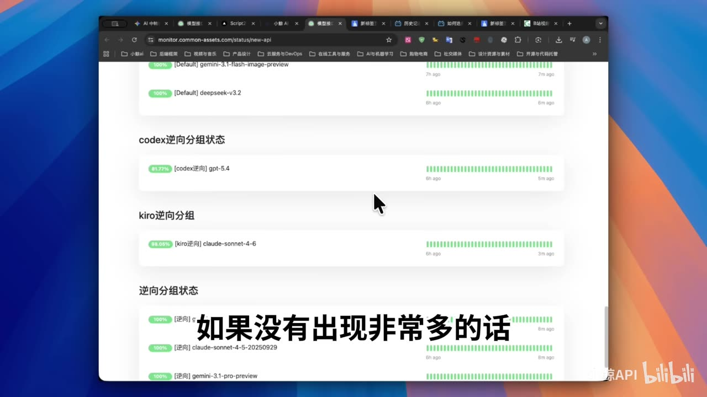
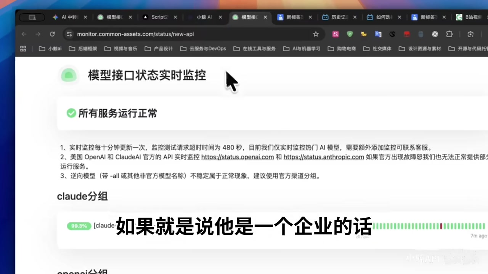

# api 中转站现在眼花缭乱，该怎么选择一家靠谱的站子？

> 来源：[Bilibili 视频](https://www.bilibili.com/video/BV1bCQnBNE3E) 
> UP 主：小鲸API｜视频时长：2 分 49 秒｜分辨率：1728 × 972 
> 标签：Claude、经验分享、API、中转站、Token

## 小结

视频给出了一套筛选 AI API 中转站的五维检查法：**稳定性、企业性质（企业背书）、专业度、模型支持与更新速度、支付/订阅方式**。其核心不是仅比较单价或模型数量，而是从可见运行状态、主体可追责性、模型供给广度和付费灵活性共同判断。

在稳定性上，UP 主建议优先查看平台是否公开“模型接口状态实时监控”，并观察监控记录中异常“红色”是否频繁出现。视频画面中的示例监控页显示“所有服务运行正常”，并按 Claude、OpenAI、Codex 逆向、Kiro 逆向等分组展示可用率和状态条；这只能作为某一时点的页面展示，不等同于长期 SLA 承诺。

在企业背书上，视频把“能否开发票、能否签合同”作为重要核验项；若官网未公开，应向客服询问。需要注意：能开票或可签约可增加主体可识别性，但不能单独证明接口质量、数据安全或资金安全。

关于专业度，视频提出同时看合作展示与模型生态：一方面观察是否展示与国内高校等机构的合作，另一方面确认是否覆盖多家主流模型提供方。UP 主口述列举了 A 社、Google、Meta、月之暗面、OpenAI、xAI，以及字节跳动、快手等。由于站内字幕与 ASR 对部分专名识别有误，文中保留“视频口述/画面可辨”边界，不把模糊识别结果扩展为确定事实。

模型更新维度强调“新模型是否及时上线”及“调用分组是否清晰”。视频以 GPT-5.4、A 社 4.6 和国内某“2.0”模型为例，并主张查看微软、Codex 逆向、OpenAI 官方等分组。此类具体型号、渠道名称和可用性高度时效，且“逆向分组”可能意味着并非官方直连，应额外评估合规性、稳定性、数据处理与账号风险。

最后，UP 主偏好**随用随付**并支持国内支付渠道的平台，认为这样充值更灵活。该建议适合用量波动或先小额试用的个人/小团队；但视频没有提供价格、退款规则、限流策略、隐私政策、服务协议或安全审计证据，实际选择仍应完成独立核验。

## 思维导图

## 目录

- [背景、目标与五维框架](#背景目标与五维框架-0000)
- [第一维：用实时监控判断稳定性](#第一维用实时监控判断稳定性-0020)
- [第二维：核验企业主体与合同发票能力](#第二维核验企业主体与合同发票能力-0044)
- [第三维：从合作展示与模型覆盖看专业度](#第三维从合作展示与模型覆盖看专业度-0102)
- [第四维：检查模型更新与调用分组](#第四维检查模型更新与调用分组-0132)
- [第五维：支付、订阅与充值灵活性](#第五维支付订阅与充值灵活性-0220)
- [可执行筛选流程与检查清单](#可执行筛选流程与检查清单-0020)
- [结论、限制与时效性](#结论限制与时效性-0236)
- [字幕比对](#字幕比对-0000)
- [评论分析](#评论分析-0000)
- [处理记录](#处理记录-0000)

## 背景、目标与五维框架 [00:00](https://www.bilibili.com/video/BV1bCQnBNE3E?t=0)

视频面向需要通过 API 中转站调用大模型的开发者及日常办公用户。UP 主在开场表示自己长期使用“Cloud Code”（站内字幕如此转写；该名称未通过本素材进一步核验），并说明本期目标是从五点分析如何筛选“靠谱的中转站”。

五个维度按视频顺序为：

1. **稳定性**：接口是否稳定，能否支持从早到晚的高强度使用。
2. **企业性质/企业背书**：是否具备开票、签合同等能力。
3. **专业度**：除模型是否支持外，也看合作展示与模型生态。
4. **模型支持及更新速度**：是否及时上线新模型，是否有多种调用分组。
5. **支付方式/订阅方式**：是否支持随用随付及国内支付渠道。

视频标题和简介带有“避坑指南”定位，简介称“选对平台能省下 80% 的烦心事”。这是发布者的宣传性表述，视频中未给出统计口径、样本、计算方法或对照实验，因此不应视为可量化结论。

## 第一维：用实时监控判断稳定性 [00:20](https://www.bilibili.com/video/BV1bCQnBNE3E?t=20)

UP 主建议优先查看平台是否有接口监控页面，并进入页面检查异常状态是否频繁出现。其判断逻辑是：状态记录中红色异常较少，意味着接口更可能保持稳定；在高强度使用时，较不容易出现请求超时或中途断开。

> 图：画面显示“模型接口状态实时监控”及“所有服务运行正常”，并能看到 Claude、OpenAI 等分组状态条。它直观说明视频所说的“先看接口监控”具体看什么；但这是单次页面快照，不能证明长期稳定性。

> 图：画面向下展示 Codex 逆向、Kiro 逆向等分组及以绿色为主的状态记录。该图的价值在于说明检查不应只看首页的“正常”提示，还应查看各分组的历史状态条和异常颜色分布。

画面中还能辨认出以下监控页说明，属于**页面展示内容**而不是独立验证后的事实：

- 监控约每 10 分钟更新一次；
- 监控测试请求的超时时间写为 **480 秒**；
- 页面注明只实时监控热门 AI 模型，额外监控需要联系客服；
- 页面提示美国 OpenAI 和 ClaudeAI 官方 API 的实时监控可参考 `status.openai.com` 与 `status.anthropic.com`；
- 页面提示带有 `-all` 或其他非官方模型名称的“逆向模型”不稳定属于正常现象，并建议使用官方渠道分组。

### 稳定性检查的正确用法

视频重点是观察“红色是否很多”，但实际判断应避免只凭单一截图：

- 查看状态历史的时间跨度；只展示数分钟或数小时不足以反映长期表现。
- 将平台状态页与自己的试调用结合，分别测量首 token 延迟、完整响应时间、超时率、429/5xx 错误率和流式响应中断率。
- 区分不同模型、不同分组、不同地区和不同时间段；一个分组稳定，不代表所有模型均稳定。
- 若页面把某些渠道标注为“逆向”，应明确其是否为官方 API、转售、聚合或其他接入方式；视频本身没有给出这些渠道的具体技术实现。

## 第二维：核验企业主体与合同发票能力 [00:44](https://www.bilibili.com/video/BV1bCQnBNE3E?t=44)

UP 主将“网站的企业背书”列为第二项：如果平台属于企业，通常应能开发票；视频展示的平台被称为支持开发票和签合同。若官网没有写明，UP 主建议直接询问客服。

> 图：画面仍停留在监控页面，字幕叠加“如果就是说他是一个企业的话”。它用于对应视频从稳定性切换到企业性质的论述；画面本身没有展示营业执照、合同或发票样例，因此不能据此确认具体主体资质。

### 可按视频思路核验的事项

1. 在官网、服务条款、隐私政策、付款页面或“关于我们”中查找经营主体名称。
2. 询问是否可开具发票，并确认发票抬头、类目、税率、开票周期与最低开票条件。
3. 询问是否可签订合同，以及合同签约主体是否与收款主体一致。
4. 留存客服答复、报价单和合同文本，避免仅依赖口头承诺。

### 该维度的边界

视频把开票和签合同视为“较稳定”的信号，但二者只能说明部分交易与主体追责条件。它们**不能自动证明**：

- 模型来源为官方；
- API 不会限流、降级或中断；
- 请求内容、密钥和日志具有充分的数据保护；
- 余额一定可退、长期有效或不会因规则变动失效。

因此，企业主体核验应与后续的技术测试、协议审查共同完成。

## 第三维：从合作展示与模型覆盖看专业度 [01:02](https://www.bilibili.com/video/BV1bCQnBNE3E?t=62)

UP 主将“专业度”拆成两部分：

- 不只看模型是否支持，也看平台是否展示与国内知名高校等机构的合作；
- 查看是否支持较多主流模型、覆盖较多模型厂商或生态。

站内字幕在这一段列出的名称为：“A社、DAVSC、谷歌、meta、月之暗面、OpenAI、XAI，然后还有字节跳动快手什么的。”本次 ASR 识别为“A社、DevSec、虎哥、Meta、有月知暗面、OpenAI、有XAI，然后还有自己跳动害手什么的”。两份文字对多个专名都不稳定；其中 Google、Meta、月之暗面、OpenAI、xAI、字节跳动、快手可由站内字幕和语境较明确地对应，其余词不宜擅自补全。

### 视频表达的判断标准

- **合作展示**：UP 主认为有较多高校合作展示，能体现一定专业度。
- **模型广度**：支持多个主流厂商、模型系列的平台，被其评价为更专业。
- **不要只数模型数**：虽然视频没有展开，但其后续“看分组”的论述意味着模型目录之外还要看实际调用渠道和供给结构。

### 需要独立验证的部分

“合作”可能是采购、活动、试用、案例展示、学术项目或其他形式，视频未提供合作名称、合同范围、时间或可核验链接。因此，页面出现高校 Logo 或合作文案不能直接等价于深度技术合作，也不能替代服务质量测试。

同样，模型列表多不必然等于每个模型都稳定可用。至少应进一步确认模型版本、上下文窗口、视觉/工具调用能力、速率限制、计费单位、是否支持流式输出，以及模型名称是否对应官方版本。

## 第四维：检查模型更新与调用分组 [01:32](https://www.bilibili.com/video/BV1bCQnBNE3E?t=92)

UP 主称“模型更新的速度”非常关键，并以 GPT-5.4 是否可用为例，提出进入模型页面查看调用分组，判断是否有官方分组、分组是否丰富。视频口述提到的分组包括：

- 微软分组；
- Codex 逆向分组；
- OpenAI 官方分组；
- OpenAI 的“正价官方分组”（站内字幕转写如此，具体含义未在视频解释）。

UP 主将拥有这些分组的站点称为“比较合格”。随后又提出，在许多平台都支持 GPT-5.4 的情况下，可继续检查“A社的 4.6”是否支持；如果支持，则按其观点也是较稳定的信号，并要查看其分组，尤其提及价格相对较便宜的“逆向”分组。

### 国内模型检查 [02:10](https://www.bilibili.com/video/BV1bCQnBNE3E?t=130)

视频接着建议检查是否支持国内最新模型。站内字幕把相关名称识别为“黑NX”“CDAS2.0”，ASR 则识别为“C9”“C92.0”；两者冲突且均无法从给定关键帧可靠确认，因此本文不对真实模型名称作猜测。能够确认的是：UP 主以一个国内“2.0”版本模型为例，称所展示的平台支持该模型。

### 关于“更新快”和“分组多”的实际含义

视频的可迁移思路是：

1. 选定自己确实需要的最新模型或能力；
2. 检查平台是否已经上架；
3. 查看该模型是否有不同接入分组；
4. 对比不同分组的价格与预期稳定性；
5. 优先理解每个分组的来源、限制与风险，而非只选择最低价。

但必须强调，视频中提到的 **GPT-5.4、A 社 4.6、国内“2.0”模型、各类分组及其价格优势**，均是视频录制时点的展示或口述，无法据此确认当前仍存在、仍可调用或仍以相同价格提供。模型迭代、命名、上架状态、渠道策略和计费都可能快速变化。

## 第五维：支付、订阅与充值灵活性 [02:20](https://www.bilibili.com/video/BV1bCQnBNE3E?t=140)

UP 主将支付方式称为“最后一点，也是最重要的一点”，关注的是支付/订阅模式：

- **随用随付**：UP 主认为这是较优秀的特征；
- **国内支付渠道**：即使支持随用随付，若没有国内支付渠道，UP 主认为该站“不合格”；
- **小额、灵活充值**：结尾以“我充多少钱都可以”概括其偏好。

这一偏好特别适合以下情况：

- 用量尚不确定，希望先小额验证；
- 多模型轮换使用，不希望被固定订阅绑定；
- 个人开发者或小型团队需控制预算与现金流；
- 需要更便利的本地支付方式。

不过，支付便利性与服务可靠性并非同一指标。付费前仍应确认最低充值额、余额有效期、扣费精度、汇率或手续费、退款条件、发票规则、异常扣费处理、账户封禁后的余额处理，以及是否存在模型或分组的额外限制。

## 可执行筛选流程与检查清单 [00:20](https://www.bilibili.com/video/BV1bCQnBNE3E?t=20)

以下流程按视频的五维框架整理，并将视频未覆盖但必要的验证项明确标为补充项。

### 第 1 步：先看状态监控

- [ ] 是否存在可公开访问的模型/API 状态页；
- [ ] 页面是否展示历史状态，而非只显示当前“正常”；
- [ ] 是否存在频繁的红色/异常记录；
- [ ] 是否按模型或渠道分组展示；
- [ ] 是否说明监控频率、超时阈值和监控范围；
- [ ] **补充**：用自己的工作负载完成小额真实测试。

视频展示页面写明监控约每 10 分钟更新一次、测试超时 480 秒。该参数仅说明该页面的监控配置，不是用户请求必然拥有的超时上限，更不是服务性能保证。

### 第 2 步：确认主体与交易凭证

- [ ] 官网是否明确经营主体；
- [ ] 是否支持开票；
- [ ] 是否支持签合同；
- [ ] 官网没有说明时，是否已向客服获取书面确认；
- [ ] **补充**：核对收款主体、合同主体、发票主体是否一致。

### 第 3 步：核对实际需要的模型

- [ ] 是否覆盖自己业务所需的模型厂商和模型能力；
- [ ] 是否明确模型版本；
- [ ] 是否区分官方渠道与非官方/逆向渠道；
- [ ] 是否能看到不同分组；
- [ ] **补充**：确认上下文长度、限流、并发、视觉和工具调用能力。

不要因为“模型多”就立即充值。对于只需一两个模型的用户，优先验证目标模型的质量、稳定性和成本更有效。

### 第 4 步：检查更新与分组说明

- [ ] 最近发布或业务所需的模型是否已上架；
- [ ] 每个分组是否有来源、价格、限流和用途说明；
- [ ] 是否存在“官方”标记；
- [ ] 对“逆向”或非官方分组，是否理解其潜在稳定性、合规和数据风险；
- [ ] **补充**：记录测试日期，避免把历史截图当作当前能力。

### 第 5 步：以最小成本验证支付和计费

- [ ] 是否支持随用随付；
- [ ] 是否有适合自己的国内支付渠道；
- [ ] 是否允许小额充值；
- [ ] 计费页面是否公开清晰；
- [ ] **补充**：先充值可承受的小额金额，核对实际 token 扣费与账单是否一致；
- [ ] **补充**：确认退款、余额有效期及异常争议处理机制。

## 结论、限制与时效性 [02:36](https://www.bilibili.com/video/BV1bCQnBNE3E?t=156)

视频的最终结论是：靠谱的 AI 中转站应当具备**运行稳定、技术专业、企业背书、多模型支持和方便充值**等特征。若将其压缩为一个实用原则，就是：**先用公开状态与小额实测验证可用性，再用主体、模型渠道、条款和付费规则验证可持续性。**

但该视频属于经验型筛选建议，存在以下限制：

1. **示例站点不等于横向评测结果**：视频主要围绕一个展示页面说明方法，没有提供多家平台在相同负载、相同模型、相同周期下的对照数据。
2. **稳定性证据有限**：状态页及绿色状态条只反映页面所展示的监控结果，无法替代 SLA、故障复盘、历史可用率或独立压测。
3. **企业背书不是充分条件**：开票、合同和客服答复能提供交易线索，但不自动保证数据安全、模型来源、退款能力或长期运营。
4. **合作展示需要核验**：高校合作相关表述没有给出可核验的合作细节。
5. **模型与渠道高度时效**：视频提到的版本、分组、价格和国内模型支持状态可能已经变化。元数据显示视频发布时间为 2026-04-15，而素材抓取时间为 2026-07-16；在此期间乃至之后，任何模型目录或价格都可能调整。
6. **未覆盖关键风险项**：视频未详细讨论 API Key 存储、请求日志保留、数据跨境、隐私政策、模型输出合规、限流、余额退款、账户风控和服务终止机制。
7. **“逆向分组”需谨慎**：视频认可其低价价值，但画面中的监控说明同时提示逆向模型不稳定属于正常现象。低价与稳定性、合规性之间可能存在权衡，用户应在发送敏感数据前完成独立评估。

## 字幕比对 [00:00](https://www.bilibili.com/video/BV1bCQnBNE3E?t=0)

| 字幕来源 | 完整性 | 专有名词 | 时间轴 | 主要问题 |
| --- | --- | --- | --- | --- |
| Bilibili 站内字幕 `p01-ai-zh.srt` | 覆盖 00:00.160—02:48.680，接近全片 | 部分可辨，但存在“中档蛋糕底”“DAVSC”“黑NX”“CDAS2.0”等明显误识别 | 分段细，时间连续，可直接用于章节定位 | 口头停顿较多；若干模型名、产品名和“逆向”等词出现错误或不确定转写 |
| 本次 ASR（medium） | 诊断显示语音覆盖 79.43%，识别区间为 00:33.120—02:48.460 | 专名误识别更明显，如“可乐扣”“中短端”“DevSec”“虎哥”“C9”等 | 有时间戳，但首段从 00:33 开始且单段过长 | 前 33 秒未覆盖；长段落合并严重；专名、数字与术语错误较多 |

### 最终字幕选择与校正原则

正文以**Bilibili 站内字幕的分段时间轴**为主要时间依据，因为其覆盖更完整、时间分段更细，且符合“优先依据站内 SRT 起止时间换算秒数”的要求；同时已对本次 ASR 进行了检查和对比。

本次 ASR 的诊断中**未标记 `noAudioStream=true`**：素材存在音频流，且 ASR 识别出 134.06 秒语音。因此，ASR 前 33 秒未识别并非“源视频没有音轨”，而是该次识别结果的覆盖不足。

对文本内容采取如下处理：

- 将两份字幕共同稳定支持的内容整理为正文事实，例如五个筛选维度、监控页、发票/合同、随用随付和国内支付渠道。
- 对站内字幕与 ASR 均不可靠的模型名，保留“视频口述存在不确定性”，不根据相似拼写擅自还原。
- 将关键帧中明确可见的“模型接口状态实时监控”“所有服务运行正常”“claude 分组”“openai 分组”“codex 逆向分组”“kiro 逆向分组”等作为画面校正依据。
- 站内字幕的“中档蛋糕底”等显然应结合视频主题理解为“中转站”；正文统一使用“中转站”，这是由标题、上下文和画面主题共同支持的术语校正。
- 视频中“官方分组”“逆向分组”等表述仅记录为 UP 主的分类描述，不据此确认任何平台的真实上游或授权关系。

## 评论分析 [00:00](https://www.bilibili.com/video/BV1bCQnBNE3E?t=0)

仅获取到热评前三条，评论发布时间戳存在晚于视频抓取时间的情况，以下仅按提供素材原样分析，不以时间先后推断真实性。

1. **粤小七（1 赞）：“试了，确实好用还稳定”**
   - 观点：评论者声称已经试用，并给出“好用、稳定”的正面评价。
   - 补充价值：与视频强调稳定性相呼应，属于单个使用者的体验反馈。
   - 可信度边界：未说明测试的平台、模型、时段、请求量、网络环境或价格，不能视为长期稳定性证据，也不能代表所有模型分组。

2. **Assute（0 赞）：“0.05倍率找下游”**
   - 观点：评论提出“0.05 倍率”与“找下游”的简短建议或质疑。
   - 补充价值：可能指向更低成本的上游/下游渠道比较，提示价格和渠道透明度也值得关注。
   - 可信度边界：表达过于简略，未给出具体对象、倍率计价基准、模型、服务条款或可复现路径，无法据此验证或据此选择服务商。

3. **Z0rin（0 赞）：“看到国内名牌大学合作差点没给我笑喷”**
   - 观点：评论者质疑视频把“国内名牌大学合作”作为专业度或可靠性判断依据。
   - 补充价值：直接指出视频论证中的薄弱环节：合作展示与实际 API 服务质量未必有必然关系。
   - 可信度边界：这是一种态度性评价，未提供反证材料；但其提出的质疑合理地提醒用户，应该核验合作性质与证据，而不是仅凭 Logo 或宣传文案下结论。

## 处理记录 [00:00](https://www.bilibili.com/video/BV1bCQnBNE3E?t=0)

- **Worker ID**：`worker-mrj0wjed-b0c290ad`
- **模型**：`gpt-5.6-terra`
- **素材与工具结果**：
  - 视频元数据、页面信息与统计数据；
  - Bilibili 站内时间轴字幕：`p01-ai-zh.srt`；
  - 本次 ASR：`medium`，语言识别为中文，语言概率 `0.99658203125`，CUDA / float16；
  - ASR 时间轴文本、ASR 分段诊断；
  - 关键帧目录 `frames/`；
  - 热评数据 `comments/comments.json`，限制为前三条。
- **字幕选择**：以站内 SRT 的 00:00.160—02:48.680 分段时间为章节链接依据；ASR 已检查但因首段晚、分段粗和专名错误较多，仅用于交叉验证与识别风险说明。
- **音频判断**：ASR 诊断未出现 `noAudioStream=true`，且有 7 个识别分段、134.06 秒语音覆盖；因此未将 ASR 的前段缺失归因于无音轨。
- **关键帧选择依据**：
  - `frames/frame-001.jpg`：完整展示“模型接口状态实时监控”及 Claude/OpenAI 状态条，直接支撑稳定性检查方法；
  - `frames/frame-003.jpg`：展示 Codex、Kiro 等分组与状态条，用于说明应查看分组和历史异常分布；
  - `frames/frame-004.jpg`：对应企业主体讨论的转场画面，用于说明该段是口述主张而非资质证明。
- **关键帧使用限制**：提供素材未附带每张帧的精确采样时间；正文仅将其用于与对应话题相符的视觉解释，未虚构帧级时间。
- **缓存清理**：未提供可执行的缓存清理日志或结果；本记录不虚构已清理状态。
- **未解决问题**：
  - 视频中部分模型名称和版本在站内字幕与 ASR 中均存在冲突，无法仅凭现有素材可靠还原；
  - 视频展示的平台名称、主体资质、合作关系、模型上游和当前价格未被独立核验；
  - 未提供不同中转站的实际压测数据、SLA、退款政策、隐私条款或安全审计材料。

## 评论分析

- 热评 1：试了，确实好用还稳定
- 热评 2：0.05倍率找下游
- 热评 3：看到国内名牌大学合作差点没给我笑喷

以上内容是观众反馈摘录，只用于补充理解视频反响，不作为正文事实依据。
