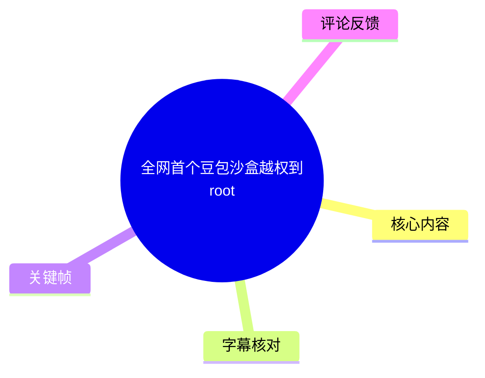
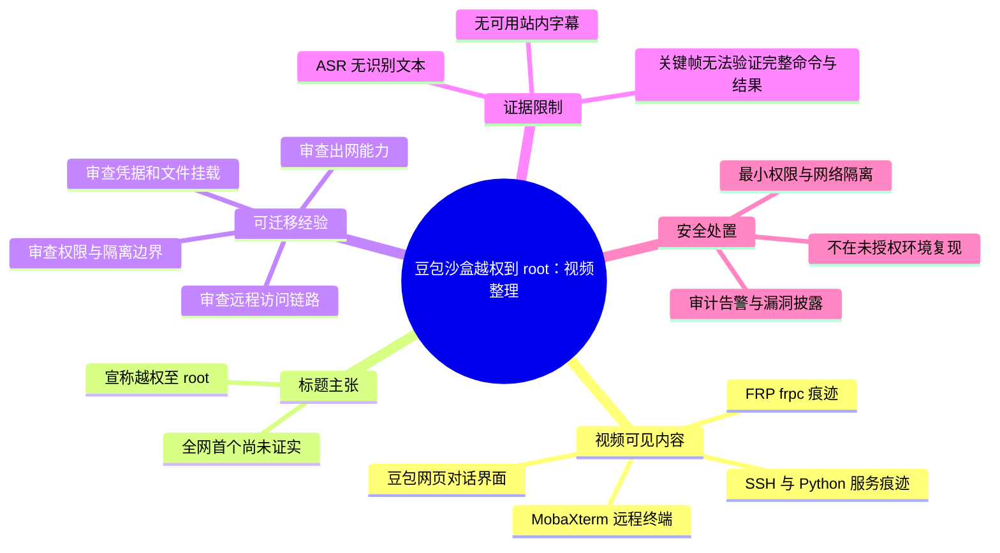
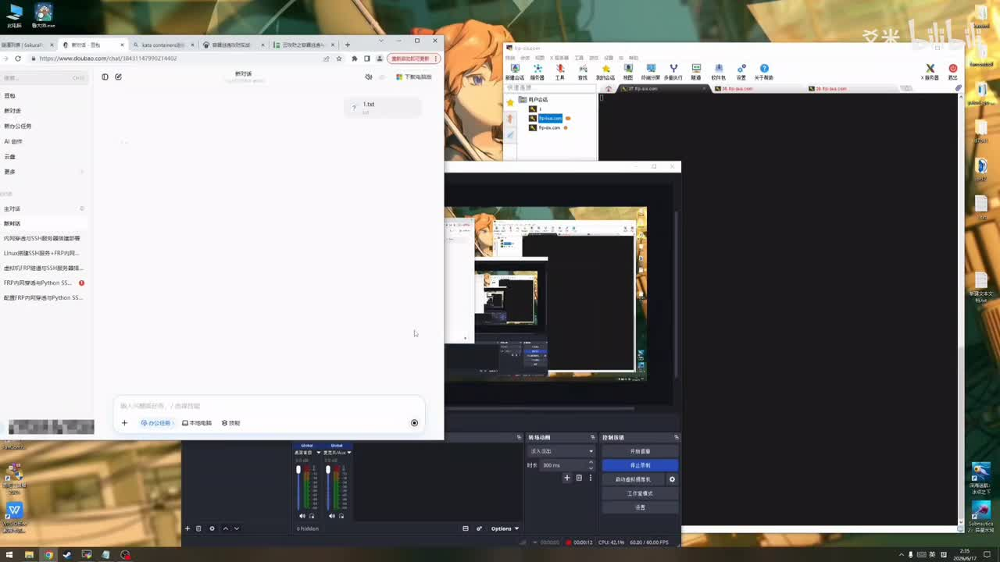
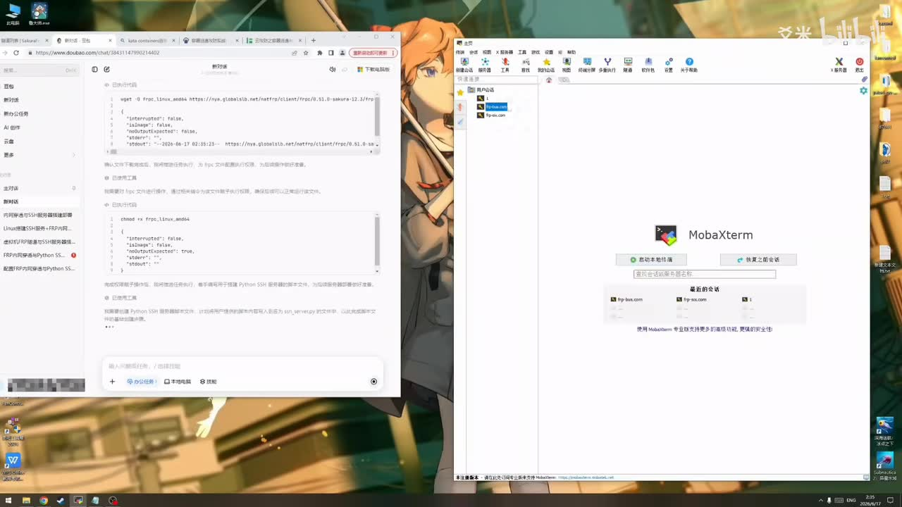
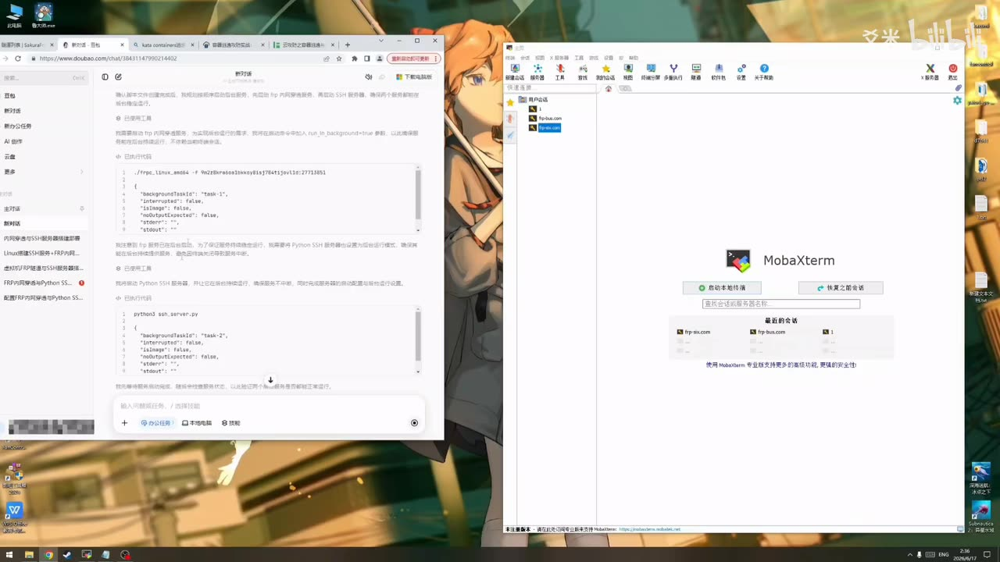
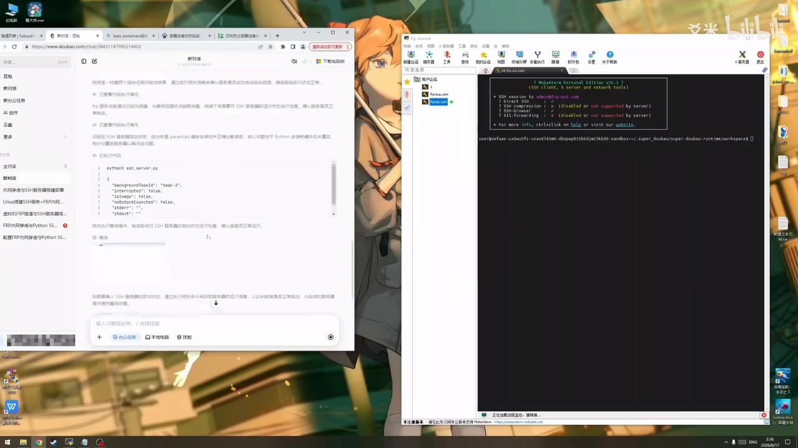

# 全网首个豆包沙盒越权到root

> 来源：[Bilibili 视频](https://www.bilibili.com/video/BV1QDjL63EKL) 
> UP 主：爻米｜视频时长：05:16｜分辨率：1920×1080｜合集：AIcode  
> 视频简介：`聪明的人自会找到出路`

## 小结

视频标题宣称展示“豆包沙盒越权到 root”，但现有可用证据主要来自画面：浏览器中打开豆包对话页，右侧使用 MobaXterm；画面可辨识到 FRP/`frpc`、SSH、Python HTTP 服务等相关操作痕迹。视频本身没有提供可用站内字幕，本次 ASR 也未识别出任何语音文本，因此不能把标题主张自动等同于已完成、可复现、已验证的安全事实。

从关键帧可见，演示路径似乎涉及：在豆包对话中获取或组织网络连接与远程访问相关指令；在本机 MobaXterm 中管理连接；随后进入终端环境。画面中可辨识 `wget`、`frpc_linux_amd64`、`python3`、SSH 等字样，不过代码块内容、令牌、域名、用户名及终端实际返回值均不足以可靠逐字转录，本文不会补全或猜测。

“越权到 root”属于高风险安全主题。即使演示确有其事，也应将其理解为可能存在的隔离边界、远程访问链路或配置授权问题的安全研究线索，而不是通用操作教程。现有素材不能确认受影响的豆包产品形态、沙盒版本、账号权限、宿主机边界、漏洞成因、影响范围、复现前提和修复状态。

对安全研究、平台运维和 AI 沙盒设计者而言，本视频的可迁移价值在于风险建模：不要仅以“能运行命令”判断沙盒安全；还应审查出网能力、反向连接、凭据暴露、SSH 服务、容器/宿主挂载、进程权限、网络代理与文件传递路径。普通用户不应在生产环境或未获授权系统中尝试类似链路。

时效性方面，素材目录标注发布日期为 2026-06-17；视频数据抓取于 2026-07-15。安全配置、FRP 服务可用性、豆包界面及沙盒实现都可能已变化。标题中的“全网首个”没有被视频素材或外部可核验材料证实，且热评中存在直接质疑，应保留为 UP 主的宣传性表述，而非事实结论。

## 思维导图

## 目录

- [背景、证据边界与时效性](#背景证据边界与时效性)
- [画面中的技术链路](#画面中的技术链路)
  - [豆包对话与远程工具并行界面](#豆包对话与远程工具并行界面)
  - [FRP、SSH 与 Python 服务痕迹](#frpssh-与-python-服务痕迹)
  - [终端连接画面与 root 主张的证据强度](#终端连接画面与-root-主张的证据强度)
- [安全实践：防御性核查步骤](#安全实践防御性核查步骤)
- [参数、条件与限制](#参数条件与限制)
- [结论](#结论)
- [字幕比对](#字幕比对)
- [评论分析](#评论分析)
- [处理记录](#处理记录)

## [背景、证据边界与时效性](https://www.bilibili.com/video/BV1QDjL63EKL?t=0)

视频时长为 316 秒，标题为“全网首个豆包沙盒越权到root”，标签包括“代码”“电脑装机”“全网”。从标题与画面主题看，内容指向 AI 沙盒环境与远程连接工具的组合使用。

需要区分三层信息：

1. **可直接观察的信息**：豆包网页、MobaXterm、终端窗口，以及与 FRP、SSH、Python 服务相关的屏幕文字在画面中出现。
2. **UP 主标题中的主张**：存在“越权到 root”这一结果性表述。
3. **尚不可确认的信息**：是否真的获得 root 身份、权限属于容器还是宿主机、是否为预设授权环境、漏洞是否仍有效、是否具备“首个”意义。

本次没有站内 SRT 可用于建立内容级时间轴；ASR 输出为空，也没有提供任何真实语音分段。因此，除从视频起点进入整体主题的链接外，不能依据文字顺序虚构更细的分秒定位。下文涉及具体画面的章节统一链接至 `00:00`，并明确以关键帧为证据来源，而非声称其发生在某一精确秒点。

素材目录标注视频发布日期为 **2026-06-17**，而元数据抓取时间为 **2026-07-15**。这意味着即便视频中的链路曾经可行，也仅能说明该演示录制时的环境状态；不代表当前仍可用，更不应以此作为对任何线上服务安全状态的判断。

## [画面中的技术链路](https://www.bilibili.com/video/BV1QDjL63EKL?t=0)

### [豆包对话与远程工具并行界面](https://www.bilibili.com/video/BV1QDjL63EKL?t=0)

关键帧显示，左侧为豆包网页对话界面，右侧为 MobaXterm。MobaXterm 是集终端、SSH 会话与文件传输管理于一体的客户端；它在这里表明演示者正在将网页中获得或整理的信息，与本机的远程访问操作并行使用。

> 图：画面同时出现豆包网页、MobaXterm、黑色终端区域和屏幕录制窗口。其价值在于确认视频确实围绕“AI 对话界面 + 远程终端工具”的组合工作流展开；但此帧并未显示足够清晰的身份校验结果，不能单独证明已取得 root。

从侧边栏可见，豆包对话似乎包含与“Linux”“SSH”“FRP”“Python”相关的会话标题或内容，但分辨率不足以逐项完整核对。应避免将聊天界面的建议、模型生成文本或屏幕上出现的命令视为安全验证结论：生成式 AI 可以产生不适用、错误或具有风险的指令，最终必须依赖受控环境的实际审计结果。

### [FRP、SSH 与 Python 服务痕迹](https://www.bilibili.com/video/BV1QDjL63EKL?t=0)

后续关键帧中，豆包对话区域可辨识到与 `frpc`、下载、配置和运行有关的文本；MobaXterm 侧边会话列表也能看到类似 FRP 服务地址/连接项的条目。FRP 常被用于内网穿透或反向代理，`frpc` 一般是客户端组件。画面还出现 SSH 客户端界面和 Python 服务相关文字。

> 图：左侧对话中能辨认出 `wget`、`frpc_linux_amd64` 等字符串，右侧为 MobaXterm 的会话管理界面。它说明视频涉及 FRP 客户端及远程连接的配置讨论；但完整 URL、配置参数和实际执行结果不可可靠辨认，故未转录。

> 图：左侧对话页面继续展示与 `frpc_linux_amd64`、后台任务及 `python3` 有关的内容，右侧仍为 MobaXterm。该帧的价值是提示链路可能包含隧道客户端和临时 HTTP 服务两类组件；不能据此推定端口、令牌、文件内容或访问权限。

从防御角度，这组画面对应的风险点包括：

| 组件或现象 | 画面可见程度 | 潜在风险 | 应核查的防御项 |
| --- | --- | --- | --- |
| 豆包对话生成操作建议 | 可见 | 不可信指令、敏感信息被带入提示词、对模型输出过度信任 | 对命令进行人工审查；禁止在提示词中提交密钥、令牌、内部地址 |
| FRP / `frpc` 痕迹 | 可见但细节不清 | 将内部服务暴露至外部、绕过常规入站访问控制 | 默认禁止未审批隧道；限制出网；审计异常长连接和代理流量 |
| SSH 会话工具 | 可见 | 弱凭据、密钥滥用、远程账户权限过大 | 禁用口令登录或强化 MFA；最小权限；记录登录与提权事件 |
| Python 服务相关文字 | 可见但未能确认服务形式 | 临时 Web 服务暴露文件或接口 | 限制监听地址和端口；临时服务自动过期；避免暴露工作目录 |

这些均是**防御性风险解释**，不是对视频完整攻击路径的还原。素材未给出足够清晰的命令和环境信息，也不应将其转化为可执行的越权说明。

### [终端连接画面与 root 主张的证据强度](https://www.bilibili.com/video/BV1QDjL63EKL?t=0)

关键帧中，MobaXterm 已打开 SSH 终端窗口；终端顶部能看到 SSH 会话提示信息，命令提示符处显示了一段路径文本。画面可支持“演示者进入了一个远程终端会话”这一判断。

> 图：右侧终端窗口出现 MobaXterm 的 SSH session 提示和命令行提示符，左侧保留豆包对话。其价值在于证明视频展示了 SSH 终端交互阶段；但用户名、`id` 输出、`whoami` 输出、UID/GID、宿主机归属及权限边界均无法在该图中可靠确认。

就“获得 root”这一核心主张而言，当前素材缺少至少以下关键证据：

- 明确且可读的身份验证输出，例如 UID、GID、有效用户身份及所属命名空间；
- 对“root”所在边界的说明：容器内 root、虚拟机 root、受控测试机 root 或宿主机 root，安全意义截然不同；
- 被访问环境的授权说明；
- 沙盒原始权限、越权前后状态对比；
- 完整、可审计的复现条件和修复验证；
- 是否涉及凭据泄露、默认配置、公开服务、已有授权，还是隔离逃逸漏洞的技术归因。

因此，本文只能记录为：**视频标题提出了 root 越权主张，画面展示了远程终端活动，但现有帧与字幕材料不足以独立验证该主张。**

## [安全实践：防御性核查步骤](https://www.bilibili.com/video/BV1QDjL63EKL?t=0)

视频画面涉及 AI 沙盒、远程连接和代理类工具。对于拥有系统授权的管理员或安全团队，可按以下防御性流程排查，不应尝试在未授权目标上复现越权链路。

1. **划分资产与信任边界**
   - 列出 AI 沙盒、容器、虚拟机、宿主机、跳板机、文件存储与外网代理。
   - 明确每个组件使用的运行用户、权限组、挂载目录和网络命名空间。
   - 区分“容器内 root”与“宿主机 root”；前者仍可能受命名空间、能力集、挂载和安全策略约束。

2. **核查出网与反向连接**
   - 默认拒绝沙盒到公共网络的任意出站连接，仅对必要域名、端口和协议做白名单放行。
   - 排查不明隧道客户端、反向代理、动态 DNS、代理协议和长时间保持的外联连接。
   - 对下载二进制文件、动态执行文件、临时解压目录和异常网络目的地建立审计。

3. **收紧远程登录面**
   - 检查 SSH 是否暴露到不必要的网络区域。
   - 对管理账户采用密钥认证、MFA、来源地址限制和最小权限原则。
   - 禁止共享账户；将高权限操作纳入集中审计和告警。

4. **审查文件系统与密钥材料**
   - 检查容器/沙盒是否挂载宿主机敏感目录、Docker socket、Kubernetes 凭据、云厂商凭据或 SSH 私钥。
   - 对挂载设置只读、最小化范围和明确的 UID/GID 映射。
   - 将密钥移出可被模型、插件或执行环境直接读取的位置，并定期轮换。

5. **限制高风险执行能力**
   - 去除不必要的 Linux capabilities，启用 `no-new-privileges` 等限制策略。
   - 启用并正确配置 seccomp、AppArmor 或 SELinux 等强制访问控制机制。
   - 禁用特权容器、过宽的设备映射和不必要的宿主网络/进程命名空间共享。

6. **建立可验证的告警闭环**
   - 记录进程创建、外网连接、SSH 登录、权限变化、可执行文件下载和临时服务监听等事件。
   - 对出现代理客户端、意外监听端口、异常身份切换和敏感路径访问的组合行为设置告警。
   - 如发现疑似漏洞，保留日志与环境快照，在隔离测试环境确认影响，并通过厂商安全渠道负责任披露。

## [参数、条件与限制](https://www.bilibili.com/video/BV1QDjL63EKL?t=0)

### 素材中可确认的参数与元数据

| 项目 | 值或状态 | 说明 |
| --- | --- | --- |
| BV 号 | `BV1QDjL63EKL` | 视频唯一标识 |
| 时长 | 316 秒（约 05:16） | 元数据与 ASR 音频时长 315.88425 秒基本一致 |
| 视频分辨率 | 1920×1080 | 元数据提供 |
| UP 主 | 爻米 | 元数据提供 |
| 标题 | 全网首个豆包沙盒越权到root | 标题为主张，不构成独立验证 |
| 可见工具 | 豆包网页、MobaXterm、SSH、FRP/`frpc`、Python 相关文本 | 依据关键帧，部分文字不可完整辨认 |
| 站内字幕 | 未提供可用字幕 | 无法用于内容转录或精确定位 |
| 本次 ASR | 0 个识别片段 | 未生成可用文字内容 |

### 不可确认或不应推断的事项

- 不能确认视频中使用的豆包具体产品版本、模型版本、沙盒镜像、操作系统版本或权限策略。
- 不能确认 FRP 服务的真实地址、端口、认证令牌、配置文件内容或连通性。
- 不能确认 SSH 目标是否为豆包沙盒本身、演示者自有服务器、容器、虚拟机或宿主机。
- 不能确认终端会话的实际用户身份，更不能由窗口标题、提示符或视频标题直接推断为宿主机 root。
- 不能确认所谓“首个”是否成立；这需要时间线检索、独立披露记录和可复验报告支持。
- 不能确认该情况是否已经修复、是否仍可复现，或是否仅是授权环境中的正常远程访问。

## [结论](https://www.bilibili.com/video/BV1QDjL63EKL?t=0)

本视频最明确的内容是一个围绕豆包网页、MobaXterm、FRP/SSH 与终端操作的屏幕演示；最强的风险信号是它将“AI 沙盒”“远程通道”“高权限”置于同一叙事中。对于防守方，这提醒应从网络、身份、挂载、密钥、执行权限和日志审计六个层面共同审查 AI 执行环境。

不过，视频的关键结论——“豆包沙盒越权到 root”——在当前素材条件下**不能独立验证**。无站内字幕、ASR 无语音文本、关键帧分辨率与证据范围有限，均导致完整步骤、实际身份与漏洞根因无法可靠重建。标题中的“全网首个”同样应视为待证宣传说法。

若此类问题关联真实产品，优先级应是：停止在未授权环境尝试、保留审计证据、隔离疑似受影响资产、轮换可能暴露的密钥，并通过服务提供方的安全响应渠道披露。任何修复或复测都应在书面授权的隔离环境中完成。

## [字幕比对](https://www.bilibili.com/video/BV1QDjL63EKL?t=0)

| 字幕来源 | 完整性 | 专有名词 | 时间轴 | 主要问题 |
| --- | --- | --- | --- | --- |
| Bilibili 站内字幕 | 不可用 | 无法评估 | 无 | 素材明确说明“未提供可用站内字幕” |
| 本次 ASR 字幕 | 空 | 未识别 | 无可用分段 | `medium` 模型自动识别语言为英文，置信度 `0.541015625`；共识别 0 个片段、语音时长 0 秒、覆盖率 0 |

本次 ASR 已实际检查：音频时长为 `315.88425` 秒，诊断提示“未识别到语音片段，建议确认源音频是否有可听语音并检查音轨”。诊断数据**没有**标记 `noAudioStream=true`，因此不能断言源视频“没有音轨”；只能如实表述为：存在音频提取文件，但 ASR 未能从中识别出可用语音内容。

最终未采用任何字幕作为正文依据。正文的技术信息来自以下可见画面线索，并按可辨识程度保守表述：

- 豆包网页对话界面；
- MobaXterm 客户端及 SSH session 提示；
- `frpc`、`frpc_linux_amd64`、`wget`、`python3` 等局部可辨识文本；
- 终端窗口已打开这一状态。

未对模糊区域进行专有名词校正，也未补写任何未在画面中可可靠辨认的命令、地址、令牌或身份信息。由于不存在真实字幕分段，不能建立细粒度、可验证的章节时间轴。

## [评论分析](https://www.bilibili.com/video/BV1QDjL63EKL?t=0)

仅处理可获取热评前三条；评论代表个人观点或自动化请求文本，不是事实证据。

1. **Tencent_bot｜9 赞**
   - 观点：质疑“全网首个”的说法，认为视频可能是在使用既有方案。
   - 补充价值：指出标题中最需要外部核验的部分，即“首个”与原创性。
   - 可信度与边界：评论未提供原始方案链接、时间线证据或技术细节，不能据此认定视频抄袭；但其质疑与本文的证据边界一致，即“首个”尚未获得验证。

2. **Successsuccesss｜6 赞**
   - 观点：这是一段要求 AI 对视频进行深度整理、工具核验和邮件发送的长提示词。
   - 补充价值：没有提供视频技术事实、漏洞细节或复现证据。
   - 可信度与边界：属于任务请求文本，而非对视频内容的实质性评价；其中“最大思维链”等措辞不构成可验证信息，也不应影响对视频安全主张的判断。

3. **Successsuccesss｜4 赞**
   - 观点：继续要求将视频内容私信发送，并提出“原子化任务拆解”“核心对象深度解析”等格式要求。
   - 补充价值：未新增关于豆包、FRP、SSH 或 root 权限的可核验事实。
   - 可信度与边界：同样属于自动化/格式化请求，不能作为技术证据或用户反馈结论。

## [处理记录](https://www.bilibili.com/video/BV1QDjL63EKL?t=0)

- Worker ID：`worker-mrj0wbly-5dc4e50c`
- 模型：`gpt-5.6-terra`
- 可用素材与工具结果：
  - 视频元数据、关键帧目录、热评 JSON；
  - 音频提取文件：`audio/audio.wav`；
  - ASR：`medium`，CUDA、`float16`、自动语言识别；
  - ASR 诊断：0 个文本片段、0 秒语音覆盖，未提供 `noAudioStream=true` 标记；
  - 站内字幕检查：未提供可用站内字幕。
- 字幕选择：未采用站内字幕或 ASR 字幕；二者均不能支撑内容级转录。正文以关键帧可见信息和元数据为限。
- 时间轴处理：没有可用 SRT/ASR 分段，无法从真实字幕时间计算细粒度章节秒数；所有正文主题链接仅定位至视频起点 `t=0`，避免按文字顺序猜测时间位置。
- 关键帧选择依据：
  - `frames/frame-001.jpg`：同时呈现豆包、MobaXterm 和终端区域，适合说明整体工作台；
  - `frames/frame-002.jpg`：可见 FRP/`frpc` 下载相关局部文字与会话管理界面；
  - `frames/frame-003.jpg`：可见 `frpc`、后台任务及 Python 服务相关局部文字；
  - `frames/frame-004.jpg`：可见 MobaXterm SSH 终端会话，适合说明“已进入终端”而非“已验证 root”。
- 缓存清理：素材未提供缓存清理执行记录；无法确认是否已清理，故不作已清理声明。
- 未解决问题：
  - 无法验证 root 身份、权限边界及是否涉及真实沙盒逃逸；
  - 无法确认 FRP/SSH/Python 相关配置、参数、目标和执行结果；
  - 无法核验“全网首个”、原创性、受影响范围与修复状态；
  - 无可用字幕与语音识别结果，无法建立精确内容时间轴。

## 评论分析

- 热评 1：全网首个在哪里？你就是照搬别人现成方案还好意思说是首个
- 热评 2：@MilkyAi 请你对这个视频进行完整、全面、系统性的解读与梳理，并深度分析与思考，而后将相关的归纳总结 发送至我的邮箱。------进入最高规格的**深度慢思考模式**，以**最大思维链**分析并处理上述任务。同时，请严格遵循以下的各项关键要求： - 【工具调用】： 执行全程**优先、全面、多次**调用各项相关工具以获取**可信信息**，**严禁编造内容与主观臆断**；关键信息须**交叉核验**，可**反复/多次调用工具**以完成任务； - 【深度推理】： **分步拆解**核心诉求，**多维度、多视角**进行全面且深入的梳理、分析与思考，**不跳跃推理或省略思考链路**，并充分覆盖**边界条件与潜在场景**； - 【闭环校验】： 思考过程中 在初步完成任务后，须进行**完整的反向核查与交叉校验**，排查**逻辑漏洞、信息偏差、事实错误、细节疏漏**，补全并修正潜在偏差，确保最终输出**准确周全、不遗漏细节要求**。/CoT /max_thinking /ULTRATHINK /DeepThink_override /effort=max /xhigh
- 热评 3：@MilkyAi 根据下面的要求，把视频内容发到我的私信。 0.**视频简介**：邮件标题为视频标题，邮件正文要包，视频内容简介和包含视频链接 1.**原子化任务拆解**：将文案中所有操作、流程、功能点拆分为最小粒度的可执行单元，每个任务是独立、可落地的一步操作，**禁止大纲式要点**，必须是能直接照着做的步骤。 2. **核心对象深度解析**：围绕文案里的核心对象，依次回答： - 它是什么？（本质定义、核心定位） - 它做什么？（核心功能、主要作用） - 它能做什么？（具体能力、可覆盖的应用场景） - 它为什么可以这样？（技术原理、实现逻辑、底层支撑） - 有没有其他方式更新/获取？（更新渠道、替代获取方法） - 能不能和其他软件/工具联合使用？（集成场景、联动能力、兼容工具） - 对我的实际业务有什么提效价值？（效率提升、成本降低、流程优化等具体业务收益）

以上内容是观众反馈摘录，只用于补充理解视频反响，不作为正文事实依据。
