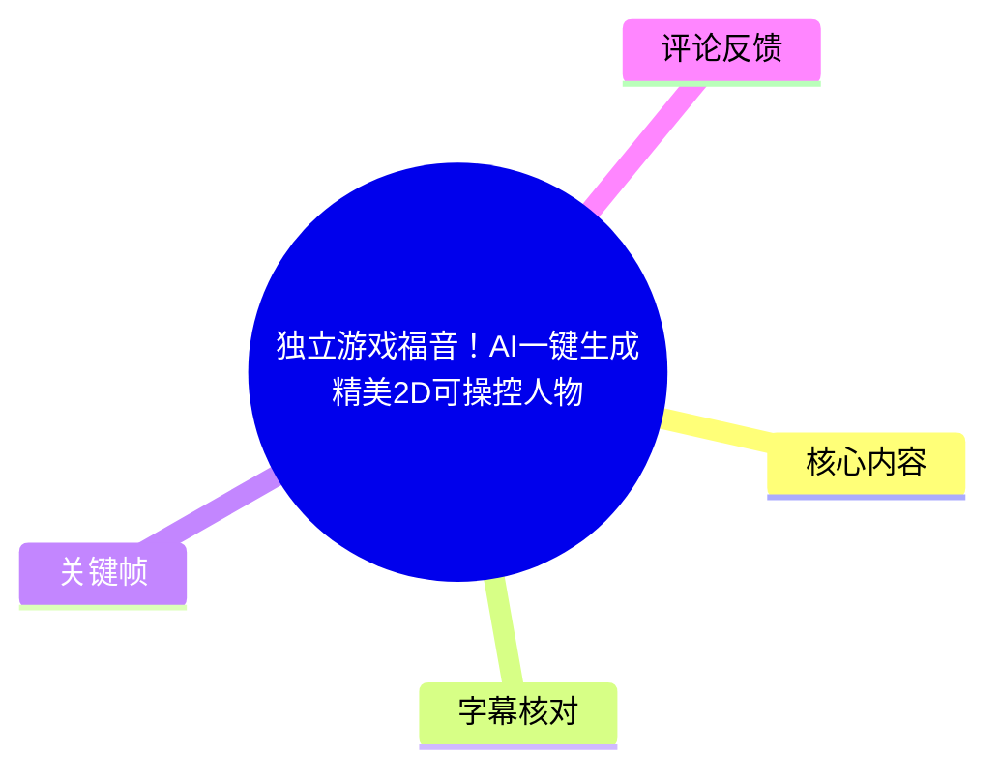
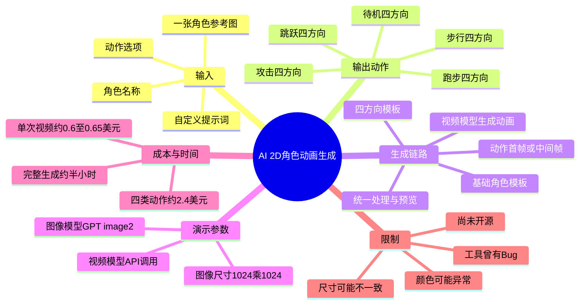
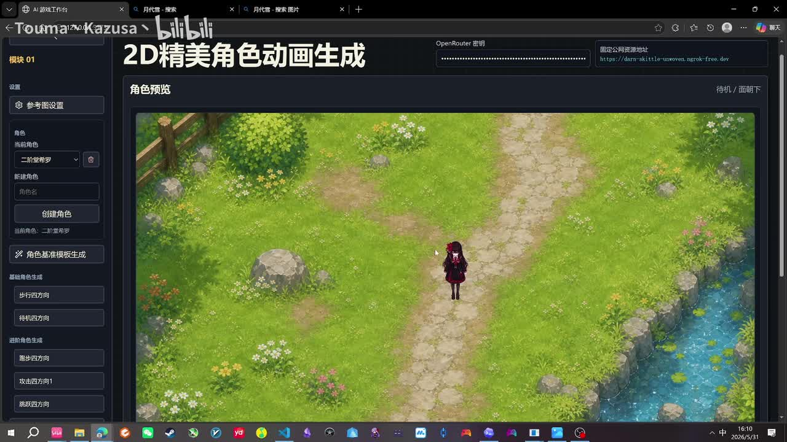
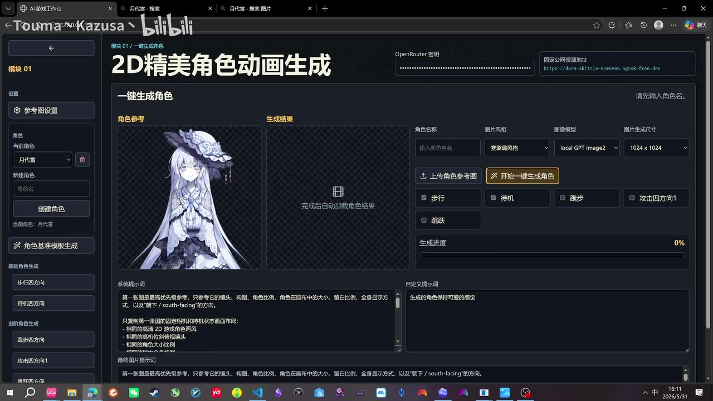
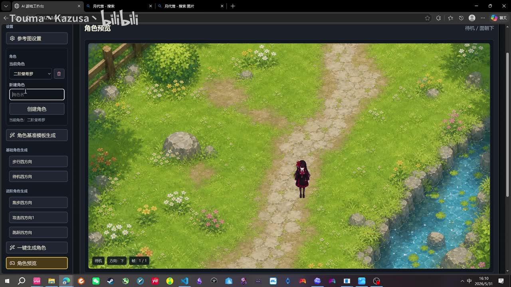
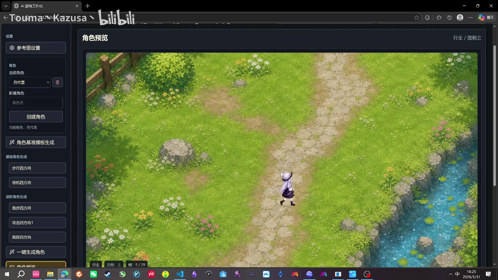

# 独立游戏福音！AI一键生成精美2D可操控人物

> 来源：[Bilibili 视频](https://www.bilibili.com/video/BV1fjVD66E3L)  
> UP 主：Touma丶Kazusa丶｜视频时长：06:52｜合集：AIcode  
> 本文时间轴以本次 ASR 的带时间戳 SRT 为依据；素材中未提供可用站内字幕。

## 小结

视频展示了一个仍在开发中的 AI 2D 游戏角色生成流程：用户上传一张二次元角色参考图，选择步行、待机、跑步、攻击、跳跃等动作后，系统自动生成可在俯视角地图中预览的角色动画。视频演示的目标是降低独立游戏原型阶段制作可操控角色素材的门槛。

该流程并非简单的“单图直接导出完整游戏角色”。UP 主介绍的内部链路是：角色参考图先生成基础模板，再转为四方向动作模板；随后通过图像生成约束动作关键视觉内容、再调用视频模型生成连续动作，最终进行统一处理并在角色预览器中查看。

最简演示仅勾选了步行和待机；完整演示则包含走路、跑步、跳跃与攻击。作者称完整生成大约等待“半个多小时”，表明“一键”主要指用户操作自动化，并不表示即时完成。

视频给出的成本估算是：单次视频模型调用约 `0.6～0.65 美元`；按步行、跑步、攻击、跳跃四类动作各调用一次计算，约为 `4 × 0.6 = 2.4 美元`，作者折算为约 `16 元人民币`。这只是录制时的作者口径，未明确包含图像生成、失败重试、存储、汇率变化或人工修图成本。

作者也明确展示了局限：完整生成结果可能出现颜色不一致、角色大小不统一等问题，需要后期调整；工具此前出现过 Bug；系统尚未开源，仍处于开发中。因此该工作流更适合独立游戏 Demo、玩法验证与美术原型，而不应被视为无需人工验收即可直接投入正式项目的成熟生产管线。

## 思维导图





## 目录

- [需求、效果与适用范围](#需求效果与适用范围-0000)
- [操作界面与最简生成](#操作界面与最简生成-0040)
- [生成链路：参考图、四方向模板与动画](#生成链路参考图四方向模板与动画-0211)
- [完整角色生成与质量检查](#完整角色生成与质量检查-0310)
- [动作逻辑、费用与模块化自定义](#动作逻辑费用与模块化自定义-0422)
- [工具状态、时效性与使用边界](#工具状态时效性与使用边界-0608)
- [字幕比对](#字幕比对-0000)
- [评论分析](#评论分析-0000)
- [处理记录](#处理记录-0000)

## 需求、效果与适用范围 [00:00](https://www.bilibili.com/video/BV1fjVD66E3L?t=0)

视频开场提出的目标是：通过一张二次元角色图，获得可用于游戏的 2D 角色及动作。UP 主称生成的角色能够跑动、跳跃、攻击，动作相关素材由 AI 生成。

从现有素材可确认的能力包括：

1. 工具支持角色参考图上传与动作选择；
2. 生成结果可在俯视角地图场景中预览；
3. 后续完整演示展示了走路、跑步、跳跃、攻击；
4. 预览界面按动作、角色朝向和帧序列组织角色素材。

但视频未展示以下信息：

- 导出的文件格式；
- 精灵图切分规则；
- 帧率与透明背景处理；
- Unity、Godot、RPG Maker 等具体引擎的导入步骤；
- 碰撞体、动画状态机和控制器接入；
- 商用授权、素材权属或 API 服务条款。

因此，视频中“可用于游戏”应理解为作者展示的预览目标和应用方向，而不是完整工程接入已经被证明。



> 图：关键帧展示“2D精美角色动画生成”工具的角色预览区域，角色位于草地、道路与水边构成的俯视场景中。它证明视频展示的不是单纯静态人物图，而是面向游戏场景的角色预览效果。

## 操作界面与最简生成 [00:40](https://www.bilibili.com/video/BV1fjVD66E3L?t=40)

### 创建角色与上传参考图 [00:40](https://www.bilibili.com/video/BV1fjVD66E3L?t=40)

UP 主以“月代雪”为示例角色，进入“一键生成角色”界面后上传角色参考图。ASR 表述为“参考图任意参照的图”，视频画面中实际展示的是一张人物主体完整、服装和配色清晰的角色立绘式图片。

界面可见信息包括：

| 项目 | 画面或口述信息 |
| --- | --- |
| 角色名称 | 可输入角色名 |
| 图片风格 | 画面中为“赛璐璐风格” |
| 图像模型 | `local GPT image2` |
| 图片生成尺寸 | `1024 × 1024` |
| 输入素材 | 上传角色参考图 |
| 动作选项 | 步行、待机、跑步、攻击四方向 1、跳跃 |
| 执行入口 | “开始一键生成角色”按钮 |
| 自定义内容 | 提示词输入区域 |
| 状态反馈 | 生成进度条 |



> 图：该帧直接显示角色参考图、生成结果区域、`local GPT image2`、`1024 × 1024`、动作复选框、进度条及自定义提示词区域，是本文记录界面参数和动作选择范围的主要证据。

### 先生成步行与待机 [01:05](https://www.bilibili.com/video/BV1fjVD66E3L?t=65)

首次演示中，UP 主先勾选：

- 步行动画；
- 待机动画。

跑步、攻击与跳跃暂不生成。点击“一键生成角色”后，系统自动执行任务。作者表示过程需要调用许多 AI 模型，所以需要等待，但用户不必在中途继续手动操作。

这可形成一种较稳妥的实际使用顺序：

1. 先用步行、待机验证角色外观是否被正确保留；
2. 检查四方向角色的比例、主色、服饰识别度；
3. 再追加跑步、攻击、跳跃等更复杂、可能产生更多调用费用的动作；
4. 保存参考图及每个阶段的中间结果，便于出错后重做或定位问题。

后两项属于基于视频流程提出的项目实践建议；视频未展示保存机制、任务重试机制或局部重生成机制。

### 最简生成结果 [01:46](https://www.bilibili.com/video/BV1fjVD66E3L?t=106)

生成完成后，UP 主展示“月代雪”的预览效果，并称已得到精致的 2D 小人以及行走、待机动作。由于首次没有生成跑步、攻击和跳跃，因此动作集合较少。



> 图：画面底部可见“待机”“方向：下”“帧：1/1”等状态信息。该图的价值在于说明预览器会按照动作、方向和帧数检查结果，而不是仅展示角色静态外观。

## 生成链路：参考图、四方向模板与动画 [02:11](https://www.bilibili.com/video/BV1fjVD66E3L?t=131)

### 基础模板与步行四方向模板 [02:11](https://www.bilibili.com/video/BV1fjVD66E3L?t=131)

UP 主介绍的生成顺序可整理为：

1. 输入一张角色参考图；
2. 调用图像模型生成角色的基础模板；
3. 将基础模板转换为步行四方向模板；
4. 生成步行动画；
5. 以类似逻辑生成待机和其他动作；
6. 对结果进行最终处理，并载入角色预览。

ASR 将图像模型名称识别为“GPD image 2”，而关键帧界面写作 `local GPT image2`。因此，本文依据可见界面统一写作 **GPT image2**；视频未提供官方模型链接、版本号或参数文档，无法进一步确认其对应的公开模型产品。

四方向模板是流程中的关键中间层：同一角色要在不同朝向下维持脸部、发型、服装、武器、比例和颜色的一致性。视频未完整展示四方向模板的每张图或完整提示词内容，但其界面左侧明确存在“步行四方向”“待机四方向”“跑步四方向”“攻击四方向 1”“跳跃四方向”等模块。

### 从动作图像约束到视频动画 [02:46](https://www.bilibili.com/video/BV1fjVD66E3L?t=166)

UP 主表示，步行动画阶段也使用 GPT image2，并通过 API 调用视频模型生成动作。该视频模型在 ASR 中被识别为“Cdans 2.0 / Cdanc 2.0”，现有素材没有可辨认的正式拼写，故不能将其擅自替换为其他具体模型名称。

视频所述的动作制作关系如下：

| 动作 | 前置图像内容 | 后续生成内容 |
| --- | --- | --- |
| 步行 | 步行四方向模板 | 步行动画视频 |
| 待机 | 由步行结果转为待机 | 待机动画 |
| 跑步 | 依据步行标准制作跑步首帧 | 跑步视频 |
| 攻击 | 制作攻击中间帧 | 攻击视频 |
| 跳跃 | 制作跳跃首帧 | 跳跃视频 |

这说明该工作流并不完全依赖视频模型自由生成动作，而是先用图像阶段约束角色身份和关键姿态，再让视频阶段补全连续运动。视频没有披露动画帧率、时长、运动幅度、图像提示词、视频提示词、负面提示词及导出格式，因此不能据此完整复刻作者工具。

## 完整角色生成与质量检查 [03:10](https://www.bilibili.com/video/BV1fjVD66E3L?t=190)

### 工具 Bug 与重新生成 [03:10](https://www.bilibili.com/video/BV1fjVD66E3L?t=190)

UP 主说明“刚才工具有点 bug，所以修了”，之后再次上传角色参考图、勾选更多功能并重新点击一键生成。

这段内容可以确认两点：

- 工具在录制时仍可能发生异常；
- 作者在演示期间进行了修复后才继续生成。

视频没有说明 Bug 的具体表现、触发条件、修复方案或是否还会复现，因此不能将其概括为已经稳定的工具能力。

### 等待时间与动作展示 [03:37](https://www.bilibili.com/video/BV1fjVD66E3L?t=217)

完整结果生成后，作者称“大概过了半个多小时”。随后依次展示：

- 走路；
- 跑步；
- 跳跃；
- 攻击。



> 图：画面右上角显示“行走 / 面朝上”，底部显示“行走、方向：上、帧：8/29”。它说明至少在该行走结果中，预览器能够显示多帧动画序列，且素材按方向组织。

### 作者指出的质量问题 [03:57](https://www.bilibili.com/video/BV1fjVD66E3L?t=237)

UP 主对首次完整生成结果的评价是“其实还可以”，但明确指出：

1. 颜色“有点不对”；
2. 角色大小可能存在小问题；
3. 这些问题可通过后期调整处理；
4. 这也是作者第一次制作完整的一键生成角色。

基于这两个明确问题，正式项目应增加人工验收：

- 对比四方向角色的发色、服装色、肤色、武器色是否一致；
- 检查站立、行走、跑步、攻击、跳跃之间的缩放比例与脚底基线；
- 检查肢体、脸部、服饰和武器在快速运动中是否有变形；
- 检查帧间过渡、循环衔接和动作节奏；
- 将素材放入目标游戏场景后再检查视觉比例与可读性。

这些是由视频已暴露的问题引出的质量控制建议，不代表作者的工具已经自动完成这些检查。

## 动作逻辑、费用与模块化自定义 [04:22](https://www.bilibili.com/video/BV1fjVD66E3L?t=262)

### 跑步、攻击与跳跃的制作顺序 [04:22](https://www.bilibili.com/video/BV1fjVD66E3L?t=262)

UP 主在总结中再次说明动作生产逻辑：

1. **跑步四方向**：基于步行标准制作跑步首帧，再生成跑步视频；
2. **攻击**：先生成攻击中间帧，再制作攻击视频；
3. **跳跃**：先生成跳跃首帧，再制作跳跃视频。

由此可见，步行模板不仅是一个独立动作模块，也可能成为后续跑步动作的视觉标准。该设计意图是降低动作之间风格断裂的概率；但视频没有提供一致性评测、自动校正或批量验收能力，最终仍需人工检查。

### 费用估算 [04:46](https://www.bilibili.com/video/BV1fjVD66E3L?t=286)

作者讨论的是视频模型 API 调用费用。其口述中同时出现“0.65 刀”和“0.6 刀”两个近似数值，随后采用 `0.6 美元` 进行计算：

```text
动作视频数量：4 个
单次视频模型调用：约 0.6 美元
估算总计：4 × 0.6 = 2.4 美元
作者折算：约 16 元人民币
```

应注意：

- 作者将步行、跑步、攻击、跳跃作为 4 类视频生成动作；
- 视频没有说明待机是否单独计费；
- 视频没有说明四方向是否意味着额外调用次数；
- 失败、重试、图像生成、存储等费用是否计入，视频未披露；
- `0.6` 和 `0.65` 的口述差异意味着该费用应视为近似估算；
- API 价格与人民币折算具有时效性，不能作为当前固定报价。

### 模块化提示词自定义 [05:10](https://www.bilibili.com/video/BV1fjVD66E3L?t=310)

UP 主将系统概括为模块化流程，称用户可在任意模块中按需要修改提示词。视频给出的示例包括：

- 在基础模板阶段优化角色基础形象；
- 在步行模块指定走路风格，例如“走路比较豪爽”；
- 在攻击模块定制攻击中间帧；
- 可使用长剑，也可改为其他武器；
- 跳跃动作同样可以进行自定义。

这一设计将“角色是谁”和“角色怎么动”拆分处理：

| 模块层级 | 主要控制目标 |
| --- | --- |
| 基础模板 | 角色外观、服装、比例、整体美术风格 |
| 四方向模板 | 朝向一致性与角色识别度 |
| 步行、跑步 | 移动姿态与节奏 |
| 攻击 | 武器、攻击姿势、动作中间状态 |
| 跳跃 | 起跳、空中姿态或落地相关视觉约束 |

视频没有展示提示词语法、权重、负面提示词、模块间冲突处理或参数模板。因此，自定义提示词能否稳定传递到最终动画，仍需要使用者通过小规模任务验证。

## 工具状态、时效性与使用边界 [06:08](https://www.bilibili.com/video/BV1fjVD66E3L?t=368)

UP 主表示，当前系统尚未开源，仍在开发其他内容。作者称如果观众感兴趣，未来可能尽早开源，或提供联系后使用的方式；同时认为随着 AI 进步，流程会更完善、Bug 会更少、模型生成效果会更精美。

作者还提到像素风方向：其观点是像素风角色“不需要生成视频”，可通过图像生成软件制作游戏角色，因此成本更低。视频没有展示像素风生成样例、实际成本、实际质量或其与当前流程的技术差异，因此只能将其视为作者的开发方向与判断。

使用本方案前应重新核验：

- 工具是否已开源或可访问；
- 使用所需的 API、密钥及服务是否仍可用；
- 模型名称、模型能力和价格是否发生变化；
- 生成结果是否符合目标游戏的分辨率、帧率和导入规范；
- 参考图、模型输出和视频生成服务的授权是否符合项目用途；
- 是否有足够的人工美术与技术资源修正颜色、尺寸和动作问题。

视频最具可迁移性的经验是以下管线，而非“无需检查的一键成品”承诺：

> 角色参考图 → 基础角色模板 → 四方向动作模板 → 动作首帧/中间帧 → 视频模型生成动画 → 预览与人工修整

## 字幕比对 [00:00](https://www.bilibili.com/video/BV1fjVD66E3L?t=0)

| 字幕来源 | 完整性 | 专有名词 | 时间轴 | 主要问题 |
| --- | --- | --- | --- | --- |
| Bilibili 站内字幕 | 未提供可用字幕 | 无法核验 | 无法使用 | 素材明确说明“未提供可用站内字幕” |
| 本次 ASR 字幕 | 较完整，语音覆盖约 381.01 秒，占视频约 92.49% | 存在同音字、断词和模型名误识别 | 可用，提供 26 段真实 SRT 时间戳 | “生成/制作”、角色名、动作名、模型名有误识别 |

本次已检查 `asr/asr-result.json`。ASR 使用 `medium` 模型，识别语言为中文，语言置信度约 `0.9971`，带有真实时间戳。诊断中**未标记** `noAudioStream=true`，且语音覆盖正常，说明源视频存在音轨；因此没有将缺少站内字幕误判为工具失败。

最终字幕选择：

- 站内字幕：不可用；
- 时间轴依据：采用本次 ASR SRT；
- 文字校正依据：结合可见关键帧、视频标题与上下文进行有限校正；
- 无法由素材核验的模型名称：保留 ASR 近似转写，不扩展为未经证实的具体产品。

重要校正与保留如下：

| ASR 内容 | 正文处理 | 依据与说明 |
| --- | --- | --- |
| “生存任意游戏”“生存角色” | 改按语义写作“生成游戏角色”“一键生成角色” | 标题、界面按钮与上下文均指向“生成” |
| “GPD image 2” | 写作“GPT image2” | 关键帧界面可见 `local GPT image2` |
| “Cdans 2.0 / Cdanc 2.0” | 保留为 ASR 识别到的视频模型称呼 | 无站内字幕或清晰界面文字可确认官方拼写 |
| “月代雪 / 阅代序” | 统一写作“月代雪” | ASR 前段较稳定地识别为“月代雪”，后段存在变体 |
| “攻几”“跳跌” | 统一写作“攻击”“跳跃” | 动作选择项与语义可明确判断 |

## 评论分析 [00:00](https://www.bilibili.com/video/BV1fjVD66E3L?t=0)

以下仅分析当前可获取的热评前三条。评论属于观众观点，不构成对视频技术、工具状态或未来计划的独立验证。

1. **莹莹莹莹了**（3 赞）  
   评论认为该技术可能是突破，并联想到腾讯 QQ 秀的自定义功能：上传全身角色图后转为统一画风动作组。评论期待未来动作库变得更丰富，以支持模板化 2D 游戏动作量产。  
   - 补充价值：指出“动作库丰富度”可能是从单角色演示走向规模化生产的重要条件。  
   - 可信度边界：QQ 秀与视频中的工具是否采用相同技术、模型或动作生成逻辑，视频没有证实。

2. **c我手机号全被占了**（2 赞）  
   评论认可流程潜力，期待增加待机动画生成、指定动作风格等能力，并认为它可能对 RPG Maker 有帮助。  
   - 补充价值：强调了动作风格控制和轻量级游戏制作工具适配的潜在需求。  
   - 与视频内容的关系：视频已经展示待机选项，也提到可以通过提示词控制走路风格；但没有展示 RPG Maker 导入流程、资源规格或兼容性，不能据此判断可直接使用。

3. **穗祟**（2 赞）  
   评论内容为表情包文字“还有魔裁的事”。  
   - 补充价值：未提供具体技术事实、操作经验或使用场景。  
   - 可信度边界：不能据此推断角色来源、工具功能或应用范围。

## 处理记录 [00:00](https://www.bilibili.com/video/BV1fjVD66E3L?t=0)

- Worker ID：`worker-mrj0www4-e8d79408`
- 模型：`gpt-5.6-terra`
- 调用工具与素材：视频元数据、ASR 结果、ASR SRT、关键帧、热评 JSON、站内字幕状态。
- ASR 检查：已检查 `asr/asr-result.json`；识别语言为中文，具备真实时间戳，语音覆盖率约 `92.49%`；未见 `noAudioStream=true` 标记。
- 字幕选择：站内无可用字幕，正文时间轴全部采用本次 ASR SRT；对可由关键帧确认的 `GPT image2`、动作名称和“一键生成角色”等文字进行了谨慎校正。
- 关键帧选择依据：
  - `frames/frame-001.jpg`：展示俯视角地图中的角色预览，支撑场景化预览说明；
  - `frames/frame-002.jpg`：展示待机、方向和帧数状态，支撑预览器状态组织说明；
  - `frames/frame-003.jpg`：展示参考图、动作选项、`local GPT image2`、`1024 × 1024`、提示词与进度，支撑操作及参数记录；
  - `frames/frame-004.jpg`：展示行走、面朝上及 `8/29` 帧状态，支撑多帧动画预览说明。
- 缓存清理：素材未提供缓存清理日志；本次仅依据已提供素材整理，未执行或无法核验额外缓存清理，因此不宣称已完成清理。
- 未解决问题：
  - ASR 所称“Cdans 2.0 / Cdanc 2.0”的正式模型名称无法由现有素材核验；
  - 视频未展示导出格式、帧率、透明通道、引擎接入步骤和授权条款；
  - 工具是否已开源、是否仍可访问、API 计费是否变化，均需在实际使用前重新确认。

## 评论分析

- 热评 1：这技术估计真是突破了，看腾讯那个qq 秀自定义功能，就是随便上传一个角色全身图能给你转统一画风的动作组，过段时间动作库能再丰富一些就能量产模版化2d游戏动作了。[笑哭]
- 热评 2：这个方式感觉潜力不错啊，未来也许可以有待机动画生成，或者给角色指定动作风格之类的发展方向，感觉对于RPG Maker会很有用
- 热评 3：[魔法少女的魔女审判表情包_哦吼吼]还有魔裁的事

以上内容是观众反馈摘录，只用于补充理解视频反响，不作为正文事实依据。
