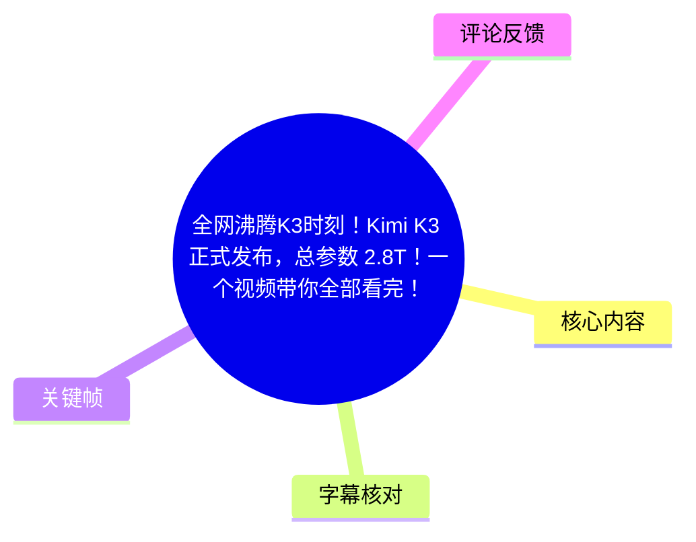
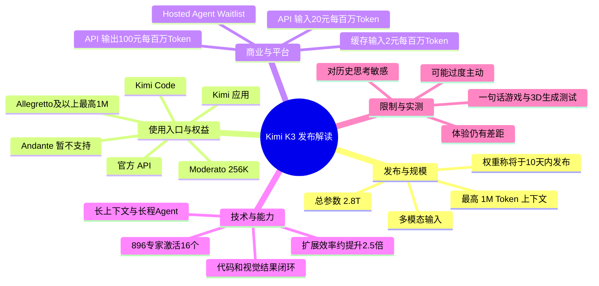
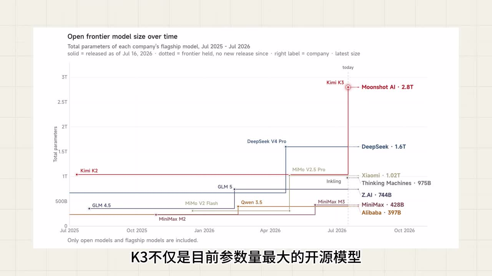
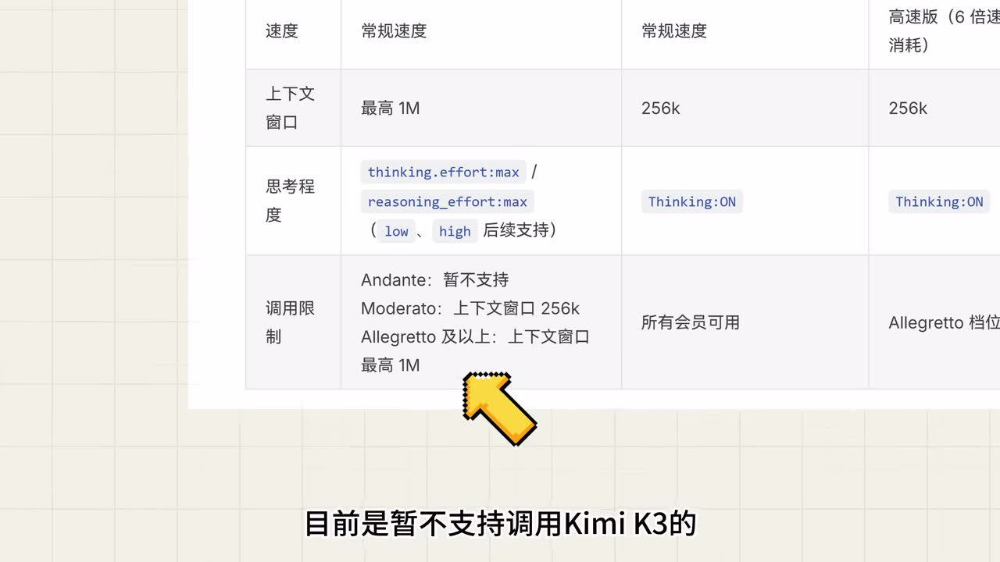
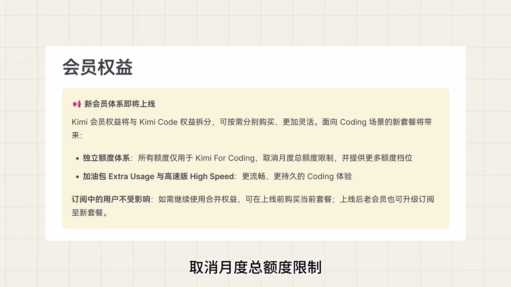
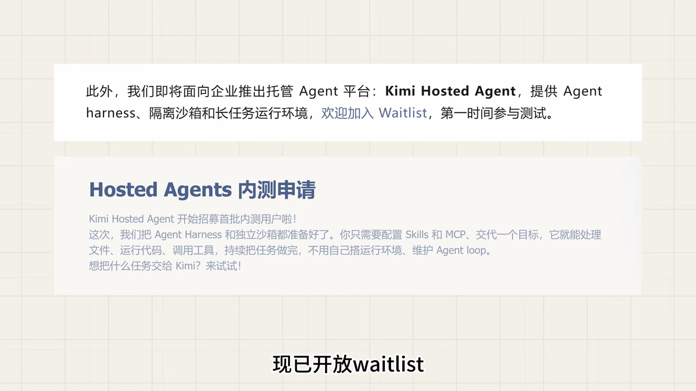

# 全网沸腾K3时刻！Kimi K3 正式发布，总参数 2.8T！一个视频带你全部看完！

> 来源：[Bilibili 视频](https://www.bilibili.com/video/BV1ADKE6CEgJ)<br>
> UP 主：黑鸦Heya｜视频时长：05:46｜分辨率：3840×2160｜合集：AIcode

## 小结

视频集中整理了月之暗面发布 **Kimi K3** 后的模型规模、产品入口、会员限制、API 价格、Agent 平台计划、架构信息、官方能力说法与作者的一句话生成实测。视频的核心消息是：Kimi K3 被描述为一个总参数 **2.8T**、支持最高 **100 万 Token 上下文**和多模态输入的模型，并已在 Kimi 应用、Kimi Code 与官方 API 等入口陆续提供。

使用权益是视频中最具操作价值的信息之一。画面与讲述均指向：Kimi Code 的 Andante 档暂不支持调用 K3；Moderato 可调用但上下文限制为 256K；Allegretto 及以上可获得最高 1M 上下文。视频还称 K3 当前只支持最高档推理/思考强度，后续低、高等选项仍待支持。

技术层面，作者转述了官方对 Kimi Delta Attention、混合线性注意力、Attention Residual 与 Stable Latent 等架构设计的说明，并给出“896 个专家、激活 16 个专家”“较 K2 扩展效率约提升 2.5 倍”等参数。由于部分术语来自存在明显错字与断句问题的 ASR，本文会保留其原始拼写或明确标注为“ASR 转写”，不将其扩展为未提供的官方定义。

实践上，视频展示了作者用 **Kimi K3 + Kimi Code** 进行一句话生成游戏、3D 生成的结果。作者认为其效果虽不及官方案例，但在“一句话生成”的条件下仍处于领先水平；同时也承认测试仓促，尚未深入体验，因此这不是可复现、可量化的完整评测结论。

需要特别注意时效性：视频中的会员梯度、价格、权重发布时间、Waitlist、模型能力排行榜均是发布当时的转述，可能已变化。性能比较主要为“官方给出的成绩”及作者综合说法，不能替代独立测评；视频也明确指出 K3 对历史思考内容敏感、可能过度主动、用户体验仍有差距等限制。

## 思维导图





## 目录

- [发布信息与模型定位](#发布信息与模型定位-0027)
- [产品入口、会员档位与新套餐](#产品入口会员档位与新套餐-0028)
- [API 定价与 Kimi Hosted Agent](#api-定价与-kimi-hosted-agent-0116)
- [架构、参数与能力定位](#架构参数与能力定位-0139)
- [软件工程能力与使用限制](#软件工程能力与使用限制-0227)
- [一句话生成游戏与 3D 实测](#一句话生成游戏与-3d-实测-0345)
- [结论与时效性](#结论与时效性-0423)
- [字幕比对](#字幕比对)
- [评论分析](#评论分析)
- [处理记录](#处理记录)

## 发布信息与模型定位 [00:27](https://www.bilibili.com/video/BV1ADKE6CEgJ?t=27)

视频在有声讲解开始时宣布，月之暗面已正式发布 Kimi K3。作者给出的关键信息包括：

- **总参数：2.8T。**
- **上下文：最高支持 1M（100 万）Token。**
- **输入形式：支持多模态输入。**
- **可用入口：**Kimi 应用、Kimi Code、官方 API；作者称第三方工具和平台也在陆续接入。
- **开源安排：**作者转述官方称模型权重将在 10 天内发布，更多细节将随技术报告公布。

画面用“Open frontier model size over time”图表强化了 K3 的规模定位：图中 Kimi K3 / Moonshot AI 标为 **2.8T**，并以 Kimi K2 的约 1T 作为历史对照。需要注意的是，ASR 在同一句中还出现“凭借 2.4T 的总参数规模”的冲突表述；结合视频标题、画面图表和前半句，本文记录主数字为 **2.8T**，同时保留这一字幕内部矛盾，不自行推断 2.4T 的含义。



> 图：关键帧显示开放前沿模型总参数规模图，Kimi K3 被标注为 Moonshot AI 的 2.8T 模型。该画面可直接核对视频所强调的“2.8T”规模信息，并展示它在图中相对 Kimi K2、DeepSeek V4 Pro 等模型的位置。

### 信息边界

“目前参数量最大的开源模型”“超过所有已公开参数的大模型”等是视频的发布期表述与图表口径，不等于经本文独立验证后的全球排名。尤其“开源”具体是指开放权重、开放代码还是其他许可范围，视频没有给出许可证、下载地址或技术报告内容，仍需以后续官方材料为准。

## 产品入口、会员档位与新套餐 [00:28](https://www.bilibili.com/video/BV1ADKE6CEgJ?t=28)

作者按 Kimi 应用与 Kimi Code 两类入口说明调用范围。ASR 对会员名有混淆，但关键帧可清晰识别为 **Andante、Moderato、Allegretto**；因此以下名称以画面为准。

| 场景/档位 | K3 调用情况 | 上下文窗口 | 视频中的补充说明 |
| --- | --- | ---: | --- |
| Kimi 应用最高档会员 | 可使用 | 最高 1M | 作者称仅最高档位可使用 1M 上下文。 |
| Kimi Code：Andante | 暂不支持 | — | 画面明确写有“暂不支持”。 |
| Kimi Code：Moderato | 可调用 | 256K | 适合不需百万上下文的调用。 |
| Kimi Code：Allegretto 及以上 | 可调用 | 最高 1M | 作者补充称为 199 元以上套餐可达的档位，但未提供完整价格表。 |
| 思考/推理努力程度 | 当前仅 Max | — | 画面写有 `thinking.effort:max` / `reasoning_effort:max`，并标注 low、high“后续支持”。 |



> 图：关键帧中的权益表直接列出 Andante“暂不支持”、Moderato“上下文窗口 256K”、Allegretto 及以上“上下文窗口最高 1M”。它比 ASR 更适合用于校正会员名和上下文权限。

### 即将调整的会员体系 [00:52](https://www.bilibili.com/video/BV1ADKE6CEgJ?t=52)

视频称新的会员体系即将上线，方向是将 **Kimi 会员权益与 Kimi Code 权益拆分**，使用户能够按需求分别购买。面向 Coding 场景的新套餐，作者列出的变化为：

1. 建立用于 Kimi For Coding 的独立额度体系；
2. 取消月度总额度限制；
3. 提供更多额度档位；
4. 提供 Extra Usage（加油包）与 High Speed（高速版）；
5. 已有生效订阅的用户权益不受影响；
6. 老会员在新套餐上线后可以升级、迁移订阅。



> 图：画面列出“会员权益将与 Kimi Code 权益拆分”“取消月度总额度限制”“更多额度档位”等信息，并写明订阅中用户不受影响、老会员可升级。这是视频对新套餐安排最完整的原始画面依据。

### 使用建议

- 需要将 K3 接入 Kimi Code 前，应先核对当前套餐级别与所需上下文长度；Andante 用户不能按视频所示方案直接调用。
- 长上下文任务应确认是否拥有 Allegretto 及以上权益，而不是仅确认“能调用 K3”。
- 新套餐尚处“即将上线”的预告状态。不要仅因视频称“取消月度总额度限制”就假定当前账户已自动获得该权益。
- `thinking.effort` / `reasoning_effort` 的具体 API 字段、适用端点及可选值未在视频中完整展示，不能据此拼接为确定可用的 API 请求。

## API 定价与 Kimi Hosted Agent [01:16](https://www.bilibili.com/video/BV1ADKE6CEgJ?t=76)

作者转述的 API 价格单位为“每百万 Token”：

| 计费项目 | 视频所述价格 |
| --- | ---: |
| 输入 | 20 元 / 百万 Token |
| 输出 | 100 元 / 百万 Token |
| 命中缓存的输入 | 2 元 / 百万 Token |

由此可见，在视频口径下，输出单价高于普通输入；若请求能命中输入缓存，其输入侧价格显著更低。但视频没有交代币种以外的税费、缓存命中判定、不同模型版本、批处理或限流策略，因此不能直接据此估算完整生产成本。

作者还提到月之暗面面向企业的托管 Agent 平台 **Kimi Hosted Agent**。视频画面展示的能力包括：

- Agent Harness；
- 隔离沙箱；
- 长任务运行环境；
- Skills 与 MCP 配置；
- 文件处理、代码运行、工具调用；
- 由平台持续处理任务，不需要用户自行搭建运行环境、维护 Agent loop；
- 当前状态为开放 **Waitlist / 内测申请**，不是已经全面开放的通用服务。



> 图：关键帧明确写有 Kimi Hosted Agent 的 Agent Harness、独立沙箱、长任务运行环境，以及“Hosted Agents 内测申请”。它说明该产品在视频时点仍是招募首批内测用户的阶段。

### 对企业使用的含义

视频只给出产品方向，未提供 SLA、数据隔离细则、权限模型、定价、地域可用性或上线时间。对于真实企业工作流，不能仅根据“隔离沙箱”一词判断其已经满足全部安全、合规或审计要求；这些项目均须以正式产品文档和合同条款核验。

## 架构、参数与能力定位 [01:39](https://www.bilibili.com/video/BV1ADKE6CEgJ?t=99)

作者将 K3 的架构概括为以下组合：

- **Kimi Delta Attention**：ASR 转写称其为“混合线性注意力”；
- **Attention Residual**：ASR 中对应“Attention Residuous”，拼写存在不确定性；
- **Stable Latent**：ASR 后续词语不清，未能确认完整术语；
- **MoE 规模：896 个专家中激活 16 个专家；**
- 相比 K2，整体扩展效率约提升 **2.5 倍**。

作者对这些设计的解释是：KDA 有助于更高效地处理长序列；“Harness”（此处与前文 Agent Harness 是否为同一术语，视频未说明）可使模型跨层检索历史信息，从而让信息在超长上下文和深层网络中的传递更稳定。由此导向的目标是提升复杂推理、多轮任务与长程 Agent 执行的稳定性。

### 性能叙述的证据等级 [02:03](https://www.bilibili.com/video/BV1ADKE6CEgJ?t=123)

视频称 K3 在编程基准与 Agent 基准上取得开源模型 SOTA，并称“综合各方评测数据”后，K3 整体超过了 ASR 所称的“CloudOpus 4.8、GPT 5.5、GLM 5.2”，但仍落后于“CloudFable 5、GPT 5.6”。

这里存在两项重要限制：

1. 视频未展示基准名称、具体分数、测试集版本、提示词设置、成本、推理时间或独立评测链接；
2. 多个竞品名称与版本号来自 ASR，且其专有名词识别质量不稳定。本文不擅自将“CloudOpus / CloudFable”等替换成其他模型名称。

因此，更稳妥的理解是：**这是作者转述官方成绩并综合评测后的比较判断，而非本视频提供的可审计排行榜。**

## 软件工程能力与使用限制 [02:27](https://www.bilibili.com/video/BV1ADKE6CEgJ?t=147)

### 视频所述软件工程能力

作者称，K3 可以在很少人工监督下持续处理较长时间的软件工程任务，包括：

- 理解和修改大型代码库；
- 结合源代码、实时截图与渲染结果决定下一步；
- 在代码与视觉结果之间形成反馈闭环。

这也是视频将 K3 与游戏生成、3D 生成联系起来的逻辑：模型不只是输出一段静态代码，而是被描述为能够根据运行和渲染后的视觉结果继续迭代。不过，视频未给出单个任务持续时长、成功率、最大仓库规模、工具权限或失败案例统计，能力边界仍不清晰。

### 官方提示的三项限制 [02:52](https://www.bilibili.com/video/BV1ADKE6CEgJ?t=172)

作者明确转述了三项限制与规避建议：

1. **对历史思考内容敏感。**  
   建议优先使用 Kimi Code 等已做兼容性验证的 Agent 框架；并且不要在工作流/绘画进行到中途时切换至 K3。ASR 的“绘画”一词可能是识别误差，视频未提供更清晰的上下文，因此保留原意为“任务中途不要切换模型”。

2. **可能过于主动。**  
   面对小问题或用户意图不明确的情况，模型可能会替用户做出不希望出现的决定。建议在 **System Prompt** 或 `agents.md` 中明确写出行为边界和约束。

3. **用户体验仍有差距。**  
   作者称其与 ASR 所记“CloudFable 5”和“GPT 5.6 SO”相比，在用户体验上仍有差距。具体差距体现在哪些维度，视频没有展开。

### 可迁移的 Agent 约束写法

视频没有给出可复制的原始 Prompt；以下仅是对“明确边界”的结构化整理，不是视频中的官方模板：

```text
- 仅执行用户明确提出的目标；目标不清晰时先询问。
- 不修改、删除、发布文件或外部资源，除非先获得确认。
- 每完成一个关键步骤，报告已做操作、结果与下一步计划。
- 发生错误时优先诊断和提出选项，不自行扩大操作范围。
- 不在任务中途切换模型、上下文策略或执行框架，除非用户批准。
```

在涉及代码仓库、文件系统、浏览器自动化、部署或付费资源时，应该把“询问确认”“禁止破坏性操作”“权限范围”写成可执行的明确规则，而不能只使用“谨慎处理”之类的笼统描述。

## 一句话生成游戏与 3D 实测 [03:45](https://www.bilibili.com/video/BV1ADKE6CEgJ?t=225)

视频在约 03:27—03:45 之间没有可用 ASR 语音，随后作者介绍实测：使用 **Kimi K3 搭配 Kimi Code**，通过一句话生成游戏。作者的结论有两层：

- 成果没有达到官方案例的惊艳程度；
- 但在“一句话生成”这一约束下，作者认为其相较其他模型仍处于领先水平。

在约 04:23，作者补充展示了 3D 生成测试，同样为一句话生成。作者特别说明由于时间仓促，没有来得及进行深入体验，因此该展示应被视为短时定性演示，不能据此推出对 3D 建模、游戏引擎集成或长期迭代能力的全面结论。

### 从演示可得与不可得的结论

| 可以从视频得出的信息 | 不能从视频得出的信息 |
| --- | --- |
| 作者实际使用了 Kimi K3 + Kimi Code 进行游戏与 3D 的一句话生成测试。 | 原始提示词、模型版本、套餐、上下文长度、执行轮数均未提供。 |
| 作者主观评价其表现较有竞争力。 | 无法复现成功率、生成耗时、成本和与其他模型的定量差异。 |
| 官方案例被作者评价为在 3D、游戏生成方面“表现惊艳”。 | 无法判断官方案例是否经过人工修改、多轮提示或额外工具协作。 |

## 结论与时效性 [04:23](https://www.bilibili.com/video/BV1ADKE6CEgJ?t=263)

这支视频的价值在于把 Kimi K3 发布后的关键信息压缩为一条使用导向的速览：模型规模与长上下文是其定位，Kimi Code 会员档位决定实际可用范围，API 价格与 Hosted Agent 则显示出面向开发者、企业 Agent 工作流的产品布局。

对于开发者，最实际的决策顺序是：

1. 先确认自己通过 Kimi 应用、Kimi Code 还是 API 使用；
2. 核对套餐是否支持 K3，以及任务是否确实需要 256K 以上或 1M 上下文；
3. 对长程 Agent 加入显式边界、确认机制和中断/回滚策略；
4. 将游戏、3D 与代码 Agent 展示视为可尝试的方向，而不是性能保证；
5. 上线前重新核对官方定价、模型可用性、权重发布状态、会员权益和 Hosted Agent 的申请状态。

### 时效性与未验证项

- 视频发布于 2026-07-17，且多处内容是“即将上线”“10 天内发布”“开放 Waitlist”性质的发布期信息，后续变化可能很快。
- 2.8T、1M、896/16、2.5 倍等数字按视频口径记录，未附带技术报告原文。
- 会员价格中仅出现“199 元以上”这一口述条件，缺少完整价目表，不能外推全部档位成本。
- 性能比较及竞品名称受 ASR 专有名词误识别影响，且无可审计的测试表，可信度应限定在“视频陈述”层面。
- 作者的实测没有给出提示词和过程日志，无法独立复现。

## 字幕比对

| 字幕来源 | 完整性 | 专有名词 | 时间轴 | 主要问题 |
| --- | --- | --- | --- | --- |
| Bilibili 站内字幕 | 不可用 | 无法评估 | 无法使用 | 素材明确标注“未提供可用站内字幕”；抓取过程还有 `Invalid URL` 警告。 |
| 本次 ASR 字幕 | 覆盖约 201.64 秒语音，占视频约 58.37%；含 2 段较大空白 | 较多误识别或断词 | 可用，11 个 SRT 分段均带真实起止时间 | 首段仅 1.02 秒却包含大量文本；术语、会员名、竞品名和部分技术词错误明显。 |

### 最终字幕选择与校正原则

最终采用**本次 ASR 的时间轴**作为章节链接依据，因为没有可用站内字幕。ASR 诊断显示音频存在，`noAudioStream=true` **未出现**，因此不存在“源视频没有音轨”的情况；本次视频的语音识别语言为中文，识别置信度为 0.9995。

处理时遵循以下原则：

- 时间点严格取自 SRT 的真实起止时间，如 00:01:16,880 对应 76 秒；
- 对画面可确认的内容进行校正，例如 **Andante、Moderato、Allegretto、256K、最高 1M、Kimi Hosted Agent、Waitlist**；
- 对无法由画面或上下文可靠核对的专有名词，不进行“猜测性纠错”，而标为 ASR 转写；
- ASR 中 03:27.200—03:45.570、03:58.930—04:23.120 为较大语音空白段，相关演示仅按后续作者明确说出的“一句话生成游戏/3D 测试”记录，不虚构空白段细节。

## 评论分析

以下仅分析可获取的热评前三条；评论为用户表达，不构成已验证事实。

1. **@全场最拉_（404 赞）**  
   评论称“现在是早鸭了”“要发 AI 晚报，但现在明明是中午”，属于围绕视频发布时间与 AI 新闻节奏的玩笑。它没有提供 K3 的技术、价格或实际体验补充信息，反映的是社区对高频 AI 资讯的轻松调侃。

2. **@欧若拉的庭院（366 赞）**  
   评论以“杨植麟试用 K3，震惊瘫坐在椅子上”等夸张叙事制造幽默效果，并使用“月之暗面”的品牌双关。该内容没有可核验的现场信息或产品证据，不能视为创始人试用反应的事实记录。

3. **@春的反面不是冬（214 赞）**  
   评论“依旧 7 月中旬，依旧 DeepSleep”应为对 AI 圈发布节奏或其他模型/事件的梗式关联。由于未说明“DeepSleep”的具体指代，也未提供来源，无法据此推导 K3 的发布日期、竞争关系或技术评价。

整体看，前三条均以玩笑、梗和社区氛围表达为主，没有对视频中的套餐、价格、模型架构或实测过程提供可验证补充。

## 处理记录

- **Worker ID：**worker-mrj0wbly-5dc4e50c
- **模型：**gpt-5.6-terra
- **使用素材与工具结果：**使用任务提供的视频元数据、关键帧目录、ASR 结果 JSON、ASR SRT、ASR 覆盖诊断及热评 JSON；站内字幕抓取提示 `Invalid URL`，未获得可用站内字幕。
- **字幕选择：**未采用站内字幕；以本次 ASR SRT 为时间轴主来源，并使用关键帧画面校正可见的会员档位、上下文窗口、Hosted Agent 与新套餐信息。
- **关键帧依据：**选择 `frame-001` 说明 2.8T 参数规模定位，`frame-002` 核验 Kimi Code 档位与 256K/1M 限制，`frame-003` 呈现新会员体系，`frame-004` 说明 Hosted Agent 的 Waitlist 和能力范围；其余列出的关键帧未提供对应画面内容，未将其用于未经验证的描述。
- **缓存清理：**素材中未提供缓存清理执行日志；本文不声称已执行或完成缓存清理。
- **未解决问题：**ASR 首段时长异常、部分技术术语和竞品名称识别不可靠；视频未提供技术报告、完整定价页、实测提示词与完整运行过程，相关信息无法进一步核验。
