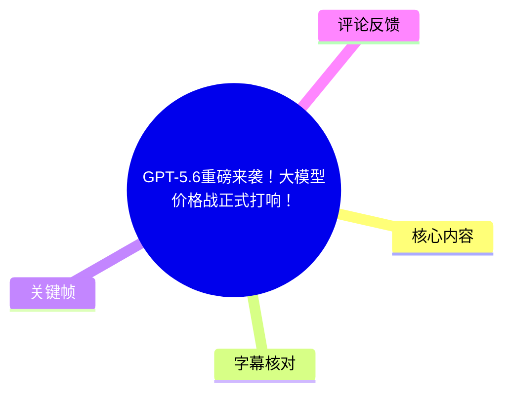
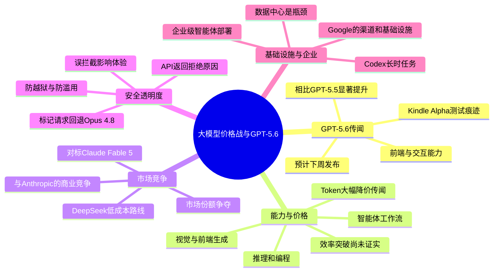
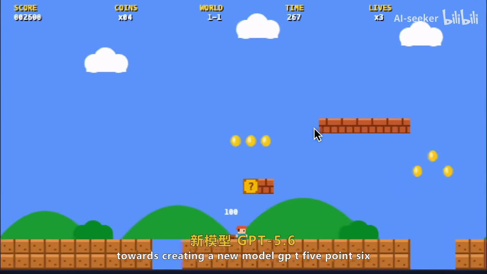
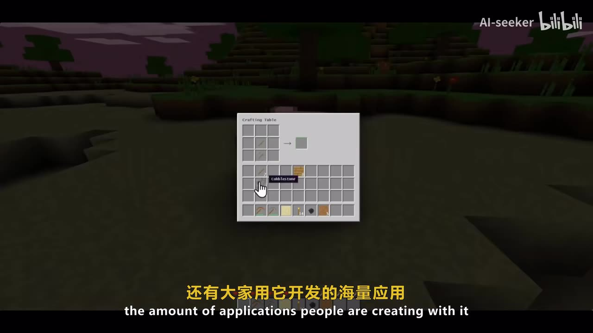
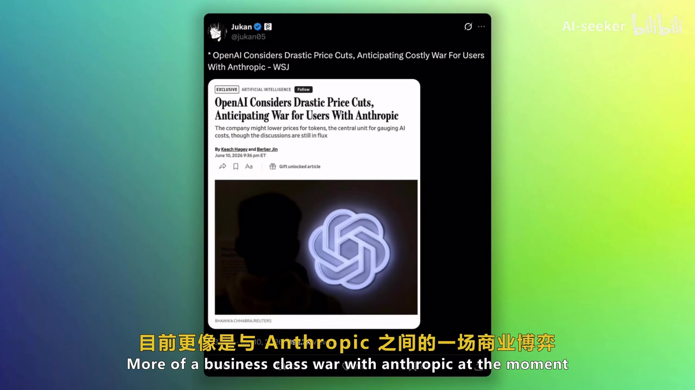
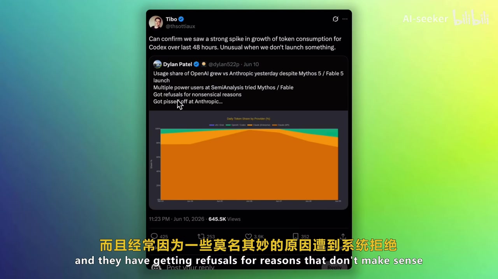

# GPT-5.6重磅来袭！大模型价格战正式打响！

> 来源：[Bilibili 视频](https://www.bilibili.com/video/BV1aUEz6mEdU) 
> UP 主：AI-seeker｜分 P：中文配音 / 双语字幕｜单 P 时长：08:01（481 秒） 
> 注意：页面元数据总时长为 962 秒，来自两个内容相同、各 481 秒的分 P；本文时间轴均对应 **p01「中文配音」**。

## 小结

视频围绕一组处于快速变化中的大模型新闻展开：OpenAI 被称正在准备 GPT-5.6，且据视频转述，可能会在“下周”发布，并在推理、编程、智能体工作流、视觉和前端生成等方向加强能力。视频将其放在与“Claude Fable 5”竞争的背景下讨论；不过该模型名称在站内多语种字幕、ASR 与画面文字中均存在转写混乱，因此应将其视作视频的原始称呼，而非已经核验的正式产品名。

核心判断是：若 GPT-5.6 以更低 Token 价格推出，视频作者更倾向于把它理解成 OpenAI 为获取用户、维持竞争力而进行的商业与定价策略，而不是已经被证明的推理效率突破。作者用 DeepSeek 的“强大且高效、因而低成本”路线作为对照，并明确表示 OpenAI 是否真正达到这一效率水平仍未得到证实。

第二条主线讨论 Anthropic 的安全机制透明度。视频称，对被标记的请求会显式回退至 Opus 4.8，并在 API 返回具体拒绝原因；这样做意在让用户知道发生了何种安全处理。作者认可强模型需要防越狱与防滥用，但认为频繁且不透明的误拦截会损害实际使用体验，并可能把部分用户推向 Codex 等替代工具。

最后，视频从算力和基础设施角度比较竞争格局：作者认为数据中心是行业关键瓶颈，Google 的分发渠道和基础设施使其长期位置较稳；同时转述 OpenAI 收购一家被站内英文字幕写作 “Honor”、主营安全云端执行技术的公司，意图是增强 Codex 的长任务运行和企业级智能体部署能力。这一收购名称及细节仅来自视频转述，未在本素材中获得独立验证。

本视频适合关注模型产品、API 成本、智能体工程及模型安全机制的读者。它不是产品发布公告或定价文档：其中“爆料”“预计”“据称”“可能”等内容均具有新闻时效性，不能据此直接作为采购、部署或能力对比结论。

## 思维导图

## 目录

- [新闻背景与信息边界](#新闻背景与信息边界)
- [GPT-5.6：测试线索、预期能力与竞争压力](#gpt-56测试线索预期能力与竞争压力)
- [低价 Token：效率突破还是市场补贴](#低价-token效率突破还是市场补贴)
- [安全机制：显式回退、拒绝原因与使用摩擦](#安全机制显式回退拒绝原因与使用摩擦)
- [基础设施、Google 与 Codex 企业布局](#基础设施google-与-codex-企业布局)
- [可迁移的分析方法与限制](#可迁移的分析方法与限制)
- [字幕比对](#字幕比对)
- [评论分析](#评论分析)
- [处理记录](#处理记录)

## [新闻背景与信息边界](https://www.bilibili.com/video/BV1aUEz6mEdU?t=0)

视频开头称，过去数日乃至整周的注意力集中在“Claude Fable 5”上，并认为这给 OpenAI、Google 及开源社区带来竞争压力。随后话题转向 OpenAI 正在研发 GPT-5.6。

需要先区分以下三层信息：

1. **视频转述的新闻事实**：GPT-5.6、模型竞技场中出现的 “Kindle Alpha / Kindle”、可能的价格调整、Anthropic 的安全机制说明、OpenAI 的收购消息。
2. **作者判断**：低价更像营销与商业动作；Google 长期不易失去竞争地位；安全机制透明度不足造成用户流失。
3. **尚未验证的推断**：低价是否由真实效率改进支撑、匿名竞技场模型是否确为 GPT-5.6、收购的公司名称和具体整合效果等。

视频叙述时点为 **2026 年 6 月 11 日**：作者在后半段以“今天是 6 月 11 日”“6 月 22 日下线”计算某模型约 11 天的在线期。页面素材显示视频于 2026 年 6 月 12 日发布，素材抓取时间则为 2026 年 7 月 15 日；因此“下周发布”“本周开始”等相对时间均已过期，不能理解为当前状态。

## [GPT-5.6：测试线索、预期能力与竞争压力](https://www.bilibili.com/video/BV1aUEz6mEdU?t=35)

### 1. 视频给出的发布与测试线索

视频在 [00:34](https://www.bilibili.com/video/BV1aUEz6mEdU?t=34) 至 [01:29](https://www.bilibili.com/video/BV1aUEz6mEdU?t=89) 提出：

- OpenAI 正在研发 GPT-5.6，且“预计下周发布”；
- 视频转述 OpenAI 首席科学家 Jakub Pachocki 的说法：GPT-5.6 相比 GPT-5.5 会有显著提升；
- LMSYS Arena 中曾出现名为 **Kindle Alpha** 的模型，Chatbot Arena 中也出现 **Kindle**；
- 作者将这些匿名/临时模型的出现解释为：GPT-5.6 正在测试前端和交互能力，而这被认为是其当前需要补足的方向。

这里应避免把“Kindle / Kindle Alpha = GPT-5.6”写成确定事实。视频提供的是关联性解读，而非官方身份确认；站内字幕也将平台名、模型名和部分专有名词写得不稳定。

> 图：关键帧字幕直接出现“新模型 GPT-5.6”，并以游戏画面作视觉转场，适合定位视频从竞争背景切入 GPT-5.6 话题的节点。它只能证明视频的叙述内容，不能证明模型已正式发布。

### 2. 预期能力范围

在 [02:38](https://www.bilibili.com/video/BV1aUEz6mEdU?t=158) 至 [02:50](https://www.bilibili.com/video/BV1aUEz6mEdU?t=170)，视频列出的 GPT-5.6 预期强化方向为：

| 方向 | 视频表述 | 对实际评估的含义 |
| --- | --- | --- |
| 推理 | “重大提升” | 需要以多步推理、约束满足、错误率等测试验证。 |
| 编程 | “重大提升” | 应区分代码补全、修复、仓库级任务和工具调用。 |
| 智能体工作流 | 预计增强 | 应关注任务成功率、工具调用可靠性、恢复能力及成本。 |
| 视觉 | 预计增强 | 需要独立验证多模态理解、图像定位和视觉推理。 |
| 前端生成 | 预计增强 | 不应仅看页面外观，还应验证交互、可维护性、响应式布局与 Bug 率。 |

视频没有给出任何正式 API 型号、上下文窗口、基准分数、Token 单价或可用地区/套餐，因而不能从中推导具体技术参数。

### 3. “Fable 5”能力示例的边界

在 [01:47](https://www.bilibili.com/video/BV1aUEz6mEdU?t=107) 至 [01:59](https://www.bilibili.com/video/BV1aUEz6mEdU?t=119)，作者以“可快速制作《我的世界》高仿版”和 X 平台上大量生成案例，说明其所称“Fable 5”的能力上限与市场冲击。

> 图：画面展示块状世界中的合成界面，配合“大家用它开发的海量应用”的字幕，直观说明作者用游戏/应用生成案例来论证模型能力。但该画面是视频展示的案例，不等同于严谨的能力基准或可复现测试。

## [低价 Token：效率突破还是市场补贴](https://www.bilibili.com/video/BV1aUEz6mEdU?t=121)

### 1. 视频的价格战叙事

从 [02:01](https://www.bilibili.com/video/BV1aUEz6mEdU?t=121) 开始，视频称 GPT-5.6 **可能**以更低价格提供，并进一步转述多方消息称 OpenAI 考虑大幅下调 Token 价格。作者的观点是：

- 大模型实际运行成本很高；
- 因此，低价不必然意味着模型已拥有显著效率优势；
- 更可能是 OpenAI 短期承担一部分成本，以获取更多用户、维持竞争力；
- 这场竞争在作者看来更接近与 Anthropic 的商业博弈或“价格战”。

> 图：画面中是有关 OpenAI 考虑大幅价格下调、与 Anthropic 展开用户成本竞争的报道截图。它是视频论述“价格战”依据的可视化来源，但截图本身未提供可核验的完整价格表或官方公告。

### 2. DeepSeek 作为对照路线

在 [03:09](https://www.bilibili.com/video/BV1aUEz6mEdU?t=189) 至 [03:29](https://www.bilibili.com/video/BV1aUEz6mEdU?t=209)，作者用 DeepSeek 概括一种不同路径：

1. 同时追求模型强度与运行效率；
2. 通过效率让对外服务成本更低；
3. 若 OpenAI 也能以极低价格提供同级强模型，才可视为显著甚至“革命性”的效率突破；
4. 但作者认为，现阶段更可能是亏损换取市场份额。

这是一个有用的成本分析框架，但结论仍属于作者意见。评估“低价”的真实含义至少要分开看：

- **标价**：输入/输出 Token 单价、缓存价、批处理价；
- **实际账单**：重试、思考 Token、工具调用、图片/视频输入等是否额外计费；
- **单位任务成本**：完成同一任务需消耗多少 Token、多少轮调用；
- **可靠性成本**：拒答、超时、Bug、人工修复是否抵消单价优势；
- **可持续性**：促销、补贴与长期稳定价格不可混为一谈。

### 3. 使用量变化与安全体验的关联假设

在 [03:49](https://www.bilibili.com/video/BV1aUEz6mEdU?t=229) 至 [04:32](https://www.bilibili.com/video/BV1aUEz6mEdU?t=272)，视频称一张“每日 Token 份额”图表显示 OpenAI 在竞争对手新模型上线后仍有进展；Codex 负责人也被转述为确认过去 48 小时 Token 消耗显著增长，尽管近期没有新发布。

作者提出的解释是：竞争模型的安全限制和不透明拒绝可能让用户感到挫败，从而增加对 Codex 等工具的使用。这是**可能的因果解释**，不是视频提供的数据能够单独证明的因果关系；Token 用量也可能受产品活动、用户结构、容量供给或其他因素影响。

> 图：画面包含关于 Codex Token 消耗增长的帖文及图表，字幕讨论用户遭遇难以理解的拒绝。该帧有助于理解作者把“安全摩擦”与“用量流动”联系起来的论证链条，但不能替代完整数据集与归因分析。

## [安全机制：显式回退、拒绝原因与使用摩擦](https://www.bilibili.com/video/BV1aUEz6mEdU?t=272)

### 1. 视频转述的机制

在 [04:37](https://www.bilibili.com/video/BV1aUEz6mEdU?t=277) 至 [05:14](https://www.bilibili.com/video/BV1aUEz6mEdU?t=314)，视频称 Anthropic 为提高透明度采取了以下方式：

1. 从当周开始，被标记的请求会**显式回退**到 **Opus 4.8**；
2. 该处理被描述为符合网络安全和生物安全方面的防护机制；
3. 用户可见请求已经回退到 Opus 4.8；
4. API 场景中，被拦截的请求会返回具体拒绝原因或触发原因。

可将其理解为把原本“模型为何突然变了/为何拒答”的黑箱过程，改为可观察的状态和理由反馈。对开发者而言，其直接价值在于排障和产品体验管理：至少能知道是正常模型回答、策略阻断，还是回退到特定版本。

### 2. 安全与可用性之间的张力

视频在 [05:21](https://www.bilibili.com/video/BV1aUEz6mEdU?t=321) 至 [06:31](https://www.bilibili.com/video/BV1aUEz6mEdU?t=391) 的立场较明确：

- 对强模型而言，防越狱、防恶意使用是必要的；
- 安全机制需要反复测试、持续微调；
- 但若用户面对无解释的拒绝、误判或“未输入风险内容也被拦截”，就会觉得模型无法正常使用；
- 透明度不足会加剧挫败感。

视频还称某模型从 6 月 11 日到 6 月 22 日仅上线约 11 天，且不会对所有人开放。该时间窗口是作者在当时的计算与批评依据；本素材未提供该模型的正式名称、开放范围或下线公告，不能扩展为普遍产品政策。

### 3. 面向开发者的实际检查步骤

视频没有演示 API 操作命令，但基于其讨论可整理出一套不超出原意的使用检查流程：

1. **记录实际模型标识**：不要仅记录调用请求的模型名，也记录响应中是否出现回退/安全状态。
2. **保存结构化拒绝信息**：包括 HTTP 状态、错误码、拒绝原因、触发类别与请求 ID。
3. **区分安全拒绝与技术失败**：超时、限流、内容拦截、权限不足应分别统计。
4. **构建合法测试集**：以经过授权且不包含高风险操作的样例检查误拒率；不要尝试绕过安全防护。
5. **准备任务降级路径**：当特定请求被安全回退或拒绝时，向用户解释状态，并提供可接受的替代任务范围。
6. **以任务成功率而非单次演示判断模型**：尤其是前端生成和智能体工作流，应同时检查正确性、失败恢复、成本与人工修复量。

## [基础设施、Google 与 Codex 企业布局](https://www.bilibili.com/video/BV1aUEz6mEdU?t=402)

### 1. 数据中心是竞争约束

在 [06:42](https://www.bilibili.com/video/BV1aUEz6mEdU?t=402) 至 [07:24](https://www.bilibili.com/video/BV1aUEz6mEdU?t=444)，作者指出数据中心是行业最大的限制之一，并转述：

- 即使 Anthropic 的营收高于其他 AI 模型公司，仍难独自建设数据中心；
- 据称 Anthropic 希望获得 Google 在这一层面的帮助；
- Google 尽管当前模型存在“不够强大/竞争力不足”的问题，但拥有大规模分发渠道和可向其他实验室提供的基础设施；
- 因而作者看好 Google 的长期地位。

这里的关键经验不是“某家公司一定会赢”，而是：模型能力、推理成本、云基础设施、分发渠道和企业交付能力共同决定竞争格局。只比较某次排行榜或单项能力，无法完整评估商业护城河。

### 2. OpenAI 与 Codex 的企业侧动作

在 [07:24](https://www.bilibili.com/video/BV1aUEz6mEdU?t=444) 至 [07:58](https://www.bilibili.com/video/BV1aUEz6mEdU?t=478)，视频称 OpenAI 宣布收购一家专注“安全云端执行技术”的公司。站内英文字幕写作 **Honor**，本次 ASR 则识别为 **Owner**；名称存在冲突，因此本文不将其作为已确认实体名。

按视频所述，这一动作可能帮助 Codex：

- 处理运行时间更长的任务；
- 在用户合上笔记本电脑后继续运行；
- 帮助更多企业在生产环境安全部署智能体；
- 强化企业环境中的智能体部署与管理基础设施。

作者的判断是，这更偏向企业市场布局，不会立即对消费端造成很大影响。视频没有说明收购价格、交割状态、产品整合路线、数据隔离设计或企业 SLA，因此这些均不能补充推断。

## [可迁移的分析方法与限制](https://www.bilibili.com/video/BV1aUEz6mEdU?t=478)

### 对类似模型新闻的阅读方法

- **先辨别信源等级**：官方发布、官方高管原话、媒体报道、匿名竞技场线索、作者推测的可信度不同。
- **把“价格”拆成成本结构**：低 Token 单价不自动等于低任务成本，更不自动等于模型高效。
- **将模型能力与产品可用性分开**：推理、代码和前端生成的演示能力，不等于稳定的生产体验。
- **把安全透明度纳入评测**：记录拒绝率、可解释性、错误原因与回退行为，避免只比较“是否能答”。
- **关注基础设施约束**：长任务、后台执行、企业部署和数据中心供给，是模型能力之外的重要变量。

### 本视频与本文的限制

1. 视频以 AI 翻译配音形式发布，且站内中文、英文及 ASR 都有专有名词误写或混写。
2. “Claude Fable 5”“Kindle/Kindle Alpha”“Honor”等名称未得到素材内独立官方材料确认。
3. 视频中的“预计”“爆料”“据称”“可能降价”等均不是正式承诺，且新闻时点已过。
4. 视频未提供 GPT-5.6 的价格、上下文长度、吞吐、模型版本、评测数据或 API 文档。
5. 两个分 P 似为中文配音与双语字幕版本，本文仅依据有完整语音 ASR 的 p01 建立时间轴，不把页面总时长 962 秒误当作单段内容长度。

## 字幕比对

| 字幕来源 | 完整性 | 专有名词 | 时间轴 | 主要问题 |
| --- | --- | --- | --- | --- |
| Bilibili 站内中文字幕 `p01-ai-zh.srt` | 覆盖约 00:00–08:00，分段细 | 大量音译/识别混乱，如“clothe fable5”“FACEBOOK5”“ANTHORPIC”“OPPO4.8” | 优秀，可直接使用真实分段 | 部分断句不自然，模型名、平台名和公司名误写较多。 |
| Bilibili 站内英文字幕 `p01-ai-en.srt` | 覆盖约 00:00–08:00 | `GPT-5.6`、`Opus 4.8`、`Codex`较稳定；但保留 “Claude Fable 5”，收购对象写作 `Honor` | 优秀，可交叉校对 | 个别句子重复、拼接异常；“Fable 5”是否为正式名称无法由字幕确认。 |
| 本次 ASR `medium` | 语音覆盖 440.45 秒，覆盖率 91.66%；首段语音约在 00:33 | `GPT-5.6`、Anthropic、Codex多数可辨；出现 Claw、RMSIS、Deepseq、FB5、Anthorpeak、Owner 等误识别 | 有时间戳，但为约 24 秒长段，不适合细粒度逐句定位 | 开头 33 秒无语音识别，专名错误较多，部分词语粘连。 |

### 最终字幕选择

- **时间轴优先使用站内 p01 字幕的真实 SRT 分段**，因为其从 00:00 起连续覆盖，且粒度更细。
- **中文表达以站内中文字幕为基础，并用英文站内字幕与本次中文 ASR 交叉校对**。
- 本次 ASR 已检查：诊断显示 `language=zh`、`noAudioStream` **未标记为 true**，说明源视频存在可识别音轨；这不是无音轨视频。
- 关键校正原则如下：
  - 统一写作 **GPT-5.6、GPT-5.5、OpenAI、Google、Anthropic、Codex、Opus 4.8、LMSYS Arena、Chatbot Arena、DeepSeek**；
  - 对无法由素材确定的“Claude Fable 5”保留视频中的称呼，并加引号或说明其命名不确定；
  - 对收购对象不采用 ASR 的“Owner”作为事实名称，正文仅表述为“站内英文字幕写作 Honor、ASR 写作 Owner，存在冲突”。

## 评论分析

本次仅获取到 2 条热评，少于“热评前三条”的上限；因此只分析可获取的两条，不补造第 3 条。

1. **天衍将神（279 赞）**  
   评论认为“半年后”或可用上具备 Fable 5 / GPT-5.6 Pro 级别能力的 DeepSeek，并以表情表达调侃。其反映的是用户对能力快速扩散、国产低成本替代方案的期待。该说法是主观预测，没有给出产品路线、测试依据或时间表，不能当作行业事实。

2. **最小空间（65 赞）**  
   评论重点是前端生成体验：因认为 GPT 前端效果不佳而转用 Gemini，又对 Gemini 在约 5 分钟花费 6 美元、前端 Bug 多的体验表示不满，最后仍使用 GPT 修复。它补充了视频“前端能力与价格/成本”话题中的真实用户感受：视觉效果、稳定性、修复成本与单次账单需要一起看。  
   但该评论是个体使用案例，未说明具体模型版本、任务复杂度、计费币种/套餐、提示词、调用方式及复现条件，不能据此比较产品整体性能或定价。

## 处理记录

- Worker ID：`worker-mrj0wbly-5dc4e50c`
- 整理模型：`gpt-5.6-terra`
- 使用素材与工具结果：
  - 视频元数据与分 P 信息；
  - 关键帧：`frames/frame-001.jpg` 至 `frames/frame-006.jpg`；
  - 站内时间轴字幕：`p01-ai-zh.srt`、`p01-ai-en.srt` 及其他语言版本；
  - 本次 ASR：`asr/transcript.srt`、`asr/asr-result.json`，模型为 `medium`、CUDA `float16`；
  - 评论数据：`comments/comments.json`，请求上限为 3，实际返回 2 条。
- 字幕选择：站内 p01 的中英文 SRT 用于精确时间定位；中文站内字幕作为中文叙述底稿；英文字幕和本次 ASR 用于专有名词交叉校对。ASR 存在音轨，未出现 `noAudioStream=true`。
- 关键帧选择依据：
  - `frame-001.jpg`：画面直接引出“新模型 GPT-5.6”；
  - `frame-002.jpg`：对应视频用于论证模型应用生成能力的游戏案例；
  - `frame-003.jpg`：呈现“考虑大幅降价”的报道截图；
  - `frame-004.jpg`：呈现 Codex Token 消耗和安全拒绝讨论。
  - 未使用其余关键帧，避免在无法准确对应其内容与时间点时作过度解释。
- 缓存清理：本任务提供的素材清单未包含缓存清理执行日志；未将未记录的清理操作表述为已完成。
- 未解决问题：
  - “Claude Fable 5”的正式产品名称无法由现有素材确认；
  - “Kindle / Kindle Alpha”与 GPT-5.6 的对应关系未获官方确认；
  - 收购对象在站内英文字幕与 ASR 中分别为 `Honor` 和 `Owner`，名称冲突；
  - 视频中的价格、发布计划和可用范围均需以当前官方公告/API 文档再次核验。
