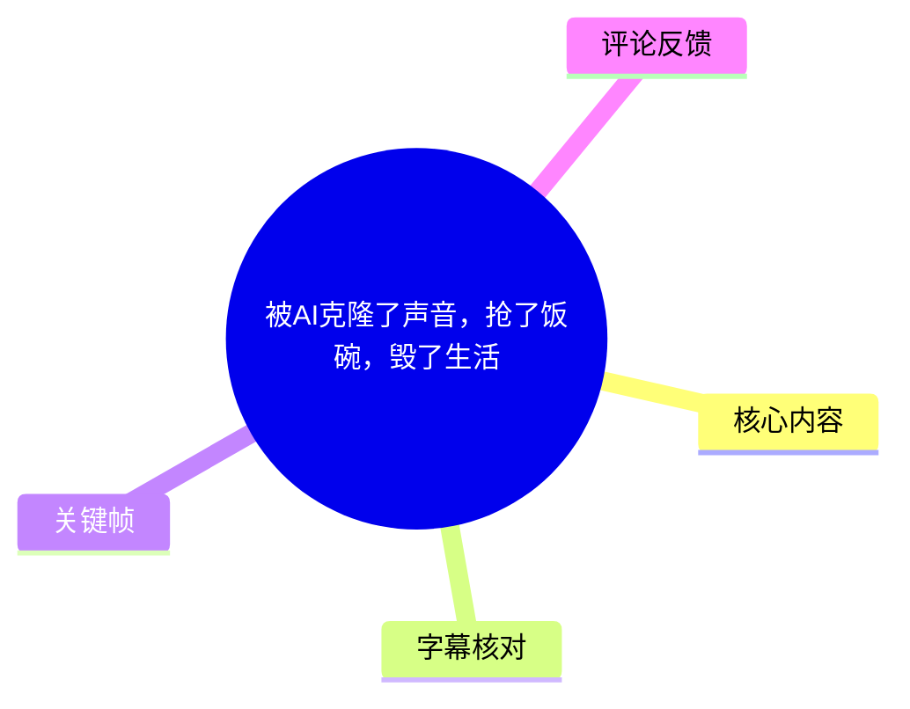
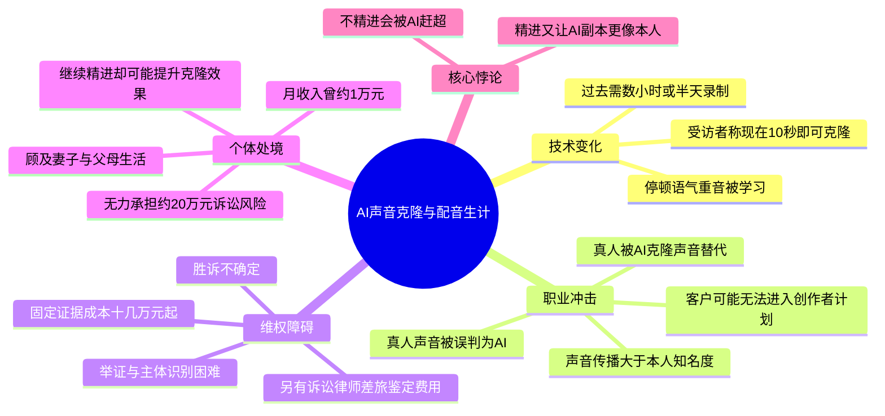
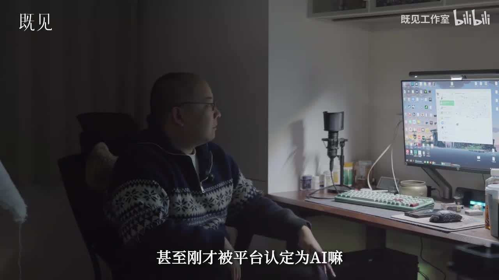
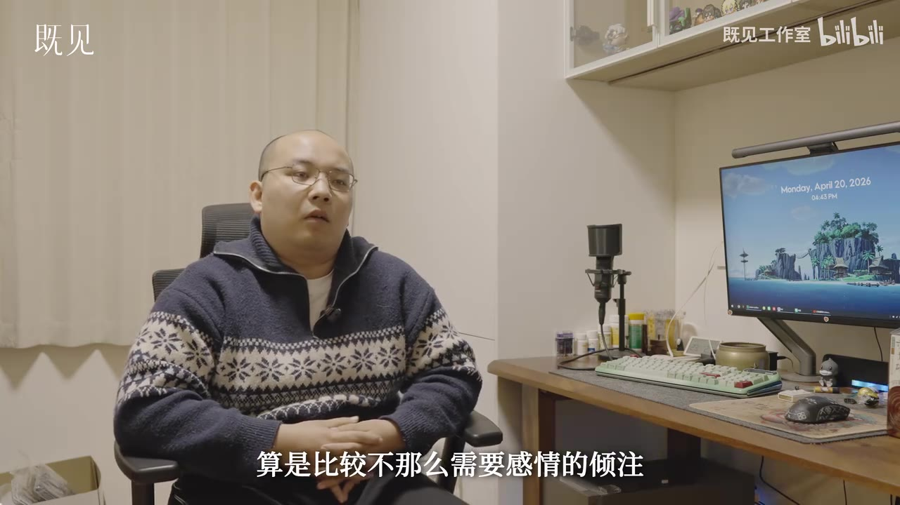
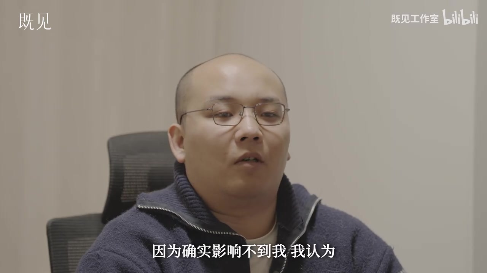
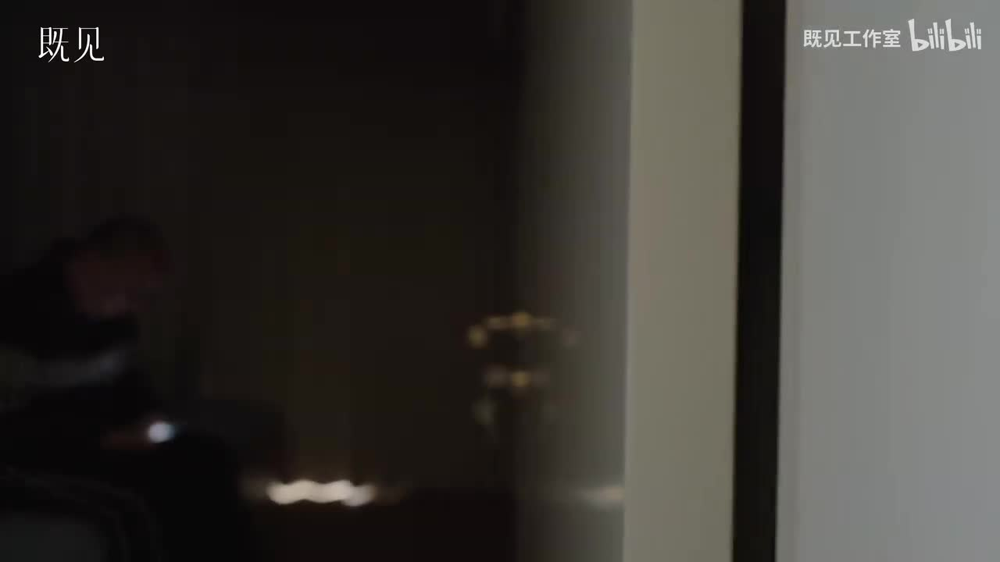

# 被AI克隆了声音，抢了饭碗，毁了生活

> 来源：[Bilibili 视频](https://www.bilibili.com/video/BV1RFL86UEud) 
> UP 主：既见工作室｜时长：09:27｜标签：配音、AI 配音、侵权、AI

## 小结

视频记录了一名短视频配音从业者面对 AI 声音克隆时的职业困境：AI 让其声音获得了远超本人知名度的传播，但也令大量受众和部分平台将真人声音误判为 AI 生成内容。他反复强调，自己并非反对技术本身，而是希望公众意识到该声音背后存在一名真实的劳动者。

最关键的技术变化是，当事人认为声音克隆所需的素材量已从过去的数小时、甚至半天录制，缩减到“10 秒钟就够了”。他还认为，AI 已学会短视频配音中常用的停顿、语气和重音等表达技巧；这使其声音可以被低成本复制、改调并替代真人服务。

视频呈现的影响并不止于“少接到单”。当事人称，使用其真人配音的客户也可能被平台判为 AI 内容，进而无法进入创作者计划，即使有流量也难以变现；部分客户因而难以承担真人配音成本，甚至改用其 AI 克隆声音。他还举例称，一位同行因被平台认定配音为 AI，只能依靠影视、短剧宣发工作维生。

维权是视频的另一条主线。当事人咨询律师后得知，案件可以起诉但胜诉并不确定；仅固定证据的初步费用就可能达到十几万元，另有诉讼费、律师费、差旅费和声音鉴定费。面对侵权主体分散、身份与证据难确认、财产保全困难等问题，他认为个人难以通过逐一诉讼阻断源头。

这是一段以个人经历为中心的访谈，不构成对声纹权、著作权、平台审核规则或具体案件胜率的法律结论。文中的金额、平台判定、替代案例和技术门槛均为受访者陈述，适合配音从业者、内容创作者、平台治理从业者及关注生成式 AI 权利边界的读者参考。

## 思维导图

## 目录

- [开场：AI 既“成就”也“毁掉”声音劳动者](#开场ai-既成就也毁掉声音劳动者)
- [从入门设备到月入约一万元的配音工作](#从入门设备到月入约一万元的配音工作)
- [技术变化：从长时录制到“10 秒钟就够了”](#技术变化从长时录制到-10-秒钟就够了)
- [声音更像真人后：技巧被复制与身份被抹去](#声音更像真人后技巧被复制与身份被抹去)
- [商业链条影响：客户、平台审核与低价替代](#商业链条影响客户平台审核与低价替代)
- [维权路径与成本结构](#维权路径与成本结构)
- [无法退出的悖论：继续精进，还是被自己的 AI 超越](#无法退出的悖论继续精进还是被自己的-ai-超越)
- [可迁移经验、限制与时效性](#可迁移经验限制与时效性)
- [字幕比对](#字幕比对)
- [评论分析](#评论分析)
- [处理记录](#处理记录)

## [开场：AI 既“成就”也“毁掉”声音劳动者](https://www.bilibili.com/video/BV1RFL86UEud?t=0)

视频开头以“AI 也成就了我，也毁了我”概括受访者的矛盾处境。其陈述的逻辑是：

1. **AI 扩大了声音传播**：若没有 AI，他的声音不会有如此大的传播度。
2. **声音传播没有转化为真人的可见性**：声音“出名”后，他本人仍不为人所知。
3. **真人反被误判为 AI**：他称自己刚被平台认定为 AI，且除合作客户外，许多人已不认为该声音属于真人。
4. **诉求并非复杂的商业主张**：他多次把诉求收束为“让更多人知道我是个人”。

> 图：画面将受访者、麦克风、电脑与“甚至刚才被平台认定为 AI 嘛”的字幕并置，直接呈现了本片最核心的反讽：以真人身份从事配音的人，被平台系统与公众当作 AI。

## [从入门设备到月入约一万元的配音工作](https://www.bilibili.com/video/BV1RFL86UEud?t=76)

受访者介绍自己的日常工作环境：工作和娱乐基本都在同一张桌前完成，所用是“入门设备”，每天坐在这里等待订单，真正录音的时间反而很少。他将自己定位为“拿嗓子搬砖的人”，强调这是依靠声音换取报酬的普通职业劳动。

他回顾，自己当时平均月收入约为 **1 万元**。在他的自我判断中，所承接的短视频配音内容相对不那么依赖强烈情感投入或高难度表演技巧；但后文显示，即使是这类看似标准化的工作，仍包含可被模型模仿的表达控制。

> 图：该关键帧展示了受访者的实际工作环境及基础录音设备，有助于理解“入门设备、等单、录音时间少”并非抽象描述，而是其个体化的工作场景。

### 工作模式与收入信息

| 项目 | 视频中的陈述 | 含义与边界 |
| --- | --- | --- |
| 工作地点 | 工作、娱乐都在同一处 | 反映个人/小型自由职业工作状态，不代表整个配音行业 |
| 设备 | 入门设备 | 视频未给出麦克风、声卡、软件或型号，不能补充推断 |
| 获客模式 | 每天等待订单 | 未说明订单平台、合同形式或客户类型 |
| 录音时长 | 实际录音时间很少 | 可能意味着等单、沟通、修改等非录音环节占比高，但视频未展开 |
| 月收入 | 平均约 1 万元 | 为受访者自述，未说明统计周期、税前税后或收入构成 |

## [技术变化：从长时录制到“10 秒钟就够了”](https://www.bilibili.com/video/BV1RFL86UEud?t=23)

受访者将声音克隆风险归因于样本需求的大幅下降。他的描述是：过去如果要让一个人参与 TTS（文本转语音）录制，需要录制很久，可能持续数小时甚至半天；如今，“10 秒钟就够了”。

这段表述揭示了视频中的风险模型：当训练或模仿所需样本缩短后，声音素材更容易从公开视频、短视频、直播切片或其他已公开内容中被获取，声源本人对素材流向的控制难度随之上升。

需要严格区分两层含义：

- **视频可直接支持的事实**：受访者认为，当前 AI 声音复制可在极短样本下实现；他本人因此遭受声音被广泛使用的困扰。
- **不能由视频直接推出的结论**：所有声音模型都只需要 10 秒样本，或任意 10 秒录音都能制作高保真、稳定且可商用的声音克隆。这取决于具体模型、录音质量、语言、目标效果、后处理流程和服务提供方。

### 视频中出现的技术要素

| 要素 | 视频表述 | 对职业风险的意义 |
| --- | --- | --- |
| TTS 录制 | 过去需要“录那个 TTS 单子” | 原先录音行为更显性，通常需要声源方投入较多时间 |
| 样本时长 | 过去数小时或半天；现在称 10 秒即可 | 获取门槛下降，公开声音的可复制性上升 |
| 声音传播 | AI 令其声音传播更广 | 同一传播机制可能同时扩大知名度与滥用面 |
| 改调 | 后文称“变个调就行了” | 受访者认为简单变调即可让 AI 声音被继续使用或规避识别 |

## [声音更像真人后：技巧被复制与身份被抹去](https://www.bilibili.com/video/BV1RFL86UEud?t=120)

受访者回忆，约在 **2023 年 11 月**，他注意到一个账号：该账号起初做名人传记类内容，后来转为音乐分享。当时他觉得 AI 配音“很烂，一听就不是个人”，因此并不在意，也认为这不会影响自己。

之后，他感到 AI 配音越来越真实，技术发展速度很快。尤其在短视频配音场景中，他认为模型已经学会并覆盖了他在交付给客户时使用的主要技巧，包括：

- 停顿；
- 语气；
- 重音；
- 适用于短视频配音的其他表达控制。

> 图：近景与字幕对应其早期“影响不到我”的判断。它帮助理解受访者的态度如何从无所谓转为感到直接威胁，而非把技术冲击描述成一开始就完全可预见的事件。

### 从“听得出是 AI”到“真人被当作 AI”

受访者的核心经验不是单纯的“AI 像人”，而是身份关系发生反转：

1. AI 模仿真人的停顿、语气、重音等表达方式；
2. 听众逐渐习惯或相信这一声音是 AI；
3. 真人本人重新发声时，反而被认定为 AI；
4. 声音可以持续传播，但真人身份、署名、报酬与控制权没有同步获得承认。

他以“赛博永生”形容这种处境：AI 副本似乎会永久流传，但知道原型是谁的人只有他自己。这是受访者的情绪化表达，并不是有关数字身份或模型永久性的技术保证。

## [商业链条影响：客户、平台审核与低价替代](https://www.bilibili.com/video/BV1RFL86UEud?t=265)

视频在约 04:25 后转入具体商业纠纷与平台生态。受访者播放或转述了与账号运营者的沟通：对方称其账号一个月只赚 **8000 元**，原本有尊重版权、与其合作的想法，但希望当事人也理解其经营压力。受访者认为，这种“退一半”的处理很苛刻。

随后，他提到自己的收入可能进一步少三分之一，并出现“扣 3000 和返 7000”的讨论。视频未完整交代该笔款项的合同背景、原始报价或法律责任归属，因此只能将其作为一次协商/争议中的金额记录，不能据此判断任何一方是否具有法律过错。

### AI 替代与报价压力

在约 05:11 处，受访者表示，若使用 AI 配音，对方愿意按 **“100 字 5 块”** 支付。该价格是视频中的特定协商信息，不能外推为市场统一价格。

他对替代机制的描述包括：

- AI 内容能进入“精选”；
- 使用方只需改变音调；
- 由于人们认为他是 AI，他本人接的真人配音订单也可能被平台判为 AI；
- 被判为 AI 后，客户无法进入创作者计划；
- 客户即使获得流量，也可能难以赚到钱；
- 为节约成本，客户可能放弃真人配音，改为使用其 AI 声音。

### 受访者描述的平台审核连锁反应

| 环节 | 受访者的陈述 | 可能造成的后果 |
| --- | --- | --- |
| 声音标签 | 平台把他的真人配音判为 AI | 客户内容的身份属性被改变 |
| 创作者计划 | 客户无法进入 | 内容变现渠道受限 |
| 收益 | 即使有流量也“基本赚不到钱” | 客户继续支付真人配音费用的意愿下降 |
| 人员替代 | 已知有“换人换成我的 AI 配音”的情况 | 原声从业者失去订单 |
| 同行案例 | “小班班”被平台多次认定为 AI 配音 | 对方只能接电影、短剧宣发维生 |

以上内容是受访者对平台机制与市场选择的说明。视频没有展示平台通知原文、审核规则、账号后台数据、合同或订单记录，因而不能将其视为已完成独立核验的平台政策事实。

## [维权路径与成本结构](https://www.bilibili.com/video/BV1RFL86UEud?t=394)

面对声音被克隆和使用的问题，受访者称自己咨询过律师。律师给出的意见并非“不能起诉”，而是：可以起诉，但胜诉概率并不高，前期投入很大，也没有胜诉保证。

他陈述的前期成本结构如下：

| 成本/障碍 | 视频中的描述 | 时间点 |
| --- | --- | --- |
| 固定证据 | 初步估计“光固定证据的钱就要十几万” | [06:51](https://www.bilibili.com/video/BV1RFL86UEud?t=411) |
| 诉讼费 | 未计入前述固定证据成本 | [06:56](https://www.bilibili.com/video/BV1RFL86UEud?t=416) |
| 律师费 | 需要另行承担 | [06:57](https://www.bilibili.com/video/BV1RFL86UEud?t=417) |
| 差旅费 | 需要另行承担 | [06:58](https://www.bilibili.com/video/BV1RFL86UEud?t=418) |
| 声音鉴定费 | 需要另行承担 | [06:59](https://www.bilibili.com/video/BV1RFL86UEud?t=419) |
| 财产保全 | 他称此前保险公司不做财产保全 | [07:11](https://www.bilibili.com/video/BV1RFL86UEud?t=431) |
| 侵权主体 | 对方可能推出未成年人，导致难以起诉 | [07:21](https://www.bilibili.com/video/BV1RFL86UEud?t=441) |
| 核心难点 | 举证困难、维权困难 | [07:26](https://www.bilibili.com/video/BV1RFL86UEud?t=446) |

### 视频呈现的维权步骤

视频没有提供可直接照做的投诉或诉讼教程，但按当事人的叙述，可整理出其已经面对或预期面对的顺序：

1. **识别疑似侵权使用**：发现 AI 克隆声音在账号、内容或订单中被使用。
2. **尝试沟通/协商**：视频展示了与账号运营方围绕合作、退款和继续使用 AI 的争议。
3. **咨询律师**：评估是否可以起诉、胜诉不确定性和前期投入。
4. **固定证据**：当事人认为该环节本身就需十几万元。
5. **声音鉴定及其他支出**：包括鉴定、律师、差旅和诉讼成本。
6. **进入诉讼程序**：当事人称，前述资金投入后才能开始诉讼。
7. **承担执行与回收风险**：财产保全不确定、侵权主体难确认，都可能让投入难以收回。

这不是法律建议。不同法域、平台、侵权主体、证据保存方式、合同约定和司法实践会显著影响维权可行性。需要维权时，应保存原始链接、录屏、发布时间、账号主体信息、沟通记录、合同与付款凭证，并咨询具有相关经验的专业人士；这些是一般性风险控制建议，并非视频中的操作指令。

## [无法退出的悖论：继续精进，还是被自己的 AI 超越](https://www.bilibili.com/video/BV1RFL86UEud?t=450)

视频结尾从“如何维权”转为“为何仍要继续工作”。受访者说，自己的视频爆火后，他意识到不能总是发声，也不希望关注者把自己视为“无病呻吟的弱者”。他希望精进技艺，让作品更完美。

但他提出了全片最尖锐的悖论：

> 我越精进，我的 AI 也会更好。

在他的认知中，提升真人表达能力会让未来可获得的声音样本、风格特征或模仿目标也更丰富；但如果停止提升，AI 副本又可能超过自己。因此他最终给出的选择不是“战胜 AI”，而是继续精进，去追赶 AI。

约在 08:06 后，他用约 **20 万元** 形容起诉可能需要承担的资金风险，并表示自己“告不起”。他将判断建立在家庭责任之上：自己可以节衣缩食，但不能为了个人名誉或“一口气”而不顾妻子和父母的生活。

> 图：该画面以桌面、录音设备和受访者的工作空间构成安静的访谈场景，强化了视频结尾的现实感：这不是抽象的技术竞争，而是与个人工作、收入及家庭责任相连的生计问题。

## [可迁移经验、限制与时效性](https://www.bilibili.com/video/BV1RFL86UEud?t=530)

### 可迁移经验

1. **声音不只是可替换的素材，也关联身份与劳动关系**  
   在视频案例中，真正受损的不仅是音色被模仿，还包括真人被误判、客户被影响、合作机会减少，以及原型与副本之间的归属关系被切断。

2. **技术风险与平台治理风险需要分开讨论**  
   声音模型的模仿能力是一类技术问题；真人内容被误判、创作者计划资格受影响、侵权投诉与证据保存难，则是平台审核、商业分配与治理问题。将所有问题简单归咎于“AI”会遮蔽后两类机制。

3. **维权成本可能决定权利能否被实际行使**  
   视频中“可以告”与“告不起”并存：形式上的起诉可能性，并不等于个体有经济能力完成证据固定、鉴定、律师代理和后续执行。

4. **个人精进不能独自解决结构性问题**  
   受访者选择继续提升能力，是一种生计策略；但他同时指出，个人技能提升未必能阻止克隆模型同步提升。这说明从业者个体努力与制度性保护之间存在缺口。

### 关键限制

- 视频为单一受访者叙事，未展示完整的侵权样本、合同、平台审核通知、鉴定报告、律师意见书或法院文书。
- “10 秒钟就够了”“AI 能进精选”“真人配音会被判 AI”“100 字 5 块”等内容，应限定为受访者在特定情境中的陈述，不可直接概括为所有平台、所有模型或所有市场的普遍规则。
- 视频提及“保险公司不做财产保全”，但未说明保险产品、机构、申请时间、具体程序或拒绝理由，不能据此推断一般性财产保全规则。
- 受访者提及的同行“小班班”情况为转述，视频没有提供独立可验证的完整材料。
- 关键帧只能证明画面中可见的受访者、设备与字幕信息，不能独立证明声音克隆、侵权或平台审核过程。

### 时效性

- 素材记录显示视频发布于 **2026 年 5 月**；视频中回溯的关键节点包括 **2023 年末、约 2023 年 11 月**。
- 生成式语音模型的样本需求、音色控制能力、服务条款和平台审核政策变化很快。视频反映的是受访时的个人经验，不能代替当前平台规则或法律实践。
- 本片中的播放、互动、热评和账号收入等数据均具有时间敏感性，不应视为长期稳定数据。

## [字幕比对](https://www.bilibili.com/video/BV1RFL86UEud?t=0)

本次素材同时提供了站内多语种字幕和本次 ASR。已检查 ASR 结果：`language=zh`、语言置信度 `0.9921875`、音频时长约 `566.72` 秒、带时间戳、语音覆盖约 `76.59%`；**未标记 `noAudioStream=true`，说明源视频存在音轨**，并非无音轨素材。

| 字幕来源 | 完整性 | 专有名词/数字 | 时间轴 | 主要问题 |
| --- | --- | --- | --- | --- |
| Bilibili 站内中文字幕 `p01-ai-zh.srt` | 覆盖完整，细分段多 | “TTS”“创作者计划”“声音鉴定费”等大多可辨 | 时间戳精细，可直接使用 | 存在明显语音识别错误，如“背 AI”“白走五块”“赛博永生”附近断裂、“发声”被识别为其他词等；开场夹杂与主线无关的片段文字 |
| 本次 ASR `medium` | 覆盖约 434 秒语音，分为 33 段 | 保留了主要金额、TTS、平台判定等线索 | 有时间戳，但单段较长 | 多处同音错字或断词，如“拿嗓子搬磷”“赛破永生”“配饮”“警悬案”“拆履费”“无病深淫”；部分段落将访谈、画外内容连在一起 |
| 站内英文/日文/西文等译文字幕 | 与中文段落基本对应 | 对“10 秒”“1 万”“8000”“十几万”“20 万”等数字可交叉核对 | 时间轴与中文站内字幕一致 | 属二次翻译，部分措辞、专名和语义存在漂移，不作为中文事实转写主依据 |

### 最终字幕选择与校正原则

正文以**站内中文字幕的精细时间轴**为主，并以本次中文 ASR 交叉检查语义；对于两者都存在明显错字的地方，优先依据上下文和多语种字幕共同可确认的表达进行规范化转写。重要校正包括：

| 原始识别片段 | 正文采用表述 | 校正依据 |
| --- | --- | --- |
| “拿嗓子搬磷的人” | “拿嗓子搬砖的人” | 站内中文与 ASR 语境一致，符合受访者自我描述 |
| “赛破永生” | “赛博永生” | 站内中文、英文 `cyber immortality`、日文译文交叉一致 |
| “白走五块” | “100 字 5 块” | 站内中文分词虽错，英文、西文、日文、葡文均对应“每 100 字 5 元” |
| “警悬案” | “进精选” | 站内中文与多语种字幕均表达 AI 内容可进入精选/featured |
| “拆履费” | “差旅费” | 站内中文字幕可辨，且与律师费、诉讼费、鉴定费构成费用清单 |
| “无病深淫” | “无病呻吟” | 站内中文和语境可校正 |
| “这三天发展出了多少我的 AI” | “这三年发展出了多少我的 AI” | 前后明确均在谈“三年”，多语种站内字幕一致 |

关键帧中可直接读到“甚至刚才被平台认定为 AI”“算是比较不那么需要感情的倾注”“因为确实影响不到我”等字幕，与正文关键转折相互印证。

## [评论分析](https://www.bilibili.com/video/BV1RFL86UEud?t=0)

仅分析本次可获取的热评前三条；评论反映用户观点，不等同于经核验事实。

1. **幕末の十字架｜1218 赞**  
   > “翻译，配音，美术这几个行业受 AI 冲击太大了。”

   - **观点**：将视频中的配音困境扩展到翻译、美术等创意与内容生产行业。
   - **补充价值**：指出 AI 冲击可能具有跨职业特征，尤其涉及可数字化、可规模化复制的表达性劳动。
   - **限制**：评论没有提供行业数据、收入变化或具体案例，不能据此比较不同行业的实际冲击程度。

2. **铃流｜811 赞**  
   > “这里最大的问题不是 ai，而是维权困难。没有 ai 的时候，起诉侵权，赔的也不够律师费的。平台也不做一个好的投诉侵权机制，属于狼狈为奸。”

   - **观点**：认为核心矛盾是维权成本与平台投诉机制，而不只是 AI 技术。
   - **与视频的对应**：与受访者关于证据固定成本、诉讼不确定性、平台判定及维权困难的表述高度呼应。
   - **争议与边界**：其中“赔的也不够律师费”“平台狼狈为奸”是评论者判断，未给出案件文书或平台机制证据，不能作为事实结论。

3. **西敏寺世界｜391 赞**  
   > “那这样 ai 不是无视版权法吗”

   - **观点**：质疑 AI 声音克隆是否会绕过或弱化版权保护。
   - **讨论价值**：提出“技术使用”与“权利保护”之间的张力。
   - **概念限制**：视频主要讨论声音克隆、真人身份误判和维权成本；是否涉及版权、人格权、声音权益、合同权利或平台规则，需要依据具体法域和事实判断，不能仅凭视频直接得出“AI 无视版权法”的结论。

## [处理记录](https://www.bilibili.com/video/BV1RFL86UEud?t=0)

- Worker ID：`worker-mrj0wjed-b0c290ad`
- 模型：`gpt-5.6-terra`
- 调用工具与素材：视频元数据、站内多语种 SRT、`asr/transcript.srt`、`asr/asr-result.json`、关键帧目录、热评 JSON。
- ASR 检查：已检查本次 ASR；识别语言为中文，模型为 `medium`，使用 CUDA / float16，存在音轨且含时间戳；未出现 `noAudioStream=true`。
- 字幕选择：以站内中文字幕的细粒度时间轴为主体，以本次 ASR 核对中文语义，并参考英文、日文、西文、葡文字幕校正“赛博永生”“100 字 5 块”等关键错识别内容。
- 时间轴依据：章节跳转秒数优先取自站内 SRT 的真实起止时间，并与 ASR 段落起点交叉核验；未按正文文字顺序臆测时间。
- 关键帧依据：选用 `frame-001` 展示“真人被判 AI”的核心主张；`frame-003` 展示受访者的基础工作与录音环境；`frame-004` 展示其早期“影响不到我”的态度；`frame-002` 用于呈现片尾所关联的个人工作空间与生计语境。图片仅用于说明可见画面及字幕，不作为未展示事实的证明。
- 评论范围：仅处理素材中可获取的热评前三条。
- 缓存清理：本次仅使用任务提供的素材清单与文本内容进行整理，未生成或保留额外下载缓存；未提供可执行的缓存清理日志。
- 未解决问题：未提供声纹模型来源、侵权样本链接、合同、平台审核通知、律师文书、鉴定报告和法院材料；因此未对受访者关于侵权、平台规则、价格、收入、维权成功率的陈述作外部事实确认。

## 评论分析

- 热评 1：翻译，配音，美术这几个行业受AI冲击太大了。
- 热评 2：这里最大的问题不是ai，而是维权困难。没有ai的时候，起诉侵权，赔的也不够律师费的。平台也不做一个好的投诉侵权机制，属于狼狈为奸。
- 热评 3：那这样ai不是无视版权法吗

以上内容是观众反馈摘录，只用于补充理解视频反响，不作为正文事实依据。
