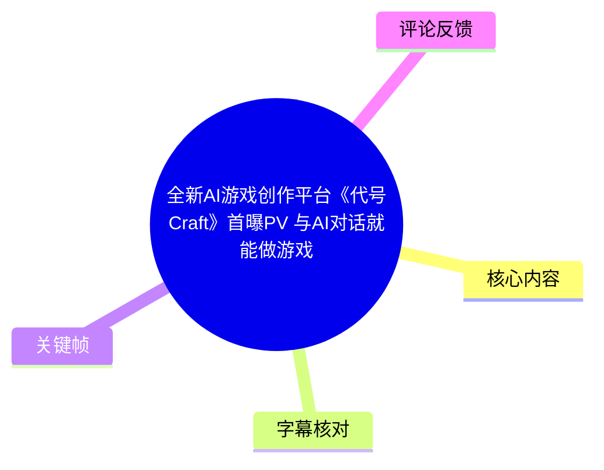
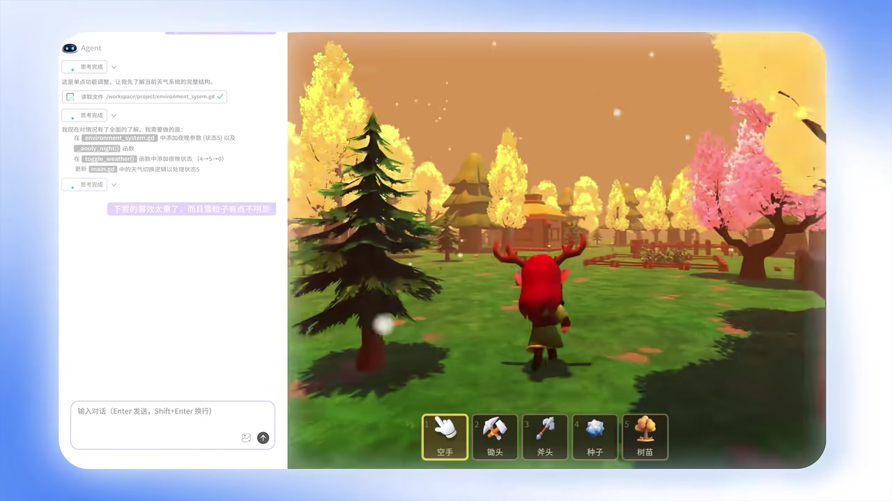
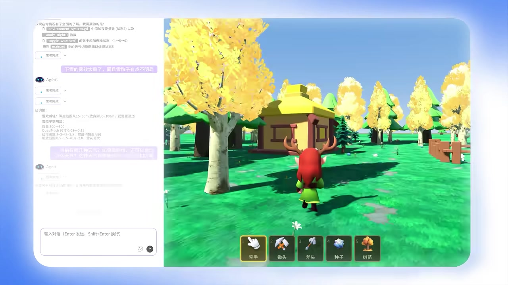

# 全新AI游戏创作平台《代号Craft》首曝PV 与AI对话就能做游戏

> 来源：[Bilibili 视频](https://www.bilibili.com/video/BV1ngGy6tEhZ)  
> UP 主：代号Craft｜分区/合集：AIcode｜视频时长：37 秒｜画面规格：1920×1080  
> 视频简介称：首测报名已开启，报名入口指向 [Bilibili 动态](https://www.bilibili.com/opus/1206998845171433489)。

## 小结

这是一支时长 37 秒的《代号Craft》首曝宣传 PV。视频及标题传达的核心定位是：用户可通过与 AI 对话来创作游戏；简介进一步确认该项目已开放“首测报名”。

从画面可确认，PV 展示了一个面向游戏创作的对话式工作流：用户先输入“制作一款 3D 模拟经营游戏，包含天气系统……”的需求，随后在聊天界面提出“可以做一个夜晚的天气吗”等增量要求；AI 侧显示会读取项目脚本并修改与天气相关的逻辑。右侧同步展示一款低多边形风格的 3D 游戏运行画面。

可从可见界面归纳出的能力边界是：平台至少试图将自然语言需求与项目文件、游戏内状态和实时预览结合起来。画面中可见 `environment_system.gd`、`toggle_weather()`、`_apply_night()` 等文件/函数名，以及天气状态由 `4→5→0` 切换的设计说明，表明演示并非只生成概念图，而是指向已有游戏项目的脚本级调整。

但 PV 没有给出完整操作过程、支持的游戏引擎、生成代码的完整内容、可导出格式、多人协作、性能指标、模型能力边界、计费规则或版权条款。因此，“与 AI 对话就能做游戏”应理解为官方宣传所展示的创作方向，不能据此推断其已经具备商业级游戏的全流程生产能力。

本条信息具有明显时效性：视频元数据表明其发布于 2026 年，且“首测报名开启”是发布阶段信息。测试资格、功能范围、入口有效性、内容权属和正式上线安排都可能后续变化，应以官方最新公告及实际产品协议为准。

## 思维导图



```mermaid
mindmap
  root((代号Craft 首曝PV))
    发布信息
      AI游戏创作平台
      首测报名开启
      37秒宣传演示
    创作方式
      自然语言描述需求
      AI读取项目文件
      修改游戏逻辑
      游戏画面预览
    演示项目
      3D模拟经营游戏
      天气系统
      夜晚天气需求
      低多边形场景
    可见技术线索
      environment_system.gd
      toggle_weather()
      _apply_night()
      状态4到5到0
    已知限制
      无站内字幕
      ASR无有效语音段
      无完整代码与参数
      版权和商用规则未说明
    社区反馈
      开源诉求
      版权与隐私疑问
      商业级能力质疑
```

## 目录

- [发布背景与信息边界](#发布背景与信息边界)
- [对话式游戏创作演示](#对话式游戏创作演示)
- [从需求到可运行场景的可见流程](#从需求到可运行场景的可见流程)
- [画面中可辨认的技术线索与参数](#画面中可辨认的技术线索与参数)
- [可迁移经验、限制与时效性](#可迁移经验限制与时效性)
- [字幕比对](#字幕比对)
- [评论分析](#评论分析)
- [处理记录](#处理记录)

## 发布背景与信息边界 [00:00](https://www.bilibili.com/video/BV1ngGy6tEhZ?t=0)

视频标题将《代号Craft》描述为“全新 AI 游戏创作平台”，并以“与 AI 对话就能做游戏”概括产品卖点。UP 主账号名称同为“代号Craft”，因此该 PV 可视为项目官方账号发布的首曝材料。

视频简介提供了两项额外但重要的发布信息：

1. **首测报名已开启**：简介明确给出报名提示及 Bilibili 动态链接。
2. **评论互动活动**：官方邀请观众以“我想用 AI 做一个……”描述游戏灵感，并称将从评论区抽取 3 名参与者、各送出 1 张 100 元京东卡。

截至素材抓取时，视频统计数据为：播放 48,185、点赞 564、收藏 611、投币 107、分享 948、评论 444、弹幕 10。该统计属于抓取时的动态快照，不代表当前实时数据。

本视频没有提供可用的站内字幕；本次 ASR 也未识别出有效语音段。因此本篇对演示流程的复原，主要以可见关键帧中的界面文字、视频标题、简介和元数据为依据，而非基于旁白转录。没有画面或元数据直接支撑的能力，不作补充推断。

## 对话式游戏创作演示 [00:00](https://www.bilibili.com/video/BV1ngGy6tEhZ?t=0)

PV 的主要画面结构为左右分栏：

- **左侧**：名为“Agent”的对话/任务执行区域，显示用户需求、AI 的执行过程与项目文件操作线索。
- **右侧**：游戏运行预览区域，展示第三人称视角的 3D 场景和角色操作。
- **底部**：游戏快捷栏，可见“空手、锄头、斧头、种子、树苗”等物品栏标签，说明演示项目采用模拟经营或采集建造类交互框架。


> 图：该关键帧展示了对话输入框中“制作一款 3D 模拟经营游戏，包含天气系统，玩家可……”的可见文本。它是“用自然语言描述游戏需求”这一产品叙事的直接画面依据；由于句子在画面中未完整显示，本文不补写其后续内容。

画面所表达的并不是“从零开始只靠一句话生成全部游戏内容”的可验证证明，而是一个产品交互设想：创作者把目标以自然语言输入，Agent 再对项目执行相应处理。仅依据本 PV，无法确认该平台是否支持一次性生成完整项目、是否能够稳定运行生成结果，以及每一步是否都需要人工审核或介入。

## 从需求到可运行场景的可见流程 [00:00](https://www.bilibili.com/video/BV1ngGy6tEhZ?t=0)

### 1. 提出初始游戏需求

可见初始提示词明确包含以下要素：

- 游戏类型：**3D 模拟经营游戏**；
- 系统要求：**包含天气系统**；
- 用户通过一个大面积文本输入框提交需求；
- 输入框右下角有图像附件图标和发送按钮，暗示界面可能支持附加素材，但 PV 没有实际演示附件功能，因此不能确认其能力范围。

### 2. 提出增量改动：夜晚天气

后续画面中的用户输入为“可以做一个夜晚的天气吗”。这说明演示并非停留在首次需求提交，而是进一步展示了对已生成/已存在项目进行迭代修改的交互形式。


> 图：关键帧中可直接读到“可以做一个夜晚的天气吗”。该图的价值在于说明需求以连续对话方式追加，而非仅通过一次静态表单配置完成。

### 3. Agent 读取项目文件并调整逻辑

AI 回复区显示“读取文件：`/workspace/project/environment_system.gd`”的提示。随后可见文本说明 AI 正在理解项目情况，并计划围绕 `environment_system.gd`、`toggle_weather()` 与 `main.gd` 等位置处理夜晚相关逻辑。

这可归纳为一个适合 AI 辅助编程/创作工具的可见流程：

1. 创作者描述目标效果；
2. Agent 定位相关项目文件；
3. Agent 解释拟修改的系统逻辑；
4. Agent 对项目进行调整；
5. 创作者在游戏预览中观察结果并继续反馈。

注意：PV 画面只展示了任务说明和操作痕迹，未展示完整 diff、完整脚本文件、编译日志或测试报告。因此无法验证实际修改的全部实现，也不能将其等同于已完成的工程质量保障流程。

### 4. 基于画面反馈再次迭代

画面中还可见用户的紫色反馈气泡：“下雪的雾效太重了，而且雪粒子有点不明显”。这表明演示将创作过程呈现为“生成—试玩/查看—提出视觉问题—继续修改”的循环，而不只是功能生成。



> 图：左侧为 Agent 的文件读取与任务说明区域，右侧为游戏内场景。该并置关系说明 PV 强调“项目逻辑处理”与“游戏效果预览”之间的联动；它不构成对实时编译速度或自动化程度的量化证明。



> 图：关键帧展示低多边形风格的室外场景、建筑、树木和第三人称角色，并保留对话工作区。它有助于理解该演示的目标是直接影响可游玩画面，而不是仅输出文字方案。

## 画面中可辨认的技术线索与参数 [00:00](https://www.bilibili.com/video/BV1ngGy6tEhZ?t=0)

以下内容均来自画面可读文本或可见 UI，按“直接可见”与“合理解释”区分。

| 类别 | 可辨认内容 | 可据此确认的范围 | 不可据此确认的内容 |
| --- | --- | --- | --- |
| 项目脚本 | `environment_system.gd` | 项目中存在以该名称标识的环境系统脚本文件 | 不能仅凭 `.gd` 后缀断言引擎版本、项目架构或完整代码 |
| 天气切换 | `toggle_weather()` | 画面中存在该函数名，且与天气状态切换有关 | 不清楚其完整参数、调用时机和异常处理 |
| 夜晚应用 | `_apply_night()` | Agent 的计划文本中提及将处理夜晚效果的函数 | 无法确认该函数原先是否已存在、最终是否成功写入 |
| 状态设计 | `4→5→0` | 可见说明称在天气切换中添加夜晚状态，使状态从 4 到 5 再回到 0 | 不知道 0—4 分别对应何种天气，也不能确认状态枚举是否固定 |
| 涉及文件 | `main.gd` | Agent 的计划文字提及更新主逻辑以处理状态 5 | 不能确认 `main.gd` 的完整职责或修改细节 |
| 游戏类型 | 3D 模拟经营 | 初始需求明确使用这一描述 | 未展示经济系统、任务系统、存档、多人联机等完整玩法模块 |
| 运行画面 | 第三人称角色、村落、树木、快捷栏 | 演示存在可视化 3D 运行场景与基本工具/物品栏 | 未提供帧率、目标平台、构建包、性能消耗或发布渠道 |
| 快捷栏 | 空手、锄头、斧头、种子、树苗 | 场景带有采集/种植取向的基础交互物品 | 不代表这些物品的功能已经完整实现 |

### 画面中的天气修改链路

按照 Agent 区域中显示的计划文字，可见的实现意图可整理为：

1. 在 `environment_system.gd` 中加入夜晚相关的参数/状态；
2. 增加 `_apply_night()` 函数；
3. 在 `toggle_weather()` 中纳入夜晚状态；
4. 将天气切换序列扩展为 `4→5→0`；
5. 在 `main.gd` 中更新逻辑，使其能够处理状态 `5`。

这是**PV 展示的改动计划**，不是经过完整代码审查后得到的通用实现方案。特别是天气系统若用于真实项目，还应由开发者自行核验状态机定义、资源加载、光照/后处理、粒子效果、场景切换、存档兼容性及性能表现；这些均未在素材中披露。

## 可迁移经验、限制与时效性 [00:00](https://www.bilibili.com/video/BV1ngGy6tEhZ?t=0)

### 可迁移的创作经验

从 PV 的工作流中，可以提炼出几项对 AI 辅助游戏创作有参考价值的实践原则：

1. **将需求拆为初始目标和增量反馈**  
   先描述游戏类型和关键系统，再针对“夜晚天气”“雪雾太重”“雪粒子不明显”等具体问题进行迭代，比将全部需求压缩在一句话中更利于检查结果。

2. **把视觉反馈转为可执行问题**  
   “雾效太重”“粒子不明显”分别指向环境效果与粒子可见性问题。即便交由 AI 处理，创作者仍需要具备观察问题、描述问题和验收结果的能力。

3. **要求 Agent 说明修改位置与修改意图**  
   演示中可见文件路径、函数名和状态转换说明。这类中间信息有助于人工追踪变化，避免把 AI 当作不可审查的黑箱。

4. **把运行预览纳入创作闭环**  
   右侧游戏画面与左侧 Agent 同屏，是“代码/逻辑改动必须回到可玩效果验证”的直观提醒。对游戏制作而言，文本或代码生成并不等于体验可用。

### 关键限制

- **没有可用语音转录**：本次 ASR 为空，无法用旁白补充画面外的承诺、条件或细节。
- **没有可用站内字幕**：无法以 Bilibili 官方字幕校验术语与精确分段时间。
- **时间轴精度受限**：素材未提供带时间码的 SRT/ASR 片段，故正文标题统一链接到视频起点 `t=0`，不把关键帧的排列顺序伪装成精确发生时间。
- **演示范围有限**：37 秒 PV 只展示了一个 3D 模拟经营场景和天气迭代片段，未覆盖完整开发生命周期。
- **工程能力未被量化**：没有展示代码长度、生成耗时、成功率、可支持项目规模、错误恢复、版本控制、导出格式或部署能力。
- **权属和数据处理规则未知**：简介与 PV 均未说明提示词、上传素材、生成代码、游戏资产、项目数据及成品的版权归属和使用边界。
- **商业化可行性未验证**：PV 不包含性能压测、商业项目案例、用户留存或营收数据，不能据此评价其能否满足商业级生产要求。

### 时效性提示

“首测报名现已开启”是视频简介中的阶段性信息，而非永久有效承诺。若计划参与测试或将产品用于实际项目，建议在行动前确认：

- 官方动态中的报名入口是否仍有效；
- 测试地区、资格、开放周期与设备要求；
- 当前版本实际支持的工作流与生成范围；
- 用户协议、隐私政策、代码/资产版权和商业使用许可；
- 对第三方素材、开源许可证和项目数据的处理规则。

## 字幕比对 [00:00](https://www.bilibili.com/video/BV1ngGy6tEhZ?t=0)

| 字幕来源 | 完整性 | 专有名词 | 时间轴 | 主要问题 |
| --- | --- | --- | --- | --- |
| Bilibili 站内字幕 | 未提供可用字幕 | 无法核验 | 无可用分段 | 素材明确标注“未提供可用站内字幕” |
| 本次 ASR 字幕 | 空 | 未识别出可用专有名词 | 无分段时间码 | ASR 使用 `medium` 模型、自动语言识别结果为英语（置信度 0.541015625），但 `segments` 为空，语音覆盖率为 0 |

本次 ASR 已被检查：音频时长为 36.736 秒，但识别结果没有产生任何语音片段，诊断信息提示“未识别到语音片段”。诊断材料**没有**标记 `noAudioStream=true`，因此不能把该视频断言为“没有音轨”；准确表述应为：本次识别未获得可用语音文本，且现有材料不足以判断无语音的具体原因。

最终没有采用任何字幕文本，而采用以下证据优先级整理内容：

1. 视频标题、简介和结构化元数据；
2. 关键帧中清晰可见的 UI 与文字；
3. 可见游戏画面和项目工作区的对应关系。

通过画面直接校正并保留的关键术语包括：`environment_system.gd`、`main.gd`、`toggle_weather()`、`_apply_night()`、`4→5→0`、“3D 模拟经营游戏”“天气系统”“可以做一个夜晚的天气吗”。因缺乏字幕和完整高清代码画面，未对模糊文本进行猜测性转写。

## 评论分析 [00:00](https://www.bilibili.com/video/BV1ngGy6tEhZ?t=0)

仅处理本次可获取的热评前三条；评论是用户观点，不构成对产品能力或官方规则的事实证明。

| 热评 | 点赞数 | 观点概括 | 可提供的讨论价值 | 可信度与边界 |
| --- | ---: | --- | --- | --- |
| InkyDragon：“我想用AI做一个开源的AI游戏创作平台” | 156 | 借官方征集格式提出“开源 AI 游戏创作平台”的创意 | 反映部分用户关注开放生态、可扩展性和工具自主性 | 是个人愿望，不表示《代号Craft》会开源或已有开源计划 |
| あ九尾狐特遣队：“在这上面做游戏，版权是谁的？思路会不会被tx直接拿走？” | 65 | 质疑游戏版权归属和创作数据/想法的使用方式 | 指出生成式创作平台必须回答的权属、训练数据和隐私问题 | 评论没有引用协议或官方答复；其疑问合理，但不能视为已有侵权事实 |
| 翩若灬惊鸿影：“AI直接做游戏根本没意义……独立游戏行业最缺的是……AI做骨骼动画或序列帧动画” | 62 | 质疑端到端“AI 做游戏”的商业价值，并提出动画生产环节更值得解决 | 将讨论从“能否生成”转向独立开发中真正高成本、重资产的生产瓶颈 | 属于个人行业判断；PV 未提供商业级质量数据，既无法证实也无法反驳该结论 |

前三条评论形成了三个互补维度：**开放性诉求、权属/隐私担忧、实际生产价值质疑**。其中第二、三条尤其提示，未来评估此类平台不能只看生成演示，还需要考察协议透明度、可控性、可维护性以及对具体生产瓶颈的改善程度。

## 处理记录 [00:00](https://www.bilibili.com/video/BV1ngGy6tEhZ?t=0)

- Worker ID：`worker-mrj0wbly-5dc4e50c`
- 整理模型：`gpt-5.6-terra`
- 已知素材处理工具/产物：视频合并产物 `merged.mp4`、音频 `audio/audio.wav`、关键帧目录 `frames/`、ASR 目录 `asr/`、评论文件 `comments/comments.json`；具体底层命令未提供，未擅自补充。
- ASR 模型与执行信息：`medium`，CUDA，`float16`，自动语言识别；识别语言结果为英语，置信度 `0.541015625`；输出 `segments=[]`。
- 字幕选择：站内字幕未提供可用内容；本次 ASR 输出为空，故未采用字幕文本。正文以标题、简介、元数据和关键帧的可读信息为准。
- 时间轴依据：没有站内 SRT，也没有 ASR 分段时间码；为避免按文字顺序猜测时间，所有章节均链接视频起点 `t=0`，不声称其为精确段落起止时间。
- 关键帧选择依据：选用 `frames/frame-001.jpg` 至 `frames/frame-004.jpg`，分别服务于初始需求输入、夜晚需求追加、Agent 处理与游戏预览、迭代后的场景预览；仅描述帧内清晰可见内容。
- 评论处理范围：仅分析可获取热评前三条，未扩展到其他评论或将评论观点当作事实。
- 缓存清理：提供的素材中没有缓存清理执行记录，无法确认是否已清理；本记录不虚构清理结果。
- 未解决问题：首测的具体开放规则、平台实际入口状态、支持引擎与导出能力、完整代码生成质量、性能/成本、版权归属、数据使用方式及商用许可，均未在本视频素材中说明。

## 评论分析

- 热评 1：我想用AI做一个开源的AI游戏创作平台 [脱单doge]
- 热评 2：在这上面做游戏，版权是谁的？思路会不会被tx直接拿走？
- 热评 3：AI直接做游戏根本没意义，跑不出来最基本的商业级别，感觉有这能力还不如去搞一下AI做骨骼动画或序列帧动画，目前独立游戏行业最缺的就是这种功能。

以上内容是观众反馈摘录，只用于补充理解视频反响，不作为正文事实依据。
