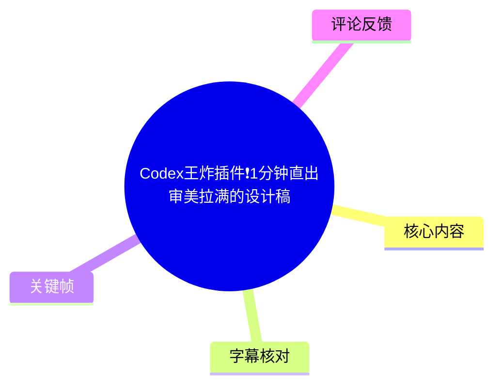
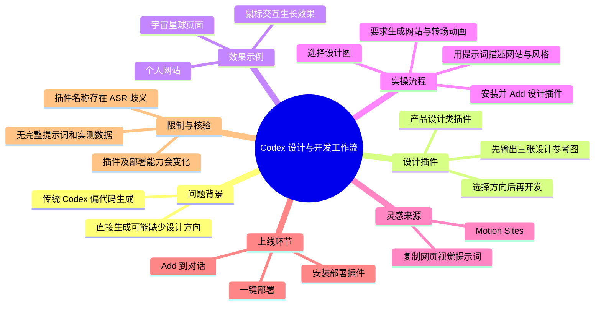
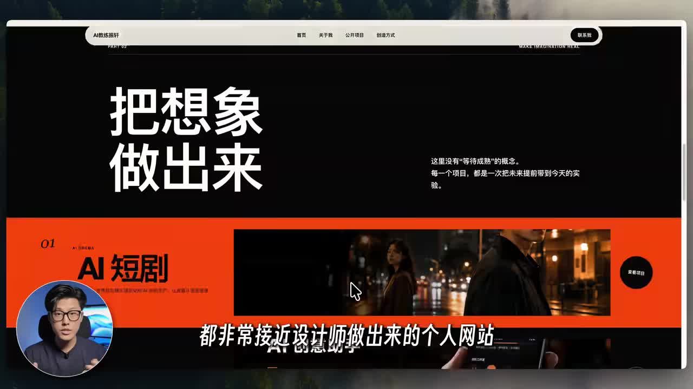
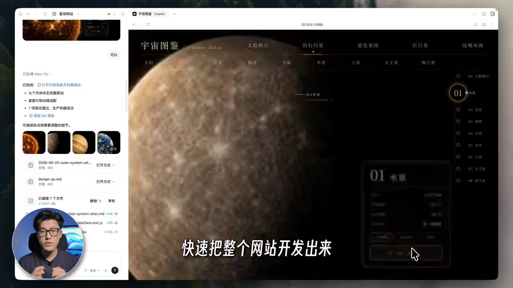
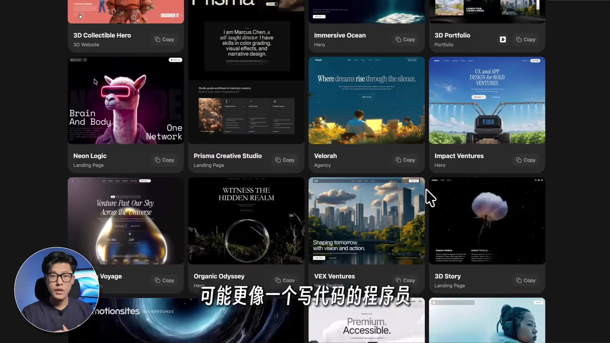

# Codex王炸插件❗️1分钟直出审美拉满的设计稿

> 来源：[Bilibili 视频](https://www.bilibili.com/video/BV1ZeKS69EhB)<br>
> UP 主：AI教练振轩｜时长：1 分 22 秒｜合集：AIcode<br>
> 标签：设计、网页设计、前端开发、Codex、AI 编程、Vibe Coding

## 小结

视频介绍了一套在 Codex 中借助插件完成「先做设计参考、再开发网页、最后部署上线」的工作流。UP 主的核心判断是：原本偏向代码生成的 Codex，在加入面向产品设计的插件后，可以先产出多个视觉方向的设计图，再根据选定设计继续生成网站，从而改善直接“堆代码”带来的审美与结构不稳定问题。

流程可概括为四步：在插件市场安装视频所称的设计插件；按提示词框架描述网站目标与设计风格；从 AI 给出的三张设计参考图中选择方向并要求开发；再安装部署插件，将本地可访问的网站发布为可被他人访问的站点。视频还推荐了 Motion Sites（ASR 识别为 `MotionSci`，画面中可见 `motionsites`）作为可复制网页视觉提示词的素材库。

视频展示的结果包括鼠标交互生长效果、接近设计师风格的个人网站，以及带星球动画的“宇宙图鉴”页面。关键价值不在于某一个页面模板，而是将提示词、视觉参考、代码生成与上线环节串成闭环。

需要注意，视频没有展示完整的插件安装界面、实际提示词全文、生成耗时的严格测试过程，也没有给出部署后的域名、托管额度或代码质量验证。因此，“1 分钟直出”“专业级”“审美拉满”等属于标题或作者的效果性表达，不应理解为对所有需求都成立的性能承诺。插件名称在 ASR 中存在明显误识别，尤其部署插件名称需以实际 Codex 插件市场中的条目为准。

本内容适合已使用或准备使用 Codex、希望用自然语言快速制作落地页、作品集或交互式展示网站的开发者、设计师及 Vibe Coding 初学者。涉及插件市场、GitHub 源地址和部署服务的配置会随产品版本变化，使用前应重新核验。

## 思维导图





## 目录

- [背景：从“写代码”到“先设计后开发”](#背景从写代码到先设计后开发)
- [展示效果与适用场景](#展示效果与适用场景)
- [四步实操工作流](#四步实操工作流)
  - [步骤一：安装并添加设计插件](#步骤一安装并添加设计插件)
  - [步骤二：按框架描述需求与风格](#步骤二按框架描述需求与风格)
  - [步骤三：选择设计参考图并开发](#步骤三选择设计参考图并开发)
  - [步骤四：部署上线](#步骤四部署上线)
- [Motion Sites：视觉提示词参考库](#motion-sites视觉提示词参考库)
- [参数、限制与时效性](#参数限制与时效性)
- [字幕比对](#字幕比对)
- [评论分析](#评论分析)
- [处理记录](#处理记录)

## 背景：从“写代码”到“先设计后开发” [00:00](https://www.bilibili.com/video/BV1ZeKS69EhB?t=0)

UP 主以 Codex 的能力边界为切入点：过去它更像“写代码的程序员”，而在安装一个面向产品设计的插件后，可以参与网站的视觉设计阶段。视频描述的关键变化是：收到需求后，工具不立即开始生成代码，而是先给出不同方向的设计参考图。

这套顺序对应一个明确的工作流调整：

1. **先确定视觉方向**：以设计图承接布局、色彩、层级和风格等决策。
2. **再进行页面开发**：根据用户选中的设计图生成网站。
3. **补充交互动效**：在生成过程中继续要求添加转场等效果。
4. **最后发布**：借助部署插件将本地页面变为公开可访问的站点。

视频没有说明该设计插件是否为 Codex 官方内置功能、第三方插件或角色插件仓库中的条目。视频简介将其称为 **Product Design**；ASR 对该名称的识别不稳定，故本文以“产品设计类插件”指代，避免将误识别名称作为确定事实。

## 展示效果与适用场景 [00:04](https://www.bilibili.com/video/BV1ZeKS69EhB?t=4)

视频在开头列出三类可由一句话需求触发的网页效果：

- 鼠标经过或跟随时可出现花朵、青草生长效果的交互页面；
- 视觉层级、动效细节接近设计师个人作品集的网站；
- 带有星球动画、信息结构较完整的宇宙主题页面。



> 图：该帧展示了视频所说的个人网站示例，页面使用大字号标题、深色首屏与高饱和橙色内容区形成明显视觉层级。它说明视频追求的不只是静态信息排版，也包括作品展示的整体风格；但该画面是演示结果，不能单独证明设计插件可稳定复现同等品质。



> 图：该帧同时呈现左侧任务/文件区域与右侧“宇宙图鉴”网页预览。页面包含星球主视觉、顶部导航、星球分类和右侧索引，能够对应视频中“自带星球动画、信息完整”的案例描述，也直观体现从生成到预览的工作场景。

从案例类型看，该流程更适合以下目标：

| 目标 | 视频支持情况 | 说明 |
| --- | --- | --- |
| 创意落地页 | 有案例支持 | 视频展示了强视觉风格与互动效果。 |
| 个人作品集网站 | 有案例支持 | 开头明确展示类似设计师个人网站的页面。 |
| 主题内容展示站 | 有案例支持 | “宇宙图鉴”案例具有导航、分类与信息模块。 |
| 企业级复杂业务系统 | 未展示 | 没有权限、数据接口、测试、监控或多人协作内容。 |
| 可维护的生产级前端工程 | 未验证 | 视频未展示代码结构、依赖、测试和性能指标。 |

## 四步实操工作流 [00:19](https://www.bilibili.com/video/BV1ZeKS69EhB?t=19)

### 步骤一：安装并添加设计插件 [00:19](https://www.bilibili.com/video/BV1ZeKS69EhB?t=19)

视频给出的第一步是：

1. 在 Codex 的插件列表中找到产品设计相关插件；
2. 点击安装；
3. 在对话框中直接 `Add` 该插件。

这里的 `Add` 应理解为把已安装的插件添加到当前对话或当前工作上下文中。ASR 在此处出现“ProduticSight”“PredaticSight”等不稳定转写，而视频简介使用的是 **Product Design**。因此，实际操作时应优先搜索视频简介所称名称，并结合插件说明、发布者、功能描述确认，而不要直接依赖 ASR 拼写。

可获取热评提供了一个可能的补充路径：若插件列表中找不到相关插件，可在 Codex 右上角添加插件市场，并填写一个 GitHub 仓库地址。该信息来自用户评论，并非视频画面或作者演示，且未经过本次素材验证，详见“评论分析”。

### 步骤二：按框架描述需求与风格 [00:29](https://www.bilibili.com/video/BV1ZeKS69EhB?t=29)

第二步是按照 UP 主整理的提示词框架，描述两项核心信息：

- **想制作的网站是什么**；
- **希望采用怎样的设计风格**。

视频未公开完整提示词框架，因此无法还原其精确字段、指令顺序或原文。基于视频明确说法，可将提示语组织目标理解为：

| 信息维度 | 视频是否明确提及 | 作用 |
| --- | --- | --- |
| 网站内容/用途 | 是 | 确定要制作的网站。 |
| 设计风格 | 是 | 决定视觉方向。 |
| 动效或转场要求 | 是，在后续生成阶段提及 | 用于补充交互体验。 |
| 页面数量、技术栈、数据来源 | 否 | 不应臆测为视频已提供的框架字段。 |

视频强调，在接收需求后，插件**不会立刻开始堆代码**，而是先生成 **3 张不同方向的设计参考图**。这是本视频最重要的流程节点：用户先在视觉方案阶段作选择，再让 AI 向代码实现推进。

### 步骤三：选择设计参考图并开发 [00:42](https://www.bilibili.com/video/BV1ZeKS69EhB?t=42)

第三步是从三张设计参考图中选定一个方向。视频称，在用户完成选择后，工具可以依据该图片“快速把整个网站开发出来”；生成过程中还可以继续提出增加转场动画的需求，以让使用体验“更丝滑”。

这一阶段可以拆分为两个动作：

1. **选择设计方向**  
   从三个视觉方案中确认相对符合预期的图，而非让 AI 在没有视觉约束的情况下直接输出成品页面。

2. **基于图继续迭代开发**  
   要求根据选定图片实现整个网站；若需要，补充转场动画等交互要求。

视频没有展示“选择”是通过点击图片、文字回复编号，还是其他控件完成；也没有显示完整的代码输出和调试过程。因而“快速开发”只能视为作者演示中的主观效率描述，不能据此推导具体生成时长、可编辑性或一次成功率。

## Motion Sites：视觉提示词参考库 [00:55](https://www.bilibili.com/video/BV1ZeKS69EhB?t=55)

UP 主称，视频中的交互网站是在一个名为 Motion Sites 的网站中找到的；ASR 将其识别为 `MotionSci`，但关键帧底部可辨识出 `motionsites` 字样，因此本文采用 **Motion Sites** 作为记录名称。视频对该网站的定位是：收集大量 Vibe Coding 提示词，用户可以复制这些提示词后使用。



> 图：该帧展示了由多张网页案例卡片构成的素材库界面，卡片带有 `Copy` 按钮，符合视频所述“复制过来就能用”的提示词参考库定位。图片的价值在于说明作者建议的灵感获取方式是复用现成的视觉描述，而不是只依赖抽象风格词。

该建议对初学者的实际意义是：通过已有案例提取页面氛围、版式结构、动效方向等描述，降低从零组织视觉提示词的门槛。视频的结论是，即使是小白，也可以借此复刻出“不错的视觉效果”。

但应区分“复制提示词”与“复制可商用设计”：

- 视频仅说明可以复制提示词，未说明素材库中案例的版权、授权范围或商业使用条款；
- 同一提示词在不同模型、插件版本、上下文和项目配置下，生成效果可能不同；
- 若页面中出现第三方图片、字体、品牌元素或代码片段，仍需单独检查其授权与许可。

## 步骤四：部署上线 [01:05](https://www.bilibili.com/video/BV1ZeKS69EhB?t=65)

视频称第四步“最关键”：安装一个用于部署的插件，并在对话框中 `Add` 它，即可“一键帮你部署上线”，将原本只能自己访问的网站变为他人也能看到的网站。

视频的 ASR 将该插件转写为 `Nellify`、`Linify` 等形式，发音上可能指向 **Netlify**，但视频提供的素材中没有清晰、可核验的插件文字界面，不能将其当作已证实名称。实际使用时应在插件市场以部署功能、官方发布者和服务条款交叉确认。

视频明确描述的部署目标是：

```text
本地或个人可访问的网站
          ↓
通过部署插件执行发布
          ↓
其他人可访问的公开网站
```

视频没有提供以下关键部署参数，因此不能补全或假定：

- 所用托管平台、账号授权方式与项目绑定方式；
- 自定义域名、HTTPS、访问权限与环境变量设置；
- 免费额度、带宽限制、构建次数与超额计费；
- 部署失败时的日志查看、回滚和故障处理；
- 公开发布前的隐私、密钥泄露与第三方资源合规检查。

## 参数、限制与时效性 [01:14](https://www.bilibili.com/video/BV1ZeKS69EhB?t=74)

视频最后将能力概括为：“以前的 Codex 更像写代码的程序员；加上产品设计插件后有了设计师审美；加上部署插件就能直接上线。”这是一种便于理解的功能分层，但不应将插件能力拟人化地等同于真实设计师或完整工程团队。

### 视频中可确认的关键参数

| 项目 | 可确认内容 | 证据来源 |
| --- | --- | --- |
| 视频时长 | 82 秒 | 元数据 |
| 视频分辨率 | 3840 × 2160 | 元数据 |
| 设计参考图数量 | 3 张不同方向的设计参考图 | ASR |
| 核心操作 | 安装插件、在对话框 Add、描述网站与风格、选择设计图、开发、部署 | ASR |
| 灵感站点 | Motion Sites；名称由关键帧与语境校正 | 关键帧、ASR |
| 插件市场来源 | `https://github.com/openai/role-specific-plugins.git` | 热评，未验证 |

### 关键限制

1. **插件名不完全可靠**：站内字幕缺失，ASR 对产品设计插件和部署插件均有专有名词错误；本文只将视频简介中的 Product Design 视作较高可信线索，不把 ASR 的拼写当作安装指令。
2. **没有完整提示词**：UP 主提到已整理提示词框架，但本视频素材未包含框架原文，无法据此复刻同一输入。
3. **没有性能实测**：标题的“1 分钟”没有对应计时起止点、机器环境、项目规模或多次测试数据。
4. **没有工程质量证据**：未展示响应式适配、可访问性、浏览器兼容、性能、测试、构建配置、版本控制或安全审计。
5. **部署并非无条件公开**：即使部署工具可用，账号、配额、平台政策、域名与权限设置仍可能影响是否能够上线。
6. **案例效果不可直接泛化**：展示页面可作为设计目标参考，不代表任何需求输入都能一次生成相同质量。

### 时效性

本视频元数据抓取时间为 2026-07-13。插件市场入口、插件仓库地址、插件名称、对话框中的 `Add` 机制及部署服务政策均属于高变化信息。实际操作前建议重新检查：

- Codex 当前版本是否支持插件市场；
- 产品设计类插件是否仍存在、是否需要额外授权；
- GitHub 仓库是否仍可访问且可信；
- 部署服务的价格、额度、隐私政策及绑定权限；
- 发布前是否意外将 API Key、环境变量或私有内容推送到公开站点。

## 字幕比对 [01:18](https://www.bilibili.com/video/BV1ZeKS69EhB?t=78)

本次任务已执行 ASR，但未提供可用的 Bilibili 站内字幕文件。

| 字幕来源 | 完整性 | 专有名词 | 时间轴 | 主要问题 |
| --- | --- | --- | --- | --- |
| Bilibili 站内字幕 | 无可用内容 | 无法评估 | 无法评估 | 素材明确标注“未提供可用站内字幕”。 |
| 本次 ASR 字幕 | 覆盖了从案例展示、安装、提示词、设计图选择、开发、提示词库到部署的主要口播 | 存在多处误识别 | 未提供逐句时间戳 | `CodeS`、`PredaticSight`、`ProduticSight`、`MotionSci`、`Nellify`、`Linify` 等名称不稳定；个别中文句子也有断裂。 |

最终采用策略为：**以本次 ASR 的流程性信息为主体，以视频简介、关键帧可见文字和上下文对少数术语做保守校正；无法确认的名称保留不确定性。**

重要校正与处理如下：

| ASR 结果 | 本文处理 | 依据与置信说明 |
| --- | --- | --- |
| `CodeS` | 记为 Codex | 标题、简介、标签均明确出现 Codex，置信度高。 |
| `PredaticSight` / `ProduticSight` | 记为“产品设计类插件”；提及简介中的 Product Design | 视频简介写有 Product Design，但未提供清晰插件界面，无法确认精确安装名。 |
| `MotionSci` | 记为 Motion Sites | 关键帧中可见 `motionsites` 字样，且与 ASR 语境相符，置信度较高。 |
| `Nellify` / `Linify` | 记为“部署插件”，不确定指向 Netlify | 发音可能相近，但没有可验证的清晰文字，不能断言。 |
| “收到求求后” | 理解为“收到需求后” | 与后文“先生成三张不同方向设计参考图”的流程语义一致。 |

## 评论分析 [01:20](https://www.bilibili.com/video/BV1ZeKS69EhB?t=80)

以下仅处理本次可获取的热评前三条，按提供列表记录；评论属于用户经验或主观看法，均不作为已验证事实。

1. **谭胖瓦尔大侠（9 赞）**  
   评论称：若找不到插件，可在 Codex 右上角添加插件市场，来源填写：

   ```text
   https://github.com/openai/role-specific-plugins.git
   ```

   该评论提供了视频正文未展示的具体操作线索，可能对“插件列表中找不到插件”的用户有帮助。但其有效性、仓库归属、当前可访问性、安全性及是否适配所有 Codex 版本均未在素材中验证。使用前应检查仓库页面、来源主体、README 与授权范围，避免添加不明插件市场。

2. **KeKiyoan（3 赞）**  
   评论仅称“没有”。在缺少上下文补充的情况下，较可能表达找不到视频所述插件或功能，但无法确定具体缺失的是插件、入口、服务地区还是版本支持。它与第一条评论共同反映出插件可发现性可能是实际使用门槛，但不能据此确认视频教程已失效。

3. **缩成团（0 赞）**  
   评论认为视频信息密度高，并肯定其解释了容易困惑的地方，期待更多实战内容。这是一条正向的观看体验反馈，没有新增可验证的技术信息，也未涉及插件可用性、生成质量或部署结果。

## 评论分析

本次流程未获取到可用热评，因此不推断观众态度或额外结论。

## 处理记录

- Worker ID：`worker-mrj0wjed-b0c290ad`
- 调用模型：`gpt-5.6-terra`
- 使用的素材与工具产物：视频元数据、ASR 字幕、3 张关键帧、热评 JSON、视频下载/音频与帧提取产物清单；本次已执行 ASR。
- 字幕选择：未提供可用站内字幕；以本次 ASR 为主体。对 Codex、Product Design、Motion Sites 等词结合标题、简介、标签和关键帧进行保守校正；部署插件名称无法确认，保留为“部署插件”。
- 关键帧选择依据：
  - `frames/frame-001.jpg`：展示个人网站案例，支持“视觉层级接近设计师作品集”的内容；
  - `frames/frame-002.jpg`：展示宇宙图鉴页面与任务区域，支持“选定设计后开发网站”的演示结果；
  - `frames/frame-003.jpg`：展示带 Copy 按钮的案例卡片库，用于说明 Motion Sites 的提示词参考用途。
- 缓存清理：素材中未提供缓存清理执行日志或结果，无法确认是否已清理；本文未将其表述为已完成。
- 未解决问题：
  - 产品设计插件在实际插件市场中的精确名称、发布者与安装入口未被清晰展示；
  - 部署插件的精确名称及是否为 Netlify 未获素材证实；
  - 视频提及的完整提示词框架未提供；
  - “1 分钟”效果没有可复核的计时、环境与项目规模数据；
  - 热评提供的 GitHub 插件市场地址未进行联网验证。
