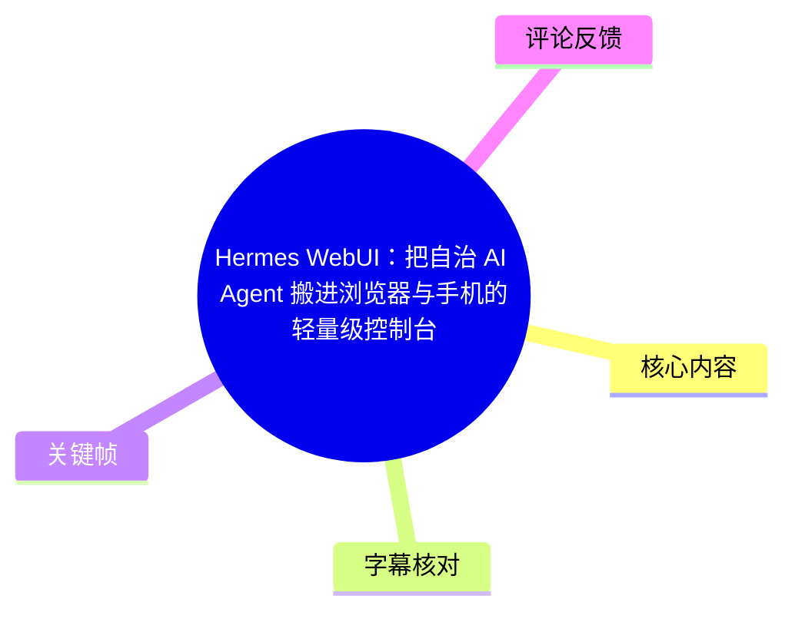
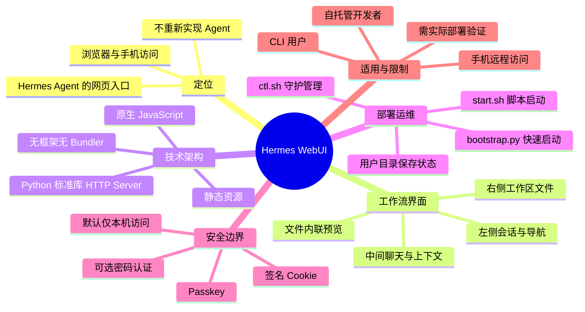
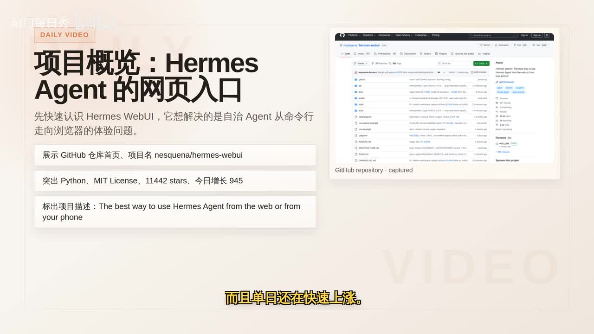
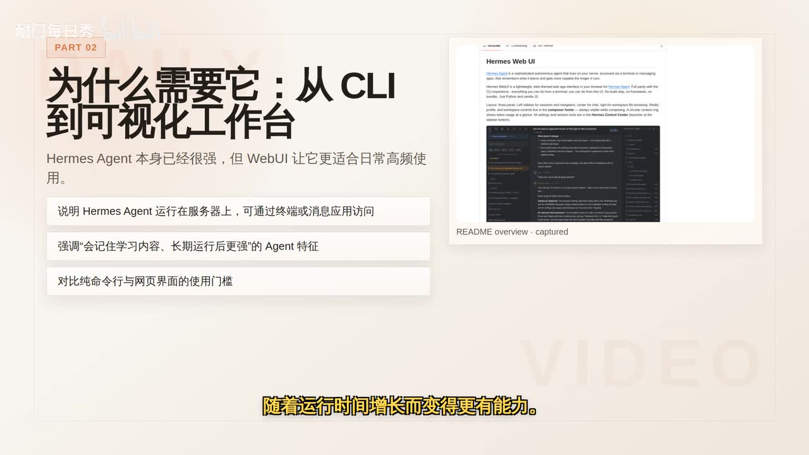
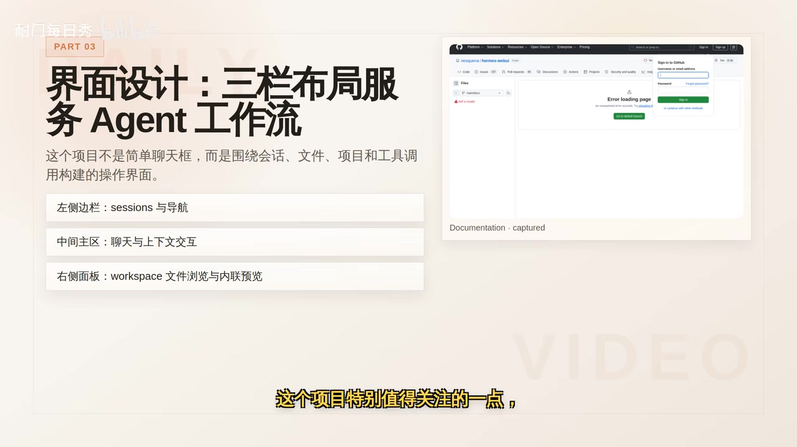

# Hermes WebUI：把自治 AI Agent 搬进浏览器与手机的轻量级控制台

> 来源：[Bilibili 视频](https://www.bilibili.com/video/BV1uMVB6bE9f)<br>
> UP 主：耐门每日秀｜视频时长：7 分 06 秒｜合集：AIcode  
> 说明：视频开头约 32 秒无可用语音识别内容；以下时间轴均依据本次 ASR 的真实 SRT 起始时间生成。

## 小结

视频介绍开源项目 **`nesquena/hermes-webui`**：它并不重新实现 Hermes Agent，而是为运行在自有服务器上的 Hermes Agent 提供一个轻量级浏览器控制台，使用户可通过桌面浏览器乃至手机访问 Agent，而不必局限于命令行。

其产品设计围绕 Agent 的真实工作流展开：左侧管理会话与导航，中间进行聊天和上下文交互，右侧浏览工作区文件。视频认为，Agent 不仅会对话，还会调用工具、生成文件并维护项目上下文，因此需要将对话、状态与产物同时呈现；项目还提到主题切换、Profile、密码配置和工作区内联预览等长期使用功能。

技术上，视频强调其“极简架构”：后端主要使用 Python 标准库 HTTP Server，前端为原生 JavaScript 与静态资源，不引入前端框架、打包器或构建步骤。该取向降低了依赖和部署门槛，也方便自托管用户直接阅读、修改和维护。

视频给出快速启动、脚本启动与长期守护运行的思路，并介绍状态数据与代码仓库分离的设计。对于需要远程访问的部署，重点风险在于网络暴露：Docker Compose 默认仅绑定本机 `127.0.0.1`；若修改为对外端口映射，则应同时启用认证，而不能只追求访问便利。

适合三类人：已使用 Hermes Agent CLI 的技术用户、希望在手机上远程访问自有 Agent 的用户，以及希望部署自托管 Agent、但不愿引入复杂前后端技术栈的开发者。视频未进行实时上手测试，因此交互流畅度、移动端细节与不同系统兼容性仍需在实际环境验证。

项目热度、Star 数和“单日增长”等数据均属于视频制作时的快照。关键帧显示当时仓库约为 **11,442 Stars、当日增长 945**；这些数字会持续变化，不能视为当前实时数据。

## 思维导图





## 目录

- [项目背景：把 Hermes Agent 带入网页](#项目背景把-hermes-agent-带入网页)
- [界面设计：围绕 Agent 工作流的三栏布局](#界面设计围绕-agent-工作流的三栏布局)
- [技术架构：低依赖、可直接阅读的 WebUI](#技术架构低依赖可直接阅读的-webui)
- [部署与长期运行：启动、守护、配置](#部署与长期运行启动守护配置)
- [状态存储与安全边界](#状态存储与安全边界)
- [工程化、适用人群与验证限制](#工程化适用人群与验证限制)
- [关键帧索引](#关键帧索引)
- [字幕比对](#字幕比对)
- [评论分析](#评论分析)
- [处理记录](#处理记录)

## [项目背景：把 Hermes Agent 带入网页](https://www.bilibili.com/video/BV1uMVB6bE9f?t=32)

视频将 Hermes WebUI 描述为近期增长较快的开源项目。画面中的 GitHub 仓库为 **`nesquena/hermes-webui`**，并明确展示其使用 **Python**、采用 **MIT License**。关键帧所截取的仓库页显示约 **11,442 Stars**、当日增长 **945**；旁白概括为“累计超过 11,000 Stars，且单日仍快速上涨”。



> 图：画面给出项目定位“Hermes Agent 的网页入口”，并展示 GitHub 仓库 `nesquena/hermes-webui`、Python、MIT License、Stars 与当日增长等信息。它是核对项目身份与热度数据时效性的直接依据。

视频先区分 Hermes Agent 与 Hermes WebUI：

- **Hermes Agent**：被描述为运行在用户自有服务器上的自主智能体，可经由终端或消息应用访问；视频称其可持续记住学到的内容，并随着运行时间增长而更有能力。
- **Hermes WebUI**：为已有的 Hermes Agent 增加网页前端入口，而非另造一套 Agent。
- **解决的问题**：将交互从 CLI 扩展到浏览器和手机，降低日常高频使用时的操作门槛。
- **能力关系**：视频称 WebUI 的目标是尽量接近 Hermes CLI 的“1:1 能力映射”，但未逐项列举所有 CLI 指令及其对应页面功能，因此不能据此推断已经完整覆盖每一项 CLI 能力。



> 图：画面直接说明 Hermes Agent 运行于服务器、可通过终端或消息应用访问，并将 WebUI 定位为从 CLI 走向可视化工作台的入口，有助于理解两者不是替代关系。

## [界面设计：围绕 Agent 工作流的三栏布局](https://www.bilibili.com/video/BV1uMVB6bE9f?t=58)

视频将 Hermes WebUI 描述为更接近“现代聊天室工作台”的界面，而非只有输入框的 AI 聊天页。核心布局为三栏：

| 区域 | 视频描述 | 对 Agent 工作流的意义 |
| --- | --- | --- |
| 左侧 | 会话与导航 | 在不同 Sessions、页面或项目上下文间切换 |
| 中间 | 聊天主区域 | 与 Agent 对话、处理上下文交互 |
| 右侧 | 工作区文件浏览 | 查看 Agent 产出的文件与工作区内容 |



> 图：画面明确列出“左侧边栏：sessions 与导航”“中间主区：聊天与上下文交互”“右侧面板：workspace 文件浏览与内联预览”。这是理解其面向 Agent 而非单纯聊天的关键帧。

视频提出的设计理由是：Agent 会产生文件、维护项目上下文并调用工具，用户需要并行看到对话过程、运行状态和工作产物。因此，三栏界面试图减少在终端、文件管理器和聊天窗口之间来回切换的成本。

视频还提到以下交互与配置能力：

- 深色主题与浅色模式；
- 完整的 Profile 设置；
- 密码配置；
- 工作区文件内联预览。

这些功能说明项目的目标不只是做展示性质的页面外壳，而是补齐自托管、长期使用时需要的交互细节。需要注意的是，视频没有实际演示每项功能的操作过程与边界条件；例如文件预览支持哪些格式、移动端三栏如何响应式折叠，均未在素材中给出。

## [技术架构：低依赖、可直接阅读的 WebUI](https://www.bilibili.com/video/BV1uMVB6bE9f?t=106)

视频强调项目刻意保持极简技术栈，Readme 信息被概括为：

- 没有前端构建步骤；
- 没有前端框架；
- 没有 Bundler；
- 后端主要基于 Python 标准库的 HTTP Server；
- 前端主要使用原生 JavaScript 与静态文件。

按视频口述，目录职责可概括如下：

| 位置或文件 | 视频所述职责 | 可靠性说明 |
| --- | --- | --- |
| `api/` | 后端逻辑所在目录 | ASR 可稳定识别目录名 |
| `static/` | 前端静态资源所在目录 | ASR 可稳定识别目录名 |
| `server.py` | HTTP 路由外壳与认证中间件 | 文件名在 ASR 中有轻微混淆，职责以视频表述为准 |
| 认证相关 Python 文件 | 可选密码认证、签名 Cookie | ASR 对文件名识别不稳定，未据此断言精确文件名 |
| 配置相关 Python 文件 | 配置发现与全局设置 | ASR 对文件名识别不稳定，部署前应以仓库当前 README 为准 |
| `index.html`、`style.css`、`ui.js` | 前端页面、样式与交互静态文件 | 文件扩展名经 ASR 断句与大小写归一化整理 |

该架构的直接收益是：

1. **部署依赖较少**：不需要先安装 Node.js 生态依赖或执行前端构建。
2. **阅读与修改成本较低**：自托管用户可直接检查 Python 路由逻辑、静态页面和前端脚本。
3. **适合私有环境定制**：家庭实验室、私有 VPS 或内部服务器的使用者可按需求修改。
4. **维护路径更短**：少一层构建工具链，排障时涉及的组件相对更少。

但“极简”不等于自动安全或自动兼容。视频没有提供性能基准、并发上限、浏览器兼容范围、反向代理配置、TLS 配置或文件访问隔离细节；这些均不能从架构描述中直接推出。

## [部署与长期运行：启动、守护、配置](https://www.bilibili.com/video/BV1uMVB6bE9f?t=154)

视频给出的最直接 Quick Start 流程是：先克隆仓库，再通过 Python 引导脚本启动。由于 ASR 对命令大小写与文件名存在一定识别误差，以下保留视频可辨识的命令结构，**实际执行前必须以项目当前 README 中的原文为准**。

```bash
# 1. 克隆仓库（视频只说明“先克隆仓库”，未给出完整 Git URL）
git clone <项目仓库地址>
cd hermes-webui

# 2. 视频口述的快速启动形式
python3 bootstrap.py
```

视频还提到可使用脚本方式启动：

```bash
# 视频口述为 start.sh；权限、参数与具体路径未在素材中演示
./start.sh
```

对于家庭实验室、私有虚拟机等需要长期运行的场景，视频提到 `ctl.sh` 对守护进程生命周期进行包装，可用于：

- 启动后台服务；
- 查看服务状态；
- 读取日志；
- 将 PID 写入用户目录下的状态文件；
- 将日志输出到固定位置；
- 读取 `.env` 配置；
- 接受内联环境变量覆盖。

可将视频中的运维思路整理为以下步骤：

1. **先用 Quick Start 验证可启动性**：完成仓库克隆后运行引导脚本，确认本地服务正常。
2. **根据运行场景选择启动方式**：一次性试用可采用直接启动；长期运行再使用脚本与守护管理。
3. **用状态命令观察服务**：通过项目提供的管理脚本查看后台状态，避免仅凭浏览器是否能打开来判断。
4. **检查日志定位故障**：视频强调日志写入固定位置，长期部署时应将其纳入排障流程。
5. **通过 `.env` 或环境变量配置**：适合把密码等部署参数从代码与命令行中分离；具体支持的变量名与优先级需查看当前项目文档。
6. **升级前备份用户状态目录**：因为项目将运行数据与代码仓库分离，升级、迁移前应优先备份该目录。

视频没有提供操作系统要求、Python 最低版本、端口默认值、服务管理器集成方式或容器镜像标签，因此不能将上述流程视为完整生产部署手册。

## [状态存储与安全边界](https://www.bilibili.com/video/BV1uMVB6bE9f?t=203)

### 状态与用户数据分离

视频说明，项目默认不把状态保存在仓库目录内，而是放在用户主目录下的 Hermes WebUI 状态位置。ASR 对具体路径符号识别不清，故本文不写成可直接复制的绝对路径；其存储内容包括：

- Sessions；
- Workspaces；
- Settings；
- Projects；
- `Last_Workspace` 等数据。

该设计的实际意义是：

- **代码更新与用户数据解耦**：更新或重新获取代码时，不必天然覆盖会话和工作区状态。
- **便于备份与迁移**：重点备份用户目录下的状态位置，而不是只备份 Git 仓库。
- **降低误删仓库的损失**：删除或重建仓库目录时，工作状态不一定随之丢失。

这里的风险也很明确：状态不在仓库内不代表无需备份。若用户主目录丢失、磁盘损坏或权限配置不当，Sessions、Workspaces 与项目设置仍可能丢失或泄露。

### 访问控制与 Docker 网络暴露

视频称该项目提供可选的访问控制能力，包括：

- 密码认证；
- 签名 Cookie；
- Passkey。

视频特别提醒：Docker Compose 默认绑定到 `127.0.0.1`，即默认仅允许本机访问。这是一个重要的安全默认值。

若需要让局域网或更广网络访问，视频说明需要将端口映射改为类似以下形式：

```text
8787:8787
```

同时还应通过环境变量启用密码认证。ASR 将变量名识别为近似 `HERMES_YB_PASSWORD`，其中中段字符存在明显歧义，无法据此可靠确认精确拼写。因此只能确认：

```bash
# 视频表达的配置意图：为 WebUI 设置密码环境变量。
# 精确变量名必须以当前 README / .env.example 为准。
export <Hermes_WebUI_密码变量>=<强密码>
```

部署决策可按以下原则执行：

| 场景 | 视频支持的建议 |
| --- | --- |
| 本机试用 | 保持 `127.0.0.1` 绑定，不主动暴露端口 |
| 局域网访问 | 修改端口映射前，先启用项目提供的认证 |
| 更广网络访问 | 除密码外，还应自行评估反向代理、TLS、网络访问控制与服务器权限；这些措施并非视频提供的完整配置教程 |
| 长期自托管 | 关注 Cookie、Passkey、密码配置及日志、状态文件的权限保护 |

视频的核心提醒是：自托管项目中，“可从外部访问”与“默认安全”之间容易发生配置踩坑。将端口暴露到局域网或公网前，必须先完成认证与网络边界设计。

## [工程化、适用人群与验证限制](https://www.bilibili.com/video/BV1uMVB6bE9f?t=299)

虽然技术栈轻量，视频认为项目并非随手拼接的前端面板。其给出的工程化信息包括：

| 项目要素 | 视频陈述 |
| --- | --- |
| 测试 | Pytest 测试套件，规模约 7,000 多条测试 |
| 工具配置 | `pyproject.toml` |
| 代码质量约束 | 使用 Ruff 进行 Lint |

这些信息支持视频的判断：项目追求一定的工程纪律与稳定性。不过，测试数量不能直接等同于所有使用场景都已验证，也不能替代对特定操作系统、网络环境、权限模型或 Hermes Agent 版本的兼容性测试。

### [适合哪些用户](https://www.bilibili.com/video/BV1uMVB6bE9f?t=323)

视频归纳了三类适用对象：

1. **已在命令行使用 Hermes Agent 的技术用户**  
   这类用户最能理解网页入口的价值：会话切换、文件查看、项目管理等操作在图形界面中更顺手。

2. **希望通过手机远程访问自有 Agent 的用户**  
   Web 页面天然比 CLI 更适配移动端访问；但视频未实际展示手机端界面，因此小屏交互和网络安全需自行验证。

3. **希望在自托管环境部署 AI Agent、但不想引入复杂前后端栈的开发者**  
   对这类用户而言，原生前端与 Python 标准库后端意味着较低的依赖与改造门槛。

### [结论与限制](https://www.bilibili.com/video/BV1uMVB6bE9f?t=348)

视频最终将 Hermes WebUI 定位为：尽可能贴近 Hermes CLI 能力、强调自托管、轻量部署与长期运行体验的浏览器控制台，而不是追求花哨视觉效果的 AI 聊天网站。

需要严格区分以下层次：

- **视频明确陈述**：项目的定位、三栏工作流、轻量架构、启动与守护思路、状态分离、安全提醒、测试规模及适用人群。
- **关键帧可直接核对**：仓库名、Python、MIT License，以及截图当时约 11,442 Stars、日增 945 的快照数据。
- **尚未在素材中验证**：真实交互流畅度、移动端体验、跨系统兼容性、文件预览格式、安全实现细节、完整 CLI 覆盖程度及当前版本的安装参数。
- **时效性风险**：仓库热度、Stars、依赖、脚本文件、环境变量名、默认端口与部署文档可能在视频发布后变动。部署应以仓库当前 README、发布版本和安全说明为最终依据。

## 关键帧索引

| 关键帧 | 正文位置 | 画面信息 | 选择价值 |
| --- | --- | --- | --- |
|  | 项目背景 | 仓库首页、项目名称、Python、MIT License、Stars 与日增快照 | 为项目身份、许可证和热度数字提供视觉核对依据 |
|  | 项目背景 | “为什么需要它：从 CLI 到可视化工作台”及 README 截图 | 说明 WebUI 与 Hermes Agent 的关系及引入 Web 入口的动机 |
|  | 界面设计 | 三栏布局、Sessions、聊天上下文、Workspace 文件预览 | 直接对应视频最重要的产品结构与 Agent 工作流解释 |

> 注：给定关键帧素材未附逐帧时间戳，因此本文仅将其作为画面内容证据使用，不将关键帧文件序号反推为精确视频时间。

## 字幕比对

| 字幕来源 | 完整性 | 专有名词 | 时间轴 | 主要问题 |
| --- | --- | --- | --- | --- |
| Bilibili 站内字幕 | 未提供可用字幕 | 无法评估 | 无法评估 | 素材明确说明未提供可用站内字幕，无法作为正文依据 |
| 本次 ASR 字幕 | 较高：覆盖约 393.2 秒，占视频约 92.38%；首段语音从 00:32.160 开始 | 存在多处混淆 | 完整：18 段，具有可直接使用的 SRT 起止时间 | 中英文混杂、文件名、变量名和部分技术词识别不稳定，如 Hermes、仓库名、Python 文件名、环境变量名等 |

### 最终字幕选择与校正原则

正文采用**本次 ASR 的真实时间轴**作为章节定位依据；由于没有站内字幕，无法进行逐句交叉校对。ASR 诊断显示：

- 识别语言：中文；
- 语言置信度：0.9970703125；
- 音频时长：425.621 秒；
- 语音覆盖：92.38%；
- 不存在 `noAudioStream=true` 标记，说明源视频存在音轨；
- ASR 有 18 个带时间戳的分段，时间轴可用。

依据关键帧和上下文，对以下内容作了谨慎规范化：

| ASR 原始或近似识别 | 正文处理 | 依据与限制 |
| --- | --- | --- |
| `Neskna`、`Hermese`、`Hermesse` | Hermes / `nesquena/hermes-webui` | 关键帧仓库页明确显示 `nesquena/hermes-webui`；产品名按标题与画面统一为 Hermes WebUI |
| `Type-on` | Python | 关键帧明确展示 Python |
| “超过 11000 颗星” | 约 11,000+ Stars；截图时约 11,442 | 旁白为概括，关键帧提供更具体但具时效性的快照 |
| `ServerOpy`、`AlsoPy`、`PeskisConfigPy` | 仅保留职责描述，不断言不可靠的精确文件名 | ASR 对文件名存在明显误识别；素材未提供可供逐字放大的 README 原文 |
| `Hermes_YB_Password` 一类变量名 | 仅说明“需设置 WebUI 密码环境变量” | ASR 中间字符不可靠，避免编造可执行变量名 |
| `Rough` | Ruff | 视频语境为 Python Lint 工具，作最小限度规范化；实际配置仍应查看仓库当前文件 |

## 评论分析

可获取的热评不足三条：素材中仅返回 1 条评论，因此只分析该条，不补造缺失评论。

| 排名 | 用户 | 点赞 | 评论内容 | 分析 |
| --- | --- | ---: | --- | --- |
| 1 | AI代冲服务GPT | 0 | “我先打个卡” | 这是到访/签到性质的简短互动，不包含项目功能、安装体验、安全性或兼容性方面的可验证补充信息，也不存在实质争议。 |

其余热评未在提供素材中获取到，无法按“热评前三条”补充分析。

## 处理记录

- Worker ID：`worker-mrj0wjed-b0c290ad`
- 模型：`gpt-5.6-terra`
- 使用的素材与工具产物：视频元数据、`asr/asr-result.json`、ASR SRT 时间轴、关键帧 `frames/`、评论数据 `comments/comments.json`。
- ASR 模型与运行信息：`medium`；语言自动识别为中文；CUDA；`float16`。
- 字幕选择：站内字幕未提供可用版本；已检查本次 ASR，采用其 18 个真实时间分段作为时间轴依据，并结合关键帧和上下文处理明显的专有名词识别误差。
- 关键帧选择依据：`frame-001` 用于核对项目仓库、许可证和热度快照；`frame-002` 用于说明 CLI 到网页工作台的定位；`frame-004` 用于确认三栏布局及文件工作区设计。未依据帧文件序号推测时间点。
- 缓存清理：提供的素材中没有缓存清理执行记录；本文不声称已执行缓存清理。
- 未解决问题：精确环境变量名、个别 Python 文件名、完整启动参数、端口默认值、移动端表现、跨平台兼容性和实际部署结果均未由视频实测或可用站内字幕证实，需以项目当前 README 与实际部署为准。
