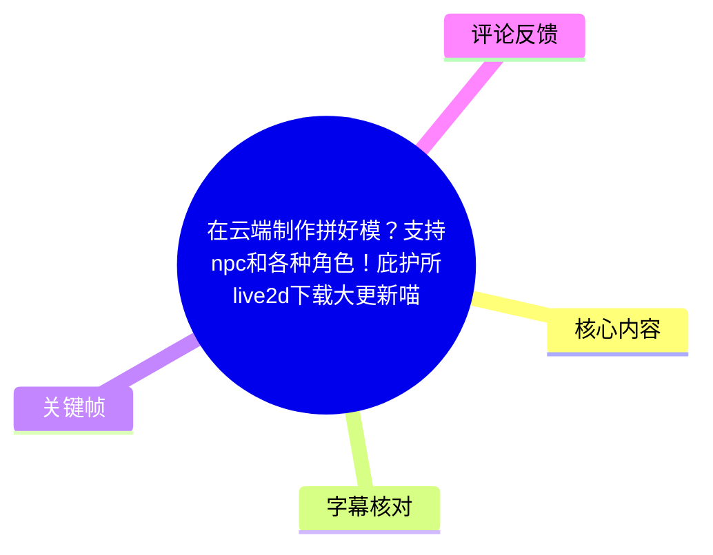
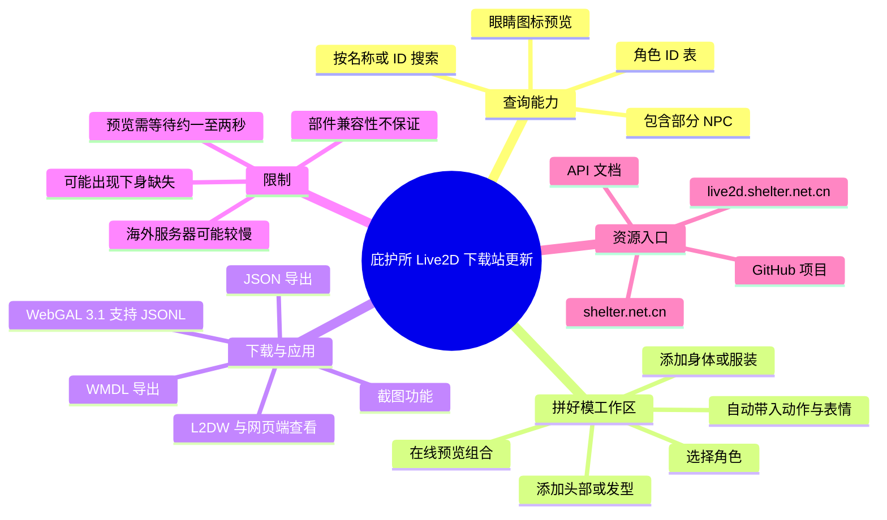
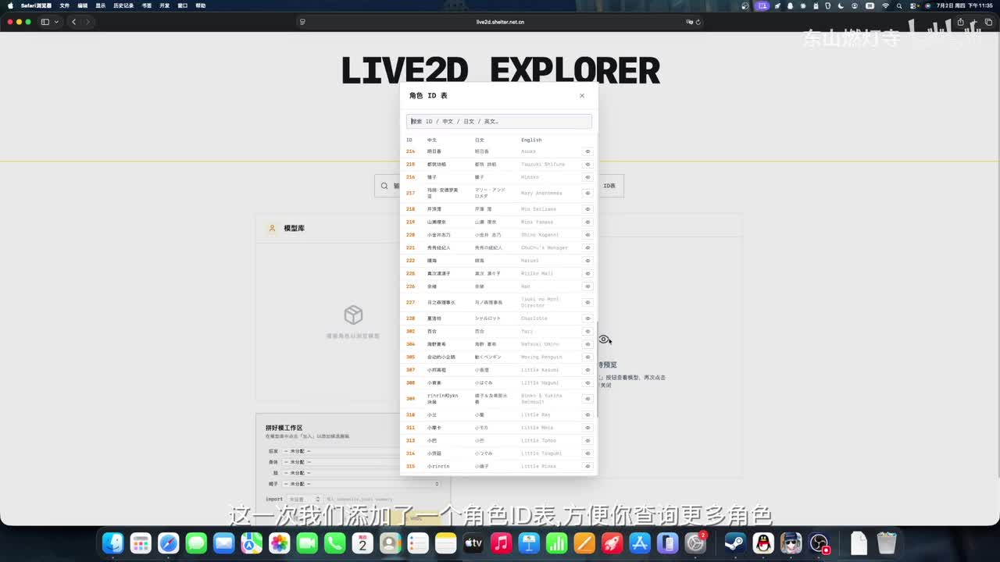
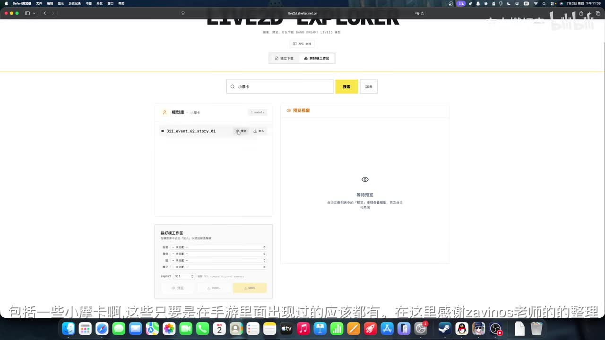
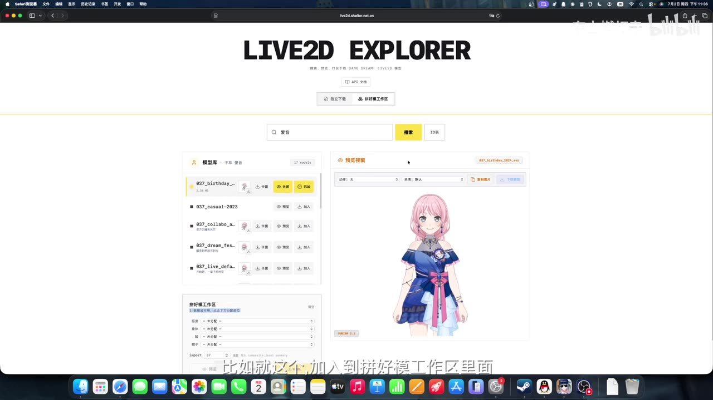
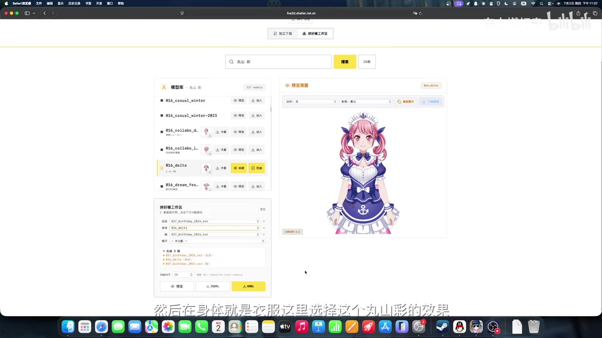

# 在云端制作拼好模？支持npc和各种角色！庇护所live2d下载大更新喵

> 来源：[Bilibili 视频](https://www.bilibili.com/video/BV1oeTJ6KEso) 
> UP 主：东山燃灯寺｜合集：AIcode｜时长：5 分 12 秒｜分辨率：1920×1080  
> 视频说明中提供的网站：`shelter.net.cn`、`live2d.shelter.net.cn`；项目地址：`https://github.com/PjShelter/bestdoridownloaderweb`

## 小结

视频介绍了“庇护所”相关 Live2D 下载/浏览网站的一次功能更新。核心新增内容有两项：其一是**角色 ID 表**，用于按 ID 或名称查询角色，并覆盖了相当一部分 NPC；其二是网页端的**“拼好模工作区”**，允许从不同 Live2D 资源中选择头部、身体/服装等部件，在线预览组合后的角色模型。

演示以“爱音”为例：先搜索并选定角色，从资源列表中选择发型或头部相关模型加入工作区，再选择一套服装/身体资源。网页会在预览区显示组合结果，并自动汇集相关的动作与表情资源。视频随后展示了另一套组合结果，说明该工具可用于把不同角色或不同资源条目的部件拼接为新模型。

下载侧提供至少两种导出方向：视频明确提到 **JSON** 与 **WMDL**；其中 JSON 被作者描述为其个人工具和某个引擎中常用的格式，且视频称社区 WebGAL 3.1 已开始支持用于“拼好模”的 JSONL 格式。由于 ASR 对具体工具名、格式名的识别存在较多错误，除已能从画面与语境确认的 JSON、WMDL、WebGAL、L2DW 外，不将模糊转写扩展为确定事实。

此工具适合需要检索角色资源、预览 Live2D 模型、组合角色外观、导出模型，或仅需截取模型画面的二创与开发者用户。视频说明还称 `live2d.shelter.net.cn` 是作者自行制作的镜像站，开发者可查看站内 API 文档。

需要注意：作者明确表示服务器仍在海外，因此检索、获取或预览可能较慢；部件并非保证任意兼容，可能发生“下身不存在/下身不见”的显示问题。视频提供的是功能演示，不构成对资源授权范围、商用许可、模型再分发权限或所有角色完整覆盖度的说明；实际使用前应自行核对相关游戏、角色与素材的版权及使用规则。

## 思维导图

## 目录

- [更新背景、站点与时效性](#更新背景站点与时效性)
- [角色 ID 表与资源检索](#角色-id-表与资源检索)
- [拼好模：在线组合角色部件](#拼好模在线组合角色部件)
- [下载格式、WebGAL 与截图用途](#下载格式webgal-与截图用途)
- [实操步骤与参数](#实操步骤与参数)
- [限制、风险与可迁移经验](#限制风险与可迁移经验)
- [关键帧索引](#关键帧索引)
- [字幕比对](#字幕比对)
- [评论分析](#评论分析)
- [处理记录](#处理记录)

## [更新背景、站点与时效性](https://www.bilibili.com/video/BV1oeTJ6KEso?t=0)

视频开头说明本期是对下载网站更新的介绍，而非从零讲解 Live2D 制作。标题中的“在云端制作拼好模”对应的是浏览器中的网页工作区：用户无需在本地先搭建独立的模型拼装软件，即可在网页端检索资源、组合部件并预览。

视频说明文字提供了三个重要入口：

| 入口 | 视频/说明中的定位 | 可确认信息 |
| --- | --- | --- |
| `shelter.net.cn` | 庇护所网站 | 视频简介直接给出链接。 |
| `live2d.shelter.net.cn` | Live2D 网站 | 作者称其为自己制作的镜像站。 |
| GitHub：`PjShelter/bestdoridownloaderweb` | 项目地址 | 视频简介直接给出仓库链接。 |

作者还补充，开发者如有需要可查看 Live2D 镜像站上的 API 文档。素材未提供 API 的接口列表、鉴权方式、限流规则或稳定性承诺，因此不能据此推断其具体调用方法。

本视频的发布时间由元数据时间戳推得为 2026 年 7 月初；站点功能、模型收录、导出格式与 WebGAL 兼容状态均可能在此后变化。阅读本文时应以网站和仓库当前页面为准。

## [角色 ID 表与资源检索](https://www.bilibili.com/video/BV1oeTJ6KEso?t=13)

这次更新首先增加了角色 ID 表。作者的用途描述是“方便查询更多角色的身份”，并特别说明其中包括许多 NPC 角色。画面中的页面标题为 **LIVE2D EXPLORER**，上方存在角色 ID 表入口，表格包含 ID、中文、日文、English 等列；每个条目右侧带有眼睛图标。

> 图：该关键帧直观呈现角色 ID 表的检索价值：用户可以通过数值 ID 或多语言名称定位条目，而不必只依赖角色昵称。右侧的眼睛图标与视频中“点击眼睛即可预览”的说明相互印证。

作者表示，资源范围中包含一些 NPC，且“只要是在手游剧情里出现过的应该都有”。这里的“应该都有”是作者对收录范围的口头判断，而不是可核验的完整目录承诺；没有提供总数、覆盖版本或缺失列表。

检索页的操作逻辑可归纳为：

1. 在搜索框输入角色名或相关关键词。
2. 在左侧模型库查看匹配条目。
3. 使用条目旁的预览入口查看模型。
4. 如需拼装，则将具体模型条目加入拼好模工作区。

> 图：画面显示搜索框、左侧“模型库”、右侧“预览视图”和下方“拼好模工作区”的页面布局。它说明角色搜索、模型预览与拼装并不是三个完全割裂的页面流程。

### 服务器位置与访问体验

作者明确提醒服务仍部署在海外，因此“可能会有点慢”。结合视频语境，这一限制至少影响资源获取与模型预览的等待体验。素材没有给出服务器地区、带宽、并发能力、CDN 配置或网络故障率，不能进一步量化速度。

## [拼好模：在线组合角色部件](https://www.bilibili.com/video/BV1oeTJ6KEso?t=65)

“拼好模工作区”是本次演示的主体。其目标是从不同的模型资源中抽取可组合部分，生成一个新的 Live2D 组合效果。视频以“爱音”为例，先在搜索框中选择角色，再选择喜欢的发型/头部相关资源加入工作区。

画面可见，模型库中的单个资源条目具有预览与“加入”等操作；预览区会加载角色形象；工作区下方有若干下拉选择项，用来指定组合部件。视频口述中提到了“后发和脸”“身体就是衣服”等类别，但 ASR 对部分具体选项名不稳定，因此本文保留其确定的结构关系，不强行补全页面字段。

> 图：该画面展示角色资源不是单一模型，而是以多个编号/主题条目存在；用户可在左侧逐项选择并在右侧预览。这是理解“拼好模”为何需要先选资源、再分部件设置的关键。

作者提到，选择身体资源后，预览通常需要等待 **1～2 秒**。这应理解为演示时的经验值，而不是性能保证；海外服务器、网络状态、模型大小和浏览器性能都可能改变实际等待时间。

在完成头部与身体/服装的选择后，工作区会显示拼装后的形象。视频表示，该组合结果会自动打包相应角色的动作和表情资源，以便后续使用。

> 图：此帧同时显示左侧模型列表、下方工作区中已选部件、右侧组合模型以及动作/表情下拉控制，是视频中最完整的“拼好模完成态”证据。它表明该功能不仅是静态图片合成，还涉及可预览模型及其动作、表情选择。

### 关于“自动打包动作和表情”

视频中的表述是“这里也自动打包了这几个角色的动作和表情”。可据此确认工具尝试在导出时收集关联动作与表情；但素材没有交代：

- 当多个部件来源不同，动作参数如何映射；
- 所有动作、表情是否都能跨部件正常工作；
- 打包后的文件目录结构；
- 是否会产生重复、冲突或缺失资源。

因此，“自动打包”不应被理解成任意部件组合都可无误运行。

## [下载格式、WebGAL 与截图用途](https://www.bilibili.com/video/BV1oeTJ6KEso?t=186)

当模型组合完成后，视频称可选择下载，并在画面中展示了至少 **JSON** 与 **WMDL** 两个导出按钮/选项。作者口述还提及“JSONL 格式”的拼好模，以及 WebGAL 3.1 的支持情况；但 ASR 对格式名称前后的说明出现混淆，画面中能稳定识别的是 JSON 与 WMDL，故应区分如下：

| 名称 | 素材可确认程度 | 视频中的用途说明 |
| --- | --- | --- |
| JSON | 较高 | 画面有 JSON 导出按钮；作者称 JSON 用于其个人工具中的部分场景。 |
| WMDL | 较高 | 画面有 WMDL 导出按钮/提及；未提供完整格式规范。 |
| JSONL | 中等 | 作者口述称社区 WebGAL 3.1 开始支持“JSONL 格式的拼好模”，但未展示可复现配置。 |
| WebGAL | 较高 | 作者将其作为可以查看/使用导出模型的相关环境之一提到。 |
| L2DW | 中等 | 作者提到可在 L2DW 中使用，但未在视频中展开演示。 |

作者在下载后演示了解压，并在网页环境中查看导出的 JSON 与模型。由于实际目录树、加载地址和完整操作未被清晰转写，视频没有构成可逐字符复现的部署教程。作者也明确说 WebGAL 与 L2DW 的完整演示“太麻烦了”，因此未展开。

除了下载，站点还提供**截图功能**。作者给出的场景是：如果用户不想下载整个模型，只是想生成或使用角色截图，那么可直接用该功能。这适合快速取图，但视频没有说明输出分辨率、透明背景、文件格式、批量截图、姿势固定或版权标识等细节。

## [实操步骤与参数](https://www.bilibili.com/video/BV1oeTJ6KEso?t=84)

以下步骤按视频演示顺序整理；其中“头部/发型”“身体/服装”等命名来自视频口述与画面结构，具体字段以网站当前版本为准。

### 1. 打开 Live2D Explorer 并检索角色

1. 进入作者在简介中提供的 Live2D 网站。
2. 在检索栏输入角色名称或利用角色 ID 表查询。
3. 在模型库中定位需要的资源条目。
4. 点击眼睛图标或“预览”类入口，确认模型外观。

**关键条件：** 作者称服务器在海外，资源加载可能较慢。不要将短暂加载失败直接判断为资源不存在。

### 2. 将模型部件加入拼好模工作区

1. 对选定模型使用“加入”操作，添加到拼好模工作区。
2. 在工作区的下拉项中选择要使用的部件。
3. 视频示例先处理发型/头脸相关资源，再选择身体或服装资源。
4. 等待预览刷新；作者给出的经验等待时间为 **1～2 秒**。

**示例结构：**

| 组合维度 | 视频中的处理方式 | 注意事项 |
| --- | --- | --- |
| 角色起点 | 搜索并选择“爱音”进行演示 | 仅是演示案例，不代表只支持该角色。 |
| 头部/发型 | 从相关模型条目中选定并加入 | 视频提到后发、脸等细分项，但未给出通用部件规范。 |
| 身体/衣服 | 选择另一资源中的身体/服装部分 | 身体与头部来源可能不同，存在兼容风险。 |
| 动作与表情 | 由页面自动带入/打包 | 并非所有组合的动作效果都经过视频验证。 |

### 3. 检查组合结果与异常

完成选择后，观察右侧预览模型是否正常显示，并切换动作、表情进行检查。视频提醒可能遇到“下身不存在”或“下身不见”的情况，作者对此没有给出固定修复方案，只说明网站并不完美。

出现异常时，可采用视频逻辑下的保守排查方式：

1. 确认身体/服装字段没有留空或选错条目。
2. 重新选择兼容性更高的头部、身体资源组合。
3. 刷新或等待模型资源重新加载，排除网络迟滞。
4. 若仍无法显示，将其视为该组合尚未被网站正确处理，而非擅自修改模型文件。

后两项是基于视频已说明的海外服务器延迟和组合异常提出的操作性建议，不是作者提供的官方故障排除流程。

### 4. 选择导出或直接截图

1. 若需要将模型带到其他工具中，选择页面提供的 JSON 或 WMDL 导出入口。
2. 下载完成后解压文件。
3. 按目标工具的导入要求加载 JSON/模型资源；视频只展示了网页中可见 JSON 和模型的结果，未提供完整导入配置。
4. 若只需角色图片，使用站点截图功能，无须下载完整模型。

## [限制、风险与可迁移经验](https://www.bilibili.com/video/BV1oeTJ6KEso?t=252)

### 已明确的限制

- **网络限制：** 服务器位于海外，访问、获取或预览可能较慢。
- **预览等待：** 作者在演示中提示某些预览需要约 1～2 秒。
- **部件兼容性：** 可能出现下身缺失等异常，说明不是任意资源均能稳定组合。
- **演示范围有限：** WebGAL 与 L2DW 未做完整现场演示，导入步骤和运行条件不可从本视频完全复现。
- **覆盖度未量化：** 尽管作者称包含许多 NPC、剧情中出现的角色“应该都有”，但没有清单、总量或版本边界。
- **格式细节不足：** JSON、WMDL、JSONL 的内部结构、版本兼容性和转换关系均未展示。

### 版权与使用边界

视频主题涉及游戏角色及其 Live2D 资源的检索、下载与组合，但素材没有提供任何授权声明。因而不能从“站点能下载”推导出“可以自由传播、改造、商用或公开发布”。开发、二创、素材分享或部署前，应自行核实原始作品、资源文件、角色形象及站点服务的授权条件。

### 可迁移经验

对同类网页模型工具而言，视频呈现了一个实用流程：**先通过 ID/名称缩小检索范围，再以预览确认资源，随后在工作区选择部件并即时检查动作与表情，最后按目标环境选择导出或截图。** 这种“检索—预览—组合—验证—导出”的顺序可以降低下载后才发现部件不匹配的成本。

但该经验的前提是网站已经对模型结构做了足够的解析和分类。原始 Live2D 资源的参数、纹理、动作文件及部件命名不一致时，网页层面的组合仍可能失败。

## [关键帧索引](https://www.bilibili.com/video/BV1oeTJ6KEso?t=13)

本次正文选用了与功能讲解直接相关的 4 张关键帧；其余关键帧未纳入，是因为已选画面能够更集中地覆盖 ID 检索、模型列表、工作区和组合完成态，避免重复插图。

| 关键帧 | 正文位置 | 画面价值 |
| --- | --- | --- |
| `frames/frame-001.jpg` | 角色 ID 表与资源检索 | 可见角色 ID、多语言名称和预览入口，支撑“角色 ID 表”更新。 |
| `frames/frame-002.jpg` | 角色 ID 表与资源检索 | 可见搜索结果、模型库、预览区与工作区的整体工作流。 |
| `frames/frame-003.jpg` | 拼好模 | 展示以“爱音”为例搜索到的多个资源条目及人物预览。 |
| `frames/frame-004.jpg` | 拼好模 | 展示已选择多个部件的工作区、组合模型、动作/表情控制与导出区域，是最具操作解释力的画面。 |

## [字幕比对](https://www.bilibili.com/video/BV1oeTJ6KEso?t=0)

本次任务中，**站内字幕与视频内容明显不匹配**：站内字幕完整讨论的是新疆和田沙漠植物工厂、水稻生育周期、LED 光配方与温室成本，与本视频展示的 Live2D Explorer、模型下载和拼好模界面无关。因此站内字幕不能用于本视频事实整理。

本次 ASR 已执行，且主题与画面一致，但存在繁简混用、同音误识别、断句混乱与专有名词不稳定等问题。最终采用策略是：**以本次 ASR 作为主线，以关键帧和视频简介进行交叉校正；无法确认的词语保留不确定性，不进行臆测补写。**

| 字幕来源 | 完整性 | 专有名词 | 时间轴 | 主要问题 |
| --- | --- | --- | --- | --- |
| Bilibili 站内字幕 | 对本视频完全不适用 | 内容为农业领域术语，与视频主题无关 | 未提供可用分段时间信息 | 疑似串入另一条水稻/植物工厂视频的字幕，不能采纳。 |
| 本次 ASR 字幕 | 基本覆盖介绍、拼装、下载、截图等段落 | 可识别 Live2D、JSON、WMDL、WebGAL 等部分词；多处工具名和角色/部件名称失真 | 未提供逐句可靠时间戳 | 存在“东山海岸灯”等名称误识别、断句破碎、繁简混杂和格式名混淆。 |

### 关键校正与采纳规则

- 将 ASR 中的“东山海岸灯”等开场称呼，依据元数据 UP 主名校正为“东山燃灯寺”，但不将其视为视频中的正式自称文本。
- 将 ASR 中出现的“平行模”等不通顺词，依据标题“拼好模”、页面“拼好模工作区”与上下文统一理解为“拼好模”。
- JSON、WMDL、WebGAL、L2DW 均有 ASR 或画面线索；其中 JSON、WMDL 直接可见于界面，确认度较高。
- 对 ASR 中无法稳定识别的引擎名称、开发者名、资源编号含义以及格式的完整扩展名，不作确定性记录。
- 对“NPC 覆盖范围”“自动打包动作表情”等内容，保留为作者的功能描述，不升级为经过独立测试的结论。

## [评论分析](https://www.bilibili.com/video/BV1oeTJ6KEso?t=0)

仅处理素材中可获取的热评前三条。三条评论点赞数均为 1，且均未提供关于网站功能、格式兼容性、资源授权或故障处理的可验证补充信息。

| 排名 | 评论者 | 评论内容概括 | 分析 |
| --- | --- | --- | --- |
| 1 | 若叶家若睦 | “扫男娘叫爸爸”并附表情 | 属于围绕角色/社区语境的玩笑性留言，与工具功能无直接信息关联，不能作为资源覆盖或使用体验证据。 |
| 2 | Cenderbrine | “软糯声线配音是对的” | 对视频配音风格表示认可，反映部分观众对呈现方式的正面感受；不涉及技术内容。 |
| 3 | 汐月律 | “来支持了”并附表情 | 单纯表达支持，没有提供可验证的使用反馈或问题报告。 |

整体来看，可获取热评主要是社区互动与鼓励，尚未形成对拼好模兼容性、下载速度、NPC 收录程度或导出格式实用性的实质讨论。评论不应替代对网站当前状态的实际测试。

## [处理记录](https://www.bilibili.com/video/BV1oeTJ6KEso?t=0)

- **Worker ID：** `worker-mrj0wjed-b0c290ad`
- **模型：** `gpt-5.6-terra`
- **调用工具与素材：** 视频元数据、视频简介、关键帧清单与画面、站内字幕文本、本次 ASR 文本、热评 JSON；未获得可执行的站点实时访问、API 调用或本地文件解压日志。
- **字幕选择：** 本次 ASR 为主体；站内字幕因内容完全指向沙漠水稻/植物工厂、与画面和标题冲突而弃用。ASR 中的关键功能点以画面及视频简介校正。
- **关键帧选择依据：** 选取 `frame-001` 至 `frame-004`，分别覆盖角色 ID 表、搜索与工作区布局、角色资源列表与预览、拼好模完成态；这些画面与正文的可验证功能点一一对应。
- **时间轴依据：** 时间轴链接根据视频总时长 312 秒及 ASR 的叙事顺序划分为近似定位，用于跳转相关段落；素材未提供逐句精确时间码。
- **缓存清理：** 素材记录仅表明产物目录包含 `merged.mp4`、音频、关键帧、字幕、ASR 与评论文件；未提供实际缓存清理执行日志，因此不能声称已执行清理。本文未新增缓存文件。
- **未解决问题：** 未取得网站当前在线可用性、API 文档内容、JSON/WMDL/JSONL 的正式规范、WebGAL/L2DW 完整导入步骤、模型授权范围及所有资源的兼容性测试结果。

## 评论分析

本次流程未获取到可用热评，因此不推断观众态度或额外结论。
