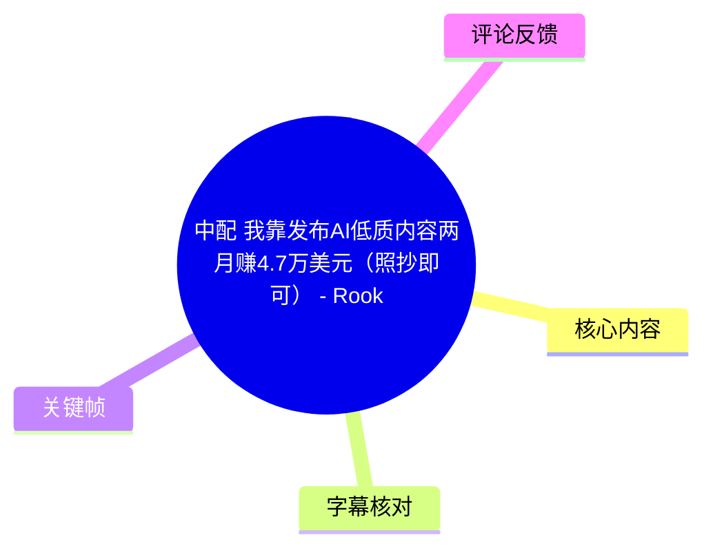
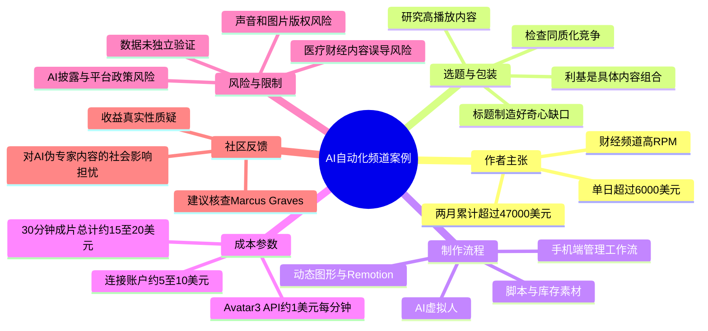
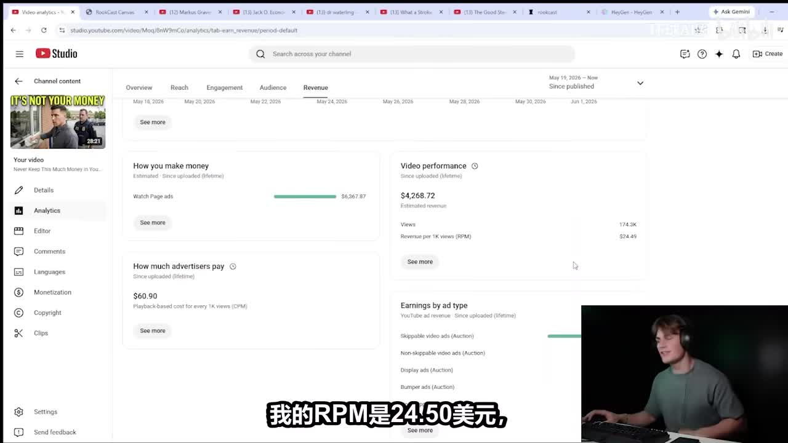
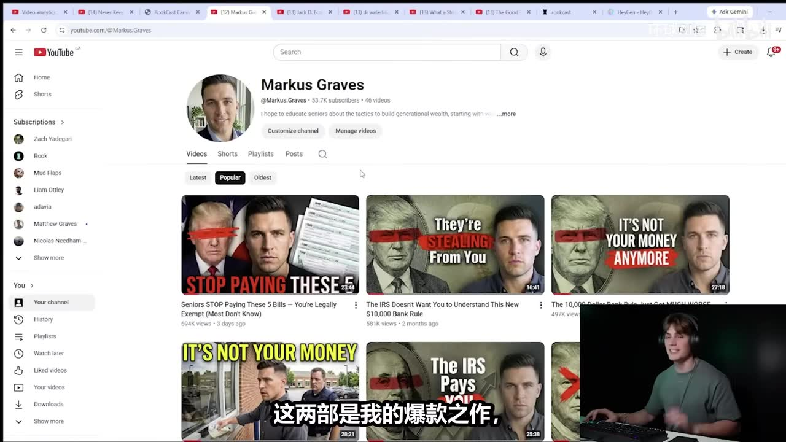
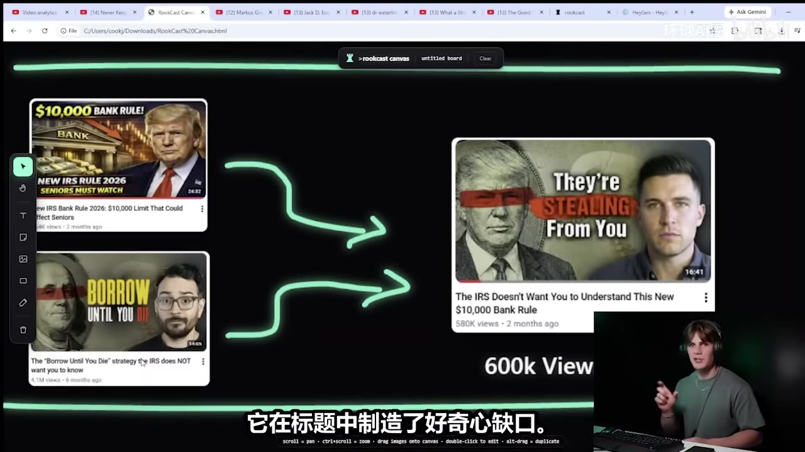
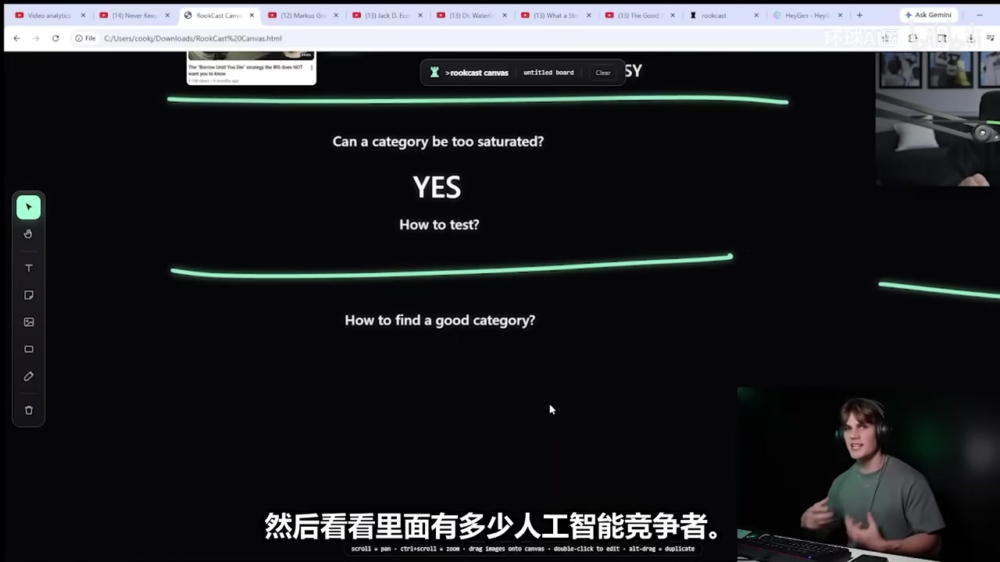

# [中配]我靠发布AI低质内容两月赚4.7万美元（照抄即可） - Rook

> 来源：[Bilibili 视频](https://www.bilibili.com/video/BV1ip7o6vEjs)  
> UP 主：环球AI圈｜原作者：Rook｜视频时长：25:33｜合集：AIcode  
> 素材元数据上传日期标注为 2026-05-29；文中收入、播放量、工具价格及平台规则均为视频录制时的作者自述，具有明显时效性。

## 小结

视频是 Rook 对其 YouTube“自动化”频道运营模式的展示和推销：他声称从新频道发布首条视频起约两个月累计收入超过 **47,000 美元**，某日单日收入超过 **6,000 美元**；其核心频道角色为 “Marcus Graves”，内容主要面向美国财经/中老年受众。作者以 YouTube Studio 画面、频道页和个案视频数据作为佐证，但这些数据仅能说明视频中展示了相关界面，不能独立验证收入归属、统计口径、可持续性或方法普适性。

其可抽取的、相对一般性的内容生产经验包括：不要把“赛道”笼统理解为大类，而要拆成“选题 + 包装 + 目标受众 + 视觉形式”的组合；用搜索结果观察同类内容与竞争密度；在选题、标题和缩略图之间寻找匹配；以“好奇心缺口”组织标题；在生产流程中控制模型、素材和视频生成的成本；以及在发布前进行脚本、画面、缩略图和合规审核。

但视频的关键部分包含高风险主张：作者明确鼓励复用或“偷取”他人的缩略图、背景、声音和内容包装，并尝试通过真实背景、声音克隆、不回答 AI 内容披露项、频繁变换缩略图等方式规避平台识别、版权风险或获利限制。这些做法可能触及肖像权、著作权、声音人格权、虚假或误导性呈现、平台内容披露及获利政策。本文如实记录其说法，但**不将这些规避策略整理为可执行教程，也不建议实施**。

工具层面，视频演示了名为 **RookCast / Rootcast / Rocas**（ASR 转写存在混用，以下统一称“RookCast”）的自动化工作流，以及 **HeyGen**、ElevenLabs、MiniMax、Remotion、Claude / Sonnet 等服务或模型。作者声称：连接自己的 HeyGen 账户制作约 30 分钟虚拟人口播视频，HeyGen 部分成本约 5–10 美元，叠加其他环节总成本约 15–20 美元；若用 Avatar 3 API，则约为每分钟 1 美元、30 分钟约 30 美元。上述价格和产品能力均未经过独立核验，且极易随版本、套餐、地区与用量改变。

适合把本视频作为“AI 内容农场、自动化媒体生产和平台激励扭曲”的案例研究，而不适合作为可直接照搬的经营指南。尤其是金融、医疗、养老护理等高风险信息领域，应坚持来源可核验、专业审查、原创授权和明确披露，不能因视频中声称“有效”而省略事实核验或伦理判断。

## 思维导图

## 目录

- [收入主张、证据与案例结构](#收入主张证据与案例结构)
- [选题：从大类转为具体“内容组合”](#选题从大类转为具体内容组合)
- [饱和度判断与家庭护理案例](#饱和度判断与家庭护理案例)
- [虚拟人、声音与合规红线](#虚拟人声音与合规红线)
- [RookCast 制作工作流与参数](#rookcast-制作工作流与参数)
- [生成、审核、移动端与成本](#生成审核移动端与成本)
- [缩略图、发布与作者的规避主张](#缩略图发布与作者的规避主张)
- [关键帧索引](#关键帧索引)
- [结论、限制与时效性](#结论限制与时效性)
- [字幕比对](#字幕比对)
- [评论分析](#评论分析)
- [处理记录](#处理记录)

## 收入主张、证据与案例结构 [00:00:32](https://www.bilibili.com/video/BV1ip7o6vEjs?t=32)

作者开场称，自己从一个全新频道发布第一条视频起，在两个多月内累计收入超过 **4.7 万美元**，前一天单日收入超过 **6,000 美元**。他声称将展示：

1. 如何发现可获利的细分领域；
2. 如何在不到 10 分钟内启动视频制作；
3. 如何发布所谓“AI 低质内容”而不失去获利资格。

这里的“10 分钟”在后文被解释为**启动与交代自动化流程所需的人力操作时间**，而非最终视频在 10 分钟内完全渲染完成。作者后续又说完整成片通常仍要等待约 15–25 分钟，因此不能把“10 分钟”理解为端到端交付时长。

[00:00:56](https://www.bilibili.com/video/BV1ip7o6vEjs?t=56) 作者展示 YouTube Studio 收益界面，称一支 **28 分钟**视频的 RPM（Revenue Per Mille，每千次观看收入）为 **24.50 美元**。他介绍频道人物 “Marcus Graves”为一个谈论金融的 AI 虚拟人，并举例称题为“不要把这么多钱存在银行账户里，IRS 正在盯着你”的视频播放超过 30 万，收入超过 6,000 美元。

需要区分三层信息：

- **视频内可见事实**：视频画面展示了 YouTube Studio、频道列表和收入数字。
- **作者自述**：频道由其运营、数据完整真实、收入可归因于该策略、RPM 可复现。
- **无法从素材独立确认的事项**：后台账号所有权、收入是否扣除成本/税费、是否包含其他来源收入、受众地域与广告填充率、未来是否仍可获利。

> 图：该画面是作者用于支持“RPM 24.50 美元”和收入主张的关键证据。它的价值在于保留了视频中的展示语境；但单张后台截图不能替代第三方审计，也无法证明收益的完整来源与可复现性。

[00:01:20](https://www.bilibili.com/video/BV1ip7o6vEjs?t=80) 作者将视频结构概括为两层：前景是 AI 虚拟人 “Marcus Graves” 口播，叠加层为动态图形、素材画面等。他承诺后续演示把虚拟人、脚本、动态图形和剪辑串联成统一流程的系统。

## 选题：从大类转为具体“内容组合” [00:01:44](https://www.bilibili.com/video/BV1ip7o6vEjs?t=104)

作者的核心判断是：**“利基（niche）不是宽泛类别，而是一个可被识别的视频创意组合。”** 他反对仅以“美国理财”“医生赛道”这类大类定义赛道，而主张将其具体化为：

- 特定主题或问题；
- 特定目标人群；
- 标题的叙事承诺；
- 缩略图的视觉风格；
- 人物形象和表达形式；
- 片长与内容结构。

[00:02:08](https://www.bilibili.com/video/BV1ip7o6vEjs?t=128) 他以 AI 医生样式为例：蓝色背景、站立人物、相似标题形式构成一个更具体的内容组合。随后展示一个两周前约 150 万播放的视频与一个仅约 19 播放的相似作品，借此说明“只照搬一个赛道或单一案例”不保证成功。

[00:02:57](https://www.bilibili.com/video/BV1ip7o6vEjs?t=177) 作者展示自己的频道页，称两支爆款分别有约 50 万和 60 万播放、各带来约 1 万美元收入；并声称另一个频道使用接近的标题和缩略图却没有流量。其解释是平台会识别“赤裸模仿”，而原有内容已经满足了受众需求。

> 图：频道页展示多条美国财经主题视频及其统一的封面风格，有助于理解作者所说的“人物角色 + 受众 + 标题/缩略图包装”组合。画面中的播放量属于录制时页面状态，不能推导为实时数据或长期表现。

[00:03:22](https://www.bilibili.com/video/BV1ip7o6vEjs?t=202) 作者提出的实际策略是：从两个表现好的内容中分别抽取“选题”和“包装”，组合出新视频。他举的例子包括：

| 来源要素 | 作者认为的优点 | 被整合后的方向 |
| --- | --- | --- |
| “10,000 美元银行规则”视频 | 选题较新，但标题和缩略图较弱 | 保留“银行规则”主题 |
| “借债到死”视频 | 题材较饱和，但标题、缩略图强 | 借用“IRS 不想让你知道”的好奇心表达 |
| 整合结果 | 新主题与强包装结合 | “IRS 不想让你明白这条 1 万美元银行规则” |

> 图：画面将两条来源视频通过箭头汇聚到一条新视频，直观呈现作者的组合逻辑。其“借鉴”说法在实际执行中必须受原创性、著作权、商标、肖像及平台重复内容规则约束，不能等同于复制标题、画面或脚本。

从内容策略角度，可迁移的正当做法是：分析受众需求、信息缺口、表达方式和竞争格局，产出有独立研究、独立脚本和独立视觉设计的新内容。不可迁移的是作者将他人作品直接称为“偷来”的态度与操作倾向。

## 饱和度判断与家庭护理案例 [00:05:22](https://www.bilibili.com/video/BV1ip7o6vEjs?t=322)

作者认为美国财经 AI 虚拟人赛道已经高度拥挤，声称不宜继续开设同质账号。接着，他以 “Dr. Waterling” 的医疗类账号为例，说明判断饱和度的一种观察法：

1. 将热门视频标题复制到站内搜索；
2. 观察搜索结果中是否出现大量相近的 AI 虚拟人模仿内容；
3. 若已有数百条相似内容，则认为该具体形式已经饱和。

> 图：该关键帧把“类别是否过度饱和”“如何测试”“如何找到好类别”并列，是理解作者调研框架的结构性画面。它展示的是创作者的经验判断，不是平台公开的排名或推荐公式。

[00:06:15](https://www.bilibili.com/video/BV1ip7o6vEjs?t=375) 他声称医疗 AI 虚拟人内容已有大量跟风者，因此不建议进入。这里应补充一个比“竞争激烈”更重要的现实限制：医疗、健康、养老护理等领域涉及高风险建议，内容创作人即使没有伪装医生，也应避免给出未经证实、可能影响诊疗或用药的建议；若伪装专业人士，则风险进一步上升。

[00:06:39](https://www.bilibili.com/video/BV1ip7o6vEjs?t=399) 作者转而观察到一位真人女性发布家庭护理建议，称该新频道多条作品达到约 10 万播放、部分超过 100 万。其推理是：此类内容需求存在，但采用 AI 虚拟人形态的竞争者较少，因而存在可进入空间。

[00:07:28](https://www.bilibili.com/video/BV1ip7o6vEjs?t=448) 作者建议浏览数小时，找出两条“互补的爆款视频”，再把各自优点整合成新的内容组合。此处较有价值的原则是：**先验证受众是否对议题有需求，再设计差异化表达**。但需求验证不等于可以省略专业能力、事实核查、来源引用和授权审查；对于家庭护理内容，尤其应加入风险提示、合格专业人士审阅与可靠来源。

## 虚拟人、声音与合规红线 [00:08:16](https://www.bilibili.com/video/BV1ip7o6vEjs?t=496)

作者开始演示虚拟人制作。他先让图像生成器生成“坐在办公桌前的女性”，随后却称纯 AI 生成画面可能包含平台可识别的 AI 痕迹，进而增加取消获利资格的风险。

[00:09:09](https://www.bilibili.com/video/BV1ip7o6vEjs?t=549) 随后作者提出：拿真实 YouTube 视频的人物背景作为参考，只替换主体角色，借此减少 AI 检测；[00:09:58](https://www.bilibili.com/video/BV1ip7o6vEjs?t=598) 又建议从他人 YouTube 视频提取音频，借助 ElevenLabs 或 MiniMax 克隆声音。

这些内容属于视频的事实记录，但不能作为合规建议。主要风险包括：

| 作者的说法 | 可能涉及的风险 | 合规替代方向 |
| --- | --- | --- |
| 取用他人视频背景后替换人物 | 原视频画面版权、场景中可能存在的商标/肖像、误导观众 | 使用自主拍摄、明确商用授权的素材库、或可验证来源的自有视觉资产 |
| 克隆他人声音 | 声音人格权、隐私、冒充、消费者误导、平台政策 | 使用本人声音、已取得书面授权的配音，或明确允许商用的合成音色 |
| 让平台误以为真人内容 | 欺骗性呈现、AI 内容政策与披露义务风险 | 依据平台当期政策如实标注、在视频或说明中清楚披露合成元素 |
| 医疗/金融角色包装 | 专业资质误导、高风险信息伤害 | 不伪装医生/理财顾问；引用来源、限定信息性质、必要时请持证人士审核 |

视频中将“平台 AI 检测”和“取消获利资格”直接绑定，是作者的经验性判断，不应被视为平台规则的准确说明。平台的获利审核往往还会考虑重复性、原创性、增值程度、误导行为、版权投诉、受众伤害与政策执行情况，且规则会调整。

## RookCast 制作工作流与参数 [00:10:22](https://www.bilibili.com/video/BV1ip7o6vEjs?t=622)

作者称会结合两款软件，一款为 RookCast，另一款为 HeyGen（ASR 对部分品牌有明显误识，结合上下文和画面将“黑战/黑戴”等校正为 HeyGen）。其介绍的流程可归纳如下：

1. 在 HeyGen 中创建头像，上传形象图片；
2. 为头像配置声音；
3. 在 RookCast 中选择沙盒或预设模板；
4. 定义频道主题、目标受众、视频风格、文案风格和剪辑风格；
5. 由智能体提出或处理视频主题、脚本、口播视频、素材、动态图形和编辑；
6. 在动态工作室/Remotion 环节复查与调整；
7. 制作缩略图、填写发布信息并上传。

### 1. 创建虚拟角色 [00:10:46](https://www.bilibili.com/video/BV1ip7o6vEjs?t=646)

作者以 “Lisa Graves” 为示例角色名，在头像页上传照片、配置角色并绑定声音。他说自己的频道习惯使用 “Graves” 作为角色姓氏。角色命名本身是创作选择，但不得使观众合理误认其为真实专业人士、新闻人物或他人身份。

### 2. 沙盒与预设模板 [00:11:34](https://www.bilibili.com/video/BV1ip7o6vEjs?t=694)

作者将 RookCast 使用方式分为：

- **沙盒模式**：面向经验较多、追求显著不同频道形态的用户；需要与智能体反复沟通工作流，因此作者认为更耗费算力和费用。
- **预设模板**：面向刚起步的用户；作者推荐直接使用 AI 虚拟人频道模板，以降低设置复杂度。

视频展示的示例定位为：**面向 50 岁以上美国郊区家庭的护理市场**。这一定位只是作者演示输入，不表示该人群或主题适合无资质的自动化内容生产。

### 3. 时长、文案与剪辑选择 [00:13:50](https://www.bilibili.com/video/BV1ip7o6vEjs?t=830)

作者在示例中选择“友好专家”风格，演示视频长度为 **3–5 分钟**，称完整实操中也可做更长的视频，甚至后续通过对话要求制作超过 30 分钟的内容。

他选择的文案策略是“好奇心缺口”（curiosity gap）：在标题或开场制造未解信息，使观众继续观看以获得答案。该策略可以用于内容结构，但应避免用无法兑现、夸大恐惧或虚构紧迫性的标题诱导点击。

[00:14:38](https://www.bilibili.com/video/BV1ip7o6vEjs?t=878) 他展示剪辑层选择，包括 B-roll（补充素材）和动态图形；示例最终倾向 B-roll，并认为其适合家庭护理主题。对于这类高风险题材，B-roll 的情绪暗示不能取代事实依据，避免用紧急、恐慌或诊疗场景误导受众。

### 4. 模型、审批与选题控制 [00:15:02](https://www.bilibili.com/video/BV1ip7o6vEjs?t=902)

视频提到可选 Claude 或 Sonnet 等模型。作者偏好 **“Sonnet 4.6”**，认为其较平衡；不过这很可能是 ASR 对具体版本名的误识，素材没有提供可核验的产品版本界面或官方文档，因此应视为“作者口述的 Sonnet 型号/版本”，不要据此确认真实存在的公开型号。

作者还提到两种执行方式：

| 设置 | 作者描述 | 合理的风险控制建议 |
| --- | --- | --- |
| 自动模式 | 智能体直接继续生成整个工作流，不逐项询问 | 仅适合经过验证的低风险、授权素材流程；仍应保留最终人工审核 |
| 请求批准 | 每一阶段先请求确认 | 新频道、新领域、医疗/金融/法律主题、涉及肖像或版权素材时更应采用 |

[00:15:58](https://www.bilibili.com/video/BV1ip7o6vEjs?t=958) 工具给出“5 种日常清洁产品绝不可混合使用”作为主题。作者自己也承认这不是他通常会发的优质选题，并提醒观众不要只从 RookCast 拿点子、仍要自行做平台调研。这是视频中少数明确强调人工调研和判断的部分。

## 生成、审核、移动端与成本 [00:16:23](https://www.bilibili.com/video/BV1ip7o6vEjs?t=983)

作者演示修改工作流：不让系统制作缩略图；对于 B-roll，只用低价库存素材，不生成 AI B-roll，以控制成本。该选择具备普遍参考意义——生成式视频素材成本可能显著高于库存素材——但前提是库存素材须有与发布用途匹配的授权。

[00:17:17](https://www.bilibili.com/video/BV1ip7o6vEjs?t=1037) 作者通过自然语言指令让智能体写脚本，并坦言自己通常不阅读完整脚本，而是让系统继续生成口播头像、库存素材覆盖层和动态图形。这种做法对低风险内部草稿尚可节省时间，但对公开传播内容风险极高：

- 脚本可能出现事实错误、过时信息、夸大结论或虚构来源；
- 健康、金融、法律、税务主题中，未经审阅的内容可能造成实际伤害；
- 自动生成内容可能混入版权不明素材、错误引用或不当人物表述；
- 若使用合成声音或人物，最终发布前应检查是否存在误导性身份呈现。

### 成本参数 [00:18:11](https://www.bilibili.com/video/BV1ip7o6vEjs?t=1091)

作者给出的成本数字如下，均为其口述案例：

| 项目 | 作者称法 | 适用前提与注意事项 |
| --- | --- | --- |
| Avatar 3 API | 约 **1 美元/分钟** | 仅指作者口述的 API 成本，不含脚本、素材、动态图形及其他服务 |
| 30 分钟 Avatar 视频 API | 约 **30 美元** | 由“1 美元/分钟”推算，未独立验证 |
| 连接自己的 HeyGen 账户 | 约 **5–10 美元** | 作者称这是 HeyGen 部分费用；套餐、额度和地区会影响结果 |
| 30 分钟成片总成本 | 约 **15–20 美元** | 作者称包含其他环节后的估算，未展示完整账单 |
| 完整视频等待时间 | 约 **15–25 分钟** | 取决于片长、队列、模型与服务状态，不应承诺为固定时长 |

[00:18:59](https://www.bilibili.com/video/BV1ip7o6vEjs?t=1139) 作者展示已生成的清洁主题视频，自己也评价“画质有点低”，并将其归因于所用 Avatar 3。这个片段说明：自动化链路不等同于稳定高质量产出，生成质量、口型、动作、画面一致性和信息准确性都需要验收。

### 移动端工作与 Remotion 审核 [00:19:26](https://www.bilibili.com/video/BV1ip7o6vEjs?t=1166)

作者说明启动流程后可以离开电脑，并称 RookCast 网页端可在手机操作；他用手机下达指令，要求完成动态图形流程后打开 **Remotion** 以供审核。

[00:20:57](https://www.bilibili.com/video/BV1ip7o6vEjs?t=1257) 他称系统可在手机端接受语音转文字指令，之后进入动态工作室，用户可与系统来回沟通、修改动态图形布局和画面。可移动管理是该工作流的便利性，但“可远程运行”不能替代发布前复核。最低限度的审核清单应包括：

- 标题、缩略图是否准确而不过度承诺；
- 事实、数据、引用是否可溯源；
- 是否含未经授权的图片、视频、音乐、声音或人物形象；
- 合成媒体是否按当期平台规则披露；
- 健康、金融、税务等内容是否有合格专业人士审查；
- 评论区与投诉渠道是否可被及时响应。

## 缩略图、发布与作者的规避主张 [00:21:21](https://www.bilibili.com/video/BV1ip7o6vEjs?t=1281)

作者说“缩略图和发布”是最后一步，但马上修正为缩略图应在构思创意时就准备。这个判断在产品化内容生产中合理：缩略图、标题与选题应共同服务于目标受众和内容承诺，而不是在成片后随意拼接。

但 [00:21:45](https://www.bilibili.com/video/BV1ip7o6vEjs?t=1305) 作者示范“从别人那里拿缩略图，稍作修改”的说法不可采纳。具体而言，缩略图可能包含摄影作品、插画、字体、商标、名人肖像和独特视觉编排；即使替换人物，也不自动消除著作权、混淆或不正当竞争风险。正确方式是原创设计，或使用许可范围明确的素材。

[00:22:09](https://www.bilibili.com/video/BV1ip7o6vEjs?t=1329) 作者又把发布字段的重要性压缩为 AI 内容复选框，并称自己选择“不回答”，以避免标题旁出现 AI 水印，同时声称这样没有被取消获利资格。该说法既是规避披露的主张，也不构成任何平台政策依据。

应当明确：

- 平台是否要求披露、如何披露、披露会如何展示，均以发布时对应平台的官方政策与表单说明为准；
- “不回答”不意味着没有义务，也不保证不会被审核、下架、限流、取消获利或被投诉；
- 对可能被误认为真人录制、真人发言、真实事件或专业建议的合成内容，透明披露通常更能降低受众误导风险；
- 任何试图绕过审核、检测或获利限制的操作都可能增加账号与法律风险。

[00:22:58](https://www.bilibili.com/video/BV1ip7o6vEjs?t=1378) 作者称频繁使用相同缩略图可能被平台认定为重复内容，因此主张不断更换缩略图风格，并展示其从旧样式切换到类似执法记录仪风格后播放量回升的案例。缩略图测试本身是常见内容运营手段，但其目的应是提高信息表达的清晰度、识别度与受众匹配，而非规避重复内容审查。

[00:24:10](https://www.bilibili.com/video/BV1ip7o6vEjs?t=1450) 作者称某条视频在 5 月 27 日统计约收入 9,000 美元，且播放量从 40 万增长至 70 万，因数据未更新而估计实际收入更高。视频随后号召观众重看流程、加入其 Discord 社群学习平台自动化。该结尾既是课程/社群导流，也意味着视频具有营销目的；对收入承诺、工具推荐和方法成功率，应保持额外审慎。

## 关键帧索引

| 关键帧 | 对应内容 | 使用价值 |
| --- | --- | --- |
|  | YouTube Studio 收益与 RPM 展示，约 [00:56](https://www.bilibili.com/video/BV1ip7o6vEjs?t=56) | 记录作者收入主张的主要画面证据，同时提示不能独立验证 |
|  | Marcus Graves 频道与热门视频，约 [02:33](https://www.bilibili.com/video/BV1ip7o6vEjs?t=153) | 展现频道的目标主题、封面统一性与播放量语境 |
|  | 两条来源视频汇聚为一条新视频，约 [04:34](https://www.bilibili.com/video/BV1ip7o6vEjs?t=274) | 解释作者“选题和包装组合”的方法论，同时标记版权边界 |
|  | “类别是否饱和”的问题框架，约 [06:39](https://www.bilibili.com/video/BV1ip7o6vEjs?t=399) | 概括竞争密度、调研和选题判断三者的关系 |

## 结论、限制与时效性

### 可迁移的经验

1. **用具体内容组合而非宽泛赛道定义定位。** 可将目标受众、问题场景、叙事角度、视觉形式和内容深度拆开验证。
2. **将“有需求”与“竞争可进入”分别判断。** 搜索结果、近期内容表现、同类创作者密度可作为初步信号，但不能替代受众调研。
3. **在生产前确定内容承诺。** 标题、缩略图、脚本和视频主体应表达同一个可兑现的承诺。
4. **自动化应把人工时间用于研究与审核。** 自动化节省的是重复劳动，不应减少事实核验、来源审查、版权确认和风险把关。
5. **成本应按全链路计算。** 除视频生成外，还包括订阅、API、库存素材、配音、剪辑、审核、返工、版权授权及可能的合规成本。

### 不应照搬的部分

视频中有关复用他人背景、克隆他人声音、复制他人缩略图、故意不作 AI 披露、试图规避平台检测与获利限制的建议，存在明显法律、伦理和平台政策风险。即使某些做法在作者展示时未出现即时后果，也不能证明其合法、合规、可持续或适用于他人。

### 时效性说明

- 视频元数据标注的上传日期为 **2026-05-29**，所展示后台数据、播放量和价格可能更早形成。
- “两个月 4.7 万美元”“单日 6,000+ 美元”“RPM 24.50 美元”“单条 9,000 美元”等均是作者在录制时的自述或屏幕展示，不代表现在仍成立。
- RookCast、HeyGen、ElevenLabs、MiniMax、Remotion、Claude/Sonnet 的名称、定价、套餐、模型版本、API 能力和政策均可能变化。
- YouTube 对合成内容、重复内容、获利资格、版权及披露的执行规则会更新；执行前应查阅官方最新政策，而不是依赖本视频的个人说法。

## 字幕比对

| 字幕来源 | 完整性 | 专有名词 | 时间轴 | 主要问题 |
| --- | --- | --- | --- | --- |
| Bilibili 站内字幕 `p01-ai-zh.srt` | 极低；仅覆盖约 00:07–00:56 的音乐提示 | 无有效专有名词信息 | 有真实 SRT 时间轴，但仅有音乐段 | 没有覆盖正文口播，无法用于知识整理 |
| 本次 ASR 字幕 | 高；71 段，语音覆盖约 1456.05 秒，占视频约 95.01% | 存在明显误识与混写 | 完整提供分段起止时间，正文时间轴主要依据此来源 | 多个长段被压成约 24 秒，品牌、人名和技术名词错误较多 |

### 最终字幕选择

正文以**本次 ASR 的真实起止时间**作为章节时间轴来源；站内字幕已检查，但其内容几乎全部为“♪ 音乐 ♪”，未提供可用口播文本，因此不作为正文事实来源。

本次 ASR 诊断显示：

- 识别语言：中文；
- 语言置信度：0.9985；
- 音频时长：1532.50 秒；
- 首段语音：00:00:32.510；
- 末段语音：00:25:32.270；
- `noAudioStream=true` **未出现**，因此可确认素材包含音轨，未发生“源视频无音轨”情形；
- 最大识别空档约 11.26 秒，位于 00:17:00.880–00:17:12.140。

### 结合上下文和关键帧校正的重点词语

| ASR 表述 | 本文采用 | 校正依据与置信度 |
| --- | --- | --- |
| Marcus Graves / “马克斯”混写 | Marcus Graves | 频道页关键帧与口播上下文；高 |
| Rocast / Rocas / Rootcast / “Rucast” | RookCast | 视频标题页签、口播上下文；中等，未提供官方链接核验 |
| “黑战 / 黑戴 / 黑戛” | HeyGen | 画面页签与“Avatar 3”语境；高 |
| “Pajam” | HeyGen | 作者称两工具联用，后续演示头像服务；中等偏高 |
| “Abtar3 / Abstar3” | Avatar 3 | 与 HeyGen 头像生成、API 单价描述对应；高 |
| “Sonnet 4.6” | 作者口述的 Sonnet 型号/版本 | ASR 文本如此呈现，但版本号未独立核验；低至中等 |
| “IRS” | IRS（美国国税局） | 标题和金融主题上下文；高 |
| “remotion” | Remotion | 视频工作流语境；高 |

## 评论分析

以下仅基于可获取热评前三条，不将评论内容视为已核验事实。

1. **icebleed（105 赞）**  
   评论质疑 UP 主“程序转载近 2000 个视频、5000 多粉丝”的收入情况。该评论将讨论焦点从原作者的 YouTube 收益转向搬运/转载账号本身的变现合理性，反映观众对内容搬运和收益叙事之间关系的质疑。评论未提供可验证的后台数据或链接，因此只能视为质疑，不足以证明任何一方的收入事实。

2. **电玩大叔（46 赞）**  
   评论建议到 YouTube 搜索 “Markus Graves”（拼写与视频中 “Marcus Graves” 有差异）并查看“真实数据”。这是一条可操作的核查线索：可通过频道公开页面观察视频数量、发布时间、播放量和内容样式。但公开数据仍无法验证 RPM、收入归属、成本、是否删改视频或后台获利状态，故不能单靠频道页得出“作者所有收入主张真实/虚假”的结论。

3. **刺客猫AssassinCat（36 赞）**  
   评论称曾见过伪装医生讲健康问题、伪装高龄老人讲人生经验的中文 AI 内容，并担心观众难以辨别，认为此类网络垃圾具有负面社会影响、应受到限制。该观点与视频中“家庭护理”“AI 虚拟人”“规避识别”的风险高度相关，尤其指出了受众信任被利用的问题。评论属于价值判断与个人观察，不能证明具体频道的违法违规状态，但提出了本视频最需要重视的公共风险：合成身份与高风险信息结合后可能造成误导。

## 处理记录

- Worker ID：`worker-mrj0wbly-5dc4e50c`
- 模型：`gpt-5.6-terra`
- 调用工具与素材：视频元数据、站内字幕 `p01-ai-zh.srt`、本次 ASR 结果 `asr/asr-result.json`、ASR SRT `asr/transcript.srt`、关键帧目录 `frames/`、热评数据 `comments/comments.json`
- 使用的应用工具：素材解析与 ASR 结果读取；未对外部网站、原作者频道、RookCast、HeyGen、Discord 或平台政策页面进行实时联网核验。
- 字幕选择：已检查站内字幕与本次 ASR；站内字幕仅含短暂音乐提示，正文以 ASR 作为主要文本与时间轴依据，并对品牌、人名等误识结合关键帧和上下文做了保守校正。
- 音轨判断：ASR 结果未标记 `noAudioStream=true`，且诊断显示语音覆盖约 95.01%，因此按“视频存在音轨”处理。
- 关键帧选择依据：选用 `frame-001` 至 `frame-004`，分别对应收入/RPM 佐证、频道页面、内容组合逻辑和饱和度判断框架；这些画面直接支撑正文的重要论点，且避免把不完整画面当作独立事实证明。
- 缓存清理：未提供本任务执行环境中的缓存清理日志；本文不声称已执行文件删除或缓存清理。
- 未解决问题：
  - 作者收入、账号归属、完整成本和数据口径未获第三方审计；
  - “RookCast”准确产品名称、版本、价格和功能未通过官方资料核验；
  - “Sonnet 4.6”是否为准确模型版本无法仅凭 ASR 确认；
  - 视频中涉及平台检测、AI 披露与获利政策的描述仅为作者经验，未与平台当期官方规则逐条比对；
  - 关键帧仅能辅助理解录制时页面，不能替代实时页面或原始后台记录。
