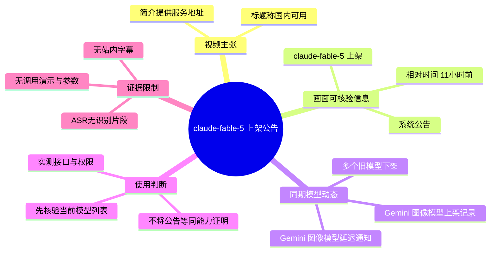
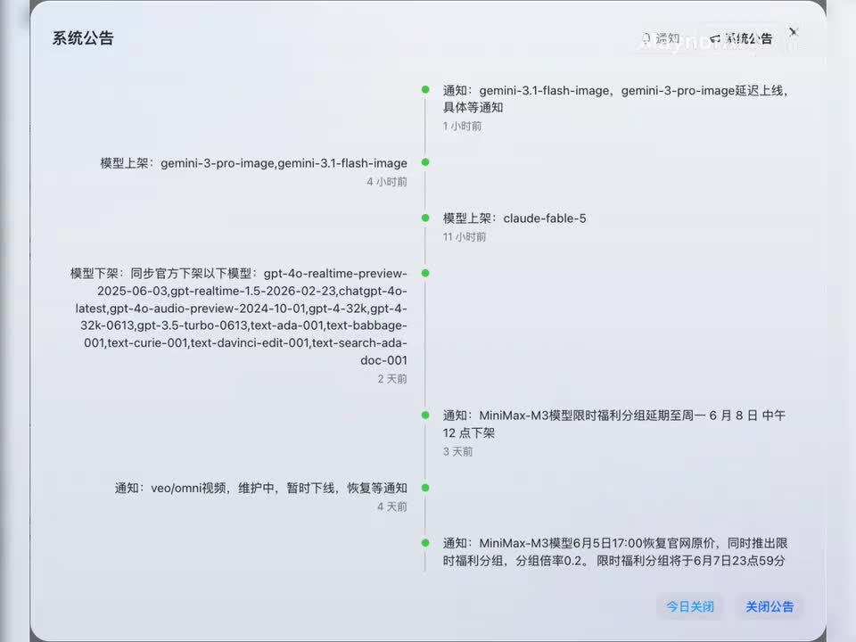

# 刚刚，claude-fable-5上线，国内可用！

> 来源：[Bilibili 视频](https://www.bilibili.com/video/BV1WvER6kExH)  
> UP 主：MaynorAI｜时长：12 秒｜合集：AIcode｜发布于：2026-06-10  
> 视频简介提供了服务地址：<https://apipro.maynor1024.live/>

## 小结

视频以一张“系统公告”时间线截图为主体，核心信息是：该平台公告中出现了“**模型上架：claude-fable-5**”，公告相对时间显示为“11 小时前”。视频标题进一步将其概括为“claude-fable-5 上线，国内可用”。

需要严格区分信息层级：画面能够直接证明的是**某一平台的系统公告中列出了 `claude-fable-5` 上架记录**；“国内可用”是视频标题与简介链接传达的主张。现有素材没有展示模型调用页面、接口请求、鉴权方式、价格、配额、上下文长度、输出能力或实际生成结果，因此不能据此确认该模型的真实能力、供应链来源与持续可用性。

同一公告还呈现了模型供给变化：`gemini-3-pro-image` 与 `gemini-3.1-flash-image` 被列为上架；另一条更新称二者“延迟上线，具体等通知”。这意味着公告内部存在状态更新，使用前应以服务平台的当前可选模型列表和实际调用结果为准。

画面还列出一批同步下架模型，包括部分 GPT-4o Realtime、GPT-4 系列、GPT-3.5 Turbo 与旧版文本模型。这提醒使用者：若工作流依赖具体模型 ID，应建立模型清单、可用性探测与替代策略，而不应把单次公告视为永久配置。

视频没有提供可用的站内字幕；本次 ASR 也未识别出任何语音片段。因此，本文以视频标题、简介、元数据和关键帧内可读文字为依据整理，所有无法从画面核验的能力、价格与使用步骤均明确保留为未知。

## 思维导图

## 目录

- [视频范围与证据边界](#视频范围与证据边界)
- [系统公告中的 claude-fable-5 上架记录](#系统公告中的-claude-fable-5-上架记录)
- [同期模型变动与技术影响](#同期模型变动与技术影响)
- [可执行的核验步骤](#可执行的核验步骤)
- [限制、风险与时效性](#限制风险与时效性)
- [关键帧索引](#关键帧索引)
- [字幕比对](#字幕比对)
- [评论分析](#评论分析)
- [处理记录](#处理记录)

## 视频范围与证据边界 [00:00](https://www.bilibili.com/video/BV1WvER6kExH?t=0)

该视频时长为 12 秒，画面为一个标题为“系统公告”的弹窗式时间线。素材未提供带时间戳的站内 SRT，也没有可用 ASR 分段；因此无法按字幕起止时间将公告的每一行精确定位到秒。本章及后续章节统一链接至视频起点，避免依据文字顺序虚构具体出现时刻。

可作为事实依据的来源分为三类：

1. **视频元数据**：标题为“刚刚，claude-fable-5上线，国内可用！”，简介含有一个服务地址。
2. **关键帧画面**：系统公告明确显示“模型上架：claude-fable-5”及“11 小时前”。
3. **ASR/字幕诊断**：站内字幕缺失，本次 ASR 无文本输出，故不能从语音补充画面未显示的信息。

以下内容中的“平台公告显示”仅指该视频画面内的公告；并不自动等价于模型官方发布、原厂 API 已上线，或所有地区与账户均可访问。

## 系统公告中的 claude-fable-5 上架记录 [00:00](https://www.bilibili.com/video/BV1WvER6kExH?t=0)

画面中部的时间线条目写有：

> 模型上架：`claude-fable-5`  
> 11 小时前

这构成视频最核心的可见信息。按画面文字，`claude-fable-5` 是该平台在公告中使用的模型标识符；视频未展示该标识符背后的模型提供方、版本说明、发布日期、文档、计费规则或模型卡。

> 图：关键帧展示了“系统公告”时间线，其中可直接读到“模型上架：claude-fable-5”及“11 小时前”。它是判断视频主要新闻点的直接视觉证据，同时也说明视频展示的是公告记录而非调用实测界面。

### 对“国内可用”的审慎解读

视频标题称“国内可用”，简介给出了 `<https://apipro.maynor1024.live/>`。由此最多可以整理为：

- UP 主正在指向一个可访问的服务入口；
- UP 主主张该入口可提供 `claude-fable-5`；
- “国内可用”并未在画面中通过成功请求、账户注册、支付方式、地域检测结果或延迟测试得到展示。

因此，若要将该信息用于生产环境，应把“可用”拆成可验证的条件：页面能否打开、账号能否获取权限、模型 ID 是否出现在当前列表、请求是否返回成功、费用与限额是否符合预期，以及服务是否稳定。

## 同期模型变动与技术影响 [00:00](https://www.bilibili.com/video/BV1WvER6kExH?t=0)

### Gemini 图像模型的相互冲突状态

公告上方同时出现两类与 Gemini 图像模型相关的记录：

- “模型上架：`gemini-3-pro-image`,`gemini-3.1-flash-image`”，相对时间为“4 小时前”；
- “通知：`gemini-3.1-flash-image`、`gemini-3-pro-image` 延迟上线，具体等通知”，相对时间为“1 小时前”。

这两个条目表明，平台可能先记录了模型上架，后又发布延迟上线通知。对于使用者而言，应优先采取较新的状态通知：即不要仅因列表中曾出现模型名就默认可调用，而应在发起任务前实测。

### 公告列出的下架模型

画面左侧可见“模型下架：同步官方下架以下模型”，列出的模型 ID 包括：

- `gpt-4o-realtime-preview-2025-06-03`
- `gpt-realtime-1.5-2026-02-23`
- `chatgpt-4o-latest`
- `gpt-4o-audio-preview-2024-12-17`
- `gpt-4-32k`
- `gpt-4-32k-0613`
- `gpt-3.5-turbo-0613`
- `text-ada-001`
- `text-babbage-001`
- `text-curie-001`
- `text-davinci-edit-001`
- `text-search-ada-doc-001`
- `gpt-4-vision-preview`

该清单反映的是视频画面中的平台公告，不能单独推导为所有上游厂商、所有 API 网关或所有地区都已同时停止服务。其工程意义是：**模型名称与可用性是动态配置，而非固定依赖。**

### 其他公告信息

画面下方还能看到：

- “通知：`veo/omni视频`，维护中，暂时下线，恢复等通知”，显示为“4 天前”；
- 多条与 `MiniMax-M3` 相关的限时福利、恢复官网原价及限时福利分组信息。

这些内容不是视频标题的主线，但说明截图所处的是一个频繁调整模型、视频能力和促销活动的服务公告面板。模型接入与资源可用状态可能随时变化。

## 可执行的核验步骤 [00:00](https://www.bilibili.com/video/BV1WvER6kExH?t=0)

视频没有演示操作流程，以下是基于其公告性质整理的**使用前核验步骤**，并非视频中已展示的操作界面或参数。

1. **访问视频简介给出的入口**
   - 访问 `<https://apipro.maynor1024.live/>`。
   - 核对域名、页面证书、服务条款、隐私说明与账户主体。
   - 不要仅依据视频标题输入 API Key、支付信息或业务敏感文本。

2. **在当前模型列表中检索模型 ID**
   - 检查是否存在完全一致的 `claude-fable-5`。
   - 记录平台实际展示的模型名、别名、能力标签、上下文限制、输入输出模态和计费说明。
   - 若只出现相近名称，不能直接视为视频中的同一模型。

3. **使用非敏感测试提示词验证调用**
   - 先使用无个人数据、无商业机密的短文本测试。
   - 观察返回状态、错误代码、实际响应模型名、响应时间和可重复性。
   - 若接口返回的 `model` 字段与请求 ID 不一致，应记录平台的路由或降级行为。

4. **确认权限、额度与费用**
   - 视频未提供任何价格、免费额度、并发限制、速率限制或最大 token 参数。
   - 在平台当前文档、控制台或账单页确认后再接入生产流程。
   - 针对关键任务设置预算上限与调用日志。

5. **准备模型替代方案**
   - 对依赖被下架模型的工作流，将模型名配置化，而非写死在业务代码中。
   - 为文本、实时语音、视觉和图像生成任务分别准备替代模型与失败降级路径。
   - 定期对模型目录进行可用性探测，特别是公告已提示延迟上线或维护中的能力。

## 限制、风险与时效性 [00:00](https://www.bilibili.com/video/BV1WvER6kExH?t=0)

### 素材可证实与不可证实的范围

| 项目 | 素材支持程度 | 说明 |
| --- | --- | --- |
| `claude-fable-5` 被列为上架模型 | 可由画面直接确认 | 系统公告中有对应文字与“11 小时前”标记。 |
| 视频作者主张“国内可用” | 可确认其为视频主张 | 由标题和简介服务链接支持。 |
| 模型实际可调用 | 未验证 | 未展示调用请求、成功响应或控制台模型列表。 |
| 模型来源与官方关系 | 未说明 | 不能由模型命名推断。 |
| 模型能力、模态、上下文、价格、限额 | 未说明 | 视频中没有参数、文档或测试结果。 |
| 服务长期稳定性 | 未验证 | 同画面显示模型上架、延迟、维护和下架等频繁状态变更。 |

### 时效性提示

- 视频发布于 2026-06-10；公告使用“1 小时前”“4 小时前”“11 小时前”等相对时间，具体公告绝对发生时间未在画面中完整呈现。
- 公告中的模型上架或下架状态可能已在视频发布后发生变化。
- 视频展示 `gemini-3-pro-image` 与 `gemini-3.1-flash-image` 的上架记录和延迟通知并存，尤其说明应以**当前控制台状态**而非历史截图判断可用性。
- 若业务有合规、数据主权或稳定性要求，应先审查服务提供方的条款和数据处理方式，不要因“国内可用”的营销表述而跳过评估。

## 关键帧索引 [00:00](https://www.bilibili.com/video/BV1WvER6kExH?t=0)

本次提供的 12 张关键帧均呈现同一系统公告界面或近似画面。正文选用 `frame-001.jpg`，原因是其文字完整、`claude-fable-5` 上架条目清晰，同时能保留 Gemini 变动与模型下架清单的上下文。

| 关键帧 | 用途 | 画面价值 |
| --- | --- | --- |
| `frames/frame-001.jpg` | 正文主证据图 | 可同时核验公告标题、`claude-fable-5` 上架记录、相对时间及相关模型变动。 |
| `frames/frame-002.jpg`—`frames/frame-012.jpg` | 辅助复核 | 与主画面内容高度相近，未提供额外独立的操作步骤、调用结果或参数证据，故不重复插入。 |

## 字幕比对 [00:00](https://www.bilibili.com/video/BV1WvER6kExH?t=0)

| 字幕来源 | 完整性 | 专有名词 | 时间轴 | 主要问题 |
| --- | --- | --- | --- | --- |
| Bilibili 站内字幕 | 不可用 | 无法评估 | 无 | 素材明确说明“未提供可用站内字幕”。 |
| 本次 ASR 字幕 | 无有效内容 | 无法识别 | 无有效分段 | ASR 输出为空；`segments` 为 0，语音覆盖时长为 0 秒。 |

本次 ASR 已实际检查：识别模型为 `medium`，自动检测语言为英语（置信度 `0.541015625`），但没有识别到语音片段，诊断提示应核验源音轨或正确音轨。诊断信息**未标记** `noAudioStream=true`，因此不能断言源视频没有音轨；只能如实记录为“ASR 未识别到可转写语音”。

最终未采用任何字幕文本，而是以关键帧 OCR 可读内容、标题、简介与元数据进行多模态整理。经画面复核并保留原样的关键专有名词包括：

- `claude-fable-5`
- `gemini-3-pro-image`
- `gemini-3.1-flash-image`
- `gpt-4o-realtime-preview-2025-06-03`
- `gpt-realtime-1.5-2026-02-23`
- `gpt-4o-audio-preview-2024-12-17`
- `gpt-4-vision-preview`

由于没有 SRT 的 `HH:MM:SS,mmm --> HH:MM:SS,mmm` 分段，正文未虚构公告文字的逐句时间位置；章节链接统一指向已知的视频起点 `t=0`。

## 评论分析

未获取到可分析的热评。素材中的评论抓取结果为 `items: []`，虽然元数据显示视频有 1 条回复，但本次可获取的热评列表为空。

因此，无法对热评前三条的观点、补充信息、争议或可信度作出分析；也不应以回复数反推评论内容。

## 处理记录

- Worker ID：`worker-mrj0wbly-5dc4e50c`
- 模型：`gpt-5.6-terra`
- 调用工具与素材产物：视频合并文件 `merged.mp4`、音频文件 `audio/audio.wav`、关键帧目录 `frames/`、ASR 产物 `asr/`、评论产物 `comments/comments.json`；本次依据已提供的素材清单与诊断结果整理。
- 字幕选择：站内字幕不可用；已检查本次 ASR，结果为空且无有效时间轴；最终不引用字幕内容，改用标题、简介、元数据和关键帧可读文本。
- 关键帧选择依据：`frames/frame-001.jpg` 清晰呈现系统公告及 `claude-fable-5` 上架条目，且包含同期上架、延迟与下架信息；其余关键帧与之高度相似，未显示额外可核验事实。
- 时间轴依据：无站内 SRT、无 ASR 分段时间；为避免猜测文字出现位置，所有正文视频链接指向可确定的视频起点 `t=0`。
- 缓存清理：素材中未提供缓存清理执行记录，无法确认是否已清理，故不作已清理声明。
- 未解决问题：无法从现有素材确认 `claude-fable-5` 的模型来源、真实能力、调用参数、价格、配额、区域可用性、数据政策及当前是否仍可调用。
