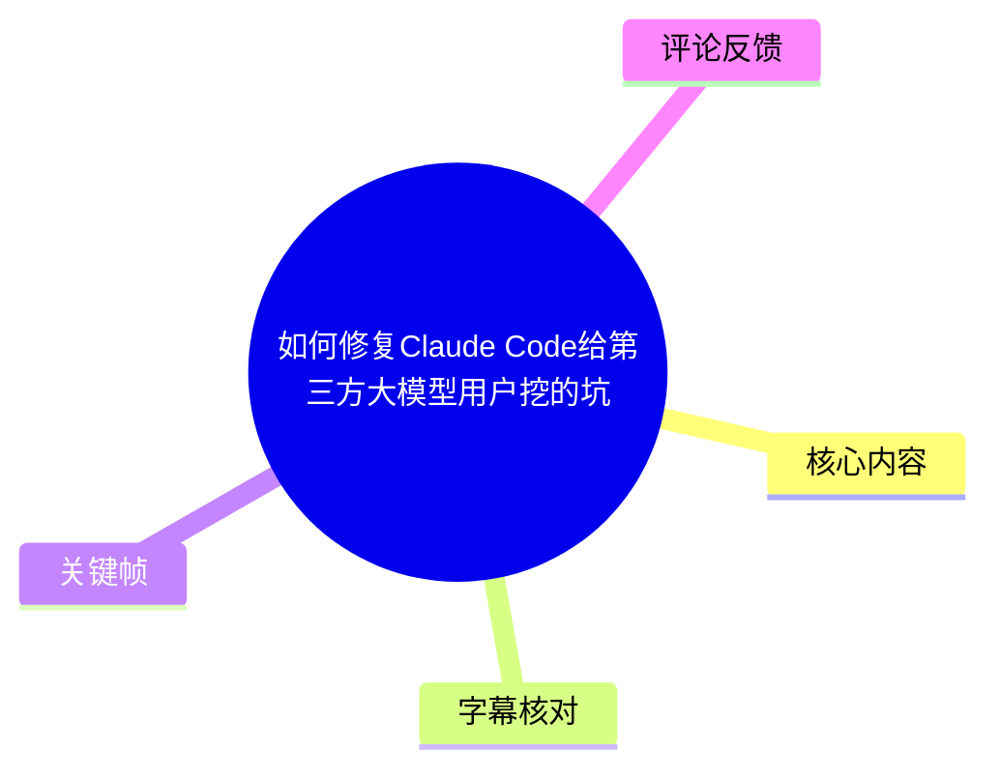
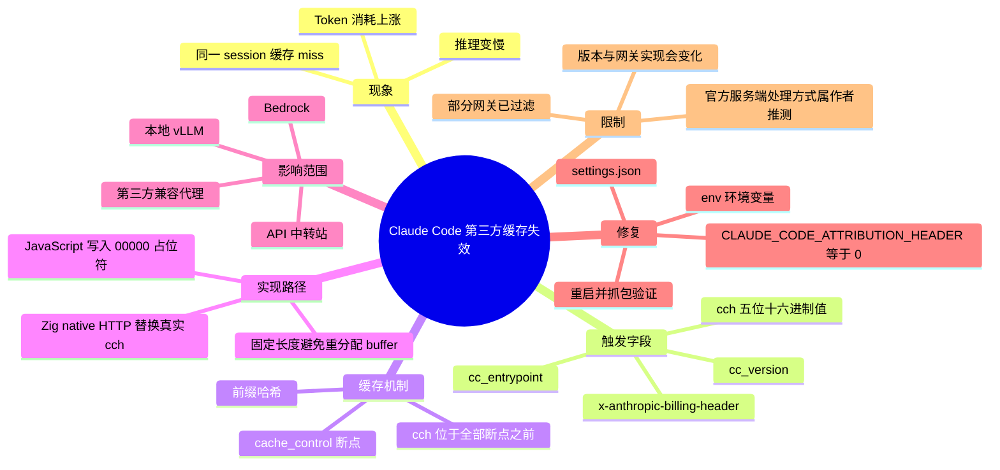
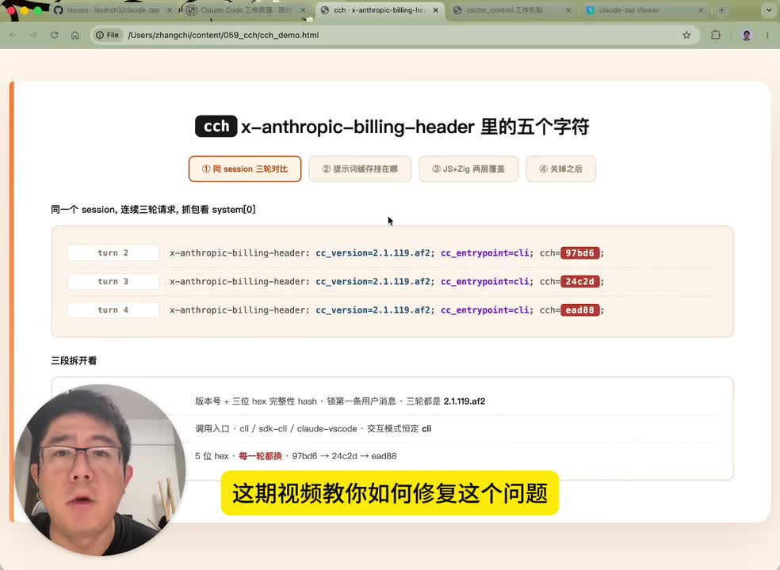
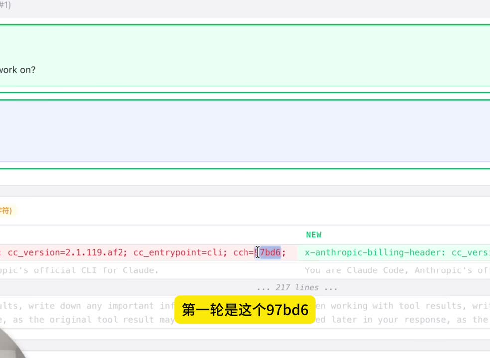
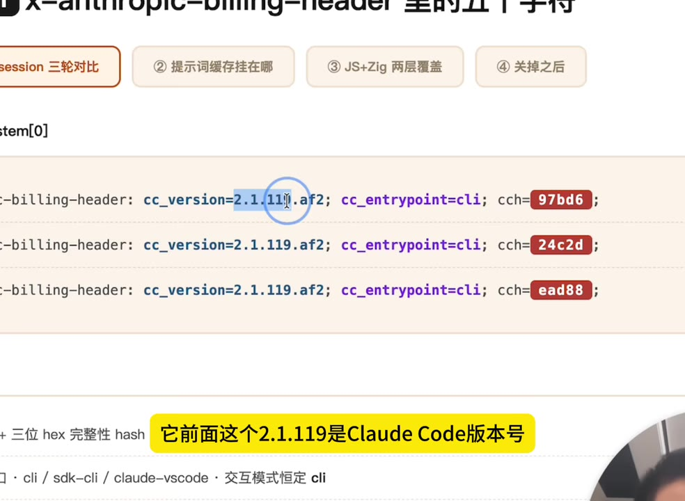
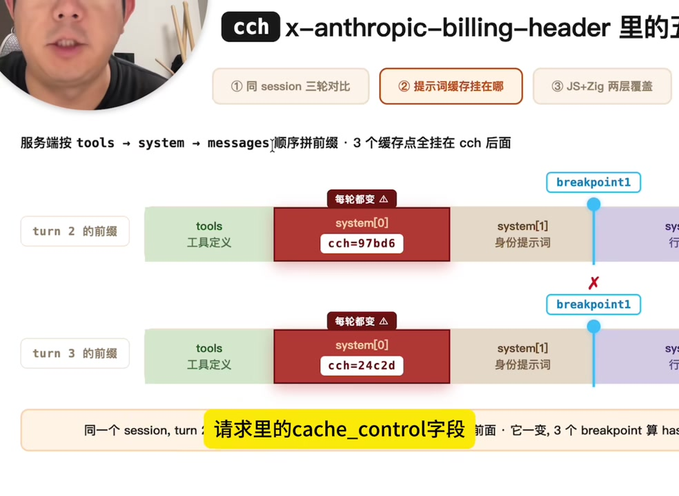

# 如何修复Claude Code给第三方大模型用户挖的坑

> 来源：[Bilibili 视频](https://www.bilibili.com/video/BV1m2LG6WEdH)<br>
> UP 主：张司机在路上｜发布时间：2026-05-16｜视频时长：07:23

## 小结

视频讨论一个面向 **Claude Code 第三方 API / Anthropic 兼容网关用户**的缓存问题：Claude Code 会在请求的 `system` 内容最前方插入一段名为 `x-anthropic-billing-header` 的归属信息，其中的 `cch` 是每次请求都会变化的 **5 位十六进制值**。如果下游网关直接用完整 `system` 内容计算提示词缓存键，这个变化会使前缀哈希持续变化，造成缓存无法命中，表现为推理变慢、Token 消耗上涨。

视频以同一 session 的三次请求为例，展示 `cch` 从 `97bd6` 变为 `24c2d`、再变为 `ead88`。虽然 `cc_version`、`cc_entrypoint` 等字段不变，但处于所有缓存断点之前的 `cch` 发生变化后，后续全部断点对应的前缀缓存都会失配。

作者通过 Claude Code 相关源码说明：JavaScript 层先放入 `cch=00000` 占位符，随后由基于 Zig 的 native HTTP 层在请求即将发送时替换为真实值。其目的被作者解释为识别是否为真实 Claude Code 客户端请求，防止订阅登录态被拿去冒充任意 API 调用；但这一实现会给不了解该机制的第三方转发服务带来兼容性问题。

视频给出的修复方式是：在 `~/.claude/settings.json` 的 `env` 段设置 `"CLAUDE_CODE_ATTRIBUTION_HEADER": "0"`，重启 Claude Code 后，归属块不再插入 `system` 首块。随后应重新抓包确认 `x-anthropic-billing-header` 已消失。

这不是所有第三方服务都会遇到的问题：部分模型厂商、代理或网关可能已主动剥离该归属块，或在计算缓存键时忽略它。视频中的“Anthropic 官方服务端会跳过该段”的说法明确是作者个人推测；热评中则补充了 Claude Code 文档原文方向，但仍应以当前网关实现、Claude Code 版本及实际抓包结果为准。

## 思维导图





## 目录

- [问题现象与适用范围](#问题现象与适用范围)
- [归属块与 cch 的实际变化](#归属块与-cch-的实际变化)
- [为什么 5 个字符会让缓存全部失效](#为什么-5-个字符会让缓存全部失效)
- [源码链路：JS 占位符与 Zig native 覆盖](#源码链路js-占位符与-zig-native-覆盖)
- [设计目的与作者的解释](#设计目的与作者的解释)
- [修复步骤与验证方法](#修复步骤与验证方法)
- [限制、时效性与排查清单](#限制时效性与排查清单)
- [字幕比对](#字幕比对)
- [评论分析](#评论分析)
- [处理记录](#处理记录)

## 问题现象与适用范围 [00:00:24](https://www.bilibili.com/video/BV1m2LG6WEdH?t=24)

视频针对的是将 Claude Code 配置到**第三方 API、Anthropic 兼容转发服务或自建网关**的使用情境。作者给出的典型症状是：

1. 推理速度明显变慢；
2. Token 消耗异常上涨；
3. 明明处在同一段对话中，提示词缓存却频繁失效；
4. 问题未必来自模型本身，而可能是客户端请求体前缀发生了微小但持续的变化。

根据视频描述，Claude Code 自 `2.1.36` 起会在每个请求中加入归属信息；视频画面展示的抓包样本使用 `cc_version=2.1.119.af2`。因此，不能将某一个版本号视为固定规则，排查时应查看本机实际运行的 Claude Code 版本及实际请求内容。

作者建议使用 Claude Tab 抓包，并对同一 session 内的连续请求进行比较。重点不是只看模型响应，而是检查每次请求最前方的 `system` block 是否出现并变化了 `cch` 字段。



> 图：画面并列展示三轮请求的 `x-anthropic-billing-header`，其中 `cch` 依次为 `97bd6`、`24c2d`、`ead88`。这直接说明变化发生在同一 session 的连续轮次之间，是理解缓存失配的核心证据。

## 归属块与 cch 的实际变化 [00:01:00](https://www.bilibili.com/video/BV1m2LG6WEdH?t=60)

视频将这一行内容称为 `x-anthropic-billing-header`。需要注意的是，作者强调它**不是传统 HTTP Header**：它被作为上下文内容放在 `system` 的第一个 block，并随模型请求发送。

视频画面中的格式可概括为：

```text
x-anthropic-billing-header:
cc_version=2.1.119.af2;
cc_entrypoint=cli;
cch=97bd6;
```

视频逐项解释了字段含义：

| 字段 | 视频中的解释 | 变化情况 |
| --- | --- | --- |
| `cc_version` | Claude Code 版本及附加标识，例如画面中的 `2.1.119.af2` | 同一示例中保持不变 |
| `cc_entrypoint` | 客户端启动入口；`cli` 表示命令行模式 | 同一示例中保持不变 |
| `cch` | 5 位十六进制字符 | 每次请求变化 |
| `sdk-cli` | 使用 `-p` 参数启动时，`cc_entrypoint` 可能变为该值 | 取决于启动方式 |

同一 session 的样本中，作者展示了如下序列：

```text
turn 2: cch=97bd6
turn 3: cch=24c2d
turn 4: cch=ead88
```



> 图：差异对比界面将同一请求位置的 `cch=97bd6` 标出。它的价值在于说明请求并非整体业务提示词发生了变化，而是归属块中的一个小字段变化。



> 图：画面聚焦 `cc_version=2.1.119.af2`、`cc_entrypoint=cli` 与 `cch=97bd6`。该帧有助于区分稳定的版本/入口字段和每轮变化的 `cch` 字段。

## 为什么 5 个字符会让缓存全部失效 [00:01:49](https://www.bilibili.com/video/BV1m2LG6WEdH?t=109)

作者复习了提示词缓存的前缀匹配逻辑：服务端按 `tools → system → messages` 的顺序拼接上下文，并依据请求中 `cache_control` 的标记建立缓存断点（breakpoint）。

视频中的请求有三个断点：

1. 位于 `system` 第二个 block 末尾；
2. 位于 `system` 第三个 block 末尾；
3. 位于某个 user message 上。

缓存键可以理解为：从上下文开头到该断点为止的全部内容计算出的哈希值。关键在于，`cch` 位于 `system[0]`，也就是**所有这三个缓存断点之前**。

因此，链路是：

```text
cch 改变
→ system 前缀改变
→ 第一个断点之前的完整前缀哈希改变
→ 后续每一个断点的完整前缀也都改变
→ 三个缓存断点全部 miss
```

即使只变化一个十六进制字符，所有包含该前缀的缓存键也会不同。第一轮请求刚写入缓存，第二、三轮请求因 `cch` 改变而无法复用此前缓存。



> 图：画面使用两轮请求的前缀结构图说明 `system[0]` 中的 `cch` 每轮变化，而 `breakpoint1` 位于其后。图中直观表现出：前缀最早位置变化会传导到后续所有断点的哈希计算。

作者对此提出一项判断：Anthropic 自身服务端**可能**能识别这段由客户端注入的内容，并在计算缓存键时跳过；第三方转发服务不了解该约定时，可能将整个 `system` 数组直接参与哈希，因而造成缓存 miss。这里“官方服务端会跳过”的部分是视频作者的推测，不应视为视频内已验证的服务端实现细节。

视频称，从当年 2 月起，Claude Code 用户已在 GitHub Issues 中持续报告与 `cch` 相关的 cache miss 问题；但素材未列出具体 Issue 编号，不能据此扩展为对所有版本、所有服务商的普遍结论。

## 源码链路：JS 占位符与 Zig native 覆盖 [00:03:23](https://www.bilibili.com/video/BV1m2LG6WEdH?t=203)

作者从 Claude Code 相关源码中追踪归属块的生成过程，并给出如下代码定位路径：

1. 搜索 `src/constants/system.ts`；
2. 搜索函数 `getAttributionHeaders`；
3. 该函数负责构造 billing header；
4. 它首先检查 `isAttributionHeaderEnabled`；
5. 如果该开关函数返回 `false`，则直接返回空内容。

视频称，在 JavaScript 层，`cch` 起初并不是最终随机值，而是一个固定长度的占位字符串：

```text
cch=00000
```

真正值会在请求即将发出时由 native HTTP 层覆盖。作者解释 Claude Code 使用 Bun 运行 JavaScript，并使用 Anthropic 自己 fork 的版本；在其 native HTTP 相关实现中，存在名为 `attestation.zig` 的文件，在发送前将 5 个零替换为真实的 5 位 `cch`。

视频强调这样设计的一个工程原因：真实 `cch` 与占位符长度相同，都是 5 个字符，因此替换时：

- `Content-Length` 无需变化；
- Buffer 无需重新分配；
- JavaScript 层通过拦截 `fetch` 或 monkey patch HTTP 的方式可能观察不到最终替换；
- 从外部抓包看，`cch` 像是在最终请求中“凭空出现”。

作者还介绍了 Bun 的背景：它可以运行 JavaScript，底层使用 Zig，并能将项目编译成不依赖 Node.js 的单一可执行文件；视频将 Claude Code 的二进制分发方式与此联系起来。这部分为视频的源码解读，应在不同 Claude Code 版本中重新核验文件名、函数名与实现是否仍存在。

## 设计目的与作者的解释 [00:05:00](https://www.bilibili.com/video/BV1m2LG6WEdH?t=300)

对于为什么要在 native 层生成该字段，作者的解释是：**防止利用 Claude Code 的订阅登录态绕过正常 API 计费方式。**

视频中的逻辑如下：

1. Claude Code 登录可通过 OAuth 获得与 Pro 或 Max 订阅绑定的 Token；
2. 订阅制价格可能不同于按 Token 直接调用 API 的价格；
3. 有人可能尝试从本地客户端取出 Token，再用自写程序发起任意请求；
4. 服务端需要判断请求是否真的由 Claude Code 客户端发出；
5. native 层生成的真实 `cch` 被作者视为这一识别机制的一部分；
6. 普通 JavaScript 层只能得到 `cch=00000` 占位符，仿造程序若无法生成正确值，可能暴露为非真实客户端请求。

这是视频作者对设计目的及校验流程的解释。视频同时提到，GitHub 上已有如 `sub2api` 的开源项目复刻相关 `cch` 算法，因此把逻辑隐藏于 Zig native 层并不意味着它永久不可分析或不可复现。素材未提供项目地址、复刻版本或兼容测试范围，不能据此判断其当前可用性。

## 修复步骤与验证方法 [00:06:12](https://www.bilibili.com/video/BV1m2LG6WEdH?t=372)

视频给出的关闭方式依赖环境变量 `CLAUDE_CODE_ATTRIBUTION_HEADER`。作者说明：`isAttributionHeaderEnabled` 会检查该变量；当变量值为 falsy 时，函数返回 `false`，归属块构造结果为空。

### 操作步骤

1. 打开 Claude Code 的用户配置文件：

   ```text
   ~/.claude/settings.json
   ```

2. 在 JSON 的 `env` 段添加以下配置；若已有 `env`，仅合并该字段，避免覆盖既有变量：

   ```json
   {
     "env": {
       "CLAUDE_CODE_ATTRIBUTION_HEADER": "0"
     }
   }
   ```

3. 保存文件后，**重启 Claude Code**。

4. 再次用抓包工具检查请求的 `system` 数组。

5. 验证 `system` 的第一块不再是：

   ```text
   x-anthropic-billing-header: ...
   ```

   而是直接从 Claude Code 原有身份提示词开始。视频示意为：

   ```text
   You are Claude Code, Anthropic's official CLI for Claude.
   ```

### 排查顺序

```text
发现推理变慢或 Token 异常
→ 确认正在使用第三方 API / 兼容网关
→ 抓取同一 session 的连续请求
→ 检查 system[0] 是否存在 x-anthropic-billing-header
→ 对比 cch 是否每轮变化
→ 设置 CLAUDE_CODE_ATTRIBUTION_HEADER=0
→ 重启 Claude Code
→ 再抓包确认归属块消失
→ 观察缓存命中、速度及费用是否改善
```

视频的修复目标是避免归属块污染第三方网关的完整前缀缓存键。它不等同于修复所有推理慢或 Token 高的问题：模型侧限流、上下文长度、网关计费、缓存策略、路由策略及本地代理实现同样可能导致类似症状。

## 限制、时效性与排查清单 [00:07:03](https://www.bilibili.com/video/BV1m2LG6WEdH?t=423)

### 适用条件

该配置主要适用于以下组合：

- 使用 Claude Code；
- 并非直接使用 Anthropic 官方链路，而是通过第三方 API、兼容代理、API 中转站、Bedrock 类服务或本地模型服务；
- 下游服务实现了提示词缓存，且缓存键可能覆盖完整请求前缀；
- 抓包确认归属块确实存在，且 `cch` 在多轮请求中变化。

### 不宜直接下结论的情况

- **网关已经过滤归属块**：此时即便 Claude Code 请求中有该字段，实际用于模型或缓存层的内容也可能已被清洗。
- **网关缓存键不包含该字段**：例如网关在规范化后、或剥离专用字段后才计算缓存键。
- **没有提示词缓存**：关闭归属块可能无法带来缓存命中方面的改善。
- **问题来自其他环节**：如模型响应慢、第三方网络拥堵、上下文变长、工具调用或供应商价格策略变化。
- **版本变化**：视频展示的字段格式、源码位置、环境变量判定逻辑基于当时版本；后续 Claude Code 可能调整实现。

### 时效性说明

视频发布于 2026-05-16，作者将问题追溯到当年 2 月后的 Claude Code 版本行为。Claude Code、第三方 API 网关和提示词缓存策略都处于快速迭代中；实际部署前应优先检查当前版本官方文档、变更日志以及本地抓包结果。

### 可迁移经验

1. **缓存依赖严格前缀稳定性**：任何放在缓存断点之前的动态内容都可能使后续缓存整体失效。
2. **不要仅凭模型表现判断根因**：Token 增长和响应变慢可能是请求层缓存失效，而不是模型“变慢”。
3. **代理层要理解客户端约定**：兼容 Anthropic 请求格式不等于完整兼容其专用归属块、缓存策略与字段规范化方式。
4. **先抓包、后改配置**：应以连续请求的实际差异和修改后的验证结果为依据，而非只根据单次费用波动判断。

## 字幕比对

| 字幕来源 | 完整性 | 专有名词 | 时间轴 | 主要问题 |
| --- | --- | --- | --- | --- |
| Bilibili 站内字幕 | 与视频主题不匹配，无法作为本视频内容依据 | 内容为亲子沟通、萝卜、教育话题，与 Claude Code 无关 | 00:00–04:58 有时间段，但对应的是错误内容 | 明显串入其他视频字幕 |
| 本次 ASR 字幕 | 覆盖约 413.04 秒语音，覆盖率 93.43%，首段 00:24，末段 07:21 | 多个术语识别错误，如 `clawcode`、`cloud.settings.json`、`bangbang`、`catch miss` | 有可用真实分段时间戳 | 首段时间极短却承载长文本；英文术语、文件名、字段名误识别较多 |

本次素材中的 `asr-result.json` 未标记 `noAudioStream=true`，并且提供了音频文件、语言识别结果（中文概率 `1`）及带时间戳的 ASR 分段，说明源视频存在音轨；不存在“无音轨而改用画面理解”的情形。

最终采用策略为：**以本次 ASR 的时间轴为定位依据，以视频元数据、画面关键帧和上下文对专有名词进行校正；不采用站内字幕的正文内容。**

重要校正包括：

| ASR 误识别或不稳定写法 | 正文采用写法 | 校正依据 |
| --- | --- | --- |
| `clawcode` / `cloud code` | `Claude Code` | 视频标题、描述与上下文 |
| `cloud tab` | `Claude Tab` | 视频语境中的抓包工具名称 |
| `xanthropic billing header` | `x-anthropic-billing-header` | 视频标题画面与元数据描述 |
| `24crd` | `24c2d` | 视频元数据明确给出三轮值；关键帧文字可见 |
| `promptcache` | Prompt Cache / 提示词缓存 | 语境与视频讲解 |
| `catch miss` | cache miss / 缓存未命中 | 语境校正 |
| `cloud.settings.json` | `~/.claude/settings.json` | 视频描述明确给出配置路径 |
| `cloud code attribute header` | `CLAUDE_CODE_ATTRIBUTION_HEADER` | 视频描述与热评配置示例 |
| `bangbang` | Bun | 视频对 Node.js 替代运行时的描述 |
| `banganthropics` | Anthropic fork 的 Bun 版本 | ASR 发音不稳定，正文保留描述性表述，避免断言具体仓库命名 |

## 评论分析

以下仅分析可获取的热评前三条；评论内容属于用户补充或观点，不替代独立验证。

### 1. 风信子与洋葱｜819 赞

评论认为，GLM、MiniMax 等部分厂商已经会从 System Prompt 前部提取或处理 CC Header；真正容易踩坑的是购买 API 中转站的用户，因为中转站本身可能已有 System Prompt，并且未必会针对 Claude Code 的归属块做清理。

这与视频的核心判断一致：问题的关键不一定是模型厂商，而是**请求经过的兼容层或反向代理如何计算缓存键、是否规范化 System Prompt**。不过评论没有给出具体厂商版本、网关配置或抓包证据，因此“哪些厂商已适配”只能作为待验证的经验信息。

### 2. psiQAQ｜481 赞

评论提供了较具体的个人测试链路：

```text
Claude Code → 本地抓包转发代理 → DeepSeek Anthropic-compatible API
```

评论称，未设置环境变量时，抓到的 `system` 第一块包含：

```text
x-anthropic-billing-header:
cc_version=2.1.143.f09;
cc_entrypoint=cli;
cch=0f646;
```

同一 session 后续请求中的 `cch` 会继续变化；设置：

```json
{
  "env": {
    "CLAUDE_CODE_ATTRIBUTION_HEADER": "0"
  }
}
```

后，该 block 消失，`system` 直接以 Claude Code 身份提示词开始。评论还引用 Claude Code 文档的意思：Anthropic API 会在处理前移除该归属块，因此不影响第一方提示词缓存；若网关以完整请求体为缓存键，则建议设置该环境变量。

这条评论为视频的机制和配置方式提供了额外的实测佐证，也给出比视频画面更高的版本号样本 `2.1.143.f09`。但其 DeepSeek 模型“看不到这些字段”的提问结果，不能证明网关缓存层一定已在计算键前过滤，因为模型可见内容、代理转发内容和缓存键计算阶段可能不同。

### 3. DragonRay｜363 赞

评论推测，在上下文中插入无意义字段还可能增加模型幻觉，并将该现象与 Claude Code `2.1.36` 在 2026 年 2 月前后发布、以及某 GitHub Issue 中提及的“降智”体验联系起来。

其中，“动态无意义字段可能影响上下文”是一个可讨论的推测，但评论未提供对照实验，不能据此认定 `cch` 会增加幻觉，或认定其与某次模型能力变化存在因果关系。视频本身主要论证的是**缓存键变化**及其性能、费用影响，并未证明幻觉或模型质量下降问题。

## 处理记录

- Worker ID：`worker-mrj0www4-e8d79408`
- 模型：`gpt-5.6-terra`
- 使用素材与工具结果：视频元数据、时长信息、关键帧目录与已提供画面、站内 SRT、ASR 诊断、ASR SRT 分段、热评前三条。
- 字幕选择：已检查站内字幕与本次 ASR。站内字幕内容与视频主题完全不符，判定为串字幕；正文使用本次 ASR 的真实时间戳，并用视频描述、关键帧及上下文校正术语。
- 音轨检查：ASR 结果有中文语音识别、音频文件和时间段，不存在 `noAudioStream=true` 标记；按有音轨视频处理。
- 关键帧依据：选择展示三轮 `cch` 变化、单字段差异、字段结构拆解及缓存断点位置的画面，用于支撑“动态前缀导致缓存失效”的主线论证；图片均使用相对路径 `frames/`。
- 时间轴依据：各章节链接优先取自本次 ASR SRT / ASR 分段的起始秒数，包括 24、60、109、203、300、372、423 秒。
- 缓存清理：素材中未提供可核验的缓存清理执行记录；未声明已执行本地文件、模型缓存或浏览器缓存清理。
- 未解决问题：无法仅依据视频素材确认 Anthropic 当前服务端具体如何处理该归属块、各第三方网关是否已过滤该字段、不同 Claude Code 版本是否仍沿用相同源码路径与环境变量逻辑。
