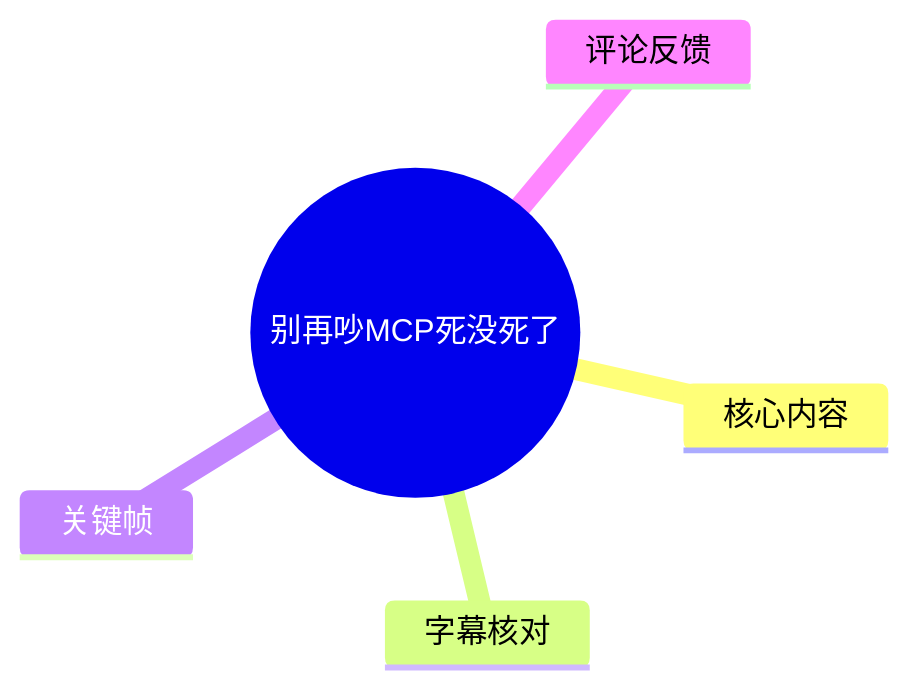
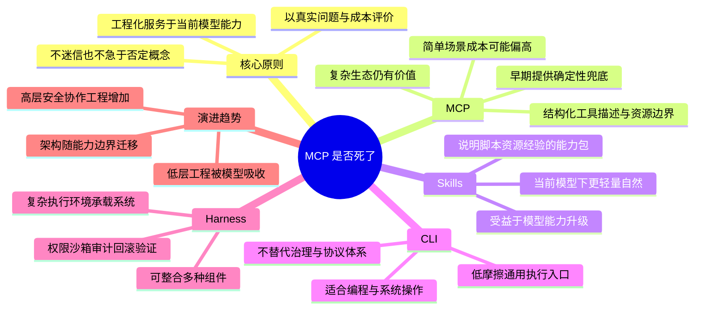
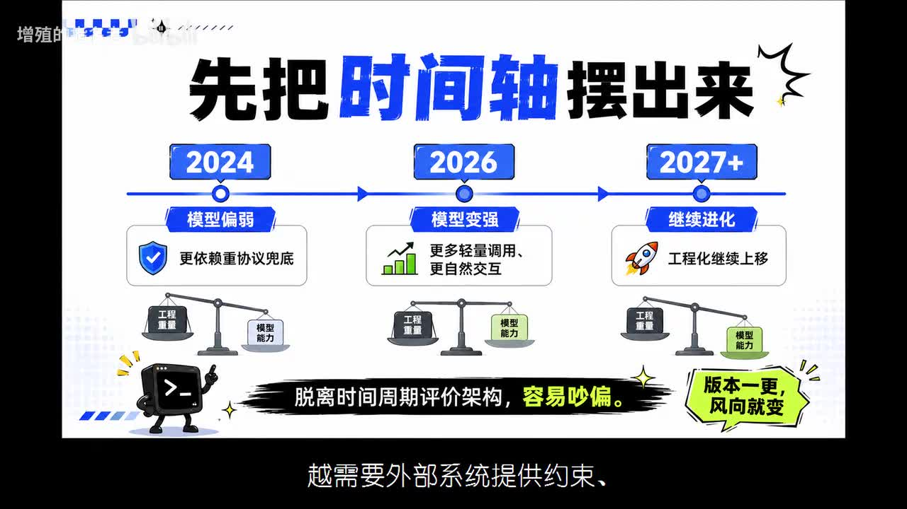
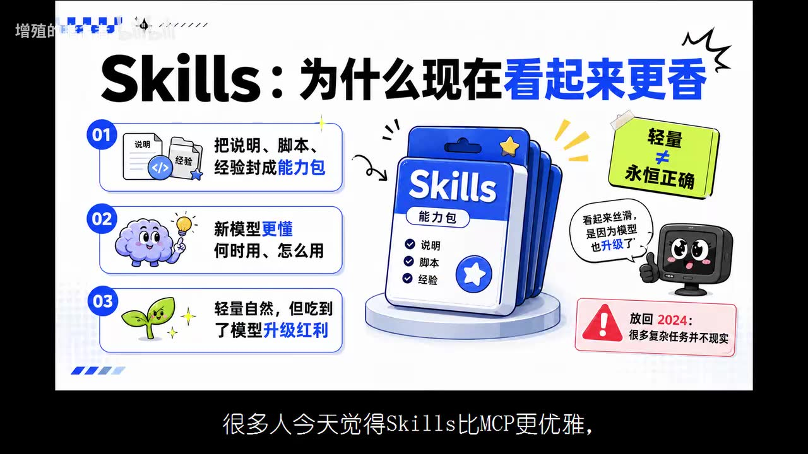

# 别再吵 MCP 死没死了

> 来源：[Bilibili 视频](https://www.bilibili.com/video/BV1JhjV67ED8)  
> UP 主：增殖的指名者｜发布时间：2026-06-16（按素材路径元数据）｜时长：11 分 08 秒  
> 合集：AIcode｜标签：MCP、Skills、Harness、CLI、AI、人工智能

## 小结

视频讨论的并非“MCP 是否已经死亡”这一二元问题，而是提出一个判断 AI 工程架构的总原则：**工程化永远为当前模型能力服务**。没有任何架构能够永久领先，也没有任何架构天然落后；其价值取决于能否以合适成本解决当前模型能力边界内的真实问题。

作者认为，MCP 在早期模型工具调用不稳定、边界理解不足、复杂流程难以可靠拆解时，借助确定性协议、结构化工具描述、资源边界及客户端—服务端关系提供了必要兜底。随着模型能力增强，简单任务中继续使用 MCP 可能面临 Token 消耗高、协议复杂、性价比不足的问题；这意味着其**适用范围收缩和迁移**，而不是失去全部价值。

Skills 被描述为将说明、脚本、资源和经验打包成可调用能力的较轻量组织方式。它在当前较强模型下显得更自然，但作者强调这种“优雅”部分建立在模型能力提升之上；若放回较弱模型时期，轻量封装未必足以处理工具边界、调用顺序与错误恢复。

CLI 在编程、系统操作和开发者工作流中成为高效入口，是因为强模型已能在终端中查看文件、运行测试、分析报错、修改代码并验证结果。不过，面对复杂权限、跨系统接入、企业级治理、多团队协作和长期可维护生态时，CLI 并非最佳抽象，更不是所有 Agent 架构的终点。

Harness 则被定位为模型进入复杂执行环境后的外部承载系统，可能涵盖上下文管理、工具路由、权限控制、沙箱、记忆、任务编排、错误恢复、评估与反馈。模型越强，低层、重复性的“补智能”工程可能减少，但安全、审计、隔离、回滚、验证、协作与长期任务等高层工程会更加重要。

本文适合需要为 Agent 选型、设计工具调用体系、比较 MCP / Skills / CLI / Harness 的开发者与技术负责人阅读。视频中的 2024、2026、2027 等时间划分，以及对“2026 年底至 2027 年”的预测，均为作者在视频中的阶段性判断，不应视为已被独立验证的行业事实；技术生态与模型能力会继续变化。

## 思维导图

## 目录

- [问题背景：不要脱离模型能力讨论架构](#问题背景不要脱离模型能力讨论架构)
- [总框架：工程化是模型能力的函数](#总框架工程化是模型能力的函数)
- [MCP：没有死，而是适用范围变化](#mcp没有死而是适用范围变化)
- [Skills：轻量能力包，但不是永恒胜利](#skills轻量能力包但不是永恒胜利)
- [CLI：强模型时代的高效入口](#cli强模型时代的高效入口)
- [Harness：复杂执行环境的承载系统](#harness复杂执行环境的承载系统)
- [选型步骤：按任务边界而非概念热度决策](#选型步骤按任务边界而非概念热度决策)
- [结论、限制与时效性](#结论限制与时效性)
- [字幕比对](#字幕比对)
- [评论分析](#评论分析)
- [处理记录](#处理记录)

## 问题背景：不要脱离模型能力讨论架构 [00:00:27](https://www.bilibili.com/video/BV1JhjV67ED8?t=27)

视频从 AI 圈常见的“某技术死了”“某技术才是未来”的讨论切入。作者提到，2026 年 3 月知乎上曾有“为什么 Skills 优于 MCP”的问题，自己当时的回答并不意在简单比较二者高下，而是希望说明一个更底层的判断方式。

其所反对的是脱离技术时间周期的绝对化评价：今天讨论 MCP，未来可能转而讨论 Skills、Harness 或 CLI 是否“过时”。这些议题会反复出现，但若只用“先进 / 落后”“存活 / 死亡”概括，容易忽略模型能力变化造成的条件差异。

> 图：关键帧直接给出视频中心命题“工程化永远为当前模型能力服务”，并以“工程化价值 = 模型能力 × 场景需求”表达判断框架。这是理解后文 MCP、Skills、CLI、Harness 比较的总前提。

## 总框架：工程化是模型能力的函数 [00:00:52](https://www.bilibili.com/video/BV1JhjV67ED8?t=52)

作者的核心论证可拆为以下关系：

1. **工程方案没有永久先进性。**  
   一项工程化设计是否值得使用，不取决于它的名词热度，而取决于它是否在当时的模型能力边界内处理了真实问题。

2. **工程化有两种基本角色。**  
   - 当模型能力不足时，工程化是补丁、约束、流程和兜底机制。  
   - 当模型能力达到一定水平后，工程化可成为把模型能力稳定释放出来的放大器。

3. **模型能力变化会重划架构的适用边界。**  
   视频以阶段性叙述说明：  
   - **2024 年底至 2025 年初**：模型相对较弱，更依赖外部协议、约束和流程兜底；  
   - **2026 年**：模型增强，可支持更多轻量调用与自然语言交互；  
   - **2027 年及以后**：作者预测模型继续进步，工程化所需解决的问题会进一步上移。  
   
   这是一条解释性时间轴，不是视频提供的性能测试或量化基准。

> 图：画面以 2024、2026、2027+ 为轴，分别概括“模型偏弱、更依赖协议兜底”“模型变强、更多轻量调用和自然交互”“工程化继续上移”。它将视频的时间条件可视化，说明版本变化会改变选型结论。

## MCP：没有死，而是适用范围变化 [00:01:40](https://www.bilibili.com/video/BV1JhjV67ED8?t=100)

### 早期 MCP 为什么重要 [00:02:04](https://www.bilibili.com/video/BV1JhjV67ED8?t=124)

作者承认，当前许多任务中，人们对 MCP 的批评有现实基础：Token 消耗较高、协议复杂、简单场景下未必划算。由于当下模型比 MCP 刚出现时更强，过去必须经由协议约束完成的工具调用，如今可能只需一段自然语言说明，模型便能理解工具边界、执行步骤和任务目标。

但作者认为，不能将今天的成本感受倒推为 MCP 当初没有价值。早期的关键矛盾是模型不稳定：即使提供更多上下文、更长 Prompt 和更多工具描述，模型仍未必能够：

- 正确选择工具；
- 理解工具调用边界；
- 将复杂流程可靠地拆解为步骤；
- 在错误时稳定恢复。

在该条件下，MCP 的“重”并非无意义负担，而是解决问题所需支付的工程成本。视频将其关键作用概括为：以**确定性协议、结构化工具描述、清晰资源边界与客户端—服务端关系**，补足当时模型在工具调用和流程执行方面的不足。

> 图：画面左侧列出 MCP 早期面对的“模型不稳定、工具选择不稳、需要确定性协议兜底”，右侧列出当前常见批评“Token 消耗高、协议复杂、简单场景不划算”，并给出“没死，只是适用范围变了”的结论，准确对应本节论点。

### MCP 当前仍适合什么问题 [00:08:03](https://www.bilibili.com/video/BV1JhjV67ED8?t=483)

作者的结论不是 MCP 应成为所有 Agent 工具调用的唯一方案，也不是应在一切简单场景中无差别使用。其认为 MCP 仍具价值的场景包括：

- 复杂工具生态；
- 标准化接入；
- 跨系统协作；
- 企业级权限；
- 可维护性与可信互联要求较高的场景。

因此，视频中的“没有死”具体是指：MCP 从被过度期待的通用叙事，回到更适合自己的工程位置。对于简单任务，应重新审视其协议和 Token 成本；对于复杂、标准化、需要明确边界与治理的环境，不能仅因新概念流行就排除 MCP。

## Skills：轻量能力包，但不是永恒胜利 [00:02:52](https://www.bilibili.com/video/BV1JhjV67ED8?t=172)

作者将 Skills 描述为一种更接近“能力封装”的思路：不把所有工具关系都以协议形式暴露给模型，而是把特定任务所需的**说明、脚本、资源和经验**组织成可调用的能力包。

这使 Skills 在当前模型环境里呈现出几个优势：

- 组织形式相对轻量；
- 模型可通过更自然的方式理解和调用；
- 更适合部分明确、可封装的任务能力。

但“Skills 比 MCP 更优雅”不应被理解为无条件结论。视频强调，Skills 的当前表现也吃到了模型能力升级的红利。如果将其放回 2024 年较弱的模型环境，模型可能连以下问题都无法稳定处理：

- 何时调用某项能力；
- 能力调用边界；
- 工具或能力调用出错后的修正；
- 多步骤任务的执行顺序。

因此，作者提出一个带时间条件的对照：在较早期模型上，用轻量 Skills 处理复杂任务可能并不现实；而在当前较强模型上，简单任务仍使用 MCP，则可能造成 Token 浪费。关键并非哪一种架构天然更高级，而是模型能力提升后，原有方案的适用范围被重新划定。

> 图：关键帧将 Skills 明确呈现为由“说明、脚本、经验”等构成的“能力包”，同时提示其看起来轻量自然的一部分原因是“模型也升级了”。图中“放回 2024：很多复杂任务并不现实”与视频论述相互印证。

## CLI：强模型时代的高效入口 [00:04:15](https://www.bilibili.com/video/BV1JhjV67ED8?t=255)

CLI 受到关注，同样应放在模型能力变化的框架中理解。作者并不将 CLI 视为全部 Agent 架构的最终答案，而是认为它恰好适合当前强模型处理的一批任务，尤其是：

- 编程；
- 系统操作；
- 开发者工作流；
- 代码仓库与文件系统管理；
- 构建、测试、包管理、日志与 Git 等本来就以命令行组织的活动。

在模型能力不足时，直接让模型操作 CLI 有风险；但当模型足够强时，CLI 成为一种低摩擦、高通用性的执行入口。模型可像工程师一样在终端里查看文件、运行测试、分析报错、修改代码、再验证结果，而不必把每一项动作都暴露为复杂协议。

不过，视频给出了清晰边界。CLI 更适合开发者、代码、系统操作以及原生围绕命令行展开的任务；对于以下问题，它不一定是最佳抽象：

- 复杂权限；
- 跨系统环境；
- 标准化接入；
- 企业级工具治理；
- 多团队协作；
- 长期可维护的工具生态。

所以，CLI 的流行不等于协议化工具系统死亡；它反映的是强模型已经能够有效利用传统工程界面。

## Harness：复杂执行环境的承载系统 [00:05:28](https://www.bilibili.com/video/BV1JhjV67ED8?t=328)

作者解释 Harness 流行的背景是：模型已不只是回答问题，而是进入读取文件、修改代码、调用工具、执行命令、使用浏览器、维护记忆、处理长周期任务等复杂执行环境。

这时的关键问题从“模型会不会做”转变为一组运行环境与治理问题：

- 模型应在什么环节执行；
- 它能看到哪些信息；
- 它能修改什么；
- 出错后如何回滚；
- 行为如何审计；
- 结果如何验证。

据此，Harness 更像模型外部的一整套承载系统。视频列出的可能组成包括：

| 组件 | 视频中对应的作用 |
| --- | --- |
| 上下文管理 | 为模型提供和维护任务所需信息 |
| 工具路由 | 决定或协调工具的调用路径 |
| 权限控制 | 限制模型可访问、可执行的范围 |
| 沙箱执行 | 为执行操作提供隔离环境 |
| 记忆机制 | 支撑跨步骤或长周期任务 |
| 任务编排 | 组织多步骤执行过程 |
| 错误恢复 | 应对失败并尝试修正或回退 |
| 评估与反馈 | 检验执行结果并形成反馈闭环 |

作者特别指出，Harness 不是 MCP 的反面，也不是 Skills 或 CLI 的替代品。更准确的关系是：Harness 可能将 MCP、Skills、CLI、工作流、RAG、沙箱、评估系统与记忆系统等纳入一个更大运行框架。

## 选型步骤：按任务边界而非概念热度决策 [00:06:16](https://www.bilibili.com/video/BV1JhjV67ED8?t=376)

视频并未提供代码、命令行参数、安装配置或可复现基准，而是提供了一套架构评估步骤。依据视频逻辑，可按以下顺序执行：

1. **先确认当前模型能力。**  
   不要将某一时期模型的表现直接外推到另一时期。模型是否能自然理解工具边界、正确规划步骤、从错误中恢复，是选型前提。

2. **识别任务真实边界。**  
   判断任务是简单的单次调用、编程与系统操作，还是涉及跨系统、权限、审计、协作、长期状态与高风险操作。

3. **核算工程成本。**  
   视频特别涉及 MCP 的 Token 与协议成本。此处不应只追求“轻”，而应比较额外复杂度是否换来了可靠性、规范性和可维护性。

4. **选择合适层次的抽象。**  
   - 任务能力可清晰打包、模型能稳定调用时，可考虑 Skills；  
   - 面向代码、终端和系统操作时，CLI 可能是自然入口；  
   - 复杂工具生态、标准化接入、权限与可信互联需求较高时，MCP 仍有位置；  
   - 需要整体治理执行环境时，应关注 Harness 所涵盖的权限、沙箱、审计、回滚、验证等能力。

5. **验证安全与结果，而非只验证“能跑”。**  
   作者认为，模型越能执行真实操作，权限、审计、隔离、回滚与验证越不能被忽视。强模型会减少一部分低层重复工程，却会制造更复杂的新任务，从而提升外部运行环境的重要性。

6. **定期重估，不将今天的架构当作终点。**  
   视频预测未来模型继续进步后，今日的 Skills、Harness、CLI 也会被重新审视。选型结果应随模型能力和任务环境变化而复核。

作者以“脚手架”作比：楼未盖好时，脚手架是必要条件；楼盖好后可以拆掉，但不能因此否定其施工阶段的价值。MCP、Skills、CLI 与 Harness 服务于不同高度的“楼”和不同阶段的施工方式。真正应问的是：它原本要解决的问题是否仍然存在，它适配的模型能力边界在哪里，以及未来会被淘汰、压缩还是迁移到更高层。

## 结论、限制与时效性 [00:09:40](https://www.bilibili.com/video/BV1JhjV67ED8?t=580)

视频最终结论可归纳为：

- **MCP 没有死。**它不再适合作为所有 Agent 工具调用的唯一答案，也不适合在所有简单场景中无差别使用，但在复杂工具生态、标准化、跨系统协作、企业权限与可维护性需求中仍有价值。
- **CLI 不是“新王”。**它是当前强模型在编程与系统操作场景中自然、高效的入口，但无法替代所有协议、工作流与系统治理。
- **Harness 不是最终答案。**它会在复杂执行环境中变得重要，但其形态也会随模型能力变化；视频推测，未来其中一部分可能被自动生成、自动优化或自动评估。
- **Skills 不是工程化终点。**当前显式写入 Skills 的步骤、经验、约束，未来可能部分被模型内化。
- **工程化不会消失，只会换位置。**模型能力越强，外挂工程设施、固定工作流、复杂 Prompt、显式编排等低层工程的重要性可能下降；与此同时，复杂任务、安全要求与协作边界会催生新的高层工程。

视频提出的最终评估问题是：**在当前模型能力下，该概念是否以合适成本解决了真实存在的问题？**若答案肯定，它就有价值；若模型能力提升后，该方案要解决的问题消失，则该方案会自然退场或迁移到新位置。

### 限制与注意事项

- 视频为观点型技术评论，未提供 MCP、Skills、CLI 或 Harness 的性能数据、成本统计、实现代码或对照实验。
- “2024 / 2026 / 2027+”是作者用于说明模型能力演进的阶段划分；其中对未来的内容属于预测，应结合实际模型、工具链和业务约束重新验证。
- ASR 将部分专有名词转写错误或不稳定，例如 “Skilled”“Skilling”“Steels”在上下文中应理解为 **Skills**；“协谊 / 协議”等应理解为“协议”。本文仅在语义明确时作了上下文规范化。
- ASR 中出现“Cloud Fable 5 已经短暂亮相”的表述，但该专名未获站内字幕或其他素材验证，且识别文本可能存在错听，因此不将其作为可验证新闻事实展开。
- 本视频时长 668 秒，但有效语音从约 00:00:27 开始；00:03:17—00:03:27 存在约 10.22 秒 ASR 空档。素材未说明此处是无语音、转场或识别遗漏，不能据此补写内容。

## 字幕比对 [00:10:28](https://www.bilibili.com/video/BV1JhjV67ED8?t=628)

| 字幕来源 | 完整性 | 专有名词 | 时间轴 | 主要问题 |
| --- | --- | --- | --- | --- |
| Bilibili 站内字幕 | 未提供可用字幕，无法核验 | 无法核验 | 无法核验 | 素材明确标注“未提供可用站内字幕” |
| 本次 ASR 字幕 | 覆盖约 626.93 秒语音，诊断覆盖率 93.94% | 存在多处错识或不一致 | 有 SRT 起止时间；共 29 段 | 首段异常短却承载大量文本；00:03:17—00:03:27 有约 10.22 秒空档；中英文术语、个别句词识别不稳 |

本次任务**没有可用站内字幕**，因此正文以本次 ASR 的带时间戳 SRT 为时间轴依据，并结合关键帧内容和上下文进行有限的术语校正。ASR 诊断显示存在音频流，未标记 `noAudioStream=true`；因此并非无音轨视频，也不是工具失败。

已依据上下文和关键帧校正或规范化的重点包括：

- `Skilled`、`Skils`、`Skilling`、`Steels`：在语境中统一理解为 **Skills**；
- `协谊`、`协議`：统一理解为“协议”；
- `Token`、`CLI`、`Harness`、`MCP`：保留技术术语原写；
- “工程化价值 = 模型能力 × 场景需求”：由开篇关键帧明确展示，可作为视频图文表达使用；
- “Cloud Fable 5”：ASR 专名不稳定，缺少站内字幕和画面文字佐证，保留为“ASR 中出现的未验证表述”，不做事实性扩展。

## 评论分析 [00:10:52](https://www.bilibili.com/video/BV1JhjV67ED8?t=652)

以下仅分析素材中可获取的热评前三条，不将评论内容视为已验证事实。

1. **环孢菌素（获赞 2）：“话说像 mcp 和其他就不能共存不？”**  
   该评论直接提出“共存”问题，与视频主张高度相关。视频的答案实际上倾向于可以共存：Harness 可纳入 MCP、Skills、CLI 等多个组件；它们不是互斥技术路线，而是在不同任务、模型能力和治理需求下承担不同角色。评论未提供案例或技术细节，但抓住了“非二元对立”的核心。

2. **喵脑大好腻害（获赞 1）：“凡所有相，皆是虛妄。若見諸相非相，即見如來。”**  
   该评论以佛学语句表达对“不要执着概念标签”的呼应，契合视频“不要急着站队、封神或宣布死亡”的态度。它属于价值判断或感想，不提供可验证的技术补充。

3. **增殖的指名者（获赞 1）：“不喜欢听太长音频的各位 B 友可以移步文字版 BV1cbjV6UEed”**  
   这是 UP 主提供的补充入口，指向另一支文字版视频。它可作为获取同主题文字内容的线索，但本整理未取得该视频素材，未据此补充、修正或验证本视频观点。

## 评论分析

- 热评 1：话说像mcp和其他就不能共存不？
- 热评 2：凡所有相，皆是虛妄。若見諸相非相，即見如來。
- 热评 3：不喜欢听太长音频的各位B友可以移步文字版 BV1cbjV6UEed

以上内容是观众反馈摘录，只用于补充理解视频反响，不作为正文事实依据。

## 处理记录

- Worker ID：`worker-mrj0wjed-b0c290ad`
- 模型：`gpt-5.6-terra`
- ASR 模型与运行参数：`medium`；语言 `zh`，语言置信度 `0.9990234375`；设备 `cuda`；计算类型 `float16`；音频时长 `667.3706875` 秒。
- 使用的素材工具产物：`merged.mp4`、`audio/audio.wav`、`asr/transcript.srt`、`asr/asr-transcript.txt`、`asr/asr-result.json`、`frames/`、`comments/comments.json`。
- 字幕选择：站内字幕未提供可用版本；已检查本次 ASR，并以其 SRT 的真实起止时间生成时间轴链接。正文基于 ASR、关键帧和上下文进行有限术语规范化。
- 关键帧选择依据：
  - `frames/frame-001.jpg`：展示视频总论点及“工程化价值 = 模型能力 × 场景需求”；
  - `frames/frame-002.jpg`：展示 2024、2026、2027+ 的模型能力—工程化时间轴；
  - `frames/frame-003.jpg`：展示 MCP 早期价值与当前成本批评的对照；
  - `frames/frame-004.jpg`：展示 Skills 的“能力包”构成及其依赖模型升级的条件。
- 评论处理：仅使用可获取热评前三条，未扩展至其他评论。
- 缓存清理：素材未提供缓存清理执行记录，无法确认是否已清理；本文不虚构清理结果。
- 未解决问题：
  - 站内字幕缺失，无法进行逐句交叉校对；
  - ASR 存在术语错识、长文本压缩进短分段及约 10.22 秒空档；
  - ASR 中“Cloud Fable 5”专名未获其他素材确认；
  - 视频没有提供可复现的代码、命令、参数配置或性能基准。
