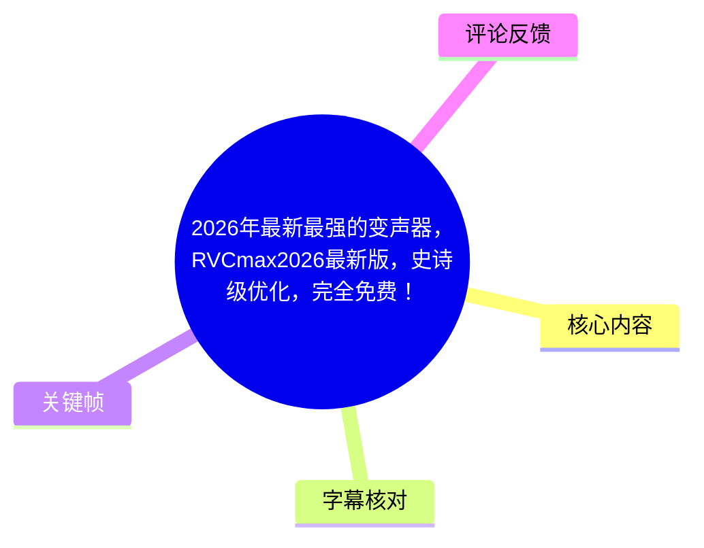
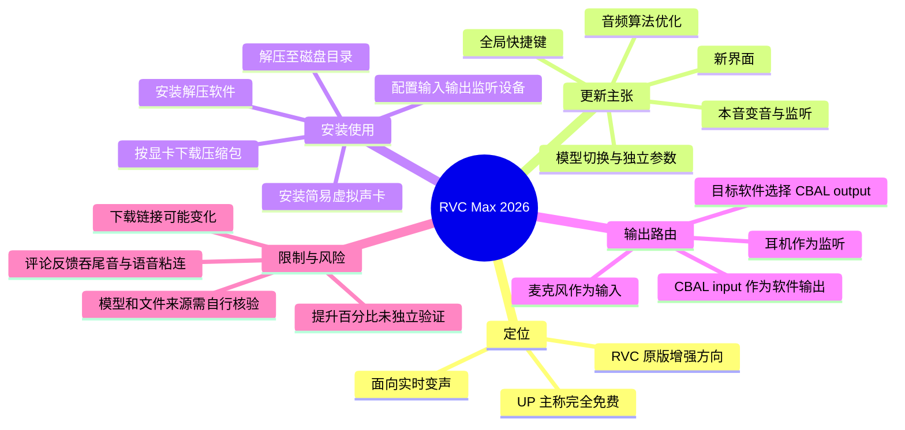
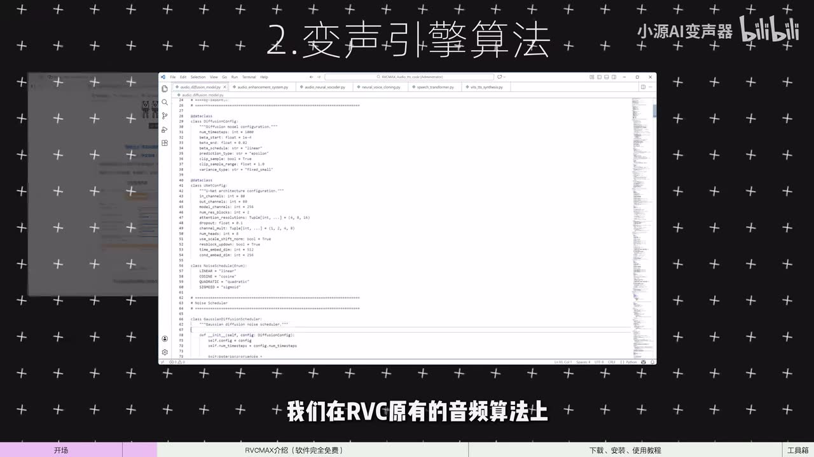

# 2026年最新最强的变声器，RVCmax2026最新版，史诗级优化，完全免费！

> 来源：[Bilibili 视频](https://www.bilibili.com/video/BV1WVzYBcE2K)<br>
> UP 主：小源AI变声器｜时长：4 分 23 秒｜分辨率：3840×2160<br>
> 数据抓取时视频累计：45.28 万播放、3.09 万点赞、4.34 万投币、3.33 万收藏、2680 分享（抓取于 2026-07-16）。

## 小结

视频介绍的是 **RVCMAX / RVC Max**：UP 主将其定位为在原始 RVC 基础上更新增强的实时变声软件，并声称与原版 RVC 一样“完全免费”。视频的主要价值不在讲解 RVC 原理，而在于展示该软件相对原版的界面、模型管理、监听和虚拟声卡安装流程。

UP 主列出的主要更新包括：更换美化的软件界面、在原有 RVC 音频算法上优化、模型切换和按模型保存参数、拖拽导入模型、快捷切换本音/变音与监听、以简易虚拟声卡替代 VoiceMeeter，以及新增全局快捷键。其“实测音质提升 30%、咬字清晰度提升 20% 以上”属于视频发布者的测试口径，视频未给出测试材料、对照条件或可复现实验数据，不能视为独立验证结论。

实操环节给出了从分享文档下载压缩包与 7-Zip、解压、启动器安装虚拟声卡，到选择麦克风、虚拟输出和耳机监听设备的完整顺序。首次启动可能等待约 1 分钟；右下角引擎状态显示“在线”被作为启动成功标志。

视频适合希望在游戏、语音聊天或其他软件中使用实时 RVC 变声、且需要较简化安装流程的 Windows 用户。使用前仍应核对自己的显卡型号与下载包是否匹配，并谨慎验证模型来源、软件文件安全性和虚拟声卡设备名称。

需要特别注意时效性：标题中的“2026 年最新”“最强”、以及免费、下载渠道、兼容性、算法表现均为发布时信息。评论区中已有用户反馈吞尾音、快速连续说话时语音粘连的问题，因此不应仅依据演示或标题判断实际效果。

## 思维导图





## 目录

- [视频定位与信息时效](#视频定位与信息时效)
- [RVC Max 的功能更新](#rvc-max-的功能更新)
  - [界面与算法优化](#界面与算法优化)
  - [模型切换、独立参数与导入](#模型切换独立参数与导入)
  - [监听、虚拟声卡与快捷键](#监听虚拟声卡与快捷键)
- [下载、安装与启动](#下载安装与启动)
- [设备配置与实际输出](#设备配置与实际输出)
- [工具箱、限制与验证建议](#工具箱限制与验证建议)
- [字幕比对](#字幕比对)
- [评论分析](#评论分析)
- [处理记录](#处理记录)

## 视频定位与信息时效 [00:35](https://www.bilibili.com/video/BV1WVzYBcE2K?t=35)

视频开场后进入软件介绍。UP 主称这是“2026 年最新的变声器”，并表示自己此前约两个月未更新视频，是在优化、打磨准备提供给观众的变声软件。视频中反复强调两个定位：

1. **RVCMAX 是基于原始 RVC 的增强版。**
2. **软件与原版 RVC 一样免费。**

这里应区分“视频陈述”与可验证事实：视频元数据、标题和简介确实都出现了 RVCMAX、免费及“更新增强版”的说法；但“最新”“最强”属于宣传性表述，视频素材没有提供与其他变声器的统一横评或性能基准。

UP 主还说安装与使用只需约 30 秒即可学会；这更适合理解为教程复杂度的宣传语。实际操作仍包含下载匹配显卡的包、解压、虚拟声卡安装、设备路由和模型选择等多个步骤。


> 图：画面展示 RVCMAX 的模型主页，顶部可见“首页 / 模型 / 设置 / 其他”等导航，模型按少女音、萝莉音、御姐音、男声、动漫、热门游戏、二游等类别排列。它直接对应视频关于界面重做和模型浏览体验的说明，但不构成音质提升的证据。

## RVC Max 的功能更新 [00:36](https://www.bilibili.com/video/BV1WVzYBcE2K?t=36)

### 界面与算法优化 [00:36](https://www.bilibili.com/video/BV1WVzYBcE2K?t=36)

UP 主将第一项更新概括为界面设计：美工制作了新的软件界面。画面中可见以模型卡片为中心的选型界面，支持按分类浏览，底部有变音、监听等状态/控制区域。

第二项是变声算法。视频称原版 RVC 的相关更新停留在 **2024 年中旬**，而 RVCMAX 在原有音频算法上进行了优化；UP 主给出以下测试结果：

| 指标 | 视频中的说法 | 证据边界 |
| --- | --- | --- |
| 音质 | “实测提升 30%” | 未展示测试集、评价指标、样本数量或原版对照录音 |
| 咬字清晰度 | “有 20% 多的提升” | 未说明“清晰度”的计算方式与测试条件 |
| 优化基础 | 在 RVC 原有音频算法上优化 | 画面展示代码/工程内容，但未公开算法细节或提交记录 |

因此，上述百分比可以作为 UP 主对版本目标与实测体验的描述，但不应直接推导为所有硬件、模型、声音条件下都能得到同等提升。



> 图：画面标题为“2. 变声引擎算法”，中间展示编辑器中的代码。它说明视频确实以算法优化为卖点，但画面中文字不足以还原具体实现、参数或性能测试方法，不能据此判断优化的技术细节。

### 模型切换、独立参数与导入 [01:00](https://www.bilibili.com/video/BV1WVzYBcE2K?t=60)

第三项更新围绕模型工作流。UP 主表示参考了数百条关于 RVC 模型切换的留言，并在模型使用体验上作出优化，具体包括：

- **运行中切换模型**：使用过程中可直接点击模型卡片切换。
- **首页快速切换收藏模型**：常用模型可以在首页快速选择。
- **模型级参数保存**：通过软件底栏的设置按钮，可为单独模型设定音调等参数；切换到常用模型时不必每次重新调整参数。
- **更便捷导入模型**：按若干按钮操作后，可将模型拖入软件完成导入。

“音调等参数”是视频明确提到的参数类别，但素材没有逐项列出全部参数名、取值范围、默认值或参数间影响。因此，使用者只能确定软件支持至少按模型保存音调类设置，不能从视频中推得精确调参方案。


> 图：画面标题为“3. 切换模型优化”，展示可分类浏览的模型卡片和底部控制区。该帧有助于理解“点击模型切换”及模型库组织方式；但单张静态画面无法验证切换延迟或稳定性。

### 监听、虚拟声卡与快捷键 [01:48](https://www.bilibili.com/video/BV1WVzYBcE2K?t=108)

第四项更新是声音模式和监听控制。UP 主称新版 RVCMAX 可通过点击按钮快速完成：

- 切换**本音**与**变音**；
- 开启或关闭**监听**。

视频的核心建议是：借助内置/配套监听方式，可不再使用 VoiceMeeter，而仅安装一个“简易版虚拟声卡”。UP 主认为该简易虚拟声卡更容易安装和使用，兼容性也比 VoiceMeeter 更好，从而避开以往安装中“最容易出问题”的环节。

这是该视频的使用经验，不等于 VoiceMeeter 在所有系统中都不兼容。虚拟声卡能否工作仍受到操作系统权限、驱动签名、其他音频软件占用、输入输出设备设置和具体游戏/会议软件兼容性的影响。

第五项是**全局快捷键**。视频说明可用快捷键：

- 快速隐藏、显示软件；
- 在游戏中快速切换本音和变音；
- 快速开关监听。

素材未列出实际按键组合；若要设置或修改快捷键，需要以实际版本界面为准。

## 下载、安装与启动 [02:37](https://www.bilibili.com/video/BV1WVzYBcE2K?t=157)

以下流程按视频演示顺序整理。视频提到的下载入口是 UP 主“分享文档”中的网盘链接，素材并未提供该分享文档的实际 URL。

1. **确认显卡型号并下载对应包**  
   进入分享文档中的网盘链接，找到符合自身显卡型号的 RVCMAX 本地压缩包；同时下载 7-Zip 解压软件。

2. **安装解压工具**  
   双击安装 7-Zip。若电脑中已有可用的解压软件，UP 主表示可以继续使用原有工具。

3. **解压 RVCMAX 压缩包**  
   UP 主建议将压缩包解压到硬盘根目录。视频中的演示机器只有一个磁盘分区；实际用户可按自己的磁盘空间选择目标盘。

4. **进入软件目录并打开启动器**  
   解压完成后，进入 RVC Max 文件夹，双击启动器图标。

5. **创建快捷方式、安装虚拟声卡**  
   在启动器中点击“发送快捷方式”和“安装虚拟声卡”。随后在弹出的虚拟声卡窗口中点击 `Install`。

6. **识别安装完成状态**  
   视频称安装完虚拟声卡后会弹出广告网页，这被视为安装完毕的现象。此类网页弹出是该演示环境的表现，不应作为所有安装环境的唯一成功判据。

7. **启动软件**  
   双击桌面的 RVC Max 图标启动变声器。首次启动可能需要等待约 **1 分钟**；当软件右下角的引擎状态显示“在线”时，视频将其视作启动成功。

### 安装中的关键限制

- 视频没有给出支持的显卡品牌、型号范围、显存要求、Windows 版本、驱动版本或压缩包校验值。
- “按显卡型号选择压缩包”意味着错误选择版本可能导致无法运行、引擎无法上线或性能异常。
- 从网盘、评论链接或第三方网站取得可执行程序和驱动前，应自行检查发布者身份、文件签名、哈希校验与安全扫描结果。
- 虚拟声卡会改变系统音频设备列表；安装前应记下原有默认输入输出设备，便于出现异常时恢复。

## 设备配置与实际输出 [03:25](https://www.bilibili.com/video/BV1WVzYBcE2K?t=205)

软件启动且引擎在线后，视频给出的基础配置顺序如下：

| 设置项 | 视频所述选择 | 用途 |
| --- | --- | --- |
| 输入设备 | 自己的麦克风 | 将原始人声送入变声器 |
| 输出设备 | `CBAL input` | 将处理后的声音送往虚拟音频链路 |
| 监听设备 | 自己的耳机 | 让本人听到声音效果 |
| 模型 | 选择一个模型 | 决定变声目标音色 |
| 运行操作 | 点击“开始” | 启动变声处理 |
| 监听开关 | 需要自听时开启 | 听到变声后的声音 |
| 目标应用输入设备 | `CBAL output` | 让他人/目标软件接收变声后的声音 |

> **设备名注意：** 本次 ASR 将两个虚拟设备识别为 `CBAL input` 与 `CBAL output`。该拼写可能受识别误差影响，而视频素材未提供可供逐字核对的设置界面特写。因此应以安装后系统实际显示的虚拟声卡名称为准，不应机械照抄 ASR 字符串。

可以将视频的音频路由理解为：

```text
麦克风
  → RVCMAX 输入设备
  → RVCMAX 变声处理
  → 虚拟声卡 Input
  → 虚拟声卡 Output
  → 游戏 / 语音软件的麦克风输入
```

耳机监听则是另一条面向本人的路径：

```text
RVCMAX 处理后的声音
  → 监听设备（耳机）
  → 使用者本人
```

视频称已经对每个软件参数的效果进行了标注，并建议观众截图保存；但提供的素材没有包含这些参数标签、参数名称或数值。因此，本记录不补写未展示的参数含义。调参时应优先保留一份原始配置，并一次只调整一个参数，方便定位音质、延迟或断音变化的原因。

## 工具箱、限制与验证建议 [04:13](https://www.bilibili.com/video/BV1WVzYBcE2K?t=253)

视频结尾称除 RVC Max 变声器外，还制作了“变声器工具箱”，其中包含：

- 资源下载；
- 实用工具；
- AI 降噪；
- 其他未在视频中逐项展开的功能。

UP 主同样称工具箱免费，并表示可从其分享文档下载。视频没有演示工具箱的界面、AI 降噪的具体模型、处理模式、性能消耗或输出质量，因此不能进一步判断其能力边界。

### 可迁移的使用经验

1. **先确认音频路由再进游戏或通话软件。**  
   变声器即使已经“在线”，目标软件若仍使用物理麦克风而非虚拟输出，其他人也只能听到原声。

2. **模型与参数绑定能减少切换成本。**  
   对不同模型保存音调等配置，适合频繁切换角色音色的场景；但仍要针对自己的声线逐一试听。

3. **先做短句与连读压力测试。**  
   在正式使用前，分别测试短句、句尾延音、连续数字、快速连续说话和停顿后的再开口，可更早发现吞尾音、粘连或延迟问题。

4. **关注虚拟声卡的系统影响。**  
   安装、卸载或更改默认音频设备后，应检查游戏、会议软件、录音软件和浏览器是否被切换到错误设备。

### 未被视频充分验证的事项

- “音质提升 30%”“咬字清晰度提升 20% 以上”的测评方法及其普适性；
- 与 VoiceMeeter 的兼容性对比；
- 支持的显卡、系统和模型格式范围；
- 实时延迟、显存/CPU/GPU 占用、长时间运行稳定性；
- 模型来源的授权、隐私与声音模仿的合规边界；
- 免费政策和下载入口在视频发布后是否仍然有效。

## 字幕比对

站内字幕共有英文、简体中文和机器中文三份，但内容为 Jane Goodall / TED 动画诗歌，与本视频的 RVCMAX 变声器教程完全不一致，且站内字幕最晚结束于 03:12，而实际视频时长为 04:23。它们显然不能用于本视频的事实整理或时间轴定位。

本次 ASR 检测到音频流，诊断中**没有** `noAudioStream=true` 标记；识别语言为中文，置信度约 0.998，音频时长约 262.144 秒，语音覆盖约 226.7 秒（86.48%），首段有效语音从 00:35.360 开始，末段至 04:22.060。

| 字幕来源 | 完整性 | 专有名词 | 时间轴 | 主要问题 |
| --- | --- | --- | --- | --- |
| Bilibili 站内 `p01-zh-CN.srt` / `p01-en-US.srt` | 与本视频无关，不可用 | 出现 Jane Goodall、TED 等无关内容 | 分段精细，但时长仅到 03:12，且内容错配 | 疑似串入其他视频字幕 |
| Bilibili 站内 `p01-ai-zh.srt` | 与本视频无关，不可用 | 多处机器翻译异常 | 分段存在，但同样错配 | 内容为 TED 诗歌的异常中文转写 |
| 本次 ASR | 覆盖教程主体，开头约 35 秒前无识别语音 | 能识别 RVC Max、VoiceMeeter、7-Zip、Install 等，但有误写 | 有真实起止时间；后续以约 24 秒的大段落切分 | “变生器/变身器”“优划”“切捡”“CBAL”等错别字或词切分问题，缺少逐句级细粒度断句 |

### 最终字幕选择与校正方式

正文以**本次 ASR 的时间轴**为唯一时间定位依据，再结合视频标题、简介及关键帧进行人工语义校正；站内字幕不采用。

已进行的关键校正包括：

- ASR 中的“变生器”“变身器”按上下文统一理解为“变声器”；
- “RV c / RV C”统一记为 **RVC**；
- “RVC Max”与标题、界面中的 **RVCMAX** 视为同一软件名称的不同写法；
- “优划”按语义整理为“优化”；
- “切捡/切损”按语义整理为“切换”；
- 对 `CBAL input / output` 不擅自改写为其他虚拟声卡品牌或设备名，保留其 ASR 来源属性并提示以实际界面为准。

## 评论分析

可获取热评数量为 **2 条**，不足三条；以下仅分析这两条，不将评论内容视为已验证事实。

1. **仙女味の辣条｜113 赞**  
   该评论者表示实测后认为，同一模型下 RVCMAX 的咬字比原版 RVC 更不容易“口胡”，更不容易卡死，资源占用也似乎更低；其推测软件可能是“说话才计算”。  
   但评论同时指出严重问题：说话结尾可能吞尾音，快速连续说话时前后语句可能粘在一起，例如连续说数字时，开头“1”和结尾“3”可能同时出声，容易暴露变声痕迹。  
   **价值与可信度边界：** 这是与视频“清晰度、稳定性优化”直接相关的实际使用反馈，也补充了视频未展示的边界条件；但它是单个用户、未披露硬件、模型、参数和版本号的体验，不能据此量化整体性能。

2. **sheeyhere｜60 赞**  
   该评论称可从 `rvcmax.com` 直接下载，不必等待 UP 主回复，并表达对教程制作的支持。  
   **价值与可信度边界：** 该信息可能为寻找入口提供线索，但它来自评论区，且评论发布时间晚于视频发布。素材没有提供该域名与 UP 主、分享文档或软件发行方之间的可验证关系，也未提供下载文件校验信息；因此不能将其认定为官方、安全或当前有效的下载渠道。

## 处理记录

- Worker ID：`worker-mrj0wjed-b0c290ad`
- 整理模型：`gpt-5.6-terra`
- 可用素材与工具结果：视频元数据、关键帧目录、站内 SRT、`asr/transcript.srt`、`asr/asr-result.json`、热评抓取结果。
- ASR 检查：已检查本次 ASR。模型为 `medium`，使用 CUDA / float16，识别语言为中文；未发现 `noAudioStream=true`，因此按存在音轨处理。
- 字幕选择：弃用全部站内字幕，原因是内容为 Jane Goodall/TED 动画诗歌，与 RVCMAX 教程不匹配；采用本次 ASR 的真实时间段，并依据视频标题、简介和关键帧进行有限语义校正。
- 关键帧选择依据：
  - `frames/frame-001.jpg`：展示 RVCMAX 模型主页、分类和控制区域，对应界面与模型库说明；
  - `frames/frame-003.jpg`：展示“变声引擎算法”章节及代码画面，用于界定算法优化主张的可见证据；
  - `frames/frame-004.jpg`：展示“切换模型优化”与模型选择状态，对应模型切换功能。
- 评论处理：仅分析可获取的前两条热评；素材未提供第三条，因此未补造。
- 缓存清理：提供的素材中没有缓存清理执行日志，无法确认是否已清理；本记录不将其表述为已完成。
- 未解决问题：未提供实际下载包、软件版本号、显卡兼容列表、参数面板特写、官方校验信息及可复现实测环境；`CBAL input/output` 的准确设备拼写也无法仅凭现有素材确认。
