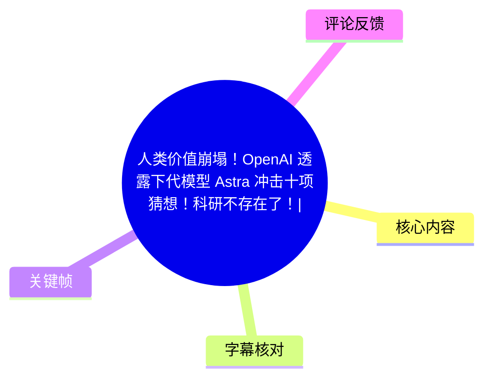
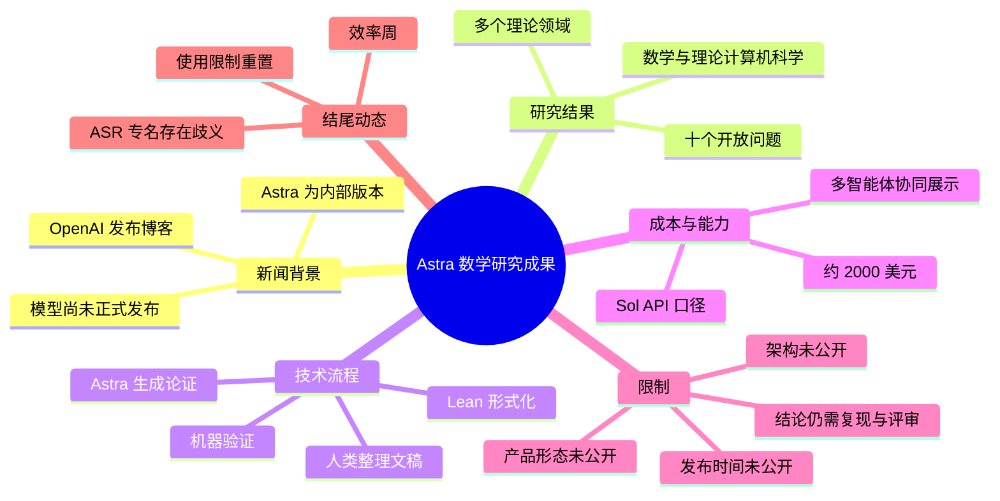
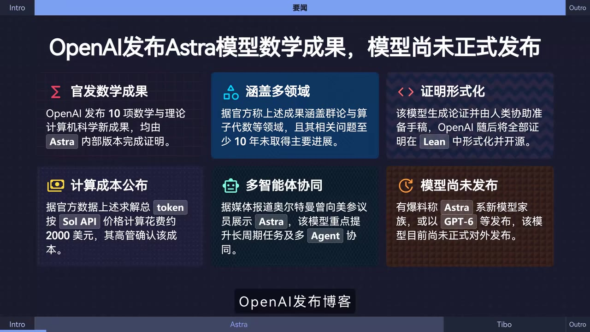
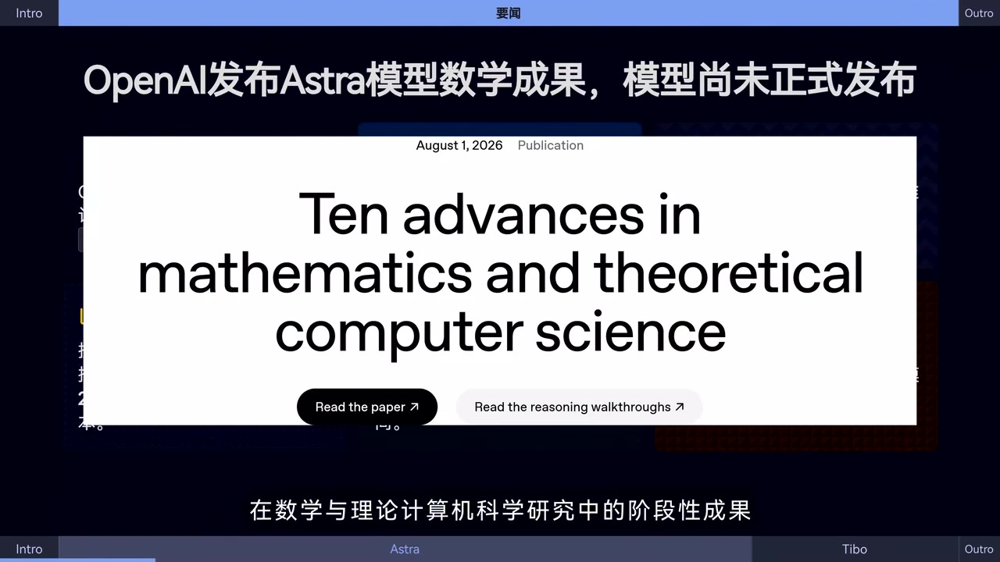
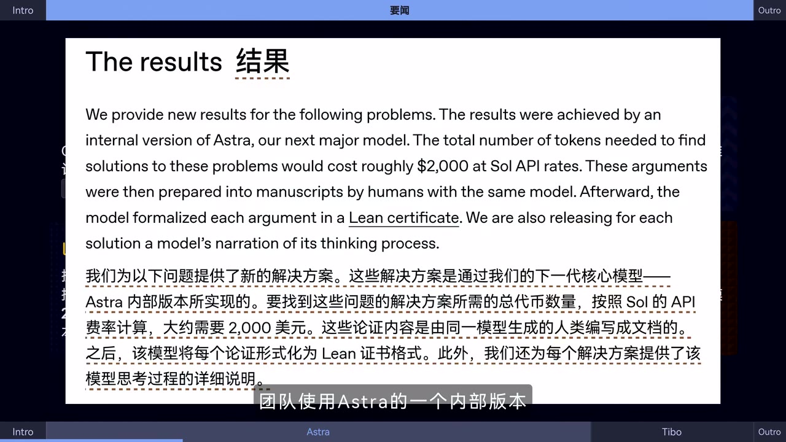
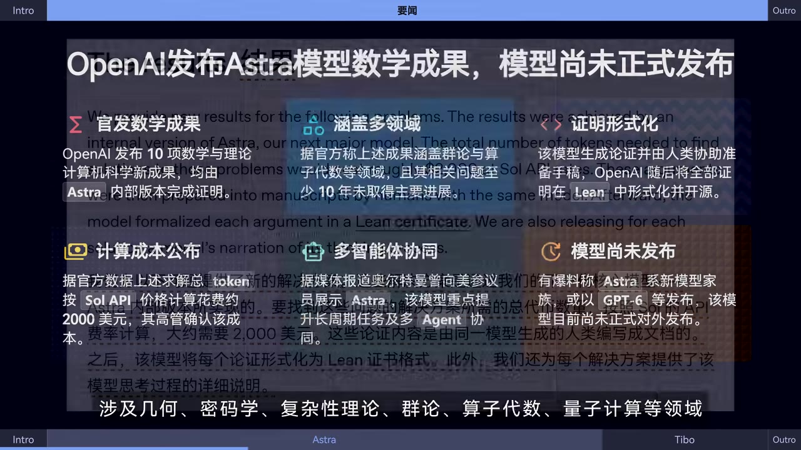

# 人类价值崩塌！OpenAI 透露下代模型 Astra 冲击十项猜想！科研不存在了！| AI日报0801

> 来源：[Bilibili 视频](https://www.bilibili.com/video/BV1b7GV6HEzT) 
> UP 主：黑鸦Heya｜时长：01:02｜合集：AIcode  
> 视频简介给出的相关链接：[OpenAI：Ten advances in mathematics and theoretical computer science](https://openai.com/index/ten-advances-in-mathematics)｜[GitHub：openai/ten-proofs](https://github.com/openai/ten-proofs)

## 小结

视频是一则 62 秒的 AI 日报，核心新闻是：OpenAI 发布博客，披露其称为“下一代重要模型”的 **Astra** 内部版本，已在数学与理论计算机科学中的十个长期开放问题上产生新的论证或结果。视频标题使用了“人类价值崩塌”“科研不存在了”等强烈表述，但视频正文提供的是阶段性成果与工作流信息，不能直接推导出“科研已被取代”的结论。

视频画面与口播共同指出，这十项问题覆盖几何、密码学、复杂性理论、群论、算子代数、量子计算等方向；部分画面还写有“至少 10 年未取得主要进展”。这意味着 Astra 被展示的重点并非通用聊天，而是面向高难度形式推理、研究辅助和定理验证的能力。

成果的关键技术链路是：Astra 内部版本先生成论证，人类研究人员将其整理为论文或文稿，再由模型将论证形式化为 **Lean certificate（Lean 证明/证书）**，以便进行机器验证。画面还给出一个成本口径：按 **Sol API** 费率估算，寻找这些问题解法所需 token 的总成本约为 **2,000 美元**。该数字是视频转述官方材料的估算，不等同于研究项目的完整人力、算力、审稿和复现成本。

视频同时强调了产品信息的缺口：Astra 尚未正式对外发布，OpenAI 未公开其具体架构、产品形态、正式版本名称和发布时间。因此，关于“Astra 是 GPT-6”“已经完全替代科研”等说法，在本视频素材中均没有得到确认。

结尾补充一则时效性较强的产品动态：北京时间 8 月 1 日中午，口播称 Codex 负责人 Tibo 宣布重置若干产品的使用限制，以庆祝“效率周”。但 ASR 对具体产品名与“10 万个……”的对象识别明显不稳定，不能据此可靠还原具体套餐、额度或功能名称。

本视频适合关注 AI 数学推理、形式化证明、智能体协同与 OpenAI 产品动态的读者。阅读时应把视频中的新闻事实、画面转述和标题修辞严格区分，并以 OpenAI 原文、论文和 Lean 形式化文件作为后续核验依据。

## 思维导图

## 目录

- [新闻背景：Astra 被定位为下一代重要模型](#新闻背景astra-被定位为下一代重要模型)
- [十项数学与理论计算机科学成果](#十项数学与理论计算机科学成果)
- [研究工作流：人工整理与 Lean 形式化验证](#研究工作流人工整理与-lean-形式化验证)
- [成本口径、智能体协同与未发布状态](#成本口径智能体协同与未发布状态)
- [结尾动态：使用限制重置](#结尾动态使用限制重置)
- [结论、限制与时效性](#结论限制与时效性)
- [字幕比对](#字幕比对)
- [评论分析](#评论分析)
- [处理记录](#处理记录)

## 新闻背景：Astra 被定位为下一代重要模型 [00:00:00](https://www.bilibili.com/video/BV1b7GV6HEzT?t=0)

视频开场称，OpenAI 发布博客，介绍其称为下一代重要模型的 Astra 在数学与理论计算机科学研究中的阶段性成果。ASR 对应时间段为 **00:00:00.300—00:00:24.380**，时间轴位置可直接依据该分段确定。

画面主标题为“OpenAI 发布 Astra 模型数学成果，模型尚未正式发布”。这一定义了新闻的两个重点：

1. **已披露的是研究成果，而不是可直接使用的公开产品。**
2. **Astra 是视频转述中 OpenAI 所称的下一代重要模型的内部版本名称。**

> 图：该关键帧以六个信息卡片概括视频的主要主张，包括数学成果、多领域覆盖、证明形式化、成本、多智能体协同及“尚未发布”。它适合作为理解整条新闻范围与限制条件的总览，但卡片文本仍属于视频对资料的整理，需结合官方链接核验。

视频标题中“人类价值崩塌”“科研不存在了”属于传播性判断，而口播的事实性表述更谨慎：模型在若干长期问题上生成了新论证，后续仍需要人类研究人员整理为论文，并进行形式化验证。这一流程本身表明人类研究者仍处于文稿组织、结果审查与研究发表链条中。

## 十项数学与理论计算机科学成果 [00:00:00](https://www.bilibili.com/video/BV1b7GV6HEzT?t=0)

根据口播，Astra 的一个内部版本被用于十个多年未取得关键进展的开放问题，并生成新的论证。ASR 中明确列出的相关领域包括：

- 几何；
- 密码学；
- 复杂性理论；
- 群论；
- 算子代数；
- 量子计算。

视频画面中的“覆盖多领域”卡片进一步写道：这些成果涉及群论与算子代数等领域，且相关问题“至少 10 年未取得主要进展”。需要注意的是，视频没有在口播中逐项列出十道问题的题目、完整结论、前人成果或严格证明细节，因此不能仅据视频判断每项结果的学术地位、是否完全解决原问题，或是否已通过同行评议。

> 图：画面展示 OpenAI 页面标题“Ten advances in mathematics and theoretical computer science”，并标注日期为 August 1, 2026。该帧将视频新闻与公开视频简介链接起来，说明“十项进展”是此次报道的直接主题。

视频给出的描述应理解为：模型参与了对十个研究问题的求解或论证生成，而不是视频已经展示十篇完整论文。对于数学与理论计算机科学研究，至少还需要区分以下层次：

| 层次 | 视频可确认的信息 | 视频未展示的信息 |
| --- | --- | --- |
| 问题层 | 存在十项开放问题，涉及多个理论方向 | 每道题的完整陈述与历史背景 |
| 论证层 | Astra 内部版生成新论证 | 论证的全部推导、边界条件与可读性 |
| 文稿层 | 人类研究人员参与整理成论文/文稿 | 作者署名、投稿状态、同行评审结果 |
| 验证层 | 后续将或已使用 Lean 进行形式化 | 每个结果的完整 Lean 文件与独立复现结果 |

## 研究工作流：人工整理与 Lean 形式化验证 [00:00:24](https://www.bilibili.com/video/BV1b7GV6HEzT?t=24)

ASR 在 **00:00:24.380—00:00:48.560** 说明了成果处理流程：相关论证将由人类研究人员整理成论文，随后由模型进一步形式化，以便进行机器验证。关键帧展示的原文/翻译信息则更具体地写为：论证由人类与同一模型整理成文稿，之后模型将每一项论证形式化为 **Lean certificate**。

> 图：该帧呈现“Results”段落及中文翻译，包含 Astra 内部版本、约 2,000 美元 token 成本、人类编写文档以及 Lean certificate 等关键信息。它是本视频中支撑技术流程与成本表述的最有价值画面。

可将视频描述的流程整理为以下步骤：

1. **选择研究问题**：聚焦十个长期未获关键进展的开放问题。
2. **模型生成候选论证**：Astra 内部版本对问题产生新的解题思路或论证。
3. **人类参与整理**：研究人员把论证组织为论文或文稿。  
   - 这一步通常涉及符号统一、背景补充、论证结构化和可读性审查；
   - 视频没有给出研究人员具体如何审查模型论证的操作细节。
4. **形式化为 Lean 证明**：模型将论证转换为 Lean 可检查的形式化对象。
5. **机器验证**：通过 Lean 证书/证明检查机制验证形式化推导是否符合规则。
6. **提供推理过程说明**：画面原文称，会为每个解答发布模型对其思考过程的叙述；视频未展示这些材料的具体格式与完整内容。

### Lean 形式化的意义与边界

Lean 是一类定理证明器环境；在视频语境中，“形式化为 Lean certificate”意味着把自然语言或半形式化数学论证转成可被证明助手检查的精确表达。它的价值在于：

- 降低人工阅读长链条推理时遗漏逻辑跳步的风险；
- 让推理满足明确的形式规则；
- 为后续复核、复用和机器检验提供结构化载体。

但形式化验证的强度取决于形式化对象是否忠实表达了原问题和原结论。视频未展示形式化代码，也未说明每项结果是否均已完成验证、依赖哪些库、使用何种公理设置、是否存在尚未形式化的关键引理。因此，不能将“会被 Lean 验证”泛化为“所有原始研究结论已无条件完成独立证实”。

## 成本口径、智能体协同与未发布状态 [00:00:24](https://www.bilibili.com/video/BV1b7GV6HEzT?t=24)

视频画面给出一项具体成本信息：按 **Sol API** 价格计算，解决这些问题所需 token 的总成本约为 **2,000 美元**。这是一个计算资源或 token 消耗的估算口径，而非总研究成本。

> 图：该帧将“计算成本公布”“多智能体协同”“模型尚未发布”等信息放在同一画面，能帮助读者同时看到视频对能力、成本和产品状态的概括，也显示其中部分内容带有“据媒体报道”“有爆料称”等来源层级差异。

对“约 2,000 美元”应作如下限制性理解：

- 该数值对应视频画面转述的 **Sol API 费率下 token 成本**；
- 它不自动包含研究人员工作时间、数据准备、模型训练、基础设施、形式化维护、审稿或复现实验等成本；
- 视频没有提供 token 总量、调用轮数、问题间成本分布或价格计算公式；
- API 定价会变化，该数字具有显著时效性。

视频还称，据媒体报道，OpenAI 首席执行官 Sam Altman 此前在美国国会山展示了 Astra 的**多智能体（多 Agent）协同能力**，重点是长周期任务与多 Agent 协同。由于视频未展示该演示的原始材料、任务设置、成功率或对照实验，最多只能将其记录为报道中的能力主张，不能据此评估该能力的稳定性与实际可用性。

视频明确列出的未公开信息包括：

| 尚未公开项 | 视频结论 |
| --- | --- |
| 具体架构 | 未公开 |
| 产品形态 | 未公开 |
| 正式版本名称 | 未公开 |
| 发布时间 | 未公开 |
| 是否以 GPT-6 等名称发布 | 视频仅称“有爆料称”，未作确认 |

因此，“Astra”在此应被视为视频和 OpenAI 博客所涉及的内部版本或研究代称；它与未来公开产品的对应关系，不能由本视频确定。

## 结尾动态：使用限制重置 [00:00:48](https://www.bilibili.com/video/BV1b7GV6HEzT?t=48)

在 **00:00:48.560—00:01:01.240** 的结尾，视频补充称：北京时间 8 月 1 日中午，Codex 负责人 Tibo 表示重置了若干使用限制，目的是庆祝“效率周”，并鼓励用户在周末进行大量对话或调用。

这一条信息的主要限制来自 ASR 专有名词识别质量。ASR 原文将相关名称识别为“Codecs”“ChatGVT Work”“10 万个 LUNA 对话”等，其中多个词与常见产品命名不完全一致；又因未提供可用站内字幕，且素材中没有相应的文字关键帧可作逐字校正，本文不将这些词作为可靠的产品名称、额度名称或活动规则。

可确认的最小事实范围是：

- 口播提及 Codex 负责人 Tibo；
- 口播提及“重置使用限制”；
- 口播将该举措与“效率周”和本周末关联；
- 具体受影响产品、限制种类、配额规模与执行区域，均应以当时官方公告为准。

## 结论、限制与时效性 [00:00:48](https://www.bilibili.com/video/BV1b7GV6HEzT?t=48)

这则短视频最重要的知识点不是“AI 已令科研不存在”，而是展示了一种更具体的 AI 辅助理论研究范式：

> 候选解法生成 → 人类研究者整理 → 形式化证明 → 机器验证。

该范式将大模型的搜索、归纳与论证生成能力，与研究人员的学术表达和形式化验证工具结合。对于数学、密码学和复杂性理论等高精度领域，能否把自然语言论证转换为可检查的 Lean 对象，是从“看似合理的推理”走向“可验证结论”的关键环节。

同时，本视频不能支持下列过度解读：

- 不能证明 Astra 已公开可用；
- 不能证明 Astra 的全部技术架构或参数；
- 不能证明十项结果均已完成同行评审；
- 不能将 token 成本约 2,000 美元等同于全部科研成本；
- 不能根据“多智能体协同”报道推导出其在任意长任务上的可靠性；
- 不能确认 Astra 必然以 GPT-6 或其他特定名称发布；
- 不能据标题断言人类研究者已经失去价值。

**时效性说明：**视频发布于 2026 年 8 月 1 日，内容包含模型状态、API 价格口径及临时使用限制等易变化信息。阅读或引用时，应优先访问视频简介中的 OpenAI 博客与 GitHub 仓库，核对最新论文、Lean 文件、发布说明和产品规则。

## 字幕比对

| 字幕来源 | 完整性 | 专有名词 | 时间轴 | 主要问题 |
| --- | --- | --- | --- | --- |
| Bilibili 站内字幕 | 未提供可用字幕，无法比较文本完整性 | 无法核验 | 无可用分段 | 素材明确标注“未提供可用站内字幕” |
| 本次 ASR 字幕 | 较高：3 段覆盖 00:00:00.300—00:01:01.240，语音覆盖率 0.987 | 存在多处误识别或不确定项 | 可靠：提供毫秒级 SRT 起止时间 | 长句未断句；“复杂性理认”“研救”“论症”等错字；结尾产品名、活动名和数量对象识别不稳定 |

### 最终字幕选择与校正

本文采用**本次 ASR 的时间轴**作为章节定位依据，因为没有可用站内字幕。ASR 诊断显示：

- 识别语言：中文；
- ASR 模型：`large-v3-turbo`；
- 音频时长：61.741875 秒；
- 首段语音起点：0.3 秒；
- 末段语音终点：61.24 秒；
- 没有大段静音缺口；
- 未标记 `noAudioStream=true`，即源视频存在音轨。

根据关键帧文字和上下文，本文对以下内容进行了审慎校正或限制性转述：

| ASR 结果 | 本文处理方式 | 依据 |
| --- | --- | --- |
| “博克” | 校正为“博客” | 语境与画面中的 OpenAI 页面 |
| “复杂性理认” | 校正为“复杂性理论” | 上下文列举学科方向 |
| “人类研救人员” | 校正为“人类研究人员” | 中文语义与画面翻译 |
| “另证明” | 不采用该不确定词，表述为“形式化并进行机器验证” | 画面中的 Lean certificate |
| “Door Agent 协同能力” | 校正为“多智能体/多 Agent 协同能力” | 关键帧信息卡文字 |
| “Codecs”“ChatGVT Work”“10 万个 LUNA 对话” | 保留为 ASR 识别不确定项，不据此断言具体产品规则 | 无站内字幕和对应清晰画面可校正 |

## 评论分析

本次可获取热评上限为 3 条，但实际仅返回 **2 条**，以下仅分析可获取内容，不补造第三条。

### 1. 黑翼全开（741 赞）

> “gpt后面模型命名我已经知道了，Cluster星簇，Galaxy星系，Filament星丝，Universe宇宙，Omniverse多元宇宙。我看奥特曼也是新智元看多了。”

- **观点概括**：评论者以天文学层级为线索戏仿未来 GPT 或 OpenAI 模型命名。
- **补充信息**：没有提供关于 Astra 的技术或发布信息。
- **可信度与边界**：这是对模型命名传闻和科技媒体叙事的幽默表达，不是可验证的 OpenAI 路线图，也不应作为 Astra 命名、GPT 后续编号或发布日期的依据。

### 2. 一只厚礼蝎（101 赞）

> “又是skt又是a队，我看大模型的竞争也是电竞啊”

- **观点概括**：评论把大模型团队或公司间的竞争类比为电竞赛事中的队伍竞争。
- **补充信息**：未提出具体技术事实、测试数据或来源。
- **可信度与边界**：该评论反映观众对 AI 竞争叙事的感受，属于比喻性评价。它不能证明任何模型性能排序，也不能替代对 Astra 研究成果、复现材料和公开测评的核验。

## 处理记录

- Worker ID：`worker-mrj0www4-e8d79408`
- 生成模型：`gpt-5.6-terra`
- ASR 模型：`large-v3-turbo`（CUDA，`int8_float16`）
- 使用的素材与工具产物：视频元数据、`audio/audio.wav`、`asr/transcript.srt`、`asr/asr-result.json`、关键帧目录 `frames/`、热评数据 `comments/comments.json`。
- 字幕选择：未提供可用 Bilibili 站内字幕；已检查本次 ASR，最终以 ASR SRT 的真实起止时间作为时间轴依据，并结合关键帧对少量词语进行校正或保守处理。
- 关键帧选择依据：
  - `frames/frame-001.jpg`：概括 Astra 成果、成本、形式化证明、协同与未发布状态；
  - `frames/frame-002.jpg`：展示 OpenAI 页面主题“Ten advances in mathematics and theoretical computer science”；
  - `frames/frame-003.jpg`：展示约 2,000 美元、人工整理文稿和 Lean certificate 等核心原文信息；
  - `frames/frame-004.jpg`：展示视频的信息卡及“据媒体报道”“有爆料称”等来源层级。
- 评论处理：仅处理接口实际返回的前 2 条热评；未获取到第三条，不作补充推断。
- 缓存清理：素材未提供缓存清理执行日志，无法确认是否已清理；本文不虚构清理结果。
- 未解决问题：
  - Astra 的具体架构、产品化形式、正式命名与发布时间未公开；
  - 十项问题的逐题结论、完整证明与同行评审状态未由视频逐项展示；
  - 结尾使用限制动态中的具体产品名称、额度和“10 万个……”对象受 ASR 误识别影响，需以官方公告核验。
