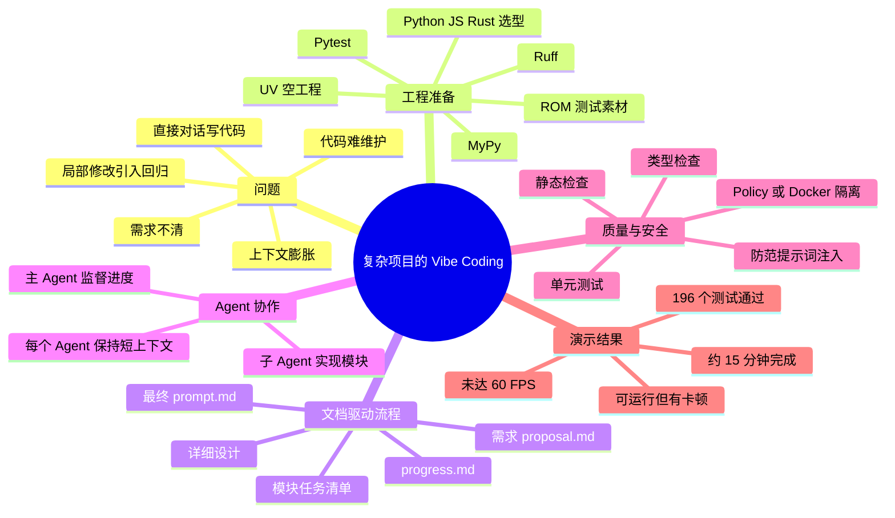
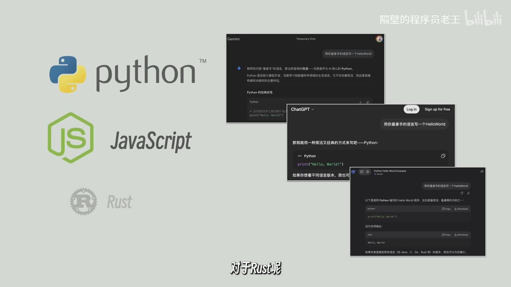
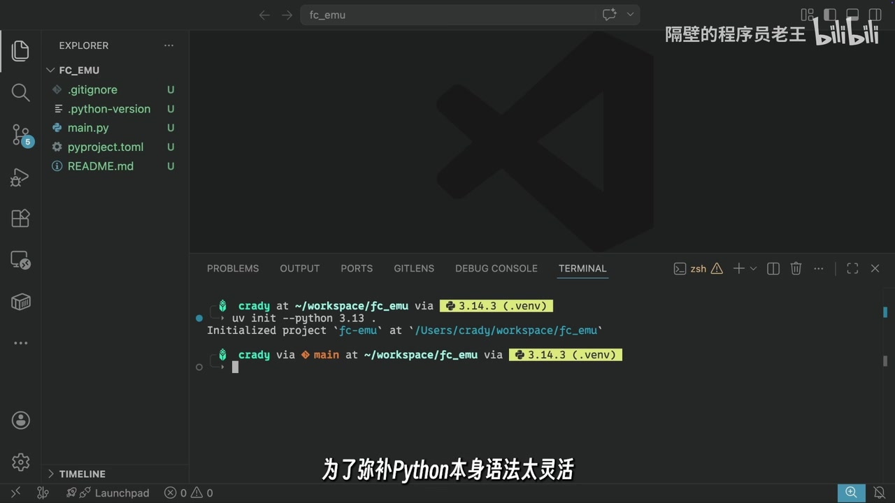
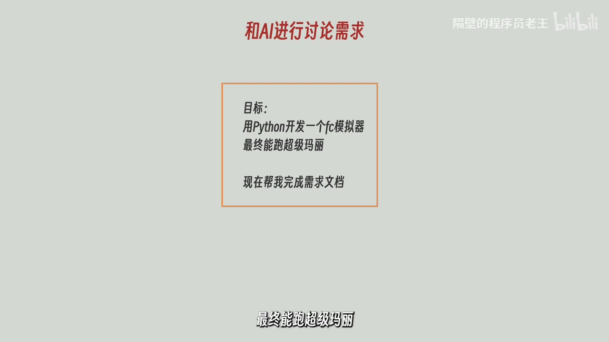

# VibeCoding就该这么做！

> 来源：[Bilibili 视频](https://www.bilibili.com/video/BV1YP5W6ZEP9)<br>
> UP 主：隔壁的程序员老王｜发布时间：2026-05-14｜视频时长：13 分 16 秒（796 秒）  
> 视频目标：以 Python 从零开发能运行《超级马力欧》的 FC/NES 模拟器，演示一套将 AI 编程从“直接要代码”转为“文档驱动、任务拆分、Agent 协作、自动验证”的流程。

## 小结

视频讨论的重点不是模拟器原理本身，而是复杂项目中的 Vibe Coding 应如何落地。UP 主认为，直接用自然语言让 AI 连续写代码，在玩具项目中或许有效；但项目复杂后，需求不清、上下文膨胀、局部修改破坏既有功能，以及代码可维护性下降，会使项目逐渐成为难以理解的“垃圾场”。

其给出的主线是：**先让 AI 通过提问澄清需求，再把讨论结论固化为文件；基于文件形成详细设计；把模块拆成独立任务与全局进度表；最后由一个主 Agent 调度多个子 Agent 实现，并以类型检查、静态检查和单元测试作为约束。**核心目的，是把关键信息从一次性对话上下文转移到可持久化的项目文档中。

案例选择了 Python、UV 工程、MyPy、Ruff 与 Pytest，并准备了《超级马力欧》ROM 作为测试素材。UP 主并未将 Python 描述为唯一答案：Python、JavaScript、Rust 是其建议优先考虑的三种语言；本案例选 Python 的直接原因是其个人最熟悉该语言。对于 Python 的动态特性，则额外以类型检查、静态检查和测试降低 AI 自由生成代码带来的不确定性。

实现阶段采用“监工 Agent + N 个模块子 Agent”的层级：主 Agent 追踪 `progress.md`，子 Agent 分别按模块的详细设计和任务清单编写、测试、验证代码。这样做意在限制各 Agent 的上下文长度，避免将所有任务持续堆进同一个会话。视频中特别强调，每行生成代码应有相应单元测试，并通过 MyPy 与 Ruff 检查。

演示结果是：AI 大约用 15 分钟完成了程序，模拟器能够运行，但存在卡顿，未达到 60 FPS。最终手动检查显示 MyPy、Ruff 通过，196 个单元测试全部通过。**这证明的是该演示工程在所展示检查项下可运行且测试通过，不等同于模拟器性能、兼容性、代码正确性或生产可用性已被全面验证。**

本视频适合已经在使用 Claude Code、Codex、Gemini CLI 等 AI 编程工具，且开始遇到代码失控、会话过长、迭代易回归问题的开发者。工具能力、模型上下文窗口、Agent API、权限机制与检查器版本均可能随时间变化；视频中的工具选择和约束策略应视为工作流经验，而非永久不变的通用配置。

## 思维导图




## 目录

- [背景：为什么不能只靠“嘴编程”](#背景为什么不能只靠嘴编程)
- [语言与工程基线：先把约束搭起来](#语言与工程基线先把约束搭起来)
- [第一步：通过提问生成需求文档](#第一步通过提问生成需求文档)
- [第二步：详细设计与上下文管理](#第二步详细设计与上下文管理)
- [第三步：任务拆分和全局进度](#第三步任务拆分和全局进度)
- [第四步：主从 Agent 实现、验证与权限控制](#第四步主从-agent-实现验证与权限控制)
- [结果、可迁移经验与限制](#结果可迁移经验与限制)
- [字幕比对](#字幕比对)
- [评论分析](#评论分析)
- [处理记录](#处理记录)

## 背景：为什么不能只靠“嘴编程” [00:00:33](https://www.bilibili.com/video/BV1YP5W6ZEP9?t=33)

视频开场提出的问题是：AI 编程降低了搭建“看起来像项目”的程序的门槛，但不代表复杂工程自动变得可靠。UP 主的经验判断包括：

1. 对 AI 说几句话即可产出原型，适合快速做玩具或验证想法。
2. 当项目复杂度上升，AI 的错误更容易累积：某处修好，另一处可能坏掉；某个功能实现，另一个功能可能异常。
3. 长期反复对话、修改后，即使最终程序勉强正常，代码也可能难以阅读、维护和继续扩展。
4. 花费大量 Token 并不能自动换来良好的工程结构；关键在于先界定目标、保存决策、限制每次任务的范围，并建立验证机制。


> 图：画面以“AI 模型—复杂程序—简单程序”的对比，表达复杂项目在无结构迭代下容易混乱。它对应视频开场对“代码垃圾场”和维护困难的警示，说明后续流程并非单纯追求更长提示词，而是追求可控工程边界。

本期的实践目标是从零开发 FC 模拟器，并用其运行《超级马力欧》。UP 主明确说明自己也不了解模拟器如何编写，因此案例同时说明：领域知识不足时，不应要求 AI 猜测需求，而应让其用提问协助用户逐步确定需求。

## 语言与工程基线：先把约束搭起来 [00:00:58](https://www.bilibili.com/video/BV1YP5W6ZEP9?t=58)

### 语言选择的取舍 [00:00:58](https://www.bilibili.com/video/BV1YP5W6ZEP9?t=58)

UP 主将 Python、JavaScript、Rust 列为 Vibe Coding 中优先考虑的三种语言：

| 语言 | 视频中的判断 | 在本案例中的角色 |
| --- | --- | --- |
| Python | AI 模型普遍更擅长；第三方库丰富；UP 主最熟悉 | 本项目实际选择 |
| JavaScript | 与 Python 一样，被视为多数 AI 模型擅长生成的语言，生态丰富 | 可按个人偏好替代 Python |
| Rust | AI 未必像生成 Python/JS 那样得心应手，但严格的语法与安全限制可约束生成结果 | 适合希望让 AI 承担严格编译约束成本的场景 |

这里的“Python、JavaScript 是 AI 世界母语”“Rust 很安全”等均属于视频作者的经验性概括，并非对全部模型、全部版本或全部项目的普遍保证。实际选型仍应结合运行性能、部署平台、现有团队能力、库生态与问题域。



> 图：画面展示 Python、JavaScript、Rust 标识及多个模型生成 Hello World 的示意。其价值在于直观呈现作者的选型逻辑：优先考虑模型生成能力与生态，而非仅按开发者个人语言偏好决定。

### 初始工程与质量工具 [00:02:10](https://www.bilibili.com/video/BV1YP5W6ZEP9?t=130)

作者已用 UV 创建 Python 空工程；画面中可见的初始化命令为：

```bash
uv init --python 3.13
```

视频强调，这只是基础空工程，尚无有意义业务代码。为约束 Python 的灵活语法以及 AI 生成代码的不确定性，工程加入：

- **MyPy**：类型检查；
- **Ruff**：静态检查/代码规范检查；
- **Pytest**：单元测试；
- **《超级马力欧》ROM**：用于测试模拟器运行效果。



> 图：VS Code 中展示 `fc_emu` 工程目录与 UV 初始化终端。画面可见基础文件如 `pyproject.toml`、`main.py`、`.python-version`，有助于区分“工程基线”与后续 AI 生成的模块代码。

需要注意：ASR 将 Ruff 多次识别为“Ruf/RAF/raff”，结合视频语境中与 MyPy、Pytest 并列的 Python 检查工具，正文统一校正为 **Ruff**。视频没有给出 MyPy、Ruff、Pytest 的具体版本、配置规则或完整依赖清单，不能据此复现完全相同的环境。

## 第一步：通过提问生成需求文档 [00:02:59](https://www.bilibili.com/video/BV1YP5W6ZEP9?t=179)

### 需求先于代码 [00:02:59](https://www.bilibili.com/video/BV1YP5W6ZEP9?t=179)

UP 主将 Vibe Coding 的第一步定义为“确定需求”。AI 输出与预期有落差，根源往往不是模型不会写，而是用户自己也未明确想要什么。对于不熟悉 FC 模拟器的人，视频建议与 AI 讨论，不让它擅自替用户补全意图。

### 四段式提示词结构 [00:03:23](https://www.bilibili.com/video/BV1YP5W6ZEP9?t=203)

视频建议给 AI 的消息按以下四部分组织：

| 部分 | 本案例内容 | 作用 |
| --- | --- | --- |
| 目标（Goal） | 用 Python 开发 FC 模拟器，最终可运行《超级马力欧》；请求完成需求文档 | 明确最终成果与当前工作目标 |
| 输入（Input） | 当前目录是 UV Python 工程；ROM 文件夹中有《超级马力欧》镜像文件 | 交代已有工程和可用素材 |
| 输出（Output） | 在 `docs` 文件夹生成需求文档 `proposal.md` | 固定产物位置与文件名 |
| 步骤（Steps） | 不了解 FC 模拟器；要求 AI 用提问帮助确定需求；不要猜测意图；所有不明确处都必须提问 | 规定 AI 的协作方式与不确定性处理规则 |

可将其理解为如下提示词骨架。以下是对视频口述内容的结构化整理，**不是视频逐字展示的完整原始 Prompt**：

```text
目标：
用 Python 开发一个 FC 模拟器，最终能运行《超级马力欧》。
现在帮我完成需求文档。

输入：
当前文件夹是一个 UV Python 工程。
ROM 文件夹下有《超级马力欧》的镜像文件。

输出：
请在 docs 文件夹下生成需求文档 proposal.md。

步骤：
我不了解 FC 模拟器相关知识。
请通过提问的方式帮助我确定需求，不要猜测我的意图。
任何不明确的地方都必须向我提问。
```

作者使用 Claude Code 演示，也明确可使用 Codex、Gemini CLI 或其他偏好的 AI 编程工具。执行后，AI 会提出一系列问题；用户据个人偏好回答，最后生成 `proposal.md`。



> 图：画面突出“和 AI 进行讨论需求”，并展示“目标：用 Python 开发一个 FC 模拟器，最终能跑超级马力欧，现在帮我完成需求文档”。这张图最能说明本流程的关键转折：先通过对话澄清，再要求形成可保存文档。

### `proposal.md` 的定位 [00:04:40](https://www.bilibili.com/video/BV1YP5W6ZEP9?t=280)

`proposal.md` 的作用是从技术角度分析“到底要做什么”。作者称它可以：

- 由人手工修改；
- 继续通过和 AI 对话修改；
- 作为后续设计、任务划分的稳定输入。

这一步的本质是把易失的聊天上下文转成项目内可审阅、可修改、可复用的文件。

## 第二步：详细设计与上下文管理 [00:05:05](https://www.bilibili.com/video/BV1YP5W6ZEP9?t=305)

正常的软件设计流程中，作者描述的顺序是：

1. **概要设计**：划分系统模块，并建立模块关系；
2. **详细设计**：确定各模块的具体实现细节。

在这个案例中，生成的需求文档已包含部分概要设计，例如功能需求中划分了：

- ROM 加载；
- CPU 模拟；
- PPU 模拟；
- 以及其他相关模块。

因此作者跳过了额外的概要设计；若自己的 `proposal.md` 没有模块划分，则可要求 AI 根据该文件先生成概要设计。

### 从需求到详细设计 [00:05:29](https://www.bilibili.com/video/BV1YP5W6ZEP9?t=329)

随后让 AI 根据需求文档生成详细设计，提示词仍沿用“目标、输入、输出、步骤”的四段式。视频再次强调：在步骤中保留“让 AI 主动提问”的要求，可降低设计时的不确定性。

### 把上下文压缩为文件，而不是压缩在模型里 [00:06:17](https://www.bilibili.com/video/BV1YP5W6ZEP9?t=377)

当生成需求文档的会话已经很长时，作者建议新建会话，因为此前讨论成果已浓缩到文档中。其原则是：

- 每次 AI 会话只处理尽可能少的事情；
- 核心信息应保存在文件中；
- 保持对话上下文短小；
- 既可降低 Token 消耗，也可减少模型因上下文过长而产生幻觉的风险。

完成后得到一份针对各模块的详细设计文档。对非常简单的项目，理论上可直接根据详细设计让 AI 编码；但对较大项目，作者认为不可取，原因在于代码细节长期存在单一对话上下文中会导致窗口变长、变慢、变贵。

当上下文过长，模型可能自动总结、压缩上下文。作者的担忧是：正在实现的模块所需代码细节可能在压缩中被遗漏，从而提高 Bug 概率。这是视频提出任务拆分的直接动机。

## 第三步：任务拆分和全局进度 [00:07:42](https://www.bilibili.com/video/BV1YP5W6ZEP9?t=462)

为避免单个上下文容纳整个项目，作者进入第三步：划分任务。该步骤有两项明确产物：

1. **每个模块独立的任务清单**：用 checklist 标记任务是否完成，方便后续为不同模块启动多个 Agent；
2. **全局 `progress.md`**：记录各模块总体完成状态。

与前两步不同，作者此处没有再给 AI 提问机会，因为其判断是已有需求和设计足够详细。执行该提示词时，仍新建会话，以维持上下文清洁。

### 为什么不把所有任务交给一个 Agent？ [00:08:31](https://www.bilibili.com/video/BV1YP5W6ZEP9?t=511)

最直观的方式是把完整任务列表交给一个 Agent，按顺序实现。视频认为其缺点为：

- 整个生成过程积累在同一 Agent 上下文；
- 容易多次触发上下文压缩；
- 程序质量较难保证；
- Token 成本更高。

这并不是说单 Agent 对所有项目都不能使用，而是该案例将 FC 模拟器视为适合模块化拆分的复杂任务，因此选择多 Agent 结构。

## 第四步：主从 Agent 实现、验证与权限控制 [00:09:19](https://www.bilibili.com/video/BV1YP5W6ZEP9?t=559)

### 主 Agent 与子 Agent 的职责 [00:09:19](https://www.bilibili.com/video/BV1YP5W6ZEP9?t=559)

作者利用多数编程 API 支持自动生成子 Agent 的能力，设计如下架构：

| 角色 | 职责 |
| --- | --- |
| 主 Agent / 监工 Agent | 读取并监督全局 `progress.md`，准备环境，管理整体进度，调度模块工作 |
| N 个子 Agent | 按模块任务清单和详细设计实现代码，并完成相应测试、验证 |

整个实现过程中，用户直接下达命令的对象只有主 Agent。主 Agent 的初始 Prompt 需要同时包含自身职责和各子 Agent 的工作要求，因而会较复杂。视频的解决办法是：让 AI 生成这个复杂 Prompt，而不是完全手写。

### `prompt.md` 中的约束 [00:09:43](https://www.bilibili.com/video/BV1YP5W6ZEP9?t=583)

该阶段的元提示词需要明确：

- 主 Agent 负责整体进度监控；
- 子 Agent 负责模块实现；
- 整个过程不需要人工参与；
- Python 属于弱类型语言，易出错；
- 要求每行生成代码都有相应单元测试；
- 代码需要通过 MyPy 和 Ruff；
- 最后一次允许 AI 用提问方式澄清问题；
- 最终生成的 Prompt 保存为 `prompt.md`。

生成出的最终提示文件包含：主 Agent 的环境准备说明、子 Agent 划分方式，以及每个子 Agent 的独立提示词。视频称子 Agent 提示词中包含详细设计和任务文件地址、实现要求、测试与验证要求等信息。

### 运行与安全边界 [00:11:20](https://www.bilibili.com/video/BV1YP5W6ZEP9?t=680)

作者随后用 Claude Code 命令行读取生成好的提示文件，开始自动准备环境并生成子 Agent 编写代码。为便于演示，视频使用了“打开所有权限”的参数，但**未在提供的字幕素材中给出该参数的具体名称或命令**，因此不能补写为某个确定 CLI 选项。

作者同时给出现实使用建议：

- 不宜默认开放所有权限；
- 可使用 **policy** 管理权限；
- 或将项目置于 **Docker** 中；
- 目的之一是降低提示词注入风险。

这部分是重要限制：自动化 Agent 的文件、网络、命令执行权限会直接决定风险边界。视频只提出安全方向，未展示具体 policy 规则、Dockerfile、容器权限、网络隔离或密钥管理配置，实际应用时仍需自行补全。

## 结果、可迁移经验与限制 [00:11:47](https://www.bilibili.com/video/BV1YP5W6ZEP9?t=707)

### 演示结果 [00:11:47](https://www.bilibili.com/video/BV1YP5W6ZEP9?t=707)

快进后，作者称 AI 大约在 **15 分钟**完成程序。直接运行的结果是：

- 模拟器可以运行；
- 有一定拖慢/卡顿；
- 无法达到 **60 FPS**；
- 作者认为首次达到这个程度已经可以接受；
- 若需优化，可继续重复此前的 `proposal`、`design`、`coding` 流程。

视频没有提供性能分析数据、CPU/GPU 配置、帧率曲线、ROM 兼容性测试范围，也没有展示优化后的结果。因此“可运行但未到 60 FPS”是本案例可确认的边界，不能推导为对其他 ROM、其他设备或其他 Agent 模型的性能结论。

### 质量检查结果 [00:12:11](https://www.bilibili.com/video/BV1YP5W6ZEP9?t=731)

最终工程产物包括：

- 与详细设计对应、按模块组织的代码文件；
- 与模块对应的单元测试文件；
- 通过的 MyPy 与 Ruff 检查；
- **196 个单元测试全部通过**。

作者强调，测试与检查是持续开发中的关键保障：后续添加功能时，才能尽可能避免 AI 破坏原有功能。这里应准确理解为“回归防线”，而非绝对正确性证明：测试是否覆盖关键边界、测试本身是否正确、静态规则是否充分，仍决定实际保障强度。

### 可复用的工作流

1. 选择 AI 较擅长且团队能维护的语言与生态。
2. 先建立项目骨架，并将类型检查、静态检查、测试纳入起点，而不是最后补救。
3. 用“目标—输入—输出—步骤”组织提示词。
4. 领域陌生时，明确要求 AI 提问，禁止其猜测未说明意图。
5. 将需求、设计、任务和进度写入文件，如 `proposal.md`、详细设计文档、模块 checklist、`progress.md`、`prompt.md`。
6. 每完成一份稳定文档，可新建对话，避免持续携带冗长历史上下文。
7. 大项目按模块拆分，令主 Agent 监督全局、子 Agent 负责局部实现。
8. 将测试、MyPy、Ruff 等验证要求写入 Agent 约束，并在最终阶段实际执行。
9. 不为演示便利而在真实环境长期开放所有权限；以 policy、容器等方式限制自动化执行面。
10. 对可运行的初版继续走“需求—设计—实现—验证”循环，逐步优化，而不是在一个无限增长的会话里反复修补。

### 时效性与未验证事项

- 视频发布于 2026-05-14，素材抓取时间为 2026-07-16；Claude Code、Codex、Gemini CLI、模型 API 与多 Agent 功能均可能更新。
- 视频描述提供了 UV 教程链接及“代码及知识星球”链接，但当前素材未包含完整工程、Prompt 文件或仓库内容，无法逐项审计实现。
- ROM 的版权、来源与使用许可未在视频素材中说明；本文仅记录其被用于测试，不对其合法性作判断。
- “每行代码均有单元测试”是视频要求，并不等同于素材已独立核验每一行都存在有效覆盖。
- 196 个测试通过、MyPy/Ruff 通过是视频展示结果；未提供原始终端完整输出，无法复核具体命令、版本和规则集。

## 字幕比对

| 字幕来源 | 完整性 | 专有名词 | 时间轴 | 主要问题 |
| --- | --- | --- | --- | --- |
| Bilibili 站内字幕 | 未提供可用站内字幕，无法比较文本内容 | 无法评价 | 无法评价 | 素材明确标注“未提供可用站内字幕” |
| 本次 ASR 字幕 | 覆盖约 743.73 秒语音，诊断覆盖率 93.44%；首段为 00:00:33.700，末段为 00:13:08.600 | 存在较多同音/误识别 | 有 SRT 起止时间，可直接定位 | 多个长句被合并；存在 Python、ROM、Ruff、Docker、Claude Code 等术语误识别 |

本次检查了 ASR 结果。ASR 使用 `medium` 模型，识别语言为中文，语言置信度为 `0.99951171875`，带时间戳；诊断中**未标记** `noAudioStream=true`，且提供了音频文件与有效语音分段，因此不能将本视频视为无音轨视频。

由于没有可用站内字幕，正文以本次 ASR 的 SRT 时间轴为唯一可用字幕时间依据，并结合关键帧和上下文对少数术语作最小必要校正：

| ASR 原文或近似识别 | 正文采用 | 校正依据 |
| --- | --- | --- |
| webcoding / Web Coding | Vibe Coding / AI 编程工作流 | 视频标题为“VibeCoding就该这么做！”；正文语义为 AI 辅助编程流程 |
| Pythen / Pythan | Python | 语言选型语境及关键帧中的 Python 标识 |
| Roam | ROM | FC 模拟器测试素材语境 |
| Ruf / RAF / raff | Ruff | 与 MyPy、Pytest 并列的 Python 静态检查工具语境 |
| 买派 | MyPy | 类型检查器名称与上下文 |
| doker | Docker | 容器隔离与提示词注入防护语境 |
| Cloud Code | Claude Code | 作者口述工具名的 ASR 近音；本文按常见工具名称校正，但视频画面未提供可供逐字核验的命令输出 |
| Gimlet CLI | Gemini CLI | 与 Codex、Claude Code 并列的 AI 编程工具语境；此项为基于语境的校正，应保留不确定性 |

ASR 在 `00:00:00` 至 `00:00:33.700` 没有语音文本段。素材未提供站内字幕补齐该段，故本文不为该时间段虚构旁白内容。

## 评论分析

以下仅分析可获取热评前三条；评论是观众观点，不作为已验证事实。

1. **来了多多来了（204 赞）**：“写代码变成了写提示词。”  
   - 观点：概括了视频工作流中 Prompt 设计占比显著提升的现象。  
   - 补充价值：提醒读者，AI 编程并未消除表达需求、定义约束和验收结果的工作，而是将一部分工作转移到提示词与文档设计。  
   - 限制：该表述带有调侃和简化色彩。视频并非只讲“写提示词”，还强调测试、进度管理、权限控制与持续迭代。

2. **OhMemoRy（120 赞）**：懂业务就向 AI 讲清楚；不懂就让 AI 提问，不要让对方猜。  
   - 观点：与视频最核心的方法高度一致，即“已知时给清晰信息，未知时要求 AI 追问”。  
   - 补充价值：把视频的“目标—输入—输出—步骤”结构压缩为沟通原则，适用于需求澄清阶段。  
   - 限制：以“谈恋爱”作类比有助理解，但不能替代工程要求；复杂项目还需要版本控制、代码审查、测试覆盖、权限隔离等机制。

3. **大自然卫士（97 赞）**：AI 可迅速给出“差不多的模板”，但将其优化到接近完美可能耗费数倍时间且未必成功。  
   - 观点：针对视频中“可运行但卡顿、未到 60 FPS”的结果，指出性能优化和高质量收尾的成本可能显著高于原型生成。  
   - 补充价值：为视频的演示边界提供了现实提醒——初版跑通不等于产品级完成。  
   - 限制：关于“数倍时间”“不一定做得出来”是评论者推测，素材没有性能优化实验或成本对照数据，不能视为量化结论。

## 处理记录

- Worker ID：`worker-mrj0wjed-b0c290ad`
- 模型：`gpt-5.6-terra`
- 调用工具与素材：视频元数据、ASR 诊断、ASR SRT 时间轴字幕、关键帧素材、热评前三条；ASR 模型记录为 `medium`，设备为 CUDA，计算类型为 `float16`。
- 使用的应用工具：素材处理流程已产出 `merged.mp4`、`audio/audio.wav`、`frames/`、`asr/transcript.srt`、`asr/asr-result.json` 与评论 JSON；未提供可用站内字幕文件。
- 字幕选择：检查后确认站内字幕缺失；采用本次 ASR SRT 作为时间定位基准。ASR 未标记 `noAudioStream=true`，且音频和有效时间分段存在。对 Python、ROM、MyPy、Ruff、Docker 等明显术语误识别结合画面与上下文做了校正；涉及 Claude Code/Gemini CLI 的校正保留语境推断属性。
- 关键帧选择依据：选用 `frame-001.jpg` 表达复杂项目失控风险，`frame-002.jpg` 展示语言选择讨论，`frame-003.jpg` 佐证 UV 工程初始化，`frame-004.jpg` 佐证需求讨论提示词；均与相邻 ASR 时间段的主题直接对应。
- 缓存清理：提供的素材中未包含缓存清理日志或清理结果；本次整理未获得可执行清理操作的证据，因此不能声称已删除缓存。
- 未解决问题：未提供完整工程源代码、完整 Prompt、实际 CLI 命令、依赖版本、检查配置及性能数据；无法独立复现实验、审计 196 个测试内容或验证“每行代码都有测试”的覆盖程度。
