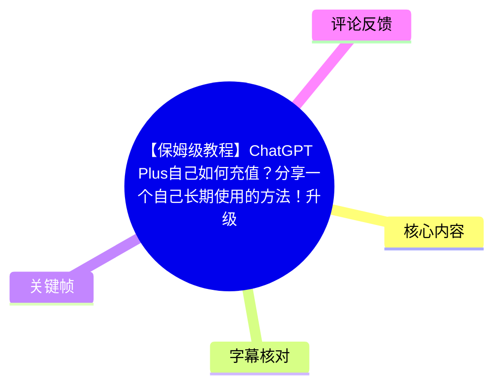
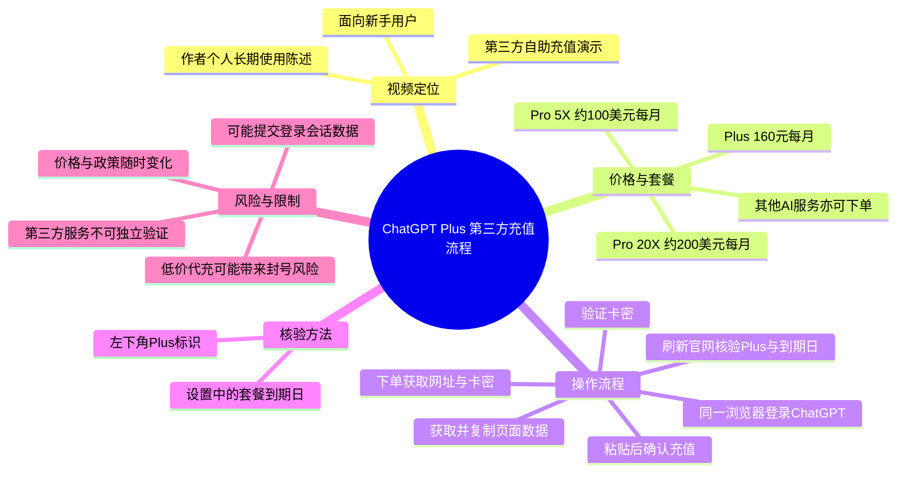
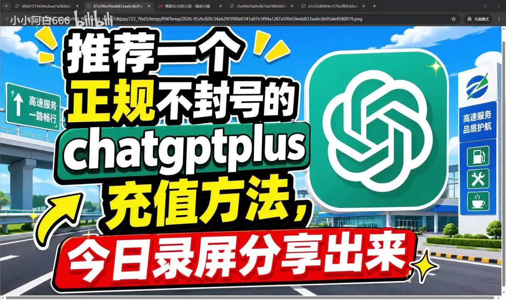
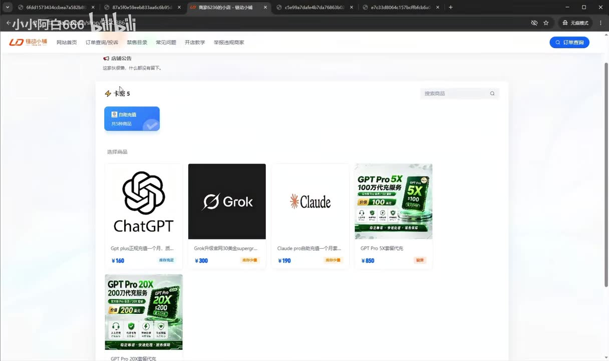

# 【保姆级教程】ChatGPT Plus自己如何充值？分享一个自己长期使用的方法！升级 GPT-5.5 后太好用了！还能玩 image-2 和 Codex

> 来源：[Bilibili 视频](https://www.bilibili.com/video/BV1RqLz65E61)  
> UP 主：小小阿白666｜时长：4 分 48 秒｜合集：AIcode  
> 视频简介提供了一个第三方下单网址；本文仅整理视频中出现的陈述与操作，不为该第三方服务的安全性、合规性、持续可用性或充值结果背书。

## 小结

视频展示的是一种**通过第三方自助充值页面为 ChatGPT 账户开通 Plus**的流程。UP 主称，用户先在其推荐的第三方店铺下单，获得“自助充值网址”和“卡密”，再在已登录 ChatGPT 账号的同一浏览器中验证卡密、获取页面数据、复制并提交数据，最后在 ChatGPT 官网刷新并检查 Plus 标识和到期日。

UP 主将该方案描述为“正规充值”“稳定”“质保一个月”，并称 Plus 价格为 **160 元/月**；同时称自己曾因低价代充导致旧账号被封，聊天内容及训练数据无法找回，因此建议长期用户不要因低价而选择来源不明的代充。以上均是视频作者的个人经历与商业推荐，素材中没有独立证据可验证。

本视频真正的操作关键，不是普通的付款步骤，而是第三方页面要求从已登录 ChatGPT 的浏览器页面中“获取数据”并复制后提交。这意味着用户可能向第三方交付可用于识别、维持或操作登录会话的数据。即使视频强调“不需要发账号密码”，这类流程仍存在账号、会话凭据、隐私数据和服务条款风险；应避免在主账号、含重要对话记录或敏感信息的账号上贸然操作。

视频后段还提到 Pro 相关套餐：作者口述有“5X”约 100 美元/月和“20X”约 200 美元/月两档，称二者有更多 Pro 模型和 Codex 额度，但需要联系客服人工充值。视频标题提到“GPT-5.5”“image-2”和 Codex；在可用 ASR 中，只有 Codex 额度被口述提及，未见对“GPT-5.5”或“image-2”的实际演示、功能比较或使用教程。

该内容具有强时效性：价格、套餐名称、模型权限、第三方页面流程、OpenAI 官方政策和第三方商家状态都可能变化。视频画面中“5 月 10 日至 6 月 10 日”的到期日示例仅说明作者当时录屏所见，不能推导为当前可用状态。

## 思维导图

## 目录

- [背景、来源与时效性](#背景来源与时效性)
- [作者的方案与价格主张](#作者的方案与价格主张)
- [第三方自助充值操作流程](#第三方自助充值操作流程)
- [到账核验与作者经验](#到账核验与作者经验)
- [Pro、Codex 与其他服务](#procodex-与其他服务)
- [风险、限制与实践建议](#风险限制与实践建议)
- [字幕比对](#字幕比对)
- [评论分析](#评论分析)
- [处理记录](#处理记录)

## 背景、来源与时效性

### 视频所要解决的问题 [00:00:00](https://www.bilibili.com/video/BV1RqLz65E61?t=0)

视频开头说明，作者要分享一个 ChatGPT Plus“充值方法”，并承诺全程录屏、面向新手。作者称自己较早开始使用 ChatGPT，早期曾在淘宝寻找代充，后来转至闲鱼商家；截至视频录制时，作者称淘宝和闲鱼已难以直接搜索到相关代充商家，但仍与此前找到的商家保持联系，并在其处持续充值一年多。

> 图：封面直接呈现“正规不封号”“chatgptplus 充值方法”等营销性表述，帮助理解视频的核心定位是第三方充值推广，而非 OpenAI 官方订阅界面的使用说明。该文案属于封面宣传，不构成账号安全或不会封禁的证明。

### 来源与信息边界 [00:00:48](https://www.bilibili.com/video/BV1RqLz65E61?t=48)

作者表示，目前通过一个“自主充值网址”下单，并称链接会放在评论置顶和视频简介；元数据中的视频简介确实包含一个第三方网址。视频没有展示 OpenAI 官方支付入口，也没有提供对该商家资质、资金流、隐私政策、数据处理方式或与 OpenAI 关系的独立证明。

因此，需区分以下三类信息：

- **视频可确认的内容**：作者演示了一个第三方页面的卡密验证与提交流程，并在自己的 ChatGPT 页面展示了 Plus 标识及到期日。
- **作者的主张**：价格 160 元/月、“正规充值”“稳定”“质保一个月”“不会封号”、长期使用一年多等。
- **无法从素材独立验证的内容**：商家是否合法合规、充值资金来源、登录数据用途、账户长期安全性、当前是否仍可充值，以及套餐是否与官方当前权益一致。

## 作者的方案与价格主张

### Plus 价格、质保与低价代充经历 [00:01:12](https://www.bilibili.com/video/BV1RqLz65E61?t=72)

作者口述的 Plus 方案参数如下：

| 项目 | 视频中的说法 | 证据边界 |
| --- | --- | --- |
| Plus 价格 | 160 元/月 | 作者口述；画面中的店铺商品卡也显示 ¥160。 |
| 充值属性 | “正规充值”“正价充值” | 作者主张，未提供可独立核验材料。 |
| 售后 | “稳定质保一个月” | 作者主张；未说明质保规则、退款条件或纠纷处理机制。 |
| 使用时长 | 作者称已在该商家处充值一年多 | 个人使用陈述。 |
| 低价方案风险 | 作者称曾在淘宝使用极低价充值，旧账号被封，内容和训练数据无法找回，申诉未成功 | 个案经验，不能直接推导所有低价或第三方服务都会导致封号。 |

作者的核心经验结论是：长期使用时，不应只追求低价，因为一旦账号出问题，历史对话和数据可能损失。这个结论中的“保存重要数据、避免将主账号交给不可信第三方”具有一般性的风险管理意义；但“选择该店铺即可避免封号”并不能由视频内容推出。

> 图：画面展示一个第三方店铺的商品卡，包含 ChatGPT、Grok、Claude 及 GPT Pro 相关商品；其中 ChatGPT 商品显示 ¥160。该图用于佐证视频中确有第三方商品页及标价展示，同时也说明该页面不是 ChatGPT/OpenAI 的官方订阅页面。

## 第三方自助充值操作流程

### 前置条件与下单产物 [00:01:37](https://www.bilibili.com/video/BV1RqLz65E61?t=97)

按作者描述，用户下单后会获得两项内容：

1. 一个“自助充值网址”；
2. 一个卡密。

作者称遇到问题可点击页面中的客服入口。视频没有展示付款渠道、订单协议、卡密交付方式、客服响应标准或售后凭据，因此这些环节均无法从素材进一步确认。

### 步骤 1：打开页面并验证卡密 [00:02:01](https://www.bilibili.com/video/BV1RqLz65E61?t=121)

作者的操作顺序为：

1. 使用浏览器打开第三方自助充值网址；
2. 作者称手机浏览器和电脑浏览器均可打开；
3. 输入下单后收到的卡密；
4. 点击“立即验证”。

此阶段的限制是：视频没有说明不同设备、不同地区、不同 ChatGPT 账户状态下的兼容性，也没有展示卡密失效、验证失败或订单异常时的处理路径。

### 步骤 2：在同一浏览器登录 ChatGPT 并获取数据 [00:02:15](https://www.bilibili.com/video/BV1RqLz65E61?t=135)

作者称验证后，页面会要求提交充值信息。演示中的要点是：

1. 点击“登录账号”或“已登录获取数据”；
2. 若当前浏览器未登录 ChatGPT，则先跳转或前往登录；
3. 必须在**同一个浏览器**中登录自己的 ChatGPT 账号；
4. 登录后点击“已登录获取数据”；
5. 页面跳转后，将该页面中的内容“全部复制”。

这是全片最需要谨慎对待的步骤。视频没有清楚展示所复制数据的字段、用途、传输方式、保存时间及访问权限。由于这些数据来自已登录会话，可能包含会话标识或其他敏感信息。本文不复述或尝试提取任何可能构成凭据的页面内容。

> 安全提示：不要把密码、双因素认证验证码、API Key、浏览器 Cookie、会话 Token、页面导出数据或含敏感对话的账号信息发送给不可信主体。若第三方要求复制登录后页面的完整内容，应先理解数据具体是什么、为何需要、如何保存和删除；无法确认时应停止操作。

### 步骤 3：提交、确认并发起充值 [00:02:33](https://www.bilibili.com/video/BV1RqLz65E61?t=153)

作者继续演示：

1. 将上一步复制的页面内容粘贴到第三方页面；
2. 点击“开始充值”；
3. 页面弹出账号确认提示；
4. 确认是自己的账号后，点击“确认充值”。

ASR 在 **02:41—02:50** 存在约 9.06 秒无语音区间；随后作者直接展示“操作成功”。该空白区间内是否存在等待、页面加载、人工处理或其他提示，素材中的 ASR 无法说明，因而不能将视频过程概括为即时到账或全自动完成。

## 到账核验与作者经验

### 核验 Plus 标识与到期日期 [00:02:50](https://www.bilibili.com/video/BV1RqLz65E61?t=170)

作者称页面显示“操作成功、GPT Plus 已激活”后，应返回 ChatGPT 官网刷新页面，并通过以下方式核验：

- 查看页面左下角是否出现 **Plus** 标识；
- 进入头像/设置/账户相关位置，查看套餐到期日；
- 作者当时以“5 月 10 日”充值后显示“6 月 10 日”到期为例，称正好一个月。

这里的核验逻辑是合理的界面检查思路，但视频只呈现了单个账户、单次示例。到期日、权益范围、币种、扣款主体和自动续订状态应以用户自己的官方账户页面及官方账单为准。

### 作者对自助流程的评价 [00:03:09](https://www.bilibili.com/video/BV1RqLz65E61?t=189)

作者认为该方式比旧式代充更简单：旧方式需要向商家发送账号密码，由商家登录后代为充值；新方式则由用户自行在浏览器中完成操作。

不过，“不直接交付密码”不等于没有账号风险。若流程需要从已登录页面提取并上传数据，仍可能造成会话被第三方利用。相较于把密码交给商家，这只能说明风险形式不同，不能据此认定风险消失。

## Pro、Codex 与其他服务

### Pro 5X、20X 与 Codex 额度说法 [00:03:33](https://www.bilibili.com/video/BV1RqLz65E61?t=213)

作者面向“Plus 不够用”的重度用户，口述了两种 Pro 相关套餐：

| 视频口述名称 | 视频口述价格 | 作者称增加的内容 | 办理方式 |
| --- | ---: | --- | --- |
| Pro 5X | 100 美元/月 | Pro 模型、更多 Codex 额度 | 需联系店家客服，人工充值 |
| Pro 20X | 200 美元/月 | Pro 模型、更多 Codex 额度 | 需联系店家客服，人工充值 |

画面中的商品卡也出现“GPT Pro 5X”“GPT Pro 20X”等名称，但视频没有解释“5X”“20X”的准确计量单位、使用上限、重置周期、是否对应官方套餐名称，或 Codex 的具体额度数值。ASR 将“Codex”误识别为“Cardax”，结合视频标题标签 `codex` 与上下文，本文统一校正为 **Codex**。

### 其他 AI 服务与标题中的功能名 [00:04:23](https://www.bilibili.com/video/BV1RqLz65E61?t=263)

作者称，如需要 Google 或 Claude 等其他 AI 服务，也可以使用“自助充值网址 + 卡密”的形式；并提到一个“两个……三百元”的价格描述，但 ASR 文字在此处明显混乱，无法可靠确认具体产品、时长和币种，不能作为可执行价格信息。

视频标题包含“升级 GPT-5.5 后太好用了”“还能玩 image-2 和 Codex”，但在可用语音内容中：

- **Codex**：仅被作为 Pro 套餐额度更多的项目提及；
- **GPT-5.5**：未见实际功能、界面或效果演示；
- **image-2**：未见实际功能、界面或效果演示。

因此，这些标题信息只能视为视频宣传语或主题标签，不能据本视频得出其当前可用性、使用方法或套餐归属。

## 风险、限制与实践建议

### 关键风险 [00:01:37](https://www.bilibili.com/video/BV1RqLz65E61?t=97)

1. **第三方与官方关系不明**  
   视频未证明该服务获得 OpenAI 授权，也未证明充值资金和订阅权限来源。第三方页面、价格和商家均可能随时失效。

2. **登录会话数据暴露风险**  
   视频要求在已登录 ChatGPT 的同一浏览器中获取并复制页面全部内容再提交给第三方。这可能涉及敏感会话数据；视频没有说明数据范围和安全措施。

3. **账号资产损失风险**  
   作者本人以“低价代充后账号被封”的经历提醒风险。无论原因是否能被独立确认，这提示用户应备份重要对话、文件和自定义配置，且不要将重要账号置于不可解释的第三方操作中。

4. **套餐、价格与命名可能过时**  
   视频的价格、Pro 名称、模型权益、Codex 额度和第三方商品页均不是长期固定参数。作者展示的日期与视频元数据发布时间也并非同一时点，说明录屏和发布可能存在时间差。

5. **缺少异常处理信息**  
   视频未覆盖充值失败、卡密无效、账号地区限制、订阅冲突、退款、拒付、风控、自动续费、凭据撤销或数据删除等情形。

### 更稳妥的决策原则

- 优先通过产品官方账户页、官方支付方式和官方帮助文档确认订阅渠道及当前套餐。
- 如必须评估第三方服务，先核验经营主体、售后条款、隐私政策、退款机制和数据处理规则；不要仅以“长期使用”“稳定”“不封号”等营销表述作为判断依据。
- 不向第三方发送密码、验证码、Cookie、Token 或已登录页面的完整敏感内容。
- 在操作任何订阅变更前，备份重要对话与资料，并确认账户内是否已有订阅、团队计划或付款方式。
- 对“低于官方定价”“绕过地区或支付限制”“需要复制登录页完整信息”等情形保持高警惕。

## 字幕比对

| 字幕来源 | 完整性 | 专有名词 | 时间轴 | 主要问题 |
| --- | --- | --- | --- | --- |
| Bilibili 站内字幕 | 未提供可用站内字幕，无法比对文本内容 | 无法评估 | 无可用分段 | 素材清单明确标注“未提供可用站内字幕”。 |
| 本次 ASR 字幕 | 较完整：13 段、语音覆盖约 94.65%、覆盖至 00:04:46 | 存在多处误识别，如“洽GPT/GPD/GPTA”应为 ChatGPT，“Cardax”应为 Codex，“咸渔”应为闲鱼 | 可用：提供 SRT 精确起止时间 | 个别句子断裂、品牌词和套餐名不稳定；02:41—02:50 有约 9.06 秒语音空档。 |

本次检查确认：`asr-result.json` 未标记 `noAudioStream=true`，且诊断显示音频时长约 287.30 秒、中文识别置信度约 0.995，因此源视频**存在音轨**，并非无音轨视频。

正文以本次 ASR 的 SRT 时间轴为主要依据；所有章节链接均按对应 SRT 段落起点换算为秒数。结合标题、标签、口述上下文与关键帧，对以下词语进行了最小必要校正：

- “洽GPT / GPTA / GPD” → **ChatGPT**；
- “GP plus” → **ChatGPT Plus**；
- “Cardax” → **Codex**；
- “咸渔” → **闲鱼**；
- “自制充值 / 自主充值 / 自助充装纸”等混乱表述 → **自助充值**。

无法可靠校正的内容保留不确定性，尤其是 04:23 后涉及其他服务的“两个月、三百美金、三百元”等价格描述，未作为确定事实记录。

## 评论分析

仅获取到热评列表中的 2 条，少于“前三条”上限；以下不将评论视为已验证事实。

1. **诺亚YuMi（4 赞）：“其实自己办个卡也挺好”**  
   - 观点：建议自行办理支付卡，隐含倾向于自行订阅而非使用第三方代充。  
   - 补充价值：提供了一个替代方向，与视频的第三方充值路线形成对照。  
   - 局限：未说明卡种、地区条件、费用、成功率或具体办理方法，不能直接作为可执行方案。

2. **没人理的天才（4 赞）**  
   - 内容：评论大部分为与视频主题无关的长文本和玩笑式表述。  
   - 补充价值：没有提供关于 ChatGPT Plus 充值、账号安全或商家服务质量的有效信息。  
   - 可信度：与主题无关，不能用于评价视频方案。

## 处理记录

- Worker ID：`worker-mrj0www4-e8d79408`
- 整理模型：`gpt-5.6-terra`
- 使用的素材与工具结果：Bilibili 元数据、视频简介、关键帧目录、评论抓取结果、本次 ASR 结果与 SRT 时间轴；ASR 模型为 `medium`，语言为中文，运行设备为 CUDA，计算类型为 float16。
- 字幕选择：站内字幕未提供可用版本；已检查本次 ASR，确认存在音轨且 ASR 带时间戳。正文采用 ASR SRT 作为时间轴依据，并对明显的品牌/产品名误识别进行上下文校正。
- 关键帧选择依据：选用 `frames/frame-001.jpg` 展示视频封面的营销定位，选用 `frames/frame-004.jpg` 展示第三方店铺商品页与 ¥160 标价；其余关键帧虽在路径清单中存在，但未提供可供可靠辨识的画面内容，故不强行解读。
- 评论处理：按“可获取热评前三条”规则检查；实际仅返回 2 条，均已逐条分析。
- 缓存清理：提供的素材未包含缓存清理执行记录，无法确认是否已清理；不作已清理声明。
- 未解决问题：第三方服务的资质、资金来源、数据处理、与官方的关系、当前有效性、退款规则、账号安全性及视频中部分套餐价格均无法仅凭现有素材验证。
