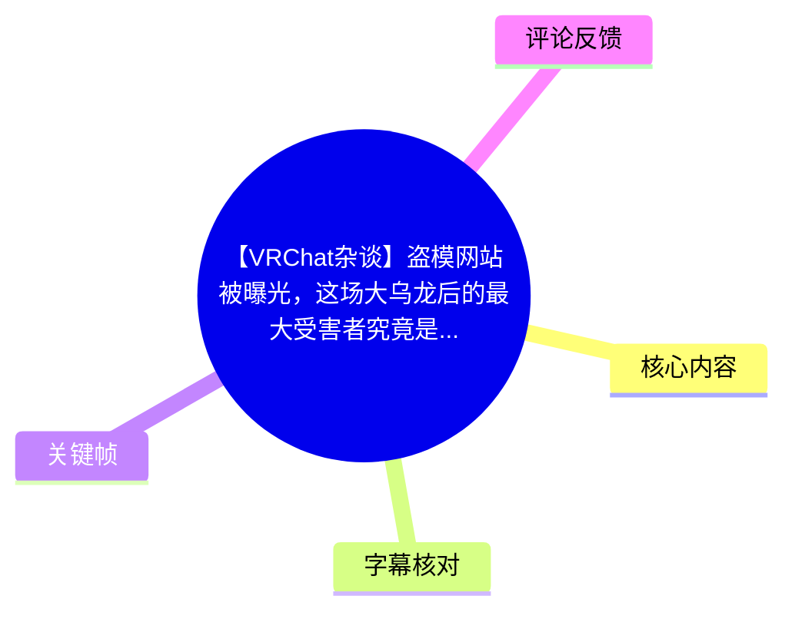
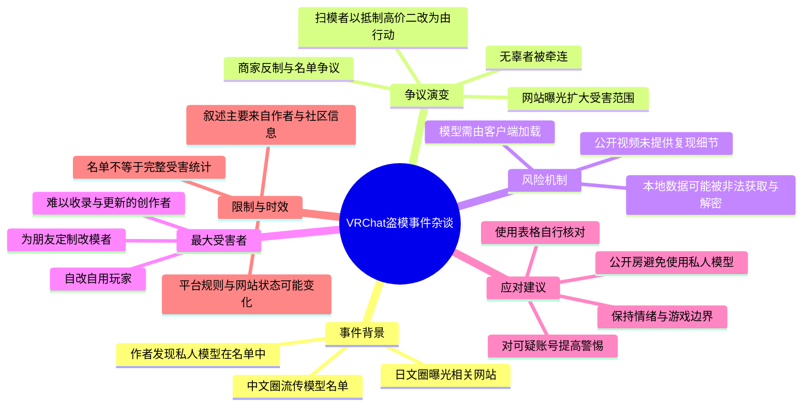
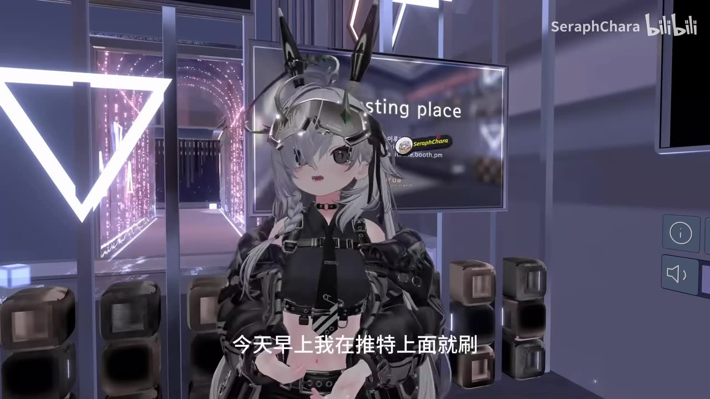
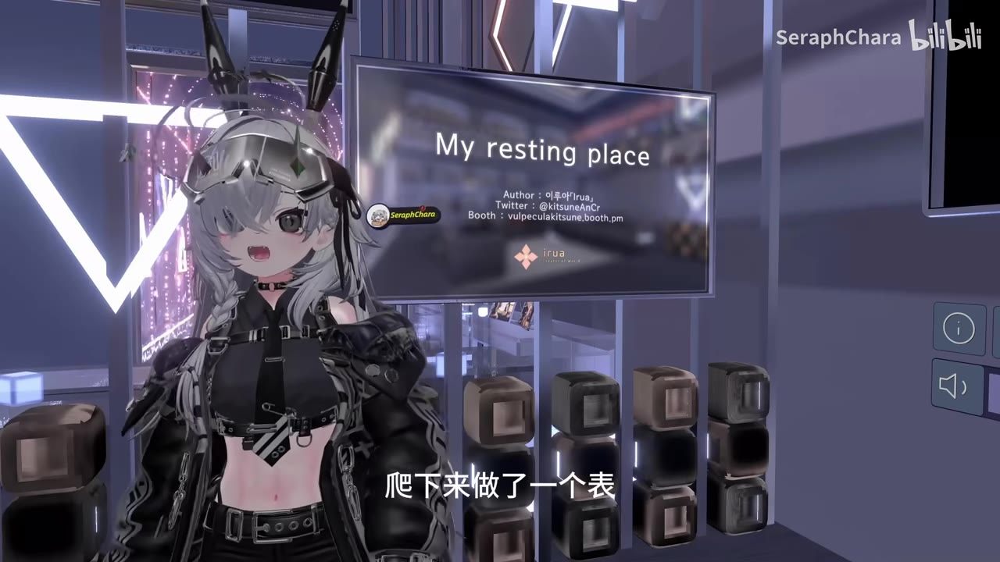
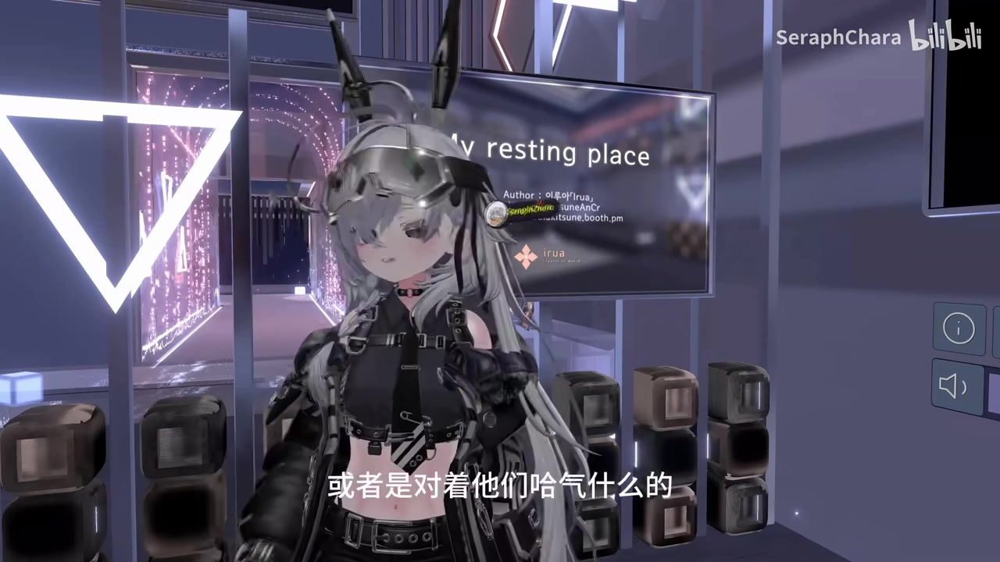
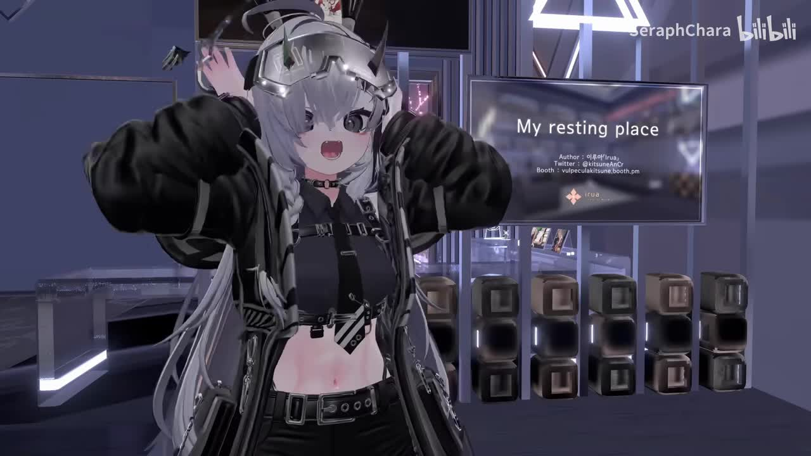

# 【VRChat杂谈】盗模网站被曝光，这场大乌龙后的最大受害者究竟是...

> 来源：[Bilibili 视频](https://www.bilibili.com/video/BV1Ec7v63E1K)  
> UP 主：SeraphChara｜时长：09:41｜标签：游戏杂谈、模型、VRChat、盗模  
> 信息抓取时间：2026-07-13。视频涉及的盗模网站、表格数据与社区事件均具有强时效性，应以当时素材为准。

## 小结

视频围绕 VRChat（VRC）社区一次盗模网站曝光及其引发的争议展开。作者称，日文圈已在社交平台曝光相关网站；中文圈则流传了一份从该网站相关数据整理而来的 Excel 名单。作者在名单中发现了自己的私人模型，由此将话题从“盗模玩家与模型商家的冲突”转向更广泛的自改自用、为朋友改模玩家所面临的风险。

作者回顾称，争端此前已持续一段时间：一部分人以抵制某市场中高价二改模型、维护原作者权益为理由，扫描并低价或免费传播模型；被影响的商家则反制、整理名单，过程中出现无辜者被挂、有人两边获利等问题。网站曝光后，名单显示受影响的并不只是商用成品模，也包括大量自改自用模型。

视频给出的核心技术判断是：VRChat 中可被其他客户端正常加载的模型，会以本地数据形式被客户端下载；攻击者若通过修改客户端等方式取得模型标识及相应数据、再进行解密，就可能获得模型内容。这里是作者对风险链路的概述，而非已由本视频独立验证的官方技术报告；视频没有提供工具、代码或可复现操作步骤。

作者认为，这场冲突中更难处理的受害者，是为朋友定制、修改模型的创作者或“改模者”：他们未必保有完整、便于迭代的工程管理条件，辛苦完成的定制成果被转走后，也更难重新收录、维护和更新。相较之下，自改自用者如果保有工程文件，更新与重建的空间相对更大。

实践上，作者建议在公开房、公开群组房及人员复杂的热门房间中避免使用私人模型；对于可疑账户保持警惕，但不建议将用户名格式直接等同于盗模证据。作者也建议受影响者调整情绪、不要让游戏事件过度影响生活，并在视频简介提供 Excel 表格以供自行核对。该表格描述为“VRChat Avatar 全量列表（19209 条）”，但评论中有人声称实际被盗数量更高；两类数字均不应直接视作经独立核验的全量统计。

## 思维导图

## 目录

- [事件背景与作者发现](#事件背景与作者发现)
- [冲突如何演变为“大乌龙”](#冲突如何演变为大乌龙)
- [视频所述盗模风险链路](#视频所述盗模风险链路)
- [最大受害者：自用与定制改模群体](#最大受害者自用与定制改模群体)
- [作者给出的防护与应对步骤](#作者给出的防护与应对步骤)
- [结论、限制与时效性](#结论限制与时效性)
- [字幕比对](#字幕比对)
- [评论分析](#评论分析)
- [处理记录](#处理记录)

## 事件背景与作者发现 [00:00](https://www.bilibili.com/video/BV1Ec7v63E1K?t=0)

作者以 VRChat 社区近期“盗模事件”开场，称该话题当时已在圈内引发较大讨论。其所述近期信息包括：

1. 作者在 Twitter/X 上看到日文圈已将一个盗模网站公开曝光。
2. 中文圈方面，有群友发出一份 Excel 表格信息。
3. 作者理解该表格可能由群友通过网络爬取等方式，从盗模网站相关数据中整理而来；这是作者的推测性表述，视频未展示其数据来源、抓取方法或验证过程。
4. 作者出于好奇查看名单，并发现自己的私人模型也在其中。

作者没有将个人模型被盗描述为完全出乎意料，理由是自己常在公开房与公开群组房活动；但网站页面中的 AI 评价让其感到“抽象”、哭笑不得。

> 图：画面字幕出现“今天早上我在推特上面就刷……”，对应作者提及日文圈曝光信息的开场阶段。该帧的价值在于确认视频是以作者口述评论为主，而非展示网站或表格的取证型视频。

### 名单规模与可核对范围

视频简介提供了一个名为“VRChat Avatar 全量列表（19209条）.xlsx”的文件链接与提取码，表明作者希望观众自行检查模型是否出现在名单内。依据现有素材，只能确认简介明确写有 **19209 条**这一文件标题信息，不能据此推断其覆盖了全部被盗模型、全部网站条目或全部受害者。

热评中另有用户称表格内约 1.9 万条、实际被盗数量“8 万以上”。这是评论者的未验证说法，与简介中的文件名不构成相互独立的全量统计证据，详见[评论分析](#评论分析)。

## 冲突如何演变为“大乌龙” [01:15](https://www.bilibili.com/video/BV1Ec7v63E1K?t=75)

作者将本次网站曝光放入一场更早开始的社区冲突中理解。按其叙述，大约在当年 3 月左右，部分“扫模”玩家开始以“维护原作者条约”“反对某市场上泛滥的高价二次改模”为名，针对部分模型进行扫描、传播或以极低价格再次出售。

作者所描述的冲突结构如下：

| 参与方/情形 | 作者所述行为或立场 | 视频指出的问题 |
| --- | --- | --- |
| 扫模玩家 | 以“正义”或反高价二改为理由，传播、低价出售或免费发放模型 | 手段本身可能伤及无关模型与普通玩家 |
| 某市场模型商家 | 因自身利益受影响而反制，整理扫模玩家名单等 | 反制过程中可能扩大牵连范围 |
| 无辜玩家 | 被列入名单、被挂出或卷入对立 | 并非争议直接参与者，却承受后果 |
| 两边获利者 | 作者称存在有人在冲突中“黑黑两边吃红利” | 加剧矛盾、模糊事实边界 |
| 自改自用与定制改模玩家 | 原本并非商用模型争端主体 | 网站曝光后发现自己的模型也可能在受害范围内 |

作者认为，冲突不断升级后，盗模网站的公开使问题显现：遭受影响的不只是被拿来售卖的成品模型，也包含大量自改自用模型。作者本人正是通过群友整理的表格才得知自己的模型被盗。

> 图：画面字幕为“爬下来做了一个表”，直观对应视频中“整理名单”的信息来源。该帧有助于区分：视频展示的是作者对表格来历的转述，并未展示表格内容、网站页面或数据验证过程。

### 对“官方为何未下场”的作者观点

作者提出，观众可能会问：事件持续已久、其他语言圈也知情，为什么 VRChat 官方仍未直接介入管理？

其回答并非引用官方公告，而是结合社区生态作出的个人解释：许多争议模型可能处于较灰色的交易或版权地带，例如在“某市场”销售的模型；作者不打算直接评价该市场售模行为，但认为这能帮助理解官方保持观望的原因。作者进一步推测，若被盗的是 VRChat 官方商店中可使用 VRC 点数购买的正版模型，官方可能会更快、更强力地介入。

这一段应明确视为作者的评论与推测，不能据此认定 VRChat 已制定或执行了“仅保护官方商店模型”的规则。

## 视频所述盗模风险链路 [03:05](https://www.bilibili.com/video/BV1Ec7v63E1K?t=185)

作者用通俗语言解释其理解中的风险来源：在 VRChat 中，只要其他用户能够正常加载你的模型，客户端为了显示该模型就需要取得相应资源。因此，模型可能会在本地文件中留下可被滥用的内容。

按视频陈述，风险链路可概括为：

1. 用户在 VRChat 中加载并展示模型。
2. 其他用户的客户端为呈现该模型而下载相应数据，并在本地保存。
3. 恶意者可能通过修改客户端等非正常方式，获取模型 ID 与对应数据文件。
4. 在获得并解密数据后，模型内容可能暴露在对方硬盘中。

> **安全说明**：以上仅忠实整理视频中的风险解释，不补充工具、客户端修改方式、文件位置、解密方法或操作细节。视频本身亦未提供可复现教程。模型创作者与玩家应遵循 VRChat 平台规则、当地法律及原作者授权条件，不应尝试提取、传播或交易他人资产。

### 关键限制：这是作者口述，不是独立技术审计

视频未展示以下材料：

- VRChat 的官方安全设计说明、平台回应或处罚记录；
- 被提及网站的实际页面与可验证样本；
- 模型 ID、数据文件或解密结果；
- 对“只要加载就一定会被盗”的量化概率说明；
- 任何防护措施在不同客户端、不同模型类型下的有效性测试。

因此，更严谨的表述应是：**作者提醒了“公开加载模型可能带来资源被非法提取”的风险，而非证明所有模型、所有房间、所有用户都会发生盗取。**

> 图：画面字幕提到“或者是对着他们哈气什么的”，对应作者表示自己虽觉得荒诞、但并未试图用愤怒反应处理事件的段落。该帧补充了视频的表达基调：风险提醒与情绪安抚并行。

## 最大受害者：自用与定制改模群体 [05:05](https://www.bilibili.com/video/BV1Ec7v63E1K?t=305)

作者的主要结论是：这场争端中，最大的受害者不是单一一方，而是广泛的普通玩家，尤其是以下两类人：

### 1. 自改自用玩家

作者自称也属于创作者，并表示若工程文件仍由本人掌握，模型被盗后的更新、重建或继续维护相对更方便。这里的“相对方便”并不等于没有损失：私人审美、改模劳动与个人使用边界依然可能被侵犯。

### 2. 为朋友定制改模的人

作者更强调为朋友修改模型的群体。其困难包括：

- 模型可能是根据特定朋友需求做出的非标准定制，后续不容易统一收录；
- 被盗后再继续修改、维护时心理负担更重；
- 辛苦完成的作品被他人直接拿走，会产生明显的不适感；
- 这些玩家往往不是商用争议中的直接参与者，却会被扫模、名单传播和网站聚合波及。

作者的判断不是“商用模型被盗就不值得保护”，而是指出：当社区冲突以大范围扫描、传播作为手段时，未参与商业纠纷的私人定制作品也会变成附带损失。

## 作者给出的防护与应对步骤 [06:10](https://www.bilibili.com/video/BV1Ec7v63E1K?t=370)

作者没有提出能够从根源上消除盗模风险的技术方案，给出的建议主要是使用场景管理、风险识别与情绪调节。

### 步骤一：区分公开环境与私人使用需求

作者建议，在以下情形中尽量不要使用自己的“私模”：

- 公开房；
- 群组公开房间；
- 人员复杂、流动性大的热门房间；
- 作者点名举例的咖啡厅、中文新手吧、中文吧等公开社交空间。

这是一种降低暴露面的行为建议，而不是绝对防护。只要模型需要向其他客户端加载，作者前述的风险逻辑仍然存在。

### 步骤二：对可疑账户提高警惕，但避免以貌取人

作者描述了一类其认为需要留意的账号特征：可能使用星号开头、后接随机字符串或特殊字符的名字，并在房间角落挂机；作者将其与未创建 VRC 账号、通过 Steam 登录后生成的名称形式联系起来。

但作者也说这来自其本人及多个朋友看到、听到的情况，而不是平台层面的身份鉴定规则。因此应避免做出以下错误推论：

- 名称带随机字符的账号必然是盗模者；
- 使用 Steam 登录的新玩家天然可疑；
- 处于角落挂机即可作为举报或公开指控的充分证据。

更稳妥的实践是：把异常账号特征视为提高隐私意识的信号，而非对个人定罪的证据；需要举报时应遵循平台机制，并保留合法、必要的证据。

> 图：该帧展示作者在固定 VRChat 场景中面对镜头说明。视频未穿插网站后台、文件操作或攻击演示，因此使用人物讲述帧能够如实反映素材形式，避免将并未出现的“技术证据画面”误写为视频内容。

### 步骤三：用名单进行有限核对

作者称会将群友整理的表格放到视频简介，供观众自行检查模型是否“中招”。执行时应注意：

1. 表格出现某模型名称，不自动等于已完成完整事实核验。
2. 表格未出现某模型，也不自动证明模型未被获取、传播或收录。
3. 不要因名单结果对具体玩家、作者或商家实施网暴、骚扰或无证据指控。
4. 若发现疑似侵权传播，应优先保存页面信息、原始授权凭据与作品归属证据，并使用平台正式投诉、申诉或法律咨询渠道。

### 步骤四：避免让事件侵蚀生活

作者给出的最后建议是“放平心态”：游戏的目的在于享受，不必让盗模事件持续破坏现实生活中的情绪。对于双方争端，普通玩家可以保持观察，而不是被卷入对立；作者希望事件以较和平的方式结束。

## 结论、限制与时效性 [08:30](https://www.bilibili.com/video/BV1Ec7v63E1K?t=510)

### 可迁移的经验

- **公开展示不等于绝对私密。** 在多人在线内容环境中，任何需要下发至他人客户端的资源都应被视作存在暴露风险。
- **“反盗版”或“反高价”的立场不能自动正当化侵权手段。** 作者所说的“大乌龙”正体现了扩大化行动可能伤及不相干的自用与定制作品。
- **保护策略首先是暴露面管理。** 在公开、陌生、流动性强的环境中使用通用或公开模型，是作者给出的可立即执行的建议。
- **名单是排查线索，不是完整裁决。** 文件规模、来源、去重方式、更新日期和覆盖范围均不明时，不应将其当作完整受害统计或公开指控依据。
- **留存工程文件仍有价值。** 作者以自身经验说明，持有工程文件的一方，在持续维护、更新与重建上通常拥有更多主动性。

### 视频未能解决的问题

- 盗模网站的名称、网址、运营主体和当前可访问状态未在提供素材中明确。
- Excel 表格的采集方法、数据字段、去重规则、更新时间和准确率未被展示。
- VRChat 官方是否知情、是否处理及具体规则为何，视频没有提供官方来源。
- 公开房不用私模只能降低风险，不能被理解为完整的技术防护方案。
- 作者提及的可疑账号命名特征缺乏可验证的统计依据，不能据此识别或指认个人。

### 时效性说明

本视频元数据发布时间为 2026-06-25，素材抓取于 2026-07-13。相关网站、表格链接、社区舆论、VRChat 客户端机制及平台规则可能在此后变化。本文仅整理该时间点的公开视频、简介、ASR 与前三条可获取热评，不对后续状态作延伸判断。

## 字幕比对 [08:55](https://www.bilibili.com/video/BV1Ec7v63E1K?t=535)

本次任务中**站内字幕与视频主题明显不匹配**：站内字幕内容讨论山姆、沃尔玛、烘焙食品、配料表与枕头等，与本视频标题、画面和 ASR 中的 VRChat 盗模话题完全无关。因此，站内字幕不能作为本视频内容依据。

| 字幕来源 | 完整性 | 专有名词 | 时间轴 | 主要问题 |
| --- | --- | --- | --- | --- |
| Bilibili 站内字幕 | 与本视频内容不匹配，不能用于正文 | 出现山姆、沃尔玛、陈皮红豆沙等无关词 | 提供文本但未提供可用分段时间信息 | 疑似错误关联至其他视频的字幕，主题完全错位 |
| 本次 ASR 字幕 | 覆盖从开场、事件背景、风险解释到结尾建议的主要口述内容 | 可识别 VRC、VRChat、Twitter、Steam、VRC+、Excel、Patreon 等，但个别词存在识别歧义 | 未提供逐句精确时间戳；本文按视频叙事顺序设置近似章节定位 | 存在口语重复、断句不稳及“扫模/盗模”“私模”等同音或错字现象 |

### 最终字幕选择

正文以**本次 ASR 字幕为主**，并结合以下信息校正：

- 视频标题中的“VRChat”“盗模网站”“大乌龙”；
- UP 主简介中“Excel 表格名单：VRChat Avatar 全量列表（19209条）.xlsx”；
- 关键帧中作者在 VRChat 场景内口述的画面与可见字幕；
- ASR 上下文中连续出现的 VRC、模型、公开房、Steam 登录、Excel 表格等主题词。

未采用站内字幕中的任何沃尔玛、山姆或食品内容。由于没有逐词时间码，章节中的时间轴链接用于快速定位相应叙事段落，属于依据全片 581 秒时长和内容顺序整理的近似定位，不应视作逐句字幕时间戳。

## 评论分析 [09:15](https://www.bilibili.com/video/BV1Ec7v63E1K?t=555)

仅处理当前可获取的热评前三条。评论是用户观点与个人经历，不等同于已验证事实。

### 1. 安德柳莎_尤丁采夫｜4 赞

> “我真没招了。当时我拿一个搜索插件搜了一下，发现我模型也被盗了……对，BVVD被偷了。”

- **核心观点**：评论者称自己借助搜索插件发现模型疑似被盗，并表达无奈。
- **补充信息**：提到“BVVD”这一模型或名称，但评论未给出对应页面、搜索结果或权属证明。
- **可信度与限制**：可作为“观众也在自行排查”的个案反馈；无法仅凭评论验证模型是否确实被盗、在哪个平台出现、是否为同名或授权版本。

### 2. 跃水霖灵｜32 赞

> “前排提示，表格内有1.9w模型列表，实际有8w以上被盗，可以说几乎无一幸免，盗模的真该死啊。”

- **核心观点**：评论者提示表格约有 1.9 万模型条目，并声称实际被盗数量超过 8 万。
- **补充信息**：其中“1.9w”与简介“19209条”的文件名大体接近，说明评论者可能在讨论同一份表格。
- **可信度与限制**：超过 8 万、几乎无一幸免均未附数据来源、统计口径或证据，不能作为本文确认的事实；情绪化谴责表达了社区愤怒，但不构成规模证明。

### 3. 越谷202｜49 赞

> “盗模也有那种一进来就隐身开着VRc+的还是橙名紫名的都有，不只是开小号那么简单……表格上呈现的大多数都是成品模，都拿出来卖了还担心被盗就……这游戏被这么一群人搞得乌烟瘴气，但愿有个有能力的大手子能够制裁吧”

- **核心观点**：评论者认为可疑者不只使用小号，也可能使用隐身、VRC+ 或不同信任等级身份；同时认为表格中多数是成品模型，并期待有人制止盗模。
- **补充信息**：提出“并非只靠小号”的观察，补充了视频中对特定账号名特征的有限描述。
- **可信度与限制**：VRC+、颜色等级、隐身状态均不能单独证明盗模行为；“大多数都是成品模”的比例亦未提供表格分析或统计过程。该评论反映对身份识别标签不可靠的担忧，但不能据此建立判定规则。

## 评论分析

本次流程未获取到可用热评，因此不推断观众态度或额外结论。

## 处理记录

- **Worker ID**：worker-mrj0www4-e8d79408
- **模型**：gpt-5.6-terra
- **素材与工具输出**：使用任务提供的元数据、视频素材清单、12 张关键帧路径、站内字幕文本、本次 ASR 字幕文本、视频简介及可获取热评前三条；未获得可验证的网站页面、Excel 文件内容或官方声明。
- **字幕选择**：本次 ASR 已执行并作为正文主字幕来源。站内字幕被判定为严重错配：其内容为沃尔玛/山姆食品探店，与 VRChat 盗模主题无关，故不采纳。
- **关键帧依据**：选用 `frames/frame-001.jpg`、`frames/frame-002.jpg`、`frames/frame-003.jpg`、`frames/frame-004.jpg`。这些画面均为作者在 VRChat 场景中的口述镜头，适合说明视频形式、开场曝光信息、Excel 名单叙述与作者态度；素材未提供网站、表格、客户端操作或盗模证据画面，因此未将人物镜头误述为技术实证。
- **时间轴依据**：ASR 未提供逐句时间码；正文链接依据 581 秒总时长、ASR 内容顺序及叙事段落进行近似定位。
- **评论处理范围**：严格限定为提供素材中可获取的热评前三条；未扩展分析其他评论。
- **缓存清理**：未在本轮对话中执行本地缓存写入、下载或删除操作；无可报告的缓存残留清理结果。
- **未解决问题**：盗模网站实际状态、表格来源与完整性、受害模型真实总数、VRChat 官方处置情况、特定账号特征与盗模行为之间的关联，均缺乏本素材内可独立验证的证据。
