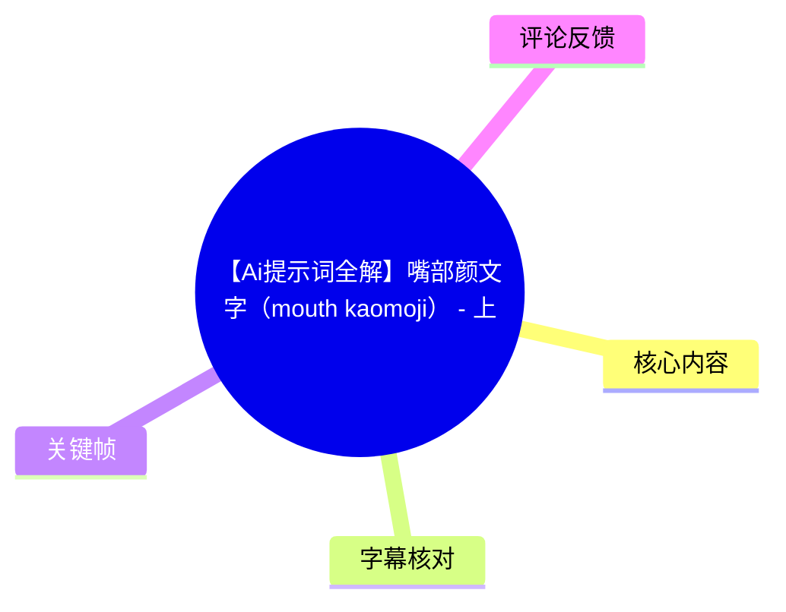
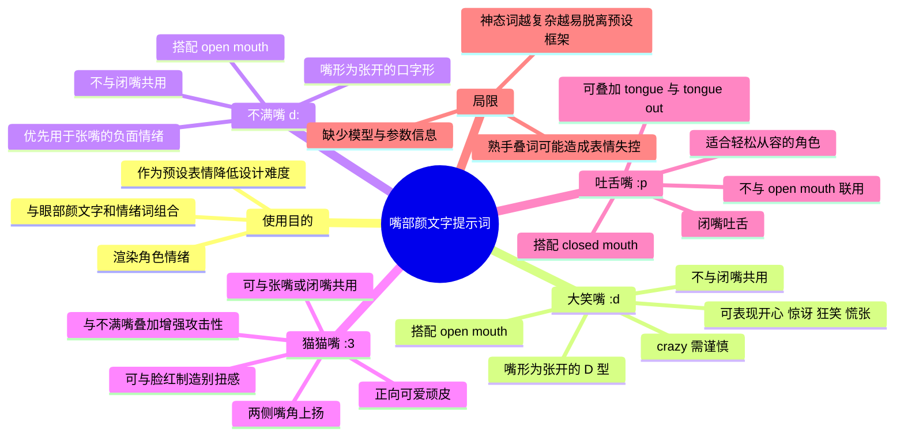
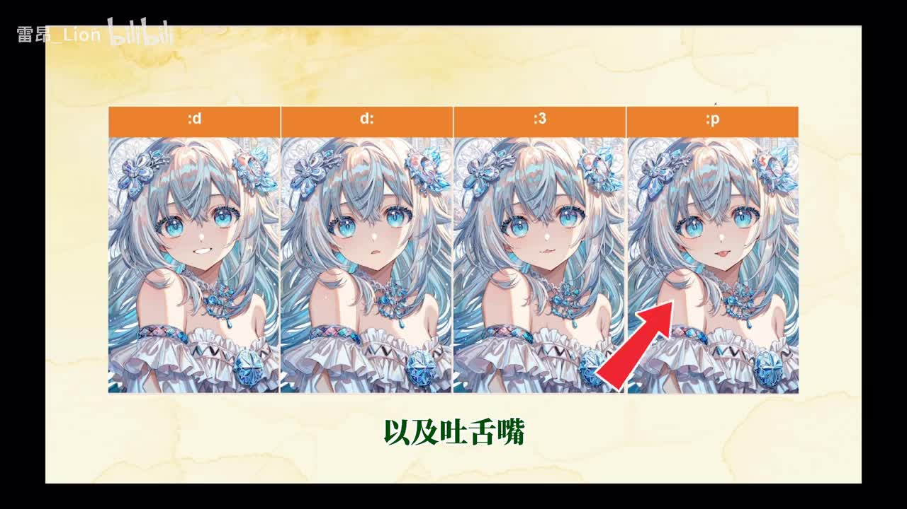
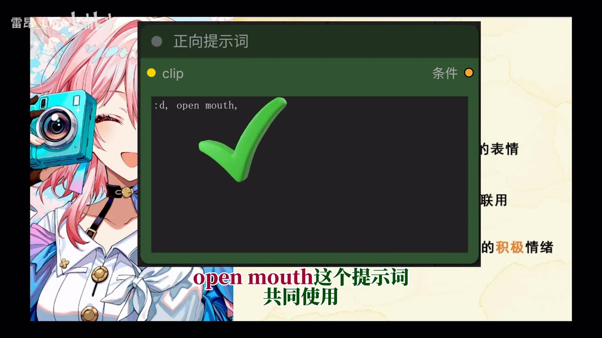
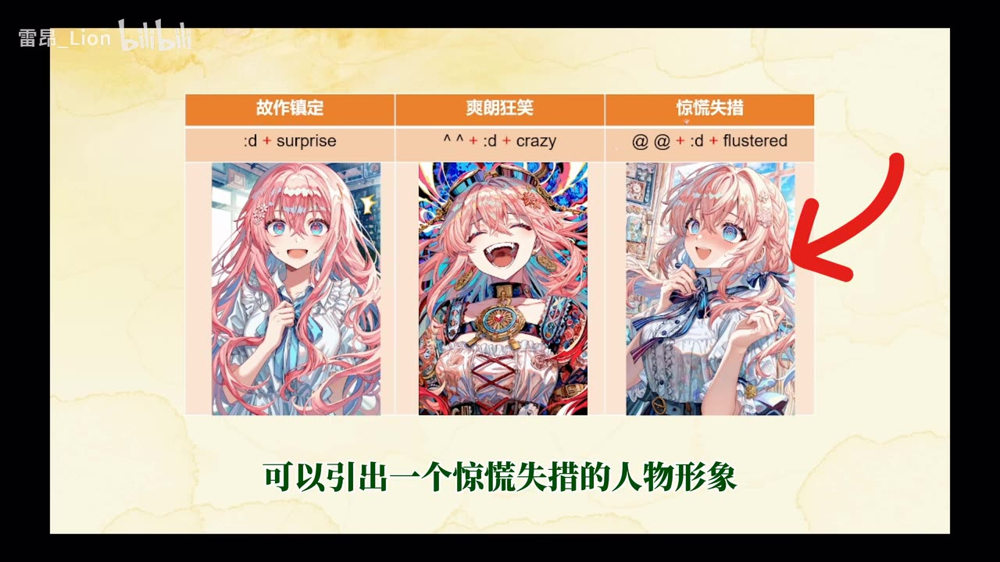
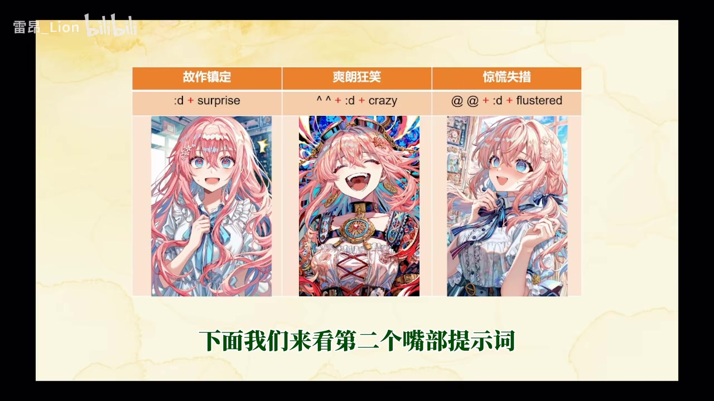

# 【Ai提示词全解】嘴部颜文字（mouth kaomoji） - 上

> 来源：[Bilibili 视频](https://www.bilibili.com/video/BV1zqj46SE7v)  
> UP 主：雷昂_Lion｜合集：AIcode｜时长：7 分 45 秒｜画面：3840×2160  
> 标签：AI、Ai提示词、`:d`、`d:`、颜文字、`:3`、`:p`、webui、comfy

## 小结

本期聚焦 AI 绘图提示词中的“嘴部颜文字（mouth kaomoji）”，讲解四种预设嘴形：大笑嘴 `:d`、不满嘴 `d:`、猫猫嘴 `:3` 与吐舌嘴 `:p`。视频的核心不是把颜文字当作单独情绪词使用，而是将其视为控制嘴部形状、再与开闭嘴状态、眼部颜文字和情绪词共同组合的结构化工具。

大笑嘴 `:d` 的关键约束是搭配 `open mouth`（张嘴），不能与闭嘴共用。它默认对应开心或兴奋，但只要嘴形仍为张开的 “D” 型，也可以配合 `surprise`、`crazy`、`flustered` 等词表达故作震惊、狂笑或惊慌。UP 主特别提醒：`crazy` 对组合要求严格，提示词搭配稍有不当就可能令人物表情明显夸张、扭曲。

不满嘴 `d:` 同样要求张嘴，倾向表达失望、吃惊、害怕、昏沉等负面情绪。视频给出的经验判断是：当角色需要“张嘴且负面”时，不满嘴应优先考虑；即便与 `serious` 搭配能产生较正气的观感，也未必是该场景中最合适的嘴形选择。

猫猫嘴 `:3` 的基础特征是两侧嘴角上扬、近似“3”形。它主要控制嘴角，因此既可与 `open mouth` 搭配，也可与闭嘴搭配，视频没有给出它与开闭嘴状态之间的禁忌。除顽皮、兴奋等正向气质外，`blush`（脸红）可与猫猫嘴制造“想做某事但不自信”的别扭感；猫猫嘴与不满嘴、狂怒组合时，则会明显增强角色的攻击性和负面强度。

吐舌嘴 `:p` 描述的是舌头自然伸出、下垂的状态。其核心限制与前两类相反：应与闭嘴共用，不能与张嘴联用；还可叠加“舌头”“吐出舌头”等动作词强化。视频认为吐舌既可爱，也常带挑衅、玩世不恭意味；它更适合人物处于轻松、游刃有余的状态，紧张感一旦增强，模型往往难以自然生成这一表情。

这套方法适合使用 WebUI、ComfyUI 等提示词式 AI 绘图工作流、且需要精细控制二次元人物神态的创作者。需要注意，视频提供的是 UP 主的出图经验与示例观察，并未给出具体模型、采样器、权重、CFG、分辨率、负面提示词或可复现实验参数；不同底模和版本中的实际效果可能变化。视频发布于 2026 年，提示词对特定模型的适配性仍需以当前工作流实测为准。

## 思维导图





## 目录

- [视频定位与四类嘴部颜文字](#视频定位与四类嘴部颜文字-0040)
- [大笑嘴 `:d`：张嘴、D 型嘴形与疯狂词风险](#大笑嘴-d张嘴d-型嘴形与疯狂词风险-0041)
- [不满嘴 `d:`：负面张嘴表情的优先选择](#不满嘴-d负面张嘴表情的优先选择-0218)
- [猫猫嘴 `:3`：嘴角控制与情绪增幅](#猫猫嘴-3嘴角控制与情绪增幅-0330)
- [吐舌嘴 `:p`：闭嘴约束与从容感](#吐舌嘴-p闭嘴约束与从容感-0531)
- [组合方法、适用边界与实践清单](#组合方法适用边界与实践清单-0645)
- [关键帧索引](#关键帧索引)
- [字幕比对](#字幕比对)
- [评论分析](#评论分析)
- [处理记录](#处理记录)

## [视频定位与四类嘴部颜文字 [00:40]](https://www.bilibili.com/video/BV1zqj46SE7v?t=40)

ASR 从 00:40.720 起检测到连续语音；UP 主在开场说明本节讨论“嘴部颜文字在 AI 出图中的应用”，范围限定为前四种类型：大笑嘴、不满嘴、猫猫嘴和吐舌嘴。视频标题中的“上”也表明这不是完整的嘴部神态词总表，而是该主题的前半部分内容。

画面以同一角色在不同嘴形下的对照为主。根据关键帧中的文字标注，可将四个颜文字与视频术语对应为：

| 视频术语 | 颜文字 / 提示词写法 | 画面特征 | 视频中的定位 |
| --- | --- | --- | --- |
| 大笑嘴 | `:d` | 嘴部张开，近似 D 型 | 张嘴情绪基础，常用于开心或兴奋 |
| 不满嘴 | `d:` | 嘴部张开，近似口字形 | 偏消极的张嘴表情 |
| 猫猫嘴 | `:3` | 两侧嘴角上扬、近似“3”形 | 顽皮、兴奋，也可扩展至复杂情绪 |
| 吐舌嘴 | `:p` | 伸舌、舌头下垂 | 闭嘴吐舌，兼具可爱与冒犯感 |



> 图：关键帧并列展示 `:d`、`d:`、`:3`、`:p` 四种嘴部颜文字及其生成效果，其中箭头指向吐舌嘴。这张图的价值在于直接呈现本期的分类范围，并帮助区分“嘴形控制”与泛泛的情绪描述。

## [大笑嘴 `:d`：张嘴、D 型嘴形与疯狂词风险 [00:41]](https://www.bilibili.com/video/BV1zqj46SE7v?t=41)

### 定义与硬性搭配

大笑嘴被描述为：嘴部张开、形成近似 “D” 型的一类表情。它常用于开心、兴奋等积极情绪，但分类依据首先是**嘴部形状**，并非角色情绪是否正向。

视频明确给出以下提示词关系：

| 目标 | 推荐组合 | 不应组合 | 原因 |
| --- | --- | --- | --- |
| 生成大笑嘴 | `:d, open mouth` | `:d` 与闭嘴 | 放声大笑依赖张嘴，`open mouth` 是必要搭配 |
| 控制积极大笑 | `:d` + 正向情绪词 | — | 可强化开心、兴奋感 |
| 扩展为非常规情绪 | `:d` + 对应眼部/情绪词 | — | 嘴形仍为 D 型时，仍属于大笑嘴范畴 |



> 图：关键帧中的正向提示词输入框写有 `:d, open mouth,`，并以勾选标志强调联用关系。它为“`:d` 需要张嘴”这一关键限制提供了直观画面证据。

### 不止“开心”：三种组合示例

UP 主用三张示例图说明，大笑嘴不必局限于常规快乐表情：

| 组合 | 视频描述的结果 | 说明 |
| --- | --- | --- |
| `:d + surprise` | 故作镇定 / 故作镇定式的震惊人物形象 | 文字与画面所表达的重点是“震惊感”，但嘴形仍是张开的 D 型 |
| `^^ + :d + crazy` | 爽朗狂笑的人物形象 | 微笑眼与大笑嘴共同强化狂笑状态 |
| `@@ + :d + flustered` | 惊慌失措的人物形象 | 圈圈眼、张嘴与慌张词形成失措感 |



> 图：关键帧以三栏对照列出“故作镇定”“爽朗狂笑”“惊慌失措”，可读到组合 `:d + surprise`、`^^ + :d + crazy`、`@@ + :d + flustered`。该图说明颜文字的分类依据是嘴形，而最终情绪取决于眼部与情绪词的组合。

### `crazy` 的风险

视频特别提出：应慎用 `crazy`。这是一个对整体提示词配置“特别严格”的情绪词；只要组合略有不匹配，就可能让人物的神态异常夸张、扭曲。

这项提醒是视频中的经验结论，而非对所有模型都成立的通用规则。实际使用时，可先以较少神态词测试 `:d + crazy` 的基础表现，再逐步加入眼部颜文字、动作和场景词，避免在无法定位问题的情况下叠加多种高强度情绪描述。

## [不满嘴 `d:`：负面张嘴表情的优先选择 [02:18]](https://www.bilibili.com/video/BV1zqj46SE7v?t=138)

### 嘴形、情绪倾向与开闭嘴限制

不满嘴被定义为：嘴巴张开、呈口字形的一种嘴部表情。视频将它主要归入表达失望或吃惊等消极情绪的工具；此前的相关内容中，UP 主曾用它生成龇牙怒火式的愤怒表情。

其搭配规则与大笑嘴一致：

- 应与 `open mouth`（张嘴）联用；
- 不可与闭嘴共同使用；
- 当人物嘴巴已经需要呈口字形时，可以使用不满嘴；
- 它整体带有消极情绪底色。

### 视频列举的组合效果

| 组合 | 视频描述的角色形象 | 情绪方向 |
| --- | --- | --- |
| 不满嘴 + 严肃 | 正气凛然 | 视觉上较正，但仍使用了偏负面的嘴部基础 |
| 不满嘴 + 害怕 | 战战兢兢 | 负向、紧张 |
| 不满嘴 + 暗醉 / 昏沉类情绪 | 昏昏沉沉 | 低能量、消极 |

UP 主同时补充：虽然“不满嘴 + 严肃”可呈现较正气的效果，但若目标是正气凛然的人物，使用 O 型嘴可能比不满嘴更合适；O 型嘴的具体内容会在后续小节讨论，本期没有展开其提示词写法和参数。

### 选词决策

视频给出的明确优先级可以整理为：

1. 先判断角色是否需要**张嘴**；
2. 若需要张嘴，再判断整体是否是**负面情绪**；
3. 同时满足“张嘴 + 负面”时，优先尝试不满嘴；
4. 若角色并非负面，或需要更中性、端正的张嘴观感，则不满嘴未必是最佳选择。

此处的“不满嘴优先”只针对视频所述的角色神态设计，不等于它是所有负面画面的唯一或绝对最佳方案。

## [猫猫嘴 `:3`：嘴角控制与情绪增幅 [03:30]](https://www.bilibili.com/video/BV1zqj46SE7v?t=210)

### 基础形态：控制上扬嘴角

猫猫嘴的视觉特点是两侧嘴角上扬，形成近似“3”字形的嘴部表现。UP 主将它与此前讲过的猫眼、猫脸、猫口等“猫系”提示联系起来：猫系元素通常对应兴奋、调皮、激动等积极形象。

其与前两类最大的结构差异是：猫猫嘴的主要作用是控制**嘴角上扬**，不直接规定嘴巴必须张开或闭合。因此：

| 项目 | 猫猫嘴 `:3` 的规则 |
| --- | --- |
| 张嘴 | 可以搭配 |
| 闭嘴 | 可以搭配 |
| 禁忌词 | 视频明确称“没有所谓的禁忌词” |
| 基础情绪 | 顽皮、兴奋、喜悦 |
| 控制重点 | 嘴角的上扬方向 |

### 从可爱到尴尬、愤怒

视频指出，猫猫嘴不只适用于快乐情绪，还能通过其他词转为更复杂的状态：

| 组合 | 视频描述的效果 |
| --- | --- |
| 猫猫嘴 + 尴尬 | 羞愧万分 |
| 猫猫嘴 + 害羞 | 扭扭捏捏 |
| 猫猫嘴 + 不满嘴 + 狂怒 | 怒不可遏 |

基于 UP 主的日常出图经验，`blush`（脸红）与猫猫嘴配合时，能制造“想要做些什么、但并不自信”的扭曲或别扭感。这里“扭曲感”指角色心理气质的矛盾感，而不必然是指五官生成错误。

### 与不满嘴叠加的情绪放大

UP 主强调，猫猫嘴与不满嘴共同使用时，能大幅增强负面情绪，并形成特别强的攻击性；单独使用二者中的任意一个，难以达到同等强度。



> 图：关键帧保留了大笑嘴的三组对照示例，并出现“下面我们来看第二个嘴部提示词”的转场文字。它的价值在于标识视频由第一种嘴形转入后续分类的叙述节点，也提示各类提示词以对照图而非参数面板为主要讲解方式。

实践上，这类叠加应从低复杂度开始：先确认单独的 `:3` 或不满嘴是否稳定，再加入狂怒、脸红等会显著改变神态的词。视频没有提供可量化的强度权重，因此不能据此断言某一组合在所有模型中都会稳定增强攻击性。

## [吐舌嘴 `:p`：闭嘴约束与从容感 [05:31]](https://www.bilibili.com/video/BV1zqj46SE7v?t=331)

### 定义与提示词约束

吐舌嘴描述的是一种现象：舌头自然伸出并垂下。UP 主认为它相对前几类更容易理解，需要关注的规则也较少，但它有明确的开闭嘴限制：

| 目标 | 建议做法 | 避免做法 |
| --- | --- | --- |
| 生成吐舌嘴 | `:p` 与闭嘴相关提示词联用 | 与 `open mouth` 联用 |
| 强化吐舌动作 | 叠加“舌头”与“吐出舌头”类动作词 | — |
| 表达角色气质 | 结合高兴、无趣、认真等情绪词 | 忽略角色是否紧张 |

视频的表述为：吐舌嘴是“双嘴紧闭吐出舌头”的提示，因此适合与闭嘴共用、不能与张嘴联用。英文动作词在 ASR 中未被稳定识别，正文保留为“舌头”“吐出舌头”的语义描述，不擅自补充视频未明确给出的具体英文拼写。

### 可爱、冒犯与心理状态

吐舌不只有可爱含义，也常呈现冒犯、玩世不恭的心态。视频列举了三种结果：

| 组合 | 视频描述的角色形象 |
| --- | --- |
| 微笑眼 + 吐舌嘴 + 高兴 | 开朗活泼 |
| 吐舌嘴 + 无趣 | 兴致寥寥 |
| 吐舌嘴 + 认真 | 从容不迫 |

UP 主进一步把吐舌概括为一种“极端的正向表情”：只有人物足够游刃有余时，吐舌才显得自然；人物情绪稍有紧张，模型就可能无法把舌头正常生成出来。这里的“极端正向”应理解为其对放松、自信或余裕状态的高度依赖，而不是说它只能服务于高兴情绪——视频本身也举出了“无趣”和“认真”的组合。


> 图：该总览帧中，`:p` 栏的人物伸出舌头，红色箭头突出嘴部区域。它能帮助理解吐舌嘴与普通“张嘴”不同：重点是闭合嘴唇之间伸出的舌头，而不是单纯扩大口腔开口。

## [组合方法、适用边界与实践清单 [06:45]](https://www.bilibili.com/video/BV1zqj46SE7v?t=405)

### 视频总结的两类使用场景

视频在结尾将颜文字的使用场景归纳为两种：

1. **搭配情绪词**：辅助渲染人物情绪；
2. **作为预设表情词**：降低神态设计难度。

其中，眼部颜文字 + 嘴部颜文字 + 情绪词，是视频认为最常见的颜文字出图方式。可抽象为：

```text
眼部颜文字 + 嘴部颜文字 + 情绪词
```

例如，视频中出现的组合包括：

```text
^^ + :d + crazy
@@ + :d + flustered
猫猫嘴 + 不满嘴 + 狂怒
微笑眼 + 吐舌嘴 + 高兴
```

这些组合用于说明结构关系与预期方向，不应被视为跨模型、跨版本均可原样复现的“固定配方”。

### 按需求选词的实操流程

结合视频逐段说明，可按以下顺序组织提示词：

1. **先确定嘴部物理状态**
   - 想要大笑或不满口字形：选择张嘴路线；
   - 想要吐舌：选择闭嘴路线；
   - 想主要控制上扬嘴角：可优先考虑猫猫嘴。

2. **检查开闭嘴冲突**
   - 大笑嘴 `:d`：与 `open mouth` 联用，不与闭嘴共用；
   - 不满嘴 `d:`：与 `open mouth` 联用，不与闭嘴共用；
   - 猫猫嘴 `:3`：可搭配张嘴或闭嘴；
   - 吐舌嘴 `:p`：与闭嘴联用，不与 `open mouth` 联用。

3. **再添加眼部与情绪层**
   - 大笑嘴可扩展至惊讶、狂笑、慌张；
   - 不满嘴优先服务负面张嘴角色；
   - 猫猫嘴可从开心扩展至害羞、尴尬，或与不满嘴制造攻击性；
   - 吐舌嘴要避免与紧张、局促的人物状态产生明显冲突。

4. **逐层验证高风险词**
   - 对 `crazy`、狂怒等高强度情绪词，先小范围试验；
   - 不要在基础嘴形尚不稳定时，同时堆叠多个眼部、嘴部和情绪词；
   - 若出现神态夸张或扭曲，应优先减少情绪叠词，而非盲目继续增加描述。

### 为什么“新手容易成功，熟手反而炸”

视频提出一个经验观察：随着神态词逐渐完善，表情会越来越复杂，并脱离预设的简单表情框架；这也是“颜文字新手一用就能成、熟手一用反而炸”的主要原因。

这句话可理解为：预设颜文字在低复杂度组合中能有效收束表情，但当创作者加入太多精细神态要求时，各词之间会产生更复杂的竞争。该结论是视频作者的创作经验，不等于模型机制已经被严格证明。

### 信息缺口与时效性

本期未提供以下会显著影响复现结果的信息：

- 使用的具体基础模型、版本与模型训练数据；
- WebUI 或 ComfyUI 的具体节点、工作流文件；
- 采样器、采样步数、CFG、种子、分辨率；
- 颜文字的权重写法、负面提示词与 LoRA 配置；
- 每组案例是否保持相同角色、场景和随机种子；
- O 型嘴的具体词形与适用条件。

因此，本文只能严谨整理视频中的词义、组合关系和经验判断，不能把示例图推导为确定的模型参数规则。AI 绘图模型、标签解释和提示词响应会随模型版本、微调模型及工作流变化而变化，实际项目应以当前环境测试结果为准。

## [关键帧索引](https://www.bilibili.com/video/BV1zqj46SE7v?t=40)

| 关键帧 | 正文用途 | 画面价值 |
| --- | --- | --- |
|  | 视频定位、吐舌嘴说明 | 并列展示 `:d`、`d:`、`:3`、`:p` 的角色效果，建立分类视觉基准。 |
|  | 大笑嘴规则 | 提示词面板清晰呈现 `:d, open mouth`，直接支撑联用关系。 |
|  | 大笑嘴扩展案例 | 三栏案例给出 `surprise`、`crazy`、`flustered` 的组合与对应人物表情。 |
|  | 章节转场 | 保留第一类案例及“第二个嘴部提示词”的转场信息，帮助定位讲解结构。 |

其余关键帧路径已在素材中提供，但本次正文优先选用文字可辨、能直接佐证提示词关系与分类对照的画面，避免对未在现有画面描述中确认的内容作推断。

## [字幕比对](https://www.bilibili.com/video/BV1zqj46SE7v?t=40)

| 字幕来源 | 完整性 | 专有名词 | 时间轴 | 主要问题 |
| --- | --- | --- | --- | --- |
| Bilibili 站内字幕 | 未提供可用字幕，无法比较文本完整性 | 无法核验 | 无可用时间轴 | 素材明确标注“未提供可用站内字幕”。 |
| 本次 ASR 字幕 | 较高：19 段，语音覆盖约 423.45 秒，占全片约 91.12% | 存在多处同音/错字，英文词识别不稳定 | 可用：有逐段 SRT 起止时间 | 开头内容被异常压入极短首段；“大笑嘴/不满嘴/猫猫嘴/吐舌嘴”等多处误识；部分情绪词与动作词音近错误。 |

### 最终字幕选择与校正原则

最终以**本次 ASR 的带时间戳 SRT**作为时间轴依据，因为没有可用的站内字幕。ASR 诊断显示：

- 识别语言：中文；
- 语言置信度：0.9995；
- 音频时长：464.70 秒；
- 首段语音：00:40.720；
- 末段语音：07:44.230；
- 未标记 `noAudioStream=true`，说明源视频存在音轨；本次 ASR 不是无音轨情况下的替代失败处理；
- 未报告大间隙，语音覆盖诊断正常。

正文对术语进行了基于标题、标签、关键帧可见文字及语境的审慎校正，主要包括：

| ASR 原文中的不稳定写法 | 正文采用写法 | 校正依据 |
| --- | --- | --- |
| 大啸嘴 / 大笑咀 / 大笑口 | 大笑嘴 `:d` | 视频标题主题、关键帧 `:d` 标注、上下文均指向嘴部颜文字。 |
| 不滤嘴 / 不滞嘴 / 不满嘴 | 不满嘴 `d:` | 开场分类、关键帧 `d:` 标注与语义对应。 |
| 猫毛嘴 / 猫宝嘴 / 猫咪嘴 | 猫猫嘴 `:3` | 视频标题后的分类语境与关键帧 `:3` 标注。 |
| 吐蛇嘴 / 吐唾嘴 / 吐咤嘴 | 吐舌嘴 `:p` | 关键帧 `:p` 和“舌头伸出、垂下”的连续语义。 |
| 出途 | 出图 | AI 绘图语境中的高频词，且全文均围绕生成图像。 |
| 地字形 | D 型 | 关键帧中的 `:d` 与“张开嘴”语义；“地字形”为 ASR 对字母/口述形状的误识可能。 |
| 暗醉 | 昏沉类情绪 | 音频语义指向“昏昏沉沉”，但具体原词无法仅凭 ASR 确证，故不擅自补成确定英文提示词。 |

上述校正仅用于提高可读性与术语一致性；对无法由关键帧或上下文可靠确认的英文具体拼写，本文保留语义描述，不将其伪装为视频已明确展示的精确参数。

## [评论分析](https://www.bilibili.com/video/BV1zqj46SE7v?t=405)

仅处理当前可获取的热评前三条。评论反映观众体验与需求，不作为提示词效果的已验证事实。

| 热评 | 点赞 | 观点与补充 | 可信度与可用性 |
| --- | ---: | --- | --- |
| Cinder_gamma-exe：“颜文字是极好的:q” | 27 | 对颜文字方法表达简短肯定，并以 `:q` 形式进行玩笑式呼应。 | 仅是态度性反馈，未提供可复现的提示词经验。 |
| 孑取：希望 UP 多讲表情，并列举 `ahego, tongue out, wince, bulsh, shy` | 2 | 提出后续选题需求，涉及吐舌、痛苦表情、脸红、害羞等神态词。 | 是观众请求而非视频已覆盖内容；其中 `bulsh` 可能是对 `blush` 的拼写误写，不能直接当作有效提示词结论。 |
| 緋月せいや：曾倾向用英文词而非颜文字，实测认为猫猫嘴和 `> <` 眼睛较难用普通英文提示词稳定表达；并称 `sparkling eyes` 有时会在头旁生成额外闪光特效 | 8 | 提供了个人对比经验：颜文字可能在局部神态约束上比普通英文描述更聚焦；也指出 `sparkling eyes` 可能带来范围更大的视觉副作用。 | 属于单一使用者、未说明模型和参数的经验，不能外推为普遍规律；但与视频“颜文字可作为预设表情降低设计难度”的思路相呼应。 |

## [处理记录](https://www.bilibili.com/video/BV1zqj46SE7v?t=40)

- Worker ID：`worker-mrj0wbly-5dc4e50c`
- 模型：`gpt-5.6-terra`
- 可用素材与工具产物：视频元数据、关键帧 `frames/`、音频 `audio/audio.wav`、ASR 结果 `asr/asr-result.json`、ASR SRT `asr/transcript.srt`、热评 `comments/comments.json`。
- 字幕检查：已检查站内字幕状态与本次 ASR。站内字幕未提供可用文本；本次 ASR 有时间戳且音频流存在，故采用 ASR SRT 作为章节时间轴来源。
- 字幕选择：采用 ASR 时间段；术语依据视频标题、标签、关键帧可见的 `:d`、`d:`、`:3`、`:p`、`open mouth` 及上下文进行有限校正。未将无法确认的 ASR 片段扩写为确定事实。
- 关键帧选择依据：优先选取能直接呈现四类颜文字对照、`:d` 与 `open mouth` 联用、以及大笑嘴情绪组合的 `frame-001.jpg` 至 `frame-004.jpg`；它们与正文论点存在直接视觉对应。
- 评论处理：仅分析可获取热评前三条，未扩展到其他评论或将评论作为事实来源。
- 缓存清理：未提供缓存清理执行日志；本文不宣称已完成未被素材证实的清理操作。
- 未解决问题：缺少站内字幕、具体模型与工作流参数；部分英文提示词及 ASR 误识只能按关键帧和语义做有限校正，无法完成逐字音频校订。

## 评论分析

- 热评 1：颜文字是极好的:q
- 热评 2：up可以多出些关于表情的吗 ， ahego,tongue out,wince,bulsh,shy, 讲解的很好[蛆音娘_滑稽]
- 热评 3：来支持了，原来我是属于倾向“能用英文提示词就不写颜文字”的，不过后来试了试，猫猫嘴，和（> <）眼睛确实很难拿提示词来写。 sparkling eyes 偶尔会在角色头旁边额外生成一些闪光特效，在一定程度上确实影响范围比（+ +） 要大了一些。[思考][思考]

以上内容是观众反馈摘录，只用于补充理解视频反响，不作为正文事实依据。
