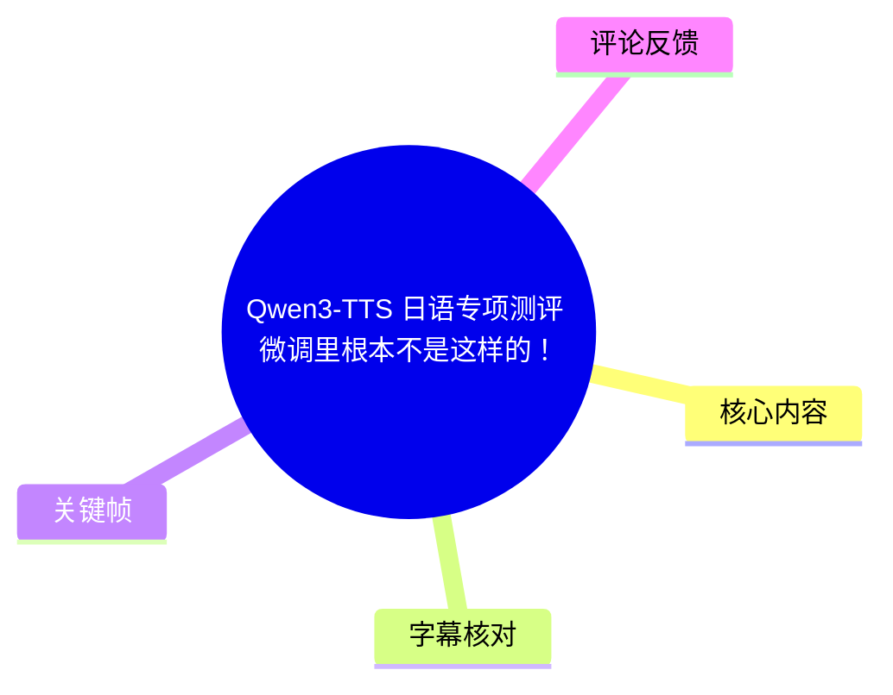
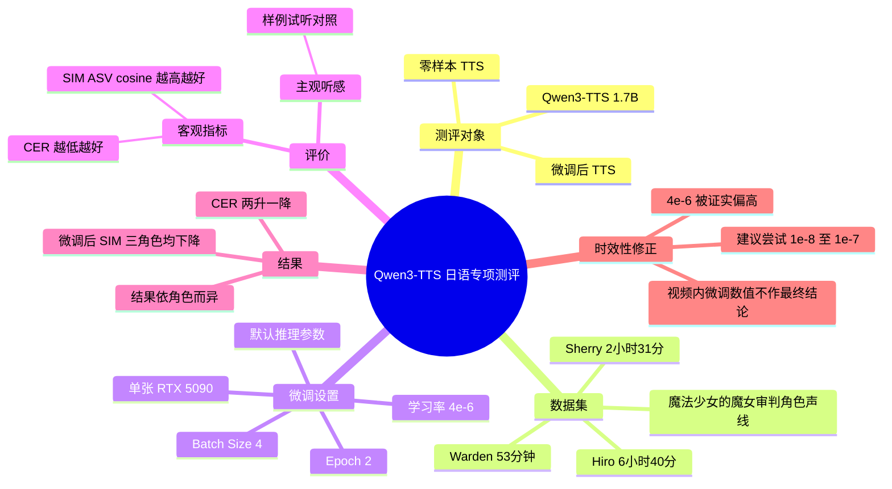
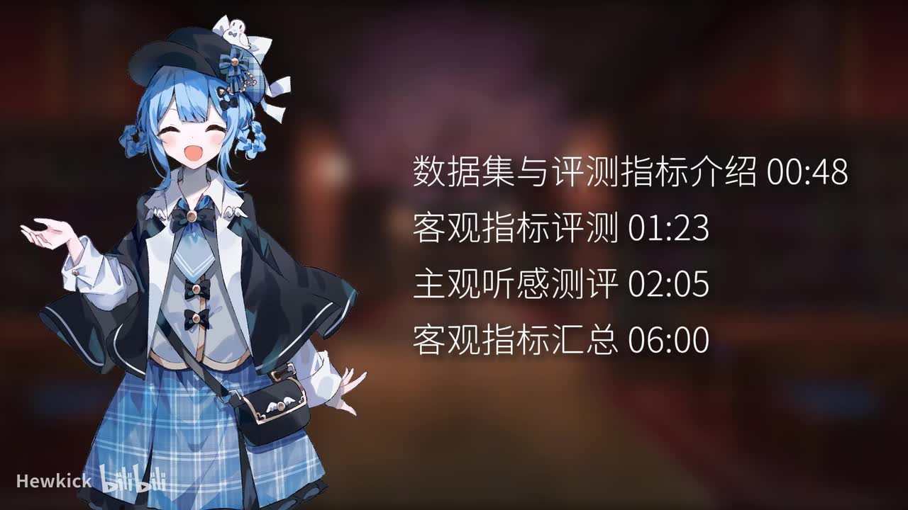
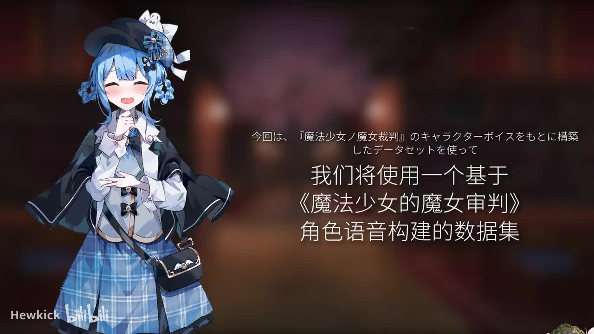
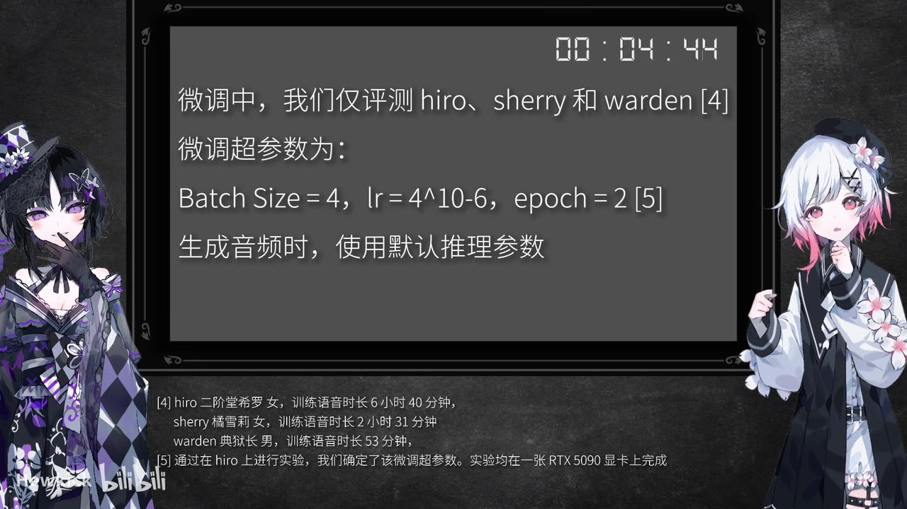
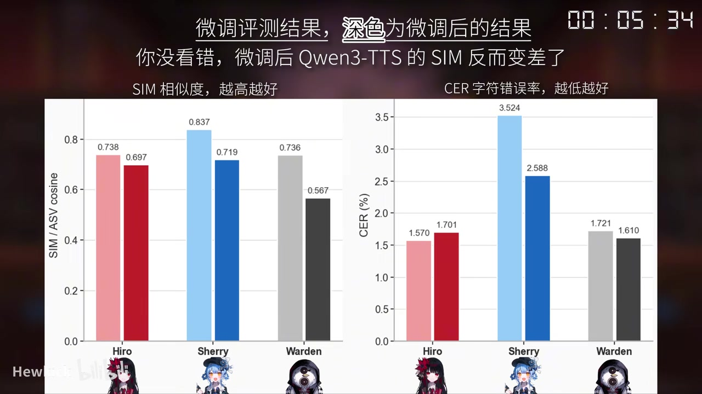

# Qwen3-TTS 日语专项测评：微调里根本不是这样的！

> 来源：[Bilibili 视频](https://www.bilibili.com/video/BV1RKLn6XEwA)<br>
> UP 主：Hewkick｜视频时长：6 分 49 秒｜合集：AIcode  
> 项目地址：[Qwen3-TTS GitHub](https://github.com/QwenLM/Qwen3-TTS)

## 小结

本视频是一次面向**日语角色语音**的 Qwen3-TTS 专项测评。UP 主使用《魔法少女的魔女审判》角色声音构建数据集，对 **Qwen3-TTS 1.7B** 的零样本生成与微调结果进行比较；评价维度包括客观指标与主观听感。

视频所展示的微调实验覆盖 3 个角色：Hiro、Sherry 和 Warden。训练语音时长分别为 6 小时 40 分、2 小时 31 分和 53 分；微调配置为 `Batch Size=4`、学习率 `4e-6`、`epoch=2`，实验均在单张 RTX 5090 上完成，推理使用默认参数。

画面中的客观结果显示：微调后的 **SIM/ASV cosine（说话人相似度，越高越好）在三个角色上均下降**；CER（字符错误率，越低越好）则呈现角色差异：Hiro 变差，Sherry 与 Warden 改善。因此，基于这次设置，微调并没有稳定地带来更好的音色相似度，也不能仅凭 CER 的局部改善就认定整体效果更好。

最关键的时效性修正来自视频简介的后续更新：UP 主于 **2026-05-26** 明确指出，视频中使用的 `4e-6` 学习率偏高；其后续经验是 Qwen3-TTS 微调采用约 **`1e-8`～`1e-7`** 的小学习率可取得更好的效果。因此，视频内“微调后”的客观数值**不够准确，只能作为一次高学习率、有限超参数尝试的参考，而非该模型微调能力的最终结论**。

适合阅读本笔记的人包括：准备对 Qwen3-TTS 做日语角色声线微调的开发者、需要理解 SIM/CER 指标取舍的人，以及希望复现或审阅该次实验设置的人。复现时应优先重新搜索低学习率区间，并结合主观听感与多角色数据，而不能直接沿用视频参数。

## 思维导图





## 目录

- [测评目标与视频结构](#测评目标与视频结构-0001)
- [数据集、角色与评价指标](#数据集角色与评价指标-0048)
- [客观测评与结果读取](#客观测评与结果读取-0123)
- [主观听感与样例对照](#主观听感与样例对照-0205)
- [微调设置与复现步骤](#微调设置与复现步骤-0444)
- [客观结果汇总](#客观结果汇总-0534)
- [结论、限制与时效性修正](#结论限制与时效性修正-0600)
- [字幕比对与采用策略](#字幕比对与采用策略)
- [评论分析](#评论分析)
- [处理记录](#处理记录)

## [测评目标与视频结构](https://www.bilibili.com/video/BV1RKLn6XEwA?t=1)

ASR 在 00:01.710 起识别到日语旁白：本视频属于 TTS 模型日语专项评价系列，使用基于《魔法少女的魔女审判》角色声音构建的数据集，从**客观指标**与**主观听感**两方面评估模型。

本次对象为 **Qwen3-TTS 1.7B**，比较对象包含：

1. **零样本 TTS（zero-shot TTS）**；
2. **微调后的模型输出（fine-tuning 后）**。

视频画面目录给出了实际章节安排：

| 画面标注章节 | 起始时间 | 内容定位 |
| --- | ---: | --- |
| 数据集与评测指标介绍 | 00:48 | 交代数据及评价口径 |
| 客观指标评测 | 01:23 | 展示客观指标结果或相关比较 |
| 主观听感测评 | 02:05 | 播放角色语音样例进行听感对照 |
| 客观指标汇总 | 06:00 | 汇总与收束 |



> 图：该帧直接给出了视频内目录及“00:48 / 01:23 / 02:05 / 06:00”四个时间锚点，是划分正文结构的主要依据；相比错配的站内字幕，它能可靠地说明视频实际主题与流程。

## [数据集、角色与评价指标](https://www.bilibili.com/video/BV1RKLn6XEwA?t=48)

### 数据来源与评测对象

视频开场画面说明，本次数据集来源于《魔法少女的魔女审判》的角色声音。这里的“角色声线”意味着目标并非普通通用日语朗读，而是带有角色性格、情感表现和较强音色特征的日语语音合成任务。



> 图：该帧同时呈现角色形象与“基于《魔法少女的魔女审判》角色语音构建的数据集”文字，是确认数据集主题和任务场景的直接画面证据。

视频中用于微调评测的角色、性别/角色描述及训练语音时长如下：

| 角色 | 画面文字 | 训练语音时长 |
| --- | --- | ---: |
| Hiro | 二阶堂希罗，女 | 6 小时 40 分 |
| Sherry | 橘雪莉，女 | 2 小时 31 分 |
| Warden | 典狱长，男 | 53 分钟 |

这些时长差异很大，特别是 Warden 的可训练语音不足 1 小时。因此，不宜把三个角色的指标视为同等数据规模下的横向能力排名；数据量、角色音色复杂度、台词分布和训练稳定性都可能影响结果。

### 两类客观指标

视频汇总图明确给出两项指标的方向：

| 指标 | 图中说明 | 解读 |
| --- | --- | ---|
| SIM / ASV cosine | 越高越好 | 衡量合成语音与目标说话人之间的相似程度；视频将其作为音色/说话人相似度指标。 |
| CER（字符错误率） | 越低越好 | 衡量生成内容的字符错误比例；数值低通常意味着文本内容的可辨识性或准确性更好。 |

需要注意：SIM 与 CER 衡量的是不同维度。高 SIM 不必然意味着低 CER，低 CER 也不自动等同于角色表现、自然度或情感控制更好。视频还安排了主观听感部分，正是为了避免只用客观数值覆盖全部质量判断。

## [客观测评与结果读取](https://www.bilibili.com/video/BV1RKLn6XEwA?t=83)

视频目录将“客观指标评测”放在 01:23。后续汇总图中明确说明：

- **浅色柱**：未微调/基准结果；
- **深色柱**：微调后的结果；
- 图中文字直接强调：**“微调后 Qwen3-TTS 的 SIM 反而变差了。”**

从三名角色的柱状图可直接读取到，微调后的 SIM 都低于对应基准：

| 角色 | 微调前 SIM | 微调后 SIM | 变化 |
| --- | ---: | ---: | ---: |
| Hiro | 0.738 | 0.697 | -0.041 |
| Sherry | 0.837 | 0.719 | -0.118 |
| Warden | 0.736 | 0.567 | -0.169 |

就这一次实验而言，Warden 的 SIM 下降幅度最大，Sherry 次之，Hiro 相对较小。该现象说明本次微调设置没有把模型稳定地推向更接近目标角色音色的方向。

但这不是“Qwen3-TTS 不适合微调”的充分证据：视频简介已在后续更新中说明学习率设置存在问题，且 UP 主也说明自身精力有限，未能穷举超参数组合。因此，正确表述应是：**在视频所用数据与 `4e-6` 学习率等设定下，微调结果不理想；不能将其外推为模型在所有微调方案下都无效。**

## [主观听感与样例对照](https://www.bilibili.com/video/BV1RKLn6XEwA?t=125)

从 02:10.660 起，本次 ASR 能稳定识别出一组日语台词样例，并显示同一或近似文本存在连续重复，符合视频在主观听感环节中播放不同生成版本作对照的情形。可辨识的片段包括：

- `気安く触れないでほしい。`
- `忘れてもらっては困る。私は君が嫌いなんだ。`
- `時系列を洗うんだ。エマの証言が抱えている矛盾を突きつけてやろう。`
- `私は橘シェリーって言います。事件があるところに私あり。この名探偵にお任せくださーい。`
- `それって全員が単独行動した方が良いということでしょうか。`
- `議論はここまでということで、投票に移ってもらっていいですかね。`
- `分かりました。それが総意というのなら、ご協力いたしましょう。`

这些样例覆盖了角色化语气、陈述句、质询句及较长文本。视频在此处的核心方法是让观众直接听取输出，而不是只依赖 SIM 与 CER。

不过，本次 ASR 在多段语音样例上出现较多乱码或音近误识别，尤其是约 02:55 后、03:54 后以及 05:21 后的片段。因此，不能将 ASR 中无法确认的日语转写当作准确台词，也不能从残缺 ASR 反推出视频对某一版本听感优劣的完整口头结论。

> 实践提示：复现主观评测时，应保留每条文本、参考音频、零样本输出、微调输出及盲听顺序；最好让多名听者独立评分音色相似度、自然度、情感贴合度和文本清晰度。视频素材未提供这些主观评分表或统计结果，因而不能编造主观分数。

## [微调设置与复现步骤](https://www.bilibili.com/video/BV1RKLn6XEwA?t=284)

视频在约 04:44 的画面中给出了微调实验配置。可确认参数如下：

```text
评测角色：hiro、sherry、warden
Batch Size：4
Learning Rate：4e-6
Epoch：2
生成阶段：使用默认推理参数
硬件：单张 RTX 5090
```

画面脚注还说明：该微调超参数通过在 Hiro 上进行实验确定；实验均在一张 RTX 5090 显卡上完成。



> 图：该帧是全片最重要的可复现信息之一，直接展示三名评测角色、各自训练时长以及 `Batch Size=4、lr=4e-6、epoch=2`；同时说明使用默认推理参数和单张 RTX 5090，避免把推理调参效果误归因于微调本身。

### 可据视频复现的最小流程

1. **准备角色级日语语音数据**  
   按角色分开整理训练语音；视频中三个角色的数据规模并不相同。应保证音频、文本标注和角色身份对应正确。

2. **选择模型及比较基线**  
   使用 Qwen3-TTS 1.7B，至少保留零样本输出作为比较对象；视频的目标不是只生成微调音频，而是比较微调前后效果。

3. **执行微调**  
   视频使用 `Batch Size=4`、`epoch=2` 与 `lr=4e-6`。但该学习率已被 UP 主后续修正为偏高，复现者不应把它视为推荐值。

4. **采用一致推理条件生成音频**  
   视频写明生成时采用默认推理参数。比较零样本与微调结果时，应固定文本、参考条件、采样策略及其他推理配置，减少混杂变量。

5. **计算客观指标**  
   分别统计 SIM/ASV cosine 与 CER，并明确两者方向：SIM 高为好，CER 低为好。

6. **开展主观听感对照**  
   针对同一日语台词播放不同版本的生成音频，重点检查角色感、音色接近度、清晰度、韵律与情绪表现。

7. **基于低学习率重新搜索**  
   结合简介更新，优先把学习率搜索重心放在 `1e-8`～`1e-7`，而非直接复制 `4e-6`。该范围是 UP 主后续经验，不代表已在本视频同一完整数据集上给出完整对照表。

## [客观结果汇总](https://www.bilibili.com/video/BV1RKLn6XEwA?t=334)

视频约 05:34 的汇总画面同时展示 SIM 与 CER 的微调前后结果，深色柱代表微调后。



> 图：该帧直接给出六组 SIM、CER 数值及指标方向，是判断“微调后 SIM 反而下降”这一结论的主要证据；它也揭示 CER 并非在所有角色上同向变化。

### SIM / ASV cosine：全部下降

| 角色 | 微调前 | 微调后 | 结论 |
| --- | ---: | ---: | --- |
| Hiro | 0.738 | 0.697 | 下降 |
| Sherry | 0.837 | 0.719 | 下降 |
| Warden | 0.736 | 0.567 | 下降 |

以视频图中的指标方向判断，三个角色的说话人相似度均恶化。这是视频标题“微调里根本不是这样的！”所对应的核心实验现象之一。

### CER：并非单向变化

| 角色 | 微调前 CER | 微调后 CER | 变化方向 |
| --- | ---: | ---: | --- |
| Hiro | 1.570% | 1.701% | 变高，变差 |
| Sherry | 3.524% | 2.588% | 变低，改善 |
| Warden | 1.721% | 1.610% | 变低，改善 |

从这张图可以得出三个有限结论：

1. 微调后，**SIM 没有改善，且在三位角色上都下降**；
2. CER 并不完全随 SIM 同步变化，Sherry 和 Warden 的 CER 改善，但 Hiro 变差；
3. 这表明“文本准确性/可懂度”与“说话人相似性”之间存在权衡或至少存在不同步现象。

视频未给出 CER 的计算细节、测试集规模、置信区间、均值/方差、评价模型版本，也没有给出人类听感的量化统计。因此，不能据此比较三名角色的绝对优劣，也不能断定微调导致结果变化的唯一原因就是学习率。

## [结论、限制与时效性修正](https://www.bilibili.com/video/BV1RKLn6XEwA?t=360)

### 视频可支持的结论

- 本次日语角色声线测试使用 Qwen3-TTS 1.7B，对比了零样本与微调结果。
- 在视频展示的参数下，微调后三个角色的 SIM/ASV cosine 都下降。
- CER 结果具有角色差异：Hiro 变差，Sherry 与 Warden 改善。
- 视频将主观听感和客观指标同时纳入评估，而没有把任一单指标当作全部质量。

### 重要限制

1. **学习率已被后续否定为偏高**  
   视频简介更新明确称 `4e-6` 偏高，较好的效果需要约 `1e-8`～`1e-7`。这会直接影响对“微调后客观结果”的解释。

2. **超参数搜索有限**  
   UP 主在简介中说明，因精力有限，难以测试过多超参数组合，主要依经验进行尝试。因此，本视频不是系统性超参数消融实验。

3. **数据量不均衡**  
   三个角色的训练时长从 53 分钟到 6 小时 40 分不等，难以隔离数据规模对结果的影响。

4. **客观指标不覆盖全部听感**  
   SIM 和 CER 分别对应相似度与字符错误率，不能完整覆盖情感、角色契合度、自然度、韵律和稳定性。

5. **实验细节不完整**  
   素材未提供数据清洗规则、训练/测试划分、训练脚本、随机种子、具体推理默认值、CER 计算流程及主观评分统计，故不应将结果视为严格可复现的基准榜单。

### 时效性说明

视频简介中记录了 **2026-05-26** 的更新，晚于视频元数据对应的发布时间。该更新应优先于视频内原始参数解释：

> “微调 Qwen3-TTS 需要一个很小的学习率，大概是 `1e-8 ~ 1e-7` 才能有很好的效果，视频中的 `4e-6` 高了，所以本视频内的微调后的 Qwen3-TTS 客观数值不够准确。”

相关讨论地址为：[Qwen3-TTS Issue #314](https://github.com/QwenLM/Qwen3-TTS/issues/314)。

因此，本视频最值得迁移的经验不是“Qwen3-TTS 微调无效”，而是：**TTS 微调对学习率高度敏感；一组看似合理的高学习率设置，可能同时破坏音色相似度并掩盖模型在更合适设置下的能力。**

## 字幕比对与采用策略

| 字幕来源 | 完整性 | 专有名词/主题匹配 | 时间轴 | 主要问题 |
| --- | --- | --- | --- | --- |
| Bilibili 站内字幕 `p01-ai-zh.srt` | 形式上覆盖约 00:00–04:30 | 严重不匹配 | 分段时间轴存在，但对应内容错误 | 内容是关于“脑子”“机器人”“连体人”等中文段落，与本视频的 Qwen3-TTS、日语角色语音测评完全无关，应判定为错配字幕。 |
| 本次 ASR `medium` | 17 段，语音覆盖约 240.28 秒，占总时长约 58.75% | 前两段准确识别 Qwen3-TTS 1.7B、日语专项测评、零样本和微调；样例台词部分部分可读 | 有真实时间戳，首段 00:01.710，末段 06:46.260 | 日语样例段存在大量误识别和乱码；00:48.230–02:10.660、05:58.430–06:43.900 等存在较大空白。 |

### 最终字幕选择

本笔记**不采用站内字幕正文**，因为其内容明显属于另一支视频，尽管该字幕的时间格式有效，也不能用于定位或转述本视频内容。

本笔记采用策略为：

1. 以**本次 ASR 的时间戳**定位开头介绍、日语试听片段和结尾；
2. 以视频关键帧中可见的**章节目录、参数、图表和脚注**补全 ASR 漏识别内容；
3. 以视频简介中的后续更新补充学习率修正及其时效性；
4. 对 ASR 无法可靠转写的日语样例，不擅自补全或翻译为未出现的内容。

ASR 诊断中**未标记** `noAudioStream=true`；素材中存在 `audio/audio.wav`，且 ASR 已实际识别出日语语音。因此，本视频不是无音轨视频，ASR 的缺口应理解为识别覆盖和内容可辨性限制，而不是“源视频没有音轨”。

## 评论分析

可获取热评共 2 条，未提供第 3 条可分析热评；以下不将评论内容视为已经独立验证的事实。

1. **zxyzxy123｜15 赞**  
   评论称此前几乎忘记该模型“还能微调”，并提到自己曾吐槽模型只能在“情感控制”和“语音克隆”之间二选一。  
   - **补充价值**：反映观众对 Qwen3-TTS 微调功能与能力边界的关注。  
   - **可信度边界**：这是个人使用感受，没有给出版本、配置、样本或对照，不能据此判断模型实际是否存在功能互斥。

2. **Hewkick｜12 赞**  
   UP 主留言补充了推荐观看时间点：`02:54`、`04:08`、`05:33`；并说明自己从事音频方向研究但并非专攻 TTS，欢迎提出建议；还预告未来将制作 Fish Audio、IndexTTS、VoxCPM 的更新测评。  
   - **补充价值**：推荐时间点与视频的试听、参数和结果汇总位置大致对应，便于回看重点。  
   - **可信度边界**：未来测评计划属于创作者预告，不代表相关对比已经完成或结论已经产生。UP 主的专业背景说明有助于理解其视角，但不替代实验公开与独立复现。

## 处理记录

- **Worker ID**：`worker-mrj0www4-e8d79408`
- **整理模型**：`gpt-5.6-terra`
- **ASR 模型与运行信息**：`medium`；语言自动识别为日语（`ja`），置信度 `0.9951171875`；CUDA / `float16`。
- **使用素材与工具结果**：
  - 使用任务提供的视频元数据、视频简介、关键帧、站内 SRT、ASR SRT、ASR 诊断结果和热评 JSON；
  - 使用已提供的音频提取结果 `audio/audio.wav` 与 ASR 分段结果；
  - 使用关键帧画面中的目录、微调参数、角色时长与图表数值进行多模态校对。
- **字幕选择**：
  - 检查站内字幕后确认其与视频主题严重错配，未采用；
  - 检查本次 ASR，确认视频有音轨且 ASR 含有效日语开场和部分样例；
  - 最终以 ASR 时间戳为主，以关键帧和简介为内容校正依据。
- **关键帧选择依据**：
  - `frames/frame-001.jpg`：直接展示数据集源于《魔法少女的魔女审判》角色声线；
  - `frames/frame-002.jpg`：直接展示视频章节及时间锚点；
  - `frames/frame-003.jpg`：直接展示微调角色、训练时长、超参数、硬件与推理条件；
  - `frames/frame-004.jpg`：直接展示微调前后 SIM/CER 图表及全部可读数值。
- **缓存清理**：素材中未提供缓存清理执行记录；本整理未将“缓存已清理”作为已验证事实。
- **未解决问题**：
  - 无法从现有素材恢复站内错配字幕以外的完整人工字幕；
  - ASR 对部分日语样例识别不可靠；
  - 视频未公开完整训练脚本、测试集划分、指标计算细节与主观评分统计；
  - `1e-8`～`1e-7` 是简介中的后续经验修正，现有素材未给出该学习率区间下与原实验完全同条件的完整数值表。
