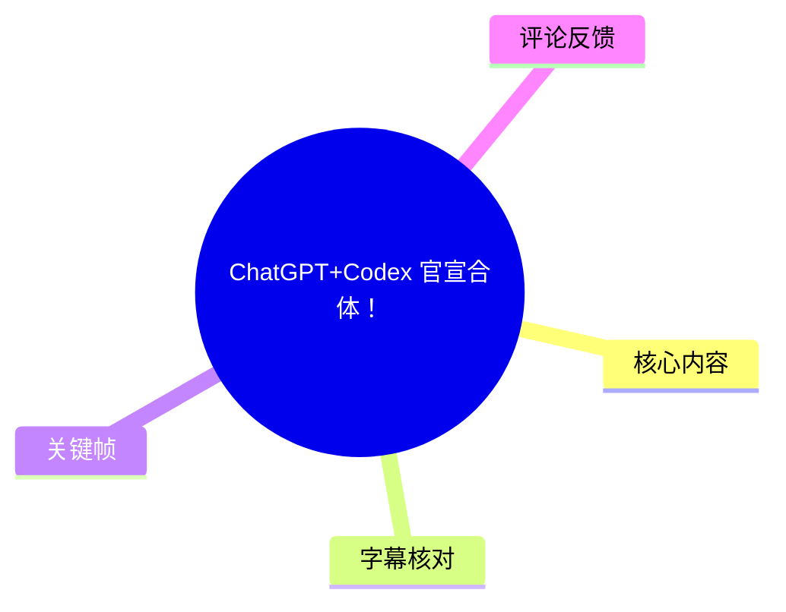
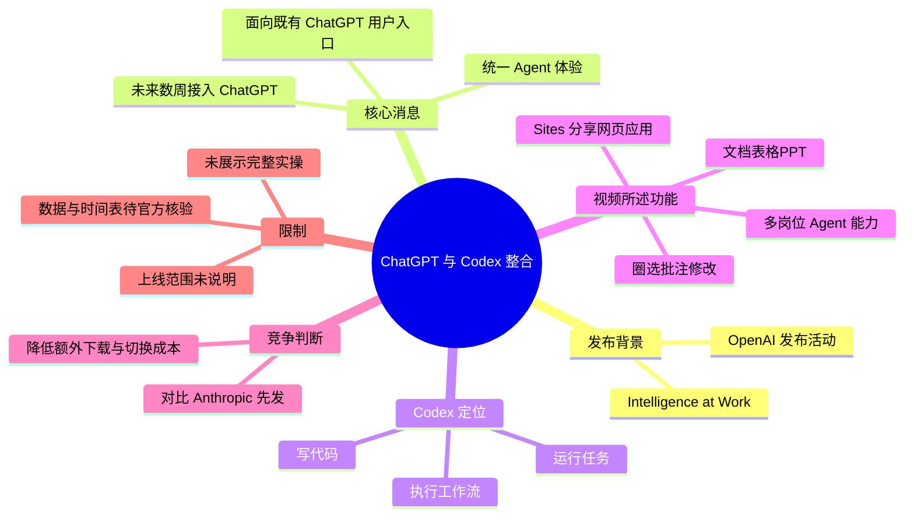

# ChatGPT+Codex 官宣合体！

> 来源：[Bilibili 视频](https://www.bilibili.com/video/BV1UtV262E2F) 
> UP 主：新智元AIEra｜发布时间：2026-06-03｜视频时长：67 秒｜分区合集：AIcode

## 小结

视频以 OpenAI 的 “Intelligence at Work” 发布活动为背景，转述了一项产品整合消息：OpenAI 计划在未来数周内将 Codex 接入 ChatGPT，使 ChatGPT 的大量现有用户能够在同一入口中调用更偏执行型的 Agent 能力。视频将这件事概括为“ChatGPT + Codex 合体”。

视频对 Codex 的定位是：不仅回答问题，还可自行写代码、运行任务并协助完成工作流的 Agent。UP 主进一步称，Codex 周活用户已超过 500 万、半年增长 6 倍，且增长并不主要来自程序员；这些均属于视频转述的发布信息或统计口径，未附原始数据链接，阅读时不宜延伸为独立核验结论。

所称更新包括面向不同工作场景的 Agent 能力，以及在文档、表格、PPT 中通过“圈选—批注—修改”方式进行局部改写的功能；另有名为 **Sites** 的能力，可通过一句话把制作内容变为可分享的网页应用。素材没有展示可复现的产品界面、套餐、地区、权限或完整操作流程，因此不能据此确认具体上线范围。

视频还将这次动作与 Anthropic 的先发优势作比较，核心判断是：其他产品可能需要用户额外下载或切换入口，而 Agent 被放入 ChatGPT 后，用户可在日常聊天入口直接使用。该“近 10 亿用户”的说法是视频的传播性表述，不等同于已确认的活跃可用人数或即时覆盖人数。

适合关注 AI Agent、办公自动化、知识工作流与 OpenAI 产品动态的读者快速了解事件。但这是一支 67 秒新闻短视频，且语音从约 00:25 才开始被识别到；所有涉及“未来几周”“用户规模”“功能数量”的信息均有时效性，应以后续 OpenAI 官方公告、实际产品页面与地区可用性为准。

## 思维导图

## 目录

- [背景与发布信息](#背景与发布信息)
- [整合逻辑：ChatGPT 入口与 Codex 执行能力](#整合逻辑chatgpt-入口与-codex-执行能力)
- [视频列举的工作流更新](#视频列举的工作流更新)
- [竞争语境与传播策略](#竞争语境与传播策略)
- [可迁移的使用思路与操作步骤](#可迁移的使用思路与操作步骤)
- [参数、限制与时效性](#参数限制与时效性)
- [字幕比对](#字幕比对)
- [评论分析](#评论分析)
- [处理记录](#处理记录)

## [背景与发布信息](https://www.bilibili.com/video/BV1UtV262E2F?t=25)

ASR 在 **00:25.780—00:27.000** 的片段中提到，OpenAI 于凌晨举行了一场名为 **“Intelligence at Work”** 的发布活动，并“官宣未来几周把 Codex 装进 ChatGPT”。视频封面及画面也反复以“ChatGPT + Codex 官宣合体”“10 亿人喜提超级 Agent”概括主题。

> 图：关键帧展示了活动现场及 “OpenAI Intelligence at Work” 标识，能够为视频所称发布活动名称提供画面层面的对应信息；但它并未展示官方产品说明全文或上线细则。

需要区分以下三个层次：

1. **视频明确转述的事件**：未来数周将 Codex 接入 ChatGPT。
2. **视频对意义的解释**：ChatGPT 用户将更容易获得“个人 Agent”式能力。
3. **尚未在素材中展示的细节**：哪些订阅层级可用、哪些国家或地区可用、是网页端还是客户端优先、是否需额外验证、是否存在用量上限，均未说明。

视频还称 Codex 是一个“会自己写代码、自己跑任务”的 Agent。这一描述强调的是其任务执行属性，而非仅进行文本问答；但“自己跑任务”的具体运行环境、授权边界、文件访问范围和人工确认机制，素材没有给出。

## [整合逻辑：ChatGPT 入口与 Codex 执行能力](https://www.bilibili.com/video/BV1UtV262E2F?t=27)

视频的核心叙事是将两类能力合并：

- **ChatGPT**：承担思考、写作、创作与对话入口。
- **Codex**：承担执行、工具调用、工作流处理等偏 Agent 的职责。
- **整合后的体验**：用户不用在不同产品间反复切换，可在 ChatGPT 内部发起并使用执行型任务。

> 图：画面以箭头连接 ChatGPT 与 Codex，并标注“统一 Agent 体验”。它直观呈现了视频的产品定位：把对话能力与执行能力汇聚至同一入口；图中文字属于视频信息图，不应代替官方功能文档。

ASR 同一段还给出两组规模数据：

| 视频转述指标 | 数值 | 应如何理解 |
| --- | ---: | --- |
| Codex 周活用户 | “破 500 万” | 视频未提供统计日期、统计定义或原始出处。 |
| 半年增长 | “涨了 6 倍” | 未说明起始基数、是否为周活用户口径。 |
| 知识工作者占比 | “已经占了两成” | 未说明样本范围及“知识工作者”的定义。 |
| 潜在触达人群 | “近 10 亿用户” | 更接近对 ChatGPT 用户覆盖能力的传播性估计，不宜理解为 Codex 已向 10 亿人开放。 |

视频特别强调，增长主力“根本不是程序员”，而是普通打工人。这反映其对 Agent 使用场景的判断：价值不只在软件开发，还在数据处理、内容制作和业务流程协作。不过，素材没有提供职业构成的完整数据，不能据此推导各行业真实采用率。

> 图：关键帧出现 “With Codex” 与“自己跑任务的 Agent”字幕，适合用来理解视频对 Codex 的功能定位：它被描述为能接收任务并持续处理的执行代理，而不仅是聊天机器人。

## [视频列举的工作流更新](https://www.bilibili.com/video/BV1UtV262E2F?t=27)

视频称此次“一口气三个更新、六个岗位插件”，并点名了数据分析、创意、销售、投行等工作方向。由于 ASR 未完整、清晰地列出“六个岗位”的全量名称，不能补写另外两个岗位，也不能确认“插件”是官方产品名、模板名还是视频的概括说法。

从可辨识的口播内容看，功能可归纳为以下三类：

### 1. 面向岗位或任务类型的 Agent 支持

视频列举的可辨识工作方向包括：

- 数据分析；
- 创意工作；
- 销售；
- 投行。

UP 主用“像六个办完入职的新同事”形容这些能力。这是形象化比喻，实际含义应理解为：系统可能按不同的工作角色或工作任务提供预设能力，而非真的拥有独立员工身份、完整业务责任或无需审核的决策权。

### 2. 圈选与批注式局部修改

口播称，在文档、表格、PPT 里“你圈哪它改哪，不用推翻重来”。这是视频中最具体的交互描述，其可迁移价值在于局部修改工作流：

1. 在已有文档、表格或演示文稿中定位待调整的区域；
2. 圈选或批注该部分；
3. 提出具体修改要求；
4. 由 Agent 根据上下文生成局部更新；
5. 人工检查改动是否破坏数据、逻辑、格式与原意。

> 图：画面展示了针对活动管理的自然语言任务请求，并显示系统处于工作状态。虽然它不是文档、表格或 PPT 的完整演示，但有助于理解视频强调的交互方式：用户以一句任务指令驱动系统处理具体工作。

必须注意：素材未说明该能力是否已支持全部 Office 类格式、是否能保留复杂公式和动画、是否允许多人协作、是否有版本回滚。因此，真实工作中仍应保留原文件、核查修改记录，并对关键数据进行人工复算。

### 3. Sites：将内容变为可分享网页应用

视频称还有 **Sites**，可以“一句话就能把你做的东西变成一个能分享的网页应用”。素材没有给出其正式产品页、生成页面的域名、部署方式、隐私权限、访问控制或是否支持自定义代码，因此可确认的仅是视频描述的目标能力：

- 输入自然语言需求；
- 将已有产物转化为网页形式；
- 生成可分享的结果。

“能分享”不等于默认公开，也不等于适合放置敏感数据。若后续实际使用，应首先确认链接权限、数据是否公开、是否存在组织级控制，以及是否可撤销访问。

## [竞争语境与传播策略](https://www.bilibili.com/video/BV1UtV262E2F?t=51)

在 **00:51.080—01:03.480** 的 ASR 片段中，视频称年初 Anthropic 已借助某项“CodeCode”相关能力取得先手，OpenAI 此次则“几乎逐条对标”。但 **“CodeCode”是本次 ASR 的可疑识别结果**：素材没有站内字幕，也未提供足以校正该专名的官方文字来源，因此不应将其当作经过核验的产品名称。

视频真正要表达的竞争差异是分发入口：

- 其他 Agent 产品：用户可能需要下载、注册或主动打开独立产品；
- 被整合进 ChatGPT 的 Codex：用户打开日常使用的 ChatGPT 时即可接触相关能力。

这是一种关于**分发效率与使用摩擦**的判断，并不自动证明能力更强。实际竞争仍取决于模型质量、任务成功率、执行成本、权限管理、产品稳定性、地区开放程度以及企业合规能力。

视频最后提到，Altman 只在 X 上发布了一条推文，未直接提及发布会或 Codex，而是引用《传道书》第九章第十节，视频译文为：“凡你手所当做的事，要尽力去做。”素材没有提供该推文链接、发布时间及完整上下文，故只能记录为视频转述，不能进一步解释其是否专门指向此次产品发布。

## [可迁移的使用思路与操作步骤](https://www.bilibili.com/video/BV1UtV262E2F?t=27)

视频本身没有给出账号开通或实际产品操作教程；以下步骤是根据其“对话入口 + 执行任务 + 局部修改”的工作流描述整理的使用框架，不代表已经由视频演示验证。

### 将模糊需求拆成可审核任务

1. **明确产物**：例如要数据报告、销售跟进摘要、演示文稿修改稿，还是可分享网页。
2. **提供输入边界**：说明可使用哪些文档、表格、数据源，哪些内容不得读取或外发。
3. **写清完成标准**：例如“只修改第 3 页结论”“保留公式”“输出变更列表”。
4. **要求先给计划**：对于复杂任务，先检查任务拆解、数据来源和可能影响。
5. **审阅结果再提交**：重点检查数字、引用、权限、格式、业务判断和敏感信息。

### 适合采用“圈选—修改—复核”的场景

- 修改一段文案的语气、长度或受众定位；
- 调整报告中的某张表格说明；
- 更新 PPT 某一页的结构与标题；
- 针对已有成果生成面向外部分享的网页版本。

### 不应因“Agent”定位而跳过的人工环节

- 财务、投行、销售承诺等高风险领域的数字和结论复核；
- 对外发布前的事实核查、版权检查与品牌审核；
- 上传数据前的隐私、保密与组织合规审查；
- 对自动执行任务设置权限范围、确认节点与可撤销机制。

## [参数、限制与时效性](https://www.bilibili.com/video/BV1UtV262E2F?t=51)

### 素材中可直接提取的参数

| 项目 | 信息 |
| --- | --- |
| 视频时长 | 67 秒；ASR 音频时长诊断为 66.5019375 秒 |
| 视频画面 | 2160 × 3840，竖屏 |
| ASR 语言 | 中文 |
| ASR 模型 | medium |
| ASR 置信度 | languageProbability = 0.99560546875 |
| ASR 识别到的语音时段 | 00:25.780—01:03.480 |
| ASR 语音覆盖率 | 56.69% |
| 视频所述整合时间 | “未来几周” |
| 视频所述 Codex 周活 | 超过 500 万 |
| 视频所述增长 | 半年 6 倍 |
| 视频所述知识工作者比例 | 两成 |
| 视频所述功能概括 | 三个更新、六个岗位插件；具体名单未完整提供 |

### 重要限制

1. **新闻时效性强**：视频发布于 2026-06-03；“未来几周”是当时的时间表，当前是否已上线、是否延期或调整，均需查阅最新官方信息。
2. **缺少站内字幕与官方原文**：关键专名和功能数量存在 ASR 误识别或压缩表达的可能。
3. **没有完整实机演示**：不能从短视频确认功能的实际界面、成功率、任务限额、价格、支持文件类型或数据处理方式。
4. **没有地区与账号条件**：无法确认是否面向免费用户、付费用户、企业用户或特定地区分批开放。
5. **统计数字无原始出处**：500 万周活、6 倍增长、两成知识工作者、近 10 亿人等数据，应视作视频转述，不应单独作为研究或采购依据。
6. **ASR 时间异常需留意**：第一条字幕只覆盖约 1.22 秒，却承载了很长一段信息；最后一条结束于 01:03.480，接近但未达到音频诊断时长 01:06.502。因此时间链接严格使用 SRT 给出的起点，但分段文本的内部句界不够可靠。

## 字幕比对

| 字幕来源 | 完整性 | 专有名词 | 时间轴 | 主要问题 |
| --- | --- | --- | --- | --- |
| Bilibili 站内字幕 | 未提供可用字幕，无法核对 | 无法核对 | 无法核对 | 素材明确说明无可用站内字幕。 |
| 本次 ASR 字幕 | 识别到 3 段、语音覆盖率 56.69%，可覆盖主要口播 | OpenAI、Intelligence at Work、ChatGPT、Codex 基本可辨；“CodeCode”疑似误识别 | 提供毫秒级 SRT 时间段 | 单段文本过长，首段 1.22 秒承载大量内容；存在中英混写、断词及可疑专名。 |

### 最终字幕选择

本视频**没有可用站内字幕**，因此采用本次 ASR 的 SRT 时间轴作为章节链接依据，并结合关键帧中的文字与画面进行有限校正。

- 将 ASR 中的 `Chat GPT` 统一书写为 **ChatGPT**；
- 将 `CodeX` 统一书写为 **Codex**；
- `Intelligence at Work` 与活动现场关键帧相互对应，可保留；
- `CodeCode` 无法凭现有素材确认具体指代，正文保留为“ASR 可疑识别结果”，不强行改写为某一官方名称；
- 未检测到 `noAudioStream=true` 标记；相反，诊断显示音频时长约 66.50 秒且识别到语音。因此本片不是无音轨视频。

## 评论分析

仅处理可获取的热评前三条。评论是用户个人表达，不构成已验证的产品事实。

1. **呼呼噜噜睡睡**（3 赞）：“我问 gpt 客服的回答，可以参考一下”  
   - 观点：评论者称自己向 GPT 客服咨询过，并暗示有可供参考的答复。  
   - 补充价值：提示观众可尝试通过官方客服或产品内渠道了解资格、开放范围等具体问题。  
   - 局限：评论未附客服原文、截图、账号状态或提问时间，无法据此验证任何结论。

2. **小et哦**（3 赞）：“我想 那么使用gpt网页聊天是不是也要二次手机验证了[doge]”  
   - 观点：担忧网页版 ChatGPT 未来是否需要二次手机验证。  
   - 关联性：该担忧反映出用户对账号门槛与访问摩擦的关注，和视频“更多用户直接获得 Agent”的叙事相关。  
   - 局限：这是疑问与玩笑式表达，视频没有提及二次手机验证，不能视为已实施或即将实施的规则。

3. **Sw4ggy_G**（0 赞）：“原来现在的codex不是基于gpt工作的吗（？”  
   - 观点：对 Codex 与 GPT 的既有技术关系提出疑问。  
   - 讨论价值：指出“产品入口整合”与“底层模型或技术关系”是不同问题。即使 Codex 已与 GPT 系列技术有关，视频所讲的仍可能是面向用户的 ChatGPT 产品整合。  
   - 局限：素材未解释 Codex 的底层模型架构，无法根据本视频回答该技术问题。

## 处理记录

- Worker ID：`worker-mrj0wjed-b0c290ad`
- 整理模型：`gpt-5.6-terra`
- ASR 模型与配置：`medium` / CUDA / `float16`；识别语言为中文，语言概率 `0.99560546875`。
- 使用的素材工具产物：已提供的合并视频、音频、ASR 结果与 SRT、关键帧目录、视频元数据、热评 JSON；未在素材中提供具体命令行或工具调用日志，未补造工具名称与命令。
- 字幕选择：站内字幕未提供可用版本；已检查本次 ASR，采用其 SRT 的真实起止时间生成时间轴链接，并对明显的 `Chat GPT`、`CodeX` 书写进行规范化；“CodeCode”保持待核验状态。
- 关键帧选择依据：`frame-001.jpg` 用于活动名称与发布现场；`frame-002.jpg` 用于 ChatGPT 与 Codex 的整合关系；`frame-003.jpg` 用于 Codex 的任务执行定位；`frame-004.jpg` 用于自然语言任务驱动的界面示例。未为未见画面内容赋予额外含义。
- 热评范围：仅分析可获取的前三条热评，未扩展至其他评论。
- 缓存清理：素材仅提供处理完成状态，未提供缓存清理执行记录；因此无法确认是否已清理，不将其表述为已完成。
- 未解决问题：官方公告原文、具体上线日期、地区与订阅资格、功能数量及“六个岗位”的完整名单、Sites 的部署与权限机制、ASR 中“CodeCode”的准确专名，均需以 OpenAI 后续官方资料核验。
