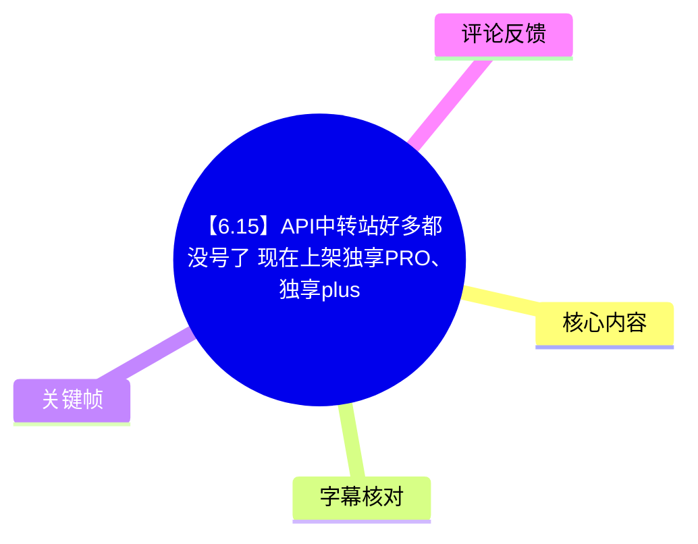
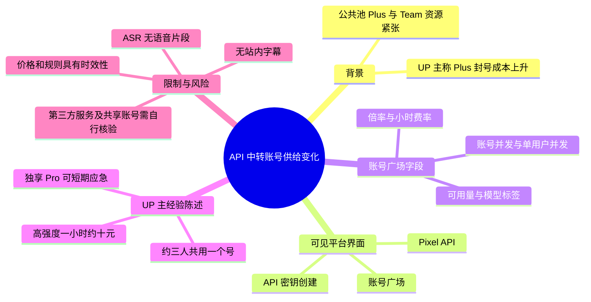
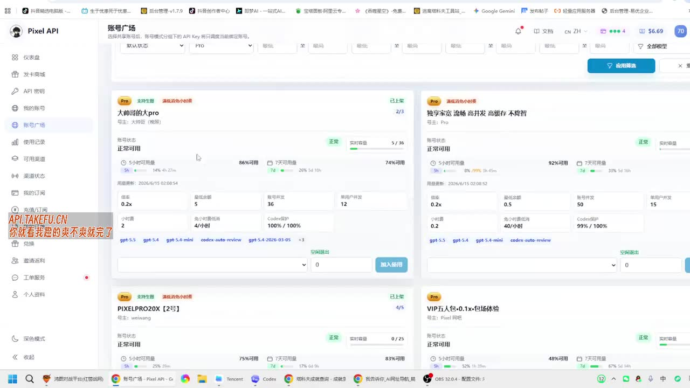
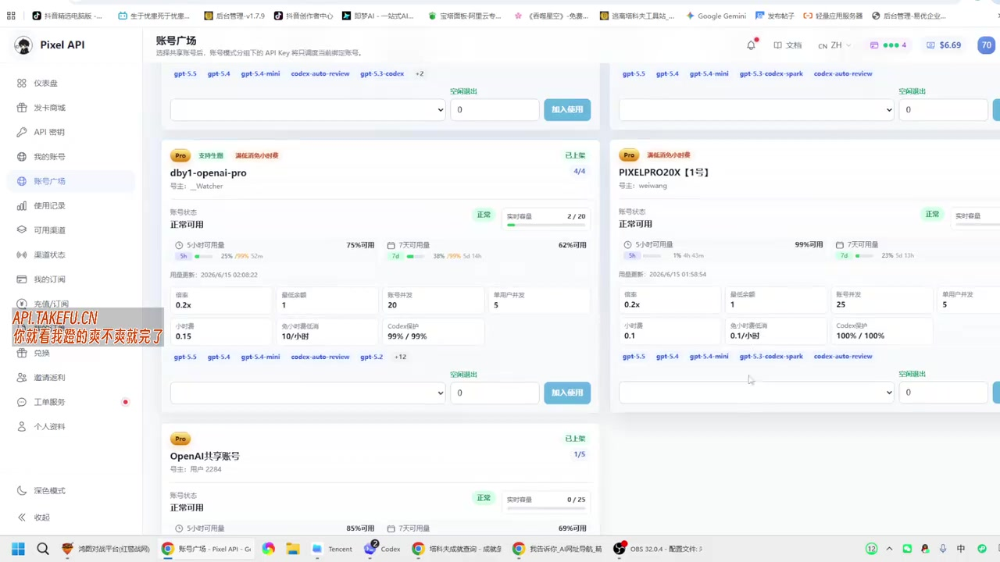
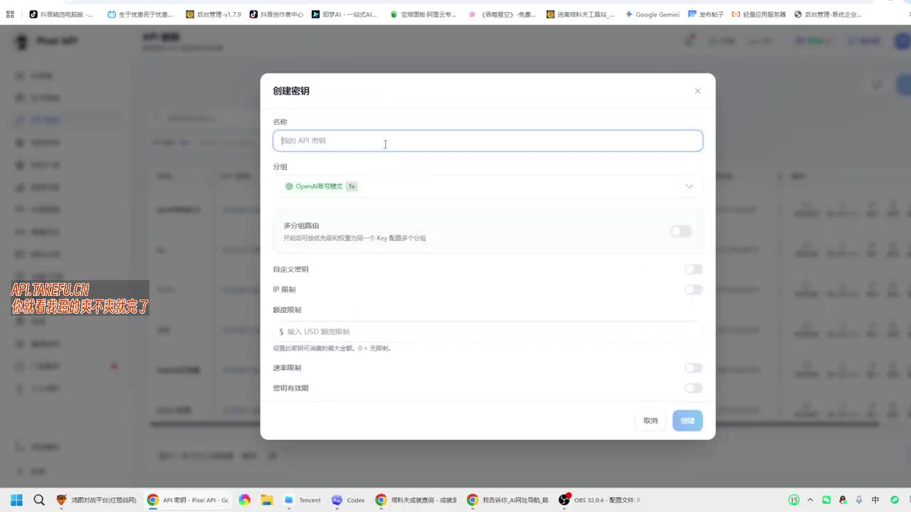
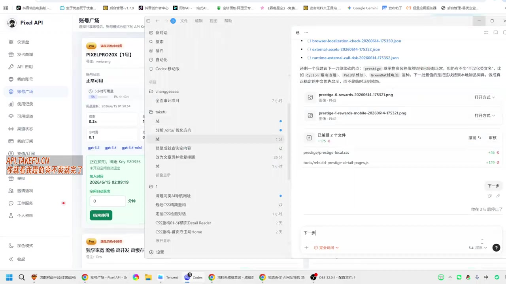

# 【6.15】API中转站好多都没号了 现在上架独享PRO、独享plus

> 来源：[Bilibili 视频](https://www.bilibili.com/video/BV1FHJN6AEa2)  
> UP 主：生于忧患死于忧患｜时长：165 秒｜分区/标签：编程、API、Pro、编程开发、中转站  
> 重要说明：站内未提供可用字幕；本次 ASR 未识别出任何语音片段。因此本文以视频元数据、UP 主简介、可见关键帧及可获取评论为依据，严格区分“来源陈述”“画面可见信息”与“无法核实事项”。

## 小结

这是一条关于 API 中转服务账号供给变化的短视频。UP 主在标题和简介中称，公共池中的 Plus、Team 账号已基本缺货，而账号广场正在出现由他人上架的“独享 Pro”及相关独享账号资源，视频画面展示了名为 **Pixel API** 的后台“账号广场”和 API 密钥创建界面。

UP 主的核心判断是：公共池的 Plus、Team 资源紧张，原因之一是近期 Plus 封号带来的成本上升；相对地，独享 Pro 账号可作为短期应急方案。简介还给出其个人经验性描述：高强度使用约一小时的成本“差不多 10 元”，且大约 3 人共用一个账号。这些均属于 UP 主陈述，并非本次素材能够独立验证的市场报价或服务承诺。

关键帧中可见，账号广场允许按账号状态、Pro、倍率、限价、并发等条件筛选，并以卡片展示账号的价格倍率、最低余额、账号并发、单用户并发、小时费率、每小时最低消耗、可用量和可选模型等字段。可见示例的倍率包括 `0.2x`，小时费率字段可见 `0.1`、`0.15`、`0.2` 等数值，但不同卡片的具体规则、计费单位和实际结算方式未在素材中得到文字解释。

视频没有可用的口述转写，且给出的关键帧没有附带逐帧时间戳；因此不能将界面切换、卡片字段或演示操作精确定位到某一秒，更不能据此补写未出现的操作步骤。本文各章节时间轴统一链接至视频起点，便于回看全片，而非声称相应内容恰发生于第 0 秒。

该信息具有很强时效性。视频标题标注“6.15”，简介也描述的是“目前”“这几天”的供给与成本状态；账号可用性、封禁策略、模型支持、倍率、价格和服务规则都可能在发布后快速变化。使用第三方中转或多人共享账号前，还应自行核查服务条款、账号授权边界、隐私处理方式及实际计费。

## 思维导图

## 目录

- [信息背景与时效范围](#信息背景与时效范围)
- [账号广场与供给变化](#账号广场与供给变化)
- [画面可见的账号参数](#画面可见的账号参数)
- [API 密钥界面与可确认操作边界](#api-密钥界面与可确认操作边界)
- [使用经验、限制与风险](#使用经验限制与风险)
- [关键帧索引](#关键帧索引)
- [字幕比对](#字幕比对)
- [评论分析](#评论分析)
- [处理记录](#处理记录)

## [信息背景与时效范围](https://www.bilibili.com/video/BV1FHJN6AEa2?t=0)

### 来源中的供给变化陈述

视频标题直接提出“API 中转站好多都没号了”，并称“现在上架独享 PRO、独享 plus”。UP 主在简介中进一步说明：

1. 其推荐/提及的站点为 `api.takefu.cn`。
2. 其称自己已使用一个多月。
3. 公共池中的 Plus、Team “基本没号”。
4. “这几天” Plus 封号成本较高。
5. 账号广场展示的是其他用户上架的独享 Pro，存在 5 线程和 15 线程等不同规格。
6. 其将这类资源定位为短期“救急”用途，长期是否使用由用户自行权衡。

以上是视频发布者的描述，不能自动推导为该平台在任一时刻都存在相同供给、价格或账号质量。尤其“没号”“封号成本贵”“不降智”“没人抢”等措辞，均没有提供可复现的检测方法、服务协议或第三方数据支撑。

### 时效性判断

- **视频时长**：165 秒。
- **标题时效标记**：`【6.15】`，表明内容面向某一日期附近的供给变化。
- **画面内时间痕迹**：关键帧中的部分卡片可见 `2026/6/15` 时间格式，但无法从给定素材确认其时区、更新时间语义或与视频发布时间的严格关系。
- **应视为易变信息**：可售账号数量、账号状态、倍率、余额门槛、并发、模型列表、封禁风险和小时费用。

> 阅读方式：将本视频视为一次界面巡检和个人经验分享，而不是稳定的价格表、服务保证或合规性证明。

## [账号广场与供给变化](https://www.bilibili.com/video/BV1FHJN6AEa2?t=0)

关键帧显示的平台界面左上角为 **Pixel API**，左侧导航中可见“仪表盘、发卡商城、API 密钥、我的账号、账号广场、使用记录、可用渠道、渠道状态、我的订阅、充值/订阅、兑换、邀请返利、工单服务、个人资料”等入口。其中“账号广场”处于选中状态。

页面顶部可见多项筛选控件，包括账号状态、`Pro`、倍率、限价及并发等字段；右侧有“应用筛选”按钮。这表明该页面的用途是从多个上架账号中筛选符合预算或并发需求的资源，而不是只显示一个固定套餐。

> 图：该关键帧展示了 Pixel API 的“账号广场”及多张资源卡片。其价值在于确认视频展示的是可筛选的账号市场式界面，并非仅口头讨论账号供给。

画面中部分账号卡片带有 `Pro` 标识、状态“正常可用”、可用量进度条、线程/并发指标、模型标签及“加入使用”按钮。卡片上方还可见“满低额度/小时续费”一类红色提示文字，但因画面分辨率与缺少字幕说明，无法可靠确认其完整措辞及其是否适用于全部卡片。

### 可见资源类型

从关键帧可辨识到的示例名称包括：

- `大帅哥的太pro`
- `独享家族 流畅 高并发 高缓存 不降智`
- `dby1-openai-pro`
- `PIXELPRO20X【1号】`
- `OpenAI共享账号`

其中“独享”“共享”是卡片命名或标签中的可见文字，不足以单独证明实际隔离程度、独占范围、共享人数或账号归属。UP 主简介称独享 Pro 的使用场景约为 3 人共用一个号；这与通常意义上的“单人独占”并不等同，使用前应向服务方确认“独享”的具体定义。

## [画面可见的账号参数](https://www.bilibili.com/video/BV1FHJN6AEa2?t=0)

### 参数字段及其可确认含义

账号卡片中能够辨识的字段主要包括：

| 画面字段 | 可确认的画面事实 | 不能据此确认的内容 |
| --- | --- | --- |
| 账号状态 | 多个示例卡片显示“正常可用” | 长期稳定性、实际成功率、封禁概率 |
| 实时容量 | 卡片显示类似 `5 / 36`、`0 / 25`、`2 / 20` 的数值 | 数值的精确定义、刷新频率与是否为全局容量 |
| 5 小时可用量、7 天可用量 | 以进度条和百分比呈现 | 配额口径、重置规则、与模型调用额度的换算 |
| 价格 | 可见 `0.2x` 等倍率 | 倍率相对的基准价格、最终账单公式 |
| 最低余额 | 可见 `0.5`、`1`、`5` 等数值 | 币种、预扣机制、是否可退 |
| 账号并发、单用户并发 | 各卡片显示不同数值 | 并发计算方式、排队策略与限流行为 |
| 小时费率 | 可见 `0.1`、`0.15`、`0.2` 等数值 | 数值单位、触发条件、是否按整小时收费 |
| 每小时最低消耗 | 可见如 `0.1/小时`、`10/小时`、`40/小时` | 与“小时费率”之间的关系、是否有额外模型费用 |
| Code 额度 | 显示如 `99% / 99%`、`100% / 100%` | “Code”对应的具体产品、上下文或模型限制 |

### 可见示例参数

下表仅抄录关键帧中相对清晰的可见字段；模糊或难以确认的数字不补全、不推测。

| 示例账号 | 可见倍率 | 可见最低余额 | 可见账号并发 | 可见单用户并发 | 可见小时相关字段 |
| --- | ---: | ---: | ---: | ---: | ---|
| 大帅哥的太pro | 0.2x | 5 | 36 | 12 | 小时费率似为 0.2；每小时最低消耗似为 4/小时 |
| 独享家族 流畅 高并发 高缓存 不降智 | 0.2x | 0.5 | 50 | 50 | 小时费率似为 0.2；每小时最低消耗似为 40/小时 |
| dby1-openai-pro | 0.2x | 1 | 20 | 5 | 小时费率 0.15；每小时最低消耗 10/小时 |
| PIXELPRO20X【1号】 | 0.2x | 1 | 25 | 5 | 小时费率 0.1；每小时最低消耗 0.1/小时 |

“似为”表示该字段受截图清晰度限制，不能作为精确报价引用。尤其首两张卡片中的小时相关数字，应以平台当时的实际结算页为准。

> 图：该关键帧展示 `dby1-openai-pro`、`PIXELPRO20X【1号】` 等卡片及其倍率、最低余额、并发和小时相关字段。其价值在于直观说明同为 Pro 类账号，参数并不一致，不能只按“Pro”标签判断成本与容量。

### 模型标签

画面中多个卡片下方可见部分模型或能力标签，包括：

- `gpt-5.5`
- `gpt-5.4`
- `gpt-5.4-mini`
- `codex-auto-review`
- `gpt-5.3-codex`
- `gpt-5.2`
- `codex-auto-review`

这些文字仅证明当时界面展示了相应标签。素材没有给出模型接口名称、版本来源、调用映射、上下文长度、质量测评、速率限制或可用性保证，不能据此认定其与官方同名模型完全等价。

## [API 密钥界面与可确认操作边界](https://www.bilibili.com/video/BV1FHJN6AEa2?t=0)

视频画面出现“创建密钥”弹窗。可见字段与开关包括：

1. **名称**：输入框提示“我的 API 密钥”。
2. **分组**：下拉选择，画面中可见“OpenAI账号组”字样。
3. **多分组路由**：附有说明，表达开启后可给同一个 Key 配置多个分组。
4. **自定义密钥**：开关项。
5. **IP 限制**：开关项。
6. **额度限制**：输入区域，提示以 USD 设置额度限制；旁边说明中可见“0 = 无限制”。
7. **速率限制**：开关项。
8. **密钥有效期**：开关项。
9. **确认与取消**按钮。

> 图：该关键帧展示“创建密钥”弹窗。其价值在于确认该服务至少提供按分组、IP、额度、速率和有效期管理 API Key 的界面能力。

### 能从画面整理出的配置流程

以下仅是依据弹窗界面能确认的最小流程，并不表示视频完整讲解了每一步：

1. 进入平台左侧的“API 密钥”相关入口。
2. 打开“创建密钥”弹窗。
3. 填写密钥名称。
4. 选择账号/路由分组；如需同一 Key 对应多组资源，可评估是否启用“多分组路由”。
5. 按需设置 IP 限制、额度限制、速率限制和有效期。
6. 点击“确认”创建。

### 未被素材解释的关键事项

视频未提供以下信息，不能自行补足：

- API Base URL、认证请求头、密钥返回格式或 SDK 配置；
- “多分组路由”的实际路由算法、故障切换逻辑；
- IP 白名单/黑名单的填写格式；
- USD 额度与平台充值余额、模型消费之间的换算；
- 速率限制的单位（请求数、Token 数或并发数）；
- 密钥创建后的展示次数、轮换、撤销和泄露处置办法；
- 对第三方账号、共享账号或中转服务的授权与合规条款。

因此，不能基于该视频制作可直接执行的接口接入教程。若确需使用，应以平台当期文档、实际控制台提示和服务协议为准，并避免把真实生产密钥直接暴露在截图、日志或公开仓库中。

## [使用经验、限制与风险](https://www.bilibili.com/video/BV1FHJN6AEa2?t=0)

### UP 主的经验性结论

UP 主简介中的结论可以归纳为：

- 公共池 Plus、Team 资源短缺时，独享 Pro 是一种短期替代选择；
- 相较多人争抢的公共资源，独享资源被描述为“没人抢”“不降智”；
- 高强度使用一小时约 10 元；
- 约 3 人使用一个号；
- 长期使用与否需要自行判断。

这些结论适合被视为特定时间点、特定使用者的经验报告，而非普遍规律。简介没有给出“高强度”的调用量定义、模型类型、输入输出 Token、并发负载、持续时长、结算明细或对照测试，因此无法计算单位 Token 成本，也无法验证“不降智”的质量结论。

### 应重点核查的限制

1. **资源动态变化**：账号卡片的“正常可用”和容量百分比是界面瞬时状态，不代表未来可用。
2. **计费不透明风险**：画面同时出现倍率、小时费率、每小时最低消耗、最低余额等字段；若不先确认规则，可能无法预估真实成本。
3. **共享语义不明确**：UP 主提到约 3 人共用一个号，需确认是否存在会话、速率、配额或数据层面的相互影响。
4. **隐私与数据风险**：第三方 API 中转可能处理请求内容、提示词、代码、文件元数据及响应。素材没有展示数据保留、日志脱敏或删除政策。
5. **账号与服务条款风险**：素材没有说明上游账号来源、共享授权、模型供应商条款兼容性或封禁后的补偿方案。
6. **模型命名不等于能力保证**：界面标签中的模型名称不能替代对模型版本、上下文、工具调用、稳定性及质量的实测。
7. **无口述证据可复核**：本次 ASR 为空，无法取得视频中的可能口头补充；本文不将不可见信息视为已证实内容。

> 图：该关键帧在账号广场背景前展示了一处代码/对话式工作界面，左下角可见“正在使用，绑定 Key #20335”之类提示。其价值在于表明视频可能意在展示账号被接入使用的场景；但画面未给出完整请求配置、调用日志或性能数据，不能据此证明接口成功率与模型效果。

## [关键帧索引](https://www.bilibili.com/video/BV1FHJN6AEa2?t=0)

给定关键帧文件未附带逐帧提取时间戳。以下索引按文件名记录画面价值，不为其虚构秒级定位。

| 关键帧 | 正文用途 | 可见重点 |
| --- | --- | --- |
| `frames/frame-001.jpg` | API 密钥配置说明 | 创建密钥、分组、多分组路由、IP/额度/速率/有效期限制 |
| `frames/frame-002.jpg` | 账号广场总览 | Pixel API、筛选栏、多张 Pro 资源卡片、加入使用入口 |
| `frames/frame-003.jpg` | 参数比较 | 不同账号的倍率、最低余额、并发、小时相关字段、模型标签 |
| `frames/frame-004.jpg` | 使用场景边界 | 账号广场背景、绑定 Key 的使用状态、编辑器/对话界面 |
| `frames/frame-005.jpg` 至 `frames/frame-012.jpg` | 未在现有可视素材中逐张描述 | 文件路径已提供，但没有对应的画面预览或时间戳，故不对其内容作推断 |

## [字幕比对](https://www.bilibili.com/video/BV1FHJN6AEa2?t=0)

| 字幕来源 | 完整性 | 专有名词 | 时间轴 | 主要问题 |
| --- | --- | --- | --- | --- |
| Bilibili 站内字幕 | 无可用字幕 | 无法核验 | 无 | 素材明确标注“未提供可用站内字幕” |
| 本次 ASR 字幕 | 空 | 无法识别 | 无有效分段 | ASR `medium` 模型未识别出任何 speech segment，输出 segments 为空 |
| 视频元数据与简介 | 局部 | 可获取 `api.takefu.cn`、Plus、Team、Pro 等文字 | 无逐句时间轴 | 属于作者填写文本，不是视频逐字字幕 |
| 关键帧多模态信息 | 局部 | 可辨识 Pixel API、账号名称、界面字段与部分模型标签 | 无逐帧时间戳 | 只能说明画面可见内容，不能恢复口述说明 |

### ASR 检查结果与最终采用策略

本次 ASR 的诊断信息如下：

- 模型：`medium`
- 自动识别语言结果：`en`
- 语言置信度：`0.541015625`
- 音频时长：`164.3946875` 秒
- 语音片段数：`0`
- 语音覆盖时长：`0` 秒
- 语音覆盖率：`0`
- 诊断警告：未识别到语音片段，建议核验音频内容或轨道。

素材中**没有** `noAudioStream=true` 标记，且处理清单显示已产出 `audio/audio.wav`；因此不能将本次结果表述为“源视频没有音轨”。准确表述应为：**已提取音频，但本次 ASR 未识别出语音内容，原因在现有素材中未被进一步确认。**

最终不采用站内字幕或 ASR 作为正文的事实来源，而采用：

1. Bilibili 元数据中的标题、简介、标签和时长；
2. 可见关键帧中的界面文字与参数；
3. 可获取的两条热评。

对 `Pixel API`、`账号广场`、`创建密钥`、`Pro`、`Plus`、`Team`、`api.takefu.cn` 等词语，均以画面或简介可见文字为准；对于无法清晰读取的参数，使用“似为”或不作转录。

## [评论分析](https://www.bilibili.com/video/BV1FHJN6AEa2?t=0)

本次仅获取到 2 条热评，少于要求的前三条，因此仅分析这两条，不补造第三条评论。两条评论的点赞数均为 0。

| 评论者 | 评论内容 | 观点与可提供的信息 | 可信度与限制 |
| --- | --- | --- | --- |
| 铖鉞 | “plus用量的话，0.15倍率，一天大概是多少米啊？” | 评论者关注 Plus 用量在 `0.15` 倍率下的日成本，说明潜在用户最关心的是可量化计费，而非仅有账号可用性。 | 这是提问，不包含实际报价或计算结果；“米”通常是成本的口语表达，但具体币种和计费口径未定义。 |
| 是糖不够甜了吗 | “满血cc” | 可能是在评价画面中使用的能力/模型状态，表达对“满血”或完整能力的期待。 | “cc”的具体指代未在视频、简介或评论上下文中解释，不能据此认定某模型、客户端或服务质量。 |

评论未能验证 UP 主关于“约 10 元/小时”“约 3 人一号”或“公共池缺号”的说法。相反，第一条评论凸显了视频没有解答的关键问题：不同倍率与小时费率、最低消费、模型使用量之间如何换算为日成本。

## [处理记录](https://www.bilibili.com/video/BV1FHJN6AEa2?t=0)

- **Worker ID**：`worker-mrj0wjed-b0c290ad`
- **模型**：`gpt-5.6-terra`
- **ASR 模型与执行信息**：`medium`；CUDA；`float16`；自动语言检测结果为 `en`，置信度 `0.541015625`；输出为空。
- **已使用的素材工具产物**：合并视频 `merged.mp4`、抽取音频 `audio/audio.wav`、关键帧目录 `frames/`、ASR 输出目录 `asr/`、评论文件 `comments/comments.json`、视频元数据。
- **站内字幕检查**：未提供可用站内字幕。
- **本次 ASR 检查**：已检查，结果为空；诊断中没有 `noAudioStream=true`，因此不将其归因为无音轨。
- **字幕选择**：不采用任何逐字字幕；正文以元数据简介、可见关键帧和两条可获取热评交叉整理。没有用文本顺序虚构字幕时间点。
- **时间轴依据**：ASR 和站内 SRT 均无有效分段，关键帧亦无提取时间戳；各章节只能链接至已知真实起点 `t=0`，并明确其不代表章节的精确发生时刻。
- **关键帧选择依据**：`frame-001` 可确认密钥配置字段；`frame-002` 展示账号广场与筛选；`frame-003` 有助于比较卡片参数；`frame-004` 展示绑定 Key 的使用场景。未对无预览信息的 `frame-005` 至 `frame-012` 推断内容。
- **缓存清理**：提供的素材与执行记录中未包含缓存清理日志，无法确认是否已清理；不作“已清理”声明。
- **未解决问题**：缺少可用字幕与有效 ASR；缺少关键帧时间戳；无法验证上游账号来源、实际计费公式、模型映射、数据处理政策、服务条款及实时资源状态。

## 评论分析

- 热评 1：plus用量的话，0.15倍率，一天大概是多少米啊？
- 热评 2：满血cc

以上内容是观众反馈摘录，只用于补充理解视频反响，不作为正文事实依据。
