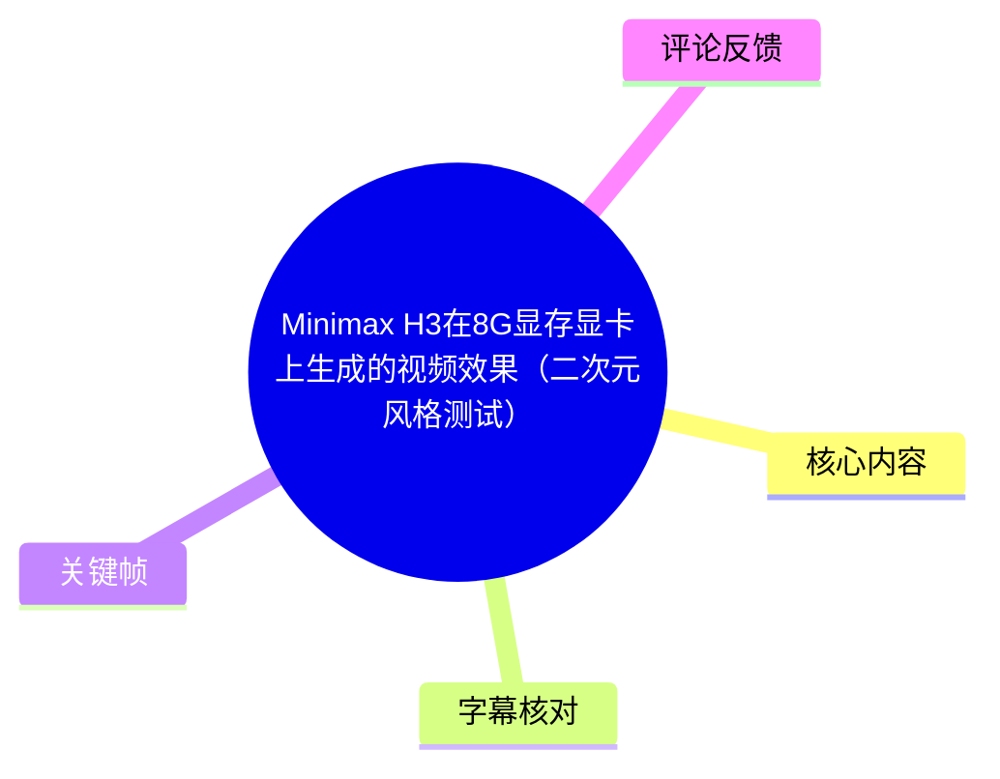
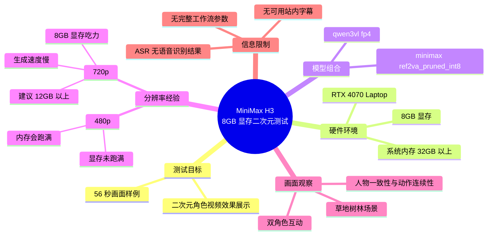

# Minimax H3在8G显存显卡上生成的视频效果（二次元风格测试）

> 来源：[Bilibili 视频](https://www.bilibili.com/video/BV1tjMX6DEyw)  
> UP 主：Farway2077｜发布时间：2026-08-03｜视频时长：00:56  
> 视频定位：在 NVIDIA RTX 4070 Laptop（8GB 显存）上，对 MiniMax H3 进行二次元人物视频生成效果展示。

## 小结

- 这是一段 **56 秒的二次元 AI 视频效果测试**。画面主要展示两名二次元角色在草地、树林与蓝天背景中的互动动作；从关键帧可见，人物服装、发色及背景场景在相邻画面中总体保持连贯。
- UP 主在视频简介中明确给出测试硬件为 **RTX 4070 Laptop，8GB 显存**；其判断是，若使用桌面端显卡，效果“应该会更好”。这属于发布者基于硬件形态作出的经验性判断，并非本视频内的对照测试结论。
- 模型组合为 `qwen3vl fp4` 与 `minimax ref2va_pruned_int8`。简介还指出：**480p 下显存甚至不会跑满，但系统内存需要 32GB 以上，且每次生成都会跑满内存；720p 则对 8GB 显存较吃力、生成速度很慢，建议 12GB 以上显存。**
- 视频本身没有提供可用的站内字幕；本次 ASR 也未识别到任何语音片段。因此，本文对视频画面仅作可见内容描述，技术参数主要依据 UP 主公开简介，不将无法从画面核验的工作流细节补写为既定事实。
- 对准备在中低显存设备上尝试 MiniMax H3 的读者而言，最可迁移的经验是：**480p 是 8GB 显存环境中相对现实的目标，但内存容量同样是硬门槛；若目标为 720p，显存与生成耗时都会成为主要约束。**
- 时效性方面，模型文件、ComfyUI 节点、量化版本及显存优化策略都可能持续更新。简介中的模型链接和评论中的性能反馈应视为视频发布时点的信息，而非长期不变的配置结论。

## 思维导图





## 目录

- [视频定位与信息边界](#视频定位与信息边界-0000)
- [画面效果观察](#画面效果观察-0000)
- [硬件、模型与资源参数](#硬件模型与资源参数-0000)
- [可复现实践信息与缺失项](#可复现实践信息与缺失项-0000)
- [结论、限制与时效性](#结论限制与时效性-0000)
- [字幕比对与选择](#字幕比对与选择)
- [评论分析](#评论分析)
- [处理记录](#处理记录)

## 视频定位与信息边界 [00:00](https://www.bilibili.com/video/BV1tjMX6DEyw?t=0)

视频标题直接表明其内容是 **“Minimax H3 在 8G 显存显卡上生成的视频效果”**，测试风格为二次元。视频总时长仅 56 秒，提供的是生成结果展示，而不是从安装、加载模型到出图的完整教程。

已知的技术信息主要来自 UP 主简介：

| 项目 | 素材中明确给出的信息 |
| --- | --- |
| 测试显卡 | RTX 4070 Laptop，8GB 显存 |
| 模型/组件 | `qwen3vl fp4` + `minimax ref2va_pruned_int8` |
| 480p 资源表现 | 显存“甚至不会跑满”；内存需要 32GB 以上，且每次生成会跑满 |
| 720p 资源表现 | 8GB 显存“稍显吃力”；生成速度“超慢”；建议 12GB 以上显存 |
| 工作流参考 | BV1g9MX6xExH |
| 模型地址 | [ModelScope：Comfy-Org/MiniMax-H3](https://www.modelscope.cn/models/Comfy-Org/MiniMax-H3/files) |

需要区分的是：视频画面可以支撑对最终视觉效果的观察；而模型加载顺序、采样器、步数、提示词、参考图、音频输入、帧数、种子、实际耗时与系统内存型号等信息，均未在本次素材中完整提供，不能据此补全。

## 画面效果观察 [00:00](https://www.bilibili.com/video/BV1tjMX6DEyw?t=0)

视频画面展示两名二次元女性角色在户外草地环境中的互动。可见人物设计具有显著区分度：左侧角色以白色短发、粉色发梢、黑白服装为主；右侧角色为黑色长发、红黑服装，并带有红色头饰。场景背景包括草地、树木、远山、蓝天和白云等元素。


> 图：该帧适合用于观察角色外观设定。两名角色同时处于近景中，白发粉梢与黑发红饰的配色关系明确，可用于检查生成结果中人物服装、发型和饰品是否易于区分。

从提供的关键帧画面可见，视频并非只展示单张静态图，而是包含角色靠近、面向彼此、坐下交流及手部动作等连续情境。就可见帧而言，角色身份在不同镜头中仍可辨识，户外背景的色彩氛围也保持相对统一。


> 图：该帧展示两名角色在草地上进行不同姿势动作的画面，价值在于观察双人同框时的人物位置关系、服装轮廓与肢体动作是否能够同时维持。


> 图：该帧切换至更开阔的蓝天、远山和草地背景。它能够辅助判断角色从前景互动到面对面交流时，场景风格和人物核心特征是否延续。


> 图：该帧呈现双人相对而坐的构图。相较于近景，它更便于检查远景构图中人物比例、衣装主体配色及环境元素之间的关系。

### 从关键帧可见的效果与不能确认的事项

**可以观察到：**

1. 视频采用较鲜明的二次元赛璐璐/插画式人物表达，人物脸部、服装与背景均具有柔化处理和较高饱和度。
2. 两名主角在多帧中持续出现，主色调和基本服饰设定具有连续性。
3. 画面包含双人同框、近景与中远景切换，因而比单一肖像图更能反映角色互动场景下的生成表现。
4. 人物动作主要表现为坐姿、面对面交流、手部与上肢姿态变化；背景维持为自然草地场景。

**不能仅凭当前素材确认：**

1. 无法确认视频具体由多少段生成片段拼接而成。
2. 无法确认是否使用了参考图、角色 LoRA、控制网络、首尾帧控制或后期补帧。
3. 无法获得帧率、单段时长、总采样步数、提示词、负面提示词或随机种子。
4. 未提供原始输入与对照样本，不能量化评价人物一致性、运动幅度、手部稳定性或画面失真率。
5. 视频中是否含有背景音乐或非语音音效无法仅根据 ASR 为空得出结论；ASR 的结果只能说明未识别出可转写的语音。

## 硬件、模型与资源参数 [00:00](https://www.bilibili.com/video/BV1tjMX6DEyw?t=0)

### 硬件条件：8GB 显存可运行，但分辨率决定体验

发布者实际使用的是 **4070 Laptop 8GB**。笔记本 GPU 的功耗、显存带宽、散热和 CPU/内存平台均可能与同型号或相近规格的桌面端设备不同，因此不能把该测试的生成速度直接等同于所有 8GB 显卡的表现。

UP 主给出的分辨率判断如下：

| 目标分辨率 | 显存与内存表现 | 发布者结论 |
| --- | --- | --- |
| 480p | 显存甚至不会跑满；内存每次都会跑满 | 系统内存需 32GB 以上 |
| 720p | 8GB 显存稍显吃力 | 生成速度很慢，建议 12GB 以上显存 |

这里有一个重要实践点：**显存未满不代表机器资源充足。** 在此测试配置下，系统内存反而被描述为每次均会跑满。因此，准备复现时不应只核对显卡显存，也应预留足够的物理内存和页面文件空间，避免因系统内存不足导致进程被终止或系统卡顿。

### 模型与量化组合

简介列出的组合为：

```text
qwen3vl fp4
+
minimax ref2va_pruned_int8
```

从命名可知，素材中至少涉及 FP4 与 INT8 量化版本；但视频没有进一步说明两者的分工、具体文件名、加载器节点、权重精度切换方式或是否还需要配套文本编码器、VAE、音频组件等依赖。

因此，下列判断必须保持克制：

- 可以确认：UP 主将上述两个组件列为本次使用的模型组合。
- 不能确认：`qwen3vl fp4` 是否仅用于视觉理解、提示词处理或其他流程环节。
- 不能确认：`minimax ref2va_pruned_int8` 的精确显存占用、加载顺序和运行参数。
- 不能确认：该组合在不同操作系统、不同 ComfyUI 版本或不同 NVIDIA 驱动版本上的兼容性。

## 可复现实践信息与缺失项 [00:00](https://www.bilibili.com/video/BV1tjMX6DEyw?t=0)

### 已公开的复现路径

视频简介提供了两条可操作的线索：

1. **工作流参考视频**：`BV1g9MX6xExH`
2. **模型文件来源**：[Comfy-Org/MiniMax-H3（ModelScope）](https://www.modelscope.cn/models/Comfy-Org/MiniMax-H3/files)

基于这些已知信息，较稳妥的实践顺序是：

1. 先访问工作流参考视频，核对其展示的 ComfyUI 节点与连接方式。
2. 在模型页面核对模型文件名、发布日期、说明文档、依赖项与更新状态。
3. 以 `qwen3vl fp4` 和 `minimax ref2va_pruned_int8` 作为本视频使用过的组合线索配置环境。
4. 在 8GB 显存设备上优先从 **480p** 尝试，而不是直接以 720p 作为起点。
5. 确认系统物理内存达到或超过 **32GB**，并关注实际内存峰值，而非只监测 GPU 显存。
6. 若需要 720p，优先使用 **12GB 以上显存**设备；即使能够在 8GB 上运行，也应预期速度较慢、显存压力较大。

### 素材未提供的关键参数

以下参数会显著影响 AI 视频结果，但本视频素材没有给出，复现时需要从参考工作流或模型文档中自行核对：

| 参数类别 | 当前是否可确认 | 说明 |
| --- | --- | --- |
| 采样步数 | 不可确认 | 评论中有“25步”说法，但对应另一位用户的 3090 Ti 测试，不可等同于 UP 主测试。 |
| 采样器与调度器 | 不可确认 | 未给出。 |
| 提示词与负面提示词 | 不可确认 | 未给出。 |
| 参考图数量与分辨率 | 不可确认 | 未给出。 |
| 是否输入音频 | 不可确认 | 视频画面与 ASR 结果无法证明工作流是否使用音频条件。 |
| 单次生成时长、帧数、帧率 | 不可确认 | 未给出。 |
| 实际生成耗时 | 不可确认 | 仅有“720p 超慢”的定性描述。 |
| 系统 CPU、内存频率、硬盘和驱动版本 | 不可确认 | 未给出。 |
| 软件版本和自定义节点版本 | 不可确认 | 未给出。 |

## 结论、限制与时效性 [00:00](https://www.bilibili.com/video/BV1tjMX6DEyw?t=0)

这段测试的核心价值在于，它给出了一项具有实际参考意义的硬件边界信息：**8GB 显存的 RTX 4070 Laptop 可以用于 MiniMax H3 的二次元视频生成展示，但更适合以 480p 为优先目标，且必须重视 32GB 以上系统内存。**

对于分辨率选择，可将发布者经验整理为：

- **优先追求可运行性**：从 480p 开始，重点确认系统内存是否足够。
- **优先追求 720p 输出**：将 12GB 以上显存作为更合理的设备起点，并预留更长生成时间。
- **只看显存监控并不充分**：本测试中的主要资源告警来自系统内存，而不是 480p 下的显存占满。
- **桌面卡与笔记本卡不能简单互换结论**：UP 主仅表示桌面端显卡“应该”更好，未提供同条件对比，故该结论应作为经验预期，而非严格基准。

同时，本视频属于短时效果展示，存在以下限制：

1. 没有提供完整工作流和参数，无法做到严格复现。
2. 没有同场景下的其他模型、不同精度或不同显存显卡对比。
3. 没有给出单次生成耗时、成功率及 OOM（显存不足）频率。
4. 关键帧有助于观察画面观感，但不能替代对完整视频逐帧稳定性的评测。
5. 模型页面、量化文件与工作流可能已经更新；应在实际部署前以模型仓库当前文档为准。

## 字幕比对与选择

| 字幕来源 | 完整性 | 专有名词 | 时间轴 | 主要问题 |
| --- | --- | --- | --- | --- |
| Bilibili 站内字幕 | 无可用字幕 | 无法核对 | 无 | 素材明确标注“未提供可用站内字幕”。 |
| 本次 ASR 字幕 | 空 | 无法转写或核对 | ASR 具备时间戳能力，但没有产出分段 | `large-v3-turbo` 自动识别语言为英语，置信度 0.6006；识别结果 `segments=[]`，语音时长为 0 秒。 |

### 字幕选择结论

本视频**没有可用于正文转写的字幕**：

- 站内字幕未提供。
- 本次 ASR 已实际检查，诊断显示未识别到任何语音段落，ASR 输出为空。
- ASR 诊断中**没有**标记 `noAudioStream=true`；因此不能断言源视频没有音轨，也不能将 ASR 空结果解释为“视频确定无声音”。准确表述应为：本次识别未获得可转写的语音内容。
- 正文的时间轴仅使用可确定的全片起点 `00:00`，没有根据文字顺序虚构后续语音段落时间。
- 画面分析改以关键帧与视频标题、简介中的公开技术说明为依据。关键帧中可见有叠加文字的画面，但在缺少可核验字幕和完整帧序时间信息时，未将其扩写为视频口述内容或参数说明。

## 评论分析

以下仅处理本次可获取的热评前三条。评论属于观众反馈或个人测试陈述，除非与视频简介一致，否则不作为视频事实。

### 1. 民圣：`英雄[打call]`

- 点赞数：1。
- 观点概括：单纯表达对发布者或测试成果的鼓励。
- 补充信息：无技术参数、无复现条件。
- 可信度与价值：属于情绪性反馈，可反映正向互动，但不提供可验证的模型性能信息。

### 2. 重塑师：3090 Ti、参考图与音频的补充测试

- 点赞数：2。
- 评论内容要点：该用户称自己用 **3090 Ti**、参考图和音频生成了 4 个 6 秒视频；从上到下第一个为 720P，下面三个为 480P；其使用 25 步，认为耗时长于 LTX 2.3、内存占用也更大，但效果好于 LTX；并期待后续优化。
- 有价值的补充：评论提供了不同硬件环境（3090 Ti）、不同分辨率（720P/480P）、片段数量（4 个）、片段时长（6 秒）和步数（25 步）等具体信息，也提出了与 LTX 2.3 的主观对比。
- 限制：这些信息来自评论者个人陈述，未附工作流、日志、模型版本、精确耗时或对比样本，不能视为对本视频 4070 Laptop 8GB 测试的验证。尤其是“25 步”不能回填为 UP 主视频使用的步数。
- 时效提醒：“今天才开源第一天”的说法来自评论者，反映其评论时点的认知，未在视频简介中独立确认。

### 3. Aozora_hx：对显存门槛的疑问

- 点赞数：1。
- 观点概括：评论者对所需显存表达惊讶，并感叹当前视频 AI 的硬件门槛似乎降低。
- 补充信息：没有提供自身配置、模型版本或测试结果。
- 可信度与价值：可反映观众对“8GB 显存能运行视频 AI”的关注；但该感叹不能替代性能结论。结合视频简介，更准确的理解是：8GB 环境下 480p 可尝试，但仍受 32GB 以上系统内存和 720p 性能压力限制，并非没有硬件门槛。

## 处理记录

- Worker ID：`worker-mrj0wbly-5dc4e50c`
- 模型：`gpt-5.6-terra`
- 调用工具与素材：视频元数据、UP 主简介、关键帧列表（`frames/frame-001.jpg` 至 `frames/frame-012.jpg`）、ASR 诊断与输出、可获取热评前三条。
- 使用的 ASR：`large-v3-turbo`，运行设备为 CUDA，计算类型为 `int8_float16`；识别语言自动判定为英语，概率 `0.6005859375`。
- 字幕检查与选择：已检查站内字幕与本次 ASR。站内字幕无可用内容；ASR 没有识别到语音分段，输出为空。最终不采用任何转写字幕，改以视频标题、简介和关键帧进行事实整理。
- 时间轴依据：ASR 没有产生可用的带时间戳语音分段，站内 SRT 也未提供；因此仅使用可从视频起点确定的 `00:00 / t=0` 时间轴链接，未猜测其他内容出现的秒数。
- 关键帧选择依据：选用 `frame-001.jpg` 至 `frame-004.jpg` 作为正文插图，原因是这些画面分别覆盖双人近景、动作同框、面对面构图和坐姿构图，能辅助观察角色特征、双人关系、动作变化与场景延续性。
- 缓存清理：本次仅基于任务提供的结构化素材和关键帧路径完成整理；未执行额外下载、转码或缓存写入操作，无额外缓存需要清理。
- 未解决问题：缺少完整工作流、提示词、采样参数、参考图/音频输入信息、生成耗时、软件版本和逐帧原始视频信息；无法确认 ASR 为空是因无可识别语音、音轨内容不适合转写，还是其他音频条件所致。
