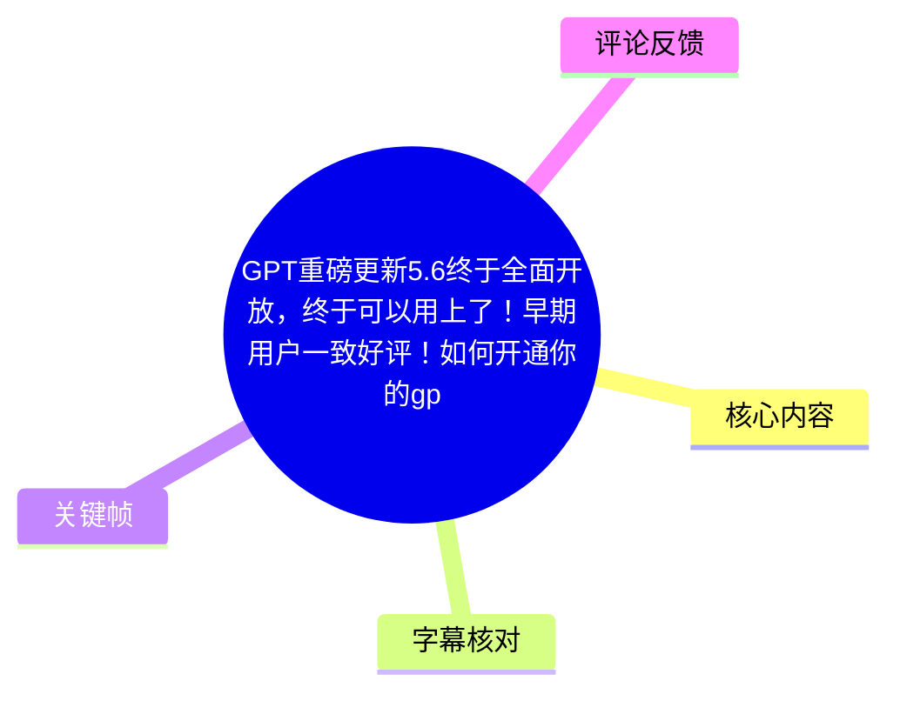
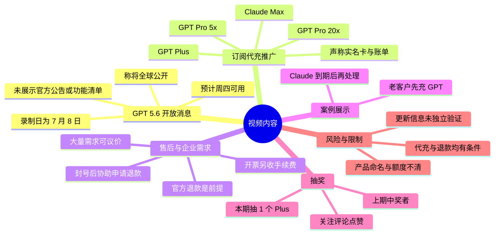
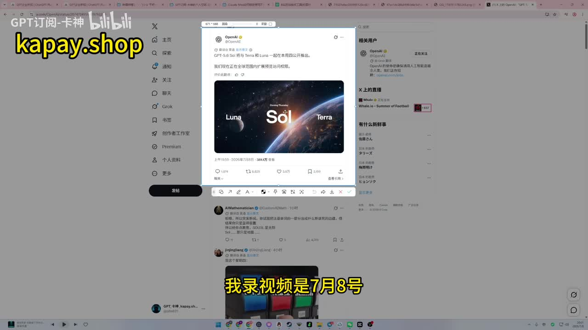
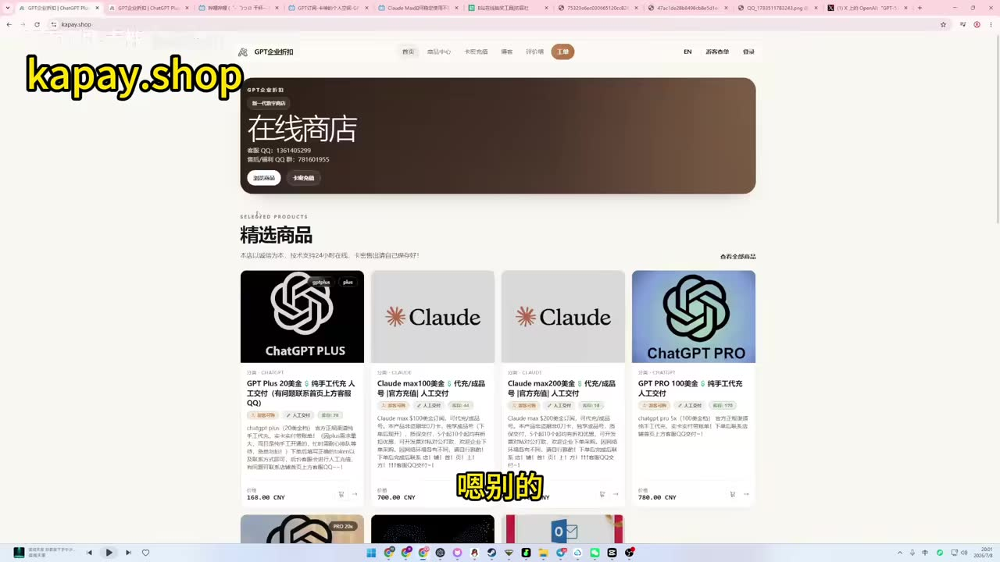
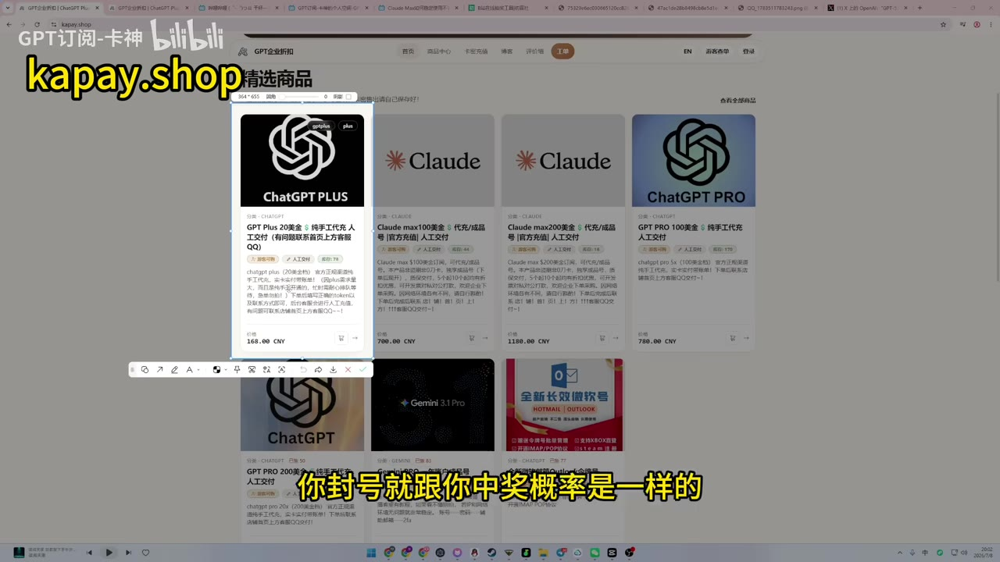
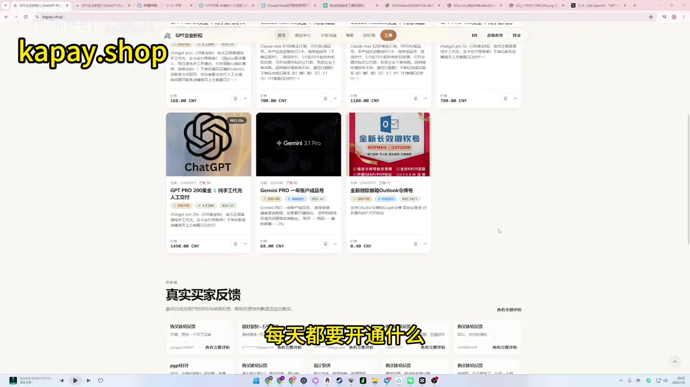

# GPT 5.6 开放消息、订阅代充推广与抽奖说明

> 来源：[Bilibili 视频](https://www.bilibili.com/video/BV19jMV67EUw) 
> UP 主：GPT订阅-卡神｜视频时长：05:43｜分区收藏：AIcode  
> **内容性质说明：**本视频主体是对“GPT 5.6”开放消息的转述，以及 GPT Plus/Pro、Claude Max 等订阅代充服务的推广。涉及模型版本、开放范围、价格、退款和封号风险的表述，均应视为 UP 主的单方陈述，不等同于 OpenAI、Anthropic 或支付平台的官方政策。

## 小结

视频开头称“GPT 5.6”将于录制日后不久在全球范围公开，UP 主称自己在 7 月 8 日录制，推测用户可能在周四即可使用；他还提到已观看部分“小范围测试”用户的评价，并认为相较“5.5”修复了许多问题。不过，视频没有展示可核验的官方公告链接、模型发布说明、功能清单、测试基准或实际产品界面，因此不能据此确认版本名称、具体上线时间、适用套餐与更新内容。

除更新消息外，视频大部分篇幅用于介绍其代充服务。UP 主称可提供 GPT Plus、GPT Pro 5x、GPT Pro 20x，以及 Claude Max 等产品；画面中商城卡片可见部分标价，包括 Plus 168 元、Claude Max 100 美金 700 元、Claude Max 200 美金 1180 元、GPT Pro 100 美金 780 元、GPT Pro 200 美金 1450 元。这里的“5x / 20x”“100 美金 / 200 美金”等命名与具体额度、计费周期和官方套餐的对应关系，视频未完整解释。

UP 主表示其服务为“实名卡、实名户、带账单”，并声称使用正规银行卡开通；如发生 GPT 账号封禁，他可协助向官方申请退款，且“只要能退到我这里”会向用户全额退款。该承诺存在重要前提：是否退款取决于官方是否批准并将款项退回服务商，视频未给出书面售后条款、退款时限、适用情形或争议处理机制。用户不应将“封号概率低”理解为无风险保证。

视频还展示了一则老客户的购买/充值聊天记录作为案例：客户拟购买 GPT 的“20x”与 Claude Max“20x”，但 Claude 服务尚未到期，因此先充值 GPT，Claude 待到期后再处理。UP 主称大额、多账号、企业或中转站类需求可议价，开票可支持但会收取“手续费”。这属于商业服务说明，企业用户尤其应事先确认发票主体、税率、品名、账号归属及服务合规性。

抽奖方面，UP 主公布上期中奖用户为“羊羊成长记”，奖品为价值 168 元的一个月 GPT Plus 代充；本期规则为关注、评论、点赞后抽取 1 名，中奖者需通过 B 站私信提供“没有订阅的 GPT 账号”。该活动的开奖时间、随机方式、资格细则及隐私处理方式未在视频中说明。

## 思维导图

## 目录

- [更新消息与时效边界](#更新消息与时效边界)
- [代充产品、价格与服务表述](#代充产品价格与服务表述)
- [售后承诺与风险条件](#售后承诺与风险条件)
- [企业、批量与发票需求](#企业批量与发票需求)
- [老客户案例与操作流程](#老客户案例与操作流程)
- [抽奖规则与领取步骤](#抽奖规则与领取步骤)
- [关键参数汇总](#关键参数汇总)
- [结论与限制](#结论与限制)
- [字幕比对](#字幕比对)
- [评论分析](#评论分析)
- [处理记录](#处理记录)

## 更新消息与时效边界 [00:00](https://www.bilibili.com/video/BV19jMV67EUw?t=0)

视频首先说明本期有两项内容：抽奖，以及“GPT 5.6”即将全球公开的消息。UP 主口述称，自己在 7 月 8 日录制视频，按美国时间推测，用户可能在紧接着的周四使用到该版本。

UP 主称自己参考了此前已获得“5.6”小范围测试资格的企业或用户评价，认为这些评价“比较中肯”；同时表示“5.5 修复了很多问题”，因此建议观众对 5.6 抱有期待。这里需要区分三层信息：

1. **视频中的消息源表述：**UP 主在浏览器中展示了一个标有 OpenAI 的社交媒体页面，并以此说明“GPT-5.6 即将与 Terra 和 Luna 一起在本周四公开推出”。
2. **UP 主的判断：**他认为早期用户评价较正面，也认为此前版本修复问题值得期待。
3. **尚未在素材中得到证实的部分：**模型版本是否正式命名为“GPT 5.6”、何时面向哪些地区或套餐开放、Terra/Luna 的具体含义、更新能力与限制，均没有通过视频中的官方产品页、公告原文或实测予以确认。

> 图：画面展示了 UP 主用于说明开放消息的社交媒体网页，页面中可见“GPT-5.6”以及“Terra”“Luna”等文字。这张图的价值在于还原视频的主要信息来源；但它不是可独立确认发布状态的官方产品公告，阅读时应保留核验意识。

### 信息时效性

该视频发布于元数据所示的 2026 年 7 月，且口述消息依赖当时的“本周四”预期。模型名称、可用地区、排队节奏、套餐权限、价格和功能都可能随官方更新调整。对订阅或业务流程有影响的读者，应以目标账号内实际可见的模型列表及官方帮助中心/公告为准，而非仅依据本视频。

## 代充产品、价格与服务表述 [00:54](https://www.bilibili.com/video/BV19jMV67EUw?t=54)

进入推广环节后，UP 主介绍其所称的“带充”服务，口述提及：

- GPT Plus；
- GPT Pro 5x；
- GPT Pro 20x；
- Claude Max；
- 面向用量较大的用户可进一步沟通优惠。

他强调其开通方式为“实名卡、实名户、带账单”，并称使用正规银行卡；但视频没有披露付款账户归属、用户是否获得订阅账户的完整控制权、账单抬头、扣款续费机制、是否存在共享/代管账号，以及与平台服务条款的关系。因此，“正规银行卡”是服务商自述，不能自动推导出服务完全符合平台规则或适合全部用户。

> 图：商城页面列出 ChatGPT Plus、Claude Max、ChatGPT Pro 等商品卡片，是理解视频推广范围和画面标价的直接依据。它同时显示这些服务以第三方商城形式展示，而非 OpenAI 或 Anthropic 官方订阅页面。

### 画面可见商品与标价

以下价格来自关键帧中的商城页面，仅记录画面可辨识内容；价格币种为页面显示的 CNY，且不代表官方定价、实时库存或最终成交价。

| 画面商品名称 | 页面可见标价 | 视频口述/页面补充 | 不确定点 |
| --- | ---: | --- | --- |
| GPT Plus 20 美金 | 168.00 CNY | 页面称“纯手工代充”；UP 主称本期抽同类 Plus | “20 美金”与一个月服务、账号地区、是否自动续费的对应关系未说明 |
| Claude Max 100 美金 | 700.00 CNY | 商品卡片可见 | 具体套餐权益、周期与账号要求未说明 |
| Claude Max 200 美金 | 1180.00 CNY | 商品卡片可见 | 同上 |
| GPT Pro 100 美金 | 780.00 CNY | UP 主口述为“Pro 5x 780” | “5x”具体指什么未解释 |
| GPT Pro 200 美金 | 1450.00 CNY | UP 主口述“20x”“Pro 20x” | “20x”具体额度、使用周期和限制未解释 |
| Gemini Pro 一年账户/成品号 | 68.00 CNY | 仅画面可见，非视频口述重点 | 未介绍具体服务内容 |
| Outlook 等邮箱服务 | 0.40 CNY | 仅画面可见 | 与本期主题关联有限，未展开说明 |

## 售后承诺与风险条件 [01:20](https://www.bilibili.com/video/BV19jMV67EUw?t=80)

UP 主针对账号封禁与退款提出如下说法：

- 称 GPT 封号“很少很少”，并以“跟中奖概率一样”形容其低概率；
- 若用户确实被封号，可协助向官方申请退款；
- “只要能退到我这里”，则其“马上全给你退”；
- 该表述意在强调其售后保障。

> 图：画面突出 ChatGPT Plus 商品卡片，并出现“你封号就跟你中奖概率是一样的”字幕。这张图适合用于识别该段的核心营销承诺，同时也提示读者：低封号概率是 UP 主的主观说法，并非风险评估报告或官方保证。

### 应如何理解退款承诺

视频给出的退款逻辑是“官方退款成功 → 退款到服务商 → 服务商全额退还给用户”。因此至少包含以下限制：

1. **官方审核是必要条件。**如果官方不退款，视频并未说明服务商是否自行赔付。
2. **退款路径需要可追溯。**UP 主明确使用“能退到我这里”作为条件；若支付或账单路径复杂，退款可达性会直接影响结果。
3. **缺少书面细则。**视频未说明封禁原因、账号异常、用户操作、服务已使用天数、汇率变化、优惠差额等情形如何处理。
4. **“封号很少”不可量化。**没有样本量、统计时间段、账号类型或平台依据，不能视为概率承诺。
5. **平台规则风险未被展开。**第三方代充、代管支付、跨地区订阅或账单方式是否符合服务平台条款，需要用户自行核验。

在购买前，较稳妥的做法是要求明确保存商品页面、付款记录、服务承诺、订阅周期、账号归属、退款条件和开票信息；不要仅将口头或视频说法作为唯一保障。

## 企业、批量与发票需求 [02:06](https://www.bilibili.com/video/BV19jMV67EUw?t=126)

UP 主称，如果用户是“料理师”（ASR 疑似误识别，结合上下文更可能是某类职业称谓）或公司用户，且每月用量较多、每日需要频繁开通服务，可以联系其议价。后续他再次提及“公司”“中转站”及一天需要开通多个 Pro 20x 的场景，表示数量较多时可谈优惠，Plus、Pro、Claude 等均可讨论。

视频还说明可以开票，但需收取一点“手续费”；UP 主认为个人用户通常没有必要开票，企业报销用户需求更多。

> 图：画面位于商品列表下方，可见“真实买家反馈”区域，字幕为“每天都要开通什么”。它有助于理解 UP 主将服务定位为高频或批量订阅需求，但页面反馈本身不构成服务质量或合规性的独立证明。

### 企业用户应补充确认的事项

视频并未提供企业采购流程。若确有报销、批量开通或长期使用需求，至少应确认：

- 发票开具主体、发票类型、税率、项目名称与手续费金额；
- 账号是否由员工自行控制，员工离职后如何交接；
- 订阅是否支持合法的团队/企业管理方式；
- 批量开通是否影响账号安全、付款追溯或平台风控；
- 服务有效期、售后响应时间、退款责任和数据安全边界；
- 若涉及 Claude、ChatGPT 等不同平台，分别适用何种账号、地区与使用政策。

这些并非视频给出的操作步骤，而是由视频信息不完整所引出的必要核验项。

## 老客户案例与操作流程 [02:36](https://www.bilibili.com/video/BV19jMV67EUw?t=156)

UP 主展示一位老客户的聊天记录作为案例。根据口述，客户想同时购买 GPT “20x”与 Claude Max“20x”，但此前购买的 Claude 服务尚未到期，因此双方采取“先处理 GPT、Claude 到期后再处理”的顺序。UP 主表示客户希望获得优惠，而其对老客户或购买量较多的客户可给予优惠。

该案例可整理为视频所展示的处理流程：

1. 用户提出需要的服务组合，例如 GPT 与 Claude 两种订阅；
2. 检查已有服务是否尚在有效期；
3. 对尚未到期的项目暂不处理；
4. 先为可立即开通的项目充值/代充；
5. 待另一项目到期后，再联系服务商继续处理；
6. 若为老客户或批量需求，可就价格协商。

### 案例的适用边界

该过程是 UP 主对一名客户的服务安排，不是官方订阅迁移或续费流程。视频没有说明旧订阅与新订阅如何衔接、是否会损失剩余权益、聊天记录是否完整、优惠规则是否固定，也没有展示最终 Claude 开通结果。因此它只能说明其宣称的“按到期时间分批处理”方式，不能作为普适承诺。

## 抽奖规则与领取步骤 [03:25](https://www.bilibili.com/video/BV19jMV67EUw?t=205)

视频后段公布了上期抽奖结果，并继续开展本期活动：

- **上期中奖用户：**“羊羊成长记”；
- **上期奖品：**价值 168 元的 Plus，UP 主称为一个月的“纯手工代充”；
- **通知方式：**UP 主称会在本期视频下方 @ 中奖用户，并通过 B 站后台私信联系；
- **领取信息：**中奖者需回复并提供一个“没有订阅的 GPT 账号”；
- **本期参与条件：**关注、评论、点赞；
- **本期奖品数量：**抽取 1 个 Plus；
- **本期奖品标称价值：**168 元。

### 参与者需要注意的限制

视频没有交代开奖日期、抽取方法、重复中奖限制、是否需要满足地区或账号条件、中奖后的回复期限，以及账号信息如何保护。特别是账号属于个人数字资产，若通过私信向第三方提供账号或与订阅有关的信息，应避免提供密码、验证码、双重验证恢复码等敏感凭据，并先确认对方账号身份及所需授权范围。

## 关键参数汇总 [04:21](https://www.bilibili.com/video/BV19jMV67EUw?t=261)

| 项目 | 视频中的信息 | 需要保留的限制 |
| --- | --- | --- |
| 视频时长 | 343 秒（05:43） | 单集，无分 P |
| 更新主题 | 称“GPT 5.6”将全球公开 | 缺少独立可核验的官方发布材料 |
| 录制时间口述 | 7 月 8 日 | 未说明年份、时区；元数据显示为 2026 年 7 月 |
| 上线预期 | 预计美国时间周四可用 | 是预测性表述，可能已过期或与实际不同 |
| GPT Plus 页面标价 | 168.00 CNY | 第三方页面显示，非官方价格证明 |
| GPT Pro 100 美金页面标价 | 780.00 CNY | “5x”的具体权益不明 |
| GPT Pro 200 美金页面标价 | 1450.00 CNY | “20x”的具体权益不明 |
| Claude Max 100 美金页面标价 | 700.00 CNY | 套餐权益及周期未展开 |
| Claude Max 200 美金页面标价 | 1180.00 CNY | 套餐权益及周期未展开 |
| 封号售后 | 可协助申请官方退款 | 以官方退款成功并退至服务商为前提 |
| 批量需求 | 可沟通优惠 | 无公开阶梯价或书面协议 |
| 发票 | 可开，收手续费 | 手续费、票种、主体和税率未说明 |
| 本期抽奖 | 关注、评论、点赞，抽 1 个 Plus | 缺少开奖机制和时间说明 |

## 结论与限制 [05:14](https://www.bilibili.com/video/BV19jMV67EUw?t=314)

这是一支以“GPT 5.6 即将开放”为引子、以订阅代充服务和互动抽奖为核心的推广视频。对于关注 AI 产品动态的观众，最有价值的信息是：UP 主声称存在一次即将到来的版本开放，以及其观察到部分早期用户评价；但视频没有提供具体功能、性能对比、官方公告链接或实测，所以该部分应作为待核验线索，而不是可直接执行的产品决策依据。

对于考虑购买服务的用户，视频给出了商品范围、部分价格、批量议价、分批续费、开票和退款协助等信息，但关键交易条件不够完整。尤其是“实名”“正规银行卡”“封号很少”“全额退款”等词语属于服务商陈述，均应结合书面服务条款、平台规则、付款凭证和账号控制权进一步确认。

视频可迁移的经验是：订阅类数字服务应在购买前明确**产品权益、账号归属、支付路径、续费机制、退款条件、发票信息与风险责任**。若信息仅来自营销口述或第三方商城页面，不能替代官方渠道的套餐说明。

## 字幕比对 [05:27](https://www.bilibili.com/video/BV19jMV67EUw?t=327)

本次任务中**未提供可用 Bilibili 站内字幕**；但已执行本次 ASR，并以 ASR 为正文主要文字依据，再用关键帧画面与上下文对明显误识别处进行保守标注。

| 字幕来源 | 完整性 | 专有名词 | 时间轴 | 主要问题 |
| --- | --- | --- | --- | --- |
| Bilibili 站内字幕 | 未提供，无法评估 | 无法评估 | 无法评估 | 素材中没有可用字幕文件，不能用于转录或交叉校验 |
| 本次 ASR 字幕 | 基本覆盖完整视频口述 | 较多误识别或混淆 | 提供连续文本，未提供逐句精确时间码 | GPT/GPT Pro/Claude/Plus 被识别为“Gbd”“cloud”“帕拉”等；“5x/20x”“代充”“手续费”等局部词语不稳定；有重复和断句问题 |

### 最终字幕选择与校正原则

- **最终选择：**采用本次 ASR 字幕作为主文本来源，因为没有站内字幕可用。
- **画面校正：**根据商城关键帧，将 ASR 中的“Gbd”“GbT”等统一按上下文记录为 **GPT / ChatGPT**；将“cloud”按商品画面和口述上下文记录为 **Claude**；“帕拉/PASS”等记录为 **Plus**。
- **不确定词保留：**“料理師”在 ASR 中出现但与语境不完全吻合，未擅自改写为特定职业；“5x”“20x”虽可由上下文和商品卡片识别为产品命名的一部分，但其含义未在视频中解释。
- **时间轴说明：**正文时间点依据视频顺序和时长进行章节级定位，不应视为逐字字幕时间码。

## 评论分析 [05:34](https://www.bilibili.com/video/BV19jMV67EUw?t=334)

仅获取到 2 条热评，少于要求上限“前三条”；以下仅分析已获取内容，不补造第 3 条评论。

1. **@暴躁正义老哥（1 赞）：**“别瞎宣传，只会寒了粉丝的心”  
   - 观点：对视频中的宣传内容表达直接质疑。  
   - 可反映的争议：评论指向更新消息或服务推广的可信度问题，与视频未提供官方公告、功能证据和完整售后细则的事实相呼应。  
   - 限制：评论没有列出具体哪项宣传不实、没有附证据，因此它只能说明存在不信任情绪，不能据此判定视频内容为虚假。

2. **@回转小摩托（1 赞）：**“要是没开我就回来骂你”  
   - 观点：将是否实际开放作为检验 UP 主预告的条件。  
   - 可反映的争议：观众关注的核心是“GPT 5.6 是否会按预告时间开放”，也说明该信息具有明显的时效性和可验证性。  
   - 限制：这是一则条件式质疑，并未提供后续验证结果，不能证明实际是否已开放。

## 处理记录 [05:40](https://www.bilibili.com/video/BV19jMV67EUw?t=340)

- **Worker ID：**worker-mrj0wjed-b0c290ad
- **模型：**gpt-5.6-terra
- **调用工具与素材：**使用任务提供的元数据、视频素材清单、ASR 字幕、热评 JSON、封面信息及关键帧进行整理；未引入未提供的外部网页检索结果。
- **使用的应用工具：**视频合并产物 `merged.mp4`、音频 `audio/audio.wav`、关键帧目录 `frames/`、ASR 目录 `asr/`、评论文件 `comments/comments.json`、信息文件 `info.json`；相关素材已由上游任务生成。
- **字幕选择：**站内字幕未提供可用文件；本次 ASR 已执行并作为主字幕来源。针对 GPT、Claude、Plus 等明显识别错误，结合关键帧与上下文进行了最小化校正；未对无法确认的词语强行补写。
- **关键帧选择依据：**
  - `frames/frame-001.jpg`：展示 UP 主引用的“GPT-5.6”开放消息页面，支撑新闻来源说明；
  - `frames/frame-002.jpg`：展示商城商品总览和部分价格，支撑产品范围与标价记录；
  - `frames/frame-003.jpg`：展示 Plus 商品与封号概率说法，支撑风险和售后分析；
  - `frames/frame-004.jpg`：展示反馈区与批量开通语境，支撑企业/高频需求段落。
- **缓存清理：**本 Agent 未创建额外临时缓存；任务提供的 `merged.mp4`、音频、ASR、评论与关键帧均为应保留的交付素材，未删除。
- **未解决问题：**
  - 未提供官方公告、产品更新日志、实测数据，无法独立确认“GPT 5.6”、Terra、Luna 及其开放时间和能力；
  - 代充商品中“5x”“20x”“100 美金/200 美金”的实际权益、周期与规则未充分说明；
  - 退款、封号、开票、批量折扣和抽奖的完整书面规则均未在素材中提供；
  - 仅获取到 2 条热评，无法分析第 3 条。

## 评论分析

本次流程未获取到可用热评，因此不推断观众态度或额外结论。
