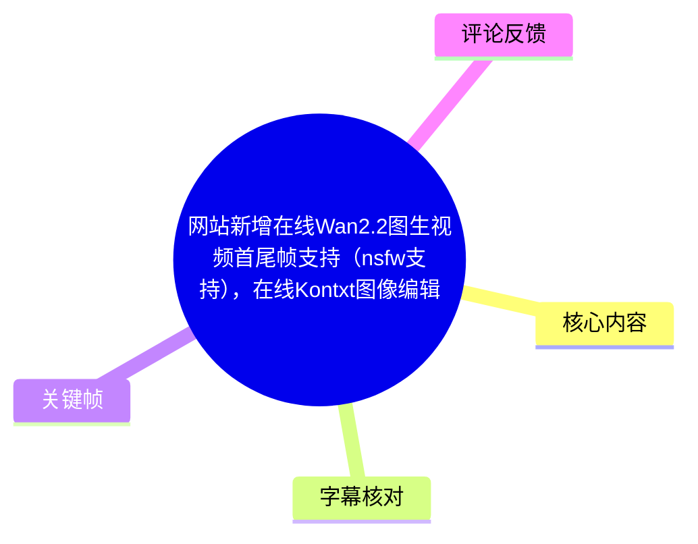
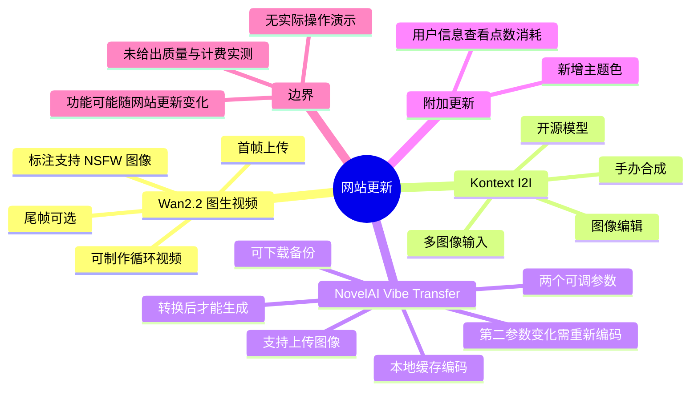
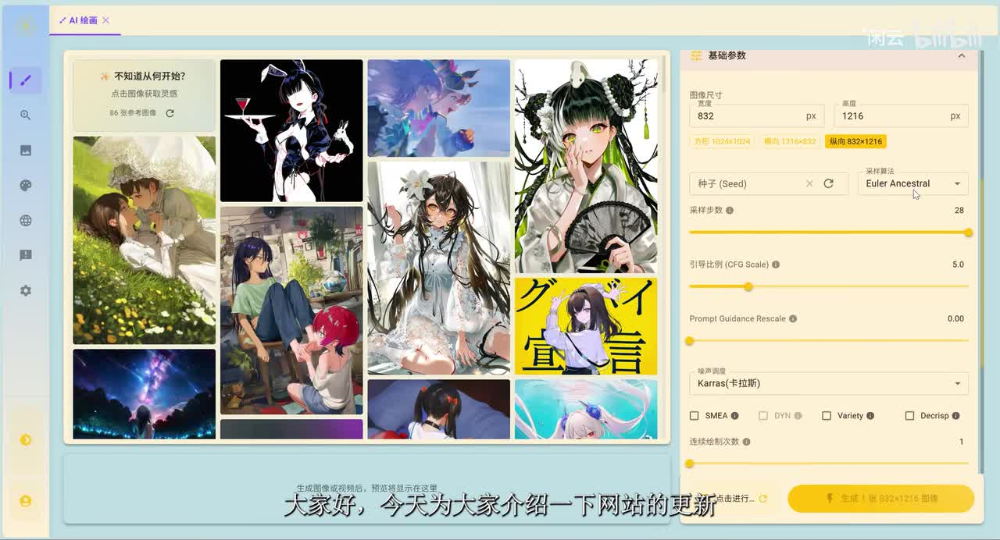
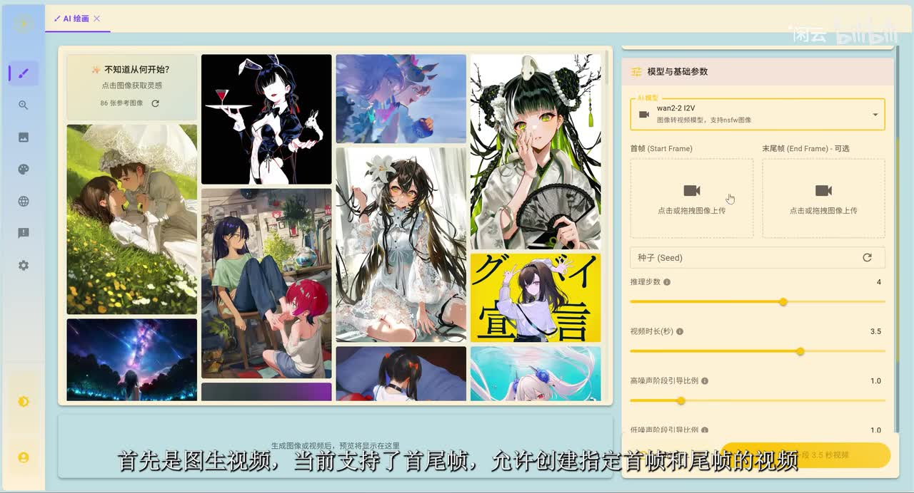
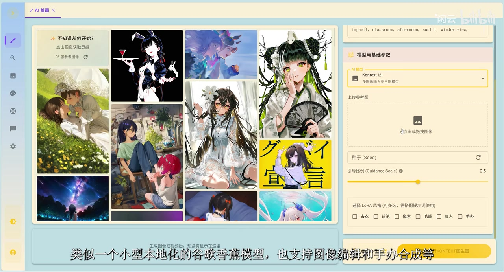

# 网站新增在线Wan2.2图生视频首尾帧支持（nsfw支持），在线Kontxt图像编辑，以及NovelAI Vibe Transfer编码转换支持

> 来源：[Bilibili 视频](https://www.bilibili.com/video/BV1LjWNznEzi)  
> UP 主：゚゚゚゙゚闲云｜发布时间：2025-09-18｜视频时长：1 分 47 秒  
> 视频所述网站地址：`nai.idlecloud.cc`

## 小结

本视频是对网站功能更新的简短介绍，UP 主明确表示由于剪辑演示视频麻烦，**本期不做实际操作演示**，而是口述功能并展示界面。因此，视频能确认的是功能入口、部分界面字段和使用规则；对生成质量、速度、实际成功率及收费规则均未提供实测结论。

第一项更新是 **Wan2.2 图生视频（I2V）支持首帧与尾帧**。用户可上传起始图和可选的结束图，让生成视频向指定终态收束；UP 主指出可据此制作循环视频等效果。界面文字还标注该模型“支持 nsfw 图像”，这只是视频对该站点当前功能/能力的陈述，不等同于对内容合规性、可用地区或具体审核规则的保证。

第二项更新为 **Kontext I2I 图像编辑**。视频称其为一个名称“不太会念”的开源模型，并将其类比为“小型、本地化的谷歌香蕉模型”；该比喻用于说明其定位，不能据此推导其与任何其他模型的实际性能等价。UP 主表示它支持图像编辑和“手办合成”等用途。

第三项更新面向 **NovelAI 第四版图像模型的 Vibe Transfer**：除既有的特定格式文件上传方式外，现在还可以上传图像。图像上传后可调整两个参数；但改动第二个参数时需要重新编码。转换可由图像左上角的按钮触发，转换完成后才能进行图像生成。

关键经验是编码数据会保存在本地数据库缓存中：已转换过的内容后续无需再次转换，删除页面内容也不会影响缓存；但若需要清理缓存或更换浏览器，应先下载编码文件保存。UP 主还提到可在用户信息中查看点数消耗，说明此功能存在点数消耗维度，但本视频没有给出具体价格、计费公式或额度。

## 思维导图

## 目录

- [背景、范围与时效性](#背景范围与时效性)
- [Wan2.2：首尾帧图生视频](#wan22首尾帧图生视频-0000)
- [Kontext I2I：在线图像编辑](#kontext-i2i在线图像编辑-0023)
- [NovelAI Vibe Transfer：编码转换与缓存](#novelai-vibe-transfer编码转换与缓存-0047)
- [主题色与点数信息](#主题色与点数信息-0130)
- [可执行操作流程](#可执行操作流程-0000)
- [限制、风险与结论](#限制风险与结论)
- [字幕比对](#字幕比对)
- [评论分析](#评论分析)
- [关键帧索引](#关键帧索引)
- [处理记录](#处理记录)

## 背景、范围与时效性 [00:00](https://www.bilibili.com/video/BV1LjWNznEzi?t=0)

视频发布于 2025 年 9 月，介绍的是 `nai.idlecloud.cc` 当时的一次网站更新。其内容包括图生视频、图像编辑、NovelAI Vibe Transfer 编码兼容和主题色，不是模型原理教学，也不是完整使用教程。

UP 主在开场说明不制作实际演示，因此阅读本笔记时应区分：

- **视频明确陈述**：功能支持范围、编码转换条件、本地缓存与下载建议。
- **关键帧可见**：界面中出现的模型名称、上传区域、字段名称及当时展示的数值。
- **不能据视频确认**：服务当前是否仍在线、账号门槛、订阅价格、NSFW 的具体边界、生成结果质量、排队时间、模型版本是否更新。

> 图：开场展示网站的 AI 绘画页面、图库和“基础参数”侧栏，能确认本期内容基于网页端界面介绍；右侧可见图像宽高、采样器、步数、CFG 等常规生成设置，但这些不是视频专门宣布的新功能。

## Wan2.2：首尾帧图生视频 [00:00](https://www.bilibili.com/video/BV1LjWNznEzi?t=0)

### 更新内容

根据 ASR 在 00:00.370—00:20.570 的口述，网站的图生视频功能已支持：

1. 指定**首帧**；
2. 指定**尾帧**；
3. 由首尾图共同约束视频生成；
4. 可用于“创建循环视频之类”的用途。

关键帧中的模型下拉框显示为 **`wan-2.2 I2V`**，其下方说明为“图像转视频模型，支持 nsfw 图像”。页面将上传位明确划分为：

- `首帧 (Start Frame)`
- `末尾帧 (End Frame) - 可选`

这里“尾帧可选”意味着只上传首帧仍是允许的界面路径；上传尾帧则用于向特定终态进行引导。视频没有说明首帧与尾帧的推荐尺寸、兼容格式、文件大小上限，也没有展示生成成片。

> 图：该帧直接展示 `wan-2.2 I2V`、首帧与可选末尾帧两个上传框，是确认“首尾帧支持”及尾帧可选属性的核心画面证据；模型说明中还可见“支持 nsfw 图像”的界面标注。

### 画面中可读的当时参数

以下是关键帧展示的界面值，不应视为唯一推荐配置：

| 字段 | 关键帧可见值 | 含义与注意事项 |
| --- | ---: | --- |
| AI 模型 | `wan-2.2 I2V` | 图像转视频模型入口。 |
| 首帧 | 待上传 | 视频的起始视觉条件。 |
| 末尾帧 | 可选、待上传 | 用于指定视频收束时的视觉条件。 |
| 种子（Seed） | 未填写 | 可输入或刷新；视频未说明复现机制。 |
| 推理步数 | `4` | 截图显示值；没有比较不同步数的质量差异。 |
| 视频时长（秒） | `3.5` | 截图显示值；视频未说明可设范围。 |
| 高噪声阶段引导比例 | `1.0` | 截图显示值；未解释其算法作用。 |
| 低噪声阶段引导比例 | `1.0` | 截图显示值；未解释其算法作用。 |

> 图：画面突出显示“末尾帧（End Frame）- 可选”，同时可读到推理步数 4、视频时长 3.5 秒及两个引导比例均为 1.0，适合作为界面参数的留档，而非效果验证。

### 首尾帧制作循环的理解边界

UP 主只说“可以依据这个创建循环视频之类的”。可据此整理为一个目标导向的使用思路：准备视觉上能够衔接的起始图与结束图，通过首尾帧约束产生一段过渡，再观察结尾是否便于与开头拼接。

不过，视频**没有**承诺生成结果必然无缝循环；首尾人物、构图、背景、光照和动作的一致性会影响可拼接程度，且没有提供实例验证。

## Kontext I2I：在线图像编辑 [00:23](https://www.bilibili.com/video/BV1LjWNznEzi?t=23)

ASR 在 00:23.450—00:47.510 中提到，网站增加了另一个开源模型。UP 主称自己“不太会念”其名称，并用“小型本地化的谷歌香蕉模型”描述其定位；结合视频标题与关键帧，界面名为 **`Kontext I2I`**。

视频明确列举的能力包括：

- 图像编辑；
- 手办合成；
- 关键帧标注的“多图像输入图生图模型”。

因此它不是本期展示的首尾帧视频模型，而是一个图像到图像的编辑入口。视频没有展示具体提示词、编辑前后对比或手办合成样例，故不能从本期材料推定其角色一致性、文本指令遵循能力或多图融合质量。

> 图：右侧模型栏显示 `Kontext I2I` 和“多图像输入图生图模型”，并提供“上传参考图”区域；这说明它的输入形态是参考图驱动的图像编辑，而非纯文本生成。

### 界面可见项目

| 项目 | 画面信息 | 可确认范围 |
| --- | --- | --- |
| 模型 | `Kontext I2I` | 页面所选图像编辑模型。 |
| 输入 | “上传参考图” | 可上传参考图片，画面还标注多图像输入。 |
| 种子（Seed） | 输入框及刷新按钮 | 可见有种子字段，但未说明随机性或复用效果。 |
| 引导比例（Guidance Scale） | `2.5` | 仅为截图当时数值。 |
| LoRA 风格 | “可多选，需搭配提示词使用” | 可见选项有去衣、铅笔、像素、毛绒、真人、手办等。 |

关于 LoRA 选项，视频没有讲解每项效果、适用素材和内容规则；尤其是界面中的敏感导向标签，不能据此推定可用性或绕过任何平台规则。应以服务当时的提示与适用法律、平台政策为准。

## NovelAI Vibe Transfer：编码转换与缓存 [00:47](https://www.bilibili.com/video/BV1LjWNznEzi?t=47)

### 功能更新与前置条件

根据 ASR，网站对“第四版 NovelAI 图像模型”增加了 Vibe Transfer 支持扩展：

- 原本可上传特定格式文件；
- 现在同步支持上传**图像**；
- 图像上传后可调整**两个参数**；
- 如果改变**第二个参数**，就需要对文件重新编码。

视频和所给关键帧没有展示 Vibe Transfer 的具体页面，也未给出两个参数的名称、数值范围、默认值或编码格式。因此，不能补写这些缺失参数，更不能假设其与 NovelAI 官方产品中的任意字段完全一致。

### 转换、生成与缓存规则 [00:47](https://www.bilibili.com/video/BV1LjWNznEzi?t=47)

视频给出的工作规则可整理为：

1. 上传符合入口要求的图像，或沿用原有的特定格式文件路径。
2. 根据需要调整两个参数。
3. 若改动第二个参数，需执行编码转换。
4. 可点击**图像左上角按钮**发起转换。
5. **必须在转换完成后**才能执行图像生成。
6. 每个参数对应的编码结果会缓存到本地数据库；同一已转换内容后续无需再次转换。
7. 可在“用户信息”中查看点数消耗情况。

其中“无需再次转换”适用于视频所述的同一缓存条件，并不表示跨浏览器、清缓存、设备迁移后仍然可用。

### 本地缓存与备份 [01:14](https://www.bilibili.com/video/BV1LjWNznEzi?t=74)

ASR 00:74.700—00:87.880 段说明编码数据保存在本地缓存中，UP 主给出的建议是：

- 删除当前页面内容后，缓存仍在，因此“删除后也没有任何问题”；
- 若要清理缓存，或计划更换浏览器，务必点击**下载按钮**保存编码；
- 下载的目的在于保留已完成的编码结果，避免因本地缓存丢失而需要再次转换。

这是一条明确的数据持久化经验：不要把浏览器本地缓存当作可靠长期存档。视频未说明下载文件的扩展名、导入位置、是否可跨账号使用、是否包含原图或是否存在隐私风险；这些均需在实际页面中另行核对。

## 主题色与点数信息 [01:30](https://www.bilibili.com/video/BV1LjWNznEzi?t=90)

在 01:30.370—01:38.930，UP 主提到新增了主题色，并评价其“没什么用”；用户可以按喜好选择，UP 主以玩笑方式说第二个配色“适合猛男使用”。

这项更新属于界面外观调整，不影响上述模型工作流。视频也仅提到可在用户信息中查看点数消耗，并**未**公布：

- 点数获取方式；
- 月费或订阅档位；
- 各模型每次任务的点数消耗；
- 编码转换是否单独扣点；
- 点数有效期与退款规则。

因此，任何成本判断都不能仅依据本视频或评论作出。

## 可执行操作流程 [00:00](https://www.bilibili.com/video/BV1LjWNznEzi?t=0)

以下流程严格按视频口述与画面可确认信息整理；未出现的步骤不作补充。

### A. 使用 Wan2.2 首尾帧图生视频

1. 进入网站的 AI 绘画/生成页面。
2. 在模型下拉框中选择 `wan-2.2 I2V`。
3. 在“首帧（Start Frame）”区域上传起始图。
4. 如需约束结尾画面，在“末尾帧（End Frame）- 可选”区域上传结束图。
5. 按需要设置种子、推理步数、视频时长和高/低噪声阶段引导比例。视频截图中分别可见 `4`、`3.5`、`1.0`、`1.0`，但未说明推荐范围。
6. 发起生成并在页面下方预览区查看结果。

> 视频未展示生成按钮后的过程、队列状态或导出步骤，也未演示循环视频的实际拼接。

### B. 使用 Kontext I2I 编辑图像

1. 选择 `Kontext I2I` 模型。
2. 在“上传参考图”区域添加一张或多张图片。
3. 如有需要，设置种子、引导比例，或搭配提示词选择 LoRA 风格。
4. 围绕图像编辑或手办合成目标执行生成。

> 视频没有展示提示词写法、参考图数量上限及输出示例；“手办合成”仅为 UP 主口述支持的场景。

### C. 使用 NovelAI Vibe Transfer 图像编码

1. 在 NovelAI 第四版模型对应入口上传图像，或使用原有特定格式文件。
2. 调整页面提供的两个参数。
3. 当第二个参数被改动时，点击图像左上角的转换按钮重新编码。
4. 等待转换完成，再进行图像生成。
5. 后续复用相同已缓存编码内容时，无需再次转换。
6. 需要清理缓存或迁移浏览器前，点击下载按钮保存编码文件。
7. 在用户信息页面核对点数消耗。

## 限制、风险与结论

### 视频材料的限制

- 本期为口述介绍，UP 主明确未做完整演示。
- 没有展示 Wan2.2 成片、Kontext 编辑成果或 Vibe Transfer 的转换页面。
- NovelAI Vibe Transfer 的两个参数没有名称，无法据此写出精确调参方法。
- 画面中的数值仅是录制时界面状态，不是官方推荐配置。
- `nsfw` 支持来自模型下拉框的文字及视频标题描述；具体可生成范围、审核标准和法律责任均未说明。

### 可迁移的经验

1. **首尾帧是运动终态约束，不是无缝循环保证。** 若目标是循环，应从源图构图和首尾视觉衔接入手验证。
2. **本地缓存需主动备份。** Vibe Transfer 的编码结果可减少重复转换，但浏览器缓存不等于可靠存储；清理数据、使用无痕窗口或换浏览器前应下载保存。
3. **把“界面有参数”与“参数已被解释”分开。** 本视频能记录字段存在和画面数值，不能推导参数的最佳组合或底层机理。
4. **成本需要以当前页面为准。** 视频只确认有点数消耗查看入口，没有给出定价证据。

### 时效性

本视频反映的是 2025 年 9 月发布时的网站状态。网站模型、界面、上传限制、点数消耗、账号策略与内容规则都可能在之后改变。实际使用前，应以网站实时页面、服务协议和适用规则为准。

## 字幕比对

| 字幕来源 | 完整性 | 专有名词 | 时间轴 | 主要问题 |
| --- | --- | --- | --- | --- |
| Bilibili 站内字幕 `p01-ai-zh.srt` | 与视频主题完全不符 | 未出现 Wan2.2、Kontext、NovelAI、Vibe Transfer | 分段完整但对应的是另一段“开学赶作业”音频/文本 | 明显错配，不能用于本视频内容整理 |
| 本次 ASR 字幕 | 覆盖主要口述内容；诊断语音覆盖率 85.79% | 存在识别错误，如“首尾证/伪证”“諾歐威埃”“外本”等 | 有真实时间戳，首段从 00:00.370 至 00:20.570，末段至 01:43.790 | ASR SRT 第 3 段结束显示为 01:10.350，而 ASR JSON 对应段结束为 01:10.350/70.35 秒；文本中专名需结合标题和关键帧校正 |

最终采用**本次 ASR 的时间轴**作为章节定位依据，并以视频标题、元数据标签与关键帧校正术语；未采用站内字幕的正文内容。

重要校正如下：

| ASR 原始识别 | 校正写法 | 校正依据 |
| --- | --- | --- |
| 首尾证、伪证 | 首帧、尾帧 | 关键帧中明确标有 `Start Frame`、`End Frame`，且视频标题写明“首尾帧支持”。 |
| 小型本地化的谷歌香蕉模型 | UP 主对 Kontext 的类比描述 | 保留为主观类比，不将其视为模型正式名称或性能结论。 |
| 諾歐威埃模型 | NovelAI 模型 | 视频标题、标签均出现 NovelAI。 |
| 外本功能 | Vibe Transfer 功能 | 视频标题明确写为 “NovelAI Vibe Transfer 编码转换支持”。 |
| 圖向左上角 | 图像左上角 | 结合语义整理为转换按钮的位置描述。 |
| 緩傳、緩算 | 缓存 | 后文明确提到本地数据库缓存、清理缓存与更换浏览器。 |

本次 ASR 诊断中**未标记** `noAudioStream=true`：音频时长约 106.048 秒，识别语言为中文，语言概率为 0.9932。因此本视频并非无音轨素材，站内字幕错配不能替代 ASR。

## 评论分析

仅分析已获取的热评前三条。评论均为用户反馈或提问，不能作为网站功能、价格或账号状态的已验证事实。

1. **Cookies（4 赞）**  
   - 原话要点：“無審查……想玩一玩60元每月的了。”  
   - 反映的观点：评论者对其理解中的内容限制较少及“60 元/月”档位感兴趣。  
   - 可信度与边界：视频没有公布“60 元/月”价格，也未定义“无审查”的规则；该评论只能说明用户感知或意向，不能证实当前资费与审核政策。

2. **白藏星霜（2 赞）**  
   - 原话要点：半个多月未登录后无法进入网站，自称临时账号尚未满 30 天。  
   - 反映的观点：存在用户遭遇登录/临时账号可用性问题的反馈。  
   - 可信度与边界：没有账号截图、错误信息或 UP 主回复，无法判断是账号策略变动、浏览器缓存、网络、站点故障还是个例；但它与视频建议“更换浏览器或清缓存前下载编码”的本地数据风险形成了值得留意的运维提醒。

3. **露西娅3711号（2 赞）**  
   - 原话要点：询问网站是否已有角色参考功能，称角色一致性难维持。  
   - 反映的观点：用户希望获得角色参考/一致性控制能力。  
   - 可信度与边界：这是一项需求提问，不代表网站已具备该功能。视频仅介绍了首尾帧、Kontext I2I 和 Vibe Transfer 编码支持，未宣布独立的角色参考功能。

## 关键帧索引

| 关键帧 | 对应内容 | 选择价值 |
| --- | --- | --- |
|  | 开场与通用生成界面 | 说明视频基于网页端工作台，保留基础参数区域的视觉上下文。 |
|  | Wan2.2 I2V | 直接证明模型名、首帧/尾帧两个上传位及“尾帧可选”。 |
|  | Wan2.2 参数 | 记录截图可见的步数、时长和引导比例数值，避免只凭口述泛化。 |
|  | Kontext 图像编辑 | 直接呈现多图像输入、参考图上传、Guidance Scale 与 LoRA 风格区域。 |

其余关键帧文件虽在素材清单中列出，但当前提供的可视化素材未附带对应画面内容；为避免对未见画面作出推测，正文仅采用上述四帧。

## 处理记录

- Worker ID：`worker-mrj0www4-e8d79408`
- 模型：`gpt-5.6-terra`
- ASR 模型：`medium`，CUDA / `float16`，自动语言识别为中文，语言概率 `0.9931640625`。
- 使用的素材与工具产物：视频元数据、站内 SRT `p01-ai-zh.srt`、本次 ASR 结果与 SRT、关键帧目录、热评 JSON；素材处理中已产出合并视频、WAV 音频、时间戳 ASR 和关键帧。
- 字幕选择：检查后确认站内字幕内容与本视频完全错配；采用本次 ASR 的真实分段起始时间制作时间轴，并用标题、标签和关键帧校正专有名词。
- 关键帧选择依据：优先选择能够直接证明 Wan2.2 首尾帧入口、可见参数及 Kontext 多图输入界面的 `frame-001` 至 `frame-004`；不对未提供画面的其他帧作推断。
- 评论范围：仅处理可获取热评前三条，不扩展到未提供评论。
- 缓存清理：未执行缓存清理；素材未提供清理执行日志。视频内容中提及的是网站用户侧本地编码缓存的备份建议，而非本次整理任务的缓存操作。
- 未解决问题：Vibe Transfer 两个参数的具体名称及范围、编码文件格式/导入方式、当前点数价格和账号策略、NSFW 的实际规则、各模型实时可用性与生成质量，均未在所给素材中得到验证。
