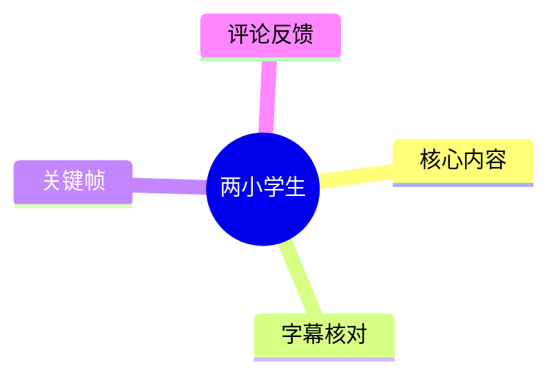
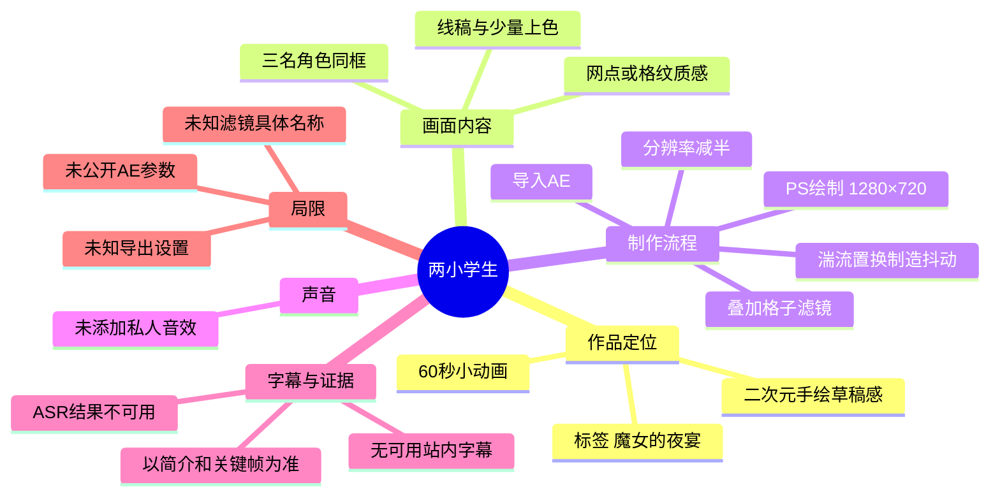
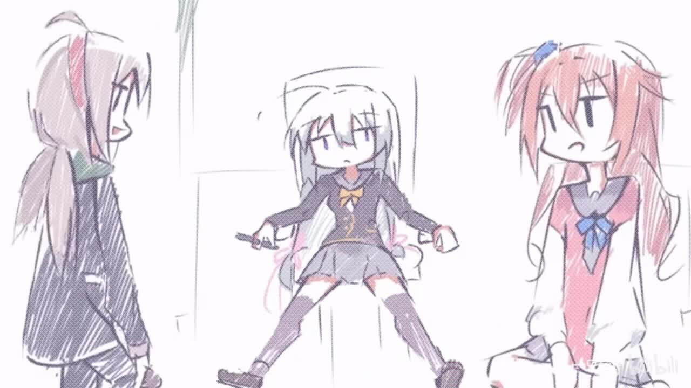
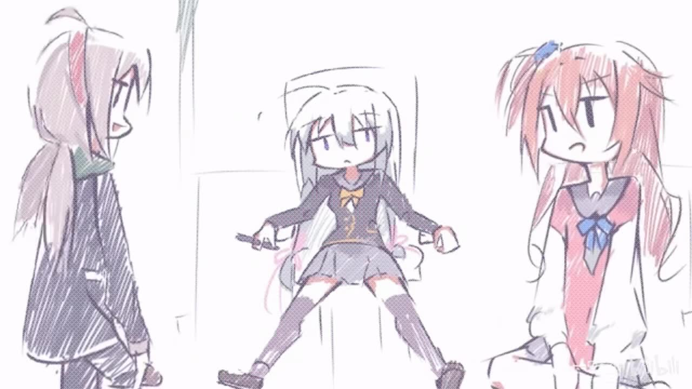

# 两小学生

> 来源：[Bilibili 视频](https://www.bilibili.com/video/BV18Rji6FEun) 
> UP 主：一只txt-｜时长：60 秒｜标签：`魔女的夜宴`、`小动画`｜画面规格：1920×1080

## 小结

这是一支时长 60 秒的小动画作品，标题为《两小学生》。从提供的关键帧可见，视频采用手绘草稿感较强的二次元人物画面：画面中有三名角色，线条保留了速写式的粗糙笔触，并通过网点/格纹质感呈现低清、抖动化的视觉效果。

视频最有价值的信息来自 UP 主简介，其明确给出了制作链路：先在 Photoshop（PS）中按 **1280×720** 完成绘制；再导入 After Effects（AE），加入**湍流置换**以制造抖动；随后将视频**分辨率变为原来的一半**；最后叠加**格子滤镜**。这是一套以“先绘制、后做轻量运动与降质风格化”为核心的动画处理方法。

就已给出的素材而言，视频没有可用的站内字幕；本次 ASR 已执行，但识别结果仅重复出现“by bwd6”，无法构成可靠的内容转写。因此，本文以视频元数据、UP 主文字说明、关键帧画面和可获取评论为主要依据，不将 ASR 的无意义结果作为事实来源。

该流程适合希望快速制作“手绘草稿感 / 低清网点感 / 轻微抖动画面”的创作者，尤其适用于已有静态插画、但不准备制作逐帧复杂动画的场景。需要注意的是，UP 主没有披露 AE 的具体效果参数、关键帧设置、滤镜名称、导出编码或实际帧率，因此该方法可复现其思路，但不能据此精确复刻成片。

视频发布于 2026 年 6 月；播放、点赞、收藏等统计数据为素材抓取时的快照，具有时效性。截至抓取信息，视频显示播放 27,864、点赞 2,293、收藏 1,261、投币 145、分享 89、评论 125、弹幕 6。

## 思维导图

## 目录

- [作品概况与信息边界](#作品概况与信息边界-0000)
- [画面与关键帧观察](#画面与关键帧观察-0000)
- [制作方法：PS 到 AE 的风格化链路](#制作方法ps-到-ae-的风格化链路-0000)
- [参数、限制与复现建议](#参数限制与复现建议-0000)
- [字幕比对](#字幕比对-0000)
- [评论分析](#评论分析-0000)
- [处理记录](#处理记录-0000)

## 作品概况与信息边界 [00:00](https://www.bilibili.com/video/BV18Rji6FEun?t=0)

- **视频标题**：两小学生。
- **UP 主**：一只txt-。
- **时长**：60 秒。
- **分区/合集信息**：任务信息标注合集为 `AIcode`。
- **标签**：`魔女的夜宴`、`小动画`。
- **视频原始画面规格**：1920×1080，横向画面。
- **UP 主公开描述**：

  > ps画好1280x720，然后丢ae加个湍流置换抖动，然后视频分辨率变一半，再套个格子滤镜就有这个视频了，私人音效没加感觉这样就行，有啥有意思的想法的话发评论我都会看的

这段说明是本文关于技术流程的直接来源。其表达的是一种简化动画制作法：静态绘制完成后，在 AE 中进行位移扰动和风格化处理，而非公开展示复杂逐帧动画、绑定动画或三维流程。

需要区分以下信息层级：

1. **UP 主明确陈述**：PS 绘制尺寸、AE 中使用湍流置换、分辨率减半、加入格子滤镜、未加“私人音效”。
2. **关键帧可直接观察**：画面为手绘风格人物构图，含网点/格纹式视觉质感，画面线条有草稿感。
3. **不能确认的内容**：角色姓名、剧情语境、人物关系、AE 效果具体参数、所用格子滤镜的确切插件/效果名、成片帧率与编码设置。

## 画面与关键帧观察 [00:00](https://www.bilibili.com/video/BV18Rji6FEun?t=0)

提供的两张关键帧构图高度接近，均可用于确认作品的核心视觉设计，而不宜据此推断完整剧情或动作顺序。

> 图：关键帧展示三名二次元风格角色同处于白色背景中：左侧为侧身人物，中间人物坐在椅子上，右侧为面向镜头的人物。它能够直观验证视频并非纯文字教程，而是以角色绘画为主体的短动画成片；人物线稿、有限色彩和画面颗粒/网点感也与 UP 主所述“降分辨率后套格子滤镜”的风格方向相吻合。

### 构图与角色呈现

从画面中能够观察到：

- 画面以浅色背景留出较大空白，人物是视觉中心。
- 中间角色处于坐姿，两侧角色形成左右包围式构图。
- 角色服装和发色存在差异，整体采用偏简化的赛璐璐上色与手绘线条。
- 线条并未追求高度平滑，保留了类似草图或速写的笔触感。
- 画面上存在明显的细密网点/格纹化纹理，这与成片通过后期降低清晰度、叠加格子效果的描述相互印证，但无法仅凭关键帧断定具体滤镜实现方式。

> 图：该帧与前一帧处于相近画面状态，适合观察人物面部、衣物色块与网点化处理后的线条边缘。它的价值在于说明后期效果没有完全覆盖绘画本身：角色的基本轮廓、配色关系和表情仍是画面可读性的主要来源。

### 视觉风格的可迁移经验

结合画面与公开制作说明，可提炼出如下做法：

- **先保证原画识别度，再引入“粗糙感”**：关键帧中的角色轮廓、发色和服装色块仍然可辨，说明后期抖动和降质效果应服务于风格，而不是使主体完全失真。
- **低分辨率处理是风格构成的一部分**：UP 主明确提到将视频分辨率减半。此举不仅可能降低细节，也会让线稿和色块更接近低清像素化、旧屏幕或压缩画面的观感。
- **格纹效果适合统一画面材质**：从关键帧可见的细密纹理，使不同颜色区域具有较一致的视觉颗粒感。对于简单线稿动画而言，这类统一材质能够弱化静态画面的“过于干净”感。

## 制作方法：PS 到 AE 的风格化链路 [00:00](https://www.bilibili.com/video/BV18Rji6FEun?t=0)

以下步骤按照 UP 主描述的顺序整理。除明确披露的项目外，不补充未出现的参数或软件设置。

### 1. 在 PS 中完成原画：1280×720

UP 主首先在 PS 中以 **1280×720** 制作画面。

这一尺寸是其公开流程中唯一明确给出的画布参数。它是 16:9 横向比例，与视频的 1920×1080 成片比例一致；两者比例相同，但像素尺寸不同。

可据此得出的实际操作要点：

1. 新建或使用 **1280×720** 的横向画布。
2. 在该画布上完成角色绘制、构图与基础颜色。
3. 在导入 AE 前，应确保希望保留的角色主体、线条和色块已经完成。

> 注意：UP 主只说明“PS 画好 1280×720”，没有说明是单图、分层 PSD、逐帧图片序列，还是多个图层组合；因此不能假定其项目结构。

### 2. 导入 AE 并加入湍流置换

第二步是将 PS 中完成的画面“丢 AE”，并加入**湍流置换**来制造抖动。

湍流置换的作用方向在于：对图像像素或图层进行不规则的空间扰动，从而形成抖动、波动、扭曲或手持式不稳定感。UP 主所公开的目标是“抖动”，而非大幅形变。

可复现的操作框架为：

1. 将已完成的画面素材导入 AE。
2. 对需要产生抖动观感的图层或合成应用湍流置换类效果。
3. 通过动画化效果的演化、偏移或同类控制项，使扰动在时间上变化。
4. 观察人物轮廓是否仍保持可读；若扭曲过大，会破坏角色面部和服装线条。

### 3. 将视频分辨率变为原来的一半

UP 主随后说明“视频分辨率变一半”。

这一句存在一个明确但不完全的技术边界：

- 可以确认：其后期流程包含一次将视频分辨率缩小至原尺寸一半的处理。
- 不可确认：这里的“一半”究竟是宽高各减半，还是总像素量减半；也无法确认发生在合成设置、预渲染还是最终导出阶段。

若按常见的“宽高各减半”理解，1280×720 可变为 640×360；但这只是数学上的示例，**不是 UP 主公开确认的最终输出分辨率**。实际公开视频元数据仍显示为 1920×1080，因此平台最终呈现分辨率与制作流程中的中间降分辨率阶段并不必然相同。

这一环节的风格价值是：

- 降低线条的锐利程度；
- 压缩细碎绘画细节；
- 使后续格纹滤镜更容易形成统一、低保真的画面材质；
- 与湍流置换共同强化“草稿抖动”的观感。

### 4. 叠加格子滤镜

最后，UP 主提到“再套个格子滤镜”。

从关键帧可见，人物衣物与画面区域存在细密的网点/格纹化观感，这与此说法相符。该步骤的目的可概括为让画面呈现规则或半规则的纹理层，而不是保持纯色平面。

但应注意：

- UP 主没有写出滤镜的中文/英文全名；
- 未说明该滤镜是 AE 内置效果、第三方插件，还是其他软件处理；
- 未说明格子尺寸、透明度、混合模式、颜色、叠加位置或是否随画面抖动；
- 因此不能将某一具体 AE 效果名称认定为原作者的实现。

### 5. 音效取舍

UP 主表示“私人音效没加感觉这样就行”。据此只能确认：其认为不额外加入该音效也能满足当前成片效果。

这反映出一个创作判断：对于此类以画面质感为中心的短动画，声音并非其公开说明中的必要技术环节。由于素材未提供可靠语音转写或音频内容描述，无法进一步判断视频中是否存在音乐、环境声或其他音轨元素。

## 参数、限制与复现建议 [00:00](https://www.bilibili.com/video/BV18Rji6FEun?t=0)

### 已公开参数与条件

| 项目 | 已知信息 | 来源 | 可确定程度 |
| --- | --- | --- | --- |
| 原画制作软件 | Photoshop（PS） | UP 主简介 | 明确 |
| 原画画布尺寸 | 1280×720 | UP 主简介 | 明确 |
| 后期软件 | After Effects（AE） | UP 主简介 | 明确 |
| 抖动方法 | 湍流置换 | UP 主简介 | 明确 |
| 分辨率处理 | 视频分辨率变为原来的一半 | UP 主简介 | 明确存在，但具体算法未知 |
| 纹理处理 | 套用格子滤镜 | UP 主简介 | 明确存在，滤镜名称未知 |
| 成片展示规格 | 1920×1080 | 视频元数据 | 明确 |
| 时长 | 60 秒 | 视频元数据 | 明确 |
| 音效取舍 | 未加“私人音效” | UP 主简介 | 明确，但词义及音轨整体情况不明 |

### 未公开的关键参数

以下项目对复刻结果影响很大，但素材中均未提供，不应擅自补全：

- 湍流置换的数量、大小、复杂度、演化速度与偏移量；
- 是否对湍流置换参数打了关键帧；
- PS 工程中是否分层，以及各层在 AE 中是否分别运动；
- 视频实际帧率；
- 降分辨率发生在处理前、处理后还是导出前；
- 最终输出时是否重新放大；
- 格子滤镜的类型、格子尺寸、混合模式、不透明度和色彩；
- 导出编码、码率与压缩策略；
- 是否使用额外的抖动、模糊、噪点、色彩校正或遮罩效果。

### 复现时的风险与建议

1. **不要把“湍流置换”当成唯一动画来源。**  
   它可以提供不规则扰动，但若幅度过大，角色五官和轮廓会变形。关键帧中角色仍然清晰，因此效果强度需要以不损害主体辨识为前提。

2. **降分辨率与最终上传规格需要单独处理。**  
   原作者说明中有“分辨率变一半”，但平台元数据显示成片为 1920×1080。复现时应自行测试：在低分辨率下完成风格化后再放大，与直接以高分辨率导出，视觉结果可能不同。

3. **格纹滤镜应与内容尺度匹配。**  
   格纹过密可能造成摩尔纹或压缩噪声，过粗则会遮挡线稿。原视频的准确格子参数没有公开，只能通过试验寻找接近的视觉尺度。

4. **不要将本视频视为完整教程。**  
   该作品提供的是简洁的制作思路与关键工序，不包含工程文件、参数表或逐步演示。它更适合作为风格化后期方向的参考。

5. **时效性有限。**  
   PS、AE 及其效果的具体版本、界面名称和导出行为可能随软件版本变化；视频中的创作方法仍具参考价值，但具体操作界面不保证与当前版本完全一致。

## 字幕比对 [00:00](https://www.bilibili.com/video/BV18Rji6FEun?t=0)

本次任务已执行 ASR，但没有获得可用的语义转写。站内也未提供可用字幕。

| 字幕来源 | 完整性 | 专有名词 | 时间轴 | 主要问题 |
| --- | --- | --- | --- | --- |
| Bilibili 站内字幕 | 无可用字幕 | 无法核验 | 无法核验 | 素材明确标注“未提供可用站内字幕” |
| 本次 ASR 字幕 | 极低 | 未识别出 PS、AE、湍流置换等关键信息 | 未提供可靠分段时间轴 | 结果仅重复出现“by bwd6”，不能代表视频实际内容 |

### 最终字幕选择

**不采用任何字幕文本作为正文的事实依据。** 本文优先采用：

1. 视频元数据；
2. UP 主公开简介；
3. 提供的关键帧；
4. 可获取热评前三条。

### 关键术语校正依据

以下术语来自 UP 主简介原文，而非 ASR：

- `PS`：UP 主描述的绘制软件缩写。
- `AE`：UP 主描述的后期软件缩写。
- `湍流置换`：用于实现抖动效果的公开方法。
- `1280×720`：原画尺寸。
- `格子滤镜`：后期纹理化处理的公开称呼。

ASR 未能可靠识别上述词语，故不存在可供合并的有效字幕内容。

## 评论分析 [00:00](https://www.bilibili.com/video/BV18Rji6FEun?t=0)

以下仅处理可获取的热评前三条，并按所提供数据中的顺序记录。评论属于观众反馈，不视作已验证的创作事实。

### 1. 幽幽子今天不太饿｜3 赞

> “可爱@摩洛哥焯饼 @源千華留- @擅长捉弄的久保同学 @冬木市电器维修Maki @-Beetle- @天堂見 @黄发窃书者 @-平A带暴击-”

- **观点概括**：评论者直接表达“可爱”的正向情绪，并@多位用户分享作品。
- **补充信息**：未提供制作过程、角色出处或剧情的额外信息。
- **可信度与价值**：可用于说明该画风获得正面观感反馈，但属于主观审美评价，不能据此推导作品设定。

### 2. 木羽plaf｜2 赞

> “@修詩 @戏野喵喵 @乐畅子 @巳时七47 @HACHIMICAKE2356”

- **观点概括**：该评论仅包含@提及，没有文字评价。
- **补充信息**：无。
- **可信度与价值**：可看作用户向他人转发或提醒观看的行为迹象，但无法得出具体态度，也不能作为内容分析证据。

### 3. 脉动の極意｜191 赞

> “有生之年贴吧刷到你的画了[笑哭]”

- **观点概括**：评论者表示曾在贴吧见过 UP 主的画作，并对再次遇到作品感到意外或感慨。
- **补充信息**：该评论暗示 UP 主作品可能曾在贴吧传播或被该用户浏览到。
- **可信度与价值**：这是个人经历陈述，未附链接、截图或具体贴吧信息，无法独立验证。其较高点赞数只能说明该留言在当前评论区获得较多认同或关注，不能证明传播路径的真实性与规模。

## 处理记录 [00:00](https://www.bilibili.com/video/BV18Rji6FEun?t=0)

- **Worker ID**：`worker-mrj0wbly-5dc4e50c`
- **模型**：`gpt-5.6-terra`
- **调用工具与素材**：基于已提供的视频元数据、素材清单、ASR 输出、关键帧文件与热评数据进行整理；未获得可用站内字幕文本。
- **使用的应用工具**：素材采集结果包含视频合并文件、音频文件、关键帧目录、信息文件、评论文件、字幕目录与 ASR 目录；本文仅使用任务中可见的结构化信息与关键帧。
- **字幕选择**：站内字幕不可用；本次 ASR 已执行但仅识别为重复的“by bwd6”，不具备语义可靠性；最终不采用字幕作为正文依据，改以 UP 主简介、元数据与画面证据为准。
- **关键帧选择依据**：选用 `frames/frame-001.jpg` 和 `frames/frame-002.jpg`。两帧均清晰呈现三名角色、手绘线稿、有限上色及网点/格纹化质感，能够支撑对成片视觉风格的描述；两帧构图接近，故不据此臆测具体剧情或动作发展。
- **缓存清理**：未提供缓存清理执行日志；不对未记录的清理操作作出“已完成”声明。
- **未解决问题**：
  - ASR 无法还原有效语音或文字内容；
  - 无法确认视频是否含有完整音乐、环境音或其他音效；
  - 无法确认角色名称、人物关系与剧情语境；
  - 湍流置换、格子滤镜、分辨率缩放与导出参数均未公开；
  - 无法从现有素材确认关键帧在 60 秒视频中的精确出现时间。

## 评论分析

本次流程未获取到可用热评，因此不推断观众态度或额外结论。
