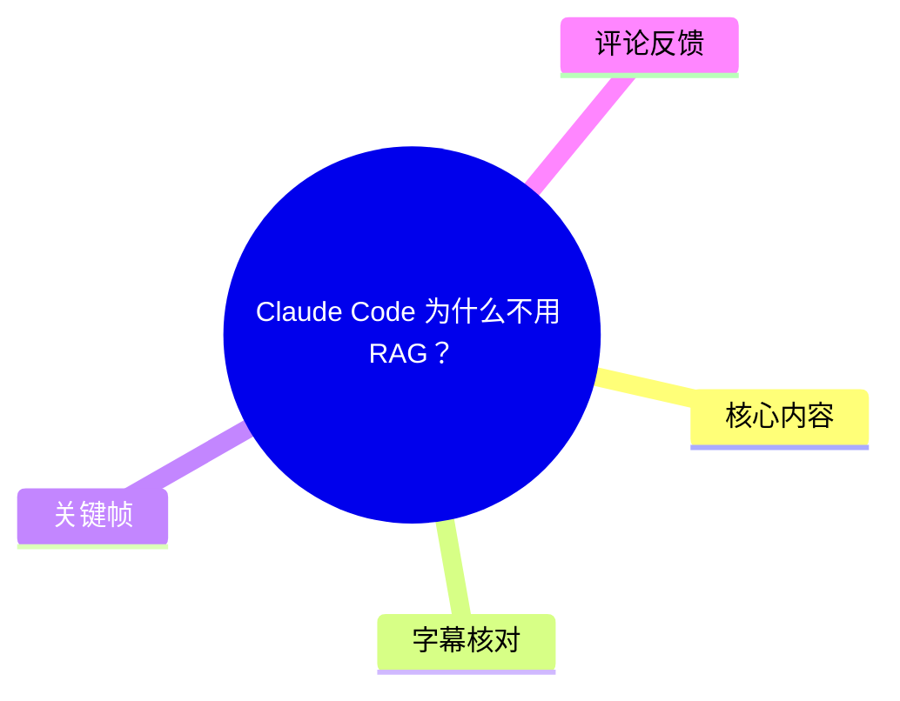
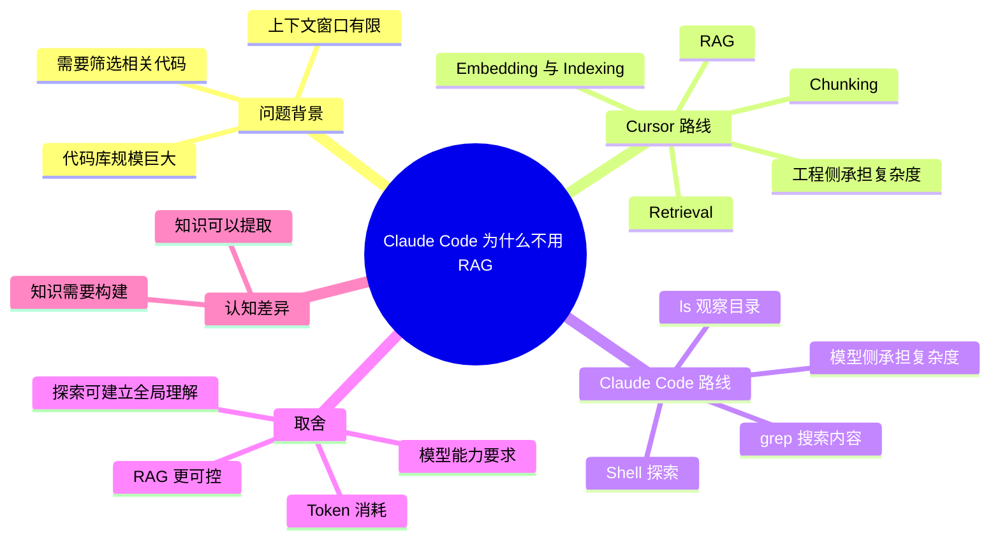
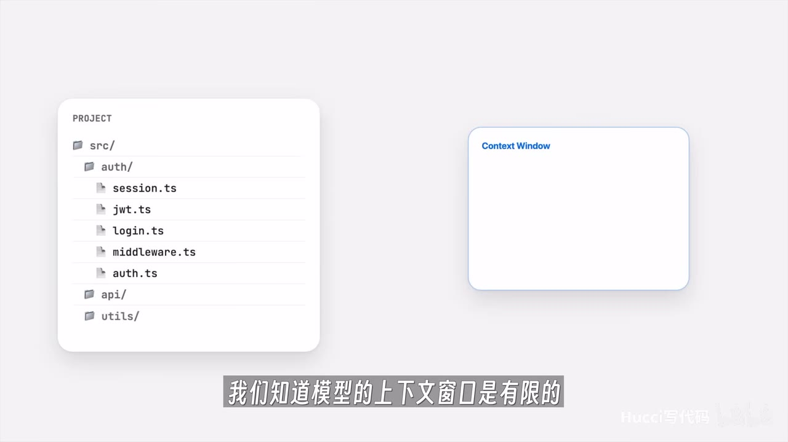
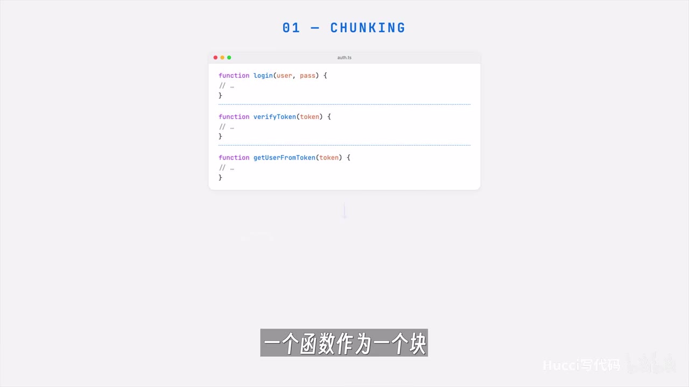
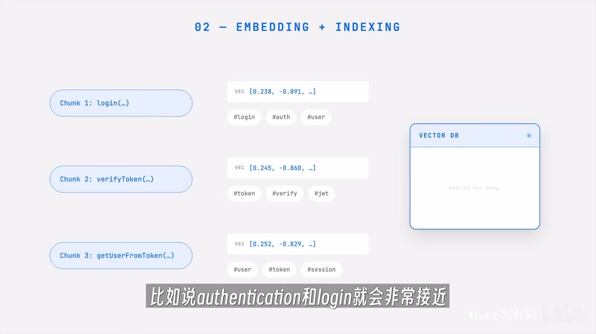

# Claude Code 为什么不用 RAG？

> 来源：[Bilibili 视频](https://www.bilibili.com/video/BV18NLx6fEAq)<br>
> UP 主：Hucci写代码｜视频时长：03:38｜合集：AIcode  
> 视频简介称：内容解释 Claude Code 为什么仅使用基础 Shell 命令进行代码检索。

## 小结

视频比较了两类 Coding Agent 在“大型代码库中为模型找到相关代码”这一问题上的不同路径：Cursor 倾向于以 RAG（检索增强生成）预处理和检索代码；Claude Code 则被视频概括为通过基础 Shell 工具逐步探索代码库。

RAG 路线的核心流程是：将代码按函数或类切块（Chunking），对代码块生成向量并建立索引（Embedding + Indexing），在用户提问时把问题也转成可检索表示，再从数据库中找出最相关的代码块（Retrieval），作为模型上下文。其目标是在有限上下文窗口中更高效地提供相关内容。

Shell 探索路线的典型过程是先用 `ls` 观察目录与文件命名，再用 `grep` 搜索文件内容。视频认为，这种过程虽然会引入更多中间信息、消耗更多 Token，却让模型在找答案时同步建立对项目结构、模块关系与依赖的理解。

视频将两者的差异归纳为复杂度落点不同：RAG 将较多复杂度放在工程与索引系统一侧；Shell 探索则更依赖模型在上下文中消化搜索过程。UP 主进一步提出，这也对应两种知识观：知识是可从库中“提取”的，还是需要在探索过程中“构建”的。

面向工具选择时，视频给出的判断标准不是哪一方案绝对更优，而是使用者更信任工程化检索还是模型能力。该观点属于视频作者的分析，不等同于对 Claude Code、Cursor 当前全部实现细节的官方说明；相关产品实现、模型能力、定价与检索策略均可能随版本变化。

## 思维导图





## 目录

- [背景：为什么代码检索是 Coding Agent 的关键问题](#背景为什么代码检索是-coding-agent-的关键问题)
- [RAG 路线：切块、向量化、索引与召回](#rag-路线切块向量化索引与召回)
- [Claude Code 路线：以 Shell 命令探索代码库](#claude-code-路线以-shell-命令探索代码库)
- [两条路线的成本、产品定位与选型](#两条路线的成本产品定位与选型)
- [从技术选择到知识观差异](#从技术选择到知识观差异)
- [实践清单：如何理解并评估两种检索策略](#实践清单如何理解并评估两种检索策略)
- [结论、限制与时效性](#结论限制与时效性)
- [字幕比对](#字幕比对)
- [评论分析](#评论分析)
- [处理记录](#处理记录)

## [背景：为什么代码检索是 Coding Agent 的关键问题](https://www.bilibili.com/video/BV18NLx6fEAq?t=24)

视频从 Cursor 与 Claude Code 的对比切入。它们都是面向编程任务的 Agent，但面对“如何从项目中找出完成当前任务所需代码”时，采用了不同思路。

前提是：模型的上下文窗口有限，而实际项目的代码量可能远超一次可放入上下文的内容。因此，Agent 通常必须先定位与任务相关的代码，再将其提供给模型。视频以“这个项目中用户认证逻辑是什么”为例，说明两种策略的差异。



> 图：画面将项目目录树与空白的 `Context Window` 并置，直观说明“完整代码库”不能无选择地装入有限上下文。这是后续 RAG 与 Shell 探索两条路线共同要解决的约束。

视频开场还提出，二者不仅是技术路线不同，也可能反映出不同的认知取向。不过该判断是作者的观点性归纳，而非产品官方定义。

## [RAG 路线：切块、向量化、索引与召回](https://www.bilibili.com/video/BV18NLx6fEAq?t=50)

### [1. Chunking：将代码库分割为可检索单元](https://www.bilibili.com/video/BV18NLx6fEAq?t=50)

视频所述 RAG 流程第一步是 **Chunking（切块）**：把代码库拆成一个个较小单元。示例中，一个函数可以是一个块，一个类也可以是一个块；画面以 `login`、`verifyToken`、`getUserFromToken` 三个函数展示了三个代码块的划分方式。



> 图：关键帧明确显示标题“01 - CHUNKING”，并以三个函数之间的虚线分隔说明函数级切块。这有助于理解视频所说的“一个函数作为一个块，或者一个类作为一个块”。

切块的作用是把大代码库转换为后续可索引、可召回的粒度化内容。视频未给出块长度、重叠长度、AST 解析策略或多语言处理等具体参数，因此不能据此推断其推荐的生产级切块配置。

### [2. Embedding 与 Indexing：为代码块建立可比较表示](https://www.bilibili.com/video/BV18NLx6fEAq?t=50)

第二步是 **Embedding（向量化）** 与 **Indexing（索引）**。视频将每个代码块压缩成一串数值坐标，并同时提取关键词，将这些信息放入数据库中。其解释是：语义越接近的内容，在向量空间中的位置通常越接近；视频举例称，`authentication` 与 `login` 会较为接近。



> 图：画面显示三个 Chunk 分别对应向量值与关键词标签，如 `#login`、`#auth`、`#token`、`#jwt`，随后写入 `VECTOR DB`。它补足了口述中“向量坐标 + 关键词 + 数据库”的关系。

这里的“接近”是语义检索的一般工作方式，并不意味着任意同义词或业务相关词都一定能被可靠召回；检索质量还会受嵌入模型、代码切块方式、查询改写、索引策略和重排序等因素影响。视频没有展开这些工程实现细节。

### [3. Retrieval：将问题与代码块匹配](https://www.bilibili.com/video/BV18NLx6fEAq?t=74)

第三步是 **Retrieval（检索/召回）**。当用户询问认证逻辑时，系统将问题转换为可比较的表示，同时抽取关键词，与数据库中已有代码块比较，找出最相近的块，并把这些块作为上下文交给模型。

视频将这套方案概括为一种“现代、高效”的上下文提供方式。其效率优势主要来自：无需让模型从目录层级开始逐步浏览，而是先由检索系统缩小候选范围。

但视频也为后文埋下取舍：RAG 的“相关性”来自预先建好的数据与检索流程。若切块、索引更新或召回策略不理想，相关代码可能未被提供给模型；这一点在视频正文中未详细展开，但热评中有观众提出了召回遗漏和代码更新维护的问题，详见“评论分析”。

## [Claude Code 路线：以 Shell 命令探索代码库](https://www.bilibili.com/video/BV18NLx6fEAq?t=98)

对于同一个“用户认证逻辑是什么”的问题，视频描述 Claude Code 会采用更朴素的探索式方式：

1. 先用 `ls` 查看目录与文件名，寻找可能相关的位置；
2. 再使用 `grep` 搜索文件中的具体内容；
3. 根据前一轮观察到的目录、命名与内容，继续缩小范围；
4. 将找到的内容用于回答原始问题。

> 注：ASR 将命令识别为“grab”或“share”，结合视频标题、语义及常见 Shell 工具用法，应校正为 `grep` 与 `shell`。素材未提供可验证的终端实录命令行，因此这里不扩展为具体命令参数。

视频把这个过程类比为人类工程师理解陌生项目的做法：先看项目结构，再读局部内容，沿线索继续查找。它的价值不只在直接命中答案，也在于模型可能通过过程信息了解：

- 项目的整体架构；
- 认证功能所在模块；
- 模块之间可能的依赖关系；
- 与原问题间接相关、但后续任务可能有价值的上下文。

这种路线的重点不是事先将“最相关代码”一次性提取出来，而是让模型在探索路径中逐步形成理解。

## [两条路线的成本、产品定位与选型](https://www.bilibili.com/video/BV18NLx6fEAq?t=122)

视频明确指出，Shell 探索并非没有代价。

### Shell 探索的代价

- **对模型能力要求更高**：目录列表、搜索结果和过程信息会进入上下文。对于能力较弱的模型，这些信息可能成为噪音，反而影响最终判断。
- **Token 消耗更高**：多轮列目录、搜索、读取内容都会消耗输入与输出 Token。
- **结果依赖探索质量**：如果模型提出的搜索方向不佳，可能走更多无效路径；视频未说明其如何控制搜索深度、文件读取上限或工具调用预算。

视频的解释是：对 Claude Code 而言，上述成本可能可接受——其所依赖的 Claude 模型足够强，且 Anthropic 是模型服务提供方，更多 Token 消耗在其商业模式中较容易被接受。这是视频作者针对产品定位与商业关系作出的推断，不能替代 Anthropic 的官方产品策略说明。

### RAG 的定位：让不同模型获得较稳定的检索支持

视频认为 Cursor 是“模型无关”的产品，其目标应是让不同模型都能有较好表现。在此逻辑下，与其完全依赖模型自由探索，不如构建较可靠的 RAG 管线，通过工程侧的检索能力为模型提供更聚焦的上下文。

因此，视频的对比不是“RAG 有、Shell 无”，而是复杂度的分配不同：

| 路线 | 主要机制 | 主要承担复杂度的一侧 | 视频强调的优势 | 视频强调的代价 |
| --- | --- | --- | --- | --- |
| RAG | 切块、向量化、建索引、检索 | 工程系统侧 | 更高效、对不同模型更友好 | 需要维护检索与索引体系 |
| Shell 探索 | 目录查看、文本搜索、逐步阅读 | 模型与上下文侧 | 探索中形成项目理解 | 消耗 Token，对模型能力要求高 |

视频给出的选择问题是：你更信任工程，还是更信任模型。实际使用中，还应加上代码库规模、更新频率、语言生态、部署方式、成本预算、隐私要求，以及是否需要跨模型一致性等条件。

## [从技术选择到知识观差异](https://www.bilibili.com/video/BV18NLx6fEAq?t=170)

视频在结尾将技术路线进一步抽象为知识观的差异：

- **RAG 的隐含假设**：答案已经以某种形式存在于数据库或代码块中，任务是将合适内容提取出来。
- **Shell 探索的隐含假设**：理解并非只是直接提取答案，还需要通过探索项目、建立关联、阅读过程信息来构建。


> 图：画面用左右两侧的脑图标与字幕“更是认知上的区别”概括主题转折。它提示观众：视频不止讨论检索技术，也在讨论 Agent 如何获得理解。

UP 主明确表达个人更倾向后者：探索过程可能带来意想不到的收获，且这些收获的价值可能超过最初提出的问题。这是作者个人偏好，而非经由对照实验得出的普遍结论。

## [实践清单：如何理解并评估两种检索策略](https://www.bilibili.com/video/BV18NLx6fEAq?t=98)

以下清单根据视频提出的两条路线整理，目的是帮助在使用 Coding Agent 时判断其检索方式是否适合当前任务；并非视频提供的官方配置教程。

### 1. 先区分任务类型

- **目标明确、需要快速定位符号或文件**：例如寻找某函数、配置项或错误码时，结构化检索或精确文本搜索通常更直接。
- **需要理解陌生模块关系、调用链或架构**：逐步浏览目录、搜索引用、阅读相关文件，可能比仅给出少量召回片段更有帮助。
- **代码持续高频变动**：需要关注预构建索引的更新时机与一致性，避免检索结果落后于工作区实际代码。
- **模型能力参差或需要多模型稳定表现**：可更重视检索系统的候选质量、重排序与上下文组织。

### 2. 按视频所述理解 RAG 工作流

```text
代码库
  → 按函数或类切块
  → 为每个块生成向量与关键词
  → 写入索引/数据库
用户问题
  → 生成查询表示与关键词
  → 匹配最相关代码块
  → 将候选块放入模型上下文
```

应关注但视频未提供参数的要点包括：

- 代码块是按函数、类、文件还是语法树节点划分；
- 是否保留相邻块、导入关系、调用方或定义位置；
- 索引是实时更新、增量更新还是定期重建；
- 向量召回后是否有关键词过滤或重排序；
- 上下文最终放入多少候选块、是否会截断。

### 3. 按视频所述理解 Shell 探索工作流

```text
提出问题
  → ls 查看目录与命名
  → grep 搜索文本内容
  → 阅读命中的文件或片段
  → 根据发现继续探索
  → 汇总与问题相关的代码证据
```

这种方式尤其依赖 Agent 是否能：

- 用目录和文件名建立合理假设；
- 设计有效的搜索词；
- 根据中间发现调整下一步；
- 区分有价值信息与噪音；
- 控制搜索轮次和上下文占用。

### 4. 不应忽略混合方案

视频将讨论聚焦于 RAG 与 Shell 探索的对照，但实际工具可能组合多种能力，例如关键词搜索、语义检索、语言服务器协议（LSP）导航、符号跳转、调用层级分析、子任务代理等。素材本身没有提供 Claude Code 或 Cursor 当前完整内部实现，不能据本视频推断任一产品“只使用”某一种检索机制。

## [结论、限制与时效性](https://www.bilibili.com/video/BV18NLx6fEAq?t=195)

视频的核心结论是：RAG 与 Shell 探索并非简单的先进与落后之分，而是把检索理解的复杂度放在不同位置。

- RAG 预先通过切块、嵌入和索引组织知识，偏向工程侧确定性与跨模型适配。
- Shell 探索把更多过程交给模型，偏向通过连续探索建立项目理解。
- 选择哪种路线，应结合对模型能力、工程系统、Token 成本和任务类型的信任与约束。
- 视频最终主张，知识理解常常需要构建而非仅仅提取；这是作者的偏好性观点。

### 限制

1. **缺少产品实测数据**：视频未展示 Cursor 与 Claude Code 在相同仓库、相同任务、相同模型条件下的准确率、延迟、Token 消耗或成本对比。
2. **未给出实现参数**：没有切块大小、索引更新周期、召回数量、搜索命令参数、上下文预算等可复现实验细节。
3. **产品机制可能并非二元划分**：真实 Coding Agent 可能同时使用文本搜索、符号索引、LSP、语义检索与子代理等机制。
4. **商业推断需审慎对待**：关于 Anthropic 对 Token 消耗的偏好、Cursor 的产品目标等说法是视频中的解释性判断，不应视作官方承诺。
5. **时效性**：视频发布于 2026-05-21。AI 编程工具迭代快，模型、定价、上下文窗口、索引架构和默认工具行为均可能在之后改变；使用前应以对应产品的最新官方文档和实际版本为准。

## 字幕比对

| 字幕来源 | 完整性 | 专有名词 | 时间轴 | 主要问题 |
| --- | --- | --- | --- | --- |
| Bilibili 站内字幕 | 未提供可用字幕 | 无法核验 | 无法核验 | 素材明确标注“未提供可用站内字幕” |
| 本次 ASR 字幕 | 覆盖主要口述内容；诊断显示语音覆盖约 88.65% | 存在多处误识别 | 有 9 个真实 SRT 时间段 | 专有名词、英文术语与命令识别错误；单段较长 |

本次 ASR 使用 `large-v3-turbo`，识别语言为中文，语言置信度为 `0.9970703125`；音频时长约 `217.30` 秒，首段语音从 `00:00:24.360` 开始，末段截至 `00:03:37.000`。诊断中未标记 `noAudioStream=true`，且已产出有时间戳的语音分段，因此本视频存在可供 ASR 识别的音频内容，并非无音轨视频。

最终采用 **本次 ASR 的真实时间轴** 组织章节，并结合标题、语义上下文与关键帧校正专有词。重点校正如下：

| ASR 结果 | 正文采用 | 校正依据 |
| --- | --- | --- |
| `ClothCode`、`Cloud Code`、`Cloud` | Claude Code | 视频标题及上下文均指向 Claude Code |
| `Cursors` | Cursor | 视频比较对象与语义一致 |
| `rag`、`REG` | RAG | 画面与内容均描述检索增强生成流程 |
| `trunking` | Chunking | 关键帧标题明确为 `01 - CHUNKING` |
| `grab` | `grep` | 语境为 Shell 文本内容搜索，常见工具应为 `grep` |
| `share命令`、`试要命令` | Shell 命令 | 上下文反复与 `ls`、`grep` 并列，视频主题即基础 Shell 检索 |
| `embedding和indexing` | Embedding + Indexing | 关键帧标题明确为 `02 - EMBEDDING + INDEXING` |

ASR 的前两段和后续段落存在跨句拼接，且未覆盖约前 24 秒的非语音或未识别内容。由于没有站内字幕可交叉验证，正文只对素材能支持的内容作整理，不补写未出现的口述信息。

## 评论分析

以下仅分析可获取的热评前三条。评论属于用户观点与经验陈述，不作为已验证事实。

### 1. 李知恩爱Uaena（239 赞）

评论认为，对确定性的纯文本代码而言，`grep` 可以快速完成匹配；RAG 则可能耗时更长，且模糊语义匹配可能取到相似但不正确的代码，从而增加模型幻觉风险。评论还指出，代码频繁更新会带来重新 Embedding 与维护向量库的成本，并将 Cursor 的云端架构、Claude Code 的本地工具定位作为解释背景。

该评论进一步补充：Claude Code 探索代码时可能使用子智能体，主智能体最终只接收代码结果，而非被全部工具调用过程塞满上下文；并建议用户通过清晰提示词减少无效 `grep` 调用。

**价值与限制：**这条评论补充了视频未展开的索引更新、延迟、云端维护和子智能体等工程问题，讨论具体且与主题相关。但其中关于产品内部实现、性能量级和上下文传递方式的陈述未在本视频素材中被验证，应以官方文档、版本说明或可复现实测为准。

### 2. 听音乐的薯片君（110 赞）

评论批评 RAG 可能存在召回与置信度问题：相关代码可能漏召回；代码变更后还需维护向量库，尤其当用户同时用其他 IDE 修改代码时，索引一致性可能受影响。评论认为 Claude Code 默认搜索方式能规避这两类问题。

评论最后提出替代视角：Claude Code 支持 LSP，因此不一定需要把“全文搜索”视为唯一方案。

**价值与限制：**该评论有效提醒了 RAG 的索引新鲜度、召回缺失风险，并指出符号级导航可能是不同于“RAG vs 全文搜索”的第三种能力。但“默认搜索规避问题”的结论依赖具体实现与工作流，不能据此断定所有情况下 Shell 或 LSP 都优于 RAG。

### 3. saltierfish（62 赞）

评论从 Anthropic 的提示词与上下文使用习惯出发，认为 Anthropic 很信任模型能力：可能将用户中断等信息拼入提示词，同时又使用较长的系统提示词。评论质疑在更换模型后，这类较大量上下文和提示词设计是否仍能保持效果。

**价值与限制：**该评论呼应视频“更相信模型”的主题，提出模型能力与提示词工程耦合的疑问。不过其所述具体拼接内容、系统提示词长度及跨模型兼容性均未由本视频展示或验证，因此只能视为评论者观察与推测。

## 处理记录

- **Worker ID**：`worker-mrj0wbly-5dc4e50c`
- **模型**：`gpt-5.6-terra`
- **ASR 模型**：`large-v3-turbo`，`cuda` 设备，`int8_float16` 计算类型。
- **使用的素材与工具结果**：视频元数据、12 张关键帧目录、ASR 结果 JSON、ASR SRT 时间轴字幕、热评前三条、视频简介与统计数据。
- **字幕选择**：站内字幕未提供可用版本；已检查本次 ASR，采用其 SRT 的真实起止时间作为时间轴依据，并对 Claude Code、Cursor、RAG、Chunking、Embedding、Indexing、`grep`、Shell 等明显误识别术语进行上下文与关键帧校正。
- **关键帧选择依据**：选择 `frame-001.jpg` 说明项目规模与上下文窗口限制；选择 `frame-003.jpg` 说明函数级 Chunking；选择 `frame-004.jpg` 说明向量化、关键词与向量数据库；选择 `frame-002.jpg` 说明视频结尾提出的认知差异。图片均服务于正文概念解释，未将画面未呈现的内容推断为事实。
- **缓存清理**：未提供缓存清理执行日志；本记录不宣称已完成额外缓存删除。
- **未解决问题**：未获得站内字幕，无法进行逐字交叉比对；未提供 Claude Code 与 Cursor 的版本号、官方内部架构文档或同条件性能测试，因此不对两者当前完整检索实现作超出视频素材的断言。
