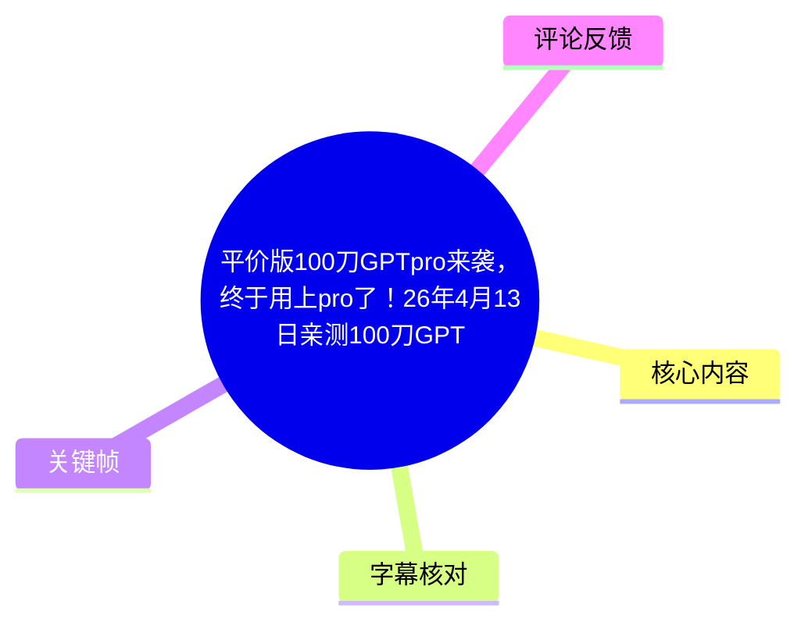
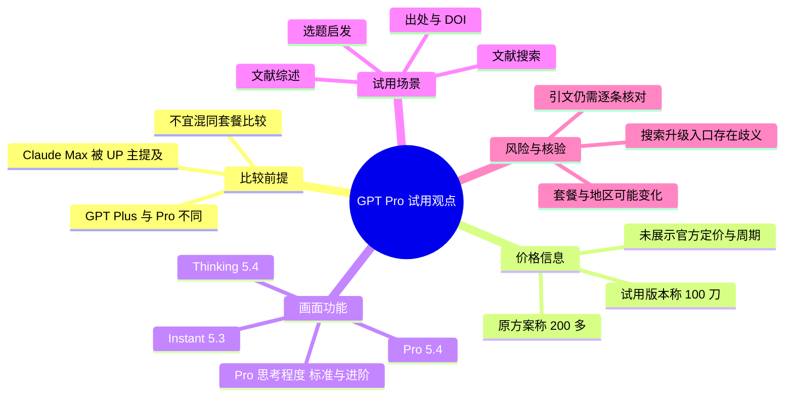
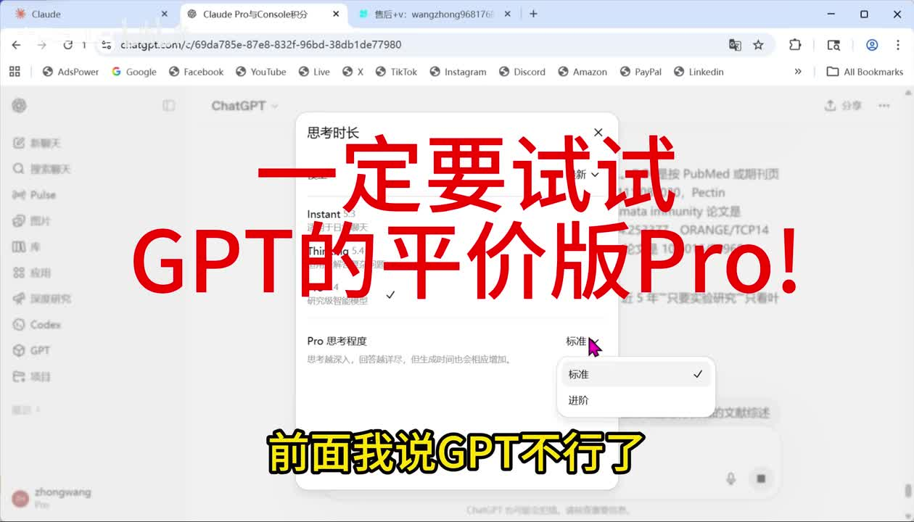
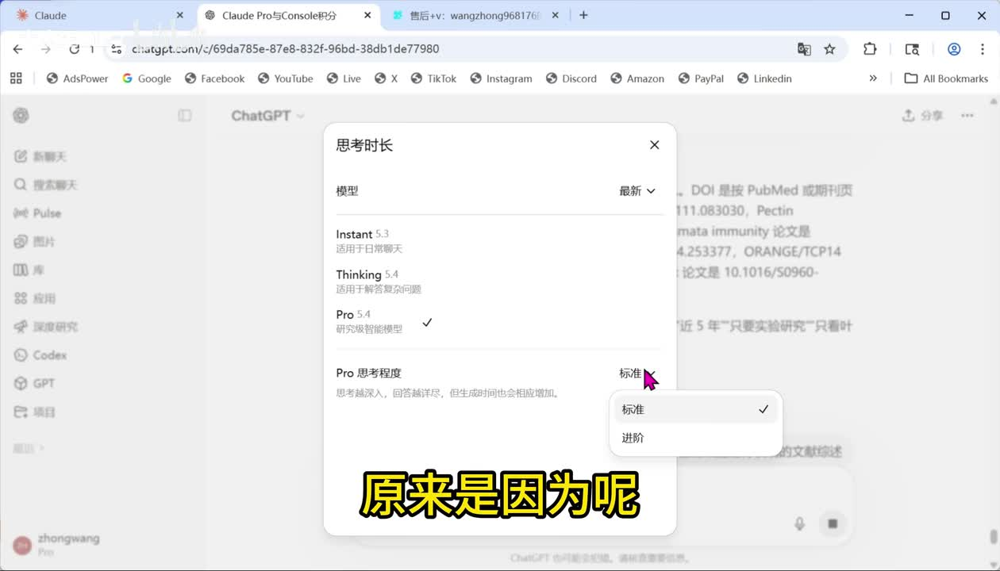
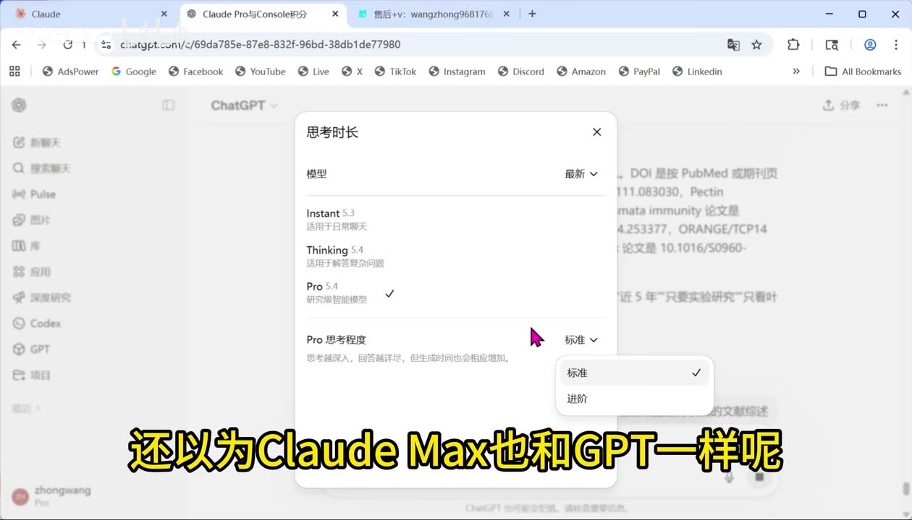
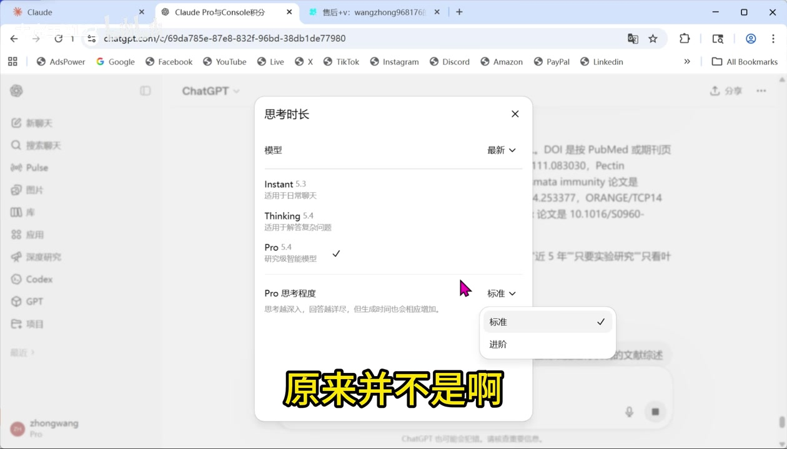

# 平价版100刀GPTpro来袭，终于用上pro了！26年4月13日亲测100刀GPTPro！为啥GPT不如Claude？因为你没用过GPTpro

> 来源：[Bilibili 视频](https://www.bilibili.com/video/BV1Y2DRBTEoe)  
> UP 主：大魔王2122｜视频时长：48 秒｜合集：AIcode  
> 信息性质：UP 主在短视频中对 GPT Pro 档位的个人试用与比较，包含尚未独立验证的产品、价格和能力表述。

## 小结

视频的核心观点是：UP 主修正了自己此前“GPT 不如 Claude”的判断，认为先前比较的前提不对——自己使用的是 GPT Plus，而非其所称的顶级 **Pro** 档位；因此，不能直接把 GPT Plus 的表现与 Claude 的高阶订阅档位混为一谈。

UP 主称，原本“200 多”的 GPT Pro 价格令其难以承担，而近期出现“100 刀”的版本后进行了试用。视频没有展示官方定价页、套餐名称、地区条件、计费周期或正式公告，因此“100 刀”应视为视频中的个人购买/升级信息，而不是可直接外推的官方统一价格。

画面展示了 ChatGPT 的模型菜单：`Instant 5.3`、`Thinking 5.4`、`Pro 5.4`，以及 `Pro 思考程度` 的“标准 / 进阶”选项。该画面能够证明视频录制时账号界面中存在这些可选项，但**不能单凭画面证明**各模型的完整能力边界、所有用户的可用性，或其与 Claude 各档位的严格对应关系。

UP 主以“文献搜索”和“文献综述”为试用场景，称其搜索结果“每篇都带出处、带 DOI”，并认为生成的综述更全面、对研究选题更有启发。这些是个人体验结论；即使输出含 DOI，也仍应逐条打开原始论文页或数据库记录核验题名、作者、年份、期刊与 DOI 是否一一对应，不能把“有引用格式”当作事实正确性的保证。

视频末尾建议通过搜索某个关键词并使用支付宝升级。由于字幕写作 `GPTCZW`、本次 ASR 写作 `GPTCJW`，且视频未展示明确域名、运营主体、价格细则及官方授权信息，不能据此确认链接安全性或合规性。涉及付费订阅时，应优先核对服务方的官方订阅入口、账号归属、退款规则、地区限制与支付风险。

## 思维导图

## 目录

- [观点修正：比较对象应是套餐与模型层级](#观点修正比较对象应是套餐与模型层级)
- [界面证据：模型与 Pro 思考程度选项](#界面证据模型与-pro-思考程度选项)
- [价格表述与“100 刀”信息边界](#价格表述与100刀信息边界)
- [文献搜索与综述试用结论](#文献搜索与综述试用结论)
- [升级提示、操作边界与支付风险](#升级提示操作边界与支付风险)
- [结论、限制与时效性](#结论限制与时效性)
- [字幕比对](#字幕比对)
- [评论分析](#评论分析)
- [处理记录](#处理记录)

## [观点修正：比较对象应是套餐与模型层级](https://www.bilibili.com/video/BV1Y2DRBTEoe?t=0)

### [从“GPT 不行”到收回判断](https://www.bilibili.com/video/BV1Y2DRBTEoe?t=0)

视频开场，UP 主表示自己此前说过“GPT 不行了，干不过 Claude”，现在收回这一结论。其给出的原因不是展示了统一基准测试，而是认为自己此前没有使用 GPT 的 Pro 档位。

这段内容应理解为一种**比较条件的修正**：

1. 不同订阅档位可能提供不同模型、推理设置、用量限制或功能入口；
2. 若比较一方的基础/中档套餐与另一方的高阶套餐，结果不一定能反映产品体系的总体差异；
3. 但“换成 Pro 后更强”仍是 UP 主的体验判断，不等同于 GPT 在所有任务上均优于 Claude。

### [UP 主对 Claude Max 与 GPT 套餐差异的理解](https://www.bilibili.com/video/BV1Y2DRBTEoe?t=8)

UP 主称，自己先前以为 Claude Max 与 GPT 的升级逻辑相同，即升级后模型会更高级；随后认为“原来并不是”，并将 Claude 的相关升级描述为主要扩大算力，形容为“田忌赛马”。

这里至少包含两层待区分的信息：

- **视频陈述**：UP 主认为两个产品的订阅档位所带来的变化并不相同。
- **不可由本视频证实的推论**：Claude Max 是否“仅仅”扩大算力、是否不涉及模型访问或其他权益，视频没有提供官方产品说明，也没有展示 Claude 的套餐页，不能据此定论。

> 图：关键帧展示 ChatGPT 网页端的模型选择浮层，并在背景中可见与文献、DOI 相关的对话内容。它是理解“比较时需区分模型/套餐层级”的直接画面证据，但不能替代产品官方文档。

## [界面证据：模型与 Pro 思考程度选项](https://www.bilibili.com/video/BV1Y2DRBTEoe?t=12)

### [画面可见的模型名称](https://www.bilibili.com/video/BV1Y2DRBTEoe?t=12)

在模型菜单中，画面可辨识出以下条目：

| 画面文字 | 画面中的说明 | 可确认范围 |
| --- | --- | --- |
| `Instant 5.3` | “适用于日常聊天” | 该录制账号的菜单中显示此模型及用途描述。 |
| `Thinking 5.4` | “适用于解答复杂问题” | 该录制账号的菜单中显示此模型及用途描述。 |
| `Pro 5.4` | “研究级智能模型” | 该录制账号显示该模型并处于勾选状态。 |
| `Pro 思考程度` | “思考越深入，回答越详尽，但生成时间也会相应增加。” | 画面显示该项存在可调节的推理深度设置。 |

画面中 `Pro 5.4` 后有选中标记，说明 UP 主录制时正在以该选项作为展示对象。需要注意，视频时长很短，未展示切换前后的同题测试、输出全文、响应时长统计或额度信息；因此不能从这一帧推导出模型的量化性能结论。

> 图：该帧较清楚地列出 `Instant 5.3`、`Thinking 5.4`、`Pro 5.4` 三项，并显示 `Pro 5.4` 已选中。它帮助将视频口播中的“Pro”落实到实际界面名称，避免把 Pro 泛化为所有 GPT 付费功能。

### [Pro 思考程度：标准与进阶](https://www.bilibili.com/video/BV1Y2DRBTEoe?t=13)

菜单下方的 `Pro 思考程度` 当前显示为“标准”，下拉菜单包含：

- **标准**：画面中带有选中标记；
- **进阶**：可选但未选中。

界面提示明确写道：思考越深入，回答越详尽，但生成时间也会相应增加。这意味着视频中能确认的实际取舍是：

- 更深的思考设置可能换取更详尽的回答；
- 同时可能增加生成等待时间；
- 视频未展示“进阶”实际输出，未提供等待时间、使用次数、费用影响或任务成功率，不能量化收益。

> 图：该帧显示“标准”与“进阶”的二级菜单，以及“思考越深入，回答越详尽，但生成时间也会相应增加”的界面说明。它直接呈现视频中最具体的参数与限制：深度和生成时间之间存在权衡。

## [价格表述与“100 刀”信息边界](https://www.bilibili.com/video/BV1Y2DRBTEoe?t=17)

### [UP 主称原 Pro “200 多”，现试用“100 刀”](https://www.bilibili.com/video/BV1Y2DRBTEoe?t=17)

UP 主表示，原来的 GPT Pro“200 多”让其舍不得购买；“这两天”出现“100 刀”的版本后，便立即进行了试用。标题也将其表述为“平价版 100 刀 GPTPro”。

视频可记录的价格信息仅限于：

- 原价格口述为“200 多”；
- 新版本/方案口述为“100 刀”；
- 视频没有说明“200 多”和“100 刀”是否均为美元月费、是否是折扣价、合租/代充/第三方渠道价格，或是否含税；
- 画面未展示订单、扣款凭证、官方价格页、有效期或适用地区。

因此，合理的阅读方式是：将其视为**特定时间点、特定账号或渠道下的个人试用信息**，不要据此建立固定预算预期。

### [时效性：视频发布日与界面均可能已经变化](https://www.bilibili.com/video/BV1Y2DRBTEoe?t=21)

元数据的 `pubdate` 对应 2026-04-12 17:50:39 UTC，而标题自述为“26 年 4 月 13 日亲测”；两者可能只是时区或标题表述上的日期差异。无论采用哪一种日期，视频展示的模型版本、套餐价格、支付可用性与模型选择界面都属于强时效信息。

复查时至少应确认：

1. 官方网页当前是否仍提供对应套餐和模型；
2. 自己所在地区、账号资格与支付方式是否适用；
3. 价格是否为税前、促销价或第三方报价；
4. 高阶推理模式是否有额度、排队、速率或功能限制；
5. 文献搜索能力是否依赖联网、检索、外部数据库授权或其他当时未展示的功能。

## [文献搜索与综述试用结论](https://www.bilibili.com/video/BV1Y2DRBTEoe?t=27)

### [UP 主展示的文献检索主张](https://www.bilibili.com/video/BV1Y2DRBTEoe?t=27)

UP 主称，自己让模型搜索文献后，“每篇都带出处，带 DOI”，并表示这让自己不再担心如 Plus 一样“胡编乱造”。

画面背景中可见与文献、`DOI`、`PubMed` 等字样相关的结果，这与口播场景相符。不过，视频没有展示：

- 用户的完整提示词；
- 返回的完整文献列表；
- DOI 点击后的落地页面；
- 任何一条引文的数据库核对过程；
- Plus 与 Pro 在相同提示词、相同联网条件下的对照结果。

因此，视频的有效经验不是“Pro 输出 DOI 就不会幻觉”，而是：**针对研究任务，应要求模型输出可追溯来源与 DOI，并把它们作为人工核验的起点。**

### [可复用的文献核验流程](https://www.bilibili.com/video/BV1Y2DRBTEoe?t=30)

结合 UP 主的试用场景，一个不超出视频信息、且更稳妥的执行顺序如下：

1. 明确研究主题、研究对象、年份范围、语言范围和文献类型；
2. 要求输出包含题名、作者、年份、期刊/会议、来源链接与 DOI 的候选列表；
3. 对每条 DOI 到论文出版社页面、Crossref、PubMed 或学校数据库中核验；
4. 删除 DOI 不存在、题名不一致、作者/年份不一致、期刊信息不匹配的条目；
5. 再基于已核验文献要求模型整理研究问题、方法、结论、争议与研究空白；
6. 在最终综述中保留可回溯的引文记录，而非只保存模型生成的文本。

其中第 3—6 步是对视频“每篇带出处、带 DOI”这一使用场景的必要补充，不是视频已展示完成的操作。

### [关于“综述更全面、选题少走弯路”的适用边界](https://www.bilibili.com/video/BV1Y2DRBTEoe?t=33)

UP 主认为生成的文献综述体现了 GPT 的综合能力优势，“非常全面”，并能给选题带来启发、减少弯路。这一经验对研究生、博士生及需要快速建立领域地图的读者有参考价值，但应保留以下限制：

- “全面”不等于覆盖全部关键研究，尤其是付费墙文献、最新预印本、非英语研究和小众领域材料；
- 综述的组织能力不等于引文事实准确；
- 选题价值仍需结合研究可行性、数据可得性、伦理要求和导师/同行意见判断；
- 视频没有给出具体研究领域、提示词、基准答案或人工评分，无法复现其“少走弯路”的效果。

> 图：该帧同时保留 Pro 模型选中状态、思考程度设置与背景中的文献任务页面，可用于理解 UP 主是在“文献检索/综述”这一具体应用场景下评价 Pro，而非对所有任务作普遍性能宣告。

## [升级提示、操作边界与支付风险](https://www.bilibili.com/video/BV1Y2DRBTEoe?t=42)

### [视频实际给出的升级提示](https://www.bilibili.com/video/BV1Y2DRBTEoe?t=42)

视频末尾的口播为：建议“谷歌一下 `GPTCZW`”，并称“第一个就是支付宝就能升级”。站内字幕将关键词写为 `GPTCZW`；本次 ASR 写为 `GPTCJW`。由于二者不一致，且画面未完整展示搜索结果、域名或支付页面，本文以站内字幕的 `GPTCZW` 作为视频口播转写，但明确保留不确定性。

视频没有提供可核验的完整操作步骤，例如：

- 具体网址与所属主体；
- 是否为官方入口；
- 套餐名称、最终币种与账单周期；
- 是否需要共享账号、代充或转交验证码；
- 退款、续费和售后机制；
- 地区与税务适用条件。

### [支付前的必要检查](https://www.bilibili.com/video/BV1Y2DRBTEoe?t=44)

涉及账号订阅与第三方支付时，建议执行以下安全边界：

- 优先从官方产品页或官方应用内进入订阅，不因搜索排名而默认信任“第一个结果”；
- 核验域名、公司主体、隐私政策、退款规则和客服渠道；
- 不向非官方第三方提供账号密码、登录验证码、Cookie、API Key 或身份证明材料；
- 不使用来源不明的共享账号或支付渠道，以避免账号封禁、隐私泄露、扣费争议和售后缺失；
- 在付款前确认自动续费、币种、税费、最终金额与取消方式。

这些是围绕视频末尾支付提示的风险控制建议，不表示已验证视频提及的任何渠道。

## [结论、限制与时效性](https://www.bilibili.com/video/BV1Y2DRBTEoe?t=37)

视频提供的最有价值的信息，是提醒使用者在比较 GPT 与 Claude 时，不应忽略订阅档位、可选模型和推理深度等前提。画面中可直接确认的内容包括：`Instant 5.3`、`Thinking 5.4`、`Pro 5.4` 以及 Pro 思考程度的“标准 / 进阶”设置，且界面明确提示更深思考可能带来更详尽回答与更长生成时间。

UP 主的文献检索体验表明，高阶模型可被用于输出带来源和 DOI 的候选资料、协助组织综述框架及启发选题；但视频没有展示逐条验证过程，也未做 GPT Plus、GPT Pro、Claude Pro 或 Claude Max 的同题对照。因此，“GPT Pro 一定优于 Claude”或“不会再编造文献”均超出了素材可支持的结论。

“100 刀”价格、模型命名、界面、支付渠道与可用地区都可能快速变动。尤其是视频中的升级关键词在两份字幕中存在拼写差异，且没有官方链接证据。读者应把本视频当作一次试用线索，而非订阅决策的唯一依据。

## [字幕比对](https://www.bilibili.com/video/BV1Y2DRBTEoe?t=0)

| 字幕来源 | 完整性 | 专有名词 | 时间轴 | 主要问题 |
| --- | --- | --- | --- | --- |
| Bilibili 站内字幕 `p01-ai-zh.srt` | 覆盖约 00:00:00.040—00:00:47.300，含 28 个短分段，内容完整 | `GPT` 被识别为 `GBT`，`Claude` 为 `cloud`，`DOI` 被写成 `DI`；但上下文可校正 | 与 48 秒视频时长基本匹配，可直接作为章节定位依据 | 有英文品牌和术语的中文音译/拼写误差；末尾关键词仅写作 `GPTCZW`，无法独立验证 |
| 本次 ASR（medium） | 诊断显示音频时长 47.322 秒，但仅识别为 2 段，语音覆盖率 35.29% | `Cloud`、`GPTPlaw`、`DLI`、`文献周速`、`GPTCJW` 等明显失真 | 两段均从 00:00:30.440 开始，前半段内容被错误压缩至 0.54 秒，时间轴不可用于正文定位 | 分段与时间戳严重错位，专有名词及部分普通词误识别较多 |

### 字幕采用结论

- 已检查本次 ASR：其诊断**未标记** `noAudioStream=true`，且明确给出音频时长、语言 `zh`、语言置信度 `0.99951171875`，说明源视频存在音轨；本次问题是 ASR 的分段/时间对齐和转写质量不足，而不是无音轨。
- 正文时间轴优先采用站内 SRT 的真实分段时间：从 `00:00:00,040 --> 00:00:47,300` 连续覆盖，适合换算为 Bilibili 秒级链接。
- 文本以站内字幕为主，并用画面校正关键术语：`GBT` 校为 **GPT**，`cloud` 校为 **Claude**，`DI` 校为 **DOI**。
- 对末尾搜索词不作过度校正：站内字幕为 `GPTCZW`、ASR 为 `GPTCJW`，缺少可见网址或其他证据，故保留站内版本并标注歧义。

## [评论分析](https://www.bilibili.com/video/BV1Y2DRBTEoe?t=17)

以下仅处理本次可获取的热评前三条；评论是用户观点，不视为已验证事实。

1. **兰夜如风飞（312 赞）**：认为“Plus 的 Codex 额度缩水”是在促使用户购买 Pro。  
   - 补充价值：提出了用量额度可能影响用户升级意愿这一商业层面的解释。  
   - 局限：评论没有给出额度变更日期、官方公告、账号地区或使用数据，无法证明存在“逼着买 Pro”的因果意图。

2. **张本一仙（80 赞）**：称 Pro 不能生成照片等内容，因此一些任务需要拆开完成。  
   - 补充价值：提示高阶模型/模式的能力未必覆盖全部创作任务，工作流可能需要在不同模型或功能间切换。  
   - 局限：视频本身没有演示图像生成功能；评论也没有说明具体模型、入口、日期或报错条件，不能据此判定当前所有 Pro 用户均无法生成图片。

3. **-可不敢乱说-（12 赞）**：自称使用“200 刀 Pro”，认为其能力不如 Claude，但优势是“量大管饱”，并额外订阅 Claude Pro 做 review。  
   - 补充价值：给出一种多工具分工思路：用一个工具承担大用量任务，另一个工具承担审阅。  
   - 局限：这是单一用户的主观工作流，没有任务类型、模型版本、提示词、评分标准或用量记录；其结论与视频中 UP 主的正面体验也构成了个体经验差异，而非谁对谁错的证据。

## [处理记录](https://www.bilibili.com/video/BV1Y2DRBTEoe?t=0)

- Worker ID：`worker-mrj0www4-e8d79408`
- 调用模型：`gpt-5.6-terra`
- 已使用素材工具产物：视频元数据、站内字幕 `p01-ai-zh.srt`、本次 ASR 结果与 SRT、关键帧目录、热评 JSON。
- 字幕选择：正文以站内 SRT 为主，因为其 28 个真实时间段覆盖约 0—47.3 秒；本次 ASR 已检查，但仅 2 段且首段时间戳异常，不用作正文定位依据。
- 关键帧选择依据：选择 `frames/frame-001.jpg` 至 `frames/frame-004.jpg`，因为所提供画面均集中呈现模型菜单、`Pro 5.4` 选中状态、`Pro 思考程度` 及“标准/进阶”选项，能够直接支撑模型层级与参数取舍的正文描述。
- 缓存清理：未提供缓存清理执行日志；本文不声称已执行或完成缓存清理。
- 未解决问题：
  - “100 刀”方案的官方名称、计费周期、地区资格、是否官方渠道及价格有效期未在视频中展示；
  - 末尾搜索关键词在站内字幕与 ASR 中分别为 `GPTCZW`、`GPTCJW`，无法确认；
  - 文献结果、DOI 的逐条真实性、GPT Plus 与 Pro 的对照数据，以及与 Claude 各档位的统一基准比较均未提供。

## 评论分析

- 热评 1：奥特曼将plus的codex额度缩水了[笑哭]，逼着大家买pro
- 热评 2：但是pro生成不了照片之类的，一些任务要分开完成
- 热评 3：我用的是200刀pro也就那样吧，能力是比不上claude的，胜在量大管饱，又开了一个20刀的claude pro专门用来review。

以上内容是观众反馈摘录，只用于补充理解视频反响，不作为正文事实依据。
