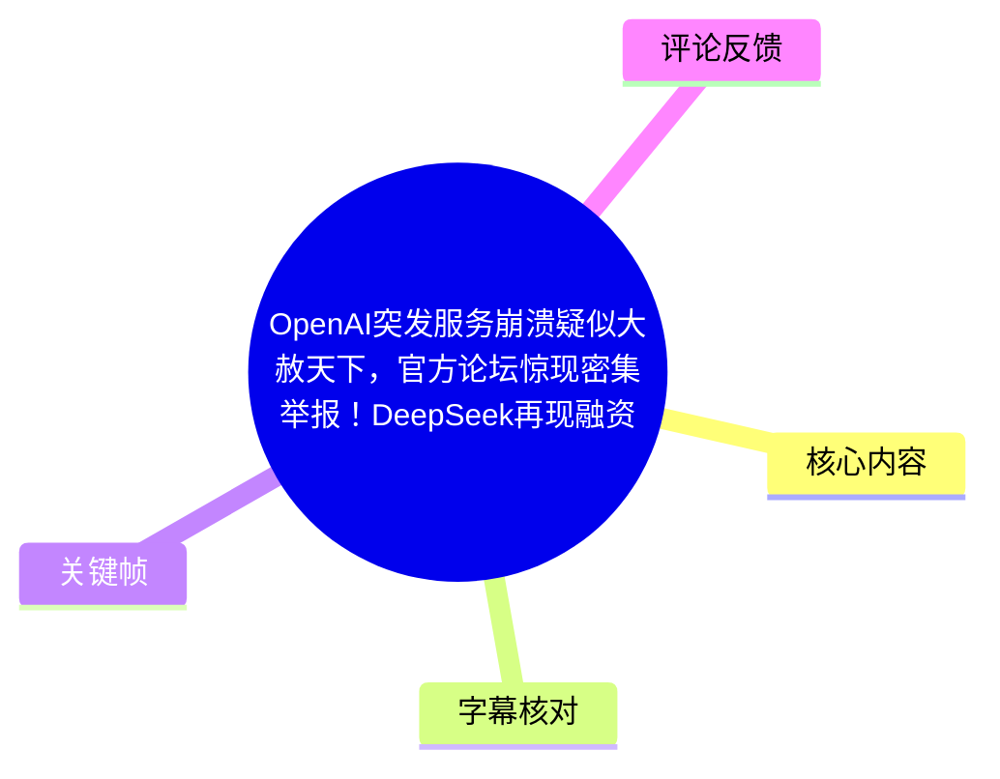
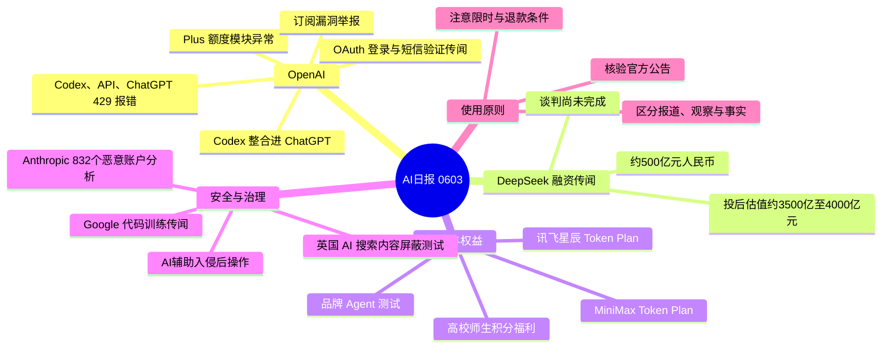
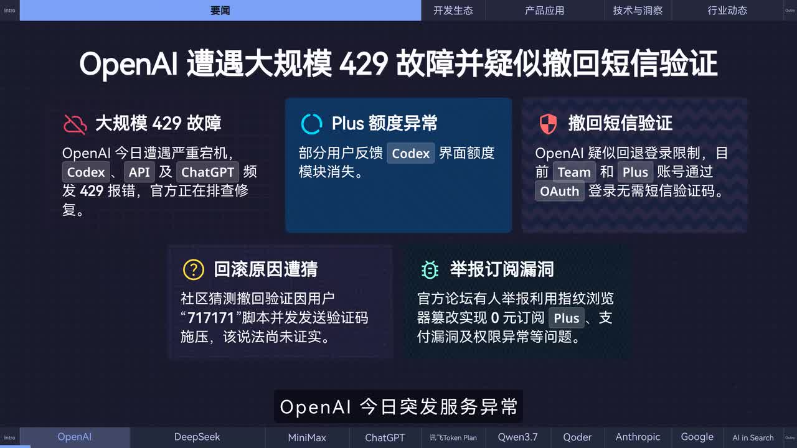
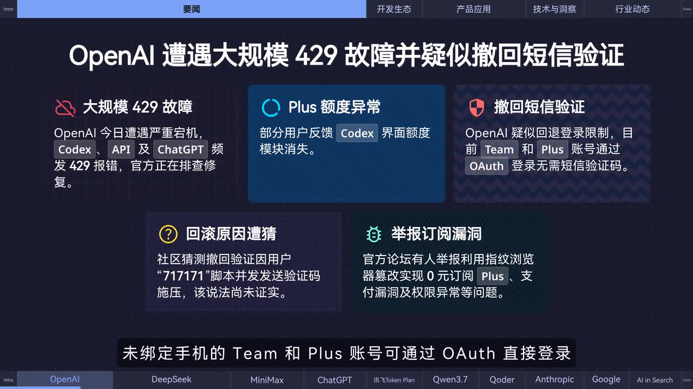
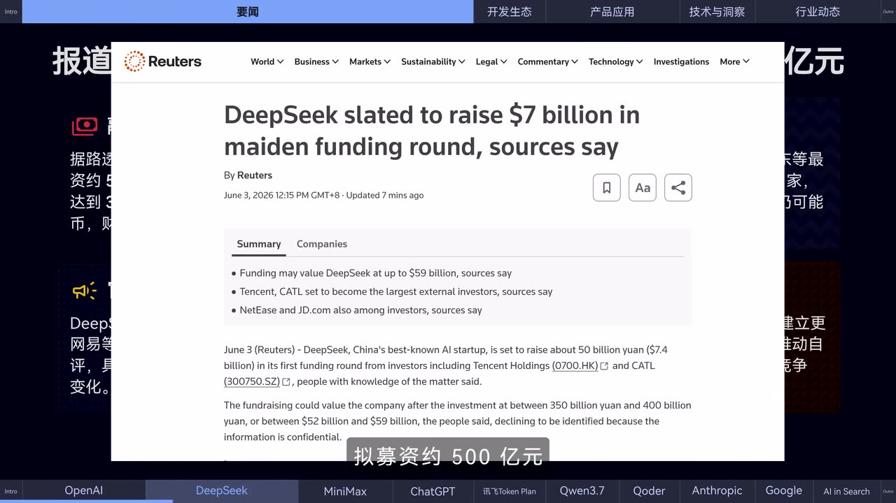
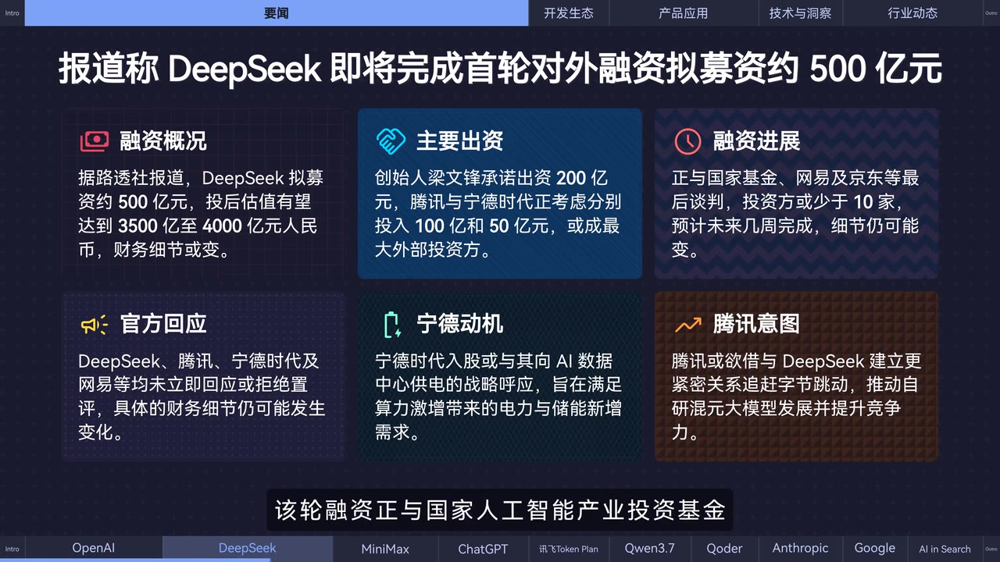

# OpenAI突发服务崩溃疑似大赦天下，官方论坛惊现密集举报！DeepSeek再现融资疑云真假难辨！| AI日报0603

> 来源：[Bilibili 视频](https://www.bilibili.com/video/BV1PH796zEjx) 
> UP 主：黑鸦Heya｜视频时长：02:30｜合集：AIcode  
> 本期为 2026 年 6 月 3 日 AI 新闻播报。新闻中的服务状态、促销截止时间、融资谈判与产品路线均具有强时效性。

## 小结

本期日报的重点是 OpenAI 的一次服务异常及其账户政策传闻：视频称 Codex、API 和 ChatGPT 曾频繁出现 HTTP 429 报错，部分 Plus 用户发现额度模块消失；同时，未绑定手机的 Team、Plus 账号被观察到可经 OAuth 登录。画面还提到官方论坛中出现针对订阅漏洞与权限异常的密集举报。上述“撤回短信验证”及其原因均是社区观察或猜测，并非视频提供的正式公告。

第二条核心新闻是 DeepSeek 融资传闻。视频援引路透社报道，称其拟进行首轮外部融资，规模约 500 亿元人民币，投后估值可能达到约 3500 亿至 4000 亿元；梁文锋、腾讯、宁德时代，以及国家人工智能产业投资基金、网易、京东等被列入潜在出资或谈判对象。视频和画面均强调财务细节仍可能变化，相关公司当时尚未立即回应或置评，因此不能将其视为已经完成的交易。

产品与服务层面，视频汇总了 MiniMax Token Plan 的限时增额与退款安排、OpenAI 计划把 Codex 核心能力整合进 ChatGPT、讯飞星辰 Token Plan 包月服务及其“最高 500 万 TPM”吞吐指标，以及面向高校师生的积分福利。对用户而言，最可执行的是核对活动截止时间、订单状态、身份认证要求和实际适用账户，而非仅依据新闻标题作购买或续费决策。

安全与平台治理方面，Anthropic 报告称，在其过去一年分析的 832 个恶意账户中，攻击者正借助 AI 执行更自主的入侵后操作；Google 则被报道为可能付费取得 Android 开发者私有代码库训练 AI，并在英国测试让网站禁止生成式 AI 搜索使用内容的 Search Console 选项。这些内容分别涉及网络安全风险、训练数据授权和内容控制权。

本视频是快速新闻摘要，不提供事件原始链接、服务状态页、正式产品文档或融资文件。尤其是服务故障、OAuth 登录现象、融资数额、企业合作与促销权益，都应以相关公司当日公告、控制台实际显示及订单条款为准。

## 思维导图

## 目录

- [OpenAI 服务异常、登录政策传闻与论坛举报](#openai-服务异常登录政策传闻与论坛举报-0000)
- [DeepSeek 首轮外部融资报道及不确定性](#deepseek-首轮外部融资报道及不确定性-0025)
- [MiniMax 权益、退款与 Codex 整合路线](#minimax-权益退款与-codex-整合路线-0049)
- [讯飞星辰 Token Plan 与品牌 Agent](#讯飞星辰-token-plan-与品牌-agent-0113)
- [高校积分福利与 Anthropic 安全报告](#高校积分福利与-anthropic-安全报告-0137)
- [Google 的训练数据与 AI 搜索治理报道](#google-的训练数据与-ai-搜索治理报道-0201)
- [可执行核验步骤与参数清单](#可执行核验步骤与参数清单-0049)
- [结论、限制与时效性](#结论限制与时效性-0225)
- [字幕比对](#字幕比对)
- [评论分析](#评论分析)
- [处理记录](#处理记录)

## OpenAI 服务异常、登录政策传闻与论坛举报 [00:00](https://www.bilibili.com/video/BV1PH796zEjx?t=0)

视频开场称，OpenAI 当日出现较大范围服务异常：

- **受影响对象**：Codex、API 与 ChatGPT。
- **错误现象**：频繁出现 **HTTP 429** 报错。429 通常表示请求被限流或请求过多；但本视频没有给出 OpenAI 的故障根因、影响地域、恢复时间或状态页编号，因此不能据此断定是单纯的配额限制还是服务端事故。
- **额度异常**：部分 Plus 用户反馈 Codex 界面的额度模块消失。
- **登录变化观察**：部分未绑定手机的 Team、Plus 账号被观察到可通过 OAuth 直接登录，视频据此称 OpenAI “疑似”撤回强制短信验证。
- **社区猜测**：画面写有一种未经证实的社区说法，即有人利用“717171”脚本并发发送验证码，可能导致验证码通道受压；视频明确标记该说法“尚未证实”。
- **论坛举报**：OpenAI 官方论坛中有人举报，指纹浏览器等方式可能被用于绕过限制，以实现低成本或“0 元”订阅 Plus，并涉及支付漏洞与权限异常等问题。

> 图：该关键帧将新闻拆分为“429 故障”“Plus 额度异常”“撤回短信验证”“回滚原因猜猜”“举报订阅漏洞”五项，直接呈现了视频对信息可信度的区分：其中验证码脚本的原因只是社区猜测，而不是确认结论。

### 应如何理解“疑似撤回短信验证”

视频没有展示 OpenAI 的政策更新页面，因而只能确认“用户观察到的登录行为”被报道，不能确认验证规则已经正式改变。OAuth 登录能够成功也不必然等价于手机验证被永久取消，可能还受账号历史状态、地区、风险控制、实验分组或短期故障影响。

> 图：画面明确写出“未绑定手机的 Team 和 Plus 账号可通过 OAuth 直接登录”，这是视频中关于登录政策变化最具体的表述；它的价值在于限定了现象所涉账号类型与登录方式，但并不能代替官方规则。

## DeepSeek 首轮外部融资报道及不确定性 [00:25](https://www.bilibili.com/video/BV1PH796zEjx?t=25)

视频援引路透社报道称，DeepSeek 拟完成首轮对外融资，核心信息如下：

| 项目 | 视频所述内容 | 可靠性边界 |
| --- | --- | --- |
| 拟融资规模 | 约 500 亿元人民币 | 报道中的拟议规模，并非已完成到账金额 |
| 创始人出资 | 梁文锋拟出资约 200 亿元 | 处于报道/谈判信息层面 |
| 外部潜在出资 | 腾讯考虑约 100 亿元、宁德时代考虑约 50 亿元 | 视频称“考虑”，不代表已签约 |
| 投后估值 | 约 3500 亿至 4000 亿元人民币 | 估值区间可能随条款变化 |
| 其他谈判对象 | 国家人工智能产业投资基金、网易、京东等少数投资方 | 视频称正在最后谈判 |
| 完成时间 | 预计未来数周内 | 时间预期，不是完成承诺 |
| 公司回应 | DeepSeek、腾讯、宁德时代、网易等尚未立即回应或拒绝置评 | 说明公开确认有限 |

> 图：关键帧展示路透社标题“DeepSeek slated to raise $7 billion in maiden funding round, sources say”及要点摘要。它为视频“约 500 亿元”这一换算规模提供了新闻来源线索，也同时表明信息来源为知情人士而非已披露的融资文件。

视频还给出两项可能的商业动机解释：

1. **宁德时代**：其入股或被视为与 DeepSeek 向 AI 数据中心供电的战略协同，回应算力增长带来的电力、储能需求。
2. **腾讯**：视频称其意图可能是与 DeepSeek 建立更紧密关系，以追赶字节跳动并推进混元大模型发展、提升竞争力。

这些是视频对潜在投资逻辑的分析，不应视为腾讯、宁德时代或 DeepSeek 的官方战略表态。

> 图：该图将融资概况、主要出资、谈判进度、官方回应和两家企业的潜在动机并列，并明确写明“财务细节可变”“尚未立即回应或拒绝置评”。它有助于避免把传闻性融资直接写成既成事实。

## MiniMax 权益、退款与 Codex 整合路线 [00:49](https://www.bilibili.com/video/BV1PH796zEjx?t=49)

### MiniMax Token Plan：限时权益与售后安排

视频称 MiniMax 宣布：

1. 在**本周五上午 10 点前**购买 Token Plan 的用户，可获 **M3 周限额永久额外增加 50%** 的福利。
2. 官方上线专属资助/售后平台接管答疑。
3. 控制台同步开放 Token Plan 退款通道。
4. 常规订单预计在本周内处理完毕。

由于视频只以“本周五”“本周内”描述，未提供具体自然日、订单分类、退款资格、退款到账周期、M3 周限额基数与活动规则链接，实际操作应以购买页和控制台条款为准。尤其“永久额外 50%”所作用的具体配额、是否适用续费、升级或退款后账户如何处理，均不能从视频中推导。

### OpenAI：将 Codex 核心能力整合进 ChatGPT

视频转述 OpenAI 在近期产品发布直播中的宣布：未来数周，Codex 的核心能力将整合进 ChatGPT，用户无需在不同产品之间切换，即可在多平台调用 Agent；ChatGPT 将升级为统一工作界面。

这是一项路线图信息，而不是视频中已经演示的完整上线功能。视频未说明：

- 具体上线日期、地区或账户层级；
- 是否覆盖免费、Plus、Team、Enterprise 等全部用户；
- 可调用的模型、Agent 权限、代码执行环境与计费标准；
- “多平台”所指的网页、桌面端、移动端或 API 的明确范围。

因此，适合将其作为后续产品整合方向跟踪，而不宜据此预设现有 Codex 与 ChatGPT 权益已完全互通。

## 讯飞星辰 Token Plan 与品牌 Agent [01:13](https://www.bilibili.com/video/BV1PH796zEjx?t=73)

本段 ASR 对厂商品牌转写存在误差；结合视频导航中“讯飞 Token Plan”的文字，正文采用“**讯飞星辰 Token Plan**”这一画面可支持的名称。

视频称，讯飞推出星辰 Token Plan 包月订阅服务，官方口径包括：

- 支持多款旗舰模型及讯飞核心能力统一调用；
- 提供高峰期不限流；
- 最高吞吐保障为 **500 万 TPM**；
- 向第三方 Agent 和 Scale 全面开放；
- 瑞幸咖啡、肯德基等首批企业正在测试并陆续上线；
- 后续企业可运营自定义品牌 Agent。

### 参数解释与限制

**TPM** 一般指 Tokens Per Minute，即每分钟可处理的 token 数量。视频给出的“最高 500 万 TPM”是吞吐保障指标，不等于单次请求长度、模型回答速度、并发连接数、每日调用量或价格。要判断是否满足业务需求，还需要官方合同或产品控制台中的模型范围、并发数、速率限制、SLA、计费方式与地域条件。

“高峰不限流”也应谨慎理解：视频没有说明其是否对所有套餐、全部模型和全部接口无条件成立，通常仍会受到公平使用、风控、服务可用性或合同约束。

### 品牌 Agent 的应用含义

视频提到瑞幸咖啡、肯德基正在测试品牌 Agent，并称未来企业可运营自定义品牌 Agent。这意味着产品方向从通用对话能力延展到企业品牌入口、客户服务或业务流程编排。但视频未展示企业 Agent 的具体工作流、数据接入范围、用户隐私策略、上线规模或实际效果，无法据此评价其商业成效。

## 高校积分福利与 Anthropic 安全报告 [01:37](https://www.bilibili.com/video/BV1PH796zEjx?t=97)

### 面向高校师生的积分活动

ASR 将平台名称识别为“Hotelwalk 中国版”，该名称缺乏站内字幕或画面文字支撑，无法可靠校正；以下仅保留视频能确认的活动机制：

- 面向中国高校师生；
- 完成身份认证后，可额外获得**有效期三个月的 4000 积分**；
- 视频称累计可获得 **6000 积分**。

活动的主体平台名称、基础积分来源、认证方式、适用学校范围、积分用途、过期规则和是否可与其他活动叠加，素材均未完整给出。对有需求的师生，应在相应平台核验认证入口及活动细则后再参与。

### Anthropic：AI 参与的入侵后操作风险

视频称 Anthropic 发布报告，基于过去一年内 **832 个恶意账户** 的分析指出，攻击者正利用 AI 实施更自主的**后入侵操作**，现有风险评估方法和框架已不再适用或不足以覆盖新的风险。

“后入侵操作”可理解为攻击者已获取初始访问权限后的阶段，例如信息搜集、横向移动、权限提升、数据查找、脚本编写或规避检测。视频的关键判断是：AI 不仅可能降低攻击准备门槛，也可能提高攻击链中后续执行的自动化程度。

但视频没有给出报告名称、账户判定标准、样本分布、攻击成功率、具体技术案例或“旧框架失效”的原文表述。因此可将其作为安全团队加强 AI 滥用监控的风险信号，不能据此量化实际攻击增长幅度。

## Google 的训练数据与 AI 搜索治理报道 [02:01](https://www.bilibili.com/video/BV1PH796zEjx?t=121)

视频最后涉及两项 Google 相关报道。

### 1. 可能付费取得 Android 开发者私有代码库

视频称，Google 正通过 Play Store 联系 Android 开发者，计划通过付费获取其私有代码库，用于训练 AI 模型。该信息以“据媒体报道”呈现，视频未提供协议样本、适用开发者范围、代码使用期限、数据隔离方案、模型训练范围、收益分配或退出机制。

若开发者遇到类似邀请，应特别核验：

- 授权主体是否为 Google 或其关联方；
- 被授权代码的范围，是否包括历史版本、依赖配置、密钥、用户数据或第三方代码；
- 是否允许用于训练、微调、评测或人工审阅；
- 是否可撤回，以及撤回后对既有训练结果的影响；
- 开源许可证、雇佣合同、客户合同和第三方 SDK 的再授权限制；
- 支付方式、税务责任、保密条款与争议解决机制。

### 2. 英国网站的生成式 AI 搜索内容屏蔽测试

视频称，因英国反垄断机构要求，Google 将在 Search Console 中测试新的选项，使英国网站可以阻止其内容被生成式 AI 搜索使用，并计划后续向全球推广。

该报道涉及的是内容控制权：网站可能可选择不让内容用于生成式 AI 搜索呈现或相关用途。但视频没有给出选项名称、屏蔽是否影响传统搜索收录和排名、是否只面向英国主体、对已抓取内容是否生效，以及全球推广的确切计划。站长不应在没有阅读正式 Search Console 文档前，假定该功能已全面可用。

## 可执行核验步骤与参数清单 [00:49](https://www.bilibili.com/video/BV1PH796zEjx?t=49)

本视频并非操作教程，以下是依据其新闻内容整理的核验流程，不新增视频未出现的产品能力或命令。

### A. 遇到 OpenAI 429、额度消失或登录方式变化时

1. 在 Codex、API、ChatGPT 分别记录出现问题的时间、账号套餐和错误提示。
2. 查看 API 用量与套餐额度页面，区分真实配额耗尽、前端显示异常和服务端故障。
3. 核验 OpenAI 官方状态页、产品公告及账户邮件；不要将论坛帖子或社区截图作为政策变更确认。
4. 不尝试使用指纹浏览器、订阅漏洞或其他规避付费/验证的方式。视频提到的是论坛举报风险，并非可复制的操作方案。
5. 若发现 OAuth 登录方式变化，避免据此修改关键账户安全设置；应等待官方说明，并保留原有的安全验证与恢复方式。

### B. 参与 Token Plan 或高校积分活动前

1. 确认活动截止时间对应的时区与具体日期。视频中的“周五上午 10 点前”不是长期有效规则。
2. 截图保存活动页中有关 **M3 周限额 +50%**、退款资格、适用套餐和生效时间的条款。
3. 购买后通过控制台确认权益是否到账；退款则确认订单类型、提交状态和预计处理时限。
4. 高校用户完成认证前，确认认证平台、个人信息处理规则及“4000 积分有效期三个月”的失效时间。
5. 对“累计 6000 积分”，核对额外 4000 积分之外的 2000 积分从何而来，避免将宣传总额误认为无条件到账额。

### C. 评估企业 Agent 与高吞吐套餐时

1. 将 **500 万 TPM** 仅作为吞吐参考，另行确认并发上限、模型清单、峰值时段、价格和服务等级协议。
2. 在接入自定义品牌 Agent 前，明确品牌知识库来源、客户数据权限、人工转接、日志留存及错误回答的处置机制。
3. 对“首批企业测试”与“全面开放”分开验证：前者是试点状态，后者是否真正对所有主体可申请，需以官方入口为准。

## 结论、限制与时效性 [02:25](https://www.bilibili.com/video/BV1PH796zEjx?t=145)

本期最值得持续关注的不是单一新闻标题，而是三个趋势：

1. **AI 服务的可靠性与权益可见性**：429、额度显示异常与登录验证变化会直接影响开发与订阅用户，用户应建立对状态页、控制台和官方公告的核验习惯。
2. **大模型公司资本与生态竞争**：DeepSeek 融资若最终落地，可能影响算力、模型研发及产业合作格局；但本视频所述仍处于报道与谈判状态。
3. **能力扩张伴随治理问题**：Codex 与 ChatGPT 的整合、企业 Agent 的开放、AI 协助攻击、私有代码训练和搜索内容屏蔽，均说明产品能力、数据授权与安全治理正在同步成为关键问题。

主要限制如下：

- 视频仅 150 秒，属于摘要播报，未呈现原始公告、完整合同、技术文档或报告正文。
- OpenAI 的短信验证变化、验证码回滚原因和订阅漏洞均包含观察与社区讨论，不能当作官方已确认事实。
- DeepSeek 的规模、估值、出资方和完成时间均可能随谈判改变。
- MiniMax 活动、退款、讯飞套餐和高校积分都有明确或隐含的时间、套餐及资格条件，视频不能替代产品页。
- Google 与 Anthropic 的内容多以媒体报道或报告结论概述出现，需查阅原报道、正式文档或报告全文后再作决策。

## 字幕比对

| 字幕来源 | 完整性 | 专有名词 | 时间轴 | 主要问题 |
| --- | --- | --- | --- | --- |
| Bilibili 站内字幕 | 未提供可用字幕 | 无法核验 | 无法使用 | 字幕获取过程返回 `Invalid URL`，没有可用于正文的站内字幕文本 |
| 本次 ASR 字幕 | 较完整：7 段，覆盖约 148.48 秒，语音覆盖率 99.39% | 存在较多同音/误识别 | 可用：SRT 提供 00:00:00,300 至 00:02:29,100 的真实分段 | 中英文混排缺失，机构、产品和数字部分需结合画面审校 |

本次 ASR 使用 `medium` 模型，识别语言为中文，语言概率为 0.9980；诊断未标记 `noAudioStream=true`，且素材中存在 `audio/audio.wav`，因此可确认源视频有音轨，不属于无音轨情形。

正文以**本次 ASR 的真实时间轴**为定位依据，并结合关键帧文本做有限校正：

- `DeepSec` 校正为 **DeepSeek**：关键帧中的路透社标题与中文汇总页均明确显示 DeepSeek。
- `OS 直接登录` 校正为 **OAuth 直接登录**：关键帧显示 OAuth。
- `晉飛/晋非` 采用 **讯飞星辰 Token Plan**：视频导航可见“讯飞 Token Plan”，但缺少更完整的画面证据，故不延伸其未展示的产品细节。
- `Hotelwalk 中国版` 保持为 ASR 不确定项：素材没有提供可核对该平台名称的关键帧或站内字幕，正文只记录其可确认的高校认证与积分规则。
- ASR 中“500 万 TPM”由语境保留为吞吐参数；其具体服务承诺边界仍未由视频材料证实。

## 评论分析

仅处理可获取的热评前三条，评论内容不作为已验证事实。

1. **中二的十一｜257 赞**  
   评论：“快用codex，马上修复bug重置额度了[doge]”。  
   该评论以调侃方式把 Codex 故障、修复 bug 与额度重置联系起来，呼应视频中的 429 和额度异常。它没有提供实际复现步骤、官方来源或具体账号证据，不能证明使用 Codex 可以恢复额度。

2. **_果子鱼_｜226 赞**  
   评论认为 OpenAI 论坛中“贩子互爆”是围绕降价、开源和订阅漏洞的利益冲突。  
   这为视频提到的“官方论坛密集举报”提供了社区竞争的解释框架，但属于评论者的立场判断，措辞带有明显情绪色彩，不能推导出举报人的身份、动机或漏洞真实性。

3. **Ayuj鸦橘｜220 赞**  
   评论内容仅为“1”。  
   没有可分析的事实补充、观点或证据。其高赞只能反映互动排序，不能说明对视频新闻的支持或反对。

## 处理记录

- Worker ID：`worker-mrj0www4-e8d79408`
- 模型：`gpt-5.6-terra`
- ASR 模型与参数：`medium`，CUDA，`float16`，自动识别语言为中文，语言概率 `0.998046875`。
- 使用的素材工具产物：`merged.mp4`、`audio/audio.wav`、`asr/transcript.srt`、`asr/asr-result.json`、关键帧目录 `frames/`、`comments/comments.json`。
- 字幕选择：站内字幕未提供可用结果，获取记录显示 `Invalid URL`；已检查本次 ASR，并以其 7 个 SRT 分段时间轴作为章节定位基础，结合关键帧进行专有名词的保守校正。
- 关键帧选择依据：
  - `frames/frame-001.jpg`：集中展示 OpenAI 429、额度、验证与论坛举报，覆盖开场核心新闻。
  - `frames/frame-002.jpg`：明确显示 Team/Plus 账号经 OAuth 登录的现象。
  - `frames/frame-003.jpg`：展示路透社 DeepSeek 融资报道标题和摘要，支持来源追溯。
  - `frames/frame-004.jpg`：汇总融资规模、潜在出资方、谈判状态与“细节可能变化”的限制。
- 评论处理：仅使用可获取热评前三条，未扩展至其他评论。
- 缓存清理：素材清单未提供独立的缓存清理执行日志；本记录不虚构清理结果，保留已生成的音频、ASR、关键帧和评论产物以支持本文复核。
- 未解决问题：高校积分活动的平台名称在 ASR 中识别不稳定；讯飞套餐的具体模型、价格、并发和 SLA 未在素材中展示；OpenAI 登录政策、订阅举报与 DeepSeek 融资均缺少可在本素材内闭环验证的官方原文。
