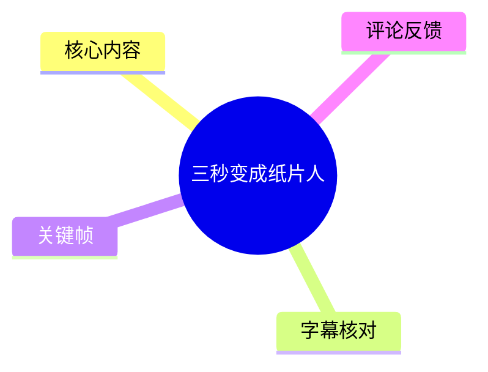
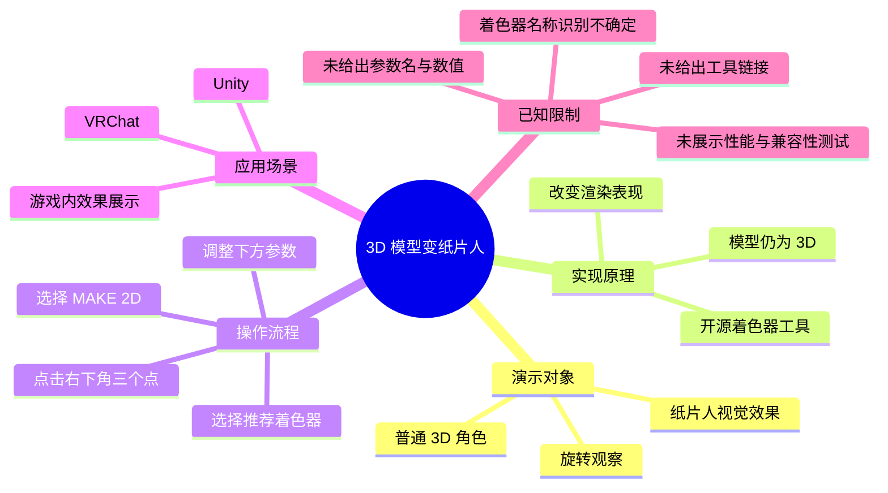
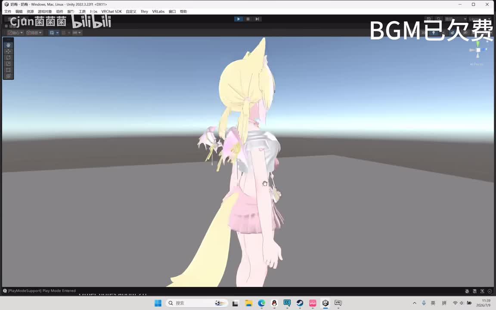
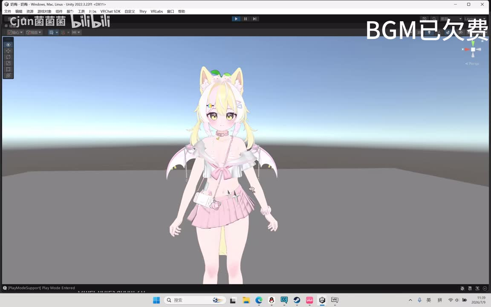
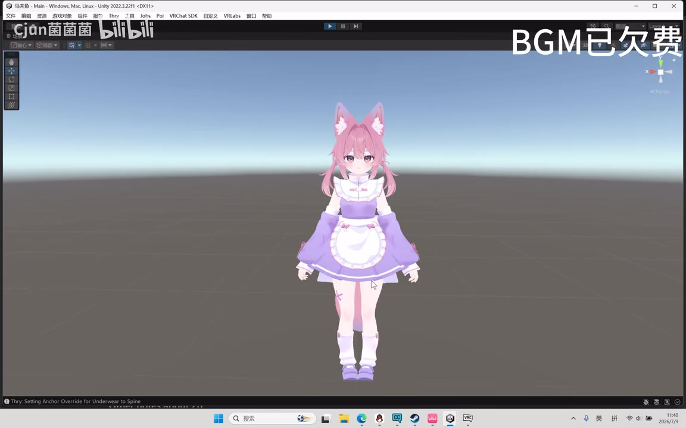
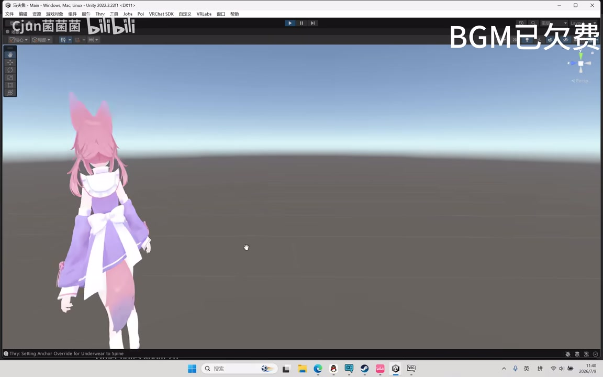

# 三秒变成纸片人

> 来源：[Bilibili 视频](https://www.bilibili.com/video/BV1J3M76MECz)<br>
> UP 主：Cjun菌菌菌｜发布时间：2026-07-09｜视频时长：01:32｜标签：纸片人、Unity、VRChat

## 小结

视频展示了一种将 **3D 角色模型渲染为“2D 纸片人”视觉效果** 的方法。UP 主先用两个角色模型作对照：它们从正面及旋转观察时仍是常规 3D 模型，但其中一个经处理后呈现出明显的平面化、卡通化外观。

实现方式不是把模型真正转换为二维图片或删除三维几何，而是使用一个 UP 主称为**开源着色器工具**的方案，对 3D 模型的渲染效果进行处理。因此，模型仍然是 3D 模型，可继续在 Unity 场景与视频所示的 VRChat 相关工作流中使用。

视频给出的核心操作非常短：在工具界面点击右下角的“三个点”，再选择 `MAKE 2D`；随后推荐搭配一款被 ASR 识别为“Puramu”的着色器，并通过下方出现的若干参数滑块调整目标效果。视频没有展示参数名称、具体数值、工具下载页或完整导入流程，不能据此复现精确配置。

这是一条面向 Unity / VRChat 角色创作者的效果演示和入门提示，而不是完整教程。所谓“三秒”对应标题中的快速处理体验，视频未提供可验证的耗时测量；实际耗时仍会受到模型、材质、着色器、Unity 工程和手动调参影响。

工具地址据 UP 主口述“放评论区”，但当前提供的热评前三条中未包含该链接，因此本文不会补写或推测工具名称、下载地址及兼容版本。该信息具有时效性，应以视频评论区、UP 主后续说明及工具仓库当前文档为准。

## 思维导图





## 目录

- [演示背景：正常 3D 模型与纸片人反差](#演示背景正常-3d-模型与纸片人反差)
- [核心原理：以着色器改变渲染表现](#核心原理以着色器改变渲染表现)
- [操作步骤：执行 MAKE 2D 并调整效果](#操作步骤执行-make-2d-并调整效果)
- [Unity 与游戏内展示](#unity-与游戏内展示)
- [参数、限制与时效性](#参数限制与时效性)
- [字幕比对](#字幕比对)
- [评论分析](#评论分析)
- [处理记录](#处理记录)

## [演示背景：正常 3D 模型与纸片人反差](https://www.bilibili.com/video/BV1J3M76MECz?t=0)

视频开场中，UP 主称“这是一只普拉姆，看着很正常吧”，随后在 [00:03](https://www.bilibili.com/video/BV1J3M76MECz?t=3) 至 [00:06](https://www.bilibili.com/video/BV1J3M76MECz?t=3) 表示“转一圈看看，也没有什么问题”。这里的“普拉姆”是 ASR 的音译结果，无法仅凭现有素材确认其是否为角色名、模型名或其他专有名词。

画面位于 Unity 编辑器。角色被放置在默认天空盒与灰色地面环境中，作为效果对比的基础场景。该场景的价值在于：背景、光照与地面都较简单，便于观察角色轮廓、服装色块以及从侧面看的造型变化。



> 图：该帧显示角色在 Unity 编辑器中以侧面角度呈现。侧面轮廓仍体现出角色模型的空间体积，是“模型并未变成单张图片”的直观参照。



> 图：该帧显示同一角色的正面视角。正面图适合观察脸部、服装与色块的平面化视觉风格，并与侧面画面共同构成旋转检查的上下文。

在 [00:10](https://www.bilibili.com/video/BV1J3M76MECz?t=10) 至 [00:15](https://www.bilibili.com/video/BV1J3M76MECz?t=10)，UP 主又引入另一只“Puramu”（ASR 原文），并强调其“看着也很正常”。到 [00:20](https://www.bilibili.com/video/BV1J3M76MECz?t=20)，视频揭示该对象“其实是个纸片人来的”；但在 [00:26](https://www.bilibili.com/video/BV1J3M76MECz?t=26)，又明确说明它“还是个 3D 模型”。

这组表述界定了视频中的“纸片人”含义：它描述的是**视觉渲染风格**，而不是网格维度的字面变化。视频没有声称模型网格被压扁、骨骼被移除，或被转为精灵图。



> 图：该帧展示另一名粉色角色的正面全身效果，可用于观察不同角色服装和配色在同一 Unity 环境中的呈现；它说明演示并非只针对单一外形。



> 图：该帧展示角色的背面及后方蝴蝶结、头发和尾部区域。它对理解“模型依然可从不同角度查看”有帮助，但单个静帧不能独立证明动态旋转时是否始终保持同样的平面效果。

## [核心原理：以着色器改变渲染表现](https://www.bilibili.com/video/BV1J3M76MECz?t=29)

在 [00:29](https://www.bilibili.com/video/BV1J3M76MECz?t=29) 至 [00:36](https://www.bilibili.com/video/BV1J3M76MECz?t=29)，UP 主说明该效果“用到了一个开源的着色器工具”，可以把 3D 模型“渲染成 2D 纸片人”。

据此可确定的事实包括：

1. **处理对象是 3D 模型**：UP 主在前段已强调其仍是 3D 模型。
2. **处理层级是渲染/着色器层**：视频明确称使用“着色器工具”，而非建模、贴图绘制或动画烘焙工具。
3. **目标是二维化的外观**：这里的“2D”是视频对视觉结果的描述，重点在于观感。
4. **视频关联 Unity 与 VRChat**：视频标签为 Unity、VRChat，关键帧也显示 Unity 编辑器顶部有 VRChat SDK 相关菜单，因此该方案至少是在这一工作环境中演示。

需要避免过度推断：视频没有解释该工具具体采用了何种技术，例如法线修改、边缘描边、视角相关变形、平面阴影、角色朝向锁定或后处理。因此不能将任何具体算法归因于该工具。

## [操作步骤：执行 MAKE 2D 并调整效果](https://www.bilibili.com/video/BV1J3M76MECz?t=39)

视频在 [00:39](https://www.bilibili.com/video/BV1J3M76MECz?t=39) 至 [01:01](https://www.bilibili.com/video/BV1J3M76MECz?t=39) 给出了唯一明确的操作流程。按原视频顺序整理如下：

1. **准备角色模型与着色器环境**  
   在 Unity 工程中使用待处理的角色模型。视频画面为 Unity 编辑器，且可见 VRChat SDK 相关菜单；但视频没有展示模型导入、材质分配、SDK 安装及项目设置步骤。

2. **打开工具的更多选项**  
   UP 主口述为“点击右下角的三个点”。该按钮具体属于哪个面板、图标样式如何、是否要求先选中模型或材质，现有字幕和关键帧均未提供完整界面证据。

3. **选择 `MAKE 2D`**  
   在弹出的选项中点击 `MAKE 2D`。这是视频中唯一明确出现的英文操作名，应按原样使用，而不应擅自翻译为其他菜单名称。

4. **使用 UP 主推荐的着色器**  
   UP 主称“当然推荐使用 Puramu 着色器”。但“Puramu”来自 ASR 音译，站内字幕缺失，且画面材料未提供对应文字特写；因此它只能记录为**待核对的识别结果**，不能作为已确认的正式着色器名称。

5. **拖动下方参数至目标效果**  
   执行后，下方会出现“几个参数”，通过拖动调整到想要的效果。视频未说出、未展示或未在已提供文字材料中保留参数标签和数值，故不能给出参数表、推荐数值或性能结论。

6. **自行研究其余选项**  
   UP 主对其他内容的原话是“其他的你们就自己研究吧”。这表示视频没有覆盖所有功能，也意味着其余按钮的作用、组合关系与安全边界均未被本视频证实。

可复用的最小流程可概括为：

```text
Unity 中准备角色模型
  → 打开着色器工具的右下角“更多”菜单
  → 点击 MAKE 2D
  → 使用视频所称推荐着色器（名称需自行核对）
  → 调整工具生成的下方参数
  → 在目标运行环境中检查实际效果
```

## [Unity 与游戏内展示](https://www.bilibili.com/video/BV1J3M76MECz?t=61)

[01:01](https://www.bilibili.com/video/BV1J3M76MECz?t=61) 前后，UP 主表示“最后看看游戏内效果”。ASR 在 [01:01.770](https://www.bilibili.com/video/BV1J3M76MECz?t=61) 至 [01:18.680](https://www.bilibili.com/video/BV1J3M76MECz?t=61) 存在约 16.91 秒无语音间隔；结合 UP 主前一句提示，这段主要应为无旁白的效果展示，而不是缺失的口述教程。

在 [01:18](https://www.bilibili.com/video/BV1J3M76MECz?t=78)，UP 主说“再用三连串看看”，但“ 三连串”属于 ASR 听写，语义和具体操作均无法由现有材料确认。到 [01:26](https://www.bilibili.com/video/BV1J3M76MECz?t=86)，UP 主评价“怎么感觉有点诡异啊”，属于对最终展示观感的主观反应。

视频没有提供以下测试结果：

- VRChat 中的实际帧率、Draw Call、材质数量或显存占用；
- PC 与移动端 / Quest 等不同目标平台的兼容性；
- 第一人称、远距离、镜面、不同光照或遮挡条件下的表现；
- 动画、物理骨骼、表情、服装穿模与描边之间是否会出现异常；
- 工具生成的设置是否可逆、是否会修改原材质或模型资产。

因此，“游戏内效果”仅能说明 UP 主展示了目标运行场景中的视觉结果，不能扩展为性能、稳定性或平台兼容性的保证。

## [参数、限制与时效性](https://www.bilibili.com/video/BV1J3M76MECz?t=39)

### 视频实际给出的参数信息

| 项目 | 视频提供的信息 | 未提供的信息 |
| --- | --- | --- |
| 操作入口 | 右下角“三个点” | 所属窗口、前置选中对象、菜单截图 |
| 执行命令 | `MAKE 2D` | 命令的具体作用范围、可逆性 |
| 推荐着色器 | ASR 转写为“Puramu” | 正式英文名、版本、获取地址、授权 |
| 调节方式 | 下方出现若干参数，可拖动 | 参数名、类型、数值范围、推荐值 |
| 工具来源 | UP 主称为开源工具 | 仓库地址、许可证、维护状态 |
| 地址位置 | UP 主称放在评论区 | 当前素材中的实际链接内容 |

### 使用限制

- **无法按本文得到一套精确预设。** 视频没有公开参数值；“调到想要的效果”本身要求使用者按模型逐一试验。
- **工具名称待核验。** ASR 对“Puramu”以及前后角色名存在音译和断词问题，不能据此直接搜索、安装或认定为某个特定产品。
- **没有完整工程配置。** Unity 版本、渲染管线、VRChat SDK 版本、模型来源、材质配置、构建目标等均未在素材中给出。
- **没有性能依据。** 视觉效果成功不等于目标平台可稳定运行，尤其不应根据短视频推断移动端兼容性。
- **评论区地址不可得。** 虽然 UP 主称链接在评论区，但所提供的前三条热评不含该地址；需回到原视频评论区或 UP 主的后续说明自行查证。

### 时效性

视频元数据记录的发布时间为 **2026-07-09**。着色器工具、Unity、VRChat SDK 和相关工作流可能持续更新；尤其是菜单位置、工具命令、推荐着色器版本与下载地址可能随版本变化。本文仅记录该发布时间附近视频中可见、可听到的信息，不将其视为当前版本文档。

## [字幕比对](https://www.bilibili.com/video/BV1J3M76MECz?t=0)

| 字幕来源 | 完整性 | 专有名词 | 时间轴 | 主要问题 |
| --- | --- | --- | --- | --- |
| Bilibili 站内字幕 | 未提供可用字幕 | 无法核对 | 无法核对 | 字幕获取过程返回 `Invalid URL`，素材中没有可用站内字幕文本 |
| 本次 ASR 字幕 | 覆盖 9 段、约 45.98 秒语音；总时长 92 秒，语音覆盖率约 49.98% | 存在“普拉姆 / Puramu / 即片人 / 著色机”等音译或错词 | 有真实分段起止时间，可用于时间轴 | 多句合并在 00:39.860—01:01.770；专有名词、断句及“纸片人”等词存在识别误差 |

本次 ASR 使用中文识别，语言置信度为 **0.9892578125**，带时间戳；诊断中**没有**标记 `noAudioStream=true`，且素材明确提供了音频文件。因此，本视频不是无音轨视频，ASR 结果可作为主要时间定位依据。

最终字幕策略如下：

- 站内字幕不可用，无法进行逐句校正；
- 正文时间轴采用本次 ASR SRT 的真实起止时间换算为秒；
- 对语义明显可由上下文纠正的“即片人”，统一写作“纸片人”，并保留其为渲染效果而非模型维度变化的原意；
- 对“Puramu”“普拉姆”“三连串”等无法从现有画面或文字确认的词，不擅自校正为某个工具、角色、游戏或术语；
- [01:01.770—01:18.680](https://www.bilibili.com/video/BV1J3M76MECz?t=61) 的长静音段按“无旁白展示”处理，不虚构缺失讲解。

## [评论分析](https://www.bilibili.com/video/BV1J3M76MECz?t=39)

仅分析当前可获取的热评前三条；评论是观众观点，不构成对工具功能或兼容性的验证。

1. **kotty空梦物化n｜32 赞**  
   评论称“再加上厚厚的白色描边就变成卡丘了喵”。这反映观众将视频中的平面化效果联想到某种具有粗白色描边的角色视觉风格。它可以作为审美方向上的反馈：描边可能会增强“纸片人”或卡通感；但视频并未展示白描边参数，也没有证明该效果一定可通过本工具实现。

2. **微风轻浅゚゙゚゙゚｜12 赞**  
   评论称其修改的“心夏麻麻”终于可以在 VRC 中“弦化了”。这体现评论者认可该效果在 VRChat 角色改造中的潜在用途，也与视频标签和 Unity / VRChat 场景相呼应。“弦化”是评论中的圈内表达，现有素材未定义其技术含义，不能据此推导工具的具体功能或跨模型成功率。

3. **Aning安柠柠柠柠｜3 赞**  
   评论预测评论区会出现与某“四字射击游戏的猫娘”有关的讨论。这是对社区联想和角色风格的玩笑式判断，不提供工具使用、下载地址、参数配置或兼容性方面的可验证补充信息。

值得注意的是：UP 主在视频中称工具地址放在评论区，但当前取得的三条热评均不含链接。因此，评论材料不能补全工具来源。

## [处理记录](https://www.bilibili.com/video/BV1J3M76MECz?t=0)

- **Worker ID**：worker-mrj0wjed-b0c290ad
- **生成模型**：gpt-5.6-terra
- **素材与工具结果**：使用提供的视频元数据、关键帧清单、音频 ASR 结果（`medium`，CUDA、`float16`）、ASR SRT、评论 JSON 及字幕获取诊断。
- **字幕选择**：站内字幕未提供可用内容；已检查本次 ASR，确认存在音频流且 ASR 有时间戳。正文以 ASR SRT 为时间轴依据，并对明显语义错误做最小化上下文校正；未确认的音译词保留不确定性。
- **关键帧依据**：选择 `frames/frame-001.jpg` 至 `frames/frame-004.jpg`，因为这些画面直接展示 Unity 编辑器中的角色正面、侧面、背面及不同角色，是支撑“仍为 3D 模型、以渲染风格形成纸片人观感”这一视频主张的有效视觉证据。
- **评论处理范围**：仅使用可获取热评前三条，未扩展到其他评论，也未把评论中的玩笑、圈内称呼或联想作为事实。
- **缓存清理**：提供的素材未包含缓存清理执行日志，无法确认是否已执行清理；不作“已清理”结论。
- **未解决问题**：开源工具的正式名称、仓库地址、许可证、推荐着色器的正式名称与版本、全部参数及数值、运行性能和不同平台兼容性，均未能从当前真实素材中确认。

## 评论分析

- 热评 1：再加上厚厚的白色描边就变成卡丘了喵[米雪儿·绮星梦使 应援装扮_傻眼]
- 热评 2：零秒猜出评论区都是某四字射击游戏的猫娘[doge]@简简单单的名字2850
- 热评 3：这个好，我改的心夏麻麻终于可以在vrc中弦化了[doge]

以上内容是观众反馈摘录，只用于补充理解视频反响，不作为正文事实依据。
