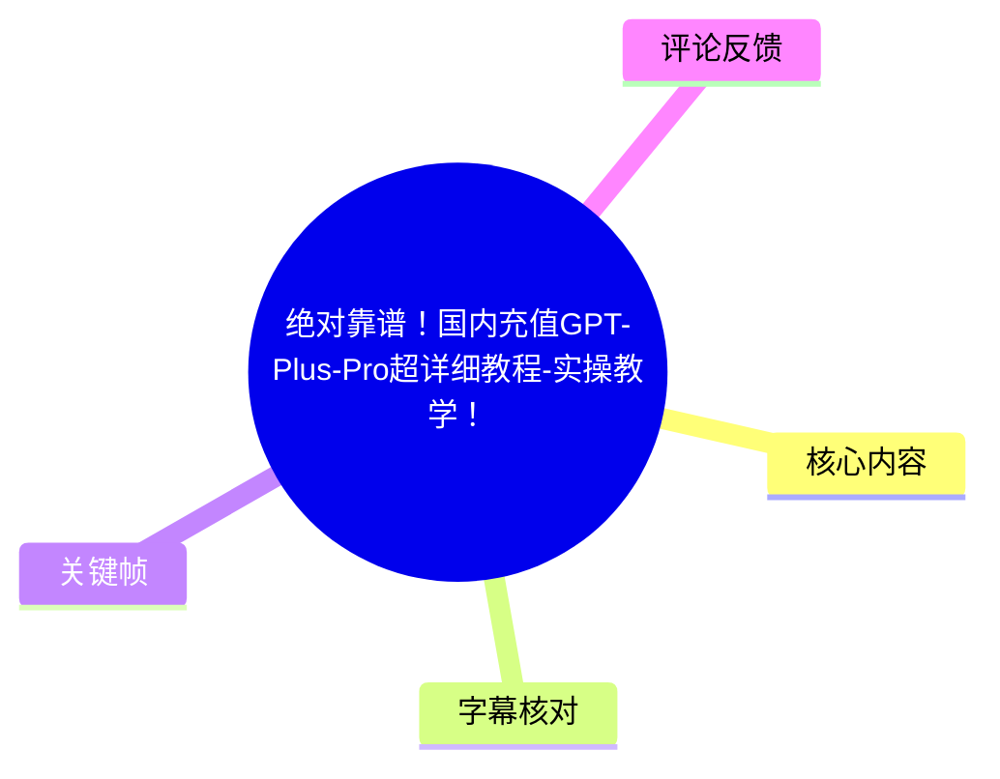
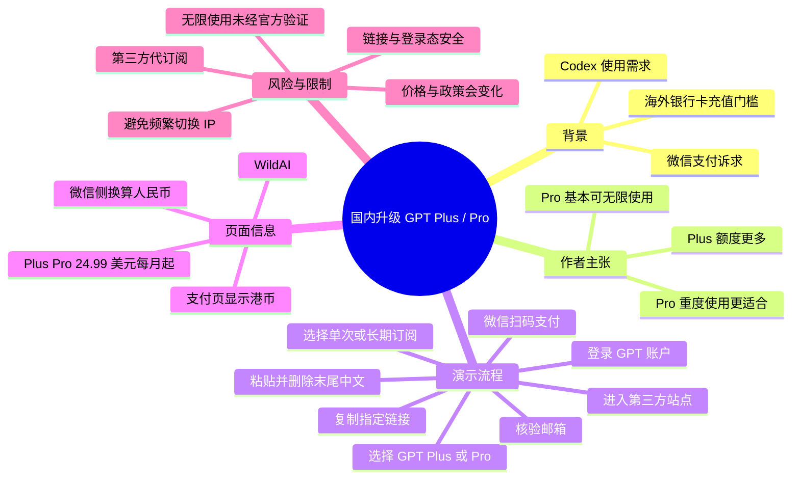
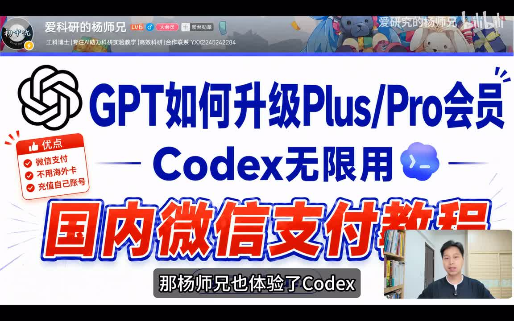
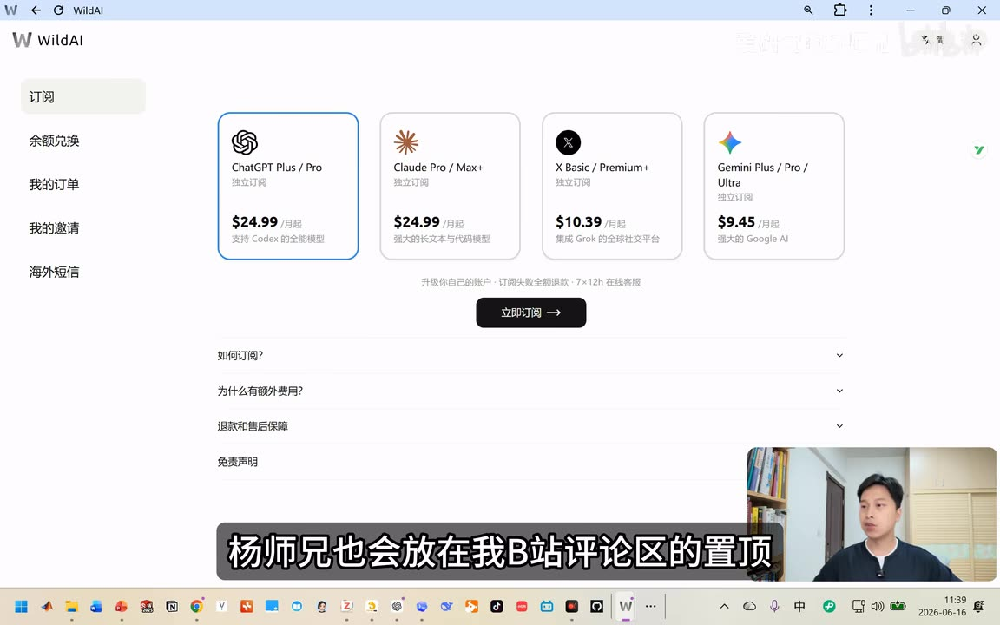

# 绝对靠谱！国内充值GPT-Plus-Pro超详细教程-实操教学！

> 来源：[Bilibili 视频](https://www.bilibili.com/video/BV1uCju6XEWv) 
> UP 主：爱研究的杨师兄｜视频时长：03:15｜合集：AIcode  
> 视频简介中提供的第三方地址为：`https://bewild.ai?code=I9QBHLTV`。该链接含推广参数，且本视频演示的是将已登录 GPT 账户相关链接复制到第三方页面的流程；使用前应自行评估账户、隐私、资金与服务条款风险。

## 小结

视频围绕“在国内以微信支付升级 GPT Plus / Pro”的第三方代订阅流程展开。UP 主将 Codex 的可用额度与 GPT 会员等级关联：其个人表述是，Plus 的额度相对更多，Pro 在其使用场景下“基本可以无限使用”；这属于视频作者的体验性判断，并非 OpenAI 的官方、无条件额度承诺。

视频演示的平台为 WildAI 页面。画面中可见其提供 ChatGPT Plus / Pro、Claude Pro / Max+、X Basic / Premium+、Gemini Plus / Pro / Ultra 等订阅入口；本期实际只演示 ChatGPT Plus / Pro。页面截图显示 ChatGPT Plus / Pro 为 **$24.99/月起**，但该金额来自第三方页面，不能直接视为 OpenAI 官方定价或最终人民币扣款金额。

操作核心并非直接在 GPT 内付款，而是：在第三方站点选择产品与订阅周期，登录自己的 GPT 账户，按演示复制 GPT 页面中的某个链接，再粘贴回第三方页面，并删除粘贴内容末尾的中文字符，核验账户邮箱后进入订单与微信支付。视频称支付页会显示港币，微信扫码支付时会自动换算成人民币。

需要特别警惕的是，视频未解释所复制链接的技术性质、第三方如何处理账户授权、订单交付机制、退款规则以及后续会员状态核验方式。任何要求从已登录服务页面复制链接并提交给第三方的操作，都可能涉及账户访问、登录态或授权风险；不应在未核实服务方信誉、隐私政策及官方条款前照做。

UP 主还提醒“IP 一定要干净”，避免频繁切换，否则“容易封号”；ASR 将该词误识别为“T字”，结合语境校正为“IP”。这是一项作者经验性提醒，视频没有给出平台规则出处，也没有证明封号与 IP 切换之间的具体因果关系。

## 思维导图

## 目录

- [背景、目标与适用边界](#背景目标与适用边界)
- [作者对 Codex、Plus 与 Pro 的判断](#作者对-codexplus-与-pro-的判断)
- [第三方订阅页与可见价格](#第三方订阅页与可见价格)
- [实操流程：选择套餐与周期](#实操流程选择套餐与周期)
- [实操流程：登录、复制链接与粘贴](#实操流程登录复制链接与粘贴)
- [实操流程：核验账户与微信支付](#实操流程核验账户与微信支付)
- [风险、限制与时效性](#风险限制与时效性)
- [字幕比对](#字幕比对)
- [评论分析](#评论分析)
- [处理记录](#处理记录)

## 背景、目标与适用边界 [00:00:30](https://www.bilibili.com/video/BV1uCju6XEWv?t=30)

视频前约 30 秒没有可用 ASR 语音段；从 **00:00:29.600** 开始，UP 主说明近期 Codex 很火，自己已将其用于制作应用及科研相关 skills，并将本期目标定义为：让 Codex 能够持续使用。

其给出的前提是 GPT 会员等级：Plus 可能有更多额度，Pro “基本上”可以无限使用。随后他提出国内用户升级时可能需要海外银行卡，因此介绍一种以国内微信支付完成升级的方式。

> 图：该关键帧直接呈现视频承诺的三个核心点——“升级 Plus/Pro”“Codex 无限用”“国内微信支付”，同时列出“微信支付、无需海外卡、充值自己账号”等宣传语。它有助于区分封面式主张与后续实际演示的第三方订阅流程；其中“无限用”是宣传/作者判断，不应理解为可验证的官方保证。

### 前置条件与适用对象

- **目标用户**：希望为自己的 GPT 账户开通 Plus 或 Pro，且希望使用微信支付的人。
- **演示对象**：第三方站点上的 ChatGPT Plus / Pro 订阅；虽然页面还展示其他产品，但视频未逐项演示 Claude、Grok（页面写作 X）或 Gemini 的充值。
- **实际所需条件**：视频中明确要求登录自己的 GPT 账户；还需要能够访问第三方站点、完成微信扫码支付，并能核对登录账户邮箱。
- **不适用的理解**：视频没有证明该流程在所有地区、所有 GPT 账户、所有订阅状态下均可成功，也没有演示退款、失败补救、取消订阅或已扣款未升级的处理。

## 作者对 Codex、Plus 与 Pro 的判断 [00:00:30](https://www.bilibili.com/video/BV1uCju6XEWv?t=30)

UP 主将 Codex 的使用体验与 GPT 会员身份直接关联：

| 视频中的表述 | 应如何理解 |
| --- | --- |
| Plus 会员“可能就额度更多一点” | 这是对 Plus 与免费/其他状态的相对额度体验描述，未提供具体次数、窗口期或官方文档。 |
| Pro 会员“基本上可以无限地使用” | 使用了“基本上”这一限定词；并非视频内可验证的无限制服务承诺。实际额度、速率限制和可用功能可能变化。 |
| 重度使用 Codex 选 Pro | 是作者的选购建议。 |
| 轻度、日常使用 Plus 够用 | 同样是作者经验判断，取决于任务量、模型、地区与平台的实时政策。 |

视频只解释了“会员等级可能影响 Codex 使用体验”的结论，没有说明套餐包含的精确功能、请求上限、模型权限、API 用量或地区差异。因此，套餐选择前仍应以目标服务的官方产品页、账户内权益页及条款为准。

## 第三方订阅页与可见价格 [00:00:55](https://www.bilibili.com/video/BV1uCju6XEWv?t=55)

在 **00:00:54.720** 起，UP 主进入并介绍第三方订阅页，称链接会放在 B 站评论区置顶，用户复制链接、打开并登录即可开始充值。视频简介提供的是带邀请码/推广码的 `bewild.ai` 链接。

> 图：关键帧展示 WildAI 的订阅页面，左侧有“订阅、余额兑换、我的订单、我的邀请、海外短信”等入口；主区域可见 ChatGPT、Claude、X、Gemini 四类卡片。这是判断“本教程依赖第三方服务而非 GPT 官方收银台”的重要画面依据。

### 画面可见的产品与标价

| 页面卡片 | 画面文字 | 画面可见月起价 |
| --- | --- | ---: |
| ChatGPT Plus / Pro | 独立订阅；支持 Codex 的全能模型 | $24.99 / 月起 |
| Claude Pro / Max+ | 强大的长文本与代码模型 | $24.99 / 月起 |
| X Basic / Premium+ | 解锁 Grok 的全球社交平台 | $10.39 / 月起 |
| Gemini Plus / Pro / Ultra | 强大的 Google AI 模型 | $9.45 / 月起 |

上述信息仅来自视频画面，不能推导为官方售价、实时售价、税费后金额或支付成功后的实际扣款金额。视频也未展示各套餐的完整权益、订单协议、退款与售后条款，只能确认页面存在“如何订阅”“为什么有额外费用”“退款和售后保障”“免责声明”等折叠项，具体内容在给定画面中未展开。

## 实操流程：选择套餐与周期 [00:00:55](https://www.bilibili.com/video/BV1uCju6XEWv?t=55)

根据 **00:00:54.720—00:01:43.080** 的 ASR，视频中的选择顺序如下：

1. 打开第三方站点并登录。
2. 选择 **GPT Plus 或 Pro**。
3. 点击“立即订阅”。
4. 在“单次订阅”与“长期订阅”之间选择。
5. UP 主建议优先选“单次订阅”，理由是每月单独订一次；若之后不想使用，“就不会自动续费”。
6. 点击“下一步”。
7. 按使用强度选择套餐：
   - 重度使用 Codex：作者建议选 Pro；
   - 轻度或日常使用：作者认为 Plus 足够。
8. 视频示范中选择的是 **一个月 Plus**，随后点击“下一步”。

### 对“单次订阅”的边界说明

“单次订阅不会自动续费”是 UP 主的口头说明。视频没有展示订单确认页的续费字段，也没有演示取消入口，因此应在付款前查看页面上实际展示的周期、自动续费、扣款主体、退款和取消规则，不能仅依赖视频表述。

## 实操流程：登录、复制链接与粘贴 [00:01:43](https://www.bilibili.com/video/BV1uCju6XEWv?t=103)

根据 **00:01:43.080—00:02:31.240** 的 ASR，作者演示了一个与账户登录相关的关键步骤：

1. 登录自己的 GPT 账户。
2. 回到第三方网页，点击“我已登录”。
3. 按视频所指引点击 GPT 页面中的“这个链接”。
4. 使用 `Ctrl + A` 全选，再右键复制。
5. 回到第三方页面，点击“下一步”。
6. 将刚复制的整段内容粘贴到页面指定位置。
7. **删除粘贴内容末尾的全部中文字符**。
8. 再次点击“下一步”。

### 该步骤的安全含义

视频没有展示或说明被复制内容的完整格式、URL 域名、参数含义、是否含一次性授权信息，以及第三方将如何使用该内容。因此，不能把它概括为“普通复制链接”而忽略安全边界。

建议至少做到：

- 仅在确认是本人账户、本人设备、预期站点时操作；
- 不向不明站点提交密码、验证码、恢复码、会话 Cookie、API Key 或完整登录令牌；
- 在粘贴前检查内容中是否包含敏感参数、邮箱、账户标识或授权信息；
- 认真阅读第三方站点的隐私、服务、退款及账户交付说明；
- 若对链接性质无法判断，不要继续提交。

这些是基于视频流程所作的通用安全建议，并非视频中已展示的机制说明。

## 实操流程：核验账户与微信支付 [00:02:31](https://www.bilibili.com/video/BV1uCju6XEWv?t=151)

在 **00:02:31.240—00:02:55.330**，UP 主说明后续为邮箱确认、订单创建与付款：

1. 提交后确认 GPT 账户邮箱。
2. 邮箱确认方法：回到 GPT 页面，点击视频所指的位置查看邮箱。
3. 邮箱无误后点击“下一步”。
4. 完成页面要求的验证。
5. 系统开始“创建订单、获取支付信息”。
6. 页面自动跳转到微信支付。
7. 视频称支付页面会显示**港币**；用微信扫码支付时会“自动转换成人民币”。

### 支付参数与核验清单

| 项目 | 视频信息 | 建议核验点 |
| --- | --- | --- |
| 订阅对象 | GPT Plus 或 Pro | 确认套餐名称、账户邮箱与所选周期一致。 |
| 演示周期 | 一个月 Plus | 不要将演示选择误认为必须选择 Plus 或一个月。 |
| 页面币种 | 港币 | 下单前核对最终港币金额、汇率、可能的手续费与人民币实扣金额。 |
| 支付方式 | 微信扫码支付 | 确认微信付款页中的收款方、订单号、金额和商品说明。 |
| 交付结果 | 视频未展示最终 GPT 账户权益页 | 支付后应到 GPT 账户内自行确认订阅状态，不应只以第三方订单状态判断。 |

视频在支付环节只讲到“自动跳转至微信支付”，未提供支付成功后的实际会员页面、到账时长或失败处理流程。评论区也出现“已经支付但未升级”的提问，进一步说明支付与权益到账之间可能存在需要自行核对的环节。

## 风险、限制与时效性 [00:02:55](https://www.bilibili.com/video/BV1uCju6XEWv?t=175)

### UP 主的账户使用提醒

在 **00:02:55.330—00:03:14.510**，UP 主提醒：使用 GPT 时“IP 一定要干净”，若 IP 频繁切换，“很容易封号”；他强调这与充值过程无关。

这里“IP”是根据语境对 ASR 误识别词“T字”的校正。视频没有定义“干净 IP”的技术标准，也没有引用任何官方规则。因此，较稳妥的理解是：避免频繁、异常地切换网络出口或登录环境，并遵守服务商所在地区的使用政策；不要把该说法视作规避风控或封禁的保证。

### 重要限制

1. **第三方性质**：本视频并未演示官方 GPT 订阅收银台，而是展示第三方站点的订阅/代办流程。资金、账户、隐私与售后风险需要用户自行判断。
2. **“安全”“靠谱”“无限”的证据有限**：这些是标题、页面宣传或作者表达。视频未展示独立审计、官方授权证明、额度条款或长期稳定性证据。
3. **账户与授权风险**：流程要求登录 GPT 并复制特定链接到第三方页面；视频未解释链接包含什么信息。对任何可能带有账号授权性质的数据都应谨慎处理。
4. **价格与币种风险**：画面中的 $24.99/月起和付款页港币均可能随时间、套餐、汇率、税费及服务方政策变化。
5. **结果未闭环展示**：视频没有展示支付完成、账户实际升级、权益到账、取消续费、退款或异常订单处理的完整证据。
6. **服务条款与地区政策**：服务可用范围、付款方式、会员权益及账户风控规则可能变化，应以相关服务的现行官方规则为准。

### 时效性

视频元数据发布时间为 2026-06-16，素材抓取时间为 2026-07-15。AI 产品会员权益、地区可用性、第三方价格、支付通道、汇率和账户风控均具有较强时效性。本笔记记录的是该视频当时的演示内容，不构成截至当前仍然有效的充值方案或成功承诺。

## 字幕比对

| 字幕来源 | 完整性 | 专有名词 | 时间轴 | 主要问题 |
| --- | --- | --- | --- | --- |
| Bilibili 站内字幕 | 未提供可用字幕 | 无法评估 | 无法评估 | 素材采集警告显示字幕工具因 `Invalid URL` 退出，故没有可用于正文的站内字幕。 |
| 本次 ASR 字幕 | 覆盖 00:00:29.600—00:03:14.510；诊断语音覆盖率约 84.71% | 存在多处同音或错词 | 有 8 个带起止时间的 SRT 分段，可直接定位 | 每段时长约 24 秒、文本密集；“Cloud / Grock / Germany”“T字”等词识别不准，且首段在 1.06 秒内承载大量内容，粒度较粗。 |

### 最终字幕选择与校正

正文采用**本次 ASR 的 SRT 时间轴**作为章节定位依据：00:00:30、00:00:55、00:01:19、00:01:43、00:02:07、00:02:31、00:02:55 均来自对应 SRT 分段起点换算，未按照文本顺序臆测时间。

本次 ASR 已实际检查：识别语言为中文，语言置信度为 `0.9990234375`，模型为 `medium`，未标记 `noAudioStream=true`，因此可以确认源视频存在音轨；没有将站内字幕获取失败误判为无音频或 ASR 工具失败。

结合画面、标题、视频简介和上下文，对以下词语作了有限校正：

| ASR 原文/近似写法 | 正文采用写法 | 校正依据 |
| --- | --- | --- |
| `CodeX`、`Code x` | Codex | 标题、画面及上下文一致。 |
| `cloud` | Claude | 视频标签与订阅页卡片显示 Claude Pro / Max+。 |
| `grock` | Grok | 视频标签有“国内Grok会员充值方法”；页面以 X 卡片呈现。 |
| `germany` | Gemini | 订阅页卡片显示 Gemini Plus / Pro / Ultra。 |
| `T字一定要干净` | IP 一定要干净 | “频繁切换、容易封号”的上下文指向网络 IP；此为语境校正，非逐字听写。 |
| `XGPT 的账户邮箱` | GPT 账户邮箱 | 上下文为确认已登录 GPT 账户的邮箱。 |

## 评论分析

可获取热评数据共 **2 条**，不足 3 条；以下仅处理这两条，不补造第三条内容。

### 1. 傲来君辞owo（5 赞）

该评论提供了另一条通过 Google Play 与 Visa / 万事达卡订阅 ChatGPT 的经验路径，针对错误代码 `OR-REH-04`，建议：

- 在 Google Play 的付款设置中移除已绑定卡；
- 再次添加信用卡/借记卡，并填写与申请银行卡一致的地址信息；
- 回到 ChatGPT App 再次订阅；
- 若仍失败，清除 Google Play 缓存和数据，并尝试与付款资料所属地区相匹配的网络节点。

评论者自称使用“招行全币种 VISA 卡”订阅成功。该内容是**个人经验分享**，不属于视频演示流程，也没有得到素材中的独立验证；其中涉及地区、网络节点和付款资料的操作可能受到平台政策限制。它的价值在于提示：支付失败可能与支付资料、商店账户或缓存状态有关，而不仅是缺少某一种支付通道。

### 2. 鹏叔叔来了（3 赞）

评论内容为：“你好按照你方法支付了 为什么还没有升级呢？”

这条评论没有提供订单状态、支付时间、账户类型或后续处理结果，无法据此判断原因；但它反映出视频未详细覆盖的关键问题：**完成付款不等于已验证会员权益到账**。实际操作中应保留订单凭证，并在目标 GPT 账户内确认订阅状态；若无变化，应依照付款页面或服务方公开售后渠道处理，而非仅凭视频流程继续重复支付。

## 处理记录

- Worker ID：`worker-mrj0www4-e8d79408`
- 整理模型：`gpt-5.6-terra`
- ASR 模型与参数：`medium`；语言自动识别为 `zh`，置信度 `0.9990234375`；CUDA / `float16`；音频时长 `194.676125` 秒。
- 使用的素材工具产物：视频元数据 `info.json`、音频 `audio/audio.wav`、ASR 结果 `asr/asr-result.json`、时间轴字幕 `asr/transcript.srt`、关键帧目录 `frames/`、热评数据 `comments/comments.json`。
- 字幕选择：站内字幕未提供可用版本，且字幕获取工具报告 `Invalid URL`；已检查本次 ASR，源视频未标记 `noAudioStream=true`，故以 ASR SRT 的真实起止时间作为时间轴依据，并对少量专名做上下文校正。
- 关键帧选择依据：
  - `frames/frame-001.jpg`：标题页明确显示“GPT 如何升级 Plus/Pro 会员”“Codex 无限用”“国内微信支付”，用于界定视频宣传与主题。
  - `frames/frame-004.jpg`：展示 WildAI 订阅页、可选服务与月起价，用于证明教程依赖第三方订阅页面及画面可见的产品信息。
- 热评范围：请求上限为前三条，但实际仅返回 2 条；已严格只分析可获取的两条。
- 缓存清理：提供的素材与任务记录未包含缓存清理执行结果；本整理不将其编造为已完成。
- 未解决问题：无法从现有素材确认第三方服务的授权关系、链接所含信息、真实交付机制、退款政策、支付后到账时间、当前可用性及官方合规性。
