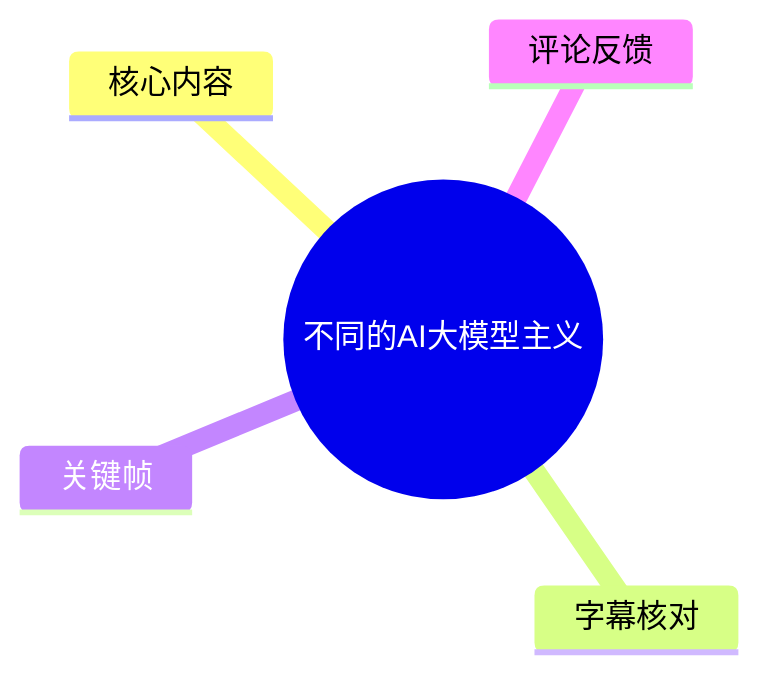
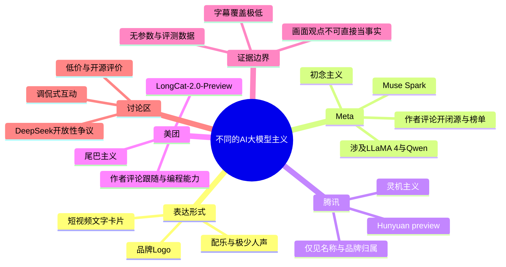
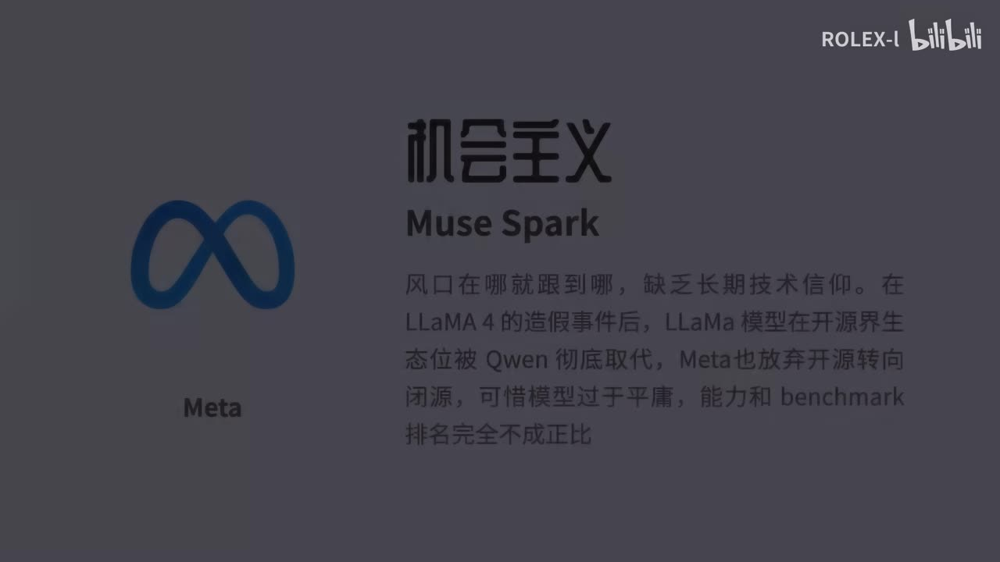

# 不同的AI大模型主义

> 来源：[Bilibili 视频](https://www.bilibili.com/video/BV1rSjx6XEBZ) 
> UP 主：ROLEX-l｜发布时间：2026-06-21｜视频时长：01:01｜分辨率：1920×1080 
> 视频简介：`娱乐视频`

## 小结

这是一支以静态文字卡片、品牌 Logo 和配乐为主要载体的短视频。标题中的“不同的 AI 大模型主义”并非技术流派的正式定义；从可见画面看，它是创作者借“主义”这一讽刺性标签，对部分公司的大模型路线、产品节奏与市场表现作出的主观点评。

已提供的关键帧明确出现了 Meta、腾讯和美团三家公司，以及 `Muse Spark`、`Hunyuan preview`、`LongCat-2.0-Preview` 等产品/名称。卡片将 Meta 描绘为追逐风口、技术信仰不足；将腾讯描述为“灵机主义”；将美团描述为跟随式推进、创新引领不足。这些均属于视频作者的评论，不能直接视为经过独立验证的产业事实。

画面中最具技术含义的内容，是 Meta 卡片提到 LLaMA 4、Qwen、开源生态位、闭源转向、模型能力和 benchmark（基准测试）排名；美团卡片提到“编程能力”。但视频没有展示模型版本规格、上下文长度、训练数据、基准分数、价格、推理速度、部署配置或评测方法，因此不能据此形成模型性能排名或采购结论。

音频信息极少：本次 ASR 仅在约 00:16.72—00:18.24 识别出一句疑似歌曲/配乐人声，站内字幕也仅覆盖约 3.6 秒。故本文以关键帧的可见文字为主，并把所有无法从素材确认的背景、因果和时序明确标注为未知。

适合将本视频作为“AI 社区对模型厂商路线的讽刺性表达”的案例阅读，而不适合当作行业新闻、模型测评、开源政策记录或技术选型依据。涉及模型生态、开闭源策略与能力比较的说法具有强时效性，且需要回到官方公告、模型卡、代码仓库和可复现实验进一步核验。

## 思维导图

## 目录

- [视频性质、材料范围与阅读方式](#视频性质材料范围与阅读方式)
- [可见卡片：Meta 与“初念主义”](#可见卡片meta-与初念主义)
- [可见卡片：腾讯与“灵机主义”](#可见卡片腾讯与灵机主义)
- [可见卡片：美团与“尾巴主义”](#可见卡片美团与尾巴主义)
- [技术信息、方法与缺失参数](#技术信息方法与缺失参数)
- [结论、限制与时效性](#结论限制与时效性)
- [字幕比对](#字幕比对)
- [评论分析](#评论分析)
- [处理记录](#处理记录)

## 视频性质、材料范围与阅读方式 [00:13](https://www.bilibili.com/video/BV1rSjx6XEBZ?t=13)

视频总时长为 61 秒，元数据标签为“搞笑、AI、人工智能、claude、豆包、gpt”。不过，在本次可用的字幕与关键帧材料中，未见 Claude、豆包、GPT 的具体画面文字或口述论证；不能仅因标签存在，就补写这些模型的观点。

站内字幕从 00:13.58 才开始，ASR 从 00:16.72 才识别到语音，且两者内容均像配乐/歌曲中的短句，而非对画面观点的讲解。基于真实时间信息，本文只能将 **00:13** 作为已知的内容时点锚点；关键帧素材未提供逐帧采样时间，故不为各卡片虚构精确出现秒数或严格播放顺序。

视频的核心表达方式可概括为：

1. 使用公司 Logo 和产品名建立指代对象；
2. 为对象附加带有戏谑色彩的“主义”标签；
3. 用简短文字表达对产品路线或能力的负面/调侃式判断；
4. 以音乐而非解说串联画面。

因此，阅读这类内容时应区分三层：

- **画面可证实**：卡片上实际出现的名称、公司归属、文字。
- **作者观点**：如“缺乏长期技术信仰”“不敢引领创新方向”等评价。
- **尚待核验的外部事实**：如某事件是否发生、某公司是否调整开源策略、模型是否被另一模型“彻底取代”等。

## 可见卡片：Meta 与“初念主义” [00:13](https://www.bilibili.com/video/BV1rSjx6XEBZ?t=13)

> 图：该帧直接呈现 Meta Logo、`初念主义`、`Muse Spark` 及长段评论，是本视频中信息密度最高的可见卡片。它能帮助区分“画面原文”与“作者判断”，但不能为文字中的产业结论提供独立证据。

画面左侧为 Meta 标志和“Meta”，右侧标题为“初念主义”，下方英文为 `Muse Spark`。可辨识的正文大意/原文包括：

> 风口在哪就跟到哪，缺乏长期技术信仰。  
> 在 LLaMA 4 的造假事件后，LLaMa 模型在开源界生态位被 Qwen 彻底取代，Meta 也放弃开源转向闭源。  
> 可惜模型过于平庸，能力和 benchmark 排名完全不成正比。

### 画面涉及的技术概念

| 概念 | 画面中的用法 | 可据此确认的范围 |
| --- | --- | --- |
| LLaMA 4 | 被用作讨论 Meta 模型路线的节点 | 仅能确认视频文字提到了该名称与“造假事件”说法；事件本身未附来源。 |
| Qwen | 被用于比较开源生态位 | 仅能确认作者认为其替代了 LLaMA 的生态位；“彻底取代”是绝对化观点。 |
| 开源/闭源 | 被用于概括 Meta 的策略变化 | 画面未给出具体模型、许可证、发布日期或官方政策，不能据此确认策略全貌。 |
| benchmark | 被用于质疑能力与榜单关系 | 没有提供基准名称、分数、评测集、提示词、硬件、版本或复现链接。 |

### 需要保留的证据边界

- “LLaMA 4 的造假事件”是画面中的陈述，但本素材没有新闻链接、公告、涉事对象或时间，无法验证其指代及真实性。
- “Qwen 彻底取代”“Meta 放弃开源转向闭源”“能力和 benchmark 排名完全不成正比”都是强结论，却没有比较对象、指标定义及数据支撑。
- `Muse Spark` 与 Meta 的对应关系可从卡片排版看出是视频的表达意图，但视频未说明它是模型、产品名、代号还是创作性文字，不能擅自扩展解释。

## 可见卡片：腾讯与“灵机主义” [00:13](https://www.bilibili.com/video/BV1rSjx6XEBZ?t=13)

> 图：该帧以腾讯品牌和蓝色视觉卡片呈现“灵机主义”与 `Hunyuan preview`。其文字信息较少，恰好说明不能把其他卡片的批评内容迁移到腾讯卡片上。

该关键帧显示腾讯 Logo、公司名“腾讯”、大字“灵机主义”，以及右侧较模糊但可辨识为 `Hunyuan preview` 的英文文字。

与 Meta 和美团卡片相比，这一帧未提供可读的长段评价、技术参数或实例。因此，能够可靠整理出的信息仅为：

- 视频把腾讯纳入其“大模型主义”的戏谑分类框架；
- 卡片标签为“灵机主义”；
- 画面关联了 `Hunyuan preview` 这一名称；
- 没有出现可供核实的模型能力、定价、开源许可证、上下文长度、基准成绩或产品功能说明。

“灵机主义”的具体含义没有在可用字幕或画面中展开。它可能是创作者自造的讽刺标签，但其定义、褒贬方向和所指产品策略均无法由本素材确定。

## 可见卡片：美团与“尾巴主义” [00:13](https://www.bilibili.com/video/BV1rSjx6XEBZ?t=13)

> 图：该帧清楚显示美团 Logo、`尾巴主义`、`LongCat-2.0-Preview` 与两项能力/路线评价，是理解视频“追随者”讽刺逻辑的直接依据。

画面左侧为美团 Logo 和“美团”，右侧标题为“尾巴主义”，产品文字为 `LongCat-2.0-Preview`。画面正文为：

> 跟在别人后面亦步亦趋，不敢引领创新方向。  
> 性能落后国内第一梯队模型半年，编程能力还有很大差距。

### 可提炼的观点与不能确认的内容

| 画面陈述 | 性质 | 素材是否给出验证条件 |
| --- | --- | --- |
| “跟在别人后面亦步亦趋，不敢引领创新方向” | 作者路线评价 | 否；未定义“创新方向”或对照对象。 |
| “性能落后国内第一梯队模型半年” | 作者的相对能力与时间差判断 | 否；未列出模型版本、发布时间、任务集或量化分数。 |
| “编程能力还有很大差距” | 作者能力评价 | 否；没有代码任务、语言范围、通过率或评测样例。 |
| `LongCat-2.0-Preview` | 画面出现的产品/版本文字 | 是，但未解释版本状态、能力范围或可用方式。 |

这里的“半年”是唯一可见的相对时间参数，但它并不等于可复现的性能测量：没有说明“国内第一梯队”指哪些模型，也没有说明是以发布日、功能达到时间，还是特定 benchmark 分数来计算。因此应将其保留为原作者主张，而非行业事实。

## 技术信息、方法与缺失参数 [00:13](https://www.bilibili.com/video/BV1rSjx6XEBZ?t=13)

本视频不是教程或评测视频，未展示操作流程、命令、代码、API 调用、模型下载、部署步骤或测试步骤。没有任何可供复现的技术方法，不能据此整理出“如何使用模型”的实践指南。

### 视频实际涉及但未展开的技术维度

1. **模型生态与开源策略**  
   Meta 卡片把 LLaMA 与 Qwen 放在开源生态竞争的叙事中，并进一步提出“转向闭源”的判断。要验证此类主张，至少需要对应模型的发布公告、许可证文本、权重可得性、接口策略和版本时间线；视频均未提供。

2. **模型评测与排行榜**  
   视频使用 `benchmark` 一词评价模型能力与排名的关系。可靠比较至少需明确：
   - 比较的模型及精确版本；
   - benchmark 名称与任务构成；
   - 测试日期和榜单版本；
   - 推理设置，如温度、采样次数、工具调用条件；
   - 模型是否使用联网、搜索、代码执行或其他外部工具；
   - 成本、延迟、上下文长度等实际部署约束。  
   
   这些要素均未出现，因此不存在可提取的指标、排名或实验结论。

3. **编程能力**  
   美团卡片仅用一句话否定“编程能力”，没有指定代码语言、问题类型、单轮或 Agent 模式、测试集、补丁通过率或人工偏好评分。任何“谁更强”的进一步结论都会超出素材。

### 关键帧补充：转场/留白画面

> 图：该帧主要保留视频的蓝色视觉背景与水印，未包含可读取的新增论点。它的价值在于提示画面卡片之间可能存在转场或留白，不应把未显示在同一帧的信息拼接成连续口述论证。

## 结论、限制与时效性 [00:13](https://www.bilibili.com/video/BV1rSjx6XEBZ?t=13)

### 可迁移的阅读经验

- 对“某模型完全取代另一模型”“落后半年”“能力与榜单不成正比”这类绝对或强比较表述，应优先寻找版本号、评测集、原始分数和测试条件。
- “开源”“闭源”不是单一二元标签。模型权重、训练数据、代码、许可证、API、商用条件分别可能具有不同开放程度，不能只凭短视频卡片下结论。
- 对“编程能力”的判断要区分代码补全、函数调用、仓库级修复、Agent 工具调用和真实工程交付；不同场景的结论未必相同。
- 本视频的价值主要在于记录一种社区表达和情绪化产业观察，而非提供技术决策依据。

### 素材限制

1. **无口述论证**：ASR 只覆盖 1.52 秒，占总时长约 2.52%，且内容疑似配乐歌词。
2. **站内字幕不完整**：仅有 00:13.58—00:19.20 的三条短字幕，未解释大部分视觉文字。
3. **关键帧无逐帧时间标记**：不能为各公司卡片制造精确时间轴，正文统一使用真实字幕起点 00:13 作为可验证锚点。
4. **无外部来源**：视频中关于事件、策略、生态位、能力和排名的断言未附出处。
5. **可见画面有限**：本次提供的画面材料只足以可靠处理 Meta、腾讯、美团三张卡片；不能推断整支视频是否还包含其他厂商或完整分类体系。

### 时效性

视频发布于 2026-06-21。模型发布、产品预览版状态、开源政策、排行榜和社区口碑都可能在短时间内变化。尤其是 `Preview` 命名通常意味着产品状态可能变动；本素材没有提供其后续版本信息。本文不将视频评论更新为截至当前的事实结论。

## 字幕比对 [00:13](https://www.bilibili.com/video/BV1rSjx6XEBZ?t=13)

| 字幕来源 | 完整性 | 专有名词 | 时间轴 | 主要问题 |
| --- | --- | --- | --- | --- |
| Bilibili 站内字幕 | 极低：仅 3 条，覆盖约 00:13.58—00:19.20 | 未包含模型、公司或技术名词 | 有真实 SRT 时间轴 | 内容为“科比欧哈哈哈哈”“♪ 别逗一逗 ♪”“♪ 别笑了 ♪”，更像配乐/歌词，无法转写画面观点。 |
| 本次 ASR 字幕 | 极低：1 段、1.52 秒，语音覆盖率 2.52% | 未识别出模型、公司或技术名词 | 有真实时间轴：00:16.72—00:18.24 | 识别为“別逗你逗別笑了”，与站内歌词存在同音/断句差异，且 ASR 诊断提示语音占比低于 4%。 |

### 最终字幕选择

- **不以任一字幕作为画面观点的主要依据**：两份字幕均不能覆盖卡片文字。
- **配乐短句优先参考站内字幕**：站内字幕分段更细，且显示了音乐符号；ASR 的“別逗你逗別笑了”可视为对同一段音频的低置信度近似识别。
- **画面信息以关键帧直接可见文字为准**：包括“初念主义 / Muse Spark / Meta”“灵机主义 / Hunyuan preview / 腾讯”“尾巴主义 / LongCat-2.0-Preview / 美团”等。
- 本次 ASR 结果中**未标记** `noAudioStream=true`，因此不能说源视频无音轨；诊断结果表明源音频存在，但可识别语音极少，较可能以音乐、静音或非清晰人声为主。

### 重要校正

- 站内字幕“♪ 别逗一逗 ♪”“♪ 别笑了 ♪”与 ASR “別逗你逗別笑了”在语义切分上不一致；由于音频显然不是技术讲解，未将其用于解释任何模型观点。
- `benchmark`、`LLaMA 4`、`Qwen`、`LongCat-2.0-Preview` 等术语来自可见画面，而非字幕或 ASR。

## 评论分析 [00:13](https://www.bilibili.com/video/BV1rSjx6XEBZ?t=13)

以下仅处理可获取的热评前三条。评论反映观众态度与争议焦点，不构成对模型能力、审查策略、价格或开源状态的已验证证明。

### 1. 鉤如月（35 赞）

> “可算了吧，经典懂一点就发视频的来了。现在来说，哪个模型能比ds更自由无审核啊，就grok那敏感样，去年还行，今年美国那群大模型没一个能比ds自由开放的”

- **观点概括**：评论者反对视频或其隐含判断，认为 DeepSeek（评论中写作“ds”）在“自由、无审核、开放”方面优于其他模型，并批评创作者了解不足。
- **补充信息**：提出了 DeepSeek 与 Grok、美国模型之间的比较维度，即内容限制/审核与开放程度。
- **争议与可信度**：评论没有说明模型版本、使用地区、具体提示词、审核规则、开源许可证或测试时间。“无审核”“最自由开放”均为绝对化说法，且“自由”与“开放”并非同一技术或产品属性，不能据此确认。

### 2. Yuki_leeds（292 赞）

> “ai界的野狗主义，deeseek虽说性能不行，但是低价+开源还是太权威性。就好比一条野狗在你身后追，跑赢了没奖励，跑输了有惩罚”

- **观点概括**：评论者以“野狗主义”戏仿视频的命名方式，认为 DeepSeek 即便性能不突出，仍凭借低价与开源形成较强竞争压力。
- **补充信息**：补充了价格和开源两个商业/生态维度，指出“性能”不是模型竞争的唯一变量。
- **争议与可信度**：评论中的“性能不行”“低价”“开源”均未标注具体模型、套餐、时间或对比对象。“权威性”疑为主观修辞，不应理解为正式行业指标。该评论 292 赞，说明认同度较高，但点赞不能替代事实验证。

### 3. 独在故乡亦为异客（105 赞）

> “哦对了，插根火把，不针对任何人但欢迎对号入座。”

- **观点概括**：评论者将视频理解为具有“引战”或讽刺性、易让相关受众自行代入的内容。
- **补充信息**：没有提供模型技术或行业事实补充，主要说明视频的传播语境和互动风格。
- **争议与可信度**：属于玩笑式评论，不包含可验证论据；但与视频“主义”标签化、调侃化的呈现方式相符。

## 评论分析

- 热评 1：可算了吧，经典懂一点就发视频的来了。现在来说，哪个模型能比ds更自由无审核啊，就grok那敏感样，去年还行，今年美国那群大模型没一个能比ds自由开放的
- 热评 2：ai界的野狗主义，deeseek虽说性能不行，但是低价+开源还是太权威性。就好比一条野狗在你身后追，跑赢了没奖励，跑输了有惩罚
- 热评 3：哦对了，插根火把，不针对任何人但欢迎对号入座。

以上内容是观众反馈摘录，只用于补充理解视频反响，不作为正文事实依据。

## 处理记录

- **Worker ID**：worker-mrj0wbly-5dc4e50c
- **模型**：gpt-5.6-terra
- **调用工具与输入材料**：视频元数据、Bilibili 站内 SRT 字幕、ASR 诊断与 SRT、关键帧素材、可获取热评前三条。
- **ASR 检查结果**：已检查本次 ASR。识别语言为中文（置信度 0.990234375），模型标记为 `medium`，音频时长 60.224 秒；仅识别 1 个片段（00:16.72—00:18.24），语音覆盖率 0.0252。诊断提示识别语音少于 4%，可能是音乐、静音、音轨不匹配或识别不完整；结果未标记 `noAudioStream=true`。
- **字幕选择**：站内字幕与 ASR 均保留用于核对配乐短句；由于二者都不覆盖画面论点，正文以关键帧中直接可见的文字为主要证据。站内字幕的真实起始时间 00:13.580 被用于章节时间锚点。
- **关键帧选择依据**：选用 `frame-001.jpg`、`frame-002.jpg`、`frame-003.jpg` 分别支撑 Meta、腾讯、美团卡片的品牌、标签与可读文字；选用 `frame-004.jpg` 说明蓝色转场/留白画面未提供新增论点。未对未提供可视内容的其余帧编号作事实性引用。
- **时间轴依据**：所有正文视频时间轴链接统一锚定至真实站内 SRT 已知起点 13 秒；未根据卡片排列顺序猜测每张卡片的出现秒数。
- **评论范围**：仅分析已提供的热评前三条，未扩展到其他评论或评论回复。
- **缓存清理**：素材清单未提供缓存删除或清理执行记录；本文不声称已完成缓存清理。
- **未解决问题**：缺少完整视觉逐帧时间信息、完整画面序列、模型官方资料与可复现实验数据；Meta 卡片中“LLaMA 4 的造假事件”等说法无法仅凭本素材核验。
