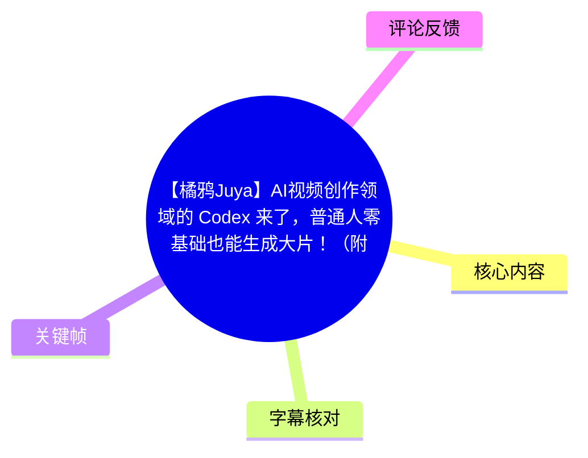
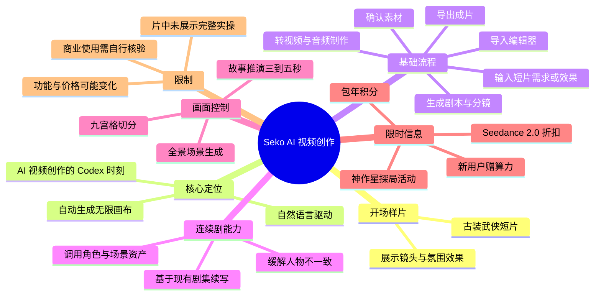
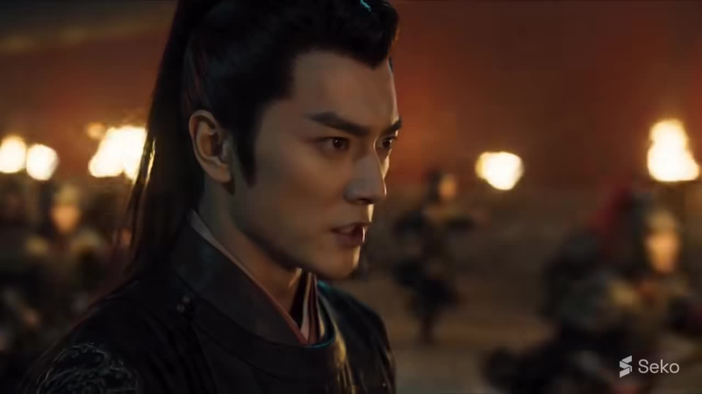
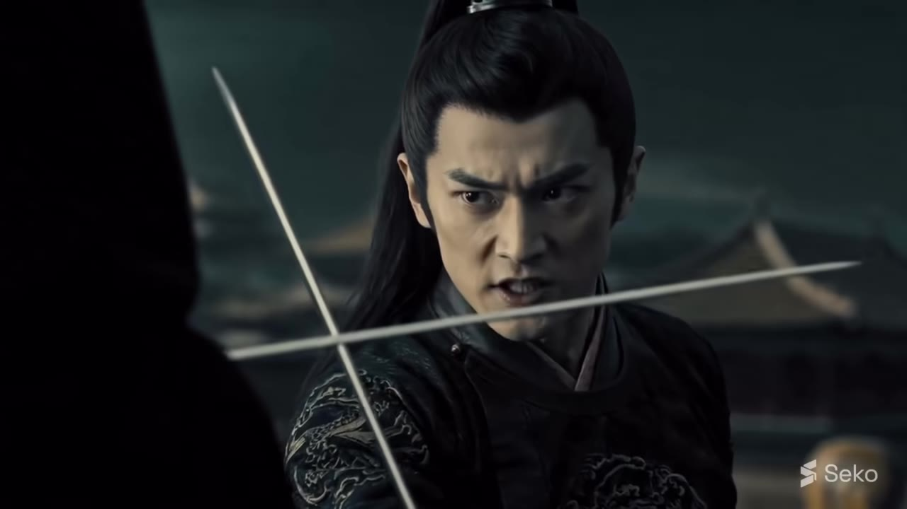
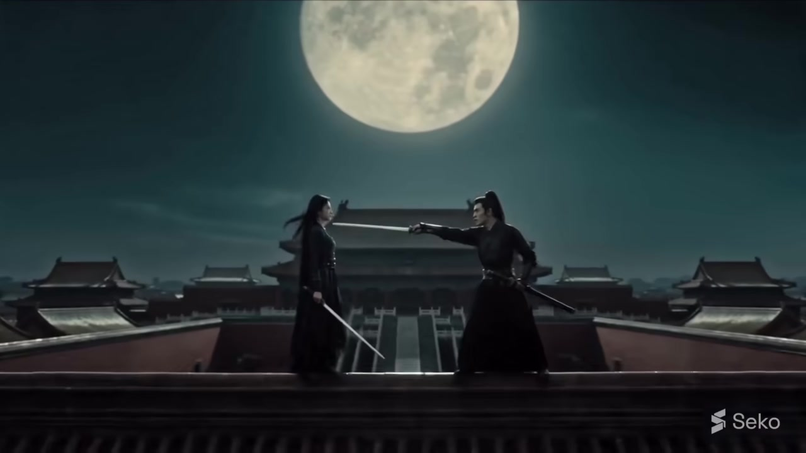

# 【橘鸦Juya】AI视频创作领域的 Codex 来了，普通人零基础也能生成大片！（附彩蛋）

> 来源：[Bilibili 视频](https://www.bilibili.com/video/BV19rEq6yELS) 
> UP 主：橘鸦Juya｜时长：03:33｜分辨率：3840×2160 
> 视频简介中的体验入口：`https://seko.sensetime.com/explore?utm_source=juya`

## 小结

视频以一段带有古装武侠风格的 AI 生成短片开场，随后介绍商汤 **Seko** 的 AI 视频创作能力。UP 主将其概括为 AI 视频创作的“Codex 时刻”：用户不必逐节点搭建工作流，而是可以通过自然语言描述所需短片或效果，由系统生成剧本、风格、主体、场景、分镜及“无限画布”式流程。

视频陈述的核心工作流是：在 Seko 首页文本框输入创作愿望，等待系统完成前置规划；确认生成素材后，将素材一键导入编辑器，再把分镜转为视频，补充配音、配乐并导出成片。该说法强调降低零基础用户的操作门槛，但视频没有展示完整的实际输入、生成耗时、失败案例、价格明细或导出质量对比，因此不能据此推断所有题材都能稳定一键成片。

针对连续剧集创作，视频特别提到可在已有剧集基础上继续生成下一集，并复用既有角色和场景资产；其目标是缓解 AI 视频常见的角色形象不一致问题。另有九宫格切分、故事推演、全景场景生成等功能，被定位为提高镜头叙事和画面可控性的补充工具。

本片属于产品介绍及福利推广内容。视频与简介中提到“新用户注册赠算力”“Seedance 2.0 低至 4.8 折”“包年最高可获 4200 积分”以及“神作星探局”活动和万元大奖机会；这些均具有明显时效性，应以观看时 Seko 官方页面的实际规则、适用范围与价格为准。

适合希望快速了解 AI 短片、AI 真人短剧或多集内容生产流程的初学者阅读。若要用于商业交付，还需自行验证角色一致性、素材版权、生成额度、编辑能力、模型可用性与活动规则。

## 思维导图

## 目录

- [开场样片与产品定位](#开场样片与产品定位-000658)
- [从文本愿望到成片的流程](#从文本愿望到成片的流程-010130)
- [连续剧资产复用与一致性](#连续剧资产复用与一致性-020078)
- [九宫格、故事推演与全景场景](#九宫格故事推演与全景场景-022482)
- [限时福利与活动信息](#限时福利与活动信息-024910)
- [实践步骤与适用边界](#实践步骤与适用边界)
- [结论与限制](#结论与限制)
- [字幕比对](#字幕比对)
- [评论分析](#评论分析)
- [处理记录](#处理记录)

## 开场样片与产品定位 [00:06](https://www.bilibili.com/video/BV19rEq6yELS?t=6)

开场约一分钟为古装武侠风格短片。ASR 在此段识别出“封锁宫门”“一只苍蝇也不准放出去”等台词；其后还有一句剑相关台词，但识别结果“割下好快的剑”“不知失成何处”语义不完整，不能据此还原剧情。

画面可确认出现古装人物、兵器对峙、夜景宫殿与满月等元素，右下角可见 Seko 标识。UP 主从 [01:01](https://www.bilibili.com/video/BV19rEq6yELS?t=61) 起说明：这段开场短片由商汤的 Seko 创作，并借此提出“AI 视频创作的 Codex 时刻已经到了”的判断。

这里“Codex 时刻”是 UP 主的类比表达，意在强调从传统的复杂操作转向以意图描述为主的自动化生产，而非视频中给出的某项可量化技术指标。视频所称的优势是：此前 AI 视频创作可能显得复杂，而 Seko 新上线的“AI 自动创建无限画布”功能可让用户以类似“vibe creating”的方式启动创作。

> 图：关键帧展示武侠短片的角色近景，右下角可见 Seko 标识。它是“开场样片由 Seko 创作”这一视频陈述的直接画面佐证，也说明该样片追求的是电影化人物与光影氛围。

> 图：画面呈现古装人物持剑对峙。该镜头用于说明样片不只是静态人物图，而包含具有叙事张力的动作场景；但单帧不能验证动作连续性、镜头稳定性或实际生成成本。

> 图：眼部极近景突出角色表情与画面细节，是理解视频以“大片”效果作为卖点的有效视觉样本；它不能单独证明所有提示词或所有项目均可获得同等品质。

> 图：满月、宫殿屋顶与双人持剑构成完整的环境叙事镜头。该关键帧补足前述近景无法呈现的场景尺度，体现样片包含人物、空间和镜头调度三个层次。

## 从文本愿望到成片的流程 [01:01](https://www.bilibili.com/video/BV19rEq6yELS?t=61)

UP 主描述的使用入口是 Seko 首页文本框：用户输入“想要的短片”或“想要的效果”，系统即可把创作流程“铺设到位”。视频刻意将这一步概括为“许愿”，强调自然语言输入而非手动配置技术节点。

在 [01:36](https://www.bilibili.com/video/BV19rEq6yELS?t=96) 至 [02:00](https://www.bilibili.com/video/BV19rEq6yELS?t=120) 的说明中，Seko 被描述为可连续完成以下产物或环节：

1. **完整剧本**：形成内容的整体叙事基础。
2. **风格**：确定画面审美方向。
3. **主体**：确定主要人物或对象。
4. **场景**：配置故事发生的环境。
5. **分镜**：将叙事拆解为可生产的镜头。
6. **自动创建无限画布**：将上述内容组织进一个可继续推进的画布流程。
7. **素材确认与导入编辑器**：确认生成素材后，一键导入。
8. **分镜转视频、配音、配乐与导出**：在编辑器内完成成片制作。

视频将其与“其他 AI 视频创作工具需要自己一个一个设置节点”的方式对比。不过，该比较是视频表达的产品立场，未提供同题材、同预算、同模型条件下的对照测试；因此应将其理解为工作流定位，而非通用性能结论。

## 连续剧资产复用与一致性 [02:00](https://www.bilibili.com/video/BV19rEq6yELS?t=120)

除一次性短片外，视频强调 Seko 可在已有剧集的基础上生成“下一集”。据 UP 主介绍，该能力会直接调用上一集沉淀的角色和场景资产，面向多剧集创作者尤其有用。

其要解决的问题是 AI 视频连续生产中的人物不一致：当每集都重新描述人物、服饰和场景时，角色外貌、服装细节或环境风格可能发生漂移。视频的方案是让后续剧集利用此前沉淀的资产，以提高延续性。

需要区分的是：

- **视频明确陈述**：系统可调用上一集沉淀的角色和场景资产，并意在避免人物不一致。
- **视频未展示或量化**：资产如何创建、可保留哪些属性、跨多少集仍有效、能否锁定脸部/服装、失败后如何修正，以及不同模型下的一致性水平。
- **实际使用建议**：对于连续剧项目，应先制作一个角色与场景定义明确的试集，再检查后续生成是否保持角色面貌、服装、道具、时空关系与镜头逻辑一致，而不宜仅依据宣传样片直接进入批量生产。

## 九宫格、故事推演与全景场景 [02:24](https://www.bilibili.com/video/BV19rEq6yELS?t=144)

视频随后列举三类用于强化可控性的功能。

### 九宫格切分

UP 主称“九宫格切分”可使分镜叙事更具逻辑，也为画面控制提供更多余地。根据视频描述，它服务于对镜头内容的拆分与安排；素材未提供具体界面或参数，因此无法确认九个区域分别对应镜头、构图、角色状态还是其他控制维度。

### 故事推演

“故事推演”可针对单个人物动作，向前或向后推演 **3 到 5 秒**剧情。其设计目标是让前后内容更连贯，尤其适用于需要延展一个动作、反应或叙事衔接的场景。

该参数是本视频中最明确的时长信息之一：**单次推演范围为前后 3—5 秒**。视频没有说明这一范围是固定输出时长、可选区间，还是由模型自动决定，也未说明可连续推演次数及累计误差。

### 全景场景生成

视频还提到“720 全景图”的功能，可生成一个全景场景。ASR 对该名称识别为“720全景图”，但没有展示可核验的界面文字或具体输出，故保留该口述名称，不将其扩展解释为特定的角度标准、分辨率或文件格式。

UP 主的总体判断是，这些功能增加的可控性，是 Seko 能创作高质量视频的关键。该判断反映其使用或推广观点；画面质量、控制精度和稳定性仍需以实际项目测试为准。

## 限时福利与活动信息 [02:49](https://www.bilibili.com/video/BV19rEq6yELS?t=169)

视频结尾为推广与活动信息，且与视频简介一致的内容包括：

| 项目 | 视频/简介中的说法 | 使用时的核验要点 |
| --- | --- | --- |
| 新用户权益 | 新用户注册直接赠送算力 | 赠送额度、有效期、地区与账户限制 |
| 会员折扣 | Seedance 2.0 低至 **4.8 折** | 实际套餐、是否限时、是否需要特定会员等级 |
| 包年权益 | 包年最高可获 **4200 积分** | “最高”的达成条件、积分有效期、是否可叠加 |
| 活动 | “神作星探局”已上线 | 报名条件、作品版权、评选规则、奖金发放条件 |
| 奖励 | 有机会赢取万元大奖及官方扶持 | “有机会”不等于保证获得，应以官方活动细则为准 |

ASR 将产品名识别为“Cidens 2.0”，并将折扣识别为“4.8%”；但视频简介明确写作 **Seedance 2.0 直接低至 4.8 折**，故此处以简介文本校正。上述优惠均是视频发布时的促销信息，不应视为长期固定价格或权益承诺。

## 实践步骤与适用边界

基于视频口述，可将实际操作整理为以下最小流程。除“故事推演 3—5 秒”外，视频没有提供可复现的具体提示词、模型版本、积分消耗、等待时长或按钮名称，因此以下内容不能替代官方操作文档。

1. **明确创作目标**  
   在开始前写清短片类型、人物主体、场景、风格、事件和希望达成的效果。视频的输入方式是首页文本框中的自然语言描述。

2. **提交文本需求**  
   将所需短片或效果输入 Seko 首页文本框。视频将该步骤形容为“许愿”，即以创意意图驱动，而不是先手工建立节点图。

3. **等待自动规划结果**  
   视频称系统会生成剧本、风格、主体、场景和分镜，并自动创建无限画布。此处需要自行检查生成结果是否与预期一致。

4. **确认素材与分镜**  
   对画布内已生成并确认的素材进行检查，重点关注主体、场景和镜头衔接。视频没有展示重生、局部修改或版本管理方式，若项目对可控性要求高，应先小规模试验。

5. **导入编辑器**  
   将确认的素材一键导入编辑器。这一步是从规划/素材阶段转向视频制作阶段的衔接点。

6. **由分镜生成视频**  
   在编辑器内把分镜转为视频。若需要加强连续性，可尝试视频提及的故事推演功能，对单个人物动作前后延展 3—5 秒。

7. **补齐声音与导出**  
   根据视频说明，后续可进行配音、配乐，最后导出成片。视频未说明是否提供音色、版权音乐、字幕、输出分辨率、码率或水印策略，需在产品页面核实。

8. **连续剧项目复用已有资产**  
   若创作下一集，可尝试调用上一集已有的角色与场景资产，并在生成后逐镜检查人物一致性。资产复用是视频给出的机制，不代表可完全消除角色漂移。

## 结论与限制

Seko 在视频中被定位为面向普通创作者的整合式 AI 视频工作流：从一句文本需求出发，经由剧本、风格、主体、场景、分镜、无限画布到编辑、声音与导出。相比只关注单段视频生成，该定位更关注把内容策划和后期生产串联起来。

对创作者而言，最有迁移价值的经验不是“完全不需要判断”，而是把工作拆为两个层次：先让系统承担初始策划与素材铺设，再由创作者对角色一致性、分镜逻辑、镜头连贯性、声音与最终成片负责。连续剧创作中，优先建立并复用角色、场景资产，是视频强调的关键方法。

但本片并非完整实操评测，存在以下限制：

- 未展示实际提示词、完整界面、生成队列、时长、积分消耗与失败案例。
- 未提供 Seko 与其他工具在相同任务下的质量、成本或速度对比。
- “普通人做出大片”“高质量视频”等为宣传性或主观判断，不能直接视为稳定效果保证。
- 开场武侠样片能证明视频展示了相关视觉成品，但无法从单一成片反推出模型在不同题材、长时序叙事或复杂人物关系中的普遍表现。
- 福利、会员折扣、积分和活动奖励均具有时效性；视频发布于 2026 年 6 月，获取素材时间为 2026 年 7 月，后续规则可能已经变化。
- 商业项目还应自行确认生成素材、人物形象、音乐、配音与活动投稿的版权及授权条款。

## 字幕比对

| 字幕来源 | 完整性 | 专有名词 | 时间轴 | 主要问题 |
| --- | --- | --- | --- | --- |
| Bilibili 站内字幕 | 未提供可用站内字幕，无法用于核对 | 无法评估 | 无可用分段 | 本次素材中没有可用站内字幕文件。 |
| 本次 ASR 字幕 | 覆盖约 133.92 秒语音，占 212.56 秒视频约 63%；包含开场台词与主要讲解 | 存在多处误识别 | 有 10 个带起止时间的真实 SRT 分段，可用于时间轴 | “Seko”被识别为“Circle/Circal/Circale”等；“Seedance 2.0”被识别为“Cidens 2.0”；“4.8 折”被误作“4.8%”；开场部分台词存在语义不清。 |

本次 ASR 已检查：识别语言为中文，语言置信度约为 **0.9985**，使用 `medium` 模型、CUDA 与 `float16` 推理；诊断未标记 `noAudioStream=true`，因此可确认源视频存在音轨，本次 ASR 不是在无音轨条件下产生的结果。

最终采用 **ASR 的真实分段时间轴** 作为章节定位基础，并以视频简介及关键帧进行有限校正：

- 产品名称采用 **Seko**：视频简介提供 `seko.sensetime.com` 链接，且开场关键帧右下角可见 Seko 标识。
- 模型/优惠名称采用 **Seedance 2.0**、折扣采用 **低至 4.8 折**：均与视频简介文字一致。
- “AI 自动创建无限画布”“九宫格切分”“故事推演”“720 全景图”等保留视频口述含义；其中“720 全景图”因缺少界面佐证，不扩展为具体技术规格。
- 开场 [00:10](https://www.bilibili.com/video/BV19rEq6yELS?t=10) 至 [01:01](https://www.bilibili.com/video/BV19rEq6yELS?t=61) 存在较长的少语音/无旁白画面段，主要借助关键帧确认其为武侠风格样片，不对未明确说出的剧情进行编造。

## 评论分析

以下仅分析本次可获取的热评前三条，均属于用户表达，不作为已验证事实。

1. **馄饨哥哥｜34 赞**  
   评论以“橘鸭卫”“黑鸭”及多种鸭制品名称进行夸张式玩梗，没有补充产品功能、价格或使用经验。它体现的是围绕 UP 主昵称的社区娱乐互动，和视频技术内容关联有限。

2. **虚树北游｜27 赞**  
   评论称“好像今天说要发 seedance2 新模型”。该信息与视频所提 Seedance 2.0 相关，但措辞为“好像”，没有来源、发布时间或官方公告链接，可信度不足，不能据此确认新模型已经发布。

3. **晨隐_｜20 赞**  
   评论“up号养好了，开始接广了[doge]”将视频理解为商业推广内容。结合视频结尾的优惠、会员和活动信息，这一判断有其观察依据；但它是对内容商业属性的调侃，不构成对产品质量或合作关系细节的事实证明。

## 处理记录

- Worker ID：`worker-mrj0www4-e8d79408`
- 整理模型：`gpt-5.6-terra`
- ASR 模型与配置：`medium`｜中文自动识别｜CUDA｜`float16`
- 使用的素材工具结果：已提供视频元数据、ASR SRT/分段诊断、关键帧目录、视频简介与可获取热评前三条；未提供可用 Bilibili 站内字幕。
- 字幕选择：以本次 ASR 的 SRT 起止时间作为时间轴依据；通过视频简介和带 Seko 标识的关键帧，校正 `Seko`、`Seedance 2.0` 与“低至 4.8 折”等 ASR 易错专名。
- 关键帧选择依据：选用 `frames/frame-001.jpg` 至 `frames/frame-004.jpg`，它们分别展示人物近景、持剑对峙、表情特写与月下宫殿全景，能够覆盖开场样片的人物、动作、细节与空间叙事；未把单帧未展示的功能界面或性能指标当作事实。
- 缓存清理：提供的素材未包含缓存清理执行记录；本次仅基于给定文件清单整理，无法确认或声称已执行缓存清理。
- 未解决问题：未提供 Seko 操作界面录屏、实际提示词、积分消耗、生成耗时、可导出参数、版权规则及完整活动细则；这些信息需以 Seko 官方页面和实际账户内规则为准。
