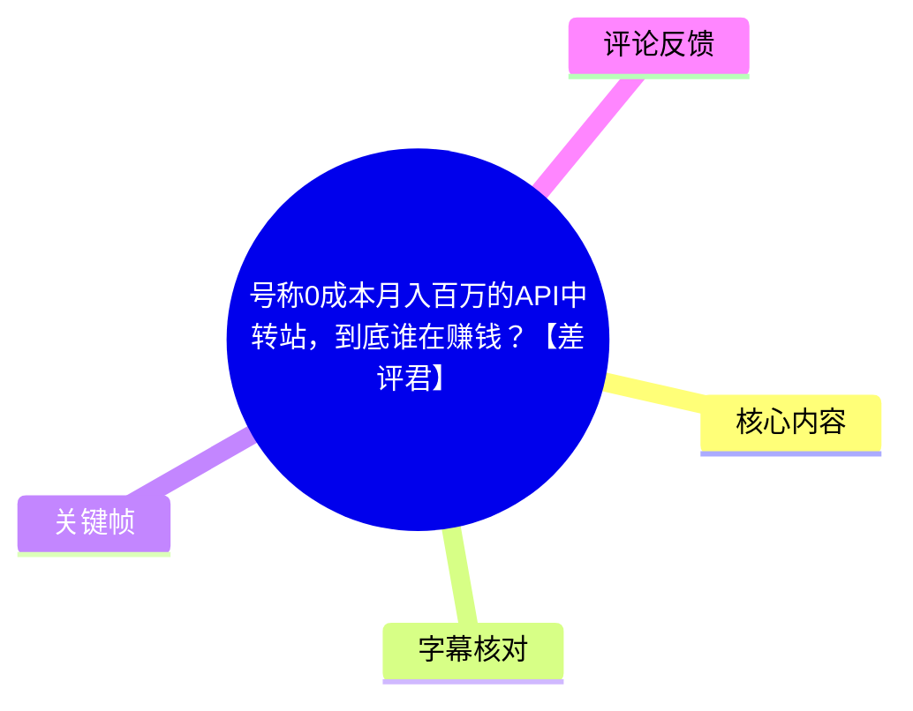
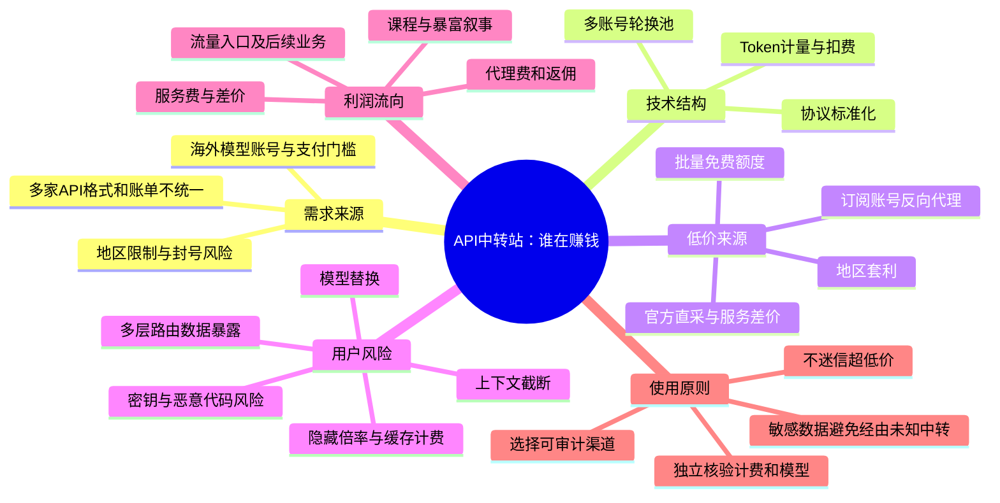
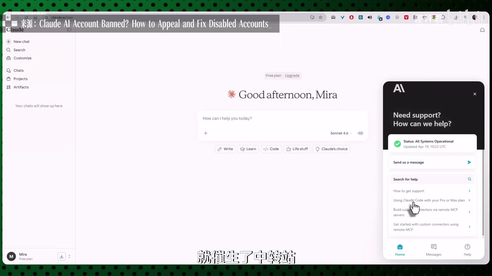
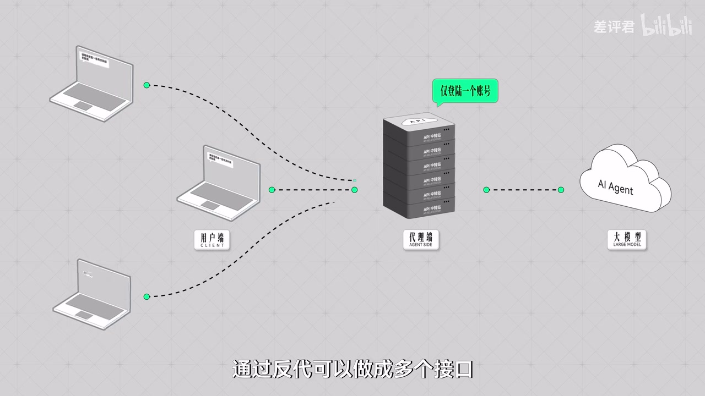
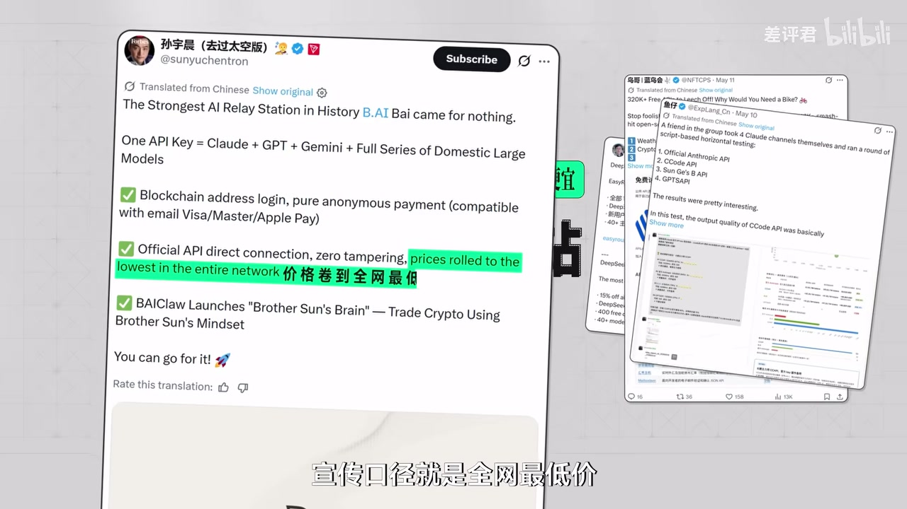

# 号称0成本月入百万的API中转站，到底谁在赚钱？【差评君】

> 来源：[Bilibili 视频](https://www.bilibili.com/video/BV1ZmG46MEut) 
> UP 主：差评君｜时长：13 分 15 秒｜分辨率：3840×2160｜发布日期：2026-05-23  
> 标签：AI、大模型、Token、API 中转站

## 小结

视频围绕 API 中转站（又称 API 网关、聚合站、反向代理服务）展开：它一边解决海外大模型官方入口在账号、支付、地区、封号风险、接口规格和账单管理上的使用门槛；另一边也可能成为不透明计费、模型替换、上下文截断、数据泄露乃至黑灰产链条的载体。

从技术构成看，视频将中转站概括为三部分：**协议标准化、Token 计量/扣费、多账号轮换池**。用户获得一个统一 Key，即可通过统一格式调用多个模型；运营者则可以在上游接入、计费倍率、路由和账号池中配置业务规则。因此，“一个 Key 接多个模型”本身是正常的工程能力，但它不自动等于服务合规、价格真实或数据安全。

视频最核心的风险提示是信息不对称：页面标价不等于实际计费，用户购买的模型名称不一定等于实际调用的模型，长上下文能力也可能被暗中削弱。视频援引行业从业者、测试和论文结论，称存在隐藏倍率、缓存计费不透明、模型“掺水”、上下文截断及多层转售导致的数据暴露风险；这些均应理解为**视频的调查性陈述和风险主张**，不能据此直接推定所有中转站均存在违规行为。

在“谁赚钱”这一问题上，视频的判断是：低价中转站在合规前提下利润空间有限；尤其当价格低至官方的 5 折、3 折时，其可持续性值得警惕。真正更稳定的获利环节可能是代理费、返佣、课程、流量入口，以及其后续的代币、社群和品牌业务，而不必然是面向终端用户出售 Token 的差价。

本视频适合需要调用海外模型 API 的个人开发者、创业团队、采购人员与安全负责人。可迁移的实践结论是：不要把“低价”“正版检测通过”“有站长”“支持多模型”当作可信服务的充分条件；对代码、密钥、客户数据、隐私文本和生产业务，应优先使用官方渠道或经过组织审查的供应商，并建立独立的计费、模型能力和安全验证。

时效性方面，视频讨论的是 2026 年前后的市场现象。模型价格、官方地区政策、KYC 规则、服务商资质和站点运营状态都可能快速变化；视频里涉及的个案、平台、人物、论文数字与行业转述未随素材提供原始链接，使用时应进一步核验。

## 思维导图

## 目录

- [需求为何催生中转站](#需求为何催生中转站)
- [中转站的技术结构与正常价值](#中转站的技术结构与正常价值)
- [低价从哪里来：合规转售与高风险供给](#低价从哪里来合规转售与高风险供给)
- [计费陷阱：倍率与缓存账单](#计费陷阱倍率与缓存账单)
- [服务质量风险：换模型与截断上下文](#服务质量风险换模型与截断上下文)
- [数据、安全与黑灰产风险](#数据安全与黑灰产风险)
- [代理生意与利润流向](#代理生意与利润流向)
- [实践：选择与验收 API 服务的步骤](#实践选择与验收-api-服务的步骤)
- [结论、限制与时效性](#结论限制与时效性)
- [关键帧索引](#关键帧索引)
- [字幕比对](#字幕比对)
- [评论分析](#评论分析)
- [处理记录](#处理记录)

## 需求为何催生中转站 [00:00:30](https://www.bilibili.com/video/BV1ZmG46MEut?t=30)

视频从“0 成本、月入百万”的 API 中转站宣传切入，提出问题：为什么这类看似“倒卖 Token”的业务会吸引不同背景的人参与，又是在解决真实需求，还是在制造新的收割场景？

视频给出的需求背景包括：

1. **海外模型的使用门槛高**：用户可能先后遇到账号注册、支付、地区限制与封号风险，尚未实际使用模型便被阻塞。
2. **多供应商接入复杂**：OpenAI、Claude、Gemini 等模型各有优势，但 API 规格、计费方式、速率限制和账单后台并不一致。
3. **需求不会因麻烦消失**：AI 爱好者、程序员和企业仍有模型调用需求，于是希望用一个入口解决多模型接入与结算。

视频认为，这些摩擦为中转站提供了市场空间：它向用户承诺“一个 Key 调多个模型”“减少注册和充值负担”“价格更低”。但“价格低、免封号”等承诺本身不能说明上游合规性或服务质量。

> 图：画面展示 Claude 网页端和“账号被禁用/申诉”相关来源标注，用来说明视频所说的海外服务账号、地区和访问门槛，是中转站需求形成的背景之一。

## 中转站的技术结构与正常价值 [00:01:42](https://www.bilibili.com/video/BV1ZmG46MEut?t=102)

视频以开源项目 **OneAPI** 为例，称其被不少商业平台二次开发，并将 API 中转站的底层能力概括为以下三个模块。

### 1. 协议标准化

不同大模型 API 的请求格式、认证形式、模型命名和返回结构不同。中转站扮演“万能转接插头”的角色：接收统一格式的请求，再将其转换为上游供应商可处理的格式。

这项能力的工程价值在于降低客户端适配成本；但也意味着用户请求会先经过中转站服务器，而非直接从用户系统发送给模型官方。

### 2. Token 计量与扣费

中转站需记录输入、输出或其他计费维度的 Token 用量，并据此扣减用户余额。视频将其类比为“水表”。

需要注意的是，计量层同时也是最容易出现信息不透明的环节。若用户无法获得上游原始用量、明确费率规则和可核验日志，就难以独立判断扣费是否符合公开价格。

### 3. 多账号轮换池

运营者可将多个 API Key 或账号放入资源池中，在某一账号不可用时切换下一个账号。对服务可用性而言，这是容灾或负载调度思路；但若账号来源不合规、依赖批量注册或规避平台控制，则会将上游封禁风险转嫁给下游用户。

> 图：关键帧用“用户端 → 代理端/API 中转站 → 大模型/AI Agent”的结构展示了视频讨论的核心链路。它直观说明：中转站处于请求、内容和密钥经过的中间位置，因此同时具备兼容、路由、计费与潜在读取数据的能力。

## 低价从哪里来：合规转售与高风险供给 [00:02:31](https://www.bilibili.com/video/BV1ZmG46MEut?t=151)

视频指出，中转站最常见的营销话术是“比官方便宜”，并将低价来源分为相对正规的直采转售，以及风险更高的套利、反代和“薅免费额度”等方式。

### 相对正规的路径：上游直采后转售

视频称，部分较大的中转站可能具备境外公司资质，可以从 Anthropic、OpenAI 等官方渠道采购 API，再向国内用户销售，收入来自服务费与价差。

这一模式的前提是上游合同、地区使用、转售权限与数据处理均符合相关规则。仅有“境外主体”或“官方直连”宣传，不足以证明这些前提已经满足。

### 视频列举的高风险低价来源

| 路径 | 视频描述 | 对用户的直接影响 |
| --- | --- | --- |
| 地区套利 | 从价格较低地区订阅 Token 后转售 | 可能触发地区限制、账号封禁和服务中断 |
| 反向代理 | 将个人订阅账号的模型访问自动化，包装为多个 API 接口 | 订阅条款、并发与稳定性可能不支持；用户数据会先到中间服务 |
| 批量免费额度 | 大量注册新账号，将赠送额度作为“货源”销售 | 平台封控后可能迅速失效，用户余额与服务连续性风险高 |
| 多账号池 | 账号失效自动切换 | 若账号来源不透明，用户难以判断实际风险和服务来源 |

视频称，上述依赖套利或免费额度的方式可能很快遭遇平台封控，随后用户会看到中转站以“不可抗力”“技术调整”等理由暂停服务。这里的“半小时不到被封”等具体表述属于视频观点，未提供可复核的逐案证据。

> 图：画面展示与“全网最低价”“一个 API Key 覆盖 Claude、GPT、Gemini 等模型”相关的推广信息。它适合用来理解视频为何将极端低价作为审查供给来源、计费规则和持续性的信号，而不是服务可靠性的证明。

## 计费陷阱：倍率与缓存账单 [00:04:32](https://www.bilibili.com/video/BV1ZmG46MEut?t=272)

视频认为，用户面对的第一类核心信息不对称是**页面价格与后台实际扣费规则可能不同**。

### 隐藏倍率

所谓“暗改倍率”，按视频解释，是指页面展示的是一套单价，而后台对实际 Token 用量乘以隐藏系数后再扣费。例如用户实际消耗 1 Token，平台可能按 2、3 甚至 5 Token 扣费。

视频援引一篇 ACM 互联网测量大会论文，称对真实商业网关的评测发现，实际收费比预期计算高出 **62.8%**，且其上报用量数据看起来没有明显异常。由于素材中没有论文标题、作者、链接和实验条件，这一数字应作为视频转述记录，不宜直接外推至全部服务商。

### Claude 等复杂计费场景

视频强调，部分模型的费用不只有“输入 Token + 输出 Token”，还可能区分：

- 输入 Token；
- 输出 Token；
- 缓存写入；
- 缓存读取；
- 上下文处理等其他项目。

以代码任务为例：首次请求中放入项目文件、系统提示词与工具说明，可能需要写入缓存、成本较高；连续多轮会话中，重复上下文若能命中缓存，后续成本本应下降。视频担忧的是，中转站可将缓存读取按普通输入计费，或额外叠加倍率，而用户通常看不到上游原始账单。

### 充值积分的额外不透明性

当平台出售的是“积分”而不是明码标价的 Token 额度时，用户还需要确认：

- 1 积分对应何种模型、何种计费项；
- 不同模型是否采用不同倍率；
- 输入、输出、缓存读写如何折算；
- 模型切换、失败重试、流式中断是否扣费；
- 是否能导出逐请求日志并与本地请求记录对账。

## 服务质量风险：换模型与截断上下文 [00:06:47](https://www.bilibili.com/video/BV1ZmG46MEut?t=407)

视频进一步把风险从“花多少钱”扩展到“实际得到了什么”。

### 模型替换或降级

视频转述行业从业者观察，称其调查的 9 家供应商中接近一半存在“掺水”情况。具体表现可能是：用户购买的是 Claude Opus 等旗舰模型，实际却被路由到较低规格模型，甚至是本地部署的开源模型。

视频提出的可观察迹象包括：

- 同一提示词的回答质量在一段时间后明显下降；
- 输出语言风格、代码注释风格或能力边界出现变化；
- 出现与目标模型惯常表现不一致的表达；
- 用户购买更高价套餐后，效果并未稳定改善。

但这些迹象只能作为排查线索：模型输出存在随机性，提示词、参数、上下文、服务负载与上游版本更新也会改变结果，不能凭单次回答就断定发生了替换。

### 上下文截断

视频称，测试人员使用 25 轮对话进行测试时，在某些网关上模型到第 24 轮已经无法复述第 10 轮设定的信息。视频据此认为，依赖长期上下文、复杂代码分析或多轮 Agent 任务的应用，可能在用户未知的情况下处于降级运行状态。

实践上，可通过固定测试集验证：

1. 固定系统提示词、模型名、温度等参数；
2. 构造带有唯一标记的长上下文；
3. 在指定轮次要求模型回溯并引用早期标记；
4. 对比官方直连与中转渠道的响应、延迟、用量和可复现率；
5. 多次重复，避免将偶发输出误认为稳定差异。

## 数据、安全与黑灰产风险 [00:08:07](https://www.bilibili.com/video/BV1ZmG46MEut?t=487)

视频对中转站最严厉的警示集中在数据路径与供应链安全。

### 多层路由扩大暴露面

用户发送给中转站的提示词、代码、文件及其 API Key，理论上都可能经过中转服务的基础设施。视频称，用户购买的 API 权限背后还可能来自另一个聚合平台，整条链路可能经过 **4 个以上独立节点**。

一旦任一节点被攻破、错误配置或恶意运营，数据都可能被读取、留存或篡改。对于业务代码、私钥、客户资料、未公开创意、合同内容、医疗或金融数据，这一风险尤其不可忽略。

### 视频转述的安全事件与研究结果

视频列举了以下主张：

- 有境外大站被曝光将用户对话打包出售给 AI 公司用于模型训练；
- 某广泛使用的开源路由框架曾发生供应链投毒，导致经手密钥和凭证泄露；
- 一篇名为《Agent is Mine》的论文对 428 个中转站进行沙盒测试，发现其中 9 个向用户注入恶意代码、17 个触发 AWS 测试密钥盗用、1 个直接转走研究者部署的私钥钱包资金。

上述都是视频中的转述，素材没有提供原始报道、漏洞公告或论文链接。尤其“注入恶意代码”“盗用密钥”“转走资金”等内容属于重大安全指控，不能在未查验原始研究设计、样本范围、复现实验和站点身份的情况下扩大为行业普遍事实。

### 视频提及的灰黑产链条

视频还声称，部分供给可能关联批量注册、虚假账号、信用卡盗刷、窃取 API Key、洗钱，以及在 KYC 要求加强后收集、转售人脸和证件信息等活动。这些属于高风险、涉嫌违法的行为描述。对普通用户而言，结论不是尝试规避规则，而是：

- 不参与购买、租赁、转卖来源不明账号或身份认证材料；
- 不将 API Key、云平台凭证、钱包私钥发送给未知服务；
- 不在未知中转站上传包含机密的代码库、文档或数据库导出文件；
- 对生产环境服务实施最小权限、短期令牌、密钥轮换和访问审计。

## 代理生意与利润流向 [00:10:10](https://www.bilibili.com/video/BV1ZmG46MEut?t=610)

视频以一次代理招募案例说明其对“0 成本月入百万”叙事的质疑：发布者在小红书联系到中转站代理，对方称缴纳 **300 元代理费**、返佣 **30%** 即可开始赚钱，并以“手下 50 个代理一周赚 5 万”“300 元一周回本”等说法推广。

视频认为，这种模式出售的往往不是技术服务，而是拉新、代理和分销话术，并将其类比为微商式扩张。其进一步转述一位从业近一年的行业人士观点：中转站行业竞争激烈、价格战普遍，代理网络成为大站扩大用户量和议价能力、小站维持生存的共同手段。

### 视频给出的经营成本现实

视频指出，运营中转站并非“零成本”：

- 上游接口变化后，需要及时维护适配；
- 账号被封后，要补充可用资源；
- 上游故障会直接导致用户流失；
- 运营者同时承担开发、运维、客服和售后工作；
- 市场低价竞争会挤压正常服务的利润空间。

视频引述“行业内算账”称：在合规手段下，若定价低于官方价格的 **7 折**，就不可能盈利；但市场上已有 **5 折甚至 3 折** 的报价。该阈值依赖模型、地区、采购规模、支付成本、带宽、人力和合同条件，素材没有提供计算明细，故应视为视频的行业判断，而非通用财务定律。

视频的最终判断是：更稳定的获利者可能是出售代理资格、课程和“暴富神话”的人；而一些大型玩家将中转站当成流量入口，收益可能来自后续的代币、社群与品牌业务。这个判断解释了为何终端 API 差价很薄时，仍有人积极推广代理体系。

## 实践：选择与验收 API 服务的步骤 [00:11:23](https://www.bilibili.com/video/BV1ZmG46MEut?t=683)

以下流程依据视频的风险点整理，目的是降低使用风险，并非视频中提供的官方操作教程。

### 1. 先按数据敏感度决定是否可使用中转

| 数据等级 | 建议 |
| --- | --- |
| 公开测试文本、无敏感示例 | 可在明确风险后进行小额、隔离测试 |
| 内部代码、业务文档、客户信息 | 优先官方直连或完成安全审查的企业供应商 |
| 密钥、私钥、生产数据库、身份材料 | 不应提交给来源不明的中转服务 |
| 受监管或高度敏感数据 | 应遵循组织安全、隐私、合规与数据跨境规定，不以低价替代审查 |

### 2. 核验服务主体与规则

至少确认其公开的：

- 运营主体、联系方式和服务协议；
- 隐私政策、数据保存期限、是否用于训练、是否允许人工访问；
- 上游来源或可验证的授权说明；
- 模型名、上下文窗口、速率限制和故障处理规则；
- 退款政策、余额有效期、服务状态页与变更公告。

如果这些基础信息缺失，或只能通过私聊、群聊、代理口头承诺获得，风险通常较高。

### 3. 用小额和非敏感内容做计费验收

- 先充值最小可接受金额，不因“充值送更多”一次性大额入金；
- 保存每次请求的本地时间、模型名、输入/输出长度、响应状态和余额变化；
- 使用固定短提示词测试输入与输出计费；
- 使用包含重复上下文的多轮任务，观察缓存场景下费用是否符合公开规则；
- 对异常扣费及时停止使用，保留页面价格、请求日志、余额截图和客服记录。

### 4. 用可复现基准检查模型与上下文能力

可设计一组不含敏感信息的测试题，覆盖：

- 代码生成与修复；
- 多轮上下文回忆；
- 结构化输出；
- 工具调用格式；
- 长文本摘要和引用；
- 同一输入的多次稳定性。

将结果与官方直连或可信渠道的同模型、同参数结果进行多次对照。注意：这只能发现异常，不一定能从黑盒输出中准确证明实际底层模型身份。

### 5. 做好密钥隔离和失效预案

- 为不同项目分别创建 Key、配额和权限；
- 不授予中转 Key 云平台管理权限、代码仓库写权限或钱包权限；
- 设定消费上限、告警阈值和速率限制；
- 定期轮换密钥；
- 预留官方直连或第二供应商作为故障切换方案；
- 对“接口突然不可用”“余额异常消耗”“模型能力骤降”设置停用与复盘机制。

## 结论、限制与时效性 [00:12:11](https://www.bilibili.com/video/BV1ZmG46MEut?t=731)

视频把 API 中转站描述为 AI 基础设施尚未充分打通时出现的“灰色裂隙”：大模型从尝鲜工具逐渐成为类似电力、宽带和云服务的基础能力，但官方入口存在区域、支付、账户与稳定性限制，于是有人提供便利服务，也有人套利、收割甚至从事违法活动。

这一框架有两个需要同时保留的判断：

1. **中转能力本身是中性的工程能力。** 协议兼容、统一网关、请求路由、用量计量与故障切换，是企业 API 管理中常见的技术需求。
2. **中转服务的可信度必须逐项验证。** 一旦中间方控制路由、日志、账单与上游账号，用户就必须审查价格透明度、模型真实性、数据边界、密钥权限和持续运营能力。

视频对行业整体持强烈批判态度，并用了“灰产”“洗钱”“诈骗”“收割”等表述。本文已尽量将其与可由素材直接确认的信息区分：视频提供了论点、案例转述与若干数字，但没有附上全部一手材料。因此，对任何具体平台、人物、论文或安全事件，不应仅依据视频或评论得出事实定论。

截至视频所述时间，模型厂商政策、区域可用性、价格、KYC 与账号封控策略都存在显著时效性。实际采购与接入前，应复核官方当前条款、模型定价页、数据处理协议、安全公告和本地法律要求。

## 关键帧索引

| 时间 | 关键帧 | 画面价值 |
| --- | --- | --- |
| [00:00:30](https://www.bilibili.com/video/BV1ZmG46MEut?t=30) |  | 以服务器机柜视觉开场，建立“API 基础设施/中转链路”的主题氛围。 |
| [00:01:18](https://www.bilibili.com/video/BV1ZmG46MEut?t=78) |  | 对应海外模型账号和服务可用性门槛，是中转站需求背景的直观补充。 |
| [00:02:31](https://www.bilibili.com/video/BV1ZmG46MEut?t=151) |  | 展示“全网最低价”等促销话术，支撑对超低价供给来源的讨论。 |
| [00:03:19](https://www.bilibili.com/video/BV1ZmG46MEut?t=199) |  | 清晰呈现用户、中转站与大模型之间的代理结构，是理解计费、路由和数据风险的关键示意图。 |

## 字幕比对

| 字幕来源 | 完整性 | 专有名词 | 时间轴 | 主要问题 |
| --- | --- | --- | --- | --- |
| Bilibili 站内字幕 `p01-ai-zh.srt` | 与本视频内容严重不匹配 | 大量为车机、导航、歌曲内容 | 虽有时间轴，但覆盖约 00:00:11—00:07:55 的内容与画面主题不符 | 疑似错误关联到其他视频，不能用于正文事实整理 |
| 本次 ASR 字幕 | 高，诊断显示语音覆盖约 94.43%，时间范围 00:00:30—00:13:12 | 存在明显误识别，如“Cloud”“Gemline”“中软站”“Enthroping”等 | 有真实分段时间戳，可用于章节定位 | 首段切分异常短；中文同音词、模型名、人名、论文名与术语错识别较多 |

### 最终字幕选择与校正原则

正文以**本次 ASR 时间轴**为主要依据，因为它与视频标题、关键帧和整体内容一致，且 `asr-result.json` 显示存在音轨：音频时长约 **794.58 秒**、识别语言为中文、`noAudioStream` 未标记为 `true`。因此，本任务不存在“源视频没有音轨”的情况。

站内字幕已经检查，但其内容是车载空调、导航、音乐等，与本视频 API 中转站主题不一致，未被采用。

结合视频标题、画面和上下文，对 ASR 中影响理解的术语作了保守校正：

- “中软站 / 中轢站”统一写作“API 中转站”；
- “Cloud”按语境写作“Claude”，但不对每个具体模型版本作超出素材的补充；
- “Gemline”按语境写作“Gemini”；
- “Enthroping”按语境写作“Anthropic”；
- “OneAPI”保留为视频提及的开源项目名称；
- “Agent is Mine”保留 ASR 所识别的论文名拼写，并明确素材没有提供原文链接，避免擅自修订为其他论文。

## 评论分析

以下仅处理可获取的热评前三条。评论是个人观点或经验反馈，不构成对具体平台、产品或行业情况的独立验证。

### 1. 百慕OvO（1715 赞）

> “真正赚钱的人：”

这是一条未展开的调侃式评论。它呼应视频“真正稳定获利者未必是底层中转站运营者”的主题，但没有补充事实、案例或可验证信息，因此只能视作观众对视频结论的情绪化认同。

### 2. 歌奈Goena（1322 赞）

> “deepseek真的太骗人了，说好的下半年才大幅降价，结果现在就永久降价了”其他厂家如是说道[吃瓜]

该评论以反讽方式讨论模型厂商降价对其他厂商和中转市场的冲击。其隐含观点是：官方价格调整可能迅速压缩中间渠道的套利空间，也会让“低价优势”失去稳定性。

不过，评论没有提供 DeepSeek 的具体公告、时间和价格信息，不能将其作为价格变化事实的证据。它的价值在于提醒读者：API 中转定价高度依赖上游官方价格，不能把某一时点的折扣视为长期商业优势。

### 3. 園姫（916 赞）

该用户分享了一次使用某“Codex 中转”服务的经历：以 20 元购买标称 200 美元额度，但一个简单的数据输出格式任务运行约一小时后即耗尽额度；其自述测试发现输出代码注释方法和“思维链格式”不像 Codex，评论后被对方拉黑。评论最终建议，不要轻信显著低于官方价格的反代服务。

这条评论为视频的“异常扣费、模型替换、低价风险”提供了一个用户侧案例，但存在以下限制：

- 仅是单一用户陈述，缺少站点名称、请求日志、账单明细、模型响应原文和独立复现材料；
- “不像 Codex”的判断受模型版本、提示词、参数、上下文和主观体验影响；
- 无法据此证明该服务一定替换模型、出售数据或存在违法行为。

其可取之处是实践提醒：遇到“低价高额度”服务，应小额测试、保留日志并核验消费曲线，而不是仅凭宣传或一次模型检测结果建立信任。

## 处理记录

- Worker ID：`worker-mrj0wjed-b0c290ad`
- 模型：`gpt-5.6-terra`
- 素材与工具：使用任务提供的元数据、关键帧清单、站内 SRT、`asr/transcript.srt`、`asr/asr-result.json` 诊断结果、热评 JSON；本次 ASR 模型为 `medium`，运行设备为 CUDA，计算类型为 `float16`。
- 字幕选择：已检查站内字幕与本次 ASR。站内字幕内容与本视频不符，弃用；采用本次 ASR 的真实时间戳作为章节时间轴，并以标题、上下文和关键帧对明显术语误识别进行保守校正。
- 音轨检查：ASR 诊断未标记 `noAudioStream=true`；识别到中文音频，语音覆盖率约 94.43%，故按含音轨视频处理。
- 关键帧选择依据：选用 `frame-001` 至 `frame-004`，分别服务于开场主题、海外模型使用门槛、低价营销与 API 中转调用链路；仅引用提供列表中可见且与正文直接相关的帧路径。
- 时间轴依据：所有章节链接按 ASR SRT 分段起点换算秒数生成，未按文字顺序猜测时间位置。
- 缓存清理：素材未提供缓存清理命令或执行结果；为避免编造，不声明已清理缓存。
- 未解决问题：视频涉及的具体服务商、人物关联、论文名称与实验数字缺少原始链接或完整引文；本文保留为“视频称/视频转述”，未将其升级为已独立验证事实。
