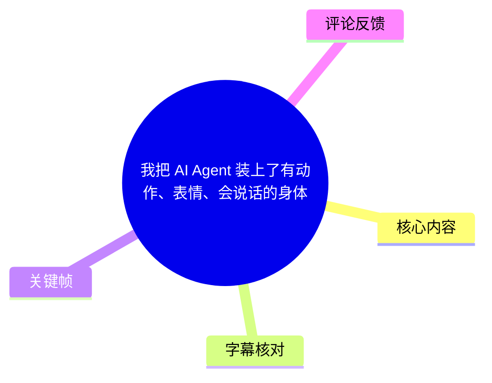
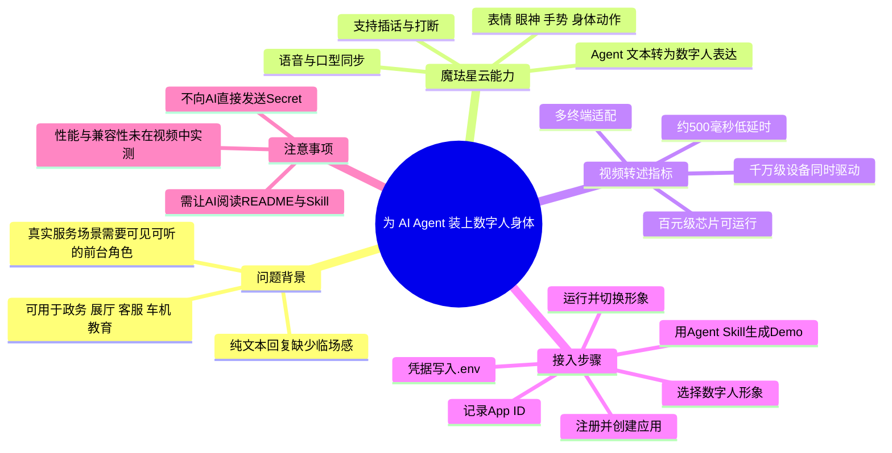
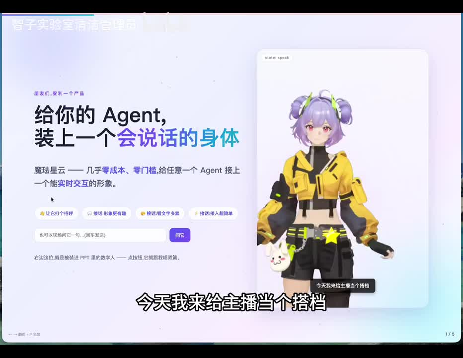
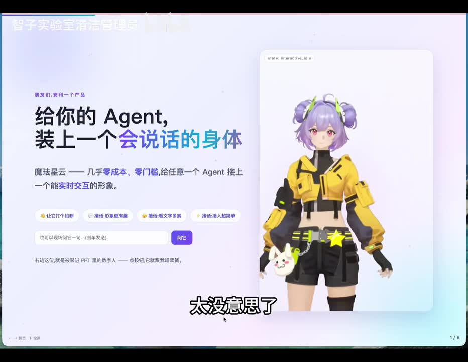
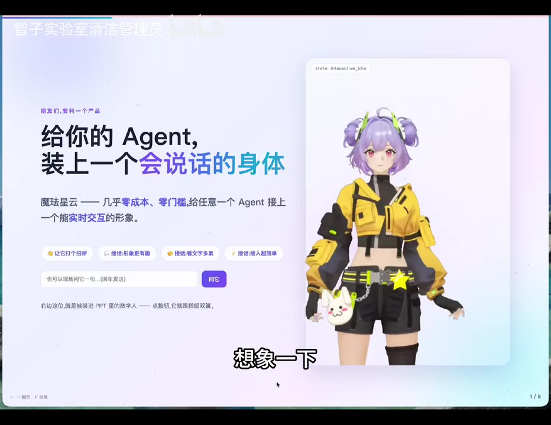
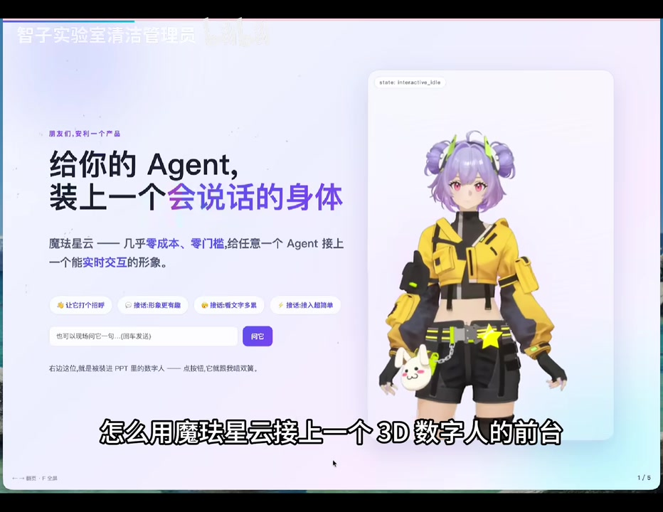

# 我把 AI Agent 装上了有动作、表情、会说话的身体

> 来源：[Bilibili 视频](https://www.bilibili.com/video/BV1kdEJ63EFm)  
> UP 主：智子实验室清洁管理员｜时长：4 分 19 秒｜合集：AIcode  
> 主题：通过“魔珐星云”为现有 AI Agent 接入可说话、有表情和动作的 3D 数字人前台，并借助 Agent Skill 快速生成示例项目。

## 小结

视频介绍了“魔珐星云”这一数字人接入方案。UP 主将其定位为：为任意已有 AI Agent 添加可实时交互的形象，使 Agent 的文本回答进一步表现为语音、口型、表情、眼神、手势与身体动作。

视频的核心不是训练 Agent，也没有展示大模型、语音识别或知识库的实现；它聚焦于**输出层/呈现层**：把 Agent 已生成的回答交给数字人系统，由后者驱动 3D 形象表达。视频演示了数字人与主播插话、政务咨询回答、展厅咨询回答和切换形象等效果。

UP 主转述产品侧能力包括：约 500 毫秒低延时响应、支持随时打断、可适配手机、车机、平板和 PC，且“百元级芯片可以运行”“支持千万级设备同时驱动”。这些均属于视频中对产品官网能力的介绍，视频没有提供压测条件、SDK 版本、设备型号或可复现性能数据，因此不应直接视为独立验证结论。

实际接入流程被压缩为：注册账号 → 控制台创建应用 → 选择形象 → 记录 App ID → 将 GitHub 上的 Agent Skill 交给 AI 协助开发 → 将 App ID 与 App Secret 填入 `.env` → 运行 Demo。视频特别提醒：敏感凭据不要直接发送给 AI，应由开发者自行写入环境变量文件。

该方案适合希望将客服、政务导办、企业展厅、车机、教育平板等文字或语音 Agent 变成可视化前台的开发者、产品人员与独立开发者。其限制在于：视频未展示完整源码、SDK 初始化参数、鉴权方式、计费、并发配额、浏览器/系统兼容性、隐私处理以及生产环境部署方案；“无需写代码”更准确地说是借助预制 Skill 让 AI 代为生成 Demo，并不等于生产接入没有工程工作。

## 思维导图





## 目录

- [背景：为什么 Agent 需要“身体”](#背景为什么-agent-需要身体)
- [产品定位与交互演示](#产品定位与交互演示)
- [表达链路：文本如何变成 3D 数字人](#表达链路文本如何变成-3d-数字人)
- [视频转述的性能与平台能力](#视频转述的性能与平台能力)
- [最小接入闭环：控制台、Skill 与环境变量](#最小接入闭环控制台skill-与环境变量)
- [Demo 效果与切换形象](#demo-效果与切换形象)
- [经验、限制与时效性](#经验限制与时效性)
- [字幕比对](#字幕比对)
- [评论分析](#评论分析)
- [处理记录](#处理记录)

## 背景：为什么 Agent 需要“身体” [00:26](https://www.bilibili.com/video/BV1kdEJ63EFm?t=26)

视频开场由主播与屏幕中的数字人对话，借此提出问题：仅让 Agent 以文字方式回复，交互显得单调；而在一些实际场景中，用户并不适合持续盯着聊天框或日志。

UP 主列出的典型落地环境包括：

- 政务大厅；
- 企业展厅；
- 客服大屏；
- 车机；
- 电视；
- 教育平板。

视频的判断是：在这些现实服务场景中，用户需要的并非单一输入框，而是一个能够被看见、听见、可被打断，并且能够引导其完成操作的“前台角色”。这里的“身体”指 3D 数字人呈现和交互能力，而不是机器人实体硬件。



> 图：画面左侧写有“给你的 Agent，装上一个会说话的身体”，右侧为 3D 数字人。它直观说明视频讨论的是 Agent 的具身化视觉交互界面，而非替换 Agent 的推理能力。

## 产品定位与交互演示 [00:50](https://www.bilibili.com/video/BV1kdEJ63EFm?t=50)

视频将“魔珐星云”描述为一个让开发者以较低开发门槛，为任意 Agent 添加实时交互形象的产品。主播强调，目标形象“不是贴图”，而是可以对话并在对话中表达动作与表情的数字人。

在开场演示中，数字人会针对主播的观点直接接话，例如表达“Agent 光会打字回消息太没意思了”的看法。该演示的价值在于展示一种多角色、可插话的前台体验；但视频没有说明“插话”具体由何种机制触发，例如是否依赖语音活动检测、打断事件、Agent 调度策略或预设脚本。



> 图：界面右上角可见 `state: interactive_idle`，数字人以待机姿态出现在页面中。该画面有助于理解数字人前端不仅是视频播放素材，还存在可区分的互动状态。

视频简介还提到一种概念化的 SDK 调用方式：前端创建数字人实例，再将 Agent 生成的文字交给 `speak()` 一类接口。但正片没有展示实际代码、包名、接口签名或请求字段。因此，这只能作为产品接入思路，不能据此推导可直接运行的代码。

## 表达链路：文本如何变成 3D 数字人 [01:15](https://www.bilibili.com/video/BV1kdEJ63EFm?t=75)

UP 主在介绍官网能力时，给出如下表达链路：

1. Agent 产生一句文本；
2. 数字人系统解析这句话的语义、情绪与动作意图；
3. 系统实时生成声音；
4. 同时驱动口型、表情、眼神、手势和身体动作；
5. 用户看到的是完整的 3D 多模态表达，而非虚拟形象机械朗读文字。

因此，视频所描述的架构关系可以概括为：

| 环节 | 负责内容 | 视频中的说明 |
| --- | --- | --- |
| Agent | 生成回答文本 | 已有 Agent 的“大脑” |
| 数字人系统 | 解析表达意图并驱动形象 | 让输出具有声音、口型、表情、动作 |
| 前端终端 | 显示并承接用户交互 | 屏幕、应用或设备上的“身体” |
| 用户 | 语音/视觉方式接受服务，可打断 | 面向前台角色而非仅面向输入框 |

“语义、情绪、动作意图解析”是视频的产品描述。视频没有披露这些模块是规则驱动、模型驱动还是二者结合，也未展示情绪标签、动作库、流式分片协议或失败回退策略。



> 图：画面中可见数字人、文本输入区域和发送按钮，说明该演示至少包含“输入内容—数字人表达”的交互闭环。它有助于将抽象的多模态输出链路对应到具体界面。

## 视频转述的性能与平台能力 [01:39](https://www.bilibili.com/video/BV1kdEJ63EFm?t=99)

视频援引魔珐星云官网，提到以下能力指标：

| 能力/指标 | 视频表述 | 解读与边界 |
| --- | --- | --- |
| 响应延时 | “500 毫秒低延时驱动响应” | 未说明统计口径：首帧、首音、端到端响应或动作开始时间均未明确。 |
| 对话中断 | 支持随时打断 | 说明目标体验接近真人对话；具体中断 API、状态恢复和音频处理策略未展示。 |
| 并发规模 | 支持千万级设备同时驱动 | 视频未展示压测数据、地域、网络条件或服务等级。 |
| 硬件 | 百元级别芯片也可运行 | 未给出芯片型号、渲染质量、帧率、内存与网络要求。 |
| 终端 | 手机、车机、平板、PC 等 | 视频没有逐项实机演示，也未说明操作系统与浏览器版本。 |

这些指标有助于理解产品期望覆盖的场景，但在选型或上线前，应以当期官方文档、商务方案、SDK 发布说明和实际设备测试为准。特别是车机、嵌入式和政务服务场景，还应验证离线能力、网络波动恢复、内容安全、数据合规与无障碍支持。

## 最小接入闭环：控制台、Skill 与环境变量 [02:03](https://www.bilibili.com/video/BV1kdEJ63EFm?t=123)

视频展示的最小闭环操作如下。

### 1. 注册账号并创建应用 [02:03](https://www.bilibili.com/video/BV1kdEJ63EFm?t=123)

在魔珐星云控制台进入“应用管理”，创建一个应用。视频中的示例应用名称为 `demo`。

这一步的作用是为后续调用准备应用级配置与凭据。视频没有展示账号认证要求、应用地域、回调地址、权限范围或服务套餐设置。

### 2. 选择数字人形象并记录 App ID [02:27](https://www.bilibili.com/video/BV1kdEJ63EFm?t=147)

创建应用后，可以在应用中选择数字人形象。视频称可选形象包括男性、女性和动物等类型；右上角可查看 App 密钥，并需记录后续开发所用的 `APP ID`。

这里应区分两类信息：

- `APP ID`：视频明确要求记录，用于后续接入；
- `APP Secret`：后续 Demo 也要求配置，属于敏感凭据。

视频未展示形象授权范围、资产版权限制、是否支持自定义形象、形象切换是否会改变调用额度等信息。

### 3. 将 Agent Skill 交给 AI 生成 Demo [02:51](https://www.bilibili.com/video/BV1kdEJ63EFm?t=171)

UP 主没有直接手写接入代码，而是提供了一个 Agent Skill。操作是：

1. 复制 GitHub 链接；
2. 把该链接发送给 AI；
3. 要求 AI 帮忙开发一个 Demo；
4. 等待 AI 完成项目生成。

视频强调“完全不用开始写代码”，但其实际含义是：开发者借助一个包含接入知识的 Skill，让 AI 生成代码。最终仍需对项目进行运行、配置、审查与调试；AI 是否能正确安装依赖、理解当前 SDK 版本、处理异常与满足生产要求，视频没有验证。

### 4. 本地配置敏感信息 [03:06](https://www.bilibili.com/video/BV1kdEJ63EFm?t=186)

AI 生成 Demo 后，按要求提供 `APP ID` 和 `APP Secret`。UP 主给出的安全建议是：

- **不要直接把 App ID 与 App Secret 发送给 AI；**
- 应由开发者自行将它们填入 `.env` 文件。

视频未给出变量名、`.env` 文件路径、是否需要前后端隔离，也没有解释 Secret 是否能安全地出现在浏览器端。若项目是纯前端应用，尤其需要确认凭据不会被打包到客户端或暴露在浏览器网络请求中。

可从视频明确提取的配置原则为：

```dotenv
# 变量名以实际项目 README/Skill 生成的模板为准。
# 不要将真实敏感凭据直接发送给第三方 AI 或提交到版本控制系统。
APP_ID=由开发者本地填写
APP_SECRET=由开发者本地填写
```

> 上述变量名依据视频中的称呼整理；视频未展示实际 `.env` 模板，不能据此确认 SDK 所要求的精确字段名。

### 5. 让 AI 阅读说明文件并持续迭代 [03:55](https://www.bilibili.com/video/BV1kdEJ63EFm?t=235)

视频结尾建议，在开发过程中多与 AI 交互以获得目标效果，并重点提醒 AI 阅读项目的 `README` 和 Skill。可迁移的经验是：把 SDK 文档、项目约束、配置模板和验收目标显式提供给编码 Agent，减少其根据模糊描述猜测接口的概率。

## Demo 效果与切换形象 [03:06](https://www.bilibili.com/video/BV1kdEJ63EFm?t=186)

视频运行了一个政务导办风格的示例。用户向 Agent 问候后，数字人以“办理身份证需要带什么材料”为例进行回应，并说明魔珐星云负责将 Agent 的回答实时转为数字人的语音、表情和动作；数字人还会继续提示可查看下一步办理流程。

随后，视频点击“切换形象”，并以“展厅有哪些展区”为新的咨询示例，展示另一名形象继续承担讲解角色。由此可见，视频至少验证了以下演示能力：

- Agent 回答可被数字人以语音、表情和动作表达；
- Demo 可用于政务与展厅两类话术；
- 前端提供形象切换入口；
- 同一类 Agent 输出可以被不同形象承接。



> 图：画面将“怎么用魔珐星云接上一个 3D 数字人的前台”作为演示目标，右侧显示角色模型。这一关键帧适合对应后文的 Demo 接入和角色呈现说明。

需要注意，视频中的政务问答内容只是演示文案，不应当作为真实身份证办理材料的权威指引。实际政务知识库应接入本地最新政策、地区规则、人工兜底流程和内容审核机制。

## 经验、限制与时效性 [03:55](https://www.bilibili.com/video/BV1kdEJ63EFm?t=235)

### 可迁移经验

1. **将能力分层。** 保留已有 Agent 的推理、工具调用和知识能力，把数字人系统作为输出表达层接入，降低改造范围。
2. **先跑最小闭环。** 先验证“文本回答 → 数字人表达 → 前端展示”，再补充语音输入、业务流程、打断控制和多端部署。
3. **将凭据从 AI 对话中隔离。** 以 `.env` 或受控密钥管理服务承载凭据，避免在提示词、聊天记录和源码仓库中泄露。
4. **用文档约束编码 Agent。** 让 AI 阅读 README、Skill 和配置模板，能够显著减少依赖版本与接口参数的猜测。
5. **按场景验证交互价值。** 政务导办、展厅讲解、客服大屏等场景可能受益于可视化前台；对效率优先或屏幕资源紧张的场景，文字或纯语音未必更差。

### 视频未覆盖或尚待验证的限制

- 未提供完整可运行源码、GitHub 链接、SDK 版本与安装命令；
- 未说明鉴权链路、Token 生命周期、密钥是否可安全用于前端；
- 未展示音频输入、语音识别、噪声环境下的打断效果；
- 未披露数字人生成的音频质量、动作重复率、网络中断处理和降级方案；
- 未说明价格、免费额度、并发上限、形象授权和商用条款；
- 未验证“500 毫秒”“千万级设备”“百元级芯片”等产品指标；
- 未讨论在政务、客服等敏感业务中，数字人输出的事实准确性、责任归属和人工转接机制。

### 时效性说明

视频发布信息按元数据为 2026 年 6 月。数字人 SDK、控制台界面、形象库、Agent Skill、性能指标、兼容平台与计费策略均可能迭代。本文只记录视频及其描述中出现的信息；实际接入应以当期官方文档和项目 README 为准。

## 字幕比对

| 字幕来源 | 完整性 | 专有名词 | 时间轴 | 主要问题 |
| --- | --- | --- | --- | --- |
| Bilibili 站内字幕 | 未提供可用字幕 | 无法核验 | 无法使用 | 素材明确标注“未提供可用站内字幕”。 |
| 本次 ASR 字幕 | 覆盖较高：语音约 222.27 秒，占视频约 86.01% | 存在明显误识别 | 可用 | 有 13 个带起止时间的分段；首段异常压缩，且“魔珐星云”“具身”“Agent”等词多次误识别。 |

本次 ASR 使用 `medium` 模型，识别语言为中文，语言置信度约 `0.9976`，音频总时长约 `258.44` 秒。诊断没有标记 `noAudioStream=true`，因此可确认源视频存在音轨；这不是无音轨视频，也不存在因无音轨而被迫仅依赖画面理解的情况。

最终采用策略如下：

- **时间轴：** 采用本次 ASR 提供的 SRT 分段起止时间，章节链接均据其换算秒数生成。
- **文本内容：** 以 ASR 为基础，结合视频标题、简介、关键帧中可读文字和上下文进行有限校正。
- **重要校正：**
  - ASR 中的“魔法星云”“魔法星亘”“魔法心云”等，统一校正为视频标题、简介和画面中一致出现的“魔珐星云”。
  - “实时巨神驱动”依语境校正为“实时具身驱动”。
  - “Aging”“Aging 的回答”等依上下文校正为“Agent 的回答”。
  - “Skilled”依语境校正为“Skill”。
  - “3D 数字人的前排”依上下文理解为“3D 数字人的前台”。
- **保留的不确定性：** 首段 `00:00:26,660—00:00:26,820` 被 ASR 赋予大量文本，明显不符合其 0.16 秒时长；因此本文仅使用其所在起点作为开场章节定位，不将其作为逐字精确转写依据。

## 评论分析

以下仅分析可获取的热评前三条，评论反映的是用户观点，不构成已经验证的产品事实。

1. **あともき（2 赞）：**“這不就是個裝上了臉的豆包而已嗎？”
   - 观点：认为该方案本质上只是给通用对话模型增加形象包装。
   - 价值：指出了“模型能力”与“呈现层能力”应被区分。视频确实重点展示数字人呈现，而非新的推理能力。
   - 局限：评论未比较具体模型、语音能力、动作驱动或产品集成能力，因此“只是”这一结论属于简化评价。

2. **AirTravel冷涡（1 赞）：**认为仅连接大模型与语音对话交互感不足；若再加入屏幕捕捉，让画面和语音信息输入大模型，并让大模型输出并操作本地可用信息，就更接近 AI 助手。
   - 观点：数字人只是交互的一部分，更完整的助手还需要视觉输入、屏幕理解和本地操作能力。
   - 补充价值：提出了从“会说话的前台”走向“可感知、可执行助手”的扩展路径。
   - 边界：视频没有展示屏幕捕捉、本地工具调用或自动操作能力，不能将这些能力归因于魔珐星云。

3. **做游戏的人（1 赞）：**“其实我只想要那个人物，说话有别的方式。”
   - 观点：部分用户的需求可能集中于角色资产或角色呈现，而不是当前视频强调的整套语音表达链路。
   - 价值：提示产品选型时应拆分需求：角色模型、动画、口型、TTS、Agent 接入可以分别采购或替换。
   - 局限：视频未说明是否支持单独购买/导出形象，亦未说明可否替换语音或外接其他说话方式。

## 处理记录

- Worker ID：`worker-mrj0wjed-b0c290ad`
- 模型：`gpt-5.6-terra`
- 可用素材与工具产物：视频元数据、ASR SRT、ASR 分段诊断、关键帧目录、热评 JSON；ASR 模型标识为 `medium`，使用 CUDA / `float16`。
- 字幕选择：站内字幕未提供可用版本；已检查并采用本次 ASR 的带时间戳 SRT 作为时间轴基础，结合标题、简介和关键帧对专有名词及明显误识别做有限校正。
- 音轨检查：ASR 诊断未标记 `noAudioStream=true`，且输出包含音频文件与有效中文语音分段，按“存在音轨”处理。
- 关键帧选择依据：选用 `frames/frame-001.jpg`、`frames/frame-002.jpg`、`frames/frame-003.jpg`、`frames/frame-004.jpg`，因为其分别呈现产品主张、互动待机状态、输入—数字人界面和“接入 3D 数字人前台”的演示主题；未对未提供画面内容的其他帧作未经验证的描述。
- 热评处理：仅处理素材中可获取的前三条热评，未扩展至其他评论。
- 缓存清理：本次任务仅基于已提供的素材文本、元数据和关键帧路径生成，未产生可清理的额外下载缓存；未执行文件删除操作。
- 未解决问题：缺少站内字幕、完整源码、实际 GitHub 地址、SDK 文档版本、精确 API、价格与性能测试条件；相关内容均未编造。
